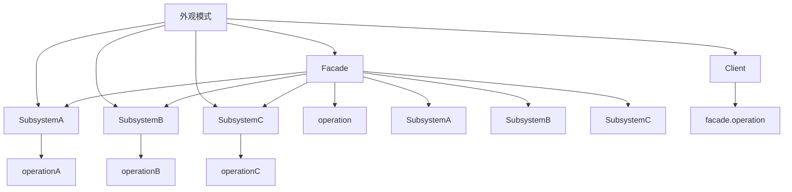

# 🏢 外观模式

[[04-结构型模式/05-装饰器模式]] ← [[04-结构型模式/07-享元模式]]
## 🎯 外观模式概览

### 📊 模式结构图



## 🏗️ 模式定义与特点

### 📋 **模式定义**
外观模式为子系统中的一组接口提供一个一致的界面，外观模式定义了一个高层接口，这个接口使得这一子系统更加容易使用。

### 📋 **核心特点**
- **统一接口**: 为子系统提供统一的接口
- **简化调用**: 简化客户端对子系统的调用
- **隐藏复杂性**: 隐藏子系统的复杂性
- **降低耦合**: 降低客户端与子系统的耦合度

### 📋 **适用场景**
- 需要为复杂子系统提供简单接口
- 需要降低客户端与子系统的耦合度
- 需要分层构建系统
- 需要统一管理子系统

## 🏗️ 模式实现

### 📋 **基础实现**

#### **子系统类**
```java
// ✅ 子系统A
public class SubsystemA {
    public void operationA() {
        System.out.println("SubsystemA operationA");
    }
    
    public void operationA1() {
        System.out.println("SubsystemA operationA1");
    }
}

// ✅ 子系统B
public class SubsystemB {
    public void operationB() {
        System.out.println("SubsystemB operationB");
    }
    
    public void operationB1() {
        System.out.println("SubsystemB operationB1");
    }
}

// ✅ 子系统C
public class SubsystemC {
    public void operationC() {
        System.out.println("SubsystemC operationC");
    }
    
    public void operationC1() {
        System.out.println("SubsystemC operationC1");
    }
}
```

#### **外观类**
```java
// ✅ 外观类
public class Facade {
    private SubsystemA subsystemA;
    private SubsystemB subsystemB;
    private SubsystemC subsystemC;
    
    public Facade() {
        this.subsystemA = new SubsystemA();
        this.subsystemB = new SubsystemB();
        this.subsystemC = new SubsystemC();
    }
    
    public void operation() {
        System.out.println("Facade operation");
        subsystemA.operationA();
        subsystemB.operationB();
        subsystemC.operationC();
    }
    
    public void operation1() {
        System.out.println("Facade operation1");
        subsystemA.operationA1();
        subsystemB.operationB1();
        subsystemC.operationC1();
    }
}
```

#### **使用示例**
```java
// ✅ 客户端使用
public class Client {
    public static void main(String[] args) {
        Facade facade = new Facade();
        
        // 使用外观简化调用
        facade.operation();
        facade.operation1();
    }
}
```

## 🏗️ 实际应用案例

### 📋 **计算机启动外观案例**

#### **计算机启动外观**
```java
// ✅ CPU子系统
public class CPU {
    public void start() {
        System.out.println("CPU starting...");
    }
    
    public void execute() {
        System.out.println("CPU executing instructions...");
    }
    
    public void shutdown() {
        System.out.println("CPU shutting down...");
    }
}

// ✅ 内存子系统
public class Memory {
    public void load() {
        System.out.println("Memory loading...");
    }
    
    public void read() {
        System.out.println("Memory reading data...");
    }
    
    public void write() {
        System.out.println("Memory writing data...");
    }
    
    public void clear() {
        System.out.println("Memory clearing...");
    }
}

// ✅ 硬盘子系统
public class HardDrive {
    public void spinUp() {
        System.out.println("Hard drive spinning up...");
    }
    
    public void read() {
        System.out.println("Hard drive reading data...");
    }
    
    public void write() {
        System.out.println("Hard drive writing data...");
    }
    
    public void spinDown() {
        System.out.println("Hard drive spinning down...");
    }
}

// ✅ 显卡子系统
public class GraphicsCard {
    public void initialize() {
        System.out.println("Graphics card initializing...");
    }
    
    public void render() {
        System.out.println("Graphics card rendering...");
    }
    
    public void shutdown() {
        System.out.println("Graphics card shutting down...");
    }
}

// ✅ 计算机外观
public class ComputerFacade {
    private CPU cpu;
    private Memory memory;
    private HardDrive hardDrive;
    private GraphicsCard graphicsCard;
    
    public ComputerFacade() {
        this.cpu = new CPU();
        this.memory = new Memory();
        this.hardDrive = new HardDrive();
        this.graphicsCard = new GraphicsCard();
    }
    
    public void startComputer() {
        System.out.println("=== Starting Computer ===");
        cpu.start();
        memory.load();
        hardDrive.spinUp();
        graphicsCard.initialize();
        System.out.println("Computer started successfully!");
    }
    
    public void shutdownComputer() {
        System.out.println("=== Shutting Down Computer ===");
        graphicsCard.shutdown();
        hardDrive.spinDown();
        memory.clear();
        cpu.shutdown();
        System.out.println("Computer shut down successfully!");
    }
    
    public void runProgram() {
        System.out.println("=== Running Program ===");
        cpu.execute();
        memory.read();
        memory.write();
        hardDrive.read();
        hardDrive.write();
        graphicsCard.render();
        System.out.println("Program executed successfully!");
    }
}
```

#### **使用示例**
```java
// ✅ 使用示例
public class ComputerDemo {
    public static void main(String[] args) {
        ComputerFacade computer = new ComputerFacade();
        
        // 启动计算机
        computer.startComputer();
        
        System.out.println();
        
        // 运行程序
        computer.runProgram();
        
        System.out.println();
        
        // 关闭计算机
        computer.shutdownComputer();
    }
}
```

### 📋 **订单处理外观案例**

#### **订单处理外观**
```java
// ✅ 库存管理子系统
public class InventoryService {
    public boolean checkStock(String productId, int quantity) {
        System.out.println("Checking stock for product " + productId + ", quantity: " + quantity);
        // 模拟库存检查
        return true;
    }
    
    public void reserveStock(String productId, int quantity) {
        System.out.println("Reserving stock for product " + productId + ", quantity: " + quantity);
    }
    
    public void releaseStock(String productId, int quantity) {
        System.out.println("Releasing stock for product " + productId + ", quantity: " + quantity);
    }
}

// ✅ 支付处理子系统
public class PaymentService {
    public boolean processPayment(String paymentMethod, double amount) {
        System.out.println("Processing payment: " + paymentMethod + ", amount: $" + amount);
        // 模拟支付处理
        return true;
    }
    
    public void refundPayment(String paymentId, double amount) {
        System.out.println("Refunding payment " + paymentId + ", amount: $" + amount);
    }
}

// ✅ 物流配送子系统
public class ShippingService {
    public String createShipment(String orderId, String address) {
        System.out.println("Creating shipment for order " + orderId + " to " + address);
        return "SHIP_" + orderId;
    }
    
    public void trackShipment(String shipmentId) {
        System.out.println("Tracking shipment " + shipmentId);
    }
    
    public void deliverShipment(String shipmentId) {
        System.out.println("Delivering shipment " + shipmentId);
    }
}

// ✅ 通知服务子系统
public class NotificationService {
    public void sendOrderConfirmation(String orderId, String email) {
        System.out.println("Sending order confirmation to " + email + " for order " + orderId);
    }
    
    public void sendShippingNotification(String orderId, String email, String shipmentId) {
        System.out.println("Sending shipping notification to " + email + " for order " + orderId + ", shipment: " + shipmentId);
    }
    
    public void sendDeliveryNotification(String orderId, String email) {
        System.out.println("Sending delivery notification to " + email + " for order " + orderId);
    }
}

// ✅ 订单处理外观
public class OrderProcessingFacade {
    private InventoryService inventoryService;
    private PaymentService paymentService;
    private ShippingService shippingService;
    private NotificationService notificationService;
    
    public OrderProcessingFacade() {
        this.inventoryService = new InventoryService();
        this.paymentService = new PaymentService();
        this.shippingService = new ShippingService();
        this.notificationService = new NotificationService();
    }
    
    public boolean processOrder(String orderId, String productId, int quantity, 
                               String paymentMethod, double amount, String email, String address) {
        System.out.println("=== Processing Order " + orderId + " ===");
        
        try {
            // 1. 检查库存
            if (!inventoryService.checkStock(productId, quantity)) {
                System.out.println("Insufficient stock for product " + productId);
                return false;
            }
            
            // 2. 处理支付
            if (!paymentService.processPayment(paymentMethod, amount)) {
                System.out.println("Payment failed for order " + orderId);
                return false;
            }
            
            // 3. 预留库存
            inventoryService.reserveStock(productId, quantity);
            
            // 4. 创建配送
            String shipmentId = shippingService.createShipment(orderId, address);
            
            // 5. 发送确认通知
            notificationService.sendOrderConfirmation(orderId, email);
            notificationService.sendShippingNotification(orderId, email, shipmentId);
            
            System.out.println("Order " + orderId + " processed successfully!");
            return true;
            
        } catch (Exception e) {
            System.out.println("Error processing order " + orderId + ": " + e.getMessage());
            // 回滚操作
            inventoryService.releaseStock(productId, quantity);
            paymentService.refundPayment(orderId, amount);
            return false;
        }
    }
    
    public void trackOrder(String orderId, String email) {
        System.out.println("=== Tracking Order " + orderId + " ===");
        shippingService.trackShipment("SHIP_" + orderId);
    }
    
    public void deliverOrder(String orderId, String email) {
        System.out.println("=== Delivering Order " + orderId + " ===");
        shippingService.deliverShipment("SHIP_" + orderId);
        notificationService.sendDeliveryNotification(orderId, email);
    }
}
```

#### **使用示例**
```java
// ✅ 使用示例
public class OrderProcessingDemo {
    public static void main(String[] args) {
        OrderProcessingFacade orderFacade = new OrderProcessingFacade();
        
        // 处理订单
        boolean success = orderFacade.processOrder(
            "ORDER_001", 
            "PRODUCT_123", 
            2, 
            "Credit Card", 
            99.99, 
            "customer@example.com", 
            "123 Main St, City, State"
        );
        
        if (success) {
            System.out.println();
            
            // 跟踪订单
            orderFacade.trackOrder("ORDER_001", "customer@example.com");
            
            System.out.println();
            
            // 配送订单
            orderFacade.deliverOrder("ORDER_001", "customer@example.com");
        }
    }
}
```

### 📋 **多媒体播放器外观案例**

#### **多媒体播放器外观**
```java
// ✅ 音频解码子系统
public class AudioDecoder {
    public void initialize() {
        System.out.println("Audio decoder initializing...");
    }
    
    public void decode(String audioFile) {
        System.out.println("Decoding audio file: " + audioFile);
    }
    
    public void play() {
        System.out.println("Playing audio...");
    }
    
    public void stop() {
        System.out.println("Stopping audio...");
    }
    
    public void cleanup() {
        System.out.println("Audio decoder cleanup...");
    }
}

// ✅ 视频解码子系统
public class VideoDecoder {
    public void initialize() {
        System.out.println("Video decoder initializing...");
    }
    
    public void decode(String videoFile) {
        System.out.println("Decoding video file: " + videoFile);
    }
    
    public void render() {
        System.out.println("Rendering video...");
    }
    
    public void stop() {
        System.out.println("Stopping video...");
    }
    
    public void cleanup() {
        System.out.println("Video decoder cleanup...");
    }
}

// ✅ 字幕处理子系统
public class SubtitleProcessor {
    public void loadSubtitle(String subtitleFile) {
        System.out.println("Loading subtitle file: " + subtitleFile);
    }
    
    public void displaySubtitle(String text) {
        System.out.println("Displaying subtitle: " + text);
    }
    
    public void hideSubtitle() {
        System.out.println("Hiding subtitle...");
    }
}

// ✅ 播放控制子系统
public class PlaybackController {
    public void play() {
        System.out.println("Starting playback...");
    }
    
    public void pause() {
        System.out.println("Pausing playback...");
    }
    
    public void stop() {
        System.out.println("Stopping playback...");
    }
    
    public void seek(int position) {
        System.out.println("Seeking to position: " + position);
    }
    
    public void setVolume(int volume) {
        System.out.println("Setting volume to: " + volume);
    }
}

// ✅ 多媒体播放器外观
public class MediaPlayerFacade {
    private AudioDecoder audioDecoder;
    private VideoDecoder videoDecoder;
    private SubtitleProcessor subtitleProcessor;
    private PlaybackController playbackController;
    
    public MediaPlayerFacade() {
        this.audioDecoder = new AudioDecoder();
        this.videoDecoder = new VideoDecoder();
        this.subtitleProcessor = new SubtitleProcessor();
        this.playbackController = new PlaybackController();
    }
    
    public void playMedia(String mediaFile, String subtitleFile) {
        System.out.println("=== Playing Media: " + mediaFile + " ===");
        
        // 初始化解码器
        audioDecoder.initialize();
        videoDecoder.initialize();
        
        // 解码媒体文件
        audioDecoder.decode(mediaFile);
        videoDecoder.decode(mediaFile);
        
        // 加载字幕
        if (subtitleFile != null) {
            subtitleProcessor.loadSubtitle(subtitleFile);
        }
        
        // 开始播放
        playbackController.play();
        audioDecoder.play();
        videoDecoder.render();
        
        if (subtitleFile != null) {
            subtitleProcessor.displaySubtitle("Sample subtitle text");
        }
        
        System.out.println("Media playback started!");
    }
    
    public void pauseMedia() {
        System.out.println("=== Pausing Media ===");
        playbackController.pause();
        audioDecoder.stop();
        videoDecoder.stop();
        subtitleProcessor.hideSubtitle();
    }
    
    public void stopMedia() {
        System.out.println("=== Stopping Media ===");
        playbackController.stop();
        audioDecoder.stop();
        videoDecoder.stop();
        subtitleProcessor.hideSubtitle();
        
        // 清理资源
        audioDecoder.cleanup();
        videoDecoder.cleanup();
    }
    
    public void setVolume(int volume) {
        playbackController.setVolume(volume);
    }
    
    public void seekTo(int position) {
        playbackController.seek(position);
    }
}
```

#### **使用示例**
```java
// ✅ 使用示例
public class MediaPlayerDemo {
    public static void main(String[] args) {
        MediaPlayerFacade mediaPlayer = new MediaPlayerFacade();
        
        // 播放媒体文件
        mediaPlayer.playMedia("movie.mp4", "movie.srt");
        
        System.out.println();
        
        // 暂停播放
        mediaPlayer.pauseMedia();
        
        System.out.println();
        
        // 继续播放
        mediaPlayer.playMedia("movie.mp4", "movie.srt");
        
        System.out.println();
        
        // 设置音量
        mediaPlayer.setVolume(80);
        
        // 跳转到指定位置
        mediaPlayer.seekTo(1200);
        
        System.out.println();
        
        // 停止播放
        mediaPlayer.stopMedia();
    }
}
```

## 🎯 模式优势与劣势

### 📋 **优势**
- **简化接口**: 为复杂子系统提供简单接口
- **降低耦合**: 降低客户端与子系统的耦合度
- **隐藏复杂性**: 隐藏子系统的复杂性
- **易于使用**: 客户端更容易使用系统

### 📋 **劣势**
- **限制灵活性**: 可能限制客户端的灵活性
- **增加层次**: 增加了系统的层次
- **可能成为瓶颈**: 外观可能成为系统的瓶颈

### 📋 **与适配器模式的区别**
| 方面 | 适配器模式 | 外观模式 |
|------|------------|----------|
| **目的** | 接口转换 | 简化接口 |
| **时机** | 事后适配 | 事前设计 |
| **关系** | 一对一 | 一对多 |
| **复杂度** | 相对简单 | 相对复杂 |

## 🔗 学习衔接

- **上一文档** ← [[装饰器模式]]
- **下一文档** → [[享元模式]]
- **模式基础** → [[01-基础认知]]

---
**💡 外观精髓**: 外观模式就像大楼的门面，为复杂的内部结构提供简单统一的入口。当我们需要为复杂子系统提供简单接口，或者需要降低客户端与子系统的耦合度时，外观模式是最佳选择！
