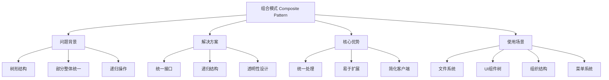
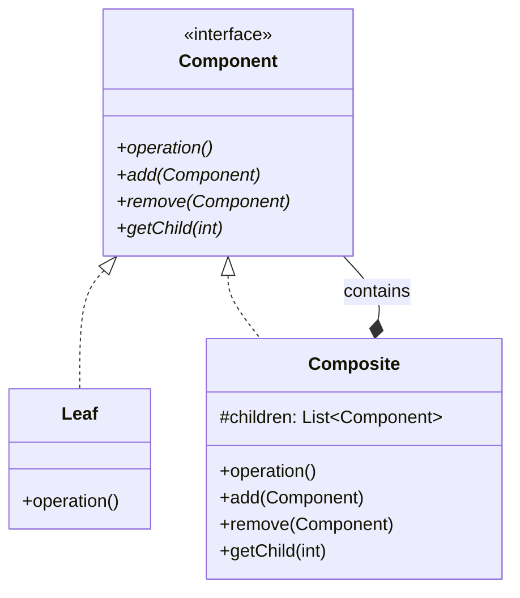

# 🌳 组合模式详解

[[04-结构型模式/05-外观模式]] ← [[04-结构型模式/07-享元模式]]
## 🎯 组合模式概览

### 📊 模式基本信息



### 🎯 **定义与意图**
组合模式将对象组合成树形结构以表示"部分-整体"的层次结构。组合模式使得用户对单个对象和组合对象的使用具有一致性。

### 📋 **核心价值**
- **统一接口**: 叶子节点和组合节点使用相同的接口
- **递归结构**: 支持树形结构的递归操作
- **透明性**: 客户端无需区分叶子节点和组合节点
- **易于扩展**: 可以轻松添加新的节点类型

## 🏗️ 组合模式结构

### 📊 **类图结构**



### 🎯 **角色职责**

#### **Component (抽象组件)**
- 为组合中的对象声明接口
- 在适当的情况下，实现所有类共有接口的默认行为
- 声明一个接口用于访问和管理Component的子组件

#### **Leaf (叶子节点)**
- 表示叶子节点对象，叶子节点没有子节点
- 定义组合中原始对象的行为

#### **Composite (组合节点)**
- 定义有子部件的那些部件的行为
- 存储子部件
- 在Component接口中实现与子部件相关的操作

## 💻 组合模式实现

### 🎯 **经典实现：文件系统**

```java
// ✅ 抽象文件系统组件
public abstract class FileSystemComponent {
    protected String name;
    protected long size;
    protected LocalDateTime createdTime;
    protected LocalDateTime modifiedTime;
    
    public FileSystemComponent(String name) {
        this.name = name;
        this.createdTime = LocalDateTime.now();
        this.modifiedTime = LocalDateTime.now();
    }
    
    // ✅ 抽象方法：显示信息
    public abstract void display(String prefix);
    
    // ✅ 抽象方法：获取大小
    public abstract long getSize();
    
    // ✅ 抽象方法：搜索
    public abstract List<FileSystemComponent> search(String pattern);
    
    // ✅ 默认实现：添加子组件
    public void add(FileSystemComponent component) {
        throw new UnsupportedOperationException("不支持添加操作");
    }
    
    // ✅ 默认实现：删除子组件
    public void remove(FileSystemComponent component) {
        throw new UnsupportedOperationException("不支持删除操作");
    }
    
    // ✅ 默认实现：获取子组件
    public FileSystemComponent getChild(int index) {
        throw new UnsupportedOperationException("不支持获取子组件操作");
    }
    
    // ✅ 默认实现：获取子组件数量
    public int getChildCount() {
        return 0;
    }
    
    // ✅ 通用方法
    public String getName() { return name; }
    public LocalDateTime getCreatedTime() { return createdTime; }
    public LocalDateTime getModifiedTime() { return modifiedTime; }
    
    public void setModifiedTime(LocalDateTime modifiedTime) {
        this.modifiedTime = modifiedTime;
    }
    
    // ✅ 判断是否为叶子节点
    public boolean isLeaf() {
        return getChildCount() == 0;
    }
    
    // ✅ 判断是否为组合节点
    public boolean isComposite() {
        return !isLeaf();
    }
}

// ✅ 文件类（叶子节点）
public class File extends FileSystemComponent {
    private String content;
    private String extension;
    
    public File(String name, String content) {
        super(name);
        this.content = content;
        this.size = content != null ? content.getBytes().length : 0;
        this.extension = extractExtension(name);
    }
    
    @Override
    public void display(String prefix) {
        System.out.printf("%s📄 %s (%.2f KB) - %s%n", 
                         prefix, name, size / 1024.0, formatDateTime(modifiedTime));
    }
    
    @Override
    public long getSize() {
        return size;
    }
    
    @Override
    public List<FileSystemComponent> search(String pattern) {
        List<FileSystemComponent> results = new ArrayList<>();
        
        // ✅ 在文件名中搜索
        if (name.toLowerCase().contains(pattern.toLowerCase())) {
            results.add(this);
        }
        
        // ✅ 在文件内容中搜索
        if (content != null && content.toLowerCase().contains(pattern.toLowerCase())) {
            results.add(this);
        }
        
        return results;
    }
    
    // ✅ 文件特有方法
    public String getContent() { return content; }
    public void setContent(String content) {
        this.content = content;
        this.size = content != null ? content.getBytes().length : 0;
        this.modifiedTime = LocalDateTime.now();
    }
    
    public String getExtension() { return extension; }
    
    private String extractExtension(String fileName) {
        int lastDotIndex = fileName.lastIndexOf('.');
        return lastDotIndex > 0 ? fileName.substring(lastDotIndex + 1) : "";
    }
    
    private String formatDateTime(LocalDateTime dateTime) {
        return dateTime.format(DateTimeFormatter.ofPattern("yyyy-MM-dd HH:mm:ss"));
    }
}

// ✅ 文件夹类（组合节点）
public class Directory extends FileSystemComponent {
    private List<FileSystemComponent> children;
    
    public Directory(String name) {
        super(name);
        this.children = new ArrayList<>();
    }
    
    @Override
    public void display(String prefix) {
        System.out.printf("%s📁 %s (%d items) - %s%n", 
                         prefix, name, children.size(), formatDateTime(modifiedTime));
        
        // ✅ 递归显示子组件
        String childPrefix = prefix + "  ";
        for (FileSystemComponent child : children) {
            child.display(childPrefix);
        }
    }
    
    @Override
    public long getSize() {
        // ✅ 递归计算总大小
        return children.stream()
            .mapToLong(FileSystemComponent::getSize)
            .sum();
    }
    
    @Override
    public List<FileSystemComponent> search(String pattern) {
        List<FileSystemComponent> results = new ArrayList<>();
        
        // ✅ 在当前目录中搜索
        if (name.toLowerCase().contains(pattern.toLowerCase())) {
            results.add(this);
        }
        
        // ✅ 递归搜索子组件
        for (FileSystemComponent child : children) {
            results.addAll(child.search(pattern));
        }
        
        return results;
    }
    
    @Override
    public void add(FileSystemComponent component) {
        if (component != null) {
            children.add(component);
            this.modifiedTime = LocalDateTime.now();
            System.out.println("添加 " + component.getName() + " 到 " + name);
        }
    }
    
    @Override
    public void remove(FileSystemComponent component) {
        if (children.remove(component)) {
            this.modifiedTime = LocalDateTime.now();
            System.out.println("从 " + name + " 中删除 " + component.getName());
        }
    }
    
    @Override
    public FileSystemComponent getChild(int index) {
        if (index >= 0 && index < children.size()) {
            return children.get(index);
        }
        return null;
    }
    
    @Override
    public int getChildCount() {
        return children.size();
    }
    
    // ✅ 文件夹特有方法
    public List<FileSystemComponent> getChildren() {
        return new ArrayList<>(children);
    }
    
    public boolean isEmpty() {
        return children.isEmpty();
    }
    
    public void clear() {
        children.clear();
        this.modifiedTime = LocalDateTime.now();
    }
    
    // ✅ 按类型获取子组件
    public List<File> getFiles() {
        return children.stream()
            .filter(child -> child instanceof File)
            .map(child -> (File) child)
            .collect(Collectors.toList());
    }
    
    public List<Directory> getDirectories() {
        return children.stream()
            .filter(child -> child instanceof Directory)
            .map(child -> (Directory) child)
            .collect(Collectors.toList());
    }
    
    // ✅ 查找特定名称的组件
    public FileSystemComponent findByName(String name) {
        return children.stream()
            .filter(child -> child.getName().equals(name))
            .findFirst()
            .orElse(null);
    }
    
    private String formatDateTime(LocalDateTime dateTime) {
        return dateTime.format(DateTimeFormatter.ofPattern("yyyy-MM-dd HH:mm:ss"));
    }
}

// ✅ 文件系统管理器
public class FileSystemManager {
    private Directory root;
    
    public FileSystemManager() {
        this.root = new Directory("Root");
    }
    
    // ✅ 创建文件
    public File createFile(String path, String content) {
        String[] pathParts = path.split("/");
        Directory currentDir = root;
        
        // ✅ 导航到目标目录
        for (int i = 0; i < pathParts.length - 1; i++) {
            String dirName = pathParts[i];
            Directory subDir = (Directory) currentDir.findByName(dirName);
            
            if (subDir == null) {
                subDir = new Directory(dirName);
                currentDir.add(subDir);
            }
            
            currentDir = subDir;
        }
        
        // ✅ 创建文件
        String fileName = pathParts[pathParts.length - 1];
        File file = new File(fileName, content);
        currentDir.add(file);
        
        return file;
    }
    
    // ✅ 创建目录
    public Directory createDirectory(String path) {
        String[] pathParts = path.split("/");
        Directory currentDir = root;
        
        for (String dirName : pathParts) {
            Directory subDir = (Directory) currentDir.findByName(dirName);
            
            if (subDir == null) {
                subDir = new Directory(dirName);
                currentDir.add(subDir);
            }
            
            currentDir = subDir;
        }
        
        return currentDir;
    }
    
    // ✅ 显示文件系统
    public void displayFileSystem() {
        System.out.println("=== 文件系统结构 ===");
        root.display("");
        System.out.println("==================");
    }
    
    // ✅ 搜索文件
    public List<FileSystemComponent> search(String pattern) {
        System.out.println("搜索: " + pattern);
        List<FileSystemComponent> results = root.search(pattern);
        
        if (results.isEmpty()) {
            System.out.println("未找到匹配的文件或目录");
        } else {
            System.out.println("找到 " + results.size() + " 个匹配项:");
            results.forEach(result -> System.out.println("  - " + result.getName()));
        }
        
        return results;
    }
    
    // ✅ 获取总大小
    public long getTotalSize() {
        return root.getSize();
    }
    
    // ✅ 统计信息
    public void printStatistics() {
        System.out.println("=== 文件系统统计 ===");
        System.out.println("总大小: " + formatSize(getTotalSize()));
        System.out.println("文件数量: " + countFiles(root));
        System.out.println("目录数量: " + countDirectories(root));
        System.out.println("==================");
    }
    
    private int countFiles(FileSystemComponent component) {
        if (component instanceof File) {
            return 1;
        } else if (component instanceof Directory) {
            Directory dir = (Directory) component;
            return dir.getChildren().stream()
                .mapToInt(this::countFiles)
                .sum();
        }
        return 0;
    }
    
    private int countDirectories(FileSystemComponent component) {
        if (component instanceof Directory) {
            Directory dir = (Directory) component;
            return 1 + dir.getChildren().stream()
                .mapToInt(this::countDirectories)
                .sum();
        }
        return 0;
    }
    
    private String formatSize(long bytes) {
        if (bytes < 1024) return bytes + " B";
        if (bytes < 1024 * 1024) return String.format("%.2f KB", bytes / 1024.0);
        if (bytes < 1024 * 1024 * 1024) return String.format("%.2f MB", bytes / (1024.0 * 1024.0));
        return String.format("%.2f GB", bytes / (1024.0 * 1024.0 * 1024.0));
    }
}

// ✅ 客户端使用示例
public class FileSystemDemo {
    public static void main(String[] args) {
        FileSystemManager fsManager = new FileSystemManager();
        
        // ✅ 创建目录结构
        fsManager.createDirectory("Documents");
        fsManager.createDirectory("Documents/Work");
        fsManager.createDirectory("Documents/Personal");
        fsManager.createDirectory("Pictures");
        fsManager.createDirectory("Pictures/Vacation");
        
        // ✅ 创建文件
        fsManager.createFile("Documents/Work/report.txt", "This is a work report.");
        fsManager.createFile("Documents/Work/presentation.pptx", "Presentation content");
        fsManager.createFile("Documents/Personal/diary.txt", "Personal diary entry");
        fsManager.createFile("Pictures/Vacation/photo1.jpg", "Vacation photo 1");
        fsManager.createFile("Pictures/Vacation/photo2.jpg", "Vacation photo 2");
        
        // ✅ 显示文件系统
        fsManager.displayFileSystem();
        
        // ✅ 搜索文件
        fsManager.search("report");
        fsManager.search("photo");
        
        // ✅ 显示统计信息
        fsManager.printStatistics();
        
        // ✅ 演示组合模式的优势
        System.out.println("\n=== 组合模式优势演示 ===");
        
        // 统一接口：文件和目录都可以调用相同的方法
        FileSystemComponent root = fsManager.root;
        System.out.println("根目录大小: " + root.getSize() + " bytes");
        System.out.println("根目录是否为叶子节点: " + root.isLeaf());
        
        // 递归操作：搜索操作对文件和目录都有效
        List<FileSystemComponent> searchResults = root.search("txt");
        System.out.println("包含'txt'的组件数量: " + searchResults.size());
    }
}
```

### 🚀 **现代企业级实现：UI组件树**

```java
// ✅ UI组件抽象类
public abstract class UIComponent {
    protected String id;
    protected String name;
    protected Rectangle bounds;
    protected boolean visible;
    protected boolean enabled;
    protected Map<String, Object> properties;
    
    public UIComponent(String id, String name) {
        this.id = id;
        this.name = name;
        this.bounds = new Rectangle(0, 0, 100, 100);
        this.visible = true;
        this.enabled = true;
        this.properties = new HashMap<>();
    }
    
    // ✅ 抽象方法：渲染
    public abstract void render(Graphics2D graphics);
    
    // ✅ 抽象方法：处理事件
    public abstract boolean handleEvent(UIEvent event);
    
    // ✅ 抽象方法：布局
    public abstract void layout();
    
    // ✅ 默认实现：添加子组件
    public void addChild(UIComponent component) {
        throw new UnsupportedOperationException("不支持添加子组件");
    }
    
    // ✅ 默认实现：删除子组件
    public void removeChild(UIComponent component) {
        throw new UnsupportedOperationException("不支持删除子组件");
    }
    
    // ✅ 默认实现：获取子组件
    public List<UIComponent> getChildren() {
        return Collections.emptyList();
    }
    
    // ✅ 默认实现：查找子组件
    public UIComponent findChildById(String id) {
        return null;
    }
    
    // ✅ 通用方法
    public String getId() { return id; }
    public String getName() { return name; }
    public Rectangle getBounds() { return bounds; }
    public void setBounds(Rectangle bounds) { this.bounds = bounds; }
    public boolean isVisible() { return visible; }
    public void setVisible(boolean visible) { this.visible = visible; }
    public boolean isEnabled() { return enabled; }
    public void setEnabled(boolean enabled) { this.enabled = enabled; }
    
    // ✅ 属性管理
    public void setProperty(String key, Object value) {
        properties.put(key, value);
    }
    
    public Object getProperty(String key) {
        return properties.get(key);
    }
    
    // ✅ 判断是否为容器
    public boolean isContainer() {
        return !getChildren().isEmpty();
    }
}

// ✅ 按钮组件（叶子节点）
public class Button extends UIComponent {
    private String text;
    private Color backgroundColor;
    private Color textColor;
    private Font font;
    private ActionListener actionListener;
    
    public Button(String id, String text) {
        super(id, "Button");
        this.text = text;
        this.backgroundColor = Color.BLUE;
        this.textColor = Color.WHITE;
        this.font = new Font("Arial", Font.BOLD, 12);
    }
    
    @Override
    public void render(Graphics2D graphics) {
        if (!visible) return;
        
        // ✅ 绘制按钮背景
        graphics.setColor(backgroundColor);
        graphics.fillRoundRect(bounds.x, bounds.y, bounds.width, bounds.height, 5, 5);
        
        // ✅ 绘制按钮边框
        graphics.setColor(Color.BLACK);
        graphics.drawRoundRect(bounds.x, bounds.y, bounds.width, bounds.height, 5, 5);
        
        // ✅ 绘制按钮文字
        graphics.setColor(textColor);
        graphics.setFont(font);
        FontMetrics fm = graphics.getFontMetrics();
        int textX = bounds.x + (bounds.width - fm.stringWidth(text)) / 2;
        int textY = bounds.y + (bounds.height + fm.getAscent()) / 2;
        graphics.drawString(text, textX, textY);
    }
    
    @Override
    public boolean handleEvent(UIEvent event) {
        if (!enabled || !visible) return false;
        
        if (event.getType() == UIEventType.CLICK && bounds.contains(event.getX(), event.getY())) {
            if (actionListener != null) {
                actionListener.onAction(new ActionEvent(this, ActionEvent.ACTION_PERFORMED, text));
            }
            return true;
        }
        
        return false;
    }
    
    @Override
    public void layout() {
        // 按钮不需要特殊布局
    }
    
    // ✅ 按钮特有方法
    public String getText() { return text; }
    public void setText(String text) { this.text = text; }
    public Color getBackgroundColor() { return backgroundColor; }
    public void setBackgroundColor(Color backgroundColor) { this.backgroundColor = backgroundColor; }
    public Color getTextColor() { return textColor; }
    public void setTextColor(Color textColor) { this.textColor = textColor; }
    public Font getFont() { return font; }
    public void setFont(Font font) { this.font = font; }
    public ActionListener getActionListener() { return actionListener; }
    public void setActionListener(ActionListener actionListener) { this.actionListener = actionListener; }
}

// ✅ 面板组件（组合节点）
public class Panel extends UIComponent {
    private List<UIComponent> children;
    private LayoutManager layoutManager;
    private Color backgroundColor;
    
    public Panel(String id) {
        super(id, "Panel");
        this.children = new ArrayList<>();
        this.layoutManager = new FlowLayout();
        this.backgroundColor = Color.LIGHT_GRAY;
    }
    
    @Override
    public void render(Graphics2D graphics) {
        if (!visible) return;
        
        // ✅ 绘制面板背景
        graphics.setColor(backgroundColor);
        graphics.fillRect(bounds.x, bounds.y, bounds.width, bounds.height);
        
        // ✅ 绘制面板边框
        graphics.setColor(Color.BLACK);
        graphics.drawRect(bounds.x, bounds.y, bounds.width, bounds.height);
        
        // ✅ 递归渲染子组件
        Graphics2D childGraphics = (Graphics2D) graphics.create();
        childGraphics.translate(bounds.x, bounds.y);
        
        for (UIComponent child : children) {
            if (child.isVisible()) {
                child.render(childGraphics);
            }
        }
        
        childGraphics.dispose();
    }
    
    @Override
    public boolean handleEvent(UIEvent event) {
        if (!enabled || !visible) return false;
        
        // ✅ 调整事件坐标
        UIEvent adjustedEvent = new UIEvent(
            event.getType(),
            event.getX() - bounds.x,
            event.getY() - bounds.y,
            event.getData()
        );
        
        // ✅ 递归处理子组件事件
        for (UIComponent child : children) {
            if (child.handleEvent(adjustedEvent)) {
                return true;
            }
        }
        
        return false;
    }
    
    @Override
    public void layout() {
        if (layoutManager != null) {
            layoutManager.layout(this, children);
        }
    }
    
    @Override
    public void addChild(UIComponent component) {
        if (component != null) {
            children.add(component);
            layout(); // 重新布局
        }
    }
    
    @Override
    public void removeChild(UIComponent component) {
        if (children.remove(component)) {
            layout(); // 重新布局
        }
    }
    
    @Override
    public List<UIComponent> getChildren() {
        return new ArrayList<>(children);
    }
    
    @Override
    public UIComponent findChildById(String id) {
        // ✅ 递归查找子组件
        for (UIComponent child : children) {
            if (child.getId().equals(id)) {
                return child;
            }
            
            if (child.isContainer()) {
                UIComponent found = child.findChildById(id);
                if (found != null) {
                    return found;
                }
            }
        }
        
        return null;
    }
    
    // ✅ 面板特有方法
    public LayoutManager getLayoutManager() { return layoutManager; }
    public void setLayoutManager(LayoutManager layoutManager) { 
        this.layoutManager = layoutManager;
        layout();
    }
    public Color getBackgroundColor() { return backgroundColor; }
    public void setBackgroundColor(Color backgroundColor) { this.backgroundColor = backgroundColor; }
    
    // ✅ 批量操作
    public void addChildren(List<UIComponent> components) {
        children.addAll(components);
        layout();
    }
    
    public void removeAllChildren() {
        children.clear();
    }
    
    // ✅ 按类型查找子组件
    public <T extends UIComponent> List<T> getChildrenByType(Class<T> type) {
        return children.stream()
            .filter(type::isInstance)
            .map(type::cast)
            .collect(Collectors.toList());
    }
}

// ✅ 布局管理器接口
public interface LayoutManager {
    void layout(UIComponent container, List<UIComponent> children);
}

// ✅ 流式布局
public class FlowLayout implements LayoutManager {
    private int hgap = 5;
    private int vgap = 5;
    
    @Override
    public void layout(UIComponent container, List<UIComponent> children) {
        Rectangle containerBounds = container.getBounds();
        int x = hgap;
        int y = vgap;
        int maxHeight = 0;
        
        for (UIComponent child : children) {
            Rectangle childBounds = child.getBounds();
            
            // ✅ 检查是否需要换行
            if (x + childBounds.width > containerBounds.width - hgap) {
                x = hgap;
                y += maxHeight + vgap;
                maxHeight = 0;
            }
            
            // ✅ 设置子组件位置
            child.setBounds(new Rectangle(x, y, childBounds.width, childBounds.height));
            
            x += childBounds.width + hgap;
            maxHeight = Math.max(maxHeight, childBounds.height);
        }
    }
}

// ✅ UI事件系统
public class UIEvent {
    private UIEventType type;
    private int x, y;
    private Object data;
    
    public UIEvent(UIEventType type, int x, int y, Object data) {
        this.type = type;
        this.x = x;
        this.y = y;
        this.data = data;
    }
    
    // Getters
    public UIEventType getType() { return type; }
    public int getX() { return x; }
    public int getY() { return y; }
    public Object getData() { return data; }
}

public enum UIEventType {
    CLICK, MOUSE_MOVE, KEY_PRESS, FOCUS_GAINED, FOCUS_LOST
}

// ✅ 动作监听器
public interface ActionListener {
    void onAction(ActionEvent event);
}

// ✅ UI管理器
public class UIManager {
    private UIComponent root;
    private Graphics2D graphics;
    
    public UIManager(UIComponent root) {
        this.root = root;
    }
    
    // ✅ 渲染整个UI树
    public void render(Graphics2D graphics) {
        this.graphics = graphics;
        root.render(graphics);
    }
    
    // ✅ 处理事件
    public boolean handleEvent(UIEvent event) {
        return root.handleEvent(event);
    }
    
    // ✅ 布局整个UI树
    public void layout() {
        root.layout();
    }
    
    // ✅ 查找组件
    public UIComponent findComponentById(String id) {
        return root.findChildById(id);
    }
    
    // ✅ 获取所有按钮
    public List<Button> getAllButtons() {
        return getAllComponentsByType(Button.class);
    }
    
    // ✅ 获取所有面板
    public List<Panel> getAllPanels() {
        return getAllComponentsByType(Panel.class);
    }
    
    private <T extends UIComponent> List<T> getAllComponentsByType(Class<T> type) {
        List<T> result = new ArrayList<>();
        collectComponentsByType(root, type, result);
        return result;
    }
    
    private <T extends UIComponent> void collectComponentsByType(UIComponent component, Class<T> type, List<T> result) {
        if (type.isInstance(component)) {
            result.add(type.cast(component));
        }
        
        for (UIComponent child : component.getChildren()) {
            collectComponentsByType(child, type, result);
        }
    }
}
```

## 🔧 组合模式高级技巧

### 🎯 **访问者模式集成**

```java
// ✅ 访问者接口
public interface ComponentVisitor {
    void visitFile(File file);
    void visitDirectory(Directory directory);
}

// ✅ 大小计算访问者
public class SizeCalculatorVisitor implements ComponentVisitor {
    private long totalSize = 0;
    
    @Override
    public void visitFile(File file) {
        totalSize += file.getSize();
    }
    
    @Override
    public void visitDirectory(Directory directory) {
        // 目录本身不占用空间，只计算子组件
        for (FileSystemComponent child : directory.getChildren()) {
            child.accept(this);
        }
    }
    
    public long getTotalSize() {
        return totalSize;
    }
}

// ✅ 在组件中添加访问者支持
public abstract class FileSystemComponent {
    // ... 现有代码 ...
    
    // ✅ 接受访问者
    public abstract void accept(ComponentVisitor visitor);
}

// ✅ 文件访问者实现
public class File extends FileSystemComponent {
    // ... 现有代码 ...
    
    @Override
    public void accept(ComponentVisitor visitor) {
        visitor.visitFile(this);
    }
}

// ✅ 目录访问者实现
public class Directory extends FileSystemComponent {
    // ... 现有代码 ...
    
    @Override
    public void accept(ComponentVisitor visitor) {
        visitor.visitDirectory(this);
    }
}
```

## 🚀 组合模式最佳实践

### 📋 **使用指南**

1. **设计原则**:
   - 确保所有组件都有统一的接口
   - 叶子节点和组合节点应该透明
   - 避免在叶子节点中实现组合节点的操作

2. **性能考虑**:
   - 对于大型树结构，考虑使用缓存
   - 实现懒加载机制
   - 使用迭代器模式遍历大型树

3. **扩展性**:
   - 使用访问者模式添加新操作
   - 支持动态添加和删除组件
   - 提供组件查找和过滤功能

### ⚠️ **注意事项**

1. **类型安全**: 确保类型转换的安全性
2. **循环引用**: 避免组件之间的循环引用
3. **内存管理**: 及时清理不需要的组件引用
4. **线程安全**: 在多线程环境下确保操作的安全性

## 📊 与其他模式的对比

| 对比维度 | 组合模式 | 装饰器模式 | 代理模式 |
|----------|----------|------------|----------|
| **目的** | 树形结构 | 功能增强 | 访问控制 |
| **结构** | 递归树形 | 链式包装 | 一对一代理 |
| **操作** | 递归操作 | 包装操作 | 代理操作 |
| **扩展** | 添加节点 | 添加装饰 | 添加代理 |

## 🔗 学习衔接

- **上一模式** ← [[外观模式]]
- **下一模式** → [[享元模式]]
- **模式对比** → [[04-结构型模式/09-结构型模式对比表]]
- **UI框架** → [[设计模式最佳实践秘典]]

---
**💡 组合模式精髓**: 组合模式就像一个俄罗斯套娃，大套娃里面有小套娃，小套娃里面还有更小的套娃。无论大小，它们都有相同的形状和操作方式，这就是组合模式的魅力！
