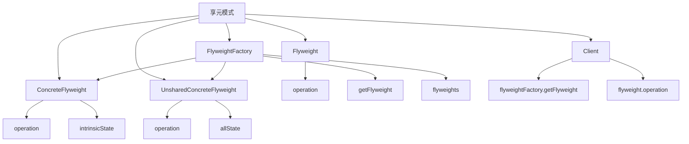

# 🪶 享元模式

[[04-结构型模式/06-外观模式]] ← [[04-结构型模式/08-代理模式]]
## 🎯 享元模式概览

### 📊 模式结构图



## 🏗️ 模式定义与特点

### 📋 **模式定义**
享元模式运用共享技术有效地支持大量细粒度的对象。

### 📋 **核心特点**
- **共享对象**: 共享相同状态的对象
- **内在状态**: 对象的内在状态可以共享
- **外在状态**: 对象的外在状态不能共享
- **工厂管理**: 通过工厂管理享元对象

### 📋 **适用场景**
- 需要大量相似对象
- 对象的大部分状态可以外部化
- 需要减少内存使用
- 需要提高性能

## 🏗️ 模式实现

### 📋 **基础实现**

#### **享元接口**
```java
// ✅ 享元接口
public interface Flyweight {
    void operation(String extrinsicState);
}

// ✅ 具体享元
public class ConcreteFlyweight implements Flyweight {
    private String intrinsicState;
    
    public ConcreteFlyweight(String intrinsicState) {
        this.intrinsicState = intrinsicState;
    }
    
    @Override
    public void operation(String extrinsicState) {
        System.out.println("ConcreteFlyweight: intrinsic=" + intrinsicState + ", extrinsic=" + extrinsicState);
    }
}

// ✅ 非共享具体享元
public class UnsharedConcreteFlyweight implements Flyweight {
    private String allState;
    
    public UnsharedConcreteFlyweight(String allState) {
        this.allState = allState;
    }
    
    @Override
    public void operation(String extrinsicState) {
        System.out.println("UnsharedConcreteFlyweight: allState=" + allState + ", extrinsic=" + extrinsicState);
    }
}
```

#### **享元工厂**
```java
// ✅ 享元工厂
public class FlyweightFactory {
    private Map<String, Flyweight> flyweights;
    
    public FlyweightFactory() {
        this.flyweights = new HashMap<>();
    }
    
    public Flyweight getFlyweight(String key) {
        if (flyweights.containsKey(key)) {
            return flyweights.get(key);
        }
        
        Flyweight flyweight = new ConcreteFlyweight(key);
        flyweights.put(key, flyweight);
        return flyweight;
    }
    
    public Flyweight getUnsharedFlyweight(String allState) {
        return new UnsharedConcreteFlyweight(allState);
    }
}
```

#### **使用示例**
```java
// ✅ 客户端使用
public class Client {
    public static void main(String[] args) {
        FlyweightFactory factory = new FlyweightFactory();
        
        // 获取共享享元
        Flyweight flyweight1 = factory.getFlyweight("A");
        Flyweight flyweight2 = factory.getFlyweight("B");
        Flyweight flyweight3 = factory.getFlyweight("A"); // 复用
        
        flyweight1.operation("extrinsic1");
        flyweight2.operation("extrinsic2");
        flyweight3.operation("extrinsic3");
        
        // 获取非共享享元
        Flyweight unsharedFlyweight = factory.getUnsharedFlyweight("unique");
        unsharedFlyweight.operation("extrinsic4");
    }
}
```

## 🏗️ 实际应用案例

### 📋 **字符享元案例**

#### **字符享元**
```java
// ✅ 字符享元接口
public interface CharacterFlyweight {
    void display(int x, int y, String color);
}

// ✅ 具体字符享元
public class Character implements CharacterFlyweight {
    private char character;
    
    public Character(char character) {
        this.character = character;
    }
    
    @Override
    public void display(int x, int y, String color) {
        System.out.println("Character '" + character + "' at (" + x + ", " + y + ") with color " + color);
    }
}

// ✅ 字符享元工厂
public class CharacterFactory {
    private Map<Character, CharacterFlyweight> characters;
    
    public CharacterFactory() {
        this.characters = new HashMap<>();
    }
    
    public CharacterFlyweight getCharacter(char character) {
        if (characters.containsKey(character)) {
            return characters.get(character);
        }
        
        CharacterFlyweight charFlyweight = new Character(character);
        characters.put(character, charFlyweight);
        return charFlyweight;
    }
}

// ✅ 文本编辑器
public class TextEditor {
    private CharacterFactory characterFactory;
    private List<CharacterFlyweight> characters;
    private List<Integer> positionsX;
    private List<Integer> positionsY;
    private List<String> colors;
    
    public TextEditor() {
        this.characterFactory = new CharacterFactory();
        this.characters = new ArrayList<>();
        this.positionsX = new ArrayList<>();
        this.positionsY = new ArrayList<>();
        this.colors = new ArrayList<>();
    }
    
    public void addCharacter(char character, int x, int y, String color) {
        CharacterFlyweight charFlyweight = characterFactory.getCharacter(character);
        characters.add(charFlyweight);
        positionsX.add(x);
        positionsY.add(y);
        colors.add(color);
    }
    
    public void displayText() {
        System.out.println("=== Displaying Text ===");
        for (int i = 0; i < characters.size(); i++) {
            characters.get(i).display(positionsX.get(i), positionsY.get(i), colors.get(i));
        }
    }
}
```

#### **使用示例**
```java
// ✅ 使用示例
public class CharacterDemo {
    public static void main(String[] args) {
        TextEditor editor = new TextEditor();
        
        // 添加字符
        editor.addCharacter('H', 0, 0, "red");
        editor.addCharacter('e', 1, 0, "blue");
        editor.addCharacter('l', 2, 0, "green");
        editor.addCharacter('l', 3, 0, "green"); // 复用
        editor.addCharacter('o', 4, 0, "yellow");
        editor.addCharacter(' ', 5, 0, "black");
        editor.addCharacter('W', 6, 0, "red");
        editor.addCharacter('o', 7, 0, "yellow"); // 复用
        editor.addCharacter('r', 8, 0, "blue");
        editor.addCharacter('l', 9, 0, "green"); // 复用
        editor.addCharacter('d', 10, 0, "purple");
        
        // 显示文本
        editor.displayText();
    }
}
```

### 📋 **游戏对象享元案例**

#### **游戏对象享元**
```java
// ✅ 游戏对象享元接口
public interface GameObjectFlyweight {
    void render(int x, int y, String playerName);
}

// ✅ 具体游戏对象享元
public class GameObject implements GameObjectFlyweight {
    private String type;
    private String texture;
    private int health;
    private int attack;
    
    public GameObject(String type, String texture, int health, int attack) {
        this.type = type;
        this.texture = texture;
        this.health = health;
        this.attack = attack;
    }
    
    @Override
    public void render(int x, int y, String playerName) {
        System.out.println("Rendering " + type + " at (" + x + ", " + y + ") for player " + playerName);
        System.out.println("  Texture: " + texture + ", Health: " + health + ", Attack: " + attack);
    }
}

// ✅ 游戏对象享元工厂
public class GameObjectFactory {
    private Map<String, GameObjectFlyweight> gameObjects;
    
    public GameObjectFactory() {
        this.gameObjects = new HashMap<>();
        initializeGameObjects();
    }
    
    private void initializeGameObjects() {
        // 创建不同类型的游戏对象
        gameObjects.put("warrior", new GameObject("Warrior", "warrior.png", 100, 20));
        gameObjects.put("mage", new GameObject("Mage", "mage.png", 80, 25));
        gameObjects.put("archer", new GameObject("Archer", "archer.png", 90, 18));
        gameObjects.put("tank", new GameObject("Tank", "tank.png", 150, 15));
    }
    
    public GameObjectFlyweight getGameObject(String type) {
        if (gameObjects.containsKey(type)) {
            return gameObjects.get(type);
        }
        throw new IllegalArgumentException("Unknown game object type: " + type);
    }
}

// ✅ 游戏场景
public class GameScene {
    private GameObjectFactory gameObjectFactory;
    private List<GameObjectFlyweight> objects;
    private List<Integer> positionsX;
    private List<Integer> positionsY;
    private List<String> playerNames;
    
    public GameScene() {
        this.gameObjectFactory = new GameObjectFactory();
        this.objects = new ArrayList<>();
        this.positionsX = new ArrayList<>();
        this.positionsY = new ArrayList<>();
        this.playerNames = new ArrayList<>();
    }
    
    public void addGameObject(String type, int x, int y, String playerName) {
        GameObjectFlyweight gameObject = gameObjectFactory.getGameObject(type);
        objects.add(gameObject);
        positionsX.add(x);
        positionsY.add(y);
        playerNames.add(playerName);
    }
    
    public void renderScene() {
        System.out.println("=== Rendering Game Scene ===");
        for (int i = 0; i < objects.size(); i++) {
            objects.get(i).render(positionsX.get(i), positionsY.get(i), playerNames.get(i));
        }
    }
}
```

#### **使用示例**
```java
// ✅ 使用示例
public class GameSceneDemo {
    public static void main(String[] args) {
        GameScene scene = new GameScene();
        
        // 添加游戏对象
        scene.addGameObject("warrior", 10, 10, "Player1");
        scene.addGameObject("mage", 20, 15, "Player1");
        scene.addGameObject("archer", 30, 20, "Player2");
        scene.addGameObject("tank", 40, 25, "Player2");
        scene.addGameObject("warrior", 50, 30, "Player3"); // 复用
        scene.addGameObject("mage", 60, 35, "Player3"); // 复用
        
        // 渲染场景
        scene.renderScene();
    }
}
```

### 📋 **数据库连接享元案例**

#### **数据库连接享元**
```java
// ✅ 数据库连接享元接口
public interface DatabaseConnectionFlyweight {
    void executeQuery(String sql, String database);
}

// ✅ 具体数据库连接享元
public class DatabaseConnection implements DatabaseConnectionFlyweight {
    private String connectionType;
    private String driver;
    private String defaultPort;
    
    public DatabaseConnection(String connectionType, String driver, String defaultPort) {
        this.connectionType = connectionType;
        this.driver = driver;
        this.defaultPort = defaultPort;
    }
    
    @Override
    public void executeQuery(String sql, String database) {
        System.out.println("Executing query on " + connectionType + " database: " + database);
        System.out.println("  Driver: " + driver + ", Port: " + defaultPort);
        System.out.println("  SQL: " + sql);
    }
}

// ✅ 数据库连接享元工厂
public class DatabaseConnectionFactory {
    private Map<String, DatabaseConnectionFlyweight> connections;
    
    public DatabaseConnectionFactory() {
        this.connections = new HashMap<>();
        initializeConnections();
    }
    
    private void initializeConnections() {
        // 创建不同类型的数据库连接
        connections.put("mysql", new DatabaseConnection("MySQL", "com.mysql.jdbc.Driver", "3306"));
        connections.put("postgresql", new DatabaseConnection("PostgreSQL", "org.postgresql.Driver", "5432"));
        connections.put("oracle", new DatabaseConnection("Oracle", "oracle.jdbc.driver.OracleDriver", "1521"));
        connections.put("sqlserver", new DatabaseConnection("SQL Server", "com.microsoft.sqlserver.jdbc.SQLServerDriver", "1433"));
    }
    
    public DatabaseConnectionFlyweight getConnection(String type) {
        if (connections.containsKey(type)) {
            return connections.get(type);
        }
        throw new IllegalArgumentException("Unknown database type: " + type);
    }
}

// ✅ 数据库管理器
public class DatabaseManager {
    private DatabaseConnectionFactory connectionFactory;
    private List<DatabaseConnectionFlyweight> connections;
    private List<String> databases;
    
    public DatabaseManager() {
        this.connectionFactory = new DatabaseConnectionFactory();
        this.connections = new ArrayList<>();
        this.databases = new ArrayList<>();
    }
    
    public void addConnection(String type, String database) {
        DatabaseConnectionFlyweight connection = connectionFactory.getConnection(type);
        connections.add(connection);
        databases.add(database);
    }
    
    public void executeQuery(String sql, int connectionIndex) {
        if (connectionIndex >= 0 && connectionIndex < connections.size()) {
            connections.get(connectionIndex).executeQuery(sql, databases.get(connectionIndex));
        } else {
            System.out.println("Invalid connection index: " + connectionIndex);
        }
    }
    
    public void executeAllQueries(String sql) {
        System.out.println("=== Executing Query on All Connections ===");
        for (int i = 0; i < connections.size(); i++) {
            connections.get(i).executeQuery(sql, databases.get(i));
        }
    }
}
```

#### **使用示例**
```java
// ✅ 使用示例
public class DatabaseManagerDemo {
    public static void main(String[] args) {
        DatabaseManager manager = new DatabaseManager();
        
        // 添加数据库连接
        manager.addConnection("mysql", "user_db");
        manager.addConnection("postgresql", "product_db");
        manager.addConnection("oracle", "order_db");
        manager.addConnection("sqlserver", "inventory_db");
        manager.addConnection("mysql", "log_db"); // 复用
        
        // 执行查询
        manager.executeQuery("SELECT * FROM users", 0);
        
        System.out.println();
        
        manager.executeQuery("SELECT * FROM products", 1);
        
        System.out.println();
        
        // 在所有连接上执行查询
        manager.executeAllQueries("SELECT COUNT(*) FROM tables");
    }
}
```

## 🎯 模式优势与劣势

### 📋 **优势**
- **内存优化**: 减少内存使用
- **性能提升**: 提高系统性能
- **对象复用**: 共享相同状态的对象
- **扩展性好**: 易于扩展新的享元类型

### 📋 **劣势**
- **复杂度增加**: 增加了系统的复杂度
- **状态管理**: 需要仔细管理内在和外在状态
- **调试困难**: 调试可能比较困难

### 📋 **与单例模式的区别**
| 方面 | 单例模式 | 享元模式 |
|------|----------|----------|
| **对象数量** | 只有一个实例 | 可以有多个实例 |
| **状态** | 全局状态 | 内在状态共享 |
| **用途** | 全局访问点 | 对象复用 |
| **复杂度** | 相对简单 | 相对复杂 |

## 🔗 学习衔接

- **上一文档** ← [[外观模式]]
- **下一文档** → [[代理模式]]
- **模式基础** → [[01-基础认知]]

---
**💡 享元精髓**: 享元模式就像共享单车，多个用户可以共享同一辆单车，只需要记录每个用户的使用状态。当我们需要大量相似对象，或者需要减少内存使用时，享元模式是最佳选择！