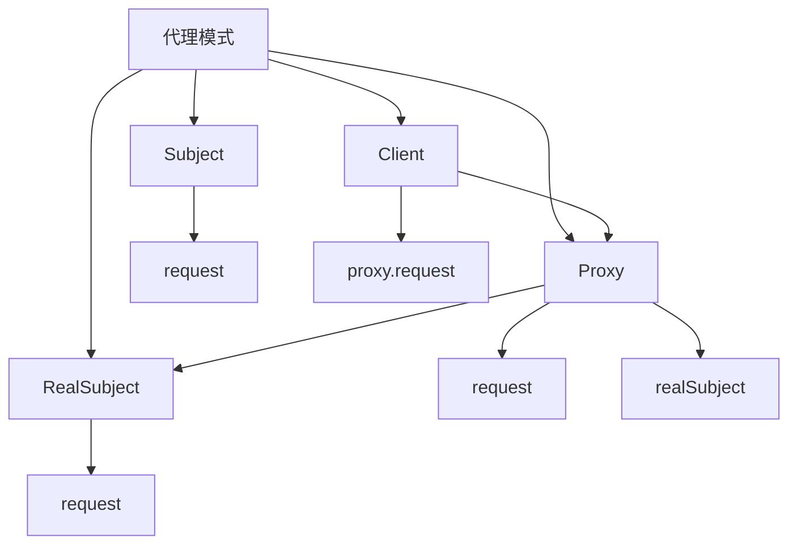

# 🎭 代理模式

[[04-结构型模式/07-享元模式]] ← [[04-结构型模式/09-结构型模式对比表]]
## 🎯 代理模式概览

### 📊 模式结构图



## 🏗️ 模式定义与特点

### 📋 **模式定义**
代理模式为其他对象提供一种代理以控制对这个对象的访问。

### 📋 **核心特点**
- **访问控制**: 控制对目标对象的访问
- **透明代理**: 代理对象与目标对象有相同的接口
- **延迟加载**: 可以延迟创建目标对象
- **功能增强**: 可以在访问前后添加额外功能

### 📋 **适用场景**
- 需要控制对对象的访问
- 需要延迟创建对象
- 需要添加额外功能
- 需要远程访问对象

## 🏗️ 模式实现

### 📋 **基础实现**

#### **主题接口**
```java
// ✅ 主题接口
public interface Subject {
    void request();
}

// ✅ 真实主题
public class RealSubject implements Subject {
    @Override
    public void request() {
        System.out.println("RealSubject request");
    }
}

// ✅ 代理类
public class Proxy implements Subject {
    private RealSubject realSubject;
    
    @Override
    public void request() {
        if (realSubject == null) {
            realSubject = new RealSubject();
        }
        
        System.out.println("Proxy: Before request");
        realSubject.request();
        System.out.println("Proxy: After request");
    }
}
```

#### **使用示例**
```java
// ✅ 客户端使用
public class Client {
    public static void main(String[] args) {
        Proxy proxy = new Proxy();
        proxy.request();
    }
}
```

## 🏗️ 实际应用案例

### 📋 **图片加载代理案例**

#### **图片加载代理**
```java
// ✅ 图片接口
public interface Image {
    void display();
}

// ✅ 真实图片
public class RealImage implements Image {
    private String filename;
    
    public RealImage(String filename) {
        this.filename = filename;
        loadFromDisk();
    }
    
    private void loadFromDisk() {
        System.out.println("Loading image from disk: " + filename);
    }
    
    @Override
    public void display() {
        System.out.println("Displaying image: " + filename);
    }
}

// ✅ 图片代理
public class ImageProxy implements Image {
    private String filename;
    private RealImage realImage;
    
    public ImageProxy(String filename) {
        this.filename = filename;
    }
    
    @Override
    public void display() {
        if (realImage == null) {
            realImage = new RealImage(filename);
        }
        realImage.display();
    }
}

// ✅ 图片查看器
public class ImageViewer {
    private List<Image> images;
    
    public ImageViewer() {
        this.images = new ArrayList<>();
    }
    
    public void addImage(String filename) {
        images.add(new ImageProxy(filename));
    }
    
    public void displayAll() {
        System.out.println("=== Displaying All Images ===");
        for (Image image : images) {
            image.display();
        }
    }
    
    public void displayImage(int index) {
        if (index >= 0 && index < images.size()) {
            System.out.println("=== Displaying Image " + index + " ===");
            images.get(index).display();
        }
    }
}
```

#### **使用示例**
```java
// ✅ 使用示例
public class ImageViewerDemo {
    public static void main(String[] args) {
        ImageViewer viewer = new ImageViewer();
        
        // 添加图片（此时不会加载）
        viewer.addImage("photo1.jpg");
        viewer.addImage("photo2.jpg");
        viewer.addImage("photo3.jpg");
        
        System.out.println("Images added to viewer");
        
        // 显示特定图片（此时才会加载）
        viewer.displayImage(0);
        
        System.out.println();
        
        // 显示所有图片
        viewer.displayAll();
    }
}
```

### 📋 **数据库访问代理案例**

#### **数据库访问代理**
```java
// ✅ 数据库接口
public interface Database {
    String query(String sql);
    void update(String sql);
    void close();
}

// ✅ 真实数据库
public class RealDatabase implements Database {
    private String connectionString;
    private boolean connected;
    
    public RealDatabase(String connectionString) {
        this.connectionString = connectionString;
        this.connected = false;
    }
    
    private void connect() {
        if (!connected) {
            System.out.println("Connecting to database: " + connectionString);
            connected = true;
        }
    }
    
    @Override
    public String query(String sql) {
        connect();
        System.out.println("Executing query: " + sql);
        return "Query result for: " + sql;
    }
    
    @Override
    public void update(String sql) {
        connect();
        System.out.println("Executing update: " + sql);
    }
    
    @Override
    public void close() {
        if (connected) {
            System.out.println("Closing database connection");
            connected = false;
        }
    }
}

// ✅ 数据库代理
public class DatabaseProxy implements Database {
    private RealDatabase realDatabase;
    private String connectionString;
    private boolean accessAllowed;
    
    public DatabaseProxy(String connectionString, boolean accessAllowed) {
        this.connectionString = connectionString;
        this.accessAllowed = accessAllowed;
    }
    
    private void checkAccess() {
        if (!accessAllowed) {
            throw new SecurityException("Access denied to database");
        }
    }
    
    @Override
    public String query(String sql) {
        checkAccess();
        if (realDatabase == null) {
            realDatabase = new RealDatabase(connectionString);
        }
        return realDatabase.query(sql);
    }
    
    @Override
    public void update(String sql) {
        checkAccess();
        if (realDatabase == null) {
            realDatabase = new RealDatabase(connectionString);
        }
        realDatabase.update(sql);
    }
    
    @Override
    public void close() {
        if (realDatabase != null) {
            realDatabase.close();
        }
    }
}

// ✅ 数据库管理器
public class DatabaseManager {
    private Database database;
    
    public DatabaseManager(String connectionString, boolean accessAllowed) {
        this.database = new DatabaseProxy(connectionString, accessAllowed);
    }
    
    public void executeQuery(String sql) {
        try {
            String result = database.query(sql);
            System.out.println("Result: " + result);
        } catch (SecurityException e) {
            System.out.println("Error: " + e.getMessage());
        }
    }
    
    public void executeUpdate(String sql) {
        try {
            database.update(sql);
        } catch (SecurityException e) {
            System.out.println("Error: " + e.getMessage());
        }
    }
    
    public void close() {
        database.close();
    }
}
```

#### **使用示例**
```java
// ✅ 使用示例
public class DatabaseManagerDemo {
    public static void main(String[] args) {
        // 创建有权限的数据库管理器
        DatabaseManager manager1 = new DatabaseManager("jdbc:mysql://localhost:3306/test", true);
        
        System.out.println("=== With Access ===");
        manager1.executeQuery("SELECT * FROM users");
        manager1.executeUpdate("UPDATE users SET name = 'John' WHERE id = 1");
        manager1.close();
        
        System.out.println();
        
        // 创建无权限的数据库管理器
        DatabaseManager manager2 = new DatabaseManager("jdbc:mysql://localhost:3306/test", false);
        
        System.out.println("=== Without Access ===");
        manager2.executeQuery("SELECT * FROM users");
        manager2.executeUpdate("UPDATE users SET name = 'John' WHERE id = 1");
        manager2.close();
    }
}
```

### 📋 **缓存代理案例**

#### **缓存代理**
```java
// ✅ 数据服务接口
public interface DataService {
    String getData(String key);
    void setData(String key, String value);
}

// ✅ 真实数据服务
public class RealDataService implements DataService {
    @Override
    public String getData(String key) {
        System.out.println("Fetching data from database for key: " + key);
        // 模拟数据库查询
        return "Data for key: " + key;
    }
    
    @Override
    public void setData(String key, String value) {
        System.out.println("Saving data to database: " + key + " = " + value);
    }
}

// ✅ 缓存代理
public class CacheProxy implements DataService {
    private RealDataService realDataService;
    private Map<String, String> cache;
    private int cacheHits;
    private int cacheMisses;
    
    public CacheProxy() {
        this.realDataService = new RealDataService();
        this.cache = new HashMap<>();
        this.cacheHits = 0;
        this.cacheMisses = 0;
    }
    
    @Override
    public String getData(String key) {
        if (cache.containsKey(key)) {
            cacheHits++;
            System.out.println("Cache hit for key: " + key);
            return cache.get(key);
        }
        
        cacheMisses++;
        System.out.println("Cache miss for key: " + key);
        String data = realDataService.getData(key);
        cache.put(key, data);
        return data;
    }
    
    @Override
    public void setData(String key, String value) {
        realDataService.setData(key, value);
        cache.put(key, value);
        System.out.println("Data cached for key: " + key);
    }
    
    public void printCacheStats() {
        System.out.println("Cache Statistics:");
        System.out.println("  Cache hits: " + cacheHits);
        System.out.println("  Cache misses: " + cacheMisses);
        System.out.println("  Hit rate: " + (cacheHits * 100.0 / (cacheHits + cacheMisses)) + "%");
        System.out.println("  Cache size: " + cache.size());
    }
    
    public void clearCache() {
        cache.clear();
        System.out.println("Cache cleared");
    }
}

// ✅ 数据访问客户端
public class DataAccessClient {
    private DataService dataService;
    
    public DataAccessClient(DataService dataService) {
        this.dataService = dataService;
    }
    
    public void performOperations() {
        // 第一次访问（缓存未命中）
        String data1 = dataService.getData("user1");
        System.out.println("Retrieved: " + data1);
        
        // 第二次访问（缓存命中）
        String data2 = dataService.getData("user1");
        System.out.println("Retrieved: " + data2);
        
        // 访问新数据（缓存未命中）
        String data3 = dataService.getData("user2");
        System.out.println("Retrieved: " + data3);
        
        // 再次访问（缓存命中）
        String data4 = dataService.getData("user2");
        System.out.println("Retrieved: " + data4);
        
        // 设置新数据
        dataService.setData("user3", "New user data");
        
        // 访问新设置的数据（缓存命中）
        String data5 = dataService.getData("user3");
        System.out.println("Retrieved: " + data5);
    }
}
```

#### **使用示例**
```java
// ✅ 使用示例
public class CacheProxyDemo {
    public static void main(String[] args) {
        // 使用缓存代理
        CacheProxy cacheProxy = new CacheProxy();
        DataAccessClient client = new DataAccessClient(cacheProxy);
        
        System.out.println("=== Using Cache Proxy ===");
        client.performOperations();
        
        System.out.println();
        
        // 打印缓存统计
        cacheProxy.printCacheStats();
        
        System.out.println();
        
        // 直接使用真实服务（无缓存）
        RealDataService realService = new RealDataService();
        DataAccessClient realClient = new DataAccessClient(realService);
        
        System.out.println("=== Using Real Service (No Cache) ===");
        realClient.performOperations();
    }
}
```

## 🎯 模式优势与劣势

### 📋 **优势**
- **访问控制**: 可以控制对目标对象的访问
- **延迟加载**: 可以延迟创建目标对象
- **功能增强**: 可以在访问前后添加额外功能
- **透明性**: 代理对象与目标对象有相同的接口

### 📋 **劣势**
- **复杂度增加**: 增加了系统的复杂度
- **性能开销**: 代理可能带来性能开销
- **调试困难**: 调试可能比较困难

### 📋 **与装饰器模式的区别**
| 方面 | 装饰器模式 | 代理模式 |
|------|------------|----------|
| **目的** | 功能增强 | 访问控制 |
| **透明性** | 透明装饰 | 非透明代理 |
| **组合** | 可以多层装饰 | 通常单层代理 |
| **时机** | 运行时决定 | 编译时决定 |

## 🔗 学习衔接

- **上一文档** ← [[享元模式]]
- **下一文档** → [[结构型模式对比表]]
- **模式基础** → [[01-基础认知]]

---
**💡 代理精髓**: 代理模式就像明星的经纪人，控制着对明星的访问，可以在访问前后添加各种功能。当我们需要控制对对象的访问，或者需要延迟创建对象时，代理模式是最佳选择！
