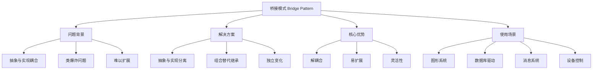
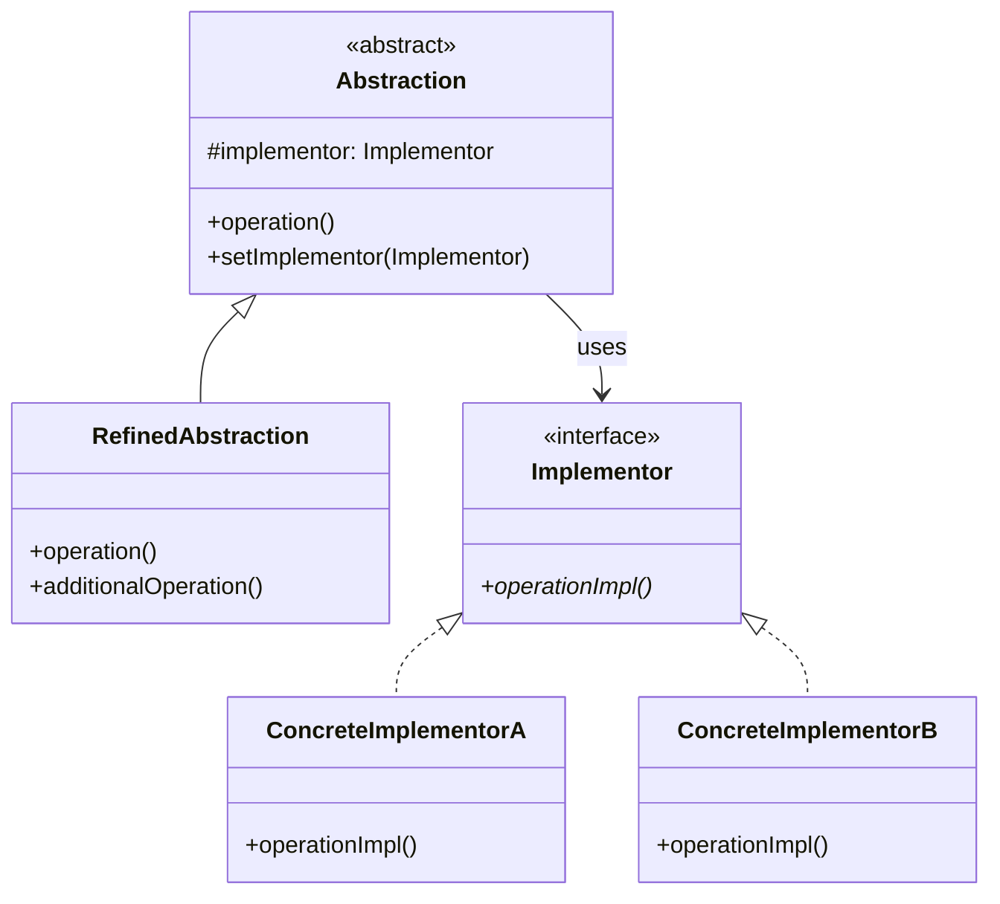

# 🌉 桥接模式详解

[[04-结构型模式/07-享元模式]] ← [[04-结构型模式/09-结构型模式对比表]]
## 🎯 桥接模式概览

### 📊 模式基本信息



### 🎯 **定义与意图**
桥接模式将抽象部分与它的实现部分分离，使它们都可以独立地变化。通过组合的方式建立两个类之间的联系，而不是继承。

### 📋 **核心价值**
- **解耦合**: 抽象和实现分离，各自独立变化
- **易扩展**: 可以独立添加新的抽象或实现
- **灵活性**: 运行时可以动态选择实现
- **避免类爆炸**: 减少子类的数量

## 🏗️ 桥接模式结构

### 📊 **类图结构**



### 🎯 **角色职责**

#### **Abstraction (抽象类)**
- 定义抽象类的接口
- 维护一个指向实现类对象的引用

#### **RefinedAbstraction (扩充抽象类)**
- 扩充由Abstraction定义的接口
- 可以调用Implementor的方法

#### **Implementor (实现类接口)**
- 定义实现类的接口
- 这个接口不一定要与Abstraction的接口完全一致

#### **ConcreteImplementor (具体实现类)**
- 给出实现类接口的具体实现

## 💻 桥接模式实现

### 🎯 **经典实现：图形绘制系统**

```java
// ✅ 图形实现接口
public interface DrawingAPI {
    void drawCircle(double x, double y, double radius);
    void drawRectangle(double x, double y, double width, double height);
    void drawLine(double x1, double y1, double x2, double y2);
    void setColor(String color);
    void setLineWidth(int width);
}

// ✅ Windows图形实现
public class WindowsDrawingAPI implements DrawingAPI {
    private String currentColor = "black";
    private int currentLineWidth = 1;
    
    @Override
    public void drawCircle(double x, double y, double radius) {
        System.out.printf("Windows: 绘制圆形 位置(%.1f, %.1f) 半径%.1f 颜色%s 线宽%d%n",
                         x, y, radius, currentColor, currentLineWidth);
        
        // 模拟Windows GDI绘制
        drawWindowsCircle(x, y, radius);
    }
    
    @Override
    public void drawRectangle(double x, double y, double width, double height) {
        System.out.printf("Windows: 绘制矩形 位置(%.1f, %.1f) 尺寸(%.1f×%.1f) 颜色%s 线宽%d%n",
                         x, y, width, height, currentColor, currentLineWidth);
        
        // 模拟Windows GDI绘制
        drawWindowsRectangle(x, y, width, height);
    }
    
    @Override
    public void drawLine(double x1, double y1, double x2, double y2) {
        System.out.printf("Windows: 绘制直线 从(%.1f, %.1f) 到(%.1f, %.1f) 颜色%s 线宽%d%n",
                         x1, y1, x2, y2, currentColor, currentLineWidth);
        
        // 模拟Windows GDI绘制
        drawWindowsLine(x1, y1, x2, y2);
    }
    
    @Override
    public void setColor(String color) {
        this.currentColor = color;
        System.out.println("Windows: 设置颜色为 " + color);
    }
    
    @Override
    public void setLineWidth(int width) {
        this.currentLineWidth = width;
        System.out.println("Windows: 设置线宽为 " + width);
    }
    
    // ✅ Windows特有方法
    private void drawWindowsCircle(double x, double y, double radius) {
        // 模拟Windows GDI绘制圆形
    }
    
    private void drawWindowsRectangle(double x, double y, double width, double height) {
        // 模拟Windows GDI绘制矩形
    }
    
    private void drawWindowsLine(double x1, double y1, double x2, double y2) {
        // 模拟Windows GDI绘制直线
    }
}

// ✅ Linux图形实现
public class LinuxDrawingAPI implements DrawingAPI {
    private String currentColor = "black";
    private int currentLineWidth = 1;
    
    @Override
    public void drawCircle(double x, double y, double radius) {
        System.out.printf("Linux: 绘制圆形 位置(%.1f, %.1f) 半径%.1f 颜色%s 线宽%d%n",
                         x, y, radius, currentColor, currentLineWidth);
        
        // 模拟Linux X11绘制
        drawX11Circle(x, y, radius);
    }
    
    @Override
    public void drawRectangle(double x, double y, double width, double height) {
        System.out.printf("Linux: 绘制矩形 位置(%.1f, %.1f) 尺寸(%.1f×%.1f) 颜色%s 线宽%d%n",
                         x, y, width, height, currentColor, currentLineWidth);
        
        // 模拟Linux X11绘制
        drawX11Rectangle(x, y, width, height);
    }
    
    @Override
    public void drawLine(double x1, double y1, double x2, double y2) {
        System.out.printf("Linux: 绘制直线 从(%.1f, %.1f) 到(%.1f, %.1f) 颜色%s 线宽%d%n",
                         x1, y1, x2, y2, currentColor, currentLineWidth);
        
        // 模拟Linux X11绘制
        drawX11Line(x1, y1, x2, y2);
    }
    
    @Override
    public void setColor(String color) {
        this.currentColor = color;
        System.out.println("Linux: 设置颜色为 " + color);
    }
    
    @Override
    public void setLineWidth(int width) {
        this.currentLineWidth = width;
        System.out.println("Linux: 设置线宽为 " + width);
    }
    
    // ✅ Linux特有方法
    private void drawX11Circle(double x, double y, double radius) {
        // 模拟Linux X11绘制圆形
    }
    
    private void drawX11Rectangle(double x, double y, double width, double height) {
        // 模拟Linux X11绘制矩形
    }
    
    private void drawX11Line(double x1, double y1, double x2, double y2) {
        // 模拟Linux X11绘制直线
    }
}

// ✅ 抽象图形类
public abstract class Shape {
    protected DrawingAPI drawingAPI;
    protected double x, y;
    protected String color;
    protected int lineWidth;
    
    public Shape(DrawingAPI drawingAPI, double x, double y) {
        this.drawingAPI = drawingAPI;
        this.x = x;
        this.y = y;
        this.color = "black";
        this.lineWidth = 1;
    }
    
    // ✅ 抽象方法：绘制
    public abstract void draw();
    
    // ✅ 抽象方法：计算面积
    public abstract double getArea();
    
    // ✅ 抽象方法：计算周长
    public abstract double getPerimeter();
    
    // ✅ 通用方法
    public void setColor(String color) {
        this.color = color;
        drawingAPI.setColor(color);
    }
    
    public void setLineWidth(int width) {
        this.lineWidth = width;
        drawingAPI.setLineWidth(width);
    }
    
    public void move(double newX, double newY) {
        this.x = newX;
        this.y = newY;
    }
    
    // ✅ 切换绘制API
    public void setDrawingAPI(DrawingAPI drawingAPI) {
        this.drawingAPI = drawingAPI;
        // 重新设置当前属性
        drawingAPI.setColor(color);
        drawingAPI.setLineWidth(lineWidth);
    }
    
    // Getters
    public double getX() { return x; }
    public double getY() { return y; }
    public String getColor() { return color; }
    public int getLineWidth() { return lineWidth; }
}

// ✅ 圆形类
public class Circle extends Shape {
    private double radius;
    
    public Circle(DrawingAPI drawingAPI, double x, double y, double radius) {
        super(drawingAPI, x, y);
        this.radius = radius;
    }
    
    @Override
    public void draw() {
        drawingAPI.drawCircle(x, y, radius);
    }
    
    @Override
    public double getArea() {
        return Math.PI * radius * radius;
    }
    
    @Override
    public double getPerimeter() {
        return 2 * Math.PI * radius;
    }
    
    // ✅ 圆形特有方法
    public void setRadius(double radius) {
        this.radius = radius;
    }
    
    public double getRadius() {
        return radius;
    }
    
    public void scale(double factor) {
        this.radius *= factor;
    }
}

// ✅ 矩形类
public class Rectangle extends Shape {
    private double width, height;
    
    public Rectangle(DrawingAPI drawingAPI, double x, double y, double width, double height) {
        super(drawingAPI, x, y);
        this.width = width;
        this.height = height;
    }
    
    @Override
    public void draw() {
        drawingAPI.drawRectangle(x, y, width, height);
    }
    
    @Override
    public double getArea() {
        return width * height;
    }
    
    @Override
    public double getPerimeter() {
        return 2 * (width + height);
    }
    
    // ✅ 矩形特有方法
    public void setWidth(double width) {
        this.width = width;
    }
    
    public void setHeight(double height) {
        this.height = height;
    }
    
    public double getWidth() {
        return width;
    }
    
    public double getHeight() {
        return height;
    }
    
    public void scale(double factor) {
        this.width *= factor;
        this.height *= factor;
    }
}

// ✅ 图形管理器
public class ShapeManager {
    private final List<Shape> shapes;
    private final Map<String, DrawingAPI> drawingAPIs;
    
    public ShapeManager() {
        this.shapes = new ArrayList<>();
        this.drawingAPIs = new HashMap<>();
        
        // ✅ 注册默认绘制API
        registerDrawingAPI("windows", new WindowsDrawingAPI());
        registerDrawingAPI("linux", new LinuxDrawingAPI());
    }
    
    // ✅ 注册绘制API
    public void registerDrawingAPI(String name, DrawingAPI drawingAPI) {
        drawingAPIs.put(name, drawingAPI);
        System.out.println("注册绘制API: " + name);
    }
    
    // ✅ 创建图形
    public Circle createCircle(String apiName, double x, double y, double radius) {
        DrawingAPI api = drawingAPIs.get(apiName);
        if (api == null) {
            throw new IllegalArgumentException("未找到绘制API: " + apiName);
        }
        
        Circle circle = new Circle(api, x, y, radius);
        shapes.add(circle);
        return circle;
    }
    
    public Rectangle createRectangle(String apiName, double x, double y, double width, double height) {
        DrawingAPI api = drawingAPIs.get(apiName);
        if (api == null) {
            throw new IllegalArgumentException("未找到绘制API: " + apiName);
        }
        
        Rectangle rectangle = new Rectangle(api, x, y, width, height);
        shapes.add(rectangle);
        return rectangle;
    }
    
    // ✅ 绘制所有图形
    public void drawAll() {
        System.out.println("=== 绘制所有图形 ===");
        
        for (Shape shape : shapes) {
            shape.draw();
        }
        
        System.out.println("==================");
    }
    
    // ✅ 切换所有图形的绘制API
    public void switchAllToAPI(String apiName) {
        DrawingAPI api = drawingAPIs.get(apiName);
        if (api == null) {
            throw new IllegalArgumentException("未找到绘制API: " + apiName);
        }
        
        System.out.println("切换所有图形到 " + apiName + " API");
        
        for (Shape shape : shapes) {
            shape.setDrawingAPI(api);
        }
    }
    
    // ✅ 获取统计信息
    public void printStatistics() {
        System.out.println("=== 图形管理器统计 ===");
        System.out.println("总图形数量: " + shapes.size());
        System.out.println("可用绘制API: " + drawingAPIs.keySet());
        
        Map<String, Long> shapeCounts = shapes.stream()
            .collect(Collectors.groupingBy(
                shape -> shape.getClass().getSimpleName(),
                Collectors.counting()
            ));
        
        shapeCounts.forEach((type, count) -> 
            System.out.println("  " + type + ": " + count + " 个"));
        
        System.out.println("==================");
    }
    
    // ✅ 按类型获取图形
    public <T extends Shape> List<T> getShapesByType(Class<T> type) {
        return shapes.stream()
            .filter(type::isInstance)
            .map(type::cast)
            .collect(Collectors.toList());
    }
    
    // ✅ 清空所有图形
    public void clearAll() {
        shapes.clear();
        System.out.println("清空所有图形");
    }
}

// ✅ 客户端使用示例
public class BridgePatternDemo {
    public static void main(String[] args) {
        ShapeManager manager = new ShapeManager();
        
        // ✅ 创建不同API的图形
        Circle circle1 = manager.createCircle("windows", 10, 10, 5);
        Circle circle2 = manager.createCircle("linux", 20, 20, 8);
        
        Rectangle rect1 = manager.createRectangle("windows", 30, 30, 10, 15);
        Rectangle rect2 = manager.createRectangle("linux", 50, 50, 12, 8);
        
        // ✅ 设置图形属性
        circle1.setColor("red");
        circle1.setLineWidth(2);
        
        rect1.setColor("blue");
        rect1.setLineWidth(3);
        
        // ✅ 绘制所有图形
        manager.drawAll();
        
        // ✅ 显示统计信息
        manager.printStatistics();
        
        // ✅ 演示桥接模式的优势：运行时切换API
        System.out.println("\n=== 运行时切换API ===");
        manager.switchAllToAPI("linux");
        manager.drawAll();
        
        // ✅ 演示桥接模式的优势：独立扩展
        System.out.println("\n=== 独立扩展演示 ===");
        
        // 添加新的绘制API
        manager.registerDrawingAPI("macos", new MacOSDrawingAPI());
        
        // 创建使用新API的图形
        Circle macCircle = manager.createCircle("macos", 70, 70, 6);
        macCircle.setColor("green");
        macCircle.draw();
        
        manager.printStatistics();
    }
}

// ✅ macOS图形实现（演示独立扩展）
class MacOSDrawingAPI implements DrawingAPI {
    private String currentColor = "black";
    private int currentLineWidth = 1;
    
    @Override
    public void drawCircle(double x, double y, double radius) {
        System.out.printf("macOS: 绘制圆形 位置(%.1f, %.1f) 半径%.1f 颜色%s 线宽%d%n",
                         x, y, radius, currentColor, currentLineWidth);
    }
    
    @Override
    public void drawRectangle(double x, double y, double width, double height) {
        System.out.printf("macOS: 绘制矩形 位置(%.1f, %.1f) 尺寸(%.1f×%.1f) 颜色%s 线宽%d%n",
                         x, y, width, height, currentColor, currentLineWidth);
    }
    
    @Override
    public void drawLine(double x1, double y1, double x2, double y2) {
        System.out.printf("macOS: 绘制直线 从(%.1f, %.1f) 到(%.1f, %.1f) 颜色%s 线宽%d%n",
                         x1, y1, x2, y2, currentColor, currentLineWidth);
    }
    
    @Override
    public void setColor(String color) {
        this.currentColor = color;
        System.out.println("macOS: 设置颜色为 " + color);
    }
    
    @Override
    public void setLineWidth(int width) {
        this.currentLineWidth = width;
        System.out.println("macOS: 设置线宽为 " + width);
    }
}
```

### 🚀 **现代企业级实现：数据库访问层**

```java
// ✅ 数据库连接接口
public interface DatabaseConnection {
    void connect(String url, String username, String password);
    void disconnect();
    boolean isConnected();
    void executeQuery(String sql);
    void executeUpdate(String sql);
    List<Map<String, Object>> fetchResults();
    void beginTransaction();
    void commitTransaction();
    void rollbackTransaction();
    String getDatabaseType();
}

// ✅ MySQL数据库连接
public class MySQLConnection implements DatabaseConnection {
    private boolean connected = false;
    private String connectionUrl;
    private List<Map<String, Object>> lastResults;
    
    @Override
    public void connect(String url, String username, String password) {
        this.connectionUrl = url;
        System.out.println("MySQL: 连接到数据库 " + url + " 用户 " + username);
        
        // 模拟连接过程
        try {
            Thread.sleep(100); // 模拟连接延迟
            this.connected = true;
            System.out.println("MySQL: 连接成功");
        } catch (InterruptedException e) {
            Thread.currentThread().interrupt();
        }
    }
    
    @Override
    public void disconnect() {
        if (connected) {
            System.out.println("MySQL: 断开数据库连接");
            this.connected = false;
        }
    }
    
    @Override
    public boolean isConnected() {
        return connected;
    }
    
    @Override
    public void executeQuery(String sql) {
        if (!connected) {
            throw new IllegalStateException("数据库未连接");
        }
        
        System.out.println("MySQL: 执行查询: " + sql);
        
        // 模拟查询结果
        this.lastResults = new ArrayList<>();
        Map<String, Object> row1 = new HashMap<>();
        row1.put("id", 1);
        row1.put("name", "张三");
        row1.put("email", "zhangsan@example.com");
        lastResults.add(row1);
        
        Map<String, Object> row2 = new HashMap<>();
        row2.put("id", 2);
        row2.put("name", "李四");
        row2.put("email", "lisi@example.com");
        lastResults.add(row2);
    }
    
    @Override
    public void executeUpdate(String sql) {
        if (!connected) {
            throw new IllegalStateException("数据库未连接");
        }
        
        System.out.println("MySQL: 执行更新: " + sql);
    }
    
    @Override
    public List<Map<String, Object>> fetchResults() {
        return lastResults != null ? new ArrayList<>(lastResults) : Collections.emptyList();
    }
    
    @Override
    public void beginTransaction() {
        System.out.println("MySQL: 开始事务");
    }
    
    @Override
    public void commitTransaction() {
        System.out.println("MySQL: 提交事务");
    }
    
    @Override
    public void rollbackTransaction() {
        System.out.println("MySQL: 回滚事务");
    }
    
    @Override
    public String getDatabaseType() {
        return "MySQL";
    }
}

// ✅ PostgreSQL数据库连接
public class PostgreSQLConnection implements DatabaseConnection {
    private boolean connected = false;
    private String connectionUrl;
    private List<Map<String, Object>> lastResults;
    
    @Override
    public void connect(String url, String username, String password) {
        this.connectionUrl = url;
        System.out.println("PostgreSQL: 连接到数据库 " + url + " 用户 " + username);
        
        // 模拟连接过程
        try {
            Thread.sleep(150); // 模拟连接延迟
            this.connected = true;
            System.out.println("PostgreSQL: 连接成功");
        } catch (InterruptedException e) {
            Thread.currentThread().interrupt();
        }
    }
    
    @Override
    public void disconnect() {
        if (connected) {
            System.out.println("PostgreSQL: 断开数据库连接");
            this.connected = false;
        }
    }
    
    @Override
    public boolean isConnected() {
        return connected;
    }
    
    @Override
    public void executeQuery(String sql) {
        if (!connected) {
            throw new IllegalStateException("数据库未连接");
        }
        
        System.out.println("PostgreSQL: 执行查询: " + sql);
        
        // 模拟查询结果
        this.lastResults = new ArrayList<>();
        Map<String, Object> row1 = new HashMap<>();
        row1.put("id", 1);
        row1.put("name", "John");
        row1.put("email", "john@example.com");
        lastResults.add(row1);
        
        Map<String, Object> row2 = new HashMap<>();
        row2.put("id", 2);
        row2.put("name", "Jane");
        row2.put("email", "jane@example.com");
        lastResults.add(row2);
    }
    
    @Override
    public void executeUpdate(String sql) {
        if (!connected) {
            throw new IllegalStateException("数据库未连接");
        }
        
        System.out.println("PostgreSQL: 执行更新: " + sql);
    }
    
    @Override
    public List<Map<String, Object>> fetchResults() {
        return lastResults != null ? new ArrayList<>(lastResults) : Collections.emptyList();
    }
    
    @Override
    public void beginTransaction() {
        System.out.println("PostgreSQL: 开始事务");
    }
    
    @Override
    public void commitTransaction() {
        System.out.println("PostgreSQL: 提交事务");
    }
    
    @Override
    public void rollbackTransaction() {
        System.out.println("PostgreSQL: 回滚事务");
    }
    
    @Override
    public String getDatabaseType() {
        return "PostgreSQL";
    }
}

// ✅ 抽象数据访问类
public abstract class DataAccessor {
    protected DatabaseConnection connection;
    protected String tableName;
    
    public DataAccessor(DatabaseConnection connection, String tableName) {
        this.connection = connection;
        this.tableName = tableName;
    }
    
    // ✅ 抽象方法：查询
    public abstract List<Map<String, Object>> findAll();
    
    // ✅ 抽象方法：根据ID查询
    public abstract Map<String, Object> findById(Object id);
    
    // ✅ 抽象方法：插入
    public abstract boolean insert(Map<String, Object> data);
    
    // ✅ 抽象方法：更新
    public abstract boolean update(Object id, Map<String, Object> data);
    
    // ✅ 抽象方法：删除
    public abstract boolean delete(Object id);
    
    // ✅ 通用方法
    public void connect(String url, String username, String password) {
        connection.connect(url, username, password);
    }
    
    public void disconnect() {
        connection.disconnect();
    }
    
    public boolean isConnected() {
        return connection.isConnected();
    }
    
    // ✅ 切换数据库连接
    public void setConnection(DatabaseConnection connection) {
        this.connection = connection;
    }
    
    // ✅ 获取数据库类型
    public String getDatabaseType() {
        return connection.getDatabaseType();
    }
    
    // ✅ 事务管理
    public void beginTransaction() {
        connection.beginTransaction();
    }
    
    public void commitTransaction() {
        connection.commitTransaction();
    }
    
    public void rollbackTransaction() {
        connection.rollbackTransaction();
    }
}

// ✅ 用户数据访问类
public class UserDataAccessor extends DataAccessor {
    public UserDataAccessor(DatabaseConnection connection) {
        super(connection, "users");
    }
    
    @Override
    public List<Map<String, Object>> findAll() {
        String sql = "SELECT * FROM " + tableName;
        connection.executeQuery(sql);
        return connection.fetchResults();
    }
    
    @Override
    public Map<String, Object> findById(Object id) {
        String sql = "SELECT * FROM " + tableName + " WHERE id = " + id;
        connection.executeQuery(sql);
        List<Map<String, Object>> results = connection.fetchResults();
        return results.isEmpty() ? null : results.get(0);
    }
    
    @Override
    public boolean insert(Map<String, Object> data) {
        StringBuilder sql = new StringBuilder("INSERT INTO " + tableName + " (");
        StringBuilder values = new StringBuilder(" VALUES (");
        
        boolean first = true;
        for (Map.Entry<String, Object> entry : data.entrySet()) {
            if (!first) {
                sql.append(", ");
                values.append(", ");
            }
            sql.append(entry.getKey());
            values.append("'").append(entry.getValue()).append("'");
            first = false;
        }
        
        sql.append(")").append(values).append(")");
        connection.executeUpdate(sql.toString());
        return true;
    }
    
    @Override
    public boolean update(Object id, Map<String, Object> data) {
        StringBuilder sql = new StringBuilder("UPDATE " + tableName + " SET ");
        
        boolean first = true;
        for (Map.Entry<String, Object> entry : data.entrySet()) {
            if (!first) {
                sql.append(", ");
            }
            sql.append(entry.getKey()).append(" = '").append(entry.getValue()).append("'");
            first = false;
        }
        
        sql.append(" WHERE id = ").append(id);
        connection.executeUpdate(sql.toString());
        return true;
    }
    
    @Override
    public boolean delete(Object id) {
        String sql = "DELETE FROM " + tableName + " WHERE id = " + id;
        connection.executeUpdate(sql);
        return true;
    }
    
    // ✅ 用户特有方法
    public List<Map<String, Object>> findByEmail(String email) {
        String sql = "SELECT * FROM " + tableName + " WHERE email = '" + email + "'";
        connection.executeQuery(sql);
        return connection.fetchResults();
    }
    
    public boolean updatePassword(Object id, String newPassword) {
        String sql = "UPDATE " + tableName + " SET password = '" + newPassword + "' WHERE id = " + id;
        connection.executeUpdate(sql);
        return true;
    }
}

// ✅ 产品数据访问类
public class ProductDataAccessor extends DataAccessor {
    public ProductDataAccessor(DatabaseConnection connection) {
        super(connection, "products");
    }
    
    @Override
    public List<Map<String, Object>> findAll() {
        String sql = "SELECT * FROM " + tableName;
        connection.executeQuery(sql);
        return connection.fetchResults();
    }
    
    @Override
    public Map<String, Object> findById(Object id) {
        String sql = "SELECT * FROM " + tableName + " WHERE id = " + id;
        connection.executeQuery(sql);
        List<Map<String, Object>> results = connection.fetchResults();
        return results.isEmpty() ? null : results.get(0);
    }
    
    @Override
    public boolean insert(Map<String, Object> data) {
        StringBuilder sql = new StringBuilder("INSERT INTO " + tableName + " (");
        StringBuilder values = new StringBuilder(" VALUES (");
        
        boolean first = true;
        for (Map.Entry<String, Object> entry : data.entrySet()) {
            if (!first) {
                sql.append(", ");
                values.append(", ");
            }
            sql.append(entry.getKey());
            values.append("'").append(entry.getValue()).append("'");
            first = false;
        }
        
        sql.append(")").append(values).append(")");
        connection.executeUpdate(sql.toString());
        return true;
    }
    
    @Override
    public boolean update(Object id, Map<String, Object> data) {
        StringBuilder sql = new StringBuilder("UPDATE " + tableName + " SET ");
        
        boolean first = true;
        for (Map.Entry<String, Object> entry : data.entrySet()) {
            if (!first) {
                sql.append(", ");
            }
            sql.append(entry.getKey()).append(" = '").append(entry.getValue()).append("'");
            first = false;
        }
        
        sql.append(" WHERE id = ").append(id);
        connection.executeUpdate(sql.toString());
        return true;
    }
    
    @Override
    public boolean delete(Object id) {
        String sql = "DELETE FROM " + tableName + " WHERE id = " + id;
        connection.executeUpdate(sql);
        return true;
    }
    
    // ✅ 产品特有方法
    public List<Map<String, Object>> findByCategory(String category) {
        String sql = "SELECT * FROM " + tableName + " WHERE category = '" + category + "'";
        connection.executeQuery(sql);
        return connection.fetchResults();
    }
    
    public List<Map<String, Object>> findByPriceRange(double minPrice, double maxPrice) {
        String sql = "SELECT * FROM " + tableName + " WHERE price BETWEEN " + minPrice + " AND " + maxPrice;
        connection.executeQuery(sql);
        return connection.fetchResults();
    }
}

// ✅ 数据访问管理器
public class DataAccessManager {
    private final Map<String, DatabaseConnection> connections;
    private final Map<String, DataAccessor> accessors;
    
    public DataAccessManager() {
        this.connections = new HashMap<>();
        this.accessors = new HashMap<>();
        
        // ✅ 注册默认数据库连接
        registerConnection("mysql", new MySQLConnection());
        registerConnection("postgresql", new PostgreSQLConnection());
    }
    
    // ✅ 注册数据库连接
    public void registerConnection(String name, DatabaseConnection connection) {
        connections.put(name, connection);
        System.out.println("注册数据库连接: " + name);
    }
    
    // ✅ 创建数据访问器
    public UserDataAccessor createUserAccessor(String connectionName) {
        DatabaseConnection connection = connections.get(connectionName);
        if (connection == null) {
            throw new IllegalArgumentException("未找到数据库连接: " + connectionName);
        }
        
        UserDataAccessor accessor = new UserDataAccessor(connection);
        accessors.put("user_" + connectionName, accessor);
        return accessor;
    }
    
    public ProductDataAccessor createProductAccessor(String connectionName) {
        DatabaseConnection connection = connections.get(connectionName);
        if (connection == null) {
            throw new IllegalArgumentException("未找到数据库连接: " + connectionName);
        }
        
        ProductDataAccessor accessor = new ProductDataAccessor(connection);
        accessors.put("product_" + connectionName, accessor);
        return accessor;
    }
    
    // ✅ 切换数据访问器的数据库连接
    public void switchAccessorConnection(String accessorName, String connectionName) {
        DataAccessor accessor = accessors.get(accessorName);
        DatabaseConnection connection = connections.get(connectionName);
        
        if (accessor == null || connection == null) {
            throw new IllegalArgumentException("未找到访问器或连接");
        }
        
        accessor.setConnection(connection);
        System.out.println("切换访问器 " + accessorName + " 到连接 " + connectionName);
    }
    
    // ✅ 获取统计信息
    public void printStatistics() {
        System.out.println("=== 数据访问管理器统计 ===");
        System.out.println("注册的连接数: " + connections.size());
        System.out.println("创建的访问器数: " + accessors.size());
        
        connections.forEach((name, connection) -> 
            System.out.println("  连接 " + name + ": " + connection.getDatabaseType()));
        
        accessors.forEach((name, accessor) -> 
            System.out.println("  访问器 " + name + ": " + accessor.getDatabaseType()));
        
        System.out.println("==================");
    }
    
    // ✅ 关闭所有连接
    public void closeAllConnections() {
        connections.values().forEach(DatabaseConnection::disconnect);
        System.out.println("关闭所有数据库连接");
    }
}

// ✅ 客户端使用示例
public class DatabaseBridgeDemo {
    public static void main(String[] args) {
        DataAccessManager manager = new DataAccessManager();
        
        // ✅ 创建不同数据库的访问器
        UserDataAccessor mysqlUserAccessor = manager.createUserAccessor("mysql");
        UserDataAccessor postgresUserAccessor = manager.createUserAccessor("postgresql");
        
        ProductDataAccessor mysqlProductAccessor = manager.createProductAccessor("mysql");
        ProductDataAccessor postgresProductAccessor = manager.createProductAccessor("postgresql");
        
        // ✅ 连接数据库
        mysqlUserAccessor.connect("jdbc:mysql://localhost:3306/test", "root", "password");
        postgresUserAccessor.connect("jdbc:postgresql://localhost:5432/test", "postgres", "password");
        
        // ✅ 演示桥接模式的优势：不同数据库的相同操作
        System.out.println("=== MySQL用户操作 ===");
        mysqlUserAccessor.findAll().forEach(System.out::println);
        
        System.out.println("\n=== PostgreSQL用户操作 ===");
        postgresUserAccessor.findAll().forEach(System.out::println);
        
        // ✅ 演示桥接模式的优势：运行时切换数据库
        System.out.println("\n=== 运行时切换数据库 ===");
        manager.switchAccessorConnection("user_mysql", "postgresql");
        mysqlUserAccessor.findAll().forEach(System.out::println);
        
        // ✅ 演示桥接模式的优势：独立扩展
        System.out.println("\n=== 独立扩展演示 ===");
        
        // 添加新的数据库连接
        manager.registerConnection("oracle", new OracleConnection());
        
        // 创建使用新数据库的访问器
        UserDataAccessor oracleUserAccessor = manager.createUserAccessor("oracle");
        oracleUserAccessor.connect("jdbc:oracle:thin:@localhost:1521:xe", "scott", "tiger");
        
        // ✅ 显示统计信息
        manager.printStatistics();
        
        // ✅ 关闭所有连接
        manager.closeAllConnections();
    }
}

// ✅ Oracle数据库连接（演示独立扩展）
class OracleConnection implements DatabaseConnection {
    private boolean connected = false;
    private String connectionUrl;
    private List<Map<String, Object>> lastResults;
    
    @Override
    public void connect(String url, String username, String password) {
        this.connectionUrl = url;
        System.out.println("Oracle: 连接到数据库 " + url + " 用户 " + username);
        
        try {
            Thread.sleep(200); // 模拟连接延迟
            this.connected = true;
            System.out.println("Oracle: 连接成功");
        } catch (InterruptedException e) {
            Thread.currentThread().interrupt();
        }
    }
    
    @Override
    public void disconnect() {
        if (connected) {
            System.out.println("Oracle: 断开数据库连接");
            this.connected = false;
        }
    }
    
    @Override
    public boolean isConnected() {
        return connected;
    }
    
    @Override
    public void executeQuery(String sql) {
        if (!connected) {
            throw new IllegalStateException("数据库未连接");
        }
        
        System.out.println("Oracle: 执行查询: " + sql);
        
        this.lastResults = new ArrayList<>();
        Map<String, Object> row1 = new HashMap<>();
        row1.put("id", 1);
        row1.put("name", "Oracle User");
        row1.put("email", "oracle@example.com");
        lastResults.add(row1);
    }
    
    @Override
    public void executeUpdate(String sql) {
        if (!connected) {
            throw new IllegalStateException("数据库未连接");
        }
        
        System.out.println("Oracle: 执行更新: " + sql);
    }
    
    @Override
    public List<Map<String, Object>> fetchResults() {
        return lastResults != null ? new ArrayList<>(lastResults) : Collections.emptyList();
    }
    
    @Override
    public void beginTransaction() {
        System.out.println("Oracle: 开始事务");
    }
    
    @Override
    public void commitTransaction() {
        System.out.println("Oracle: 提交事务");
    }
    
    @Override
    public void rollbackTransaction() {
        System.out.println("Oracle: 回滚事务");
    }
    
    @Override
    public String getDatabaseType() {
        return "Oracle";
    }
}
```

## 🔧 桥接模式高级技巧

### 🎯 **动态桥接和策略模式结合**

```java
// ✅ 动态桥接管理器
public class DynamicBridgeManager {
    private final Map<String, Object> bridges;
    private final Map<String, Class<?>> bridgeTypes;
    
    public DynamicBridgeManager() {
        this.bridges = new ConcurrentHashMap<>();
        this.bridgeTypes = new ConcurrentHashMap<>();
    }
    
    // ✅ 注册桥接类型
    public void registerBridgeType(String name, Class<?> bridgeClass) {
        bridgeTypes.put(name, bridgeClass);
    }
    
    // ✅ 创建桥接实例
    public <T> T createBridge(String name, Object... args) {
        Class<?> bridgeClass = bridgeTypes.get(name);
        if (bridgeClass == null) {
            throw new IllegalArgumentException("未找到桥接类型: " + name);
        }
        
        try {
            Constructor<?> constructor = bridgeClass.getDeclaredConstructor(
                Arrays.stream(args).map(Object::getClass).toArray(Class[]::new));
            T bridge = (T) constructor.newInstance(args);
            bridges.put(name, bridge);
            return bridge;
        } catch (Exception e) {
            throw new RuntimeException("创建桥接失败: " + name, e);
        }
    }
    
    // ✅ 获取桥接实例
    public <T> T getBridge(String name) {
        return (T) bridges.get(name);
    }
    
    // ✅ 动态切换桥接实现
    public void switchBridgeImplementation(String name, Object newImplementation) {
        bridges.put(name, newImplementation);
        System.out.println("切换桥接实现: " + name);
    }
}
```

## 🚀 桥接模式最佳实践

### 📋 **使用指南**

1. **设计原则**:
   - 明确区分抽象和实现
   - 使用组合而不是继承
   - 确保抽象和实现可以独立变化

2. **实现技巧**:
   - 使用接口定义实现
   - 在抽象类中持有实现引用
   - 提供运行时切换实现的能力

3. **扩展策略**:
   - 独立添加新的抽象类
   - 独立添加新的实现类
   - 支持动态配置和切换

### ⚠️ **注意事项**

1. **复杂性**: 不要为了解耦而过度设计
2. **性能**: 考虑桥接调用的性能开销
3. **维护性**: 确保抽象和实现的接口稳定
4. **测试**: 充分测试不同实现的组合

## 📊 与其他模式的对比

| 对比维度 | 桥接模式 | 适配器模式 | 装饰器模式 |
|----------|----------|------------|------------|
| **目的** | 抽象与实现分离 | 接口转换 | 功能增强 |
| **关系** | 组合关系 | 适配关系 | 包装关系 |
| **变化** | 独立变化 | 接口变化 | 功能变化 |
| **使用** | 设计时分离 | 运行时适配 | 运行时增强 |

## 🔗 学习衔接

- **上一模式** ← [[享元模式]]
- **下一模式** → [[结构型模式对比表]]
- **模式对比** → [[04-结构型模式/09-结构型模式对比表]]
- **数据库设计** → [[设计模式最佳实践秘典]]

---
**💡 桥接模式精髓**: 桥接模式就像一座桥，连接着两岸。抽象在左岸，实现在右岸，桥接模式就是这座桥，让它们可以独立变化而不相互影响。就像你可以换不同的车（实现）过同一座桥（抽象），也可以在同一辆车（实现）上过不同的桥（抽象）！
