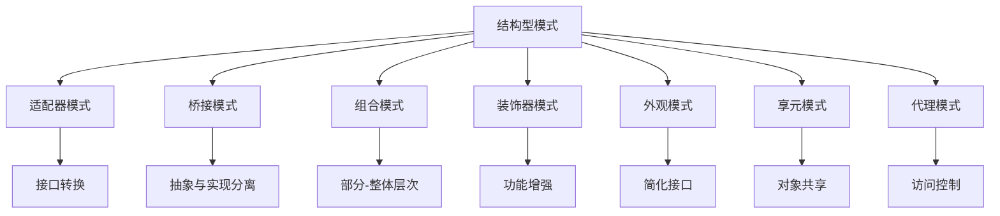

# 📊 结构型模式对比表

[[04-结构型模式/08-代理模式]] ← [[05-行为型模式/01-行为型模式概述]]
## 🎯 结构型模式对比概览

### 📊 模式关系图



## 📋 模式对比表

### 🏗️ **核心特征对比**

| 模式 | 主要目的 | 核心特点 | 使用场景 | 复杂度 |
|------|----------|----------|----------|--------|
| **适配器模式** | 接口转换 | 将不兼容接口转换为兼容接口 | 集成第三方库、接口不匹配 | ⭐⭐ |
| **桥接模式** | 抽象与实现分离 | 使用组合代替继承 | 多平台支持、运行时切换实现 | ⭐⭐⭐ |
| **组合模式** | 部分-整体层次 | 树形结构、统一接口 | 文件系统、UI组件、组织架构 | ⭐⭐ |
| **装饰器模式** | 功能增强 | 动态添加功能、透明装饰 | 功能扩展、链式增强 | ⭐⭐ |
| **外观模式** | 简化接口 | 为复杂子系统提供简单接口 | 系统集成、API封装 | ⭐⭐ |
| **享元模式** | 对象共享 | 共享内在状态、减少内存使用 | 大量相似对象、性能优化 | ⭐⭐⭐ |
| **代理模式** | 访问控制 | 控制对象访问、延迟加载 | 权限控制、缓存、远程调用 | ⭐⭐ |

### 🎯 **设计目标对比**

| 模式 | 解耦程度 | 扩展性 | 性能影响 | 内存使用 |
|------|----------|--------|----------|----------|
| **适配器模式** | 中等 | 中等 | 无影响 | 无变化 |
| **桥接模式** | 高 | 高 | 无影响 | 无变化 |
| **组合模式** | 中等 | 高 | 递归开销 | 树形结构 |
| **装饰器模式** | 中等 | 高 | 链式开销 | 装饰器链 |
| **外观模式** | 高 | 中等 | 无影响 | 无变化 |
| **享元模式** | 中等 | 中等 | 性能提升 | 内存优化 |
| **代理模式** | 中等 | 中等 | 代理开销 | 代理对象 |

### 🔧 **实现复杂度对比**

| 模式 | 接口设计 | 类数量 | 继承关系 | 组合关系 |
|------|----------|--------|----------|----------|
| **适配器模式** | 简单 | 少 | 实现接口 | 组合目标对象 |
| **桥接模式** | 中等 | 中等 | 抽象类 | 组合实现者 |
| **组合模式** | 中等 | 中等 | 实现接口 | 组合子组件 |
| **装饰器模式** | 简单 | 多 | 继承装饰器 | 组合被装饰对象 |
| **外观模式** | 简单 | 少 | 无 | 组合子系统 |
| **享元模式** | 中等 | 中等 | 实现接口 | 工厂管理 |
| **代理模式** | 简单 | 少 | 实现接口 | 组合目标对象 |

## 📋 模式选择指南

### 🎯 **按问题类型选择**

#### **接口不匹配问题**
- **适配器模式**: 将不兼容接口转换为兼容接口
- **外观模式**: 为复杂子系统提供统一接口

#### **功能增强问题**
- **装饰器模式**: 动态添加功能
- **代理模式**: 访问控制、延迟加载

#### **结构组织问题**
- **组合模式**: 部分-整体层次结构
- **桥接模式**: 抽象与实现分离

#### **性能优化问题**
- **享元模式**: 对象共享、内存优化
- **代理模式**: 缓存、延迟加载

### 🎯 **按使用场景选择**

#### **系统集成场景**
- **适配器模式**: 集成第三方库
- **外观模式**: 封装复杂子系统

#### **功能扩展场景**
- **装饰器模式**: 链式功能增强
- **代理模式**: 权限控制、缓存

#### **结构设计场景**
- **组合模式**: 树形结构
- **桥接模式**: 多平台支持

#### **性能优化场景**
- **享元模式**: 大量相似对象
- **代理模式**: 延迟加载、缓存

## 📋 模式组合使用

### 🔗 **常见组合模式**

#### **适配器 + 外观**
```java
// ✅ 适配器模式适配第三方库
public class ThirdPartyAdapter implements OurInterface {
    private ThirdPartyLibrary library;
    
    public ThirdPartyAdapter(ThirdPartyLibrary library) {
        this.library = library;
    }
    
    @Override
    public void ourMethod() {
        library.thirdPartyMethod();
    }
}

// ✅ 外观模式封装多个适配器
public class SystemFacade {
    private OurInterface adapter1;
    private OurInterface adapter2;
    
    public SystemFacade() {
        this.adapter1 = new ThirdPartyAdapter(new ThirdPartyLibrary());
        this.adapter2 = new AnotherAdapter(new AnotherLibrary());
    }
    
    public void unifiedOperation() {
        adapter1.ourMethod();
        adapter2.ourMethod();
    }
}
```

#### **装饰器 + 代理**
```java
// ✅ 装饰器模式增强功能
public class LoggingDecorator implements DataService {
    private DataService dataService;
    
    public LoggingDecorator(DataService dataService) {
        this.dataService = dataService;
    }
    
    @Override
    public String getData(String key) {
        System.out.println("Logging: Getting data for " + key);
        return dataService.getData(key);
    }
}

// ✅ 代理模式控制访问
public class AccessControlProxy implements DataService {
    private DataService dataService;
    private boolean hasAccess;
    
    public AccessControlProxy(DataService dataService, boolean hasAccess) {
        this.dataService = dataService;
        this.hasAccess = hasAccess;
    }
    
    @Override
    public String getData(String key) {
        if (!hasAccess) {
            throw new SecurityException("Access denied");
        }
        return dataService.getData(key);
    }
}

// ✅ 组合使用
public class DataServiceClient {
    public static void main(String[] args) {
        DataService service = new RealDataService();
        
        // 添加日志装饰器
        service = new LoggingDecorator(service);
        
        // 添加访问控制代理
        service = new AccessControlProxy(service, true);
        
        // 使用服务
        String data = service.getData("user1");
    }
}
```

#### **组合 + 享元**
```java
// ✅ 享元模式共享对象
public class CharacterFlyweight {
    private char character;
    
    public CharacterFlyweight(char character) {
        this.character = character;
    }
    
    public void display(int x, int y, String color) {
        System.out.println("Character '" + character + "' at (" + x + ", " + y + ") with color " + color);
    }
}

// ✅ 组合模式组织结构
public class TextDocument implements DocumentComponent {
    private List<DocumentComponent> components;
    
    public TextDocument() {
        this.components = new ArrayList<>();
    }
    
    public void addCharacter(char character, int x, int y, String color) {
        CharacterFlyweight charFlyweight = CharacterFactory.getCharacter(character);
        components.add(new CharacterComponent(charFlyweight, x, y, color));
    }
    
    @Override
    public void display() {
        for (DocumentComponent component : components) {
            component.display();
        }
    }
}
```

## 📋 模式最佳实践

### 🎯 **设计原则**

#### **单一职责原则**
- 每个模式只负责一个特定的职责
- 避免模式职责重叠

#### **开闭原则**
- 对扩展开放，对修改关闭
- 通过组合而不是继承来扩展功能

#### **里氏替换原则**
- 子类可以替换父类
- 保持接口的一致性

#### **接口隔离原则**
- 客户端不应该依赖它不需要的接口
- 接口应该尽可能小

#### **依赖倒置原则**
- 依赖抽象而不是具体实现
- 高层模块不应该依赖低层模块

### 🎯 **实现建议**

#### **模式选择**
- 根据问题类型选择合适的模式
- 考虑模式的复杂度和维护成本
- 评估模式的性能影响

#### **模式组合**
- 合理组合多个模式
- 避免过度设计
- 保持代码的可读性

#### **性能考虑**
- 考虑模式带来的性能开销
- 优化关键路径
- 使用缓存和延迟加载

#### **测试策略**
- 为每个模式编写单元测试
- 测试模式的边界条件
- 验证模式的行为正确性

## 🔗 学习衔接

- **上一文档** ← [[代理模式]]
- **下一文档** → [[行为型模式概述]]
- **模式基础** → [[01-基础认知]]

---
**💡 结构型模式精髓**: 结构型模式就像建筑的结构，它们决定了系统的组织方式和组件之间的关系。选择合适的结构型模式可以让系统更加灵活、可扩展和易于维护！
