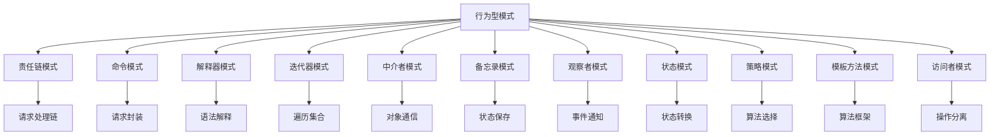
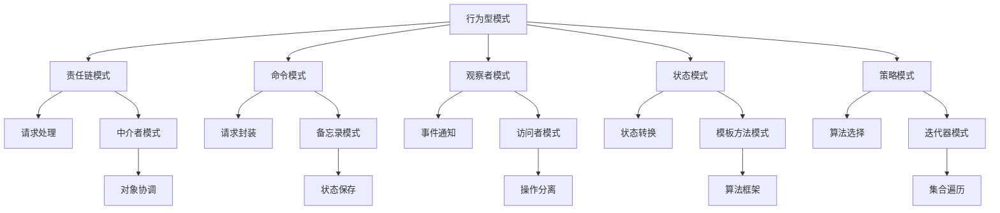
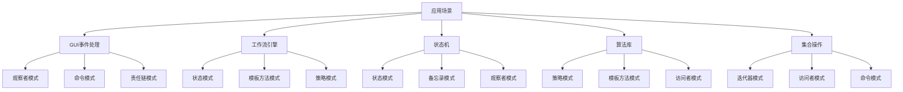

# 🎭 行为型模式概述

[[04-结构型模式/09-结构型模式对比表]] ← [[05-行为型模式/02-责任链模式]]
## 🎯 行为型模式概览

### 📊 模式分类图

## 🏗️ 模式定义与特点

### 📋 **模式定义**
行为型模式关注对象之间的通信和职责分配，描述对象之间如何协作以及如何分配职责。

### 📋 **核心特点**
- **对象协作**: 关注对象之间的协作方式
- **职责分配**: 合理分配对象职责
- **通信机制**: 定义对象间的通信机制
- **算法封装**: 封装算法和操作

### 📋 **适用场景**
- 需要定义对象间的通信方式
- 需要合理分配对象职责
- 需要封装算法和操作
- 需要处理对象间的复杂交互

## 🏗️ 模式分类

### 📋 **按职责分类**

#### **请求处理类**
- **责任链模式**: 将请求的发送者和接收者解耦
- **命令模式**: 将请求封装为对象
- **解释器模式**: 定义语言的语法表示

#### **对象交互类**
- **中介者模式**: 定义对象间的交互方式
- **观察者模式**: 定义对象间的一对多依赖关系
- **访问者模式**: 将操作与对象结构分离

#### **状态管理类**
- **状态模式**: 允许对象在内部状态改变时改变行为
- **备忘录模式**: 保存和恢复对象的内部状态

#### **算法封装类**
- **策略模式**: 定义算法族，使它们可以互换
- **模板方法模式**: 定义算法的骨架，子类实现具体步骤
- **迭代器模式**: 提供遍历集合的统一接口

### 📋 **按复杂度分类**

#### **简单模式**
- **观察者模式**: 事件通知机制
- **策略模式**: 算法选择
- **模板方法模式**: 算法框架

#### **中等复杂度模式**
- **责任链模式**: 请求处理链
- **命令模式**: 请求封装
- **状态模式**: 状态转换
- **迭代器模式**: 集合遍历

#### **复杂模式**
- **中介者模式**: 对象通信协调
- **备忘录模式**: 状态保存恢复
- **解释器模式**: 语法解释
- **访问者模式**: 操作分离

## 🏗️ 模式关系图

### 📊 **模式协作关系**

### 📊 **模式应用场景**

## 🏗️ 模式选择指南

### 📋 **按问题类型选择**

#### **请求处理问题**
- **责任链模式**: 多个处理器处理同一请求
- **命令模式**: 将请求封装为对象

#### **对象通信问题**
- **中介者模式**: 减少对象间的直接依赖
- **观察者模式**: 一对多的依赖关系

#### **状态管理问题**
- **状态模式**: 对象状态改变时改变行为
- **备忘录模式**: 保存和恢复对象状态

#### **算法选择问题**
- **策略模式**: 运行时选择算法
- **模板方法模式**: 定义算法框架

#### **集合操作问题**
- **迭代器模式**: 遍历集合元素
- **访问者模式**: 对集合元素执行操作

### 📋 **按使用场景选择**

#### **GUI开发场景**
- **观察者模式**: 事件处理
- **命令模式**: 撤销/重做
- **状态模式**: UI状态管理

#### **工作流引擎场景**
- **责任链模式**: 审批流程
- **状态模式**: 流程状态
- **模板方法模式**: 流程框架

#### **游戏开发场景**
- **状态模式**: 游戏状态
- **策略模式**: AI行为
- **观察者模式**: 事件系统

#### **数据处理场景**
- **迭代器模式**: 数据遍历
- **访问者模式**: 数据操作
- **策略模式**: 数据处理算法

## 🏗️ 模式实现要点

### 📋 **设计原则**

#### **单一职责原则**
- 每个模式只负责一个特定的行为
- 避免模式职责重叠

#### **开闭原则**
- 对扩展开放，对修改关闭
- 通过组合而不是继承来扩展行为

#### **里氏替换原则**
- 子类可以替换父类
- 保持行为的一致性

#### **接口隔离原则**
- 客户端不应该依赖它不需要的接口
- 接口应该尽可能小

#### **依赖倒置原则**
- 依赖抽象而不是具体实现
- 高层模块不应该依赖低层模块

### 📋 **实现建议**

#### **模式选择**
- 根据问题类型选择合适的模式
- 考虑模式的复杂度和维护成本
- 评估模式的性能影响

#### **模式组合**
- 合理组合多个模式
- 避免过度设计
- 保持代码的可读性

#### **性能考虑**
- 考虑模式带来的性能开销
- 优化关键路径
- 使用缓存和延迟加载

#### **测试策略**
- 为每个模式编写单元测试
- 测试模式的边界条件
- 验证模式的行为正确性

## 🔗 学习衔接

- **下一文档** → [[责任链模式]]
- **模式基础** → [[01-基础认知]]

---
**💡 行为型模式精髓**: 行为型模式就像舞蹈的编排，它们定义了对象之间如何协作、如何分配职责、如何通信。选择合适的行为型模式可以让系统更加灵活、可扩展和易于维护！
