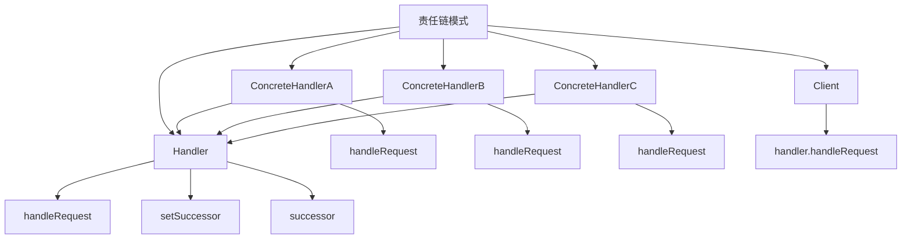

# 🔗 责任链模式

[[05-行为型模式/01-行为型模式概述]] ← [[05-行为型模式/03-命令模式]]
## 🎯 责任链模式概览

### 📊 模式结构图



## 🏗️ 模式定义与特点

### 📋 **模式定义**
责任链模式将请求的发送者和接收者解耦，使多个对象都有机会处理这个请求，将这些对象连成一条链，并沿着这条链传递请求，直到有一个对象处理它为止。

### 📋 **核心特点**
- **解耦**: 发送者和接收者解耦
- **链式处理**: 多个处理器连成一条链
- **动态配置**: 可以动态配置处理链
- **责任传递**: 请求沿着链传递

### 📋 **适用场景**
- 有多个对象可以处理同一个请求
- 需要动态指定处理请求的对象
- 需要避免请求发送者和接收者的耦合
- 需要按优先级处理请求

## 🏗️ 模式实现

### 📋 **基础实现**

#### **处理器接口**
```java
// ✅ 处理器接口
public abstract class Handler {
    protected Handler successor;
    
    public void setSuccessor(Handler successor) {
        this.successor = successor;
    }
    
    public abstract void handleRequest(Request request);
}

// ✅ 具体处理器A
public class ConcreteHandlerA extends Handler {
    @Override
    public void handleRequest(Request request) {
        if (request.getType().equals("A")) {
            System.out.println("ConcreteHandlerA handles request: " + request.getContent());
        } else if (successor != null) {
            successor.handleRequest(request);
        }
    }
}

// ✅ 具体处理器B
public class ConcreteHandlerB extends Handler {
    @Override
    public void handleRequest(Request request) {
        if (request.getType().equals("B")) {
            System.out.println("ConcreteHandlerB handles request: " + request.getContent());
        } else if (successor != null) {
            successor.handleRequest(request);
        }
    }
}

// ✅ 具体处理器C
public class ConcreteHandlerC extends Handler {
    @Override
    public void handleRequest(Request request) {
        if (request.getType().equals("C")) {
            System.out.println("ConcreteHandlerC handles request: " + request.getContent());
        } else if (successor != null) {
            successor.handleRequest(request);
        }
    }
}
```

#### **请求类**
```java
// ✅ 请求类
public class Request {
    private String type;
    private String content;
    
    public Request(String type, String content) {
        this.type = type;
        this.content = content;
    }
    
    public String getType() {
        return type;
    }
    
    public String getContent() {
        return content;
    }
}
```

#### **使用示例**
```java
// ✅ 客户端使用
public class Client {
    public static void main(String[] args) {
        // 创建处理器
        Handler handlerA = new ConcreteHandlerA();
        Handler handlerB = new ConcreteHandlerB();
        Handler handlerC = new ConcreteHandlerC();
        
        // 设置责任链
        handlerA.setSuccessor(handlerB);
        handlerB.setSuccessor(handlerC);
        
        // 创建请求
        Request request1 = new Request("A", "Request for A");
        Request request2 = new Request("B", "Request for B");
        Request request3 = new Request("C", "Request for C");
        Request request4 = new Request("D", "Request for D");
        
        // 处理请求
        handlerA.handleRequest(request1);
        handlerA.handleRequest(request2);
        handlerA.handleRequest(request3);
        handlerA.handleRequest(request4);
    }
}
```

## 🏗️ 实际应用案例

### 📋 **审批流程责任链案例**

#### **审批流程责任链**
```java
// ✅ 审批请求
public class ApprovalRequest {
    private String requestId;
    private String requester;
    private double amount;
    private String purpose;
    private String status;
    
    public ApprovalRequest(String requestId, String requester, double amount, String purpose) {
        this.requestId = requestId;
        this.requester = requester;
        this.amount = amount;
        this.purpose = purpose;
        this.status = "PENDING";
    }
    
    public String getRequestId() { return requestId; }
    public String getRequester() { return requester; }
    public double getAmount() { return amount; }
    public String getPurpose() { return purpose; }
    public String getStatus() { return status; }
    public void setStatus(String status) { this.status = status; }
}

// ✅ 审批处理器接口
public abstract class ApprovalHandler {
    protected ApprovalHandler nextHandler;
    
    public void setNextHandler(ApprovalHandler nextHandler) {
        this.nextHandler = nextHandler;
    }
    
    public abstract void handleApproval(ApprovalRequest request);
}

// ✅ 部门经理审批处理器
public class DepartmentManagerHandler extends ApprovalHandler {
    private String name;
    private double maxAmount;
    
    public DepartmentManagerHandler(String name, double maxAmount) {
        this.name = name;
        this.maxAmount = maxAmount;
    }
    
    @Override
    public void handleApproval(ApprovalRequest request) {
        if (request.getAmount() <= maxAmount) {
            System.out.println("Department Manager " + name + " approves request " + request.getRequestId() + 
                             " for amount $" + request.getAmount());
            request.setStatus("APPROVED");
        } else if (nextHandler != null) {
            System.out.println("Department Manager " + name + " forwards request " + request.getRequestId() + 
                             " to next level");
            nextHandler.handleApproval(request);
        } else {
            System.out.println("Request " + request.getRequestId() + " exceeds approval limit");
            request.setStatus("REJECTED");
        }
    }
}

// ✅ 财务经理审批处理器
public class FinanceManagerHandler extends ApprovalHandler {
    private String name;
    private double maxAmount;
    
    public FinanceManagerHandler(String name, double maxAmount) {
        this.name = name;
        this.maxAmount = maxAmount;
    }
    
    @Override
    public void handleApproval(ApprovalRequest request) {
        if (request.getAmount() <= maxAmount) {
            System.out.println("Finance Manager " + name + " approves request " + request.getRequestId() + 
                             " for amount $" + request.getAmount());
            request.setStatus("APPROVED");
        } else if (nextHandler != null) {
            System.out.println("Finance Manager " + name + " forwards request " + request.getRequestId() + 
                             " to next level");
            nextHandler.handleApproval(request);
        } else {
            System.out.println("Request " + request.getRequestId() + " exceeds approval limit");
            request.setStatus("REJECTED");
        }
    }
}

// ✅ CEO审批处理器
public class CEOHandler extends ApprovalHandler {
    private String name;
    
    public CEOHandler(String name) {
        this.name = name;
    }
    
    @Override
    public void handleApproval(ApprovalRequest request) {
        System.out.println("CEO " + name + " approves request " + request.getRequestId() + 
                         " for amount $" + request.getAmount());
        request.setStatus("APPROVED");
    }
}

// ✅ 审批流程管理器
public class ApprovalProcessManager {
    private ApprovalHandler approvalChain;
    
    public ApprovalProcessManager() {
        setupApprovalChain();
    }
    
    private void setupApprovalChain() {
        // 创建审批处理器
        ApprovalHandler deptManager = new DepartmentManagerHandler("John Smith", 1000);
        ApprovalHandler financeManager = new FinanceManagerHandler("Jane Doe", 10000);
        ApprovalHandler ceo = new CEOHandler("Bob Johnson");
        
        // 设置责任链
        deptManager.setNextHandler(financeManager);
        financeManager.setNextHandler(ceo);
        
        this.approvalChain = deptManager;
    }
    
    public void processRequest(ApprovalRequest request) {
        System.out.println("=== Processing Approval Request " + request.getRequestId() + " ===");
        System.out.println("Requester: " + request.getRequester());
        System.out.println("Amount: $" + request.getAmount());
        System.out.println("Purpose: " + request.getPurpose());
        System.out.println();
        
        approvalChain.handleApproval(request);
        
        System.out.println("Final Status: " + request.getStatus());
        System.out.println();
    }
}
```

#### **使用示例**
```java
// ✅ 使用示例
public class ApprovalProcessDemo {
    public static void main(String[] args) {
        ApprovalProcessManager manager = new ApprovalProcessManager();
        
        // 处理不同金额的审批请求
        ApprovalRequest request1 = new ApprovalRequest("REQ001", "Alice", 500, "Office supplies");
        manager.processRequest(request1);
        
        ApprovalRequest request2 = new ApprovalRequest("REQ002", "Bob", 5000, "Equipment purchase");
        manager.processRequest(request2);
        
        ApprovalRequest request3 = new ApprovalRequest("REQ003", "Charlie", 15000, "Software license");
        manager.processRequest(request3);
        
        ApprovalRequest request4 = new ApprovalRequest("REQ004", "Diana", 50000, "Infrastructure upgrade");
        manager.processRequest(request4);
    }
}
```

### 📋 **日志处理责任链案例**

#### **日志处理责任链**
```java
// ✅ 日志消息
public class LogMessage {
    private String level;
    private String message;
    private String timestamp;
    private String source;
    
    public LogMessage(String level, String message, String source) {
        this.level = level;
        this.message = message;
        this.source = source;
        this.timestamp = java.time.LocalDateTime.now().toString();
    }
    
    public String getLevel() { return level; }
    public String getMessage() { return message; }
    public String getTimestamp() { return timestamp; }
    public String getSource() { return source; }
}

// ✅ 日志处理器接口
public abstract class LogHandler {
    protected LogHandler nextHandler;
    
    public void setNextHandler(LogHandler nextHandler) {
        this.nextHandler = nextHandler;
    }
    
    public abstract void handleLog(LogMessage logMessage);
}

// ✅ 控制台日志处理器
public class ConsoleLogHandler extends LogHandler {
    @Override
    public void handleLog(LogMessage logMessage) {
        System.out.println("Console: [" + logMessage.getLevel() + "] " + 
                         logMessage.getTimestamp() + " - " + logMessage.getMessage());
        
        if (nextHandler != null) {
            nextHandler.handleLog(logMessage);
        }
    }
}

// ✅ 文件日志处理器
public class FileLogHandler extends LogHandler {
    private String logFile;
    
    public FileLogHandler(String logFile) {
        this.logFile = logFile;
    }
    
    @Override
    public void handleLog(LogMessage logMessage) {
        System.out.println("File: Writing to " + logFile + " - [" + logMessage.getLevel() + "] " + 
                         logMessage.getMessage());
        
        if (nextHandler != null) {
            nextHandler.handleLog(logMessage);
        }
    }
}

// ✅ 数据库日志处理器
public class DatabaseLogHandler extends LogHandler {
    private String database;
    
    public DatabaseLogHandler(String database) {
        this.database = database;
    }
    
    @Override
    public void handleLog(LogMessage logMessage) {
        System.out.println("Database: Storing in " + database + " - [" + logMessage.getLevel() + "] " + 
                         logMessage.getMessage());
        
        if (nextHandler != null) {
            nextHandler.handleLog(logMessage);
        }
    }
}

// ✅ 邮件日志处理器
public class EmailLogHandler extends LogHandler {
    private String email;
    
    public EmailLogHandler(String email) {
        this.email = email;
    }
    
    @Override
    public void handleLog(LogMessage logMessage) {
        if (logMessage.getLevel().equals("ERROR") || logMessage.getLevel().equals("FATAL")) {
            System.out.println("Email: Sending alert to " + email + " - [" + logMessage.getLevel() + "] " + 
                             logMessage.getMessage());
        }
        
        if (nextHandler != null) {
            nextHandler.handleLog(logMessage);
        }
    }
}

// ✅ 日志管理器
public class LogManager {
    private LogHandler logChain;
    
    public LogManager() {
        setupLogChain();
    }
    
    private void setupLogChain() {
        // 创建日志处理器
        LogHandler consoleHandler = new ConsoleLogHandler();
        LogHandler fileHandler = new FileLogHandler("app.log");
        LogHandler databaseHandler = new DatabaseLogHandler("log_db");
        LogHandler emailHandler = new EmailLogHandler("admin@company.com");
        
        // 设置责任链
        consoleHandler.setNextHandler(fileHandler);
        fileHandler.setNextHandler(databaseHandler);
        databaseHandler.setNextHandler(emailHandler);
        
        this.logChain = consoleHandler;
    }
    
    public void log(LogMessage logMessage) {
        logChain.handleLog(logMessage);
    }
}
```

#### **使用示例**
```java
// ✅ 使用示例
public class LogManagerDemo {
    public static void main(String[] args) {
        LogManager logManager = new LogManager();
        
        // 记录不同级别的日志
        LogMessage infoLog = new LogMessage("INFO", "Application started", "Main");
        logManager.log(infoLog);
        
        System.out.println();
        
        LogMessage warningLog = new LogMessage("WARNING", "Low memory warning", "MemoryManager");
        logManager.log(warningLog);
        
        System.out.println();
        
        LogMessage errorLog = new LogMessage("ERROR", "Database connection failed", "DatabaseManager");
        logManager.log(errorLog);
        
        System.out.println();
        
        LogMessage fatalLog = new LogMessage("FATAL", "System crash", "System");
        logManager.log(fatalLog);
    }
}
```

### 📋 **过滤器责任链案例**

#### **过滤器责任链**
```java
// ✅ 请求对象
public class HttpRequest {
    private String method;
    private String url;
    private Map<String, String> headers;
    private String body;
    private String clientIP;
    
    public HttpRequest(String method, String url, String clientIP) {
        this.method = method;
        this.url = url;
        this.clientIP = clientIP;
        this.headers = new HashMap<>();
        this.body = "";
    }
    
    public void addHeader(String key, String value) {
        headers.put(key, value);
    }
    
    public void setBody(String body) {
        this.body = body;
    }
    
    public String getMethod() { return method; }
    public String getUrl() { return url; }
    public Map<String, String> getHeaders() { return headers; }
    public String getBody() { return body; }
    public String getClientIP() { return clientIP; }
}

// ✅ 过滤器接口
public abstract class Filter {
    protected Filter nextFilter;
    
    public void setNextFilter(Filter nextFilter) {
        this.nextFilter = nextFilter;
    }
    
    public abstract boolean doFilter(HttpRequest request);
}

// ✅ IP过滤器
public class IPFilter extends Filter {
    private Set<String> blockedIPs;
    
    public IPFilter() {
        this.blockedIPs = new HashSet<>();
        blockedIPs.add("192.168.1.100");
        blockedIPs.add("10.0.0.50");
    }
    
    @Override
    public boolean doFilter(HttpRequest request) {
        if (blockedIPs.contains(request.getClientIP())) {
            System.out.println("IP Filter: Blocked request from " + request.getClientIP());
            return false;
        }
        
        System.out.println("IP Filter: Allowed request from " + request.getClientIP());
        if (nextFilter != null) {
            return nextFilter.doFilter(request);
        }
        return true;
    }
}

// ✅ 认证过滤器
public class AuthenticationFilter extends Filter {
    private Set<String> validTokens;
    
    public AuthenticationFilter() {
        this.validTokens = new HashSet<>();
        validTokens.add("token123");
        validTokens.add("token456");
    }
    
    @Override
    public boolean doFilter(HttpRequest request) {
        String token = request.getHeaders().get("Authorization");
        if (token == null || !validTokens.contains(token)) {
            System.out.println("Authentication Filter: Invalid or missing token");
            return false;
        }
        
        System.out.println("Authentication Filter: Valid token");
        if (nextFilter != null) {
            return nextFilter.doFilter(request);
        }
        return true;
    }
}

// ✅ 权限过滤器
public class AuthorizationFilter extends Filter {
    private Map<String, Set<String>> permissions;
    
    public AuthorizationFilter() {
        this.permissions = new HashMap<>();
        permissions.put("token123", Set.of("GET", "POST"));
        permissions.put("token456", Set.of("GET"));
    }
    
    @Override
    public boolean doFilter(HttpRequest request) {
        String token = request.getHeaders().get("Authorization");
        if (token != null && permissions.containsKey(token)) {
            Set<String> allowedMethods = permissions.get(token);
            if (allowedMethods.contains(request.getMethod())) {
                System.out.println("Authorization Filter: Method " + request.getMethod() + " allowed");
                if (nextFilter != null) {
                    return nextFilter.doFilter(request);
                }
                return true;
            }
        }
        
        System.out.println("Authorization Filter: Method " + request.getMethod() + " not allowed");
        return false;
    }
}

// ✅ 日志过滤器
public class LoggingFilter extends Filter {
    @Override
    public boolean doFilter(HttpRequest request) {
        System.out.println("Logging Filter: " + request.getMethod() + " " + request.getUrl() + 
                         " from " + request.getClientIP());
        
        if (nextFilter != null) {
            return nextFilter.doFilter(request);
        }
        return true;
    }
}

// ✅ 过滤器链管理器
public class FilterChainManager {
    private Filter filterChain;
    
    public FilterChainManager() {
        setupFilterChain();
    }
    
    private void setupFilterChain() {
        // 创建过滤器
        Filter ipFilter = new IPFilter();
        Filter authFilter = new AuthenticationFilter();
        Filter authzFilter = new AuthorizationFilter();
        Filter loggingFilter = new LoggingFilter();
        
        // 设置过滤器链
        ipFilter.setNextFilter(authFilter);
        authFilter.setNextFilter(authzFilter);
        authzFilter.setNextFilter(loggingFilter);
        
        this.filterChain = ipFilter;
    }
    
    public boolean processRequest(HttpRequest request) {
        System.out.println("=== Processing Request ===");
        return filterChain.doFilter(request);
    }
}
```

#### **使用示例**
```java
// ✅ 使用示例
public class FilterChainDemo {
    public static void main(String[] args) {
        FilterChainManager manager = new FilterChainManager();
        
        // 测试有效请求
        HttpRequest validRequest = new HttpRequest("GET", "/api/users", "192.168.1.50");
        validRequest.addHeader("Authorization", "token123");
        validRequest.setBody("{}");
        
        boolean result1 = manager.processRequest(validRequest);
        System.out.println("Request result: " + result1);
        
        System.out.println();
        
        // 测试被阻止的IP
        HttpRequest blockedIPRequest = new HttpRequest("GET", "/api/users", "192.168.1.100");
        blockedIPRequest.addHeader("Authorization", "token123");
        
        boolean result2 = manager.processRequest(blockedIPRequest);
        System.out.println("Request result: " + result2);
        
        System.out.println();
        
        // 测试无效token
        HttpRequest invalidTokenRequest = new HttpRequest("GET", "/api/users", "192.168.1.50");
        invalidTokenRequest.addHeader("Authorization", "invalid_token");
        
        boolean result3 = manager.processRequest(invalidTokenRequest);
        System.out.println("Request result: " + result3);
        
        System.out.println();
        
        // 测试权限不足
        HttpRequest unauthorizedRequest = new HttpRequest("DELETE", "/api/users", "192.168.1.50");
        unauthorizedRequest.addHeader("Authorization", "token456");
        
        boolean result4 = manager.processRequest(unauthorizedRequest);
        System.out.println("Request result: " + result4);
    }
}
```

## 🎯 模式优势与劣势

### 📋 **优势**
- **解耦**: 发送者和接收者解耦
- **动态配置**: 可以动态配置处理链
- **责任传递**: 请求沿着链传递
- **易于扩展**: 可以轻松添加新的处理器

### 📋 **劣势**
- **性能问题**: 链过长可能影响性能
- **调试困难**: 调试链式调用比较困难
- **循环依赖**: 可能出现循环依赖问题

### 📋 **与命令模式的区别**
| 方面 | 责任链模式 | 命令模式 |
|------|------------|----------|
| **目的** | 请求处理链 | 请求封装 |
| **处理方式** | 链式处理 | 对象封装 |
| **使用场景** | 多个处理器 | 撤销/重做 |
| **复杂度** | 相对复杂 | 相对简单 |

## 🔗 学习衔接

- **上一文档** ← [[行为型模式概述]]
- **下一文档** → [[命令模式]]
- **模式基础** → [[01-基础认知]]

---
**💡 责任链精髓**: 责任链模式就像接力赛，每个选手负责一段路程，将接力棒传递给下一个选手。当我们需要多个对象处理同一个请求，或者需要动态配置处理链时，责任链模式是最佳选择！
