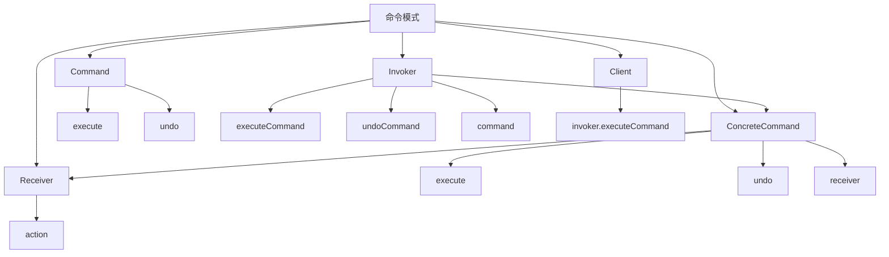

# 📝 命令模式

[[05-行为型模式/02-责任链模式]] ← [[05-行为型模式/04-解释器模式]]
## 🎯 命令模式概览

### 📊 模式结构图



## 🏗️ 模式定义与特点

### 📋 **模式定义**
命令模式将一个请求封装成一个对象，从而使您可以用不同的请求对客户进行参数化，对请求排队或记录请求日志，以及支持可撤销的操作。

### 📋 **核心特点**
- **请求封装**: 将请求封装为对象
- **参数化**: 用不同的请求对客户进行参数化
- **排队**: 支持请求排队
- **撤销**: 支持可撤销的操作

### 📋 **适用场景**
- 需要将请求参数化
- 需要支持撤销操作
- 需要支持宏命令
- 需要支持日志和事务

## 🏗️ 模式实现

### 📋 **基础实现**

#### **命令接口**
```java
// ✅ 命令接口
public interface Command {
    void execute();
    void undo();
}

// ✅ 具体命令
public class ConcreteCommand implements Command {
    private Receiver receiver;
    private String state;
    
    public ConcreteCommand(Receiver receiver, String state) {
        this.receiver = receiver;
        this.state = state;
    }
    
    @Override
    public void execute() {
        receiver.action(state);
    }
    
    @Override
    public void undo() {
        receiver.undoAction(state);
    }
}

// ✅ 接收者
public class Receiver {
    public void action(String state) {
        System.out.println("Receiver action: " + state);
    }
    
    public void undoAction(String state) {
        System.out.println("Receiver undo action: " + state);
    }
}

// ✅ 调用者
public class Invoker {
    private Command command;
    
    public void setCommand(Command command) {
        this.command = command;
    }
    
    public void executeCommand() {
        command.execute();
    }
    
    public void undoCommand() {
        command.undo();
    }
}
```

#### **使用示例**
```java
// ✅ 客户端使用
public class Client {
    public static void main(String[] args) {
        Receiver receiver = new Receiver();
        Command command = new ConcreteCommand(receiver, "Hello World");
        Invoker invoker = new Invoker();
        
        invoker.setCommand(command);
        invoker.executeCommand();
        invoker.undoCommand();
    }
}
```

## 🏗️ 实际应用案例

### 📋 **文本编辑器命令案例**

#### **文本编辑器命令**
```java
// ✅ 命令接口
public interface TextCommand {
    void execute();
    void undo();
}

// ✅ 插入文本命令
public class InsertTextCommand implements TextCommand {
    private TextEditor editor;
    private String text;
    private int position;
    
    public InsertTextCommand(TextEditor editor, String text, int position) {
        this.editor = editor;
        this.text = text;
        this.position = position;
    }
    
    @Override
    public void execute() {
        editor.insertText(text, position);
    }
    
    @Override
    public void undo() {
        editor.deleteText(position, text.length());
    }
}

// ✅ 删除文本命令
public class DeleteTextCommand implements TextCommand {
    private TextEditor editor;
    private String deletedText;
    private int position;
    
    public DeleteTextCommand(TextEditor editor, int position, int length) {
        this.editor = editor;
        this.position = position;
        this.deletedText = editor.getText(position, length);
    }
    
    @Override
    public void execute() {
        editor.deleteText(position, deletedText.length());
    }
    
    @Override
    public void undo() {
        editor.insertText(deletedText, position);
    }
}

// ✅ 替换文本命令
public class ReplaceTextCommand implements TextCommand {
    private TextEditor editor;
    private String oldText;
    private String newText;
    private int position;
    
    public ReplaceTextCommand(TextEditor editor, String oldText, String newText, int position) {
        this.editor = editor;
        this.oldText = oldText;
        this.newText = newText;
        this.position = position;
    }
    
    @Override
    public void execute() {
        editor.replaceText(oldText, newText, position);
    }
    
    @Override
    public void undo() {
        editor.replaceText(newText, oldText, position);
    }
}

// ✅ 文本编辑器
public class TextEditor {
    private StringBuilder content;
    
    public TextEditor() {
        this.content = new StringBuilder();
    }
    
    public void insertText(String text, int position) {
        content.insert(position, text);
        System.out.println("Inserted text: " + text + " at position " + position);
        System.out.println("Content: " + content.toString());
    }
    
    public void deleteText(int position, int length) {
        String deleted = content.substring(position, position + length);
        content.delete(position, position + length);
        System.out.println("Deleted text: " + deleted + " at position " + position);
        System.out.println("Content: " + content.toString());
    }
    
    public void replaceText(String oldText, String newText, int position) {
        int endPosition = position + oldText.length();
        content.replace(position, endPosition, newText);
        System.out.println("Replaced text: " + oldText + " with " + newText + " at position " + position);
        System.out.println("Content: " + content.toString());
    }
    
    public String getText(int position, int length) {
        return content.substring(position, position + length);
    }
    
    public String getContent() {
        return content.toString();
    }
}

// ✅ 命令历史管理器
public class CommandHistoryManager {
    private List<TextCommand> history;
    private int currentIndex;
    
    public CommandHistoryManager() {
        this.history = new ArrayList<>();
        this.currentIndex = -1;
    }
    
    public void executeCommand(TextCommand command) {
        // 删除当前位置之后的历史
        if (currentIndex < history.size() - 1) {
            history = history.subList(0, currentIndex + 1);
        }
        
        // 执行命令
        command.execute();
        
        // 添加到历史
        history.add(command);
        currentIndex++;
    }
    
    public void undo() {
        if (currentIndex >= 0) {
            history.get(currentIndex).undo();
            currentIndex--;
        } else {
            System.out.println("Nothing to undo");
        }
    }
    
    public void redo() {
        if (currentIndex < history.size() - 1) {
            currentIndex++;
            history.get(currentIndex).execute();
        } else {
            System.out.println("Nothing to redo");
        }
    }
    
    public void printHistory() {
        System.out.println("=== Command History ===");
        for (int i = 0; i < history.size(); i++) {
            System.out.println((i + 1) + ". " + history.get(i).getClass().getSimpleName());
        }
        System.out.println("Current index: " + (currentIndex + 1));
    }
}
```

#### **使用示例**
```java
// ✅ 使用示例
public class TextEditorDemo {
    public static void main(String[] args) {
        TextEditor editor = new TextEditor();
        CommandHistoryManager historyManager = new CommandHistoryManager();
        
        // 执行一系列命令
        TextCommand insertCmd1 = new InsertTextCommand(editor, "Hello", 0);
        historyManager.executeCommand(insertCmd1);
        
        TextCommand insertCmd2 = new InsertTextCommand(editor, " World", 5);
        historyManager.executeCommand(insertCmd2);
        
        TextCommand replaceCmd = new ReplaceTextCommand(editor, "World", "Java", 6);
        historyManager.executeCommand(replaceCmd);
        
        System.out.println();
        
        // 撤销操作
        System.out.println("=== Undo Operations ===");
        historyManager.undo();
        historyManager.undo();
        historyManager.undo();
        
        System.out.println();
        
        // 重做操作
        System.out.println("=== Redo Operations ===");
        historyManager.redo();
        historyManager.redo();
        historyManager.redo();
        
        System.out.println();
        
        // 打印历史
        historyManager.printHistory();
    }
}
```

### 📋 **智能家居命令案例**

#### **智能家居命令**
```java
// ✅ 设备接口
public interface Device {
    void turnOn();
    void turnOff();
    void setBrightness(int brightness);
    void setTemperature(int temperature);
    String getStatus();
}

// ✅ 灯光设备
public class Light implements Device {
    private boolean isOn;
    private int brightness;
    
    public Light() {
        this.isOn = false;
        this.brightness = 0;
    }
    
    @Override
    public void turnOn() {
        isOn = true;
        System.out.println("Light turned on");
    }
    
    @Override
    public void turnOff() {
        isOn = false;
        System.out.println("Light turned off");
    }
    
    @Override
    public void setBrightness(int brightness) {
        this.brightness = brightness;
        System.out.println("Light brightness set to " + brightness);
    }
    
    @Override
    public void setTemperature(int temperature) {
        System.out.println("Light temperature set to " + temperature);
    }
    
    @Override
    public String getStatus() {
        return "Light: " + (isOn ? "ON" : "OFF") + ", Brightness: " + brightness;
    }
}

// ✅ 空调设备
public class AirConditioner implements Device {
    private boolean isOn;
    private int temperature;
    
    public AirConditioner() {
        this.isOn = false;
        this.temperature = 22;
    }
    
    @Override
    public void turnOn() {
        isOn = true;
        System.out.println("Air Conditioner turned on");
    }
    
    @Override
    public void turnOff() {
        isOn = false;
        System.out.println("Air Conditioner turned off");
    }
    
    @Override
    public void setBrightness(int brightness) {
        System.out.println("Air Conditioner brightness set to " + brightness);
    }
    
    @Override
    public void setTemperature(int temperature) {
        this.temperature = temperature;
        System.out.println("Air Conditioner temperature set to " + temperature);
    }
    
    @Override
    public String getStatus() {
        return "Air Conditioner: " + (isOn ? "ON" : "OFF") + ", Temperature: " + temperature;
    }
}

// ✅ 智能家居命令接口
public interface SmartHomeCommand {
    void execute();
    void undo();
}

// ✅ 开关设备命令
public class TurnOnDeviceCommand implements SmartHomeCommand {
    private Device device;
    
    public TurnOnDeviceCommand(Device device) {
        this.device = device;
    }
    
    @Override
    public void execute() {
        device.turnOn();
    }
    
    @Override
    public void undo() {
        device.turnOff();
    }
}

// ✅ 设置亮度命令
public class SetBrightnessCommand implements SmartHomeCommand {
    private Device device;
    private int newBrightness;
    private int oldBrightness;
    
    public SetBrightnessCommand(Device device, int brightness) {
        this.device = device;
        this.newBrightness = brightness;
        this.oldBrightness = 0; // 假设初始亮度为0
    }
    
    @Override
    public void execute() {
        device.setBrightness(newBrightness);
    }
    
    @Override
    public void undo() {
        device.setBrightness(oldBrightness);
    }
}

// ✅ 设置温度命令
public class SetTemperatureCommand implements SmartHomeCommand {
    private Device device;
    private int newTemperature;
    private int oldTemperature;
    
    public SetTemperatureCommand(Device device, int temperature) {
        this.device = device;
        this.newTemperature = temperature;
        this.oldTemperature = 22; // 假设初始温度为22
    }
    
    @Override
    public void execute() {
        device.setTemperature(newTemperature);
    }
    
    @Override
    public void undo() {
        device.setTemperature(oldTemperature);
    }
}

// ✅ 宏命令
public class MacroCommand implements SmartHomeCommand {
    private List<SmartHomeCommand> commands;
    
    public MacroCommand(List<SmartHomeCommand> commands) {
        this.commands = commands;
    }
    
    @Override
    public void execute() {
        System.out.println("Executing macro command");
        for (SmartHomeCommand command : commands) {
            command.execute();
        }
    }
    
    @Override
    public void undo() {
        System.out.println("Undoing macro command");
        for (int i = commands.size() - 1; i >= 0; i--) {
            commands.get(i).undo();
        }
    }
}

// ✅ 智能家居控制器
public class SmartHomeController {
    private List<SmartHomeCommand> commandHistory;
    private int currentIndex;
    
    public SmartHomeController() {
        this.commandHistory = new ArrayList<>();
        this.currentIndex = -1;
    }
    
    public void executeCommand(SmartHomeCommand command) {
        // 删除当前位置之后的历史
        if (currentIndex < commandHistory.size() - 1) {
            commandHistory = commandHistory.subList(0, currentIndex + 1);
        }
        
        // 执行命令
        command.execute();
        
        // 添加到历史
        commandHistory.add(command);
        currentIndex++;
    }
    
    public void undo() {
        if (currentIndex >= 0) {
            commandHistory.get(currentIndex).undo();
            currentIndex--;
        } else {
            System.out.println("Nothing to undo");
        }
    }
    
    public void redo() {
        if (currentIndex < commandHistory.size() - 1) {
            currentIndex++;
            commandHistory.get(currentIndex).execute();
        } else {
            System.out.println("Nothing to redo");
        }
    }
    
    public void printStatus(Device device) {
        System.out.println("Device Status: " + device.getStatus());
    }
}
```

#### **使用示例**
```java
// ✅ 使用示例
public class SmartHomeDemo {
    public static void main(String[] args) {
        SmartHomeController controller = new SmartHomeController();
        
        // 创建设备
        Light livingRoomLight = new Light();
        AirConditioner livingRoomAC = new AirConditioner();
        
        // 执行单个命令
        SmartHomeCommand turnOnLight = new TurnOnDeviceCommand(livingRoomLight);
        controller.executeCommand(turnOnLight);
        
        SmartHomeCommand setBrightness = new SetBrightnessCommand(livingRoomLight, 80);
        controller.executeCommand(setBrightness);
        
        SmartHomeCommand turnOnAC = new TurnOnDeviceCommand(livingRoomAC);
        controller.executeCommand(turnOnAC);
        
        SmartHomeCommand setTemperature = new SetTemperatureCommand(livingRoomAC, 25);
        controller.executeCommand(setTemperature);
        
        System.out.println();
        
        // 打印设备状态
        controller.printStatus(livingRoomLight);
        controller.printStatus(livingRoomAC);
        
        System.out.println();
        
        // 撤销操作
        System.out.println("=== Undo Operations ===");
        controller.undo();
        controller.undo();
        controller.undo();
        controller.undo();
        
        System.out.println();
        
        // 重做操作
        System.out.println("=== Redo Operations ===");
        controller.redo();
        controller.redo();
        controller.redo();
        controller.redo();
        
        System.out.println();
        
        // 创建宏命令
        List<SmartHomeCommand> macroCommands = Arrays.asList(
            new TurnOnDeviceCommand(livingRoomLight),
            new SetBrightnessCommand(livingRoomLight, 100),
            new TurnOnDeviceCommand(livingRoomAC),
            new SetTemperatureCommand(livingRoomAC, 23)
        );
        
        MacroCommand macro = new MacroCommand(macroCommands);
        controller.executeCommand(macro);
        
        System.out.println();
        
        // 撤销宏命令
        controller.undo();
    }
}
```

### 📋 **数据库事务命令案例**

#### **数据库事务命令**
```java
// ✅ 数据库操作接口
public interface DatabaseOperation {
    void execute();
    void rollback();
}

// ✅ 插入操作
public class InsertOperation implements DatabaseOperation {
    private String table;
    private Map<String, Object> data;
    private Database database;
    
    public InsertOperation(String table, Map<String, Object> data, Database database) {
        this.table = table;
        this.data = data;
        this.database = database;
    }
    
    @Override
    public void execute() {
        System.out.println("Inserting data into " + table + ": " + data);
        database.insert(table, data);
    }
    
    @Override
    public void rollback() {
        System.out.println("Rolling back insert operation on " + table);
        database.delete(table, data);
    }
}

// ✅ 更新操作
public class UpdateOperation implements DatabaseOperation {
    private String table;
    private Map<String, Object> oldData;
    private Map<String, Object> newData;
    private Database database;
    
    public UpdateOperation(String table, Map<String, Object> oldData, Map<String, Object> newData, Database database) {
        this.table = table;
        this.oldData = oldData;
        this.newData = newData;
        this.database = database;
    }
    
    @Override
    public void execute() {
        System.out.println("Updating data in " + table + " from " + oldData + " to " + newData);
        database.update(table, oldData, newData);
    }
    
    @Override
    public void rollback() {
        System.out.println("Rolling back update operation on " + table);
        database.update(table, newData, oldData);
    }
}

// ✅ 删除操作
public class DeleteOperation implements DatabaseOperation {
    private String table;
    private Map<String, Object> data;
    private Database database;
    
    public DeleteOperation(String table, Map<String, Object> data, Database database) {
        this.table = table;
        this.data = data;
        this.database = database;
    }
    
    @Override
    public void execute() {
        System.out.println("Deleting data from " + table + ": " + data);
        database.delete(table, data);
    }
    
    @Override
    public void rollback() {
        System.out.println("Rolling back delete operation on " + table);
        database.insert(table, data);
    }
}

// ✅ 数据库模拟
public class Database {
    private Map<String, List<Map<String, Object>>> tables;
    
    public Database() {
        this.tables = new HashMap<>();
    }
    
    public void insert(String table, Map<String, Object> data) {
        tables.computeIfAbsent(table, k -> new ArrayList<>()).add(new HashMap<>(data));
    }
    
    public void update(String table, Map<String, Object> oldData, Map<String, Object> newData) {
        List<Map<String, Object>> tableData = tables.get(table);
        if (tableData != null) {
            for (Map<String, Object> row : tableData) {
                if (row.equals(oldData)) {
                    row.clear();
                    row.putAll(newData);
                    break;
                }
            }
        }
    }
    
    public void delete(String table, Map<String, Object> data) {
        List<Map<String, Object>> tableData = tables.get(table);
        if (tableData != null) {
            tableData.removeIf(row -> row.equals(data));
        }
    }
    
    public void printTable(String table) {
        System.out.println("Table " + table + ":");
        List<Map<String, Object>> tableData = tables.get(table);
        if (tableData != null) {
            for (Map<String, Object> row : tableData) {
                System.out.println("  " + row);
            }
        }
    }
}

// ✅ 事务管理器
public class TransactionManager {
    private List<DatabaseOperation> operations;
    private Database database;
    
    public TransactionManager(Database database) {
        this.operations = new ArrayList<>();
        this.database = database;
    }
    
    public void addOperation(DatabaseOperation operation) {
        operations.add(operation);
    }
    
    public void commit() {
        System.out.println("=== Committing Transaction ===");
        for (DatabaseOperation operation : operations) {
            operation.execute();
        }
        operations.clear();
    }
    
    public void rollback() {
        System.out.println("=== Rolling Back Transaction ===");
        for (int i = operations.size() - 1; i >= 0; i--) {
            operations.get(i).rollback();
        }
        operations.clear();
    }
    
    public void printOperations() {
        System.out.println("=== Transaction Operations ===");
        for (int i = 0; i < operations.size(); i++) {
            System.out.println((i + 1) + ". " + operations.get(i).getClass().getSimpleName());
        }
    }
}
```

#### **使用示例**
```java
// ✅ 使用示例
public class TransactionDemo {
    public static void main(String[] args) {
        Database database = new Database();
        TransactionManager transactionManager = new TransactionManager(database);
        
        // 添加操作到事务
        Map<String, Object> userData = new HashMap<>();
        userData.put("id", 1);
        userData.put("name", "John Doe");
        userData.put("email", "john@example.com");
        
        transactionManager.addOperation(new InsertOperation("users", userData, database));
        
        Map<String, Object> oldUserData = new HashMap<>();
        oldUserData.put("id", 1);
        oldUserData.put("name", "John Doe");
        oldUserData.put("email", "john@example.com");
        
        Map<String, Object> newUserData = new HashMap<>();
        newUserData.put("id", 1);
        newUserData.put("name", "John Smith");
        newUserData.put("email", "johnsmith@example.com");
        
        transactionManager.addOperation(new UpdateOperation("users", oldUserData, newUserData, database));
        
        Map<String, Object> orderData = new HashMap<>();
        orderData.put("id", 1);
        orderData.put("user_id", 1);
        orderData.put("product", "Laptop");
        orderData.put("amount", 999.99);
        
        transactionManager.addOperation(new InsertOperation("orders", orderData, database));
        
        // 打印操作
        transactionManager.printOperations();
        
        System.out.println();
        
        // 提交事务
        transactionManager.commit();
        
        System.out.println();
        
        // 打印表数据
        database.printTable("users");
        database.printTable("orders");
        
        System.out.println();
        
        // 开始新事务
        Map<String, Object> newUserData2 = new HashMap<>();
        newUserData2.put("id", 2);
        newUserData2.put("name", "Jane Doe");
        newUserData2.put("email", "jane@example.com");
        
        transactionManager.addOperation(new InsertOperation("users", newUserData2, database));
        
        // 回滚事务
        transactionManager.rollback();
        
        System.out.println();
        
        // 打印表数据（应该没有新用户）
        database.printTable("users");
    }
}
```

## 🎯 模式优势与劣势

### 📋 **优势**
- **请求封装**: 将请求封装为对象
- **参数化**: 用不同的请求对客户进行参数化
- **撤销支持**: 支持可撤销的操作
- **宏命令**: 支持宏命令

### 📋 **劣势**
- **复杂度增加**: 增加了系统的复杂度
- **类数量增加**: 需要创建大量的命令类
- **内存开销**: 需要额外的内存开销

### 📋 **与责任链模式的区别**
| 方面 | 责任链模式 | 命令模式 |
|------|------------|----------|
| **目的** | 请求处理链 | 请求封装 |
| **处理方式** | 链式处理 | 对象封装 |
| **使用场景** | 多个处理器 | 撤销/重做 |
| **复杂度** | 相对复杂 | 相对简单 |

## 🔗 学习衔接

- **上一文档** ← [[责任链模式]]
- **下一文档** → [[解释器模式]]
- **模式基础** → [[01-基础认知]]

---
**💡 命令精髓**: 命令模式就像遥控器，将复杂的操作封装成简单的按钮。当我们需要支持撤销操作，或者需要将请求参数化时，命令模式是最佳选择！
