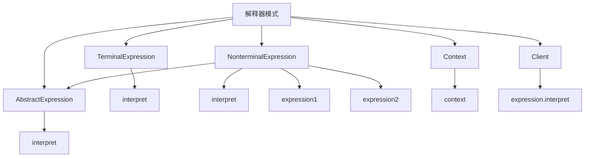

# 🔤 解释器模式

[[05-行为型模式/03-命令模式]] ← [[05-行为型模式/05-迭代器模式]]
## 🎯 解释器模式概览

### 📊 模式结构图



## 🏗️ 模式定义与特点

### 📋 **模式定义**
解释器模式给定一个语言，定义它的文法表示，并定义一个解释器，这个解释器使用该表示来解释语言中的句子。

### 📋 **核心特点**
- **文法定义**: 定义语言的文法表示
- **解释器**: 使用文法表示来解释语言
- **递归结构**: 支持递归的语法结构
- **扩展性**: 易于扩展新的语法规则

### 📋 **适用场景**
- 需要解释特定语言的句子
- 需要定义语言的文法表示
- 需要支持递归的语法结构
- 需要扩展新的语法规则

## 🏗️ 模式实现

### 📋 **基础实现**

#### **表达式接口**
```java
// ✅ 抽象表达式
public abstract class AbstractExpression {
    public abstract int interpret(Context context);
}

// ✅ 终结符表达式
public class TerminalExpression extends AbstractExpression {
    private String data;
    
    public TerminalExpression(String data) {
        this.data = data;
    }
    
    @Override
    public int interpret(Context context) {
        return context.getVariable(data);
    }
}

// ✅ 非终结符表达式
public class NonterminalExpression extends AbstractExpression {
    private AbstractExpression expression1;
    private AbstractExpression expression2;
    
    public NonterminalExpression(AbstractExpression expression1, AbstractExpression expression2) {
        this.expression1 = expression1;
        this.expression2 = expression2;
    }
    
    @Override
    public int interpret(Context context) {
        return expression1.interpret(context) + expression2.interpret(context);
    }
}

// ✅ 上下文
public class Context {
    private Map<String, Integer> variables;
    
    public Context() {
        this.variables = new HashMap<>();
    }
    
    public void setVariable(String name, int value) {
        variables.put(name, value);
    }
    
    public int getVariable(String name) {
        return variables.getOrDefault(name, 0);
    }
}
```

#### **使用示例**
```java
// ✅ 客户端使用
public class Client {
    public static void main(String[] args) {
        Context context = new Context();
        context.setVariable("x", 10);
        context.setVariable("y", 20);
        
        AbstractExpression expression = new NonterminalExpression(
            new TerminalExpression("x"),
            new TerminalExpression("y")
        );
        
        int result = expression.interpret(context);
        System.out.println("Result: " + result);
    }
}
```

## 🏗️ 实际应用案例

### 📋 **数学表达式解释器案例**

#### **数学表达式解释器**
```java
// ✅ 表达式接口
public interface Expression {
    int interpret();
}

// ✅ 数字表达式
public class NumberExpression implements Expression {
    private int number;
    
    public NumberExpression(int number) {
        this.number = number;
    }
    
    @Override
    public int interpret() {
        return number;
    }
}

// ✅ 变量表达式
public class VariableExpression implements Expression {
    private String variableName;
    private Map<String, Integer> variables;
    
    public VariableExpression(String variableName, Map<String, Integer> variables) {
        this.variableName = variableName;
        this.variables = variables;
    }
    
    @Override
    public int interpret() {
        return variables.getOrDefault(variableName, 0);
    }
}

// ✅ 加法表达式
public class AddExpression implements Expression {
    private Expression left;
    private Expression right;
    
    public AddExpression(Expression left, Expression right) {
        this.left = left;
        this.right = right;
    }
    
    @Override
    public int interpret() {
        return left.interpret() + right.interpret();
    }
}

// ✅ 减法表达式
public class SubtractExpression implements Expression {
    private Expression left;
    private Expression right;
    
    public SubtractExpression(Expression left, Expression right) {
        this.left = left;
        this.right = right;
    }
    
    @Override
    public int interpret() {
        return left.interpret() - right.interpret();
    }
}

// ✅ 乘法表达式
public class MultiplyExpression implements Expression {
    private Expression left;
    private Expression right;
    
    public MultiplyExpression(Expression left, Expression right) {
        this.left = left;
        this.right = right;
    }
    
    @Override
    public int interpret() {
        return left.interpret() * right.interpret();
    }
}

// ✅ 除法表达式
public class DivideExpression implements Expression {
    private Expression left;
    private Expression right;
    
    public DivideExpression(Expression left, Expression right) {
        this.left = left;
        this.right = right;
    }
    
    @Override
    public int interpret() {
        int rightValue = right.interpret();
        if (rightValue == 0) {
            throw new ArithmeticException("Division by zero");
        }
        return left.interpret() / rightValue;
    }
}

// ✅ 表达式解析器
public class ExpressionParser {
    private Map<String, Integer> variables;
    
    public ExpressionParser() {
        this.variables = new HashMap<>();
    }
    
    public void setVariable(String name, int value) {
        variables.put(name, value);
    }
    
    public Expression parse(String expression) {
        // 简单的表达式解析器
        // 支持格式: "x + y", "a - b", "c * d", "e / f"
        String[] parts = expression.trim().split("\\s+");
        
        if (parts.length != 3) {
            throw new IllegalArgumentException("Invalid expression format");
        }
        
        Expression left = parseOperand(parts[0]);
        String operator = parts[1];
        Expression right = parseOperand(parts[2]);
        
        switch (operator) {
            case "+":
                return new AddExpression(left, right);
            case "-":
                return new SubtractExpression(left, right);
            case "*":
                return new MultiplyExpression(left, right);
            case "/":
                return new DivideExpression(left, right);
            default:
                throw new IllegalArgumentException("Unsupported operator: " + operator);
        }
    }
    
    private Expression parseOperand(String operand) {
        try {
            int number = Integer.parseInt(operand);
            return new NumberExpression(number);
        } catch (NumberFormatException e) {
            return new VariableExpression(operand, variables);
        }
    }
}
```

#### **使用示例**
```java
// ✅ 使用示例
public class MathExpressionDemo {
    public static void main(String[] args) {
        ExpressionParser parser = new ExpressionParser();
        
        // 设置变量
        parser.setVariable("x", 10);
        parser.setVariable("y", 5);
        parser.setVariable("z", 2);
        
        // 解析和计算表达式
        String[] expressions = {
            "x + y",
            "x - y",
            "x * y",
            "x / y",
            "z + 3",
            "10 * z"
        };
        
        for (String expr : expressions) {
            try {
                Expression expression = parser.parse(expr);
                int result = expression.interpret();
                System.out.println(expr + " = " + result);
            } catch (Exception e) {
                System.out.println("Error parsing " + expr + ": " + e.getMessage());
            }
        }
    }
}
```

### 📋 **SQL查询解释器案例**

#### **SQL查询解释器**
```java
// ✅ SQL表达式接口
public interface SQLExpression {
    String interpret();
}

// ✅ 表表达式
public class TableExpression implements SQLExpression {
    private String tableName;
    
    public TableExpression(String tableName) {
        this.tableName = tableName;
    }
    
    @Override
    public String interpret() {
        return tableName;
    }
}

// ✅ 列表达式
public class ColumnExpression implements SQLExpression {
    private String columnName;
    
    public ColumnExpression(String columnName) {
        this.columnName = columnName;
    }
    
    @Override
    public String interpret() {
        return columnName;
    }
}

// ✅ 条件表达式
public class ConditionExpression implements SQLExpression {
    private String column;
    private String operator;
    private String value;
    
    public ConditionExpression(String column, String operator, String value) {
        this.column = column;
        this.operator = operator;
        this.value = value;
    }
    
    @Override
    public String interpret() {
        return column + " " + operator + " " + value;
    }
}

// ✅ SELECT表达式
public class SelectExpression implements SQLExpression {
    private List<SQLExpression> columns;
    private SQLExpression table;
    private SQLExpression condition;
    
    public SelectExpression(List<SQLExpression> columns, SQLExpression table, SQLExpression condition) {
        this.columns = columns;
        this.table = table;
        this.condition = condition;
    }
    
    @Override
    public String interpret() {
        StringBuilder sql = new StringBuilder("SELECT ");
        
        // 添加列
        for (int i = 0; i < columns.size(); i++) {
            sql.append(columns.get(i).interpret());
            if (i < columns.size() - 1) {
                sql.append(", ");
            }
        }
        
        // 添加表
        sql.append(" FROM ").append(table.interpret());
        
        // 添加条件
        if (condition != null) {
            sql.append(" WHERE ").append(condition.interpret());
        }
        
        return sql.toString();
    }
}

// ✅ INSERT表达式
public class InsertExpression implements SQLExpression {
    private SQLExpression table;
    private Map<String, SQLExpression> values;
    
    public InsertExpression(SQLExpression table, Map<String, SQLExpression> values) {
        this.table = table;
        this.values = values;
    }
    
    @Override
    public String interpret() {
        StringBuilder sql = new StringBuilder("INSERT INTO ");
        sql.append(table.interpret()).append(" (");
        
        // 添加列名
        String[] columns = values.keySet().toArray(new String[0]);
        for (int i = 0; i < columns.length; i++) {
            sql.append(columns[i]);
            if (i < columns.length - 1) {
                sql.append(", ");
            }
        }
        
        sql.append(") VALUES (");
        
        // 添加值
        for (int i = 0; i < columns.length; i++) {
            sql.append(values.get(columns[i]).interpret());
            if (i < columns.length - 1) {
                sql.append(", ");
            }
        }
        
        sql.append(")");
        return sql.toString();
    }
}

// ✅ UPDATE表达式
public class UpdateExpression implements SQLExpression {
    private SQLExpression table;
    private Map<String, SQLExpression> values;
    private SQLExpression condition;
    
    public UpdateExpression(SQLExpression table, Map<String, SQLExpression> values, SQLExpression condition) {
        this.table = table;
        this.values = values;
        this.condition = condition;
    }
    
    @Override
    public String interpret() {
        StringBuilder sql = new StringBuilder("UPDATE ");
        sql.append(table.interpret()).append(" SET ");
        
        // 添加SET子句
        String[] columns = values.keySet().toArray(new String[0]);
        for (int i = 0; i < columns.length; i++) {
            sql.append(columns[i]).append(" = ").append(values.get(columns[i]).interpret());
            if (i < columns.length - 1) {
                sql.append(", ");
            }
        }
        
        // 添加WHERE子句
        if (condition != null) {
            sql.append(" WHERE ").append(condition.interpret());
        }
        
        return sql.toString();
    }
}

// ✅ DELETE表达式
public class DeleteExpression implements SQLExpression {
    private SQLExpression table;
    private SQLExpression condition;
    
    public DeleteExpression(SQLExpression table, SQLExpression condition) {
        this.table = table;
        this.condition = condition;
    }
    
    @Override
    public String interpret() {
        StringBuilder sql = new StringBuilder("DELETE FROM ");
        sql.append(table.interpret());
        
        if (condition != null) {
            sql.append(" WHERE ").append(condition.interpret());
        }
        
        return sql.toString();
    }
}

// ✅ SQL查询构建器
public class SQLQueryBuilder {
    public static SQLExpression buildSelectQuery(String tableName, String[] columns, String condition) {
        List<SQLExpression> columnExpressions = new ArrayList<>();
        for (String column : columns) {
            columnExpressions.add(new ColumnExpression(column));
        }
        
        SQLExpression tableExpression = new TableExpression(tableName);
        SQLExpression conditionExpression = condition != null ? 
            new ConditionExpression("id", "=", condition) : null;
        
        return new SelectExpression(columnExpressions, tableExpression, conditionExpression);
    }
    
    public static SQLExpression buildInsertQuery(String tableName, Map<String, String> values) {
        SQLExpression tableExpression = new TableExpression(tableName);
        Map<String, SQLExpression> valueExpressions = new HashMap<>();
        
        for (Map.Entry<String, String> entry : values.entrySet()) {
            valueExpressions.put(entry.getKey(), new ColumnExpression(entry.getValue()));
        }
        
        return new InsertExpression(tableExpression, valueExpressions);
    }
    
    public static SQLExpression buildUpdateQuery(String tableName, Map<String, String> values, String condition) {
        SQLExpression tableExpression = new TableExpression(tableName);
        Map<String, SQLExpression> valueExpressions = new HashMap<>();
        
        for (Map.Entry<String, String> entry : values.entrySet()) {
            valueExpressions.put(entry.getKey(), new ColumnExpression(entry.getValue()));
        }
        
        SQLExpression conditionExpression = condition != null ? 
            new ConditionExpression("id", "=", condition) : null;
        
        return new UpdateExpression(tableExpression, valueExpressions, conditionExpression);
    }
    
    public static SQLExpression buildDeleteQuery(String tableName, String condition) {
        SQLExpression tableExpression = new TableExpression(tableName);
        SQLExpression conditionExpression = condition != null ? 
            new ConditionExpression("id", "=", condition) : null;
        
        return new DeleteExpression(tableExpression, conditionExpression);
    }
}
```

#### **使用示例**
```java
// ✅ 使用示例
public class SQLQueryDemo {
    public static void main(String[] args) {
        // 构建SELECT查询
        SQLExpression selectQuery = SQLQueryBuilder.buildSelectQuery(
            "users", 
            new String[]{"id", "name", "email"}, 
            "1"
        );
        System.out.println("SELECT Query: " + selectQuery.interpret());
        
        // 构建INSERT查询
        Map<String, String> insertValues = new HashMap<>();
        insertValues.put("name", "'John Doe'");
        insertValues.put("email", "'john@example.com'");
        
        SQLExpression insertQuery = SQLQueryBuilder.buildInsertQuery("users", insertValues);
        System.out.println("INSERT Query: " + insertQuery.interpret());
        
        // 构建UPDATE查询
        Map<String, String> updateValues = new HashMap<>();
        updateValues.put("name", "'Jane Smith'");
        updateValues.put("email", "'jane@example.com'");
        
        SQLExpression updateQuery = SQLQueryBuilder.buildUpdateQuery("users", updateValues, "1");
        System.out.println("UPDATE Query: " + updateQuery.interpret());
        
        // 构建DELETE查询
        SQLExpression deleteQuery = SQLQueryBuilder.buildDeleteQuery("users", "1");
        System.out.println("DELETE Query: " + deleteQuery.interpret());
    }
}
```

### 📋 **正则表达式解释器案例**

#### **正则表达式解释器**
```java
// ✅ 正则表达式接口
public interface RegexExpression {
    boolean match(String input);
}

// ✅ 字符表达式
public class CharacterExpression implements RegexExpression {
    private char character;
    
    public CharacterExpression(char character) {
        this.character = character;
    }
    
    @Override
    public boolean match(String input) {
        return input.length() > 0 && input.charAt(0) == character;
    }
}

// ✅ 通配符表达式
public class WildcardExpression implements RegexExpression {
    @Override
    public boolean match(String input) {
        return input.length() > 0;
    }
}

// ✅ 字符类表达式
public class CharacterClassExpression implements RegexExpression {
    private Set<Character> characters;
    
    public CharacterClassExpression(Set<Character> characters) {
        this.characters = characters;
    }
    
    @Override
    public boolean match(String input) {
        return input.length() > 0 && characters.contains(input.charAt(0));
    }
}

// ✅ 量词表达式
public class QuantifierExpression implements RegexExpression {
    private RegexExpression expression;
    private int min;
    private int max;
    
    public QuantifierExpression(RegexExpression expression, int min, int max) {
        this.expression = expression;
        this.min = min;
        this.max = max;
    }
    
    @Override
    public boolean match(String input) {
        int count = 0;
        String remaining = input;
        
        // 匹配最小次数
        while (count < min && remaining.length() > 0) {
            if (!expression.match(remaining)) {
                return false;
            }
            remaining = remaining.substring(1);
            count++;
        }
        
        // 匹配最大次数
        while (count < max && remaining.length() > 0) {
            if (!expression.match(remaining)) {
                break;
            }
            remaining = remaining.substring(1);
            count++;
        }
        
        return true;
    }
}

// ✅ 连接表达式
public class ConcatenationExpression implements RegexExpression {
    private RegexExpression left;
    private RegexExpression right;
    
    public ConcatenationExpression(RegexExpression left, RegexExpression right) {
        this.left = left;
        this.right = right;
    }
    
    @Override
    public boolean match(String input) {
        for (int i = 0; i <= input.length(); i++) {
            String leftPart = input.substring(0, i);
            String rightPart = input.substring(i);
            
            if (left.match(leftPart) && right.match(rightPart)) {
                return true;
            }
        }
        return false;
    }
}

// ✅ 选择表达式
public class AlternationExpression implements RegexExpression {
    private RegexExpression left;
    private RegexExpression right;
    
    public AlternationExpression(RegexExpression left, RegexExpression right) {
        this.left = left;
        this.right = right;
    }
    
    @Override
    public boolean match(String input) {
        return left.match(input) || right.match(input);
    }
}

// ✅ 正则表达式解析器
public class RegexParser {
    public static RegexExpression parse(String pattern) {
        // 简单的正则表达式解析器
        // 支持: 字符, 通配符(.), 字符类([abc]), 量词(*, +, ?), 连接, 选择(|)
        
        if (pattern.isEmpty()) {
            return new CharacterExpression('\0');
        }
        
        // 处理选择操作符
        int pipeIndex = pattern.indexOf('|');
        if (pipeIndex != -1) {
            String leftPattern = pattern.substring(0, pipeIndex);
            String rightPattern = pattern.substring(pipeIndex + 1);
            return new AlternationExpression(parse(leftPattern), parse(rightPattern));
        }
        
        // 处理连接
        for (int i = 0; i < pattern.length(); i++) {
            char c = pattern.charAt(i);
            if (c == '|') {
                continue;
            }
            
            if (i < pattern.length() - 1) {
                char next = pattern.charAt(i + 1);
                if (next == '*' || next == '+' || next == '?') {
                    continue;
                }
            }
            
            if (i > 0) {
                String leftPattern = pattern.substring(0, i);
                String rightPattern = pattern.substring(i);
                return new ConcatenationExpression(parse(leftPattern), parse(rightPattern));
            }
        }
        
        // 处理量词
        if (pattern.length() > 1) {
            char lastChar = pattern.charAt(pattern.length() - 1);
            if (lastChar == '*' || lastChar == '+' || lastChar == '?') {
                String basePattern = pattern.substring(0, pattern.length() - 1);
                RegexExpression baseExpression = parse(basePattern);
                
                switch (lastChar) {
                    case '*':
                        return new QuantifierExpression(baseExpression, 0, Integer.MAX_VALUE);
                    case '+':
                        return new QuantifierExpression(baseExpression, 1, Integer.MAX_VALUE);
                    case '?':
                        return new QuantifierExpression(baseExpression, 0, 1);
                }
            }
        }
        
        // 处理字符类
        if (pattern.startsWith("[") && pattern.endsWith("]")) {
            String chars = pattern.substring(1, pattern.length() - 1);
            Set<Character> characterSet = new HashSet<>();
            for (char c : chars.toCharArray()) {
                characterSet.add(c);
            }
            return new CharacterClassExpression(characterSet);
        }
        
        // 处理通配符
        if (pattern.equals(".")) {
            return new WildcardExpression();
        }
        
        // 处理单个字符
        if (pattern.length() == 1) {
            return new CharacterExpression(pattern.charAt(0));
        }
        
        throw new IllegalArgumentException("Unsupported pattern: " + pattern);
    }
}
```

#### **使用示例**
```java
// ✅ 使用示例
public class RegexDemo {
    public static void main(String[] args) {
        String[] patterns = {
            "a",
            ".",
            "[abc]",
            "a*",
            "a+",
            "a?",
            "ab",
            "a|b",
            "a*b",
            "a+b",
            "a?b"
        };
        
        String[] testInputs = {
            "a", "b", "c", "aa", "ab", "ba", "bb", "abc", "aab", "abb"
        };
        
        for (String pattern : patterns) {
            try {
                RegexExpression expression = RegexParser.parse(pattern);
                System.out.println("Pattern: " + pattern);
                
                for (String input : testInputs) {
                    boolean matches = expression.match(input);
                    System.out.println("  " + input + " -> " + matches);
                }
                System.out.println();
            } catch (Exception e) {
                System.out.println("Error parsing pattern " + pattern + ": " + e.getMessage());
            }
        }
    }
}
```

## 🎯 模式优势与劣势

### 📋 **优势**
- **文法定义**: 定义语言的文法表示
- **解释器**: 使用文法表示来解释语言
- **递归结构**: 支持递归的语法结构
- **扩展性**: 易于扩展新的语法规则

### 📋 **劣势**
- **复杂度增加**: 增加了系统的复杂度
- **性能问题**: 解释器可能影响性能
- **维护困难**: 维护复杂的语法规则比较困难

### 📋 **与模板方法模式的区别**
| 方面 | 解释器模式 | 模板方法模式 |
|------|------------|-------------|
| **目的** | 语言解释 | 算法框架 |
| **结构** | 递归结构 | 继承结构 |
| **使用场景** | 语言处理 | 算法实现 |
| **复杂度** | 相对复杂 | 相对简单 |

## 🔗 学习衔接

- **上一文档** ← [[命令模式]]
- **下一文档** → [[迭代器模式]]
- **模式基础** → [[01-基础认知]]

---
**💡 解释器精髓**: 解释器模式就像翻译官，能够理解特定语言的语法规则，并将其解释成可执行的操作。当我们需要解释特定语言的句子，或者需要定义语言的文法表示时，解释器模式是最佳选择！