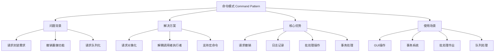
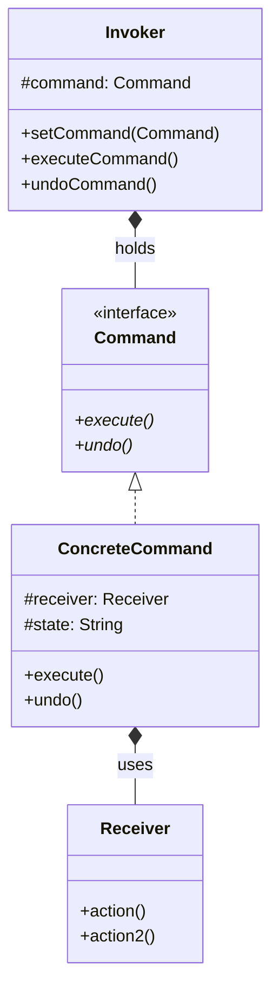

# ⚡ 命令模式详解

[[05-行为型模式/04-观察者模式]] ← [[05-行为型模式/06-状态模式]]
## 🎯 命令模式概览

### 📊 模式基本信息



### 🎯 **定义与意图**
命令模式将一个请求封装成一个对象，从而使不同的请求可以参数化客户端，队列化或者记录日志请求，也支持可撤销的操作。

### 📋 **核心价值**
- **请求封装**: 将请求封装为对象，便于传递和存储
- **撤销重做**: 支持请求的撤销和重做功能
- **队列操作**: 支持请求的批量处理和队列执行
- **解耦设计**: 调用者与执行者解耦，提高系统灵活性

## 🏗️ 命令模式结构

### 📊 **类图结构**



### 🎯 **角色职责**

#### **Command (命令接口)**
- 声明执行操作的接口
- 通常包含execute()方法

#### **ConcreteCommand (具体命令)**
- 具体实现Command接口
- 实现execute()方法，通常依赖Receiver
- 可以包含状态信息用于撤销

#### **Invoker (调用者)**
- 负责调用命令对象执行请求
- 可以存储命令历史，支持撤销功能

#### **Receiver (接收者)**
- 知道如何实施和执行请求的相关操作
- 任何类都可能作为一个接收者

## 💻 命令模式实现

### 🎯 **基础实现示例**

```java
// ✅ 命令接口
public interface Command {
    void execute();
    void undo();
    String getDescription();
}

// ✅ 接收者：文本编辑器
public class TextEditor {
    private StringBuilder content;
    private int cursorPosition;
    
    public TextEditor() {
        this.content = new StringBuilder();
        this.cursorPosition = 0;
    }
    
    public void insert(String text) {
        content.insert(cursorPosition, text);
        cursorPosition += text.length();
        System.out.println("插入文本: " + text);
        System.out.println("当前内容: " + content.toString());
    }
    
    public void delete(int length) {
        if (cursorPosition - length >= 0) {
            String deletedText = content.substring(cursorPosition - length, cursorPosition);
            content.delete(cursorPosition - length, cursorPosition);
            cursorPosition -= length;
            System.out.println("删除文本: " + deletedText);
            System.out.println("当前内容: " + content.toString());
        }
    }
    
    public void paste(String text) {
        insert(text);
    }
    
    public String getContent() {
        return content.toString();
    }
    
    public int getCursorPosition() {
        return cursorPosition;
    }
    
    public void setCursorPosition(int position) {
        this.cursorPosition = Math.max(0, Math.min(position, content.length()));
    }
}

// ✅ 具体命令：插入命令
public class InsertCommand implements Command {
    private final TextEditor editor;
    private final String text;
    private final int insertPosition;
    
    public InsertCommand(TextEditor editor, String text) {
        this.editor = editor;
        this.text = text;
        this.insertPosition = editor.getCursorPosition();
    }
    
    @Override
    public void execute() {
        editor.setCursorPosition(insertPosition);
        editor.insert(text);
    }
    
    @Override
    public void undo() {
        editor.setCursorPosition(insertPosition);
        editor.delete(text.length());
    }
    
    @Override
    public String getDescription() {
        return "Insert: " + text;
    }
}

// ✅ 具体命令：删除命令
public class DeleteCommand implements Command {
    private final TextEditor editor;
    private final int length;
    private final String deletedText;
    private final int deletePosition;
    
    public DeleteCommand(TextEditor editor, int length) {
        this.editor = editor;
        this.length = length;
        this.deletePosition = Math.max(0, editor.getCursorPosition() - length);
        
        // ✅ 记录被删除的内容，为撤销做准备
        String content = editor.getContent();
        if (deletePosition + length <= content.length()) {
            this.deletedText = content.substring(deletePosition, deletePosition + length);
        } else {
            this.deletedText = "";
        }
    }
    
    @Override
    public void execute() {
        editor.delete(length);
    }
    
    @Override
    public void undo() {
        if (!deletedText.isEmpty()) {
            editor.setCursorPosition(deletePosition);
            editor.insert(deletedText);
        }
    }
    
    @Override
    public String getDescription() {
        return "Delete: " + deletedText + " (length: " + length + ")";
    }
}

// ✅ 宏命令：批量命令
public class MacroCommand implements Command {
    private final List<Command> commands;
    
    public MacroCommand(List<Command> commands) {
        this.commands = new ArrayList<>(commands);
    }
    
    @Override
    public void execute() {
        System.out.println("执行宏命令序列:");
        commands.forEach(command -> {
            command.execute();
        });
    }
    
    @Override
    public void undo() {
        System.out.println("撤销宏命令序列:");
        // ✅ 逆序执行撤销操作
        Collections.reverse(commands);
        commands.forEach(command -> {
            command.undo();
        });
        Collections.reverse(commands); // 恢复原顺序
    }
    
    @Override
    public String getDescription() {
        return "宏命令 (" + commands.size() + "个子命令)";
    }
}

// ✅ 调用者：编辑器控制器
public class EditorController {
    private final Stack<Command> history;
    private final Stack<Command> redoStack;
    private final TextEditor editor;
    
    public EditorController(TextEditor editor) {
        this.editor = editor;
        this.history = new Stack<>();
        this.redoStack = new Stack<>();
    }
    
    public void executeCommand(Command command) {
        command.execute();
        history.push(command);
        redoStack.clear(); // ✅ 清空重做栈
        System.out.println("执行命令: " + command.getDescription());
    }
    
    public void undo() {
        if (!history.isEmpty()) {
            Command lastCommand = history.pop();
            lastCommand.undo();
            redoStack.push(lastCommand);
            System.out.println("撤销命令: " + lastCommand.getDescription());
        } else {
            System.out.println("没有可撤销的命令");
        }
    }
    
    public void redo() {
        if (!redoStack.isEmpty()) {
            Command command = redoStack.pop();
            command.execute();
            history.push(command);
            System.out.println("重做命令: " + command.getDescription());
        } else {
            System.out.println("没有可重做的命令");
        }
    }
    
    public void printHistory() {
        System.out.println("命令历史:");
        history.forEach(command -> 
            System.out.println("  - " + command.getDescription()));
    }
}
```

### 🚀 **现代企业级实现**

```java
// ✅ 数据库事务命令
public interface TransactionCommand {
    void execute();
    void rollback();
    boolean isExecuted();
    String getDescription();
}

// ✅ 账户转账命令
public class TransferCommand implements TransactionCommand {
    private final Account fromAccount;
    private final Account toAccount;
    private final BigDecimal amount;
    private boolean executed = false;
    private String transactionId;
    
    public TransferCommand(Account fromAccount, Account toAccount, BigDecimal amount) {
        this.fromAccount = fromAccount;
        this.toAccount = toAccount;
        this.amount = amount;
        this.transactionId = UUID.randomUUID().toString();
    }
    
    @Override
    public void execute() {
        if (executed) {
            throw new IllegalStateException("Command already executed");
        }
        
        // ✅ 检查余额
        if (fromAccount.getBalance().compareTo(amount) < 0) {
            throw new InsufficientFundsException("余额不足");
        }
        
        // ✅ 执行转账
        fromAccount.debit(amount);
        toAccount.credit(amount);
        
        executed = true;
        
        // ✅ 记录审计日志
        auditLog.logTransaction(transactionId, fromAccount.getId(), 
                               toAccount.getId(), amount, true);
        
        System.out.println("转账成功: " + amount + " from " + 
                          fromAccount.getId() + " to " + toAccount.getId());
    }
    
    @Override
    public void rollback() {
        if (!executed) {
            return;
        }
        
        // ✅ 回滚转账
        toAccount.debit(amount);
        fromAccount.credit(amount);
        
        executed = false;
        
        // ✅ 记录回滚日志
        auditLog.logTransaction(transactionId, toAccount.getId(), 
                              fromAccount.getId(), amount, false);
        
        System.out.println("转账回滚: " + amount + " reversed");
    }
    
    @Override
    public boolean isExecuted() {
        return executed;
    }
    
    @Override
    public String getDescription() {
        return String.format("TransferCommand: %s -> %s amount: %s", 
                           fromAccount.getId(), toAccount.getId(), amount);
    }
}

// ✅ 分布式事务管理器
@Component
public class DistributedTransactionManager {
    
    private final List<TransactionCommand> pendingCommands;
    private final AuditService auditService;
    private final CompensationService compensationService;
    
    public DistributedTransactionManager(AuditService auditService,
                                       CompensationService compensationService) {
        this.auditService = auditService;
        this.compensationService = compensationService;
        this.pendingCommands = Collections.synchronizedList(new ArrayList<>());
    }
    
    // ✅ 开始分布式事务
    public DistributedTransaction beginTransaction() {
        return new DistributedTransaction(UUID.randomUUID().toString(), this);
    }
    
    // ✅ 添加命令到事务
    public void addCommand(TransactionCommand command) {
        pendingCommands.add(command);
    }
    
    // ✅ 执行事务
    @Transactional
    public TransactionResult executeTransaction() {
        String sessionId = UUID.randomUUID().toString();
        
        try {
            // ✅ 执行所有命令
            for (TransactionCommand command : pendingCommands) {
                auditService.beforeCommandExecution(command);
                command.execute();
                auditService.afterCommandExecution(command);
            }
            
            auditService.commitTransaction(sessionId);
            
            return TransactionResult.success(sessionId, "Transaction completed successfully");
            
        } catch (Exception e) {
            // ✅ 失败时回滚所有命令
            rollbackAllCommands();
            auditService.rollbackTransaction(sessionId, e.getMessage());
            
            return TransactionResult.failure(sessionId, "Transaction failed: " + e.getMessage());
        } finally {
            pendingCommands.clear();
        }
    }
    
    private void rollbackAllCommands() {
        // ✅ 逆序回滚命令
        Collections.reverse(pendingCommands);
        
        for (TransactionCommand command : pendingCommands) {
            try {
                command.rollback();
            } catch (Exception e) {
                // ✅ 记录回滚失败的补偿操作
                compensationService.registerCompensation(command, e);
            }
        }
        
        Collections.reverse(pendingCommands); // 恢复原顺序
    }
    
    // ✅ 事务类
    public static class DistributedTransaction {
        private final String transactionId;
        private final DistributedTransactionManager manager;
        
        DistributedTransaction(String transactionId, DistributedTransactionManager manager) {
            this.transactionId = transactionId;
            this.manager = manager;
        }
        
        public DistributedTransaction addCommand(TransactionCommand command) {
            manager.addCommand(command);
            return this;
        }
        
        public TransactionResult commit() {
            return manager.executeTransaction();
        }
    }
}
```

## 🌟 命令模式在Web开发中的应用

### 🎯 **Spring Boot命令接口**

```java
// ✅ RESTful命令接口
@RestController
@RequestMapping("/api/commands")
public class CommandController {
    
    @Autowired
    private CommandExecutionService commandService;
    
    // ✅ 执行单个命令
    @PostMapping("/execute")
    public ResponseEntity<CommandResult> executeCommand(@RequestBody CommandRequest request) {
        try {
            Command command = commandFactory.createCommand(request);
            CommandResult result = commandService.execute(command);
            return ResponseEntity.ok(result);
        } catch (Exception e) {
            return ResponseEntity.badRequest()
                .body(CommandResult.failure(e.getMessage()));
        }
    }
    
    // ✅ 批量执行命令
    @PostMapping("/execute/batch")
    public ResponseEntity<BatchCommandResult> executeBatch(@RequestBody List<CommandRequest> requests) {
        try {
            List<Command> commands = requests.stream()
                .map(commandFactory::createCommand)
                .collect(Collectors.toList());
                
            BatchCommandResult result = commandService.executeBatch(commands);
            return ResponseEntity.ok(result);
        } catch (Exception e) {
            return ResponseEntity.badRequest()
                .body(BatchCommandResult.failure(e.getMessage()));
        }
    }
    
    // ✅ 撤销命令
    @PostMapping("/undo/{commandId}")
    public ResponseEntity<CommandResult> undoCommand(@PathVariable String commandId) {
        try {
            CommandResult result = commandService.undo(commandId);
            return ResponseEntity.ok(result);
        } catch (Exception e) {
            return ResponseEntity.badRequest()
                .body(CommandResult.failure("Undo failed: " + e.getMessage()));
        }
    }
    
    // ✅ 获取命令历史
    @GetMapping("/history")
    public ResponseEntity<List<CommandHistory>> getCommandHistory(
            @RequestParam(defaultValue = "0") int page,
            @RequestParam(defaultValue = "20") int size) {
        
        List<CommandHistory> history = commandService.getCommandHistory(page, size);
        return ResponseEntity.ok(history);
    }
}

// ✅ 命令执行服务
@Service
public class CommandExecutionService {
    
    private final CommandHistoryRepository historyRepository;
    private final CommandValidationService validationService;
    private final CommandCompensationService compensationService;
    
    public CommandExecutionService(CommandHistoryRepository historyRepository,
                                 CommandValidationService validationService,
                                 CommandCompensationService compensationService) {
        this.historyRepository = historyRepository;
        this.validationService = validationService;
        this.compensationService = compensationService;
    }
    
    public CommandResult execute(Command command) {
        String commandId = UUID.randomUUID().toString();
        
        try {
            // ✅ 验证命令
            validationService.validate(command);
            
            // ✅ 记录执行前状态
            CommandHistory history = CommandHistory.builder()
                .id(commandId)
                .commandDescription(command.getDescription())
                .status(CommandStatus.EXECUTING)
                .startTime(Instant.now())
                .build();
            historyRepository.save(history);
            
            // ✅ 执行命令
            command.execute();
            
            // ✅ 更新执行状态
            history.setStatus(CommandStatus.COMPLETED);
            history.setEndTime(Instant.now());
            historyRepository.save(history);
            
            return CommandResult.success(commandId, "Command executed successfully");
            
        } catch (Exception e) {
            // ✅ 执行失败处理
            CommandHistory history = historyRepository.findByCommandId(commandId);
            if (history != null) {
                history.setStatus(CommandStatus.FAILED);
                history.setErrorMessage(e.getMessage());
                history.setEndTime(Instant.now());
                historyRepository.save(history);
            }
            
            // ✅ 注册补偿操作
            compensationService.registerCompensation(commandId, command);
            
            return CommandResult.failure(commandId, e.getMessage());
        }
    }
    
    public CommandResult undo(String commandId) {
        CommandHistory history = historyRepository.findByCommandId(commandId);
        
        if (history == null || history.getStatus() != CommandStatus.COMPLETED) {
            return CommandResult.failure(commandId, "Command not found or not completed");
        }
        
        try {
            // ✅ 执行回滚
            Command command = compensationService.getCommand(commandId);
            if (command instanceof TransactionCommand) {
                ((TransactionCommand) command).rollback();
            }
            
            // ✅ 更新状态
            history.setStatus(CommandStatus.UNDONE);
            history.setEndTime(Instant.now());
            historyRepository.save(history);
            
            return CommandResult.success(commandId, "Command undone successfully");
            
        } catch (Exception e) {
            return CommandResult.failure(commandId, "Undo failed: " + e.getMessage());
        }
    }
    
    public BatchCommandResult executeBatch(List<Command> commands) {
        String batchId = UUID.randomUUID().toString();
        List<CommandResult> results = new ArrayList<>();
        
        try {
            // ✅ 批量验证
            commands.forEach(validationService::validate);
            
            // ✅ 批量执行
            for (Command command : commands) {
                CommandResult result = execute(command);
                results.add(result);
                
                // ✅ 如果有命令失败，停止后续执行
                if (!result.isSuccess()) {
                    break;
                }
            }
            
            return BatchCommandResult.success(batchId, results);
            
        } catch (Exception e) {
            return BatchCommandResult.failure(batchId, "Batch execution failed: " + e.getMessage());
        }
    }
}
```

### 🎯 **消息队列命令处理**

```java
// ✅ 异步命令处理器
@Component
public class AsyncCommandProcessor {
    
    @Autowired
    private RedisTemplate<String, Object> redisTemplate;
    
    @Autowired
    private CommandExecutionService executionService;
    
    private final ExecutorService executorService = Executors.newFixedThreadPool(10);
    
    // ✅ 提交异步命令
    public CompletableFuture<CommandResult> submitCommand(Command command) {
        String commandId = UUID.randomUUID().toString();
        
        // ✅ 将命令存储到Redis
        CommandWrapper wrapper = new CommandWrapper(commandId, command);
        redisTemplate.opsForValue().set("command:" + commandId, wrapper, 
                                       Duration.ofHours(24));
        
        // ✅ 发布到消息队列
        redisTemplate.convertAndSend("command.queue", commandId);
        
        return CompletableFuture.supplyAsync(() -> {
            try {
                // ✅ 等待命令执行
                waitForCompletion(commandId);
                
                // ✅ 获取执行结果
                CommandHistory history = executionService.getCommandHistory(commandId);
                
                if (history.getStatus() == CommandStatus.COMPLETED) {
                    return CommandResult.success(commandId, "Command completed asynchronously");
                } else {
                    return CommandResult.failure(commandId, history.getErrorMessage());
                }
                
            } catch (Exception e) {
                return CommandResult.failure(commandId, "Async execution failed: " + e.getMessage());
            }
        }, executorService);
    }
    
    // ✅ 命令队列监听器
    @RedisMessageListenerContainer
    public class CommandQueueListener implements MessageListener {
        
        @Override
        public void onMessage(Message message, byte[] pattern) {
            String commandId = (String) redisTemplate.getValueSerializer()
                                                 .deserialize(message.getBody());
            
            // ✅ 从Redis获取命令
            CommandWrapper wrapper = (CommandWrapper) redisTemplate
                                    .opsForValue().get("command:" + commandId);
            
            if (wrapper != null) {
                // ✅ 执行命令
                CommandResult result = executionService.execute(wrapper.getCommand());
                
                // ✅ 更新执行状态
                redisTemplate.opsForValue().set("result:" + commandId, result, 
                                              Duration.ofHours(1));
                
                // ✅ 发布完成通知
                redisTemplate.convertAndSend("command.completed:" + commandId, result);
            }
        }
    }
    
    private void waitForCompletion(String commandId) throws InterruptedException {
        // ✅ 轮询等待命令完成
        for (int i = 0; i < 300; i++) { // 最多等待5分钟
            CommandHistory history = executionService.getCommandHistory(commandId);
            if (history != null && 
                (history.getStatus() == CommandStatus.COMPLETED || 
                 history.getStatus() == CommandStatus.FAILED)) {
                break;
            }
            Thread.sleep(1000);
        }
    }
}

// ✅ 命令包装器
public class CommandWrapper implements Serializable {
    private String commandId;
    private Command command;
    
    public CommandWrapper(String commandId, Command command) {
        this.commandId = commandId;
        this.command = command;
    }
    
    // Getters and setters
}

// ✅ 命令工厂
@Component
public class CommandFactory {
    
    private final Map<String, Class<? extends Command>> commandTypes;
    
    public CommandFactory() {
        commandTypes = Map.of(
            "transfer", TransferCommand.class,
            "user_create", CreateUserCommand.class,
            "order_submit", SubmitOrderCommand.class
        );
    }
    
    public Command createCommand(CommandRequest request) {
        Class<? extends Command> commandClass = commandTypes.get(request.getType());
        
        if (commandClass == null) {
            throw new IllegalArgumentException("Unknown command type: " + request.getType());
        }
        
        try {
            // ✅ 使用反射创建命令
            Constructor<? extends Command> constructor = 
                findMatchingConstructor(commandClass, request.getParameters());
            
            Object[] args = mapParameters(constructor.getParameterTypes(), request.getParameters());
            
            return constructor.newInstance(args);
            
        } catch (Exception e) {
            throw new CommandCreationException("Failed to create command", e);
        }
    }
}
```

## 🔧 命令模式高级技巧

### 🎯 **命令链和过滤器**

```java
// ✅ 命令过滤器链
public class CommandFilterChain {
    
    private final List<CommandFilter> filters;
    private int index = 0;
    
    public CommandFilterChain(List<CommandFilter> filters) {
        this.filters = new ArrayList<>(filters);
    }
    
    public CommandResult doFilter(Command command) {
        if (index < filters.size()) {
            CommandFilter filter = filters.get(index++);
            CommandResult result = filter.doFilter(command, this);
            index--; // 恢复索引
            return result;
        } else {
            // ✅ 执行实际命令
            return executeCommand(command);
        }
    }
    
    private CommandResult executeCommand(Command command) {
        try {
            command.execute();
            return CommandResult.success("Command executed successfully");
        } catch (Exception e) {
            return CommandResult.failure("Command execution failed: " + e.getMessage());
        }
    }
}

// ✅ 命令过滤器接口
public interface CommandFilter {
    CommandResult doFilter(Command command, CommandFilterChain chain);
}

// ✅ 权限验证过滤器
@Component
public class PermissionValidationFilter implements CommandFilter {
    
    @Override
    public CommandResult doFilter(Command command, CommandFilterChain chain) {
        
        // ✅ 检查用户权限
        SecurityContext context = SecurityContextHolder.getContext();
        Authentication auth = context.getAuthentication();
        
        if (auth == null || !hasRequiredPermission(auth, command)) {
            return CommandResult.failure("权限不足");
        }
        
        // ✅ 继续链式处理
        return chain.doFilter(command));
    }
    
    private boolean hasRequiredPermission(Authentication auth, Command command) {
        // 权限检查逻辑
        return true;
    }
}

// ✅ 参数验证过滤器
@Component
public class ParameterValidationFilter implements CommandFilter {
    
    @Override
    public CommandResult doFilter(Command command, CommandFilterChain chain) {
        
        // ✅ 验证命令参数
        Set<ConstraintViolation<Command>> violations = validator.validate(command);
        
        if (!violations.isEmpty()) {
            String errors = violations.stream()
                .map(ConstraintViolation::getMessage)
                .collect(Collectors.joining(", "));
            return CommandResult.failure("参数验证失败: " + errors);
        }
        
        return chain.doFilter(command);
    }
}

// ✅ 日志记录过滤器
@Component
public class LoggingFilter implements CommandFilter {
    
    private static final Logger logger = LoggerFactory.getLogger(LoggingFilter.class);
    
    @Override
    public CommandResult doFilter(Command command, CommandFilterChain chain) {
        
        long startTime = System.currentTimeMillis();
        
        try {
            logger.info("执行命令: {}", command.getDescription());
            
            CommandResult result = chain.doFilter(command);
            
            logger.info("命令执行完成: {} 耗时{}ms", 
                       command.getDescription(), 
                       System.currentTimeMillis() - startTime);
            
            return result;
            
        } catch (Exception e) {
            logger.error("命令执行失败: {}", command.getDescription(), e);
            throw e;
        }
    }
}
```

## 📊 命令模式性能优化

### 🎯 **命令缓存和批量处理**

```java
// ✅ 命令缓存管理器
@Component
public class CommandCacheManager {
    
    private final LoadingCache<String, Command> commandCache;
    private final ConcurrentHashMap<String, CompletableFuture<CommandResult>> executionCache;
    
    public CommandCacheManager() {
        this.commandCache = Caffeine.newBuilder()
            .maximumSize(10000)
            .expireAfterWrite(Duration.ofMinutes(30))
            .build(this::loadCommand);
            
        this.executionCache = new ConcurrentHashMap<>();
    }
    
    // ✅ 缓存命令解析
    public Command parseCommand(String commandString) {
        return commandCache.get(commandString);
    }
    
    // ✅ 缓存命令执行
    public CompletableFuture<CommandResult> executeWithCache(String commandId, Command command) {
        
        return executionCache.computeIfAbsent(commandId, key -> 
            CompletableFuture.supplyAsync(() -> {
                try {
                    // ✅ 检查是否已是同类型命令的历史
                    Optional<CommandResult> cachedResult = getCachedResult(command);
                    if (cachedResult.isPresent()) {
                        logger.info("命令执行缓存命中: {}", command.getDescription());
                        return cachedResult.get();
                    }
                    
                    // ✅ 执行命令
                    CommandResult result = executeCommand(command);
                    
                    // ✅ 缓存结果
                    cacheCommandResult(command, result);
                    
                    return result;
                    
                } finally {
                    executionCache.remove(commandId);
                }
            })
        );
    }
    
    // ✅ 批量命令处理
    public BatchCommandResult executeBatch(List<Command> commands) {
        
        // ✅ 按类型分组，相同类型命令可以批量处理
        Map<Class<?>, List<Command>> groupedCommands = commands.stream()
            .collect(Collectors.groupingBy(Command::getClass));
        
        List<CompletableFuture<CommandResult>> futures = new ArrayList<>();
        
        groupedCommands.forEach((commandType, commandList) -> {
            
            if (commandList.size() > 1) {
                // ✅ 批量执行相同类型命令
                CompletableFuture<List<CommandResult>> batchFuture = 
                    processBatch(commandType, commandList);
                
                future.add(batchFuture.thenApply(results -> 
                    results.stream().reduce(CommandResult::combine).orElse(CommandResult.unknown())
                ));
            } else {
                // ✅ 单个命令执行
                Command command = commandList.get(0);
                futures.add(executeWithCache(UUID.randomUUID().toString(), command));
            }
        });
        
        // ✅ 等待所有命令完成
        CompletableFuture<Void> allFutures = CompletableFuture.allOf(
            futures.toArray(new CompletableFuture[0])
        );
        
        try {
            allFutures.get(30, TimeUnit.SECONDS);
            
            List<CommandResult> results = futures.stream()
                .map(CompletableFuture::join)
                .collect(Collectors.toList());
            
            return BatchCommandResult.success(results);
            
        } catch (TimeoutException e) {
            return BatchCommandResult.failure("批量执行超时");
        } catch (InterruptedException | ExecutionException e) {
            return BatchCommandResult.failure("批量执行失败: " + e.getMessage());
        }
    }
    
    private CompletableFuture<List<CommandResult>> processBatch(Class<?> commandType, 
                                                               List<Command> commands) {
        
        return CompletableFuture.supplyAsync(() -> {
            try {
                if (commandType.equals(TransferCommand.class)) {
                    return processTransferBatch((List<TransferCommand>) commands);
                } else {
                    // ✅ 其他类型的批量处理
                    return commands.stream()
                        .map(this::executeCommand)
                        .collect(Collectors.toList());
                }
            } catch (Exception e) {
                return Collections.singletonList(
                    CommandResult.failure("批量处理失败: " + e.getMessage())
                );
            }
        });
    }
    
    private List<CommandResult> processTransferBatch(List<TransferCommand> transferCommands) {
        
        // ✅ 转账命令的批量优化处理
        Map<String, BigDecimal> accountChanges = transferCommands.stream()
            .collect(Collectors.groupingBy(
                cmd -> cmd.getFromAccount().getId(),
                Collectors.reducing(BigDecimal.ZERO, 
                    cmd -> cmd.getAmount(), 
                    BigDecimal::subtract)
            ));
        
        Map<String, BigDecimal> creditChanges = transferCommands.stream()
            .collect(Collectors.groupingBy(
                cmd -> cmd.getToAccount().getId(),
                Collectors.reducing(BigDecimal.ZERO, 
                    cmd -> cmd.getAmount(), 
                    BigDecimal::add)
            ));
        
        // ✅ 批量更新账户余额
        return applyBatchAccountChanges(accountChanges, creditChanges);
    }
}
```

## 🚀 命令模式最佳实践

### 📋 **使用指南**

1. **命令设计原则**:
   - 命令应该是不可变的
   - 命令应该包含足够的信息来撤销操作
   - 命令应该支持序列化

2. **性能考虑**:
   - 对于频繁执行的命令，考虑使用缓存
   - 批量命令比单个命令更高效
   - 异步执行命令时要注意资源管理

3. **撤销功能**:
   - 始终保存恢复原状态所需的信息
   - 考虑使用补偿操作而非直接撤销
   - 撤销操作也应该可以撤销

### ⚠️ **注意事项**

1. **内存管理**: 命令历史可能占用大量内存
2. **并发安全**: 命令执行过程中的线程安全问题
3. **错误处理**: 命令执行失败时的回滚策略
4. **版本兼容**: 命令结构变更时的兼容性问题

## 📊 与其他模式的对比

| 对比维度 | 命令模式 | 策略模式 | 状态模式 |
|----------|----------|----------|----------|
| **目的** | 封装请求 | 封装算法 | 封装状态 |
| **撤销** | 支持撤销 | 不支持 | 支持状态回退 |
| **时间性** | 可以延迟执行 | 立即执行 | 状态驱动 |
| **队列化** | 支持队列 | 不支持 | 不支持 |

## 🔗 学习衔接

- **上一模式** ← [[观察者模式]]
- **下一模式** → [[状态模式]]
- **模式对比** → [[05-行为型模式/13-行为型模式对比表]]
- **Spring应用** → [[设计模式最佳实践秘典]]

---
**💡 命令模式精髓**: 命令模式将请求封装成对象，就像把请求装进信封，可以在不同的时间、地点投递。它不仅支持撤销重做，还能实现批量处理、队列化执行等高级功能！
