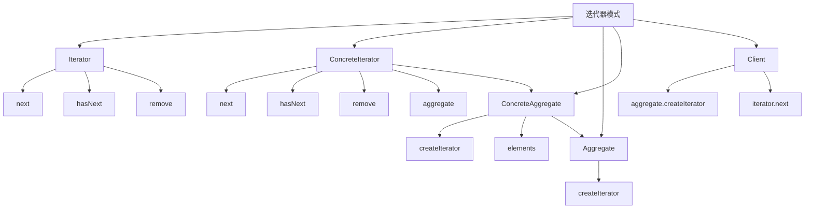

# 🔄 迭代器模式

[[05-行为型模式/04-解释器模式]] ← [[05-行为型模式/06-中介者模式]]
## 🎯 迭代器模式概览

### 📊 模式结构图



## 🏗️ 模式定义与特点

### 📋 **模式定义**
迭代器模式提供一种方法顺序访问一个聚合对象中各个元素，而又无须暴露该对象的内部表示。

### 📋 **核心特点**
- **顺序访问**: 提供顺序访问聚合对象的方法
- **内部隐藏**: 隐藏聚合对象的内部表示
- **统一接口**: 提供统一的迭代接口
- **支持删除**: 支持在迭代过程中删除元素

### 📋 **适用场景**
- 需要遍历聚合对象
- 需要隐藏聚合对象的内部结构
- 需要支持多种遍历方式
- 需要支持在遍历过程中删除元素

## 🏗️ 模式实现

### 📋 **基础实现**

#### **迭代器接口**
```java
// ✅ 迭代器接口
public interface Iterator<T> {
    boolean hasNext();
    T next();
    void remove();
}

// ✅ 聚合接口
public interface Aggregate<T> {
    Iterator<T> createIterator();
}

// ✅ 具体聚合类
public class ConcreteAggregate<T> implements Aggregate<T> {
    private List<T> elements;
    
    public ConcreteAggregate() {
        this.elements = new ArrayList<>();
    }
    
    public void add(T element) {
        elements.add(element);
    }
    
    public void remove(T element) {
        elements.remove(element);
    }
    
    public T get(int index) {
        return elements.get(index);
    }
    
    public int size() {
        return elements.size();
    }
    
    @Override
    public Iterator<T> createIterator() {
        return new ConcreteIterator<>(this);
    }
}

// ✅ 具体迭代器
public class ConcreteIterator<T> implements Iterator<T> {
    private ConcreteAggregate<T> aggregate;
    private int currentIndex;
    
    public ConcreteIterator(ConcreteAggregate<T> aggregate) {
        this.aggregate = aggregate;
        this.currentIndex = 0;
    }
    
    @Override
    public boolean hasNext() {
        return currentIndex < aggregate.size();
    }
    
    @Override
    public T next() {
        if (hasNext()) {
            T element = aggregate.get(currentIndex);
            currentIndex++;
            return element;
        }
        throw new NoSuchElementException();
    }
    
    @Override
    public void remove() {
        if (currentIndex > 0) {
            aggregate.remove(aggregate.get(currentIndex - 1));
            currentIndex--;
        } else {
            throw new IllegalStateException();
        }
    }
}
```

#### **使用示例**
```java
// ✅ 客户端使用
public class Client {
    public static void main(String[] args) {
        ConcreteAggregate<String> aggregate = new ConcreteAggregate<>();
        aggregate.add("Element 1");
        aggregate.add("Element 2");
        aggregate.add("Element 3");
        
        Iterator<String> iterator = aggregate.createIterator();
        while (iterator.hasNext()) {
            String element = iterator.next();
            System.out.println(element);
        }
    }
}
```

## 🏗️ 实际应用案例

### 📋 **文件系统迭代器案例**

#### **文件系统迭代器**
```java
// ✅ 文件系统项接口
public interface FileSystemItem {
    String getName();
    boolean isDirectory();
    List<FileSystemItem> getChildren();
}

// ✅ 文件类
public class File implements FileSystemItem {
    private String name;
    private long size;
    
    public File(String name, long size) {
        this.name = name;
        this.size = size;
    }
    
    @Override
    public String getName() {
        return name;
    }
    
    @Override
    public boolean isDirectory() {
        return false;
    }
    
    @Override
    public List<FileSystemItem> getChildren() {
        return new ArrayList<>();
    }
    
    public long getSize() {
        return size;
    }
    
    @Override
    public String toString() {
        return "File: " + name + " (" + size + " bytes)";
    }
}

// ✅ 目录类
public class Directory implements FileSystemItem {
    private String name;
    private List<FileSystemItem> children;
    
    public Directory(String name) {
        this.name = name;
        this.children = new ArrayList<>();
    }
    
    @Override
    public String getName() {
        return name;
    }
    
    @Override
    public boolean isDirectory() {
        return true;
    }
    
    @Override
    public List<FileSystemItem> getChildren() {
        return children;
    }
    
    public void addChild(FileSystemItem child) {
        children.add(child);
    }
    
    public void removeChild(FileSystemItem child) {
        children.remove(child);
    }
    
    @Override
    public String toString() {
        return "Directory: " + name;
    }
}

// ✅ 文件系统迭代器接口
public interface FileSystemIterator {
    boolean hasNext();
    FileSystemItem next();
    void remove();
}

// ✅ 深度优先迭代器
public class DepthFirstIterator implements FileSystemIterator {
    private Stack<FileSystemItem> stack;
    private FileSystemItem current;
    
    public DepthFirstIterator(FileSystemItem root) {
        this.stack = new Stack<>();
        this.current = root;
        if (current != null) {
            stack.push(current);
        }
    }
    
    @Override
    public boolean hasNext() {
        return !stack.isEmpty();
    }
    
    @Override
    public FileSystemItem next() {
        if (!hasNext()) {
            throw new NoSuchElementException();
        }
        
        current = stack.pop();
        
        // 将子项压入栈中（逆序，保证正序访问）
        List<FileSystemItem> children = current.getChildren();
        for (int i = children.size() - 1; i >= 0; i--) {
            stack.push(children.get(i));
        }
        
        return current;
    }
    
    @Override
    public void remove() {
        throw new UnsupportedOperationException("Remove operation not supported");
    }
}

// ✅ 广度优先迭代器
public class BreadthFirstIterator implements FileSystemIterator {
    private Queue<FileSystemItem> queue;
    private FileSystemItem current;
    
    public BreadthFirstIterator(FileSystemItem root) {
        this.queue = new LinkedList<>();
        this.current = root;
        if (current != null) {
            queue.offer(current);
        }
    }
    
    @Override
    public boolean hasNext() {
        return !queue.isEmpty();
    }
    
    @Override
    public FileSystemItem next() {
        if (!hasNext()) {
            throw new NoSuchElementException();
        }
        
        current = queue.poll();
        
        // 将子项加入队列
        for (FileSystemItem child : current.getChildren()) {
            queue.offer(child);
        }
        
        return current;
    }
    
    @Override
    public void remove() {
        throw new UnsupportedOperationException("Remove operation not supported");
    }
}

// ✅ 文件系统聚合接口
public interface FileSystemAggregate {
    FileSystemIterator createDepthFirstIterator();
    FileSystemIterator createBreadthFirstIterator();
}

// ✅ 文件系统聚合实现
public class FileSystemAggregateImpl implements FileSystemAggregate {
    private FileSystemItem root;
    
    public FileSystemAggregateImpl(FileSystemItem root) {
        this.root = root;
    }
    
    @Override
    public FileSystemIterator createDepthFirstIterator() {
        return new DepthFirstIterator(root);
    }
    
    @Override
    public FileSystemIterator createBreadthFirstIterator() {
        return new BreadthFirstIterator(root);
    }
}
```

#### **使用示例**
```java
// ✅ 使用示例
public class FileSystemDemo {
    public static void main(String[] args) {
        // 创建文件系统结构
        Directory root = new Directory("root");
        
        Directory documents = new Directory("documents");
        documents.addChild(new File("readme.txt", 1024));
        documents.addChild(new File("config.xml", 2048));
        
        Directory pictures = new Directory("pictures");
        pictures.addChild(new File("photo1.jpg", 512000));
        pictures.addChild(new File("photo2.jpg", 768000));
        
        Directory videos = new Directory("videos");
        videos.addChild(new File("movie1.mp4", 1024000));
        videos.addChild(new File("movie2.mp4", 2048000));
        
        root.addChild(documents);
        root.addChild(pictures);
        root.addChild(videos);
        
        // 创建聚合对象
        FileSystemAggregate aggregate = new FileSystemAggregateImpl(root);
        
        // 深度优先遍历
        System.out.println("=== Depth First Traversal ===");
        FileSystemIterator depthFirstIterator = aggregate.createDepthFirstIterator();
        while (depthFirstIterator.hasNext()) {
            FileSystemItem item = depthFirstIterator.next();
            System.out.println(item);
        }
        
        System.out.println();
        
        // 广度优先遍历
        System.out.println("=== Breadth First Traversal ===");
        FileSystemIterator breadthFirstIterator = aggregate.createBreadthFirstIterator();
        while (breadthFirstIterator.hasNext()) {
            FileSystemItem item = breadthFirstIterator.next();
            System.out.println(item);
        }
    }
}
```

### 📋 **数据库结果集迭代器案例**

#### **数据库结果集迭代器**
```java
// ✅ 数据库行接口
public interface DatabaseRow {
    Object getValue(String columnName);
    Object getValue(int columnIndex);
    String[] getColumnNames();
    int getColumnCount();
}

// ✅ 数据库行实现
public class DatabaseRowImpl implements DatabaseRow {
    private Map<String, Object> data;
    private String[] columnNames;
    
    public DatabaseRowImpl(Map<String, Object> data, String[] columnNames) {
        this.data = data;
        this.columnNames = columnNames;
    }
    
    @Override
    public Object getValue(String columnName) {
        return data.get(columnName);
    }
    
    @Override
    public Object getValue(int columnIndex) {
        if (columnIndex >= 0 && columnIndex < columnNames.length) {
            return data.get(columnNames[columnIndex]);
        }
        throw new IndexOutOfBoundsException("Column index out of bounds");
    }
    
    @Override
    public String[] getColumnNames() {
        return columnNames.clone();
    }
    
    @Override
    public int getColumnCount() {
        return columnNames.length;
    }
    
    @Override
    public String toString() {
        StringBuilder sb = new StringBuilder();
        sb.append("Row{");
        for (int i = 0; i < columnNames.length; i++) {
            sb.append(columnNames[i]).append("=").append(data.get(columnNames[i]));
            if (i < columnNames.length - 1) {
                sb.append(", ");
            }
        }
        sb.append("}");
        return sb.toString();
    }
}

// ✅ 数据库结果集接口
public interface DatabaseResultSet {
    DatabaseResultSetIterator createIterator();
    int getRowCount();
    String[] getColumnNames();
}

// ✅ 数据库结果集实现
public class DatabaseResultSetImpl implements DatabaseResultSet {
    private List<DatabaseRow> rows;
    private String[] columnNames;
    
    public DatabaseResultSetImpl(String[] columnNames) {
        this.columnNames = columnNames;
        this.rows = new ArrayList<>();
    }
    
    public void addRow(Map<String, Object> data) {
        rows.add(new DatabaseRowImpl(data, columnNames));
    }
    
    @Override
    public DatabaseResultSetIterator createIterator() {
        return new DatabaseResultSetIteratorImpl(this);
    }
    
    @Override
    public int getRowCount() {
        return rows.size();
    }
    
    @Override
    public String[] getColumnNames() {
        return columnNames.clone();
    }
    
    public DatabaseRow getRow(int index) {
        return rows.get(index);
    }
}

// ✅ 数据库结果集迭代器接口
public interface DatabaseResultSetIterator {
    boolean hasNext();
    DatabaseRow next();
    void remove();
    int getCurrentIndex();
    void reset();
}

// ✅ 数据库结果集迭代器实现
public class DatabaseResultSetIteratorImpl implements DatabaseResultSetIterator {
    private DatabaseResultSetImpl resultSet;
    private int currentIndex;
    
    public DatabaseResultSetIteratorImpl(DatabaseResultSetImpl resultSet) {
        this.resultSet = resultSet;
        this.currentIndex = 0;
    }
    
    @Override
    public boolean hasNext() {
        return currentIndex < resultSet.getRowCount();
    }
    
    @Override
    public DatabaseRow next() {
        if (!hasNext()) {
            throw new NoSuchElementException();
        }
        
        DatabaseRow row = resultSet.getRow(currentIndex);
        currentIndex++;
        return row;
    }
    
    @Override
    public void remove() {
        if (currentIndex > 0) {
            // 在实际实现中，这里会从结果集中删除行
            System.out.println("Removing row at index " + (currentIndex - 1));
        } else {
            throw new IllegalStateException("No element to remove");
        }
    }
    
    @Override
    public int getCurrentIndex() {
        return currentIndex;
    }
    
    @Override
    public void reset() {
        currentIndex = 0;
    }
}

// ✅ 数据库查询模拟
public class DatabaseQuery {
    public static DatabaseResultSet executeQuery(String sql) {
        System.out.println("Executing SQL: " + sql);
        
        // 模拟查询结果
        DatabaseResultSetImpl resultSet = new DatabaseResultSetImpl(
            new String[]{"id", "name", "email", "age"}
        );
        
        // 添加模拟数据
        Map<String, Object> row1 = new HashMap<>();
        row1.put("id", 1);
        row1.put("name", "John Doe");
        row1.put("email", "john@example.com");
        row1.put("age", 30);
        resultSet.addRow(row1);
        
        Map<String, Object> row2 = new HashMap<>();
        row2.put("id", 2);
        row2.put("name", "Jane Smith");
        row2.put("email", "jane@example.com");
        row2.put("age", 25);
        resultSet.addRow(row2);
        
        Map<String, Object> row3 = new HashMap<>();
        row3.put("id", 3);
        row3.put("name", "Bob Johnson");
        row3.put("email", "bob@example.com");
        row3.put("age", 35);
        resultSet.addRow(row3);
        
        return resultSet;
    }
}
```

#### **使用示例**
```java
// ✅ 使用示例
public class DatabaseResultSetDemo {
    public static void main(String[] args) {
        // 执行查询
        DatabaseResultSet resultSet = DatabaseQuery.executeQuery("SELECT * FROM users");
        
        System.out.println("Query returned " + resultSet.getRowCount() + " rows");
        System.out.println("Columns: " + String.join(", ", resultSet.getColumnNames()));
        System.out.println();
        
        // 使用迭代器遍历结果
        DatabaseResultSetIterator iterator = resultSet.createIterator();
        
        System.out.println("=== Iterating through results ===");
        while (iterator.hasNext()) {
            DatabaseRow row = iterator.next();
            System.out.println("Row " + iterator.getCurrentIndex() + ": " + row);
        }
        
        System.out.println();
        
        // 重置迭代器
        iterator.reset();
        
        System.out.println("=== Iterating again ===");
        while (iterator.hasNext()) {
            DatabaseRow row = iterator.next();
            System.out.println("Row " + iterator.getCurrentIndex() + ": " + row);
        }
        
        System.out.println();
        
        // 使用迭代器删除行
        iterator.reset();
        while (iterator.hasNext()) {
            DatabaseRow row = iterator.next();
            if (row.getValue("age").equals(25)) {
                iterator.remove();
                System.out.println("Removed row with age 25");
                break;
            }
        }
    }
}
```

### 📋 **集合迭代器案例**

#### **集合迭代器**
```java
// ✅ 集合接口
public interface Collection<T> {
    void add(T element);
    void remove(T element);
    boolean contains(T element);
    int size();
    boolean isEmpty();
    CollectionIterator<T> createIterator();
}

// ✅ 集合迭代器接口
public interface CollectionIterator<T> {
    boolean hasNext();
    T next();
    void remove();
    int getCurrentIndex();
}

// ✅ 数组集合实现
public class ArrayCollection<T> implements Collection<T> {
    private Object[] elements;
    private int size;
    private int capacity;
    
    public ArrayCollection(int initialCapacity) {
        this.capacity = initialCapacity;
        this.elements = new Object[capacity];
        this.size = 0;
    }
    
    @Override
    public void add(T element) {
        if (size >= capacity) {
            resize();
        }
        elements[size++] = element;
    }
    
    @Override
    public void remove(T element) {
        for (int i = 0; i < size; i++) {
            if (elements[i].equals(element)) {
                System.arraycopy(elements, i + 1, elements, i, size - i - 1);
                size--;
                break;
            }
        }
    }
    
    @Override
    public boolean contains(T element) {
        for (int i = 0; i < size; i++) {
            if (elements[i].equals(element)) {
                return true;
            }
        }
        return false;
    }
    
    @Override
    public int size() {
        return size;
    }
    
    @Override
    public boolean isEmpty() {
        return size == 0;
    }
    
    @Override
    public CollectionIterator<T> createIterator() {
        return new ArrayCollectionIterator<>(this);
    }
    
    @SuppressWarnings("unchecked")
    public T get(int index) {
        if (index >= 0 && index < size) {
            return (T) elements[index];
        }
        throw new IndexOutOfBoundsException("Index out of bounds");
    }
    
    private void resize() {
        capacity *= 2;
        Object[] newElements = new Object[capacity];
        System.arraycopy(elements, 0, newElements, 0, size);
        elements = newElements;
    }
}

// ✅ 数组集合迭代器
public class ArrayCollectionIterator<T> implements CollectionIterator<T> {
    private ArrayCollection<T> collection;
    private int currentIndex;
    
    public ArrayCollectionIterator(ArrayCollection<T> collection) {
        this.collection = collection;
        this.currentIndex = 0;
    }
    
    @Override
    public boolean hasNext() {
        return currentIndex < collection.size();
    }
    
    @Override
    public T next() {
        if (!hasNext()) {
            throw new NoSuchElementException();
        }
        
        T element = collection.get(currentIndex);
        currentIndex++;
        return element;
    }
    
    @Override
    public void remove() {
        if (currentIndex > 0) {
            T element = collection.get(currentIndex - 1);
            collection.remove(element);
            currentIndex--;
        } else {
            throw new IllegalStateException("No element to remove");
        }
    }
    
    @Override
    public int getCurrentIndex() {
        return currentIndex;
    }
}

// ✅ 链表集合实现
public class LinkedListCollection<T> implements Collection<T> {
    private Node<T> head;
    private Node<T> tail;
    private int size;
    
    private static class Node<T> {
        T data;
        Node<T> next;
        
        Node(T data) {
            this.data = data;
        }
    }
    
    public LinkedListCollection() {
        this.head = null;
        this.tail = null;
        this.size = 0;
    }
    
    @Override
    public void add(T element) {
        Node<T> newNode = new Node<>(element);
        if (head == null) {
            head = tail = newNode;
        } else {
            tail.next = newNode;
            tail = newNode;
        }
        size++;
    }
    
    @Override
    public void remove(T element) {
        if (head == null) {
            return;
        }
        
        if (head.data.equals(element)) {
            head = head.next;
            if (head == null) {
                tail = null;
            }
            size--;
            return;
        }
        
        Node<T> current = head;
        while (current.next != null) {
            if (current.next.data.equals(element)) {
                current.next = current.next.next;
                if (current.next == null) {
                    tail = current;
                }
                size--;
                return;
            }
            current = current.next;
        }
    }
    
    @Override
    public boolean contains(T element) {
        Node<T> current = head;
        while (current != null) {
            if (current.data.equals(element)) {
                return true;
            }
            current = current.next;
        }
        return false;
    }
    
    @Override
    public int size() {
        return size;
    }
    
    @Override
    public boolean isEmpty() {
        return size == 0;
    }
    
    @Override
    public CollectionIterator<T> createIterator() {
        return new LinkedListCollectionIterator<>(this);
    }
    
    public Node<T> getHead() {
        return head;
    }
}

// ✅ 链表集合迭代器
public class LinkedListCollectionIterator<T> implements CollectionIterator<T> {
    private LinkedListCollection<T> collection;
    private LinkedListCollection.Node<T> current;
    private LinkedListCollection.Node<T> previous;
    private boolean canRemove;
    
    public LinkedListCollectionIterator(LinkedListCollection<T> collection) {
        this.collection = collection;
        this.current = collection.getHead();
        this.previous = null;
        this.canRemove = false;
    }
    
    @Override
    public boolean hasNext() {
        return current != null;
    }
    
    @Override
    public T next() {
        if (!hasNext()) {
            throw new NoSuchElementException();
        }
        
        T data = current.data;
        previous = current;
        current = current.next;
        canRemove = true;
        return data;
    }
    
    @Override
    public void remove() {
        if (!canRemove) {
            throw new IllegalStateException("No element to remove");
        }
        
        if (previous != null) {
            collection.remove(previous.data);
        }
        canRemove = false;
    }
    
    @Override
    public int getCurrentIndex() {
        // 链表不支持索引访问，返回-1表示不支持
        return -1;
    }
}
```

#### **使用示例**
```java
// ✅ 使用示例
public class CollectionDemo {
    public static void main(String[] args) {
        // 测试数组集合
        System.out.println("=== Array Collection ===");
        ArrayCollection<String> arrayCollection = new ArrayCollection<>(5);
        arrayCollection.add("Apple");
        arrayCollection.add("Banana");
        arrayCollection.add("Cherry");
        arrayCollection.add("Date");
        
        CollectionIterator<String> arrayIterator = arrayCollection.createIterator();
        while (arrayIterator.hasNext()) {
            String fruit = arrayIterator.next();
            System.out.println("Fruit: " + fruit);
        }
        
        System.out.println();
        
        // 测试链表集合
        System.out.println("=== Linked List Collection ===");
        LinkedListCollection<String> linkedListCollection = new LinkedListCollection<>();
        linkedListCollection.add("Red");
        linkedListCollection.add("Green");
        linkedListCollection.add("Blue");
        linkedListCollection.add("Yellow");
        
        CollectionIterator<String> linkedListIterator = linkedListCollection.createIterator();
        while (linkedListIterator.hasNext()) {
            String color = linkedListIterator.next();
            System.out.println("Color: " + color);
        }
        
        System.out.println();
        
        // 测试删除操作
        System.out.println("=== Testing Remove Operation ===");
        arrayIterator = arrayCollection.createIterator();
        while (arrayIterator.hasNext()) {
            String fruit = arrayIterator.next();
            if (fruit.equals("Banana")) {
                arrayIterator.remove();
                System.out.println("Removed: " + fruit);
            }
        }
        
        System.out.println("Remaining fruits:");
        arrayIterator = arrayCollection.createIterator();
        while (arrayIterator.hasNext()) {
            String fruit = arrayIterator.next();
            System.out.println("Fruit: " + fruit);
        }
    }
}
```

## 🎯 模式优势与劣势

### 📋 **优势**
- **顺序访问**: 提供顺序访问聚合对象的方法
- **内部隐藏**: 隐藏聚合对象的内部表示
- **统一接口**: 提供统一的迭代接口
- **支持删除**: 支持在迭代过程中删除元素

### 📋 **劣势**
- **复杂度增加**: 增加了系统的复杂度
- **性能开销**: 迭代器可能带来性能开销
- **状态管理**: 需要管理迭代器的状态

### 📋 **与访问者模式的区别**
| 方面 | 迭代器模式 | 访问者模式 |
|------|------------|------------|
| **目的** | 遍历集合 | 操作分离 |
| **访问方式** | 顺序访问 | 任意访问 |
| **使用场景** | 集合遍历 | 操作扩展 |
| **复杂度** | 相对简单 | 相对复杂 |

## 🔗 学习衔接

- **上一文档** ← [[解释器模式]]
- **下一文档** → [[中介者模式]]
- **模式基础** → [[01-基础认知]]

---
**💡 迭代器精髓**: 迭代器模式就像导游，能够带领我们有序地参观集合中的每一个元素，而不需要了解集合的内部结构。当我们需要遍历聚合对象，或者需要隐藏聚合对象的内部结构时，迭代器模式是最佳选择！