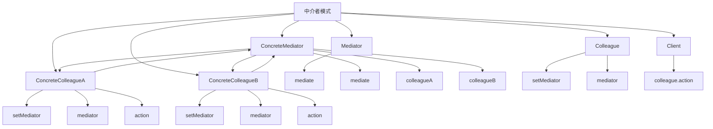

# 🏢 中介者模式

[[05-行为型模式/05-迭代器模式]] ← [[05-行为型模式/07-备忘录模式]]
## 🎯 中介者模式概览

### 📊 模式结构图



## 🏗️ 模式定义与特点

### 📋 **模式定义**
中介者模式用一个中介对象来封装一系列的对象交互。中介者使各对象不需要显式地相互引用，从而使其耦合松散，而且可以独立地改变它们之间的交互。

### 📋 **核心特点**
- **对象解耦**: 减少对象间的直接依赖
- **交互封装**: 封装对象间的交互逻辑
- **集中控制**: 集中控制对象间的交互
- **易于扩展**: 易于添加新的对象和交互

### 📋 **适用场景**
- 对象间存在复杂的交互关系
- 需要减少对象间的直接依赖
- 需要集中控制对象间的交互
- 需要动态改变对象间的交互

## 🏗️ 模式实现

### 📋 **基础实现**

#### **中介者接口**
```java
// ✅ 中介者接口
public interface Mediator {
    void mediate(Colleague colleague, String message);
}

// ✅ 同事接口
public abstract class Colleague {
    protected Mediator mediator;
    
    public void setMediator(Mediator mediator) {
        this.mediator = mediator;
    }
    
    public abstract void action(String message);
}

// ✅ 具体同事A
public class ConcreteColleagueA extends Colleague {
    @Override
    public void action(String message) {
        System.out.println("ColleagueA received: " + message);
        mediator.mediate(this, "Response from A");
    }
}

// ✅ 具体同事B
public class ConcreteColleagueB extends Colleague {
    @Override
    public void action(String message) {
        System.out.println("ColleagueB received: " + message);
        mediator.mediate(this, "Response from B");
    }
}

// ✅ 具体中介者
public class ConcreteMediator implements Mediator {
    private ConcreteColleagueA colleagueA;
    private ConcreteColleagueB colleagueB;
    
    public void setColleagueA(ConcreteColleagueA colleagueA) {
        this.colleagueA = colleagueA;
    }
    
    public void setColleagueB(ConcreteColleagueB colleagueB) {
        this.colleagueB = colleagueB;
    }
    
    @Override
    public void mediate(Colleague colleague, String message) {
        if (colleague == colleagueA) {
            colleagueB.action(message);
        } else if (colleague == colleagueB) {
            colleagueA.action(message);
        }
    }
}
```

#### **使用示例**
```java
// ✅ 客户端使用
public class Client {
    public static void main(String[] args) {
        ConcreteMediator mediator = new ConcreteMediator();
        ConcreteColleagueA colleagueA = new ConcreteColleagueA();
        ConcreteColleagueB colleagueB = new ConcreteColleagueB();
        
        colleagueA.setMediator(mediator);
        colleagueB.setMediator(mediator);
        
        mediator.setColleagueA(colleagueA);
        mediator.setColleagueB(colleagueB);
        
        colleagueA.action("Hello from A");
    }
}
```

## 🏗️ 实际应用案例

### 📋 **聊天室中介者案例**

#### **聊天室中介者**
```java
// ✅ 用户接口
public abstract class User {
    protected ChatRoomMediator mediator;
    protected String name;
    
    public User(String name) {
        this.name = name;
    }
    
    public void setMediator(ChatRoomMediator mediator) {
        this.mediator = mediator;
    }
    
    public String getName() {
        return name;
    }
    
    public abstract void sendMessage(String message);
    public abstract void receiveMessage(String message, String sender);
}

// ✅ 普通用户
public class RegularUser extends User {
    public RegularUser(String name) {
        super(name);
    }
    
    @Override
    public void sendMessage(String message) {
        System.out.println(name + " sends: " + message);
        mediator.broadcastMessage(message, this);
    }
    
    @Override
    public void receiveMessage(String message, String sender) {
        System.out.println(name + " receives from " + sender + ": " + message);
    }
}

// ✅ 管理员用户
public class AdminUser extends User {
    public AdminUser(String name) {
        super(name);
    }
    
    @Override
    public void sendMessage(String message) {
        System.out.println("[ADMIN] " + name + " sends: " + message);
        mediator.broadcastMessage(message, this);
    }
    
    @Override
    public void receiveMessage(String message, String sender) {
        System.out.println("[ADMIN] " + name + " receives from " + sender + ": " + message);
    }
    
    public void kickUser(String userName) {
        System.out.println("[ADMIN] " + name + " kicks user: " + userName);
        mediator.kickUser(userName, this);
    }
    
    public void muteUser(String userName) {
        System.out.println("[ADMIN] " + name + " mutes user: " + userName);
        mediator.muteUser(userName, this);
    }
}

// ✅ 聊天室中介者接口
public interface ChatRoomMediator {
    void addUser(User user);
    void removeUser(User user);
    void broadcastMessage(String message, User sender);
    void sendPrivateMessage(String message, User sender, String recipient);
    void kickUser(String userName, AdminUser admin);
    void muteUser(String userName, AdminUser admin);
}

// ✅ 聊天室中介者实现
public class ChatRoomMediatorImpl implements ChatRoomMediator {
    private List<User> users;
    private Set<String> mutedUsers;
    
    public ChatRoomMediatorImpl() {
        this.users = new ArrayList<>();
        this.mutedUsers = new HashSet<>();
    }
    
    @Override
    public void addUser(User user) {
        users.add(user);
        user.setMediator(this);
        System.out.println("User " + user.getName() + " joined the chat room");
        
        // 通知其他用户
        for (User otherUser : users) {
            if (otherUser != user) {
                otherUser.receiveMessage(user.getName() + " joined the chat room", "System");
            }
        }
    }
    
    @Override
    public void removeUser(User user) {
        users.remove(user);
        System.out.println("User " + user.getName() + " left the chat room");
        
        // 通知其他用户
        for (User otherUser : users) {
            otherUser.receiveMessage(user.getName() + " left the chat room", "System");
        }
    }
    
    @Override
    public void broadcastMessage(String message, User sender) {
        if (mutedUsers.contains(sender.getName())) {
            System.out.println("User " + sender.getName() + " is muted and cannot send messages");
            return;
        }
        
        for (User user : users) {
            if (user != sender) {
                user.receiveMessage(message, sender.getName());
            }
        }
    }
    
    @Override
    public void sendPrivateMessage(String message, User sender, String recipient) {
        if (mutedUsers.contains(sender.getName())) {
            System.out.println("User " + sender.getName() + " is muted and cannot send messages");
            return;
        }
        
        for (User user : users) {
            if (user.getName().equals(recipient)) {
                user.receiveMessage("[PRIVATE] " + message, sender.getName());
                break;
            }
        }
    }
    
    @Override
    public void kickUser(String userName, AdminUser admin) {
        User userToKick = null;
        for (User user : users) {
            if (user.getName().equals(userName)) {
                userToKick = user;
                break;
            }
        }
        
        if (userToKick != null) {
            removeUser(userToKick);
            System.out.println("User " + userName + " was kicked by " + admin.getName());
        } else {
            System.out.println("User " + userName + " not found");
        }
    }
    
    @Override
    public void muteUser(String userName, AdminUser admin) {
        mutedUsers.add(userName);
        System.out.println("User " + userName + " was muted by " + admin.getName());
    }
    
    public void printUsers() {
        System.out.println("=== Current Users ===");
        for (User user : users) {
            String status = mutedUsers.contains(user.getName()) ? " (MUTED)" : "";
            System.out.println("- " + user.getName() + status);
        }
    }
}
```

#### **使用示例**
```java
// ✅ 使用示例
public class ChatRoomDemo {
    public static void main(String[] args) {
        ChatRoomMediator chatRoom = new ChatRoomMediatorImpl();
        
        // 创建用户
        RegularUser user1 = new RegularUser("Alice");
        RegularUser user2 = new RegularUser("Bob");
        RegularUser user3 = new RegularUser("Charlie");
        AdminUser admin = new AdminUser("Admin");
        
        // 用户加入聊天室
        chatRoom.addUser(user1);
        chatRoom.addUser(user2);
        chatRoom.addUser(user3);
        chatRoom.addUser(admin);
        
        System.out.println();
        
        // 发送消息
        user1.sendMessage("Hello everyone!");
        user2.sendMessage("Hi Alice!");
        admin.sendMessage("Welcome to the chat room!");
        
        System.out.println();
        
        // 管理员操作
        admin.muteUser("Bob");
        user2.sendMessage("This message should not be sent");
        
        System.out.println();
        
        // 踢出用户
        admin.kickUser("Charlie");
        
        System.out.println();
        
        // 打印当前用户
        chatRoom.printUsers();
        
        System.out.println();
        
        // 发送私聊消息
        user1.sendMessage("Private message to Alice");
        chatRoom.sendPrivateMessage("This is a private message", user1, "Alice");
    }
}
```

### 📋 **飞机交通控制中介者案例**

#### **飞机交通控制中介者**
```java
// ✅ 飞机接口
public abstract class Aircraft {
    protected AirTrafficControlMediator mediator;
    protected String flightNumber;
    protected String currentAirport;
    protected int altitude;
    protected String status;
    
    public Aircraft(String flightNumber, String currentAirport) {
        this.flightNumber = flightNumber;
        this.currentAirport = currentAirport;
        this.altitude = 0;
        this.status = "GROUNDED";
    }
    
    public void setMediator(AirTrafficControlMediator mediator) {
        this.mediator = mediator;
    }
    
    public String getFlightNumber() {
        return flightNumber;
    }
    
    public String getCurrentAirport() {
        return currentAirport;
    }
    
    public int getAltitude() {
        return altitude;
    }
    
    public String getStatus() {
        return status;
    }
    
    public abstract void requestTakeoff();
    public abstract void requestLanding(String airport);
    public abstract void requestAltitudeChange(int newAltitude);
    public abstract void receiveMessage(String message);
}

// ✅ 客机
public class PassengerAircraft extends Aircraft {
    private int passengerCount;
    
    public PassengerAircraft(String flightNumber, String currentAirport, int passengerCount) {
        super(flightNumber, currentAirport);
        this.passengerCount = passengerCount;
    }
    
    @Override
    public void requestTakeoff() {
        System.out.println("Flight " + flightNumber + " requests takeoff");
        mediator.processTakeoffRequest(this);
    }
    
    @Override
    public void requestLanding(String airport) {
        System.out.println("Flight " + flightNumber + " requests landing at " + airport);
        mediator.processLandingRequest(this, airport);
    }
    
    @Override
    public void requestAltitudeChange(int newAltitude) {
        System.out.println("Flight " + flightNumber + " requests altitude change to " + newAltitude);
        mediator.processAltitudeChangeRequest(this, newAltitude);
    }
    
    @Override
    public void receiveMessage(String message) {
        System.out.println("Flight " + flightNumber + " receives: " + message);
    }
    
    public int getPassengerCount() {
        return passengerCount;
    }
}

// ✅ 货机
public class CargoAircraft extends Aircraft {
    private double cargoWeight;
    
    public CargoAircraft(String flightNumber, String currentAirport, double cargoWeight) {
        super(flightNumber, currentAirport);
        this.cargoWeight = cargoWeight;
    }
    
    @Override
    public void requestTakeoff() {
        System.out.println("Cargo flight " + flightNumber + " requests takeoff");
        mediator.processTakeoffRequest(this);
    }
    
    @Override
    public void requestLanding(String airport) {
        System.out.println("Cargo flight " + flightNumber + " requests landing at " + airport);
        mediator.processLandingRequest(this, airport);
    }
    
    @Override
    public void requestAltitudeChange(int newAltitude) {
        System.out.println("Cargo flight " + flightNumber + " requests altitude change to " + newAltitude);
        mediator.processAltitudeChangeRequest(this, newAltitude);
    }
    
    @Override
    public void receiveMessage(String message) {
        System.out.println("Cargo flight " + flightNumber + " receives: " + message);
    }
    
    public double getCargoWeight() {
        return cargoWeight;
    }
}

// ✅ 空中交通控制中介者接口
public interface AirTrafficControlMediator {
    void registerAircraft(Aircraft aircraft);
    void processTakeoffRequest(Aircraft aircraft);
    void processLandingRequest(Aircraft aircraft, String airport);
    void processAltitudeChangeRequest(Aircraft aircraft, int newAltitude);
    void broadcastWeatherAlert(String alert);
    void broadcastEmergency(String emergency);
}

// ✅ 空中交通控制中介者实现
public class AirTrafficControlMediatorImpl implements AirTrafficControlMediator {
    private List<Aircraft> aircraftList;
    private Map<String, List<Aircraft>> airportAircraft;
    private Map<Integer, List<Aircraft>> altitudeAircraft;
    
    public AirTrafficControlMediatorImpl() {
        this.aircraftList = new ArrayList<>();
        this.airportAircraft = new HashMap<>();
        this.altitudeAircraft = new HashMap<>();
    }
    
    @Override
    public void registerAircraft(Aircraft aircraft) {
        aircraftList.add(aircraft);
        aircraft.setMediator(this);
        
        // 按机场分组
        airportAircraft.computeIfAbsent(aircraft.getCurrentAirport(), k -> new ArrayList<>()).add(aircraft);
        
        // 按高度分组
        altitudeAircraft.computeIfAbsent(aircraft.getAltitude(), k -> new ArrayList<>()).add(aircraft);
        
        System.out.println("Aircraft " + aircraft.getFlightNumber() + " registered with ATC");
    }
    
    @Override
    public void processTakeoffRequest(Aircraft aircraft) {
        String airport = aircraft.getCurrentAirport();
        List<Aircraft> airportAircraftList = airportAircraft.get(airport);
        
        if (airportAircraftList != null && airportAircraftList.size() > 1) {
            // 检查跑道是否可用
            boolean runwayAvailable = true;
            for (Aircraft otherAircraft : airportAircraftList) {
                if (otherAircraft != aircraft && otherAircraft.getStatus().equals("TAKING_OFF")) {
                    runwayAvailable = false;
                    break;
                }
            }
            
            if (runwayAvailable) {
                aircraft.status = "TAKING_OFF";
                aircraft.altitude = 1000;
                System.out.println("Flight " + aircraft.getFlightNumber() + " cleared for takeoff");
                
                // 通知其他飞机
                for (Aircraft otherAircraft : airportAircraftList) {
                    if (otherAircraft != aircraft) {
                        otherAircraft.receiveMessage("Flight " + aircraft.getFlightNumber() + " is taking off");
                    }
                }
            } else {
                System.out.println("Flight " + aircraft.getFlightNumber() + " - runway busy, please wait");
            }
        } else {
            aircraft.status = "TAKING_OFF";
            aircraft.altitude = 1000;
            System.out.println("Flight " + aircraft.getFlightNumber() + " cleared for takeoff");
        }
    }
    
    @Override
    public void processLandingRequest(Aircraft aircraft, String airport) {
        List<Aircraft> airportAircraftList = airportAircraft.get(airport);
        
        if (airportAircraftList != null && airportAircraftList.size() > 0) {
            // 检查跑道是否可用
            boolean runwayAvailable = true;
            for (Aircraft otherAircraft : airportAircraftList) {
                if (otherAircraft.getStatus().equals("LANDING")) {
                    runwayAvailable = false;
                    break;
                }
            }
            
            if (runwayAvailable) {
                aircraft.status = "LANDING";
                aircraft.altitude = 0;
                aircraft.currentAirport = airport;
                System.out.println("Flight " + aircraft.getFlightNumber() + " cleared for landing at " + airport);
                
                // 通知其他飞机
                for (Aircraft otherAircraft : airportAircraftList) {
                    if (otherAircraft != aircraft) {
                        otherAircraft.receiveMessage("Flight " + aircraft.getFlightNumber() + " is landing");
                    }
                }
            } else {
                System.out.println("Flight " + aircraft.getFlightNumber() + " - runway busy, please wait");
            }
        } else {
            aircraft.status = "LANDING";
            aircraft.altitude = 0;
            aircraft.currentAirport = airport;
            System.out.println("Flight " + aircraft.getFlightNumber() + " cleared for landing at " + airport);
        }
    }
    
    @Override
    public void processAltitudeChangeRequest(Aircraft aircraft, int newAltitude) {
        List<Aircraft> altitudeAircraftList = altitudeAircraft.get(newAltitude);
        
        if (altitudeAircraftList != null && altitudeAircraftList.size() > 0) {
            // 检查高度是否可用
            boolean altitudeAvailable = true;
            for (Aircraft otherAircraft : altitudeAircraftList) {
                if (otherAircraft != aircraft) {
                    altitudeAvailable = false;
                    break;
                }
            }
            
            if (altitudeAvailable) {
                aircraft.altitude = newAltitude;
                System.out.println("Flight " + aircraft.getFlightNumber() + " cleared for altitude " + newAltitude);
                
                // 通知其他飞机
                for (Aircraft otherAircraft : altitudeAircraftList) {
                    if (otherAircraft != aircraft) {
                        otherAircraft.receiveMessage("Flight " + aircraft.getFlightNumber() + " changing to altitude " + newAltitude);
                    }
                }
            } else {
                System.out.println("Flight " + aircraft.getFlightNumber() + " - altitude " + newAltitude + " occupied, please wait");
            }
        } else {
            aircraft.altitude = newAltitude;
            System.out.println("Flight " + aircraft.getFlightNumber() + " cleared for altitude " + newAltitude);
        }
    }
    
    @Override
    public void broadcastWeatherAlert(String alert) {
        System.out.println("=== WEATHER ALERT ===");
        for (Aircraft aircraft : aircraftList) {
            aircraft.receiveMessage("WEATHER ALERT: " + alert);
        }
    }
    
    @Override
    public void broadcastEmergency(String emergency) {
        System.out.println("=== EMERGENCY BROADCAST ===");
        for (Aircraft aircraft : aircraftList) {
            aircraft.receiveMessage("EMERGENCY: " + emergency);
        }
    }
    
    public void printAircraftStatus() {
        System.out.println("=== Aircraft Status ===");
        for (Aircraft aircraft : aircraftList) {
            System.out.println("Flight " + aircraft.getFlightNumber() + 
                             " - Airport: " + aircraft.getCurrentAirport() + 
                             " - Altitude: " + aircraft.getAltitude() + 
                             " - Status: " + aircraft.getStatus());
        }
    }
}
```

#### **使用示例**
```java
// ✅ 使用示例
public class AirTrafficControlDemo {
    public static void main(String[] args) {
        AirTrafficControlMediator atc = new AirTrafficControlMediatorImpl();
        
        // 创建飞机
        PassengerAircraft flight1 = new PassengerAircraft("AA123", "JFK", 150);
        PassengerAircraft flight2 = new PassengerAircraft("UA456", "LAX", 200);
        CargoAircraft flight3 = new CargoAircraft("FX789", "ORD", 50000);
        
        // 注册飞机
        atc.registerAircraft(flight1);
        atc.registerAircraft(flight2);
        atc.registerAircraft(flight3);
        
        System.out.println();
        
        // 处理起飞请求
        flight1.requestTakeoff();
        flight2.requestTakeoff();
        
        System.out.println();
        
        // 处理高度变更请求
        flight1.requestAltitudeChange(3000);
        flight2.requestAltitudeChange(5000);
        
        System.out.println();
        
        // 处理降落请求
        flight1.requestLanding("LAX");
        flight2.requestLanding("ORD");
        
        System.out.println();
        
        // 广播天气警报
        atc.broadcastWeatherAlert("Severe turbulence expected in the area");
        
        System.out.println();
        
        // 广播紧急情况
        atc.broadcastEmergency("Runway 09L closed due to maintenance");
        
        System.out.println();
        
        // 打印飞机状态
        atc.printAircraftStatus();
    }
}
```

### 📋 **股票交易中介者案例**

#### **股票交易中介者**
```java
// ✅ 交易者接口
public abstract class Trader {
    protected StockExchangeMediator mediator;
    protected String name;
    protected double balance;
    protected Map<String, Integer> portfolio;
    
    public Trader(String name, double balance) {
        this.name = name;
        this.balance = balance;
        this.portfolio = new HashMap<>();
    }
    
    public void setMediator(StockExchangeMediator mediator) {
        this.mediator = mediator;
    }
    
    public String getName() {
        return name;
    }
    
    public double getBalance() {
        return balance;
    }
    
    public Map<String, Integer> getPortfolio() {
        return portfolio;
    }
    
    public abstract void buyStock(String symbol, int quantity, double price);
    public abstract void sellStock(String symbol, int quantity, double price);
    public abstract void receiveNotification(String message);
}

// ✅ 个人投资者
public class IndividualInvestor extends Trader {
    public IndividualInvestor(String name, double balance) {
        super(name, balance);
    }
    
    @Override
    public void buyStock(String symbol, int quantity, double price) {
        double totalCost = quantity * price;
        if (balance >= totalCost) {
            System.out.println(name + " wants to buy " + quantity + " shares of " + symbol + " at $" + price);
            mediator.processBuyOrder(this, symbol, quantity, price);
        } else {
            System.out.println(name + " insufficient balance for " + quantity + " shares of " + symbol);
        }
    }
    
    @Override
    public void sellStock(String symbol, int quantity, double price) {
        int ownedShares = portfolio.getOrDefault(symbol, 0);
        if (ownedShares >= quantity) {
            System.out.println(name + " wants to sell " + quantity + " shares of " + symbol + " at $" + price);
            mediator.processSellOrder(this, symbol, quantity, price);
        } else {
            System.out.println(name + " insufficient shares of " + symbol + " to sell");
        }
    }
    
    @Override
    public void receiveNotification(String message) {
        System.out.println(name + " receives: " + message);
    }
}

// ✅ 机构投资者
public class InstitutionalInvestor extends Trader {
    private String institutionType;
    
    public InstitutionalInvestor(String name, double balance, String institutionType) {
        super(name, balance);
        this.institutionType = institutionType;
    }
    
    @Override
    public void buyStock(String symbol, int quantity, double price) {
        double totalCost = quantity * price;
        if (balance >= totalCost) {
            System.out.println("[" + institutionType + "] " + name + " wants to buy " + quantity + " shares of " + symbol + " at $" + price);
            mediator.processBuyOrder(this, symbol, quantity, price);
        } else {
            System.out.println("[" + institutionType + "] " + name + " insufficient balance for " + quantity + " shares of " + symbol);
        }
    }
    
    @Override
    public void sellStock(String symbol, int quantity, double price) {
        int ownedShares = portfolio.getOrDefault(symbol, 0);
        if (ownedShares >= quantity) {
            System.out.println("[" + institutionType + "] " + name + " wants to sell " + quantity + " shares of " + symbol + " at $" + price);
            mediator.processSellOrder(this, symbol, quantity, price);
        } else {
            System.out.println("[" + institutionType + "] " + name + " insufficient shares of " + symbol + " to sell");
        }
    }
    
    @Override
    public void receiveNotification(String message) {
        System.out.println("[" + institutionType + "] " + name + " receives: " + message);
    }
}

// ✅ 股票交易所中介者接口
public interface StockExchangeMediator {
    void registerTrader(Trader trader);
    void processBuyOrder(Trader trader, String symbol, int quantity, double price);
    void processSellOrder(Trader trader, String symbol, int quantity, double price);
    void broadcastMarketUpdate(String update);
    void broadcastPriceAlert(String symbol, double price);
}

// ✅ 股票交易所中介者实现
public class StockExchangeMediatorImpl implements StockExchangeMediator {
    private List<Trader> traders;
    private Map<String, Double> stockPrices;
    private Map<String, List<Trader>> stockHolders;
    
    public StockExchangeMediatorImpl() {
        this.traders = new ArrayList<>();
        this.stockPrices = new HashMap<>();
        this.stockHolders = new HashMap<>();
        
        // 初始化股票价格
        stockPrices.put("AAPL", 150.0);
        stockPrices.put("GOOGL", 2800.0);
        stockPrices.put("MSFT", 300.0);
        stockPrices.put("TSLA", 800.0);
    }
    
    @Override
    public void registerTrader(Trader trader) {
        traders.add(trader);
        trader.setMediator(this);
        System.out.println("Trader " + trader.getName() + " registered with stock exchange");
    }
    
    @Override
    public void processBuyOrder(Trader trader, String symbol, int quantity, double price) {
        double currentPrice = stockPrices.get(symbol);
        if (currentPrice == null) {
            System.out.println("Stock " + symbol + " not found");
            return;
        }
        
        if (price >= currentPrice) {
            // 执行买入
            double totalCost = quantity * currentPrice;
            trader.balance -= totalCost;
            trader.portfolio.put(symbol, trader.portfolio.getOrDefault(symbol, 0) + quantity);
            
            // 更新股票持有者
            stockHolders.computeIfAbsent(symbol, k -> new ArrayList<>()).add(trader);
            
            System.out.println("Order executed: " + trader.getName() + " bought " + quantity + " shares of " + symbol + " at $" + currentPrice);
            
            // 通知其他交易者
            for (Trader otherTrader : traders) {
                if (otherTrader != trader) {
                    otherTrader.receiveNotification(trader.getName() + " bought " + quantity + " shares of " + symbol);
                }
            }
        } else {
            System.out.println("Order rejected: " + trader.getName() + " bid price $" + price + " below market price $" + currentPrice);
        }
    }
    
    @Override
    public void processSellOrder(Trader trader, String symbol, int quantity, double price) {
        double currentPrice = stockPrices.get(symbol);
        if (currentPrice == null) {
            System.out.println("Stock " + symbol + " not found");
            return;
        }
        
        if (price <= currentPrice) {
            // 执行卖出
            double totalValue = quantity * currentPrice;
            trader.balance += totalValue;
            trader.portfolio.put(symbol, trader.portfolio.get(symbol) - quantity);
            
            System.out.println("Order executed: " + trader.getName() + " sold " + quantity + " shares of " + symbol + " at $" + currentPrice);
            
            // 通知其他交易者
            for (Trader otherTrader : traders) {
                if (otherTrader != trader) {
                    otherTrader.receiveNotification(trader.getName() + " sold " + quantity + " shares of " + symbol);
                }
            }
        } else {
            System.out.println("Order rejected: " + trader.getName() + " ask price $" + price + " above market price $" + currentPrice);
        }
    }
    
    @Override
    public void broadcastMarketUpdate(String update) {
        System.out.println("=== MARKET UPDATE ===");
        for (Trader trader : traders) {
            trader.receiveNotification("MARKET UPDATE: " + update);
        }
    }
    
    @Override
    public void broadcastPriceAlert(String symbol, double price) {
        System.out.println("=== PRICE ALERT ===");
        for (Trader trader : traders) {
            trader.receiveNotification("PRICE ALERT: " + symbol + " is now $" + price);
        }
    }
    
    public void updateStockPrice(String symbol, double newPrice) {
        double oldPrice = stockPrices.get(symbol);
        stockPrices.put(symbol, newPrice);
        
        System.out.println("Stock " + symbol + " price updated from $" + oldPrice + " to $" + newPrice);
        
        // 通知持有该股票的交易者
        List<Trader> holders = stockHolders.get(symbol);
        if (holders != null) {
            for (Trader trader : holders) {
                trader.receiveNotification("Price update: " + symbol + " is now $" + newPrice);
            }
        }
    }
    
    public void printMarketStatus() {
        System.out.println("=== Market Status ===");
        System.out.println("Stock Prices:");
        for (Map.Entry<String, Double> entry : stockPrices.entrySet()) {
            System.out.println("  " + entry.getKey() + ": $" + entry.getValue());
        }
        
        System.out.println("\nTraders:");
        for (Trader trader : traders) {
            System.out.println("  " + trader.getName() + " - Balance: $" + trader.getBalance() + " - Portfolio: " + trader.getPortfolio());
        }
    }
}
```

#### **使用示例**
```java
// ✅ 使用示例
public class StockExchangeDemo {
    public static void main(String[] args) {
        StockExchangeMediator stockExchange = new StockExchangeMediatorImpl();
        
        // 创建交易者
        IndividualInvestor investor1 = new IndividualInvestor("John", 10000);
        IndividualInvestor investor2 = new IndividualInvestor("Jane", 15000);
        InstitutionalInvestor institution1 = new InstitutionalInvestor("Hedge Fund Alpha", 1000000, "Hedge Fund");
        InstitutionalInvestor institution2 = new InstitutionalInvestor("Pension Fund Beta", 5000000, "Pension Fund");
        
        // 注册交易者
        stockExchange.registerTrader(investor1);
        stockExchange.registerTrader(investor2);
        stockExchange.registerTrader(institution1);
        stockExchange.registerTrader(institution2);
        
        System.out.println();
        
        // 执行交易
        investor1.buyStock("AAPL", 10, 150.0);
        investor2.buyStock("GOOGL", 5, 2800.0);
        institution1.buyStock("MSFT", 100, 300.0);
        institution2.buyStock("TSLA", 50, 800.0);
        
        System.out.println();
        
        // 卖出股票
        investor1.sellStock("AAPL", 5, 150.0);
        institution1.sellStock("MSFT", 50, 300.0);
        
        System.out.println();
        
        // 广播市场更新
        stockExchange.broadcastMarketUpdate("Market opening delayed due to technical issues");
        
        System.out.println();
        
        // 更新股票价格
        stockExchange.updateStockPrice("AAPL", 155.0);
        stockExchange.updateStockPrice("TSLA", 850.0);
        
        System.out.println();
        
        // 广播价格警报
        stockExchange.broadcastPriceAlert("AAPL", 155.0);
        
        System.out.println();
        
        // 打印市场状态
        stockExchange.printMarketStatus();
    }
}
```

## 🎯 模式优势与劣势

### 📋 **优势**
- **对象解耦**: 减少对象间的直接依赖
- **交互封装**: 封装对象间的交互逻辑
- **集中控制**: 集中控制对象间的交互
- **易于扩展**: 易于添加新的对象和交互

### 📋 **劣势**
- **复杂度增加**: 增加了系统的复杂度
- **中介者膨胀**: 中介者可能变得过于复杂
- **性能问题**: 中介者可能成为性能瓶颈

### 📋 **与观察者模式的区别**
| 方面 | 中介者模式 | 观察者模式 |
|------|------------|------------|
| **目的** | 对象解耦 | 事件通知 |
| **关系** | 多对多 | 一对多 |
| **交互** | 双向交互 | 单向通知 |
| **复杂度** | 相对复杂 | 相对简单 |

## 🔗 学习衔接

- **上一文档** ← [[迭代器模式]]
- **下一文档** → [[备忘录模式]]
- **模式基础** → [[01-基础认知]]

---
**💡 中介者精髓**: 中介者模式就像交通警察，协调各个车辆之间的通行，避免直接冲突。当对象间存在复杂的交互关系，或者需要减少对象间的直接依赖时，中介者模式是最佳选择！