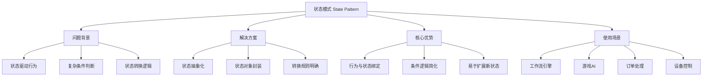
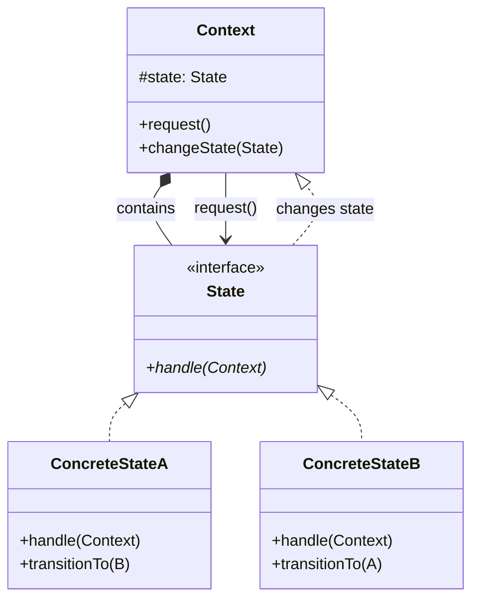

# 🌊 状态模式详解

[[05-行为型模式/05-命令模式]] ← [[05-行为型模式/07-责任链模式]]
## 🎯 状态模式概览

### 📊 模式基本信息



### 🎯 **定义与意图**
状态模式允许一个对象在其内部状态改变时改变它的行为。对象看起来就好像改了它的类一样。

### 📋 **核心价值**
- **状态驱动**: 对象的行为由当前状态决定
- **消除条件分支**: 将复杂的状态判断逻辑分散到各个状态类中
- **易于扩展**: 增加新状态无需修改现有代码
- **状态转换安全**: 明确的转换规则和约束条件

## 🏗️ 状态模式结构

### 📊 **类图结构**



### 🎯 **角色职责**

#### **Context (环境类)**
- 维护一个State对象的实例
- 定义客户感兴趣的接口
- 请求State对象处理状态相关的操作

#### **State (抽象状态)**
- 定义一个接口以封装与Context的一个特定状态相关的行为
- 声明在该状态下能够执行的操作

#### **ConcreteState (具体状态)**
- 实现State接口
- 每一个ConcreteState实现一个与Context的一个状态相关的行为
- 负责状态转换逻辑

## 💻 状态模式实现

### 🎯 **经典实现：订单状态机**

```java
// ✅ 订单状态枚举
public enum OrderStatus {
    DRAFT("草稿"),
    SUBMITTED("已提交"),
    CONFIRMED("已确认"),
    PAID("已支付"),
    SHIPPED("已发货"),
    OUT_FOR_DELIVERY("配送中"),
    DELIVERED("已送达"),
    COMPLETED("已完成"),
    CANCELLED("已取消"),
    REFUNDED("已退款");
    
    private final String description;
    
    OrderStatus(String description) {
        this.description = description;
    }
    
    public String getDescription() {
        return description;
    }
}

// ✅ 抽象状态接口
public abstract class OrderState {
    
    // ✅ 核心状态处理方法
    public abstract void handle(OrderContext context);
    
    // ✅ 状态转换方法
    public void submitOrder(OrderContext context) {
        throw new IllegalStateTransitionException("无法从状态 " + getStateName() + " 执行提交订单操作");
    }
    
    public void confirmOrder(OrderContext context) {
        throw new IllegalStateTransitionException("无法从状态 " + getStateName() + " 执行确认订单操作");
    }
    
    public void payOrder(OrderContext context) {
        throw new IllegalStateTransitionException("无法从状态 " + getStateName() + " 执行支付订单操作");
    }
    
    public void shipOrder(OrderContext context) {
        throw new IllegalStateTransitionException("无法从状态 " + getStateName() + " 执行发货操作");
    }
    
    public void deliverOrder(OrderContext context) {
        throw new IllegalStateTransitionException("无法从状态 " + getStateName() + " 执行送达操作");
    }
    
    public void cancelOrder(OrderContext context) {
        throw new IllegalStateTransitionException("无法从状态 " + getStateName() + " 执行取消操作");
    }
    
    public void refundOrder(OrderContext context) {
        throw new IllegalStateTransitionException("无法从状态 " + getStateName() + " 执行退款操作");
    }
    
    // ✅ 状态转换通用方法
    protected void transitionTo(OrderContext context, OrderState newState) {
        context.changeState(newState);
    }
    
    // ✅ 获取当前状态名称
    public abstract String getStateName();
    
    // ✅ 获取状态枚举
    public abstract OrderStatus getStatus();
    
    // ✅ 状态验证
    protected boolean validateOrder(OrderContext context) {
        Order order = context.getOrder();
        
        if (order == null) {
            throw new OrderValidationException("订单不能为空");
        }
        
        if (order.getItems() == null || order.getItems().isEmpty()) {
            throw new OrderValidationException("订单必须包含商品");
        }
        
        if (order.getTotalAmount() == null || order.getTotalAmount().compareTo(BigDecimal.ZERO) <= 0) {
            throw new OrderValidationException("订单金额必须大于0");
        }
        
        return true;
    }
}

// ✅ 草稿状态
public class DraftOrderState extends OrderState {
    
    @Override
    public void handle(OrderContext context) {
        // ✅ 草稿状态的处理逻辑
        System.out.println("订单处于草稿状态，正在编辑中...");
        
        Order order = context.getOrder();
        order.setStatus(OrderStatus.DRAFT);
        order.setLastModified(Instant.now());
    }
    
    @Override
    public void submitOrder(OrderContext context) {
        validateOrder(context);
        
        Order order = context.getOrder();
        
        // ✅ 提交前的业务逻辑
        System.out.println("正在提交订单: " + order.getId());
        
        // 检查库存
        checkInventoryAvailability(context);
        
        // 验证用户地址
        validateShippingAddress(context);
        
        // ✅ 状态转换
        transitionTo(context, new SubmittedOrderState());
        
        System.out.println("订单提交成功，状态变更为: " + OrderStatus.SUBMITTED.getDescription());
    }
    
    @Override
    public String getStateName() {
        return "草稿状态";
    }
    
    @Override
    public OrderStatus getStatus() {
        return OrderStatus.DRAFT;
    }
    
    private void checkInventoryAvailability(OrderContext context) {
        // 库存检查逻辑
        Order order = context.getOrder();
        for (OrderItem item : order.getItems()) {
            int availableStock = inventoryService.getAvailableStock(item.getProductId());
            if (availableStock < item.getQuantity()) {
                throw new InsufficientInventoryException("商品库存不足: " + item.getProductId());
            }
        }
    }
    
    private void validateShippingAddress(OrderContext context) {
        // 地址验证逻辑
        Address shippingAddress = context.getOrder().getShippingAddress();
        if (shippingAddress == null) {
            throw new ValidationException("收货地址不能为空");
        }
        // 更多验证逻辑...
    }
}

// ✅ 已提交状态
public class SubmittedOrderState extends OrderState {
    
    @Override
    public void handle(OrderContext context) {
        System.out.println("订单已提交，等待商家确认...");
        
        Order order = context.getOrder();
        order.setStatus(OrderStatus.SUBMITTED);
        order.setSubmittedAt(Instant.now());
        
        // ✅ 触发后续业务流程
        notifyMerchant(context);
        startAutoConfirmTimer(context);
    }
    
    @Override
    public void confirmOrder(OrderContext context) {
        Order order = context.getOrder();
        
        System.out.println("确认订单: " + order.getId());
        
        // ✅ 商家确认逻辑
        validateMerchantConfirmation(order);
        notifyCustomer(context, "订单已确认");
        
        // ✅ 预留库存
        reserveInventory(context);
        
        // ✅ 状态转换
        transitionTo(context, new ConfirmedOrderState());
        
        System.out.println("订单确认完成，状态变更为: " + OrderStatus.CONFIRMED.getDescription());
    }
    
    @Override
    public void cancelOrder(OrderContext context) {
        System.out.println("取消已提交的订单: " + context.getOrder().getId());
        
        // ✅ 取消逻辑
        notifyCustomer(context, "订单已取消");
        releaseReservedInventory(context);
        
        // ✅ 状态转换
        transitionTo(context, new CancelledOrderState());
    }
    
    @Override
    public String getStateName() {
        return "已提交状态";
    }
    
    @Override
    public OrderStatus getStatus() {
        return OrderStatus.SUBMITTED;
    }
    
    private void notifyMerchant(OrderContext context) {
        // 通知商家有新订单
        notificationService.sendNotification(
            Notification.builder()
                .type(NotificationType.NEW_ORDER)
                .orderId(context.getOrder().getId())
                .recipient(context.getOrder().getMerchantId())
                .message("收到新订单，请及时确认")
                .build()
        );
    }
    
    private void startAutoConfirmTimer(OrderContext context) {
        // 启动自动确认定时器（例如：24小时后自动确认）
        ScheduledExecutorService executor = context.getScheduledExecutor();
        executor.schedule(() -> {
            if (context.getCurrentState() instanceof SubmittedOrderState) {
                confirmOrder(context);
            }
        }, 24, TimeUnit.HOURS);
    }
    
    private void reserveInventory(OrderContext context) {
        Order order = context.getOrder();
        orderService.reserveInventory(order.getItems());
        System.out.println("库存预留完成");
    }
}

// ✅ 已支付状态
public class PaidOrderState extends OrderState {
    
    @Override
    public void handle(OrderContext context) {
        System.out.println("订单已支付，准备发货...");
        
        Order order = context.getOrder();
        order.setStatus(OrderStatus.PAID);
        order.setPaidAt(Instant.now());
        
        // ✅ 支付后的处理
        deductInventory(context);
        notifyMerchantToShip(context);
        confirmPaymentWithThirdParty(context);
    }
    
    @Override
    public void shipOrder(OrderContext context) {
        Order order = context.getOrder();
        
        System.out.println("开始发货: " + order.getId());
        
        // ✅ 发货准备
        generateShipmentLabel(context);
        allocateLogisticsProvider(context);
        packageOrderItems(context);
        
        // ✅ 创建物流订单
        createLogisticsOrder(context);
        
        // ✅ 状态转换
        transitionTo(context, new ShippedOrderState());
        
        System.out.println("发货完成，状态变更为: " + OrderStatus.SHIPPED.getDescription());
    }
    
    @Override
    public void refundOrder(OrderContext context) {
        System.out.println("申请退款: " + context.getOrder().getId());
        
        // ✅ 退款处理
        PaymentRefundResult refundResult = processRefund(context);
        
        if (refundResult.isSuccess()) {
            refundInventory(context);
            transitionTo(context, new RefundedOrderState());
            System.out.println("退款完成");
        } else {
            throw new RefundException("退款失败: " + refundResult.getErrorMessage());
        }
    }
    
    @Override
    public String getStateName() {
        return "已支付状态";
    }
    
    @Override
    public OrderStatus getStatus() {
        return OrderStatus.PAID;
    }
    
    private void deductInventory(OrderContext context) {
        Order order = context.getOrder();
        inventoryService.deductInventory(order.getItems());
        System.out.println("已扣减库存");
    }
    
    private PaymentRefundResult processRefund(OrderContext context) {
        Order order = context.getOrder();
        return paymentService.refund(order.getPaymentTransactionId(), order.getTotalAmount());
    }
}

// ✅ 订单上下文类
public class OrderContext {
    
    private Order order;
    private OrderState currentState;
    private final ScheduledExecutorService scheduledExecutor;
    private final OrderService orderService;
    private final PaymentService paymentService;
    private final InventoryService inventoryService;
    private final NotificationService notificationService;
    
    public OrderContext(Order order,
                       OrderService orderService,
                       PaymentService paymentService,
                       InventoryService inventoryService,
                       NotificationService notificationService) {
        this.order = order;
        this.orderService = orderService;
        this.paymentService = paymentService;
        this.inventoryService = inventoryService;
        this.notificationService = notificationService;
        this.scheduledExecutor = Executors.newScheduledThreadPool(2);
        
        // ✅ 根据订单状态初始化当前状态
        initializeState();
    }
    
    // ✅ 状态转换方法
    public void changeState(OrderState newState) {
        System.out.printf("状态转换: %s -> %s%n", 
                         currentState != null ? currentState.getStateName() : "初始状态",
                         newState.getStateName());
        
        OrderState oldState = currentState;
        currentState = newState;
        
        // ✅ 触发状态变更事件
        fireStateChangedEvent(oldState, newState);
    }
    
    // ✅ 委托给当前状态处理请求
    public void handleStateTransition() {
        if (currentState == null) {
            throw new IllegalStateException("订单状态未初始化");
        }
        currentState.handle(this);
    }
    
    // ✅ 状态相关的操作方法
    public void submitOrder() {
        currentState.submitOrder(this);
    }
    
    public void confirmOrder() {
        currentState.confirmOrder(this);
    }
    
    public void payOrder() {
        currentState.payOrder(this);
    }
    
    public void shipOrder() {
        currentState.shipOrder(this);
    }
    
    public void deliverOrder() {
        currentState.deliverOrder(this);
    }
    
    public void cancelOrder() {
        currentState.cancelOrder(this);
    }
    
    public void refundOrder() {
        currentState.refundOrder(this);
    }
    
    // ✅ 获取当前状态
    public OrderState getCurrentState() {
        return currentState;
    }
    
    public Order getOrder() {
        return order;
    }
    
    // ✅ 检查状态转换权限
    public boolean canTransitionTo(OrderStatus newStatus) {
        return currentState != null && currentState.getStatus() != newStatus;
    }
    
    private void initializeState() {
        // ✅ 根据订单的当前状态初始化状态机
        switch (order.getStatus()) {
            case DRAFT:
                currentState = new DraftOrderState();
                break;
            case SUBMITTED:
                currentState = new SubmittedOrderState();
                break;
            case CONFIRMED:
                currentState = new ConfirmedOrderState();
                break;
            case PAID:
                currentState = new PaidOrderState();
                break;
            case SHIPPED:
                currentState = new ShippedOrderState();
                break;
            case DELIVERED:
                currentState = new DeliveredOrderState();
                break;
            case CANCELLED:
                currentState = new CancelledOrderState();
                break;
            default:
                currentState = new DraftOrderState();
        }
    }
    
    private void fireStateChangedEvent(OrderState oldState, OrderState newState) {
        // ✅ 发布状态变更事件
        OrderStateChangedEvent event = new OrderStateChangedEvent(
            order.getId(),
            oldState != null ? oldState.getStatus() : null,
            newState.getStatus(),
            Instant.now()
        );
        
        // 发布到Spring事件系统
        applicationEventPublisher.publishEvent(event);
        
        // 记录状态变更日志
        auditService.logStateTransition(event);
    }
    
    public ScheduledVisitorService getScheduledExecutor() {
        return scheduledExecutor;
    }
}

// ✅ 客户端使用示例
public class OrderStateMachineDemo {
    
    public static void main(String[] args) {
        
        // ✅ 创建订单
        Order order = Order.builder()
            .id("ORD-001")
            .userId(1001L)
            .items(createOrderItems())
            .totalAmount(new BigDecimal("299.99"))
            .shippingAddress(createShippingAddress())
            .status(OrderStatus.DRAFT)
            .createdAt(Instant.now())
            .build();
        
        // ✅ 创建订单上下文
        OrderContext context = new OrderContext(order,
                                             mockOrderService,
                                             mockPaymentService,
                                             mockInventoryService,
                                             mockNotificationService);
        
        System.out.println("初始状态: " + context.getCurrentState().getStateName());
        
        // ✅ 执行状态转换
        try {
            context.handleStateTransition();
            
            context.submitOrder();
            context.handleStateTransition();
            
            context.confirmOrder();
            context.handleStateTransition();
            
            context.payOrder();
            context.handleStateTransition();
            
            context.shipOrder();
            context.handleStateTransition();
            
        } catch (IllegalStateTransitionException e) {
            System.err.println("状态转换失败: " + e.getMessage());
        } catch (Exception e) {
            System.err.println("操作失败: " + e.getMessage());
        }
        
        System.out.println("最终状态: " + context.getCurrentState().getStateName());
    }
    
    private static List<OrderItem> createOrderItems() {
        return Arrays.asList(
            OrderItem.builder()
                .productId(1001L)
                .productName("iPhone 15 Pro")
                .quantity(1)
                .unitPrice(new BigDecimal("999.99"))
                .build(),
            OrderItem.builder()
                .productId(1002L)
                .productName("AirPods Pro")
                .quantity(1)
                .unitPrice(new BigDecimal("199.99"))
                .build()
        );
    }
    
    private static Address createShippingAddress() {
        return Address.builder()
            .recipient("张三")
            .phone("13800138000")
            .address("北京市朝阳区某某街道123号")
            .postalCode("100000")
            .build();
    }
}
```

### 🚀 **现代企业级状态机实现**

```java
// ✅ Spring Boot状态机配置
@Configuration
@EnableStateMachine
public class OrderStateMachineConfig extends StateMachineConfigurerAdapter<OrderStatus, OrderEvent> {
    
    @Override
    public void configure(StateMachineStateConfigurer<OrderStatus, OrderEvent> states) throws Exception {
        
        states.withStates()
            .initial(OrderStatus.DRAFT)
            .states(EnumSet.allOf(OrderStatus.class))
            .end(OrderStatus.COMPLETED)
            .end(OrderStatus.CANCELLED)
            .end(OrderStatus.REFUNDED);
    }
    
    @Override
    public void configure(StateMachineTransitionConfigurer<OrderStatus, OrderEvent> transitions) throws Exception {
        
        // ✅ 定义状态转换规则
        transitions
            .withExternal()
                .source(OrderStatus.DRAFT)
                .target(OrderStatus.SUBMITTED)
                .event(OrderEvent.SUBMIT)
                .guard(context -> validateOrderSubmission(context))
                .action(context -> handleOrderSubmission(context))
                
            .and().withExternal()
                .source(OrderStatus.SUBMITTED)
                .target(OrderStatus.CONFIRMED)
                .event(OrderEvent.CONFIRM)
                .guard(context -> validateOrderConfirmation(context))
                .action(context -> handleOrderConfirmation(context))
                
            .and().withExternal()
                .source(OrderStatus.CONFIRMED)
                .target(OrderStatus.PAID)
                .event(OrderEvent.PAY)
                .guard(context -> validatePayment(context))
                .action(context -> handlePayment(context))
                
            .and().withExternal()
                .source(OrderStatus.PAID)
                .target(OrderStatus.SHIPPED)
                .event(OrderEvent.SHIP)
                .guard(context -> validateShipping(context))
                .action(context -> handleShipping(context))
                
            .and().withExternal()
                .source(OrderStatus.SHIPPED)
                .target(OrderStatus.DELIVERED)
                .event(OrderEvent.DELIVER)
                .guard(context -> validateDelivery(context))
                .action(context -> handleDelivery(context))
                
            .and().withExternal()
                .source(OrderStatus.DELIVERED)
                .target(OrderStatus.COMPLETED)
                .event(OrderEvent.COMPLETE)
                .action(context -> handleCompletion(context))
                
            // ✅ 取消转换
            .and().withExternal()
                .source(OrderStatus.DRAFT)
                .target(OrderStatus.CANCELLED)
                .event(OrderEvent.CANCEL)
                .action(context -> handleCancellation(context))
                
            .and().withExternal()
                .source(OrderStatus.SUBMITTED)
                .target(OrderStatus.CANCELLED)
                .event(OrderEvent.CANCEL)
                .action(context -> handleCancellation(context))
                
            // ✅ 退款转换
            .and().withExternal()
                .source(OrderStatus.PAID)
                .target(OrderStatus.REFUNDED)
                .event(OrderEvent.REFUND)
                .guard(context -> validateRefund(context))
                .action(context -> handleRefund(context));
    }
    
    @Override
    public void configure(StateMachineConfigurationConfigurer<OrderStatus, OrderEvent> config) throws Exception {
        
        config.withConfiguration()
            .autoStartup(true)
            .listener(listener())
            .machineProperties(org.springframework.statemachine.config.common.annotation.configuration.EnableStateMachine.CompositeStateMachineConfigurer.class);
    }
    
    @Bean
    public StateMachineListener<OrderStatus, OrderEvent> listener() {
        return new StateMachineListenerAdapter<OrderStatus, OrderEvent>() {
            @Override
            public void stateChanged(State<OrderStatus, OrderEvent> from, State<OrderStatus, OrderEvent> to) {
                if (from != null && to != null) {
                    log.info("状态转换: {} -> {}", from.getId(), to.getId());
                }
            }
            
            @Override
            public void stateMachineError(StateMachine<OrderStatus, OrderEvent> stateMachine, Exception exception) {
                log.error("状态机错误: {}", exception.getMessage(), exception);
            }
            
            @Override
            public void stateMachineStopped(StateMachine<OrderStatus, OrderEvent> stateMachine) {
                log.info("状态机停止");
            }
        };
    }
    
    // ✅ 状态转换守卫
    private boolean validateOrderSubmission(StateContext<OrderStatus, OrderEvent> context) {
        Order order = context.getExtendedState().get("order", Order.class);
        return order != null && !order.getItems().isEmpty();
    }
    
    private boolean validateOrderConfirmation(StateContext<OrderStatus, OrderEvent> context) {
        Order order = context.getExtendedState().get("order", Order.class);
        return order != null && order.getMerchantId() != null;
    }
    
    private boolean validatePayment(StateContext<OrderStatus, OrderEvent> context) {
        Order order = context.getExtendedState().get("order", Order.class);
        PaymentInfo paymentInfo = context.getExtendedState().get("paymentInfo", PaymentInfo.class);
        return order != null && paymentInfo != null && 
               paymentInfo.getTransactionId() != null;
    }
    
    // ✅ 实际业务逻辑处理
    private void handleOrderSubmission(StateContext<OrderStatus, OrderEvent> context) {
        Order order = context.getExtendedState().get("order", Order.class);
        orderService.submitOrder(order);
        
        // 触发后续流程
        orderNotificationService.notifyMerchantForConfirmation(order);
    }
    
    private void handlePayment(StateContext<OrderStatus, OrderEvent> context) {
        Order order = context.getExtendedState().get("order", Order.class);
        PaymentInfo paymentInfo = context.getExtendedState().get("paymentInfo", PaymentInfo.class);
        
        paymentService.confirmPayment(order, paymentInfo);
        
        // 库存扣减
        inventoryService.deductInventory(order.getItems());
        
        // 触发发货流程
        shippingService.prepareForShipping(order);
    }
}

// ✅ 状态机服务
@Service
public class OrderStateMachineService {
    
    @Autowired
    private StateMachineFactory<OrderStatus, OrderEvent> stateMachineFactory;
    
    @Autowired
    private OrderRepository orderRepository;
    
    private final Map<String, StateMachine<OrderStatus, OrderEvent>> stateMachines = new ConcurrentHashMap<>();
    
    public StateMachine<OrderStatus, OrderEvent> createStateMachine(String orderId) {
        
        StateMachine<OrderStatus, OrderEvent> stateMachine = stateMachineFactory.getStateMachine(orderId);
        
        // ✅ 设置订单上下文
        Order order = orderRepository.findById(orderId)
            .orElseThrow(() -> new OrderNotFoundException("Order not found: " + orderId));
            
        MessageHeaders headers = new MessageHeaders(Collections.singletonMap("order", order));
        stateMachine.sendEvent(MessageBuilder.createMessage(OrderEvent.INIT, headers));
        
        stateMachines.put(orderId, stateMachine);
        return stateMachine;
    }
    
    public boolean triggerEvent(String orderId, OrderEvent event, Map<String, Object> headers) {
        
        StateMachine<OrderStatus, OrderEvent> stateMachine = stateMachines.get(orderId);
        
        if (stateMachine == null) {
            stateMachine = createStateMachine(orderId);
        }
        
        if (!stateMachine.sendEvent(MessageBuilder.createMessage(event, new MessageHeaders(headers)))) {
            log.warn("Failed to send event {} to {} state machine", event, orderId);
            return false;
        }
        
        return true;
    }
    
    public OrderStatus getCurrentState(String orderId) {
        StateMachine<OrderStatus, OrderEvent> stateMachine = stateMachines.get(orderId);
        
        if (stateMachine == null) {
            stateMachine = createStateMachine(orderId);
        }
        
        return stateMachine.getState().getId();
    }
    
    public boolean canTransition(String orderId, OrderEvent event) {
        StateMachine<OrderStatus, OrderEvent> stateMachine = stateMachines.get(orderId);
        
        if (stateMachine == null) {
            return false;
        }
        
        return stateMachine.getTransitions().stream()
            .anyMatch(transition -> 
                transition.getSource().getId() == stateMachine.getState().getId() &&
                transition.getTrigger().getEvent() == event);
    }
    
    // ✅ 批量状态转换
    public Map<String, Boolean> triggerEventBatch(List<String> orderIds, OrderEvent event, Map<String, Object> headers) {
        
        Map<String, Boolean> results = new ConcurrentHashMap<>();
        
        orderIds.parallelStream().forEach(orderId -> {
            try {
                boolean success = triggerEvent(orderId, event, headers);
                results.put(orderId, success);
            } catch (Exception e) {
                log.error("批量触发事件失败: {}", orderId, e);
                results.put(orderId, false);
            }
        });
        
        return results;
    }
}

// ✅ 异步状态处理
@Component
public class AsyncStateHandler {
    
    @Async
    public CompletableFuture<Void> handleOrderSubmission(Order order) {
        
        try {
            // ✅ 异步处理订单提交
            inventoryService.checkAvailabilityAsync(order.getItems())
                .thenCompose(available -> {
                    if (available) {
                        return shippingService.validateAddressAsync(order.getShippingAddress());
                    } else {
                        throw new InsufficientInventoryException("库存不足");
                    }
                })
                .thenRun(() -> {
                    // 更新订单状态
                    orderService.updateOrderStatus(order.getId(), OrderStatus.CONFIRMED);
                    
                    // 发送确认通知
                    notificationService.sendOrderConfirmation(order);
                });
            
        } catch (Exception e) {
            log.error("异步订单提交处理失败", e);
            
            // 处理失败，更新订单状态
            orderService.updateOrderStatus(order.getId(), OrderStatus.SUBMIT_FAILED);
            
            // 通知失败
            notificationService.sendOrderSubmissionFailure(order, e.getMessage());
        }
        
        return CompletableFuture.completedFuture(null);
    }
    
    @Scheduled(fixedDelay = 60000) // 每分钟执行一次
    public void processStuckedOrders() {
        
        // ✅ 找出超时未处理的订单
        List<Order> stuckOrders = orderService.findOrdersStuckInStatus(
            OrderStatus.SUBMITTED, 
            Duration.ofHours(24)
        );
        
        stuckOrders.forEach(order -> {
            log.info("发现超时订单: {}", order.getId());
            
            // 自动确认超时订单
            Map<String, Object> context = Collections.singletonMap("order", order);
            orderStateMuseumService.triggerEvent(order.getId(), OrderEvent.AUTO_CONFIRM, context);
        });
    }
    
    @EventListener
    public void handleStateTransitionEvent(OrderStateChangedEvent event) {
        
        // ✅ 状态转换后的异步处理
        switch (event.getNewStatus()) {
            case SHIPPED:
                scheduleDeliveryTracking(event.getOrderId());
                break;
            case DELIVERED:
                scheduleCompletionCheck(event.getOrderId());
                break;
            case COMPLETED:
                scheduleCustomerEvaluation(event.getOrderId());
                break;
        }
    }
    
    private void scheduleDeliveryTracking(String orderId) {
        // 安排配送跟踪
        Thread.ofVirtual().start(() -> {
            try {
                trackingService.startTracking(orderId);
            } catch (Exception e) {
                log.error("启动配送跟踪失败: {}", orderId, e);
            }
        });
    }
    
    private void scheduleCompletionCheck(String orderId) {
        // 安排完成状态检查
        ScheduledExecutorService scheduler = Executors.newScheduledThreadPool(1);
        scheduler.schedule(() -> {
            try {
                orderStateMachineService.triggerEvent(orderId, OrderEvent.COMPLETE, Collections.emptyMap());
            } catch (Exception e) {
                log.error("订单完成检查失败: {}", orderId, e);
            }
        }, 1, TimeUnit.HOURS);
    }
}
```

## 🚀 状态模式最佳实践

### 📋 **使用指南**

1. **状态设计原则**:
   - 每个状态应该有明确的职责和行为
   - 状态之间的转换应该明确和受限
   - 避免状态爆炸，考虑状态的抽象层次

2. **性能优化**:
   - 使用状态机框架(如Spring StateMachine)提升性能
   - 异步处理复杂的状态转换
   - 缓存状态机实例避免重复创建

3. **错误处理**:
   - 为每个状态转换提供守卫条件
   - 实现撤销和补偿机制
   - 记录详细的状态转换日志

### ⚠️ **注意事项**

1. **避免状态爆炸**: 不要设计过多细粒度的状态
2. **保持状态单一**: 每个状态应该有明确的业务意义
3. **状态转换安全**: 确保转换逻辑的线程安全性
4. **资源管理**: 及时清理不需要的状态机实例

## 📊 与其他模式的对比

| 对比维度 | 状态模式 | 策略模式 | 命令模式 |
|----------|----------|----------|----------|
| **目的** | 行为由状态决定 | 算法可以互换 | 封装请求 |
| **转换** | 状态驱动转换 | 客户端决定策略 | 状态无关 |
| **时间性** | 状态时间序列 | 立即执行 | 可以延迟 |
| **撤销** | 支持状态回退 | 不支持 | 支持撤销 |

## 🔗 学习衔接

- **上一模式** ← [[命令模式]]
- **下一模式** → [[责任链模式]]
- **模式对比** → [[05-行为型模式/13-行为型模式对比表]]
- **工作流引擎** → [[设计模式实战项目指南]]

---
**💡 状态模式精髓**: 状态模式就像一个智能的红绿灯，它会根据当前的状态来决定自己的行为。绿灯时允许通行，红灯时不准通行，黄灯时准备转换。状态变了，行为自然就变了，这就是状态模式的魅力！
