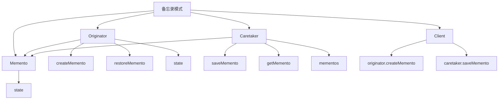

# 💾 备忘录模式

[[05-行为型模式/06-中介者模式]] ← [[05-行为型模式/08-观察者模式]]
## 🎯 备忘录模式概览

### 📊 模式结构图



## 🏗️ 模式定义与特点

### 📋 **模式定义**
备忘录模式在不破坏封装性的前提下，捕获一个对象的内部状态，并在该对象之外保存这个状态。这样以后就可以将该对象恢复到原先保存的状态。

### 📋 **核心特点**
- **状态保存**: 捕获对象的内部状态
- **状态恢复**: 将对象恢复到之前的状态
- **封装性**: 不破坏对象的封装性
- **历史管理**: 支持多个历史状态

### 📋 **适用场景**
- 需要保存和恢复对象的内部状态
- 需要支持撤销操作
- 需要保存对象的历史状态
- 需要实现快照功能

## 🏗️ 模式实现

### 📋 **基础实现**

#### **备忘录类**
```java
// ✅ 备忘录类
public class Memento {
    private String state;
    
    public Memento(String state) {
        this.state = state;
    }
    
    public String getState() {
        return state;
    }
}

// ✅ 发起者类
public class Originator {
    private String state;
    
    public void setState(String state) {
        this.state = state;
    }
    
    public String getState() {
        return state;
    }
    
    public Memento createMemento() {
        return new Memento(state);
    }
    
    public void restoreMemento(Memento memento) {
        this.state = memento.getState();
    }
}

// ✅ 管理者类
public class Caretaker {
    private List<Memento> mementos;
    
    public Caretaker() {
        this.mementos = new ArrayList<>();
    }
    
    public void saveMemento(Memento memento) {
        mementos.add(memento);
    }
    
    public Memento getMemento(int index) {
        if (index >= 0 && index < mementos.size()) {
            return mementos.get(index);
        }
        return null;
    }
    
    public Memento getLastMemento() {
        if (!mementos.isEmpty()) {
            return mementos.get(mementos.size() - 1);
        }
        return null;
    }
    
    public int getMementoCount() {
        return mementos.size();
    }
}
```

#### **使用示例**
```java
// ✅ 客户端使用
public class Client {
    public static void main(String[] args) {
        Originator originator = new Originator();
        Caretaker caretaker = new Caretaker();
        
        // 设置状态并保存
        originator.setState("State 1");
        caretaker.saveMemento(originator.createMemento());
        
        originator.setState("State 2");
        caretaker.saveMemento(originator.createMemento());
        
        originator.setState("State 3");
        caretaker.saveMemento(originator.createMemento());
        
        // 恢复状态
        originator.restoreMemento(caretaker.getMemento(0));
        System.out.println("Restored to: " + originator.getState());
        
        originator.restoreMemento(caretaker.getLastMemento());
        System.out.println("Restored to: " + originator.getState());
    }
}
```

## 🏗️ 实际应用案例

### 📋 **文本编辑器备忘录案例**

#### **文本编辑器备忘录**
```java
// ✅ 文本编辑器备忘录
public class TextEditorMemento {
    private String content;
    private int cursorPosition;
    private String selectedText;
    private long timestamp;
    
    public TextEditorMemento(String content, int cursorPosition, String selectedText) {
        this.content = content;
        this.cursorPosition = cursorPosition;
        this.selectedText = selectedText;
        this.timestamp = System.currentTimeMillis();
    }
    
    public String getContent() {
        return content;
    }
    
    public int getCursorPosition() {
        return cursorPosition;
    }
    
    public String getSelectedText() {
        return selectedText;
    }
    
    public long getTimestamp() {
        return timestamp;
    }
    
    @Override
    public String toString() {
        return "Memento{" +
                "content='" + content + '\'' +
                ", cursorPosition=" + cursorPosition +
                ", selectedText='" + selectedText + '\'' +
                ", timestamp=" + timestamp +
                '}';
    }
}

// ✅ 文本编辑器
public class TextEditor {
    private String content;
    private int cursorPosition;
    private String selectedText;
    
    public TextEditor() {
        this.content = "";
        this.cursorPosition = 0;
        this.selectedText = "";
    }
    
    public void setContent(String content) {
        this.content = content;
        this.cursorPosition = content.length();
    }
    
    public void insertText(String text) {
        StringBuilder sb = new StringBuilder(content);
        sb.insert(cursorPosition, text);
        content = sb.toString();
        cursorPosition += text.length();
    }
    
    public void deleteText(int length) {
        if (cursorPosition >= length) {
            StringBuilder sb = new StringBuilder(content);
            sb.delete(cursorPosition - length, cursorPosition);
            content = sb.toString();
            cursorPosition -= length;
        }
    }
    
    public void selectText(int start, int end) {
        if (start >= 0 && end <= content.length() && start < end) {
            selectedText = content.substring(start, end);
            cursorPosition = end;
        }
    }
    
    public void setCursorPosition(int position) {
        if (position >= 0 && position <= content.length()) {
            this.cursorPosition = position;
        }
    }
    
    public TextEditorMemento createMemento() {
        return new TextEditorMemento(content, cursorPosition, selectedText);
    }
    
    public void restoreMemento(TextEditorMemento memento) {
        this.content = memento.getContent();
        this.cursorPosition = memento.getCursorPosition();
        this.selectedText = memento.getSelectedText();
    }
    
    public String getContent() {
        return content;
    }
    
    public int getCursorPosition() {
        return cursorPosition;
    }
    
    public String getSelectedText() {
        return selectedText;
    }
    
    @Override
    public String toString() {
        return "TextEditor{" +
                "content='" + content + '\'' +
                ", cursorPosition=" + cursorPosition +
                ", selectedText='" + selectedText + '\'' +
                '}';
    }
}

// ✅ 文本编辑器历史管理器
public class TextEditorHistoryManager {
    private List<TextEditorMemento> history;
    private int currentIndex;
    private int maxHistorySize;
    
    public TextEditorHistoryManager(int maxHistorySize) {
        this.history = new ArrayList<>();
        this.currentIndex = -1;
        this.maxHistorySize = maxHistorySize;
    }
    
    public void saveState(TextEditorMemento memento) {
        // 删除当前位置之后的历史
        if (currentIndex < history.size() - 1) {
            history = history.subList(0, currentIndex + 1);
        }
        
        // 添加新状态
        history.add(memento);
        currentIndex++;
        
        // 限制历史大小
        if (history.size() > maxHistorySize) {
            history.remove(0);
            currentIndex--;
        }
    }
    
    public TextEditorMemento undo() {
        if (currentIndex > 0) {
            currentIndex--;
            return history.get(currentIndex);
        }
        return null;
    }
    
    public TextEditorMemento redo() {
        if (currentIndex < history.size() - 1) {
            currentIndex++;
            return history.get(currentIndex);
        }
        return null;
    }
    
    public boolean canUndo() {
        return currentIndex > 0;
    }
    
    public boolean canRedo() {
        return currentIndex < history.size() - 1;
    }
    
    public void printHistory() {
        System.out.println("=== Text Editor History ===");
        for (int i = 0; i < history.size(); i++) {
            String marker = (i == currentIndex) ? " -> " : "    ";
            System.out.println(marker + (i + 1) + ". " + history.get(i));
        }
    }
}
```

#### **使用示例**
```java
// ✅ 使用示例
public class TextEditorDemo {
    public static void main(String[] args) {
        TextEditor editor = new TextEditor();
        TextEditorHistoryManager historyManager = new TextEditorHistoryManager(10);
        
        // 初始状态
        editor.setContent("Hello");
        historyManager.saveState(editor.createMemento());
        
        // 编辑操作
        editor.insertText(" World");
        historyManager.saveState(editor.createMemento());
        
        editor.insertText("!");
        historyManager.saveState(editor.createMemento());
        
        editor.insertText(" How are you?");
        historyManager.saveState(editor.createMemento());
        
        System.out.println("Current state: " + editor);
        
        // 撤销操作
        System.out.println("\n=== Undo Operations ===");
        while (historyManager.canUndo()) {
            TextEditorMemento memento = historyManager.undo();
            editor.restoreMemento(memento);
            System.out.println("Undo to: " + editor);
        }
        
        // 重做操作
        System.out.println("\n=== Redo Operations ===");
        while (historyManager.canRedo()) {
            TextEditorMemento memento = historyManager.redo();
            editor.restoreMemento(memento);
            System.out.println("Redo to: " + editor);
        }
        
        System.out.println();
        
        // 打印历史
        historyManager.printHistory();
    }
}
```

### 📋 **游戏状态备忘录案例**

#### **游戏状态备忘录**
```java
// ✅ 游戏状态备忘录
public class GameStateMemento {
    private int level;
    private int score;
    private int lives;
    private String playerName;
    private Map<String, Object> gameData;
    private long timestamp;
    
    public GameStateMemento(int level, int score, int lives, String playerName, Map<String, Object> gameData) {
        this.level = level;
        this.score = score;
        this.lives = lives;
        this.playerName = playerName;
        this.gameData = new HashMap<>(gameData);
        this.timestamp = System.currentTimeMillis();
    }
    
    public int getLevel() {
        return level;
    }
    
    public int getScore() {
        return score;
    }
    
    public int getLives() {
        return lives;
    }
    
    public String getPlayerName() {
        return playerName;
    }
    
    public Map<String, Object> getGameData() {
        return new HashMap<>(gameData);
    }
    
    public long getTimestamp() {
        return timestamp;
    }
    
    @Override
    public String toString() {
        return "GameStateMemento{" +
                "level=" + level +
                ", score=" + score +
                ", lives=" + lives +
                ", playerName='" + playerName + '\'' +
                ", timestamp=" + timestamp +
                '}';
    }
}

// ✅ 游戏状态
public class GameState {
    private int level;
    private int score;
    private int lives;
    private String playerName;
    private Map<String, Object> gameData;
    
    public GameState(String playerName) {
        this.level = 1;
        this.score = 0;
        this.lives = 3;
        this.playerName = playerName;
        this.gameData = new HashMap<>();
    }
    
    public void setLevel(int level) {
        this.level = level;
    }
    
    public void addScore(int points) {
        this.score += points;
    }
    
    public void loseLife() {
        this.lives--;
    }
    
    public void gainLife() {
        this.lives++;
    }
    
    public void setGameData(String key, Object value) {
        this.gameData.put(key, value);
    }
    
    public Object getGameData(String key) {
        return this.gameData.get(key);
    }
    
    public GameStateMemento createMemento() {
        return new GameStateMemento(level, score, lives, playerName, gameData);
    }
    
    public void restoreMemento(GameStateMemento memento) {
        this.level = memento.getLevel();
        this.score = memento.getScore();
        this.lives = memento.getLives();
        this.playerName = memento.getPlayerName();
        this.gameData = memento.getGameData();
    }
    
    public int getLevel() {
        return level;
    }
    
    public int getScore() {
        return score;
    }
    
    public int getLives() {
        return lives;
    }
    
    public String getPlayerName() {
        return playerName;
    }
    
    public Map<String, Object> getGameData() {
        return gameData;
    }
    
    @Override
    public String toString() {
        return "GameState{" +
                "level=" + level +
                ", score=" + score +
                ", lives=" + lives +
                ", playerName='" + playerName + '\'' +
                ", gameData=" + gameData +
                '}';
    }
}

// ✅ 游戏状态管理器
public class GameStateManager {
    private List<GameStateMemento> saveStates;
    private int maxSaveStates;
    
    public GameStateManager(int maxSaveStates) {
        this.saveStates = new ArrayList<>();
        this.maxSaveStates = maxSaveStates;
    }
    
    public void saveGameState(GameStateMemento memento) {
        saveStates.add(memento);
        
        // 限制保存状态数量
        if (saveStates.size() > maxSaveStates) {
            saveStates.remove(0);
        }
        
        System.out.println("Game state saved: " + memento);
    }
    
    public GameStateMemento loadGameState(int index) {
        if (index >= 0 && index < saveStates.size()) {
            GameStateMemento memento = saveStates.get(index);
            System.out.println("Game state loaded: " + memento);
            return memento;
        }
        return null;
    }
    
    public GameStateMemento loadLatestGameState() {
        if (!saveStates.isEmpty()) {
            GameStateMemento memento = saveStates.get(saveStates.size() - 1);
            System.out.println("Latest game state loaded: " + memento);
            return memento;
        }
        return null;
    }
    
    public void printSaveStates() {
        System.out.println("=== Save States ===");
        for (int i = 0; i < saveStates.size(); i++) {
            System.out.println((i + 1) + ". " + saveStates.get(i));
        }
    }
    
    public int getSaveStateCount() {
        return saveStates.size();
    }
}
```

#### **使用示例**
```java
// ✅ 使用示例
public class GameStateDemo {
    public static void main(String[] args) {
        GameState gameState = new GameState("Player1");
        GameStateManager stateManager = new GameStateManager(5);
        
        // 游戏开始
        System.out.println("=== Game Start ===");
        System.out.println("Initial state: " + gameState);
        stateManager.saveGameState(gameState.createMemento());
        
        // 游戏进行
        System.out.println("\n=== Game Progress ===");
        gameState.addScore(100);
        gameState.setGameData("weapon", "sword");
        gameState.setGameData("armor", "chain mail");
        System.out.println("After progress: " + gameState);
        stateManager.saveGameState(gameState.createMemento());
        
        // 升级
        gameState.setLevel(2);
        gameState.addScore(200);
        gameState.setGameData("weapon", "magic sword");
        System.out.println("After level up: " + gameState);
        stateManager.saveGameState(gameState.createMemento());
        
        // 受伤
        gameState.loseLife();
        gameState.addScore(50);
        System.out.println("After taking damage: " + gameState);
        stateManager.saveGameState(gameState.createMemento());
        
        // 恢复生命
        gameState.gainLife();
        gameState.addScore(300);
        System.out.println("After gaining life: " + gameState);
        stateManager.saveGameState(gameState.createMemento());
        
        System.out.println();
        
        // 打印保存状态
        stateManager.printSaveStates();
        
        System.out.println();
        
        // 加载之前的游戏状态
        System.out.println("=== Loading Previous State ===");
        GameStateMemento previousState = stateManager.loadGameState(2);
        if (previousState != null) {
            gameState.restoreMemento(previousState);
            System.out.println("Restored state: " + gameState);
        }
        
        System.out.println();
        
        // 加载最新状态
        System.out.println("=== Loading Latest State ===");
        GameStateMemento latestState = stateManager.loadLatestGameState();
        if (latestState != null) {
            gameState.restoreMemento(latestState);
            System.out.println("Restored to latest: " + gameState);
        }
    }
}
```

### 📋 **数据库事务备忘录案例**

#### **数据库事务备忘录**
```java
// ✅ 数据库事务备忘录
public class DatabaseTransactionMemento {
    private Map<String, Object> tableStates;
    private List<String> executedQueries;
    private long timestamp;
    
    public DatabaseTransactionMemento(Map<String, Object> tableStates, List<String> executedQueries) {
        this.tableStates = new HashMap<>(tableStates);
        this.executedQueries = new ArrayList<>(executedQueries);
        this.timestamp = System.currentTimeMillis();
    }
    
    public Map<String, Object> getTableStates() {
        return new HashMap<>(tableStates);
    }
    
    public List<String> getExecutedQueries() {
        return new ArrayList<>(executedQueries);
    }
    
    public long getTimestamp() {
        return timestamp;
    }
    
    @Override
    public String toString() {
        return "DatabaseTransactionMemento{" +
                "tableStates=" + tableStates +
                ", executedQueries=" + executedQueries +
                ", timestamp=" + timestamp +
                '}';
    }
}

// ✅ 数据库表状态
public class TableState {
    private String tableName;
    private List<Map<String, Object>> rows;
    
    public TableState(String tableName) {
        this.tableName = tableName;
        this.rows = new ArrayList<>();
    }
    
    public void addRow(Map<String, Object> row) {
        rows.add(new HashMap<>(row));
    }
    
    public void removeRow(Map<String, Object> row) {
        rows.removeIf(r -> r.equals(row));
    }
    
    public void updateRow(Map<String, Object> oldRow, Map<String, Object> newRow) {
        for (int i = 0; i < rows.size(); i++) {
            if (rows.get(i).equals(oldRow)) {
                rows.set(i, new HashMap<>(newRow));
                break;
            }
        }
    }
    
    public List<Map<String, Object>> getRows() {
        return new ArrayList<>(rows);
    }
    
    public String getTableName() {
        return tableName;
    }
    
    @Override
    public String toString() {
        return "TableState{" +
                "tableName='" + tableName + '\'' +
                ", rows=" + rows +
                '}';
    }
}

// ✅ 数据库事务
public class DatabaseTransaction {
    private Map<String, TableState> tableStates;
    private List<String> executedQueries;
    private boolean isActive;
    
    public DatabaseTransaction() {
        this.tableStates = new HashMap<>();
        this.executedQueries = new ArrayList<>();
        this.isActive = false;
    }
    
    public void begin() {
        isActive = true;
        System.out.println("Transaction begun");
    }
    
    public void commit() {
        if (isActive) {
            isActive = false;
            System.out.println("Transaction committed");
        }
    }
    
    public void rollback() {
        if (isActive) {
            isActive = false;
            System.out.println("Transaction rolled back");
        }
    }
    
    public void executeQuery(String query) {
        if (isActive) {
            executedQueries.add(query);
            System.out.println("Executed query: " + query);
        } else {
            throw new IllegalStateException("Transaction not active");
        }
    }
    
    public void insertRow(String tableName, Map<String, Object> row) {
        if (isActive) {
            TableState tableState = tableStates.computeIfAbsent(tableName, k -> new TableState(k));
            tableState.addRow(row);
            executeQuery("INSERT INTO " + tableName + " VALUES " + row);
        } else {
            throw new IllegalStateException("Transaction not active");
        }
    }
    
    public void updateRow(String tableName, Map<String, Object> oldRow, Map<String, Object> newRow) {
        if (isActive) {
            TableState tableState = tableStates.computeIfAbsent(tableName, k -> new TableState(k));
            tableState.updateRow(oldRow, newRow);
            executeQuery("UPDATE " + tableName + " SET " + newRow + " WHERE " + oldRow);
        } else {
            throw new IllegalStateException("Transaction not active");
        }
    }
    
    public void deleteRow(String tableName, Map<String, Object> row) {
        if (isActive) {
            TableState tableState = tableStates.computeIfAbsent(tableName, k -> new TableState(k));
            tableState.removeRow(row);
            executeQuery("DELETE FROM " + tableName + " WHERE " + row);
        } else {
            throw new IllegalStateException("Transaction not active");
        }
    }
    
    public DatabaseTransactionMemento createMemento() {
        Map<String, Object> tableStatesMap = new HashMap<>();
        for (Map.Entry<String, TableState> entry : tableStates.entrySet()) {
            tableStatesMap.put(entry.getKey(), entry.getValue());
        }
        return new DatabaseTransactionMemento(tableStatesMap, executedQueries);
    }
    
    public void restoreMemento(DatabaseTransactionMemento memento) {
        this.tableStates.clear();
        this.executedQueries.clear();
        
        Map<String, Object> tableStatesMap = memento.getTableStates();
        for (Map.Entry<String, Object> entry : tableStatesMap.entrySet()) {
            this.tableStates.put(entry.getKey(), (TableState) entry.getValue());
        }
        
        this.executedQueries.addAll(memento.getExecutedQueries());
    }
    
    public boolean isActive() {
        return isActive;
    }
    
    public Map<String, TableState> getTableStates() {
        return tableStates;
    }
    
    public List<String> getExecutedQueries() {
        return executedQueries;
    }
    
    @Override
    public String toString() {
        return "DatabaseTransaction{" +
                "tableStates=" + tableStates +
                ", executedQueries=" + executedQueries +
                ", isActive=" + isActive +
                '}';
    }
}

// ✅ 数据库事务管理器
public class DatabaseTransactionManager {
    private List<DatabaseTransactionMemento> transactionHistory;
    private int maxHistorySize;
    
    public DatabaseTransactionManager(int maxHistorySize) {
        this.transactionHistory = new ArrayList<>();
        this.maxHistorySize = maxHistorySize;
    }
    
    public void saveTransactionState(DatabaseTransactionMemento memento) {
        transactionHistory.add(memento);
        
        // 限制历史大小
        if (transactionHistory.size() > maxHistorySize) {
            transactionHistory.remove(0);
        }
        
        System.out.println("Transaction state saved: " + memento);
    }
    
    public DatabaseTransactionMemento loadTransactionState(int index) {
        if (index >= 0 && index < transactionHistory.size()) {
            DatabaseTransactionMemento memento = transactionHistory.get(index);
            System.out.println("Transaction state loaded: " + memento);
            return memento;
        }
        return null;
    }
    
    public void printTransactionHistory() {
        System.out.println("=== Transaction History ===");
        for (int i = 0; i < transactionHistory.size(); i++) {
            System.out.println((i + 1) + ". " + transactionHistory.get(i));
        }
    }
}
```

#### **使用示例**
```java
// ✅ 使用示例
public class DatabaseTransactionDemo {
    public static void main(String[] args) {
        DatabaseTransaction transaction = new DatabaseTransaction();
        DatabaseTransactionManager transactionManager = new DatabaseTransactionManager(5);
        
        // 开始事务
        transaction.begin();
        
        // 执行操作
        Map<String, Object> user1 = new HashMap<>();
        user1.put("id", 1);
        user1.put("name", "John Doe");
        user1.put("email", "john@example.com");
        transaction.insertRow("users", user1);
        
        Map<String, Object> user2 = new HashMap<>();
        user2.put("id", 2);
        user2.put("name", "Jane Smith");
        user2.put("email", "jane@example.com");
        transaction.insertRow("users", user2);
        
        // 保存状态
        transactionManager.saveTransactionState(transaction.createMemento());
        
        // 继续操作
        Map<String, Object> order1 = new HashMap<>();
        order1.put("id", 1);
        order1.put("user_id", 1);
        order1.put("product", "Laptop");
        order1.put("amount", 999.99);
        transaction.insertRow("orders", order1);
        
        // 更新用户
        Map<String, Object> oldUser1 = new HashMap<>();
        oldUser1.put("id", 1);
        oldUser1.put("name", "John Doe");
        oldUser1.put("email", "john@example.com");
        
        Map<String, Object> newUser1 = new HashMap<>();
        newUser1.put("id", 1);
        newUser1.put("name", "John Smith");
        newUser1.put("email", "johnsmith@example.com");
        transaction.updateRow("users", oldUser1, newUser1);
        
        // 保存状态
        transactionManager.saveTransactionState(transaction.createMemento());
        
        // 删除订单
        transaction.deleteRow("orders", order1);
        
        // 保存状态
        transactionManager.saveTransactionState(transaction.createMemento());
        
        System.out.println();
        
        // 打印事务历史
        transactionManager.printTransactionHistory();
        
        System.out.println();
        
        // 加载之前的交易状态
        System.out.println("=== Loading Previous Transaction State ===");
        DatabaseTransactionMemento previousState = transactionManager.loadTransactionState(1);
        if (previousState != null) {
            transaction.restoreMemento(previousState);
            System.out.println("Restored transaction state: " + transaction);
        }
        
        System.out.println();
        
        // 提交事务
        transaction.commit();
    }
}
```

## 🎯 模式优势与劣势

### 📋 **优势**
- **状态保存**: 捕获对象的内部状态
- **状态恢复**: 将对象恢复到之前的状态
- **封装性**: 不破坏对象的封装性
- **历史管理**: 支持多个历史状态

### 📋 **劣势**
- **内存开销**: 需要额外的内存来保存状态
- **复杂度增加**: 增加了系统的复杂度
- **性能影响**: 保存和恢复状态可能影响性能

### 📋 **与命令模式的区别**
| 方面 | 备忘录模式 | 命令模式 |
|------|------------|----------|
| **目的** | 状态保存恢复 | 请求封装 |
| **使用场景** | 状态管理 | 撤销重做 |
| **复杂度** | 相对简单 | 相对复杂 |
| **内存使用** | 状态快照 | 命令对象 |

## 🔗 学习衔接

- **上一文档** ← [[中介者模式]]
- **下一文档** → [[观察者模式]]
- **模式基础** → [[01-基础认知]]

---
**💡 备忘录精髓**: 备忘录模式就像时光机，能够保存对象的状态，并在需要时恢复到之前的状态。当我们需要保存和恢复对象的内部状态，或者需要支持撤销操作时，备忘录模式是最佳选择！