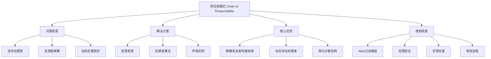
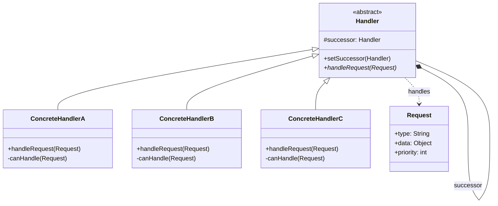

# 🔗 责任链模式详解

[[05-行为型模式/06-状态模式]] ← [[05-行为型模式/08-迭代器模式]]
## 🎯 责任链模式概览

### 📊 模式基本信息



### 🎯 **定义与意图**
责任链模式使多个对象都有机会处理请求，从而避免请求的发送者和接收者之间的耦合关系。将这些对象连成一条链，并沿着这条链传递请求，直到有一个对象处理它为止。

### 📋 **核心价值**
- **解耦设计**: 发送者和接收者之间解耦
- **动态链**: 可以动态地添加或删除处理者
- **职责分离**: 每个处理者只处理自己职责范围内的事情
- **灵活性**: 可以改变处理者的顺序或添加新的处理者

## 🏗️ 责任链模式结构

### 📊 **类图结构**



### 🎯 **角色职责**

#### **Handler (抽象处理者)**
- 定义处理请求的接口
- 实现后继者链
- 可以设置后继者

#### **ConcreteHandler (具体处理者)**
- 处理它所负责的请求
- 可访问它的后继者
- 如果可处理该请求，就处理之；否则将该请求转发给它的后继者

#### **Request (请求)**
- 封装请求信息
- 包含处理请求所需的数据

## 💻 责任链模式实现

### 🎯 **经典实现：权限验证链**

```java
// ✅ 请求对象
public class AuthRequest {
    private final String userId;
    private final String resource;
    private final String action;
    private final Map<String, Object> context;
    private boolean processed = false;
    private String processorName;
    
    public AuthRequest(String userId, String resource, String action) {
        this.userId = userId;
        this.resource = resource;
        this.action = action;
        this.context = new HashMap<>();
    }
    
    // Getters and setters
    public String getUserId() { return userId; }
    public String getResource() { return resource; }
    public String getAction() { return action; }
    public Map<String, Object> getContext() { return context; }
    public boolean isProcessed() { return processed; }
    public void setProcessed(boolean processed) { this.processed = processed; }
    public String getProcessorName() { return processorName; }
    public void setProcessorName(String processorName) { this.processorName = processorName; }
    
    public void addContext(String key, Object value) {
        context.put(key, value);
    }
    
    public Object getContext(String key) {
        return context.get(key);
    }
}

// ✅ 抽象处理者
public abstract class AuthHandler {
    protected AuthHandler nextHandler;
    
    public void setNext(AuthHandler nextHandler) {
        this.nextHandler = nextHandler;
    }
    
    public AuthHandler getNext() {
        return nextHandler;
    }
    
    // ✅ 模板方法：定义处理流程
    public final boolean handle(AuthRequest request) {
        // 1. 检查是否可以处理
        if (canHandle(request)) {
            // 2. 执行具体处理逻辑
            boolean result = doHandle(request);
            
            if (result) {
                request.setProcessed(true);
                request.setProcessorName(this.getClass().getSimpleName());
                System.out.println("请求被 " + this.getClass().getSimpleName() + " 处理");
                return true;
            }
        }
        
        // 3. 传递给下一个处理者
        if (nextHandler != null) {
            return nextHandler.handle(request);
        }
        
        // 4. 没有处理者能处理
        System.out.println("没有处理者能处理此请求");
        return false;
    }
    
    // ✅ 子类实现：判断是否能处理
    protected abstract boolean canHandle(AuthRequest request);
    
    // ✅ 子类实现：具体处理逻辑
    protected abstract boolean doHandle(AuthRequest request);
    
    // ✅ 获取处理者名称
    public abstract String getHandlerName();
}

// ✅ 具体处理者：用户存在性验证
public class UserExistenceHandler extends AuthHandler {
    
    @Autowired
    private UserService userService;
    
    @Override
    protected boolean canHandle(AuthRequest request) {
        // 所有请求都需要验证用户存在性
        return true;
    }
    
    @Override
    protected boolean doHandle(AuthRequest request) {
        String userId = request.getUserId();
        
        System.out.println("验证用户存在性: " + userId);
        
        try {
            User user = userService.findById(userId);
            if (user == null) {
                System.out.println("用户不存在: " + userId);
                return false;
            }
            
            // ✅ 将用户信息添加到请求上下文
            request.addContext("user", user);
            request.addContext("userRoles", user.getRoles());
            
            System.out.println("用户存在性验证通过: " + userId);
            return true;
            
        } catch (Exception e) {
            System.err.println("用户存在性验证失败: " + e.getMessage());
            return false;
        }
    }
    
    @Override
    public String getHandlerName() {
        return "用户存在性验证";
    }
}

// ✅ 具体处理者：角色权限验证
public class RolePermissionHandler extends AuthHandler {
    
    @Autowired
    private RoleService roleService;
    
    @Override
    protected boolean canHandle(AuthRequest request) {
        // 需要用户信息才能进行角色验证
        return request.getContext("user") != null;
    }
    
    @Override
    protected boolean doHandle(AuthRequest request) {
        User user = (User) request.getContext("user");
        String resource = request.getResource();
        String action = request.getAction();
        
        System.out.println("验证角色权限: 用户=" + user.getId() + ", 资源=" + resource + ", 操作=" + action);
        
        try {
            // ✅ 检查用户角色是否有权限
            boolean hasPermission = roleService.hasPermission(user.getRoles(), resource, action);
            
            if (!hasPermission) {
                System.out.println("角色权限不足");
                return false;
            }
            
            // ✅ 添加权限信息到上下文
            request.addContext("permissions", roleService.getPermissions(user.getRoles(), resource));
            
            System.out.println("角色权限验证通过");
            return true;
            
        } catch (Exception e) {
            System.err.println("角色权限验证失败: " + e.getMessage());
            return false;
        }
    }
    
    @Override
    public String getHandlerName() {
        return "角色权限验证";
    }
}

// ✅ 具体处理者：资源访问控制
public class ResourceAccessHandler extends AuthHandler {
    
    @Autowired
    private ResourceService resourceService;
    
    @Override
    protected boolean canHandle(AuthRequest request) {
        // 需要权限信息才能进行资源访问控制
        return request.getContext("permissions") != null;
    }
    
    @Override
    protected boolean doHandle(AuthRequest request) {
        String resource = request.getResource();
        String action = request.getAction();
        User user = (User) request.getContext("user");
        
        System.out.println("验证资源访问控制: 资源=" + resource + ", 操作=" + action);
        
        try {
            // ✅ 检查资源是否存在
            Resource resourceInfo = resourceService.findByPath(resource);
            if (resourceInfo == null) {
                System.out.println("资源不存在: " + resource);
                return false;
            }
            
            // ✅ 检查资源访问策略
            AccessPolicy policy = resourceInfo.getAccessPolicy();
            boolean allowed = policy.isAllowed(user.getId(), action);
            
            if (!allowed) {
                System.out.println("资源访问被拒绝");
                return false;
            }
            
            // ✅ 检查资源状态
            if (!resourceInfo.isActive()) {
                System.out.println("资源已停用");
                return false;
            }
            
            // ✅ 添加资源信息到上下文
            request.addContext("resource", resourceInfo);
            
            System.out.println("资源访问控制验证通过");
            return true;
            
        } catch (Exception e) {
            System.err.println("资源访问控制验证失败: " + e.getMessage());
            return false;
        }
    }
    
    @Override
    public String getHandlerName() {
        return "资源访问控制";
    }
}

// ✅ 具体处理者：审计日志记录
public class AuditLogHandler extends AuthHandler {
    
    @Autowired
    private AuditService auditService;
    
    @Override
    protected boolean canHandle(AuthRequest request) {
        // 所有请求都需要记录审计日志
        return true;
    }
    
    @Override
    protected boolean doHandle(AuthRequest request) {
        System.out.println("记录审计日志");
        
        try {
            AuditLog auditLog = AuditLog.builder()
                .userId(request.getUserId())
                .resource(request.getResource())
                .action(request.getAction())
                .timestamp(Instant.now())
                .success(request.isProcessed())
                .processorName(request.getProcessorName())
                .context(request.getContext())
                .build();
            
            auditService.log(auditLog);
            
            System.out.println("审计日志记录完成");
            return true;
            
        } catch (Exception e) {
            System.err.println("审计日志记录失败: " + e.getMessage());
            // 审计失败不应该影响主流程
            return true;
        }
    }
    
    @Override
    public String getHandlerName() {
        return "审计日志记录";
    }
}

// ✅ 责任链构建器
@Component
public class AuthChainBuilder {
    
    @Autowired
    private UserExistenceHandler userExistenceHandler;
    
    @Autowired
    private RolePermissionHandler rolePermissionHandler;
    
    @Autowired
    private ResourceAccessHandler resourceAccessHandler;
    
    @Autowired
    private AuditLogHandler auditLogHandler;
    
    // ✅ 构建标准认证链
    public AuthHandler buildStandardChain() {
        // 设置链的顺序
        userExistenceHandler.setNext(rolePermissionHandler);
        rolePermissionHandler.setNext(resourceAccessHandler);
        resourceAccessHandler.setNext(auditLogHandler);
        
        return userExistenceHandler;
    }
    
    // ✅ 构建简化认证链（跳过资源访问控制）
    public AuthHandler buildSimplifiedChain() {
        userExistenceHandler.setNext(rolePermissionHandler);
        rolePermissionHandler.setNext(auditLogHandler);
        
        return userExistenceHandler;
    }
    
    // ✅ 构建管理员认证链
    public AuthHandler buildAdminChain() {
        AdminHandler adminHandler = new AdminHandler();
        
        userExistenceHandler.setNext(adminHandler);
        adminHandler.setNext(auditLogHandler);
        
        return userExistenceHandler;
    }
    
    // ✅ 动态构建链
    public AuthHandler buildCustomChain(List<String> handlerNames) {
        AuthHandler firstHandler = null;
        AuthHandler currentHandler = null;
        
        for (String handlerName : handlerNames) {
            AuthHandler handler = createHandlerByName(handlerName);
            
            if (firstHandler == null) {
                firstHandler = handler;
                currentHandler = handler;
            } else {
                currentHandler.setNext(handler);
                currentHandler = handler;
            }
        }
        
        return firstHandler;
    }
    
    private AuthHandler createHandlerByName(String handlerName) {
        switch (handlerName.toLowerCase()) {
            case "user":
                return userExistenceHandler;
            case "role":
                return rolePermissionHandler;
            case "resource":
                return resourceAccessHandler;
            case "audit":
                return auditLogHandler;
            default:
                throw new IllegalArgumentException("未知的处理者: " + handlerName);
        }
    }
}

// ✅ 认证服务
@Service
public class AuthenticationService {
    
    @Autowired
    private AuthChainBuilder chainBuilder;
    
    // ✅ 标准认证
    public AuthResult authenticate(String userId, String resource, String action) {
        AuthRequest request = new AuthRequest(userId, resource, action);
        AuthHandler chain = chainBuilder.buildStandardChain();
        
        boolean success = chain.handle(request);
        
        return AuthResult.builder()
            .success(success)
            .userId(userId)
            .resource(resource)
            .action(action)
            .processorName(request.getProcessorName())
            .context(request.getContext())
            .timestamp(Instant.now())
            .build();
    }
    
    // ✅ 批量认证
    public List<AuthResult> authenticateBatch(List<AuthRequest> requests) {
        AuthHandler chain = chainBuilder.buildStandardChain();
        
        return requests.parallelStream()
            .map(request -> {
                boolean success = chain.handle(request);
                return AuthResult.builder()
                    .success(success)
                    .userId(request.getUserId())
                    .resource(request.getResource())
                    .action(request.getAction())
                    .processorName(request.getProcessorName())
                    .context(request.getContext())
                    .timestamp(Instant.now())
                    .build();
            })
            .collect(Collectors.toList());
    }
    
    // ✅ 异步认证
    @Async
    public CompletableFuture<AuthResult> authenticateAsync(String userId, String resource, String action) {
        return CompletableFuture.supplyAsync(() -> authenticate(userId, resource, action));
    }
}

// ✅ 客户端使用示例
@RestController
@RequestMapping("/api/auth")
public class AuthController {
    
    @Autowired
    private AuthenticationService authService;
    
    @PostMapping("/check")
    public ResponseEntity<AuthResult> checkPermission(@RequestBody AuthCheckRequest request) {
        
        AuthResult result = authService.authenticate(
            request.getUserId(),
            request.getResource(),
            request.getAction()
        );
        
        if (result.isSuccess()) {
            return ResponseEntity.ok(result);
        } else {
            return ResponseEntity.status(HttpStatus.FORBIDDEN).body(result);
        }
    }
    
    @PostMapping("/batch")
    public ResponseEntity<List<AuthResult>> checkPermissionsBatch(@RequestBody List<AuthCheckRequest> requests) {
        
        List<AuthRequest> authRequests = requests.stream()
            .map(req -> new AuthRequest(req.getUserId(), req.getResource(), req.getAction()))
            .collect(Collectors.toList());
        
        List<AuthResult> results = authService.authenticateBatch(authRequests);
        
        return ResponseEntity.ok(results);
    }
}
```

### 🚀 **现代企业级实现：Web过滤器链**

```java
// ✅ Spring Boot过滤器链实现
@Component
@Order(1)
public class AuthenticationFilter implements Filter {
    
    private static final Logger logger = LoggerFactory.getLogger(AuthenticationFilter.class);
    
    @Autowired
    private JwtTokenProvider tokenProvider;
    
    @Override
    public void doFilter(ServletRequest request, ServletResponse response, FilterChain chain)
            throws IOException, ServletException {
        
        HttpServletRequest httpRequest = (HttpServletRequest) request;
        HttpServletResponse httpResponse = (HttpServletResponse) response;
        
        try {
            // ✅ 提取JWT Token
            String token = extractToken(httpRequest);
            
            if (token == null) {
                logger.warn("请求缺少认证Token: {}", httpRequest.getRequestURI());
                sendUnauthorizedResponse(httpResponse, "缺少认证Token");
                return;
            }
            
            // ✅ 验证Token
            if (!tokenProvider.validateToken(token)) {
                logger.warn("Token验证失败: {}", httpRequest.getRequestURI());
                sendUnauthorizedResponse(httpResponse, "Token无效或已过期");
                return;
            }
            
            // ✅ 设置用户上下文
            String userId = tokenProvider.getUserIdFromToken(token);
            SecurityContextHolder.getContext().setAuthentication(
                new UsernamePasswordAuthenticationToken(userId, null, Collections.emptyList())
            );
            
            logger.info("用户认证成功: {}", userId);
            
            // ✅ 传递给下一个过滤器
            chain.doFilter(request, response);
            
        } catch (Exception e) {
            logger.error("认证过滤器处理失败", e);
            sendUnauthorizedResponse(httpResponse, "认证失败");
        }
    }
    
    private String extractToken(HttpServletRequest request) {
        String bearerToken = request.getHeader("Authorization");
        if (bearerToken != null && bearerToken.startsWith("Bearer ")) {
            return bearerToken.substring(7);
        }
        return null;
    }
    
    private void sendUnauthorizedResponse(HttpServletResponse response, String message) throws IOException {
        response.setStatus(HttpServletResponse.SC_UNAUTHORIZED);
        response.setContentType("application/json");
        
        String jsonResponse = String.format(
            "{\"error\":\"Unauthorized\",\"message\":\"%s\",\"timestamp\":\"%s\"}",
            message, Instant.now().toString()
        );
        
        response.getWriter().write(jsonResponse);
    }
}

@Component
@Order(2)
public class AuthorizationFilter implements Filter {
    
    private static final Logger logger = LoggerFactory.getLogger(AuthorizationFilter.class);
    
    @Autowired
    private PermissionService permissionService;
    
    @Override
    public void doFilter(ServletRequest request, ServletResponse response, FilterChain chain)
            throws IOException, ServletException {
        
        HttpServletRequest httpRequest = (HttpServletRequest) request;
        HttpServletResponse httpResponse = (HttpServletResponse) response;
        
        try {
            // ✅ 获取当前用户
            Authentication auth = SecurityContextHolder.getContext().getAuthentication();
            if (auth == null || !auth.isAuthenticated()) {
                sendForbiddenResponse(httpResponse, "用户未认证");
                return;
            }
            
            String userId = auth.getName();
            String resource = httpRequest.getRequestURI();
            String action = httpRequest.getMethod();
            
            // ✅ 检查权限
            boolean hasPermission = permissionService.hasPermission(userId, resource, action);
            
            if (!hasPermission) {
                logger.warn("用户权限不足: userId={}, resource={}, action={}", userId, resource, action);
                sendForbiddenResponse(httpResponse, "权限不足");
                return;
            }
            
            logger.info("权限验证通过: userId={}, resource={}, action={}", userId, resource, action);
            
            // ✅ 传递给下一个过滤器
            chain.doFilter(request, response);
            
        } catch (Exception e) {
            logger.error("权限过滤器处理失败", e);
            sendForbiddenResponse(httpResponse, "权限验证失败");
        }
    }
    
    private void sendForbiddenResponse(HttpServletResponse response, String message) throws IOException {
        response.setStatus(HttpServletResponse.SC_FORBIDDEN);
        response.setContentType("application/json");
        
        String jsonResponse = String.format(
            "{\"error\":\"Forbidden\",\"message\":\"%s\",\"timestamp\":\"%s\"}",
            message, Instant.now().toString()
        );
        
        response.getWriter().write(jsonResponse);
    }
}

@Component
@Order(3)
public class RateLimitFilter implements Filter {
    
    private static final Logger logger = LoggerFactory.getLogger(RateLimitFilter.class);
    
    @Autowired
    private RedisTemplate<String, String> redisTemplate;
    
    private final Map<String, RateLimiter> rateLimiters = new ConcurrentHashMap<>();
    
    @Override
    public void doFilter(ServletRequest request, ServletResponse response, FilterChain chain)
            throws IOException, ServletException {
        
        HttpServletRequest httpRequest = (HttpServletRequest) request;
        HttpServletResponse httpResponse = (HttpServletResponse) response;
        
        try {
            // ✅ 获取客户端标识
            String clientId = getClientIdentifier(httpRequest);
            String endpoint = httpRequest.getRequestURI();
            
            // ✅ 检查限流
            if (!isAllowed(clientId, endpoint)) {
                logger.warn("请求被限流: clientId={}, endpoint={}", clientId, endpoint);
                sendTooManyRequestsResponse(httpResponse);
                return;
            }
            
            logger.debug("限流检查通过: clientId={}, endpoint={}", clientId, endpoint);
            
            // ✅ 传递给下一个过滤器
            chain.doFilter(request, response);
            
        } catch (Exception e) {
            logger.error("限流过滤器处理失败", e);
            // 限流失败不应该阻止请求
            chain.doFilter(request, response);
        }
    }
    
    private String getClientIdentifier(HttpServletRequest request) {
        // 优先使用用户ID，其次使用IP地址
        Authentication auth = SecurityContextHolder.getContext().getAuthentication();
        if (auth != null && auth.isAuthenticated()) {
            return auth.getName();
        }
        return request.getRemoteAddr();
    }
    
    private boolean isAllowed(String clientId, String endpoint) {
        String key = "rate_limit:" + clientId + ":" + endpoint;
        
        try {
            // ✅ 使用滑动窗口算法
            long currentTime = System.currentTimeMillis();
            long windowSize = 60000; // 1分钟窗口
            int maxRequests = 100; // 最大请求数
            
            // 清理过期记录
            redisTemplate.opsForZSet().removeRangeByScore(key, 0, currentTime - windowSize);
            
            // 检查当前请求数
            Long requestCount = redisTemplate.opsForZSet().count(key, currentTime - windowSize, currentTime);
            
            if (requestCount != null && requestCount >= maxRequests) {
                return false;
            }
            
            // 记录当前请求
            redisTemplate.opsForZSet().add(key, UUID.randomUUID().toString(), currentTime);
            redisTemplate.expire(key, Duration.ofMinutes(2));
            
            return true;
            
        } catch (Exception e) {
            logger.error("限流检查失败", e);
            return true; // 限流失败时允许请求通过
        }
    }
    
    private void sendTooManyRequestsResponse(HttpServletResponse response) throws IOException {
        response.setStatus(HttpServletResponse.SC_TOO_MANY_REQUESTS);
        response.setContentType("application/json");
        
        String jsonResponse = String.format(
            "{\"error\":\"Too Many Requests\",\"message\":\"请求过于频繁，请稍后再试\",\"timestamp\":\"%s\"}",
            Instant.now().toString()
        );
        
        response.getWriter().write(jsonResponse);
    }
}

@Component
@Order(4)
public class LoggingFilter implements Filter {
    
    private static final Logger logger = LoggerFactory.getLogger(LoggingFilter.class);
    
    @Override
    public void doFilter(ServletRequest request, ServletResponse response, FilterChain chain)
            throws IOException, ServletException {
        
        HttpServletRequest httpRequest = (HttpServletRequest) request;
        HttpServletResponse httpResponse = (HttpServletResponse) response;
        
        long startTime = System.currentTimeMillis();
        
        try {
            // ✅ 记录请求开始
            logger.info("请求开始: {} {} from {}", 
                       httpRequest.getMethod(), 
                       httpRequest.getRequestURI(),
                       httpRequest.getRemoteAddr());
            
            // ✅ 传递给下一个过滤器
            chain.doFilter(request, response);
            
        } finally {
            // ✅ 记录请求结束
            long duration = System.currentTimeMillis() - startTime;
            
            logger.info("请求完成: {} {} status={} duration={}ms", 
                       httpRequest.getMethod(),
                       httpRequest.getRequestURI(),
                       httpResponse.getStatus(),
                       duration);
            
            // ✅ 记录慢请求
            if (duration > 5000) {
                logger.warn("慢请求检测: {} {} duration={}ms", 
                           httpRequest.getMethod(),
                           httpRequest.getRequestURI(),
                           duration);
            }
        }
    }
}

// ✅ 过滤器链配置
@Configuration
public class FilterChainConfig {
    
    @Bean
    public FilterRegistrationBean<AuthenticationFilter> authenticationFilter() {
        FilterRegistrationBean<AuthenticationFilter> registration = new FilterRegistrationBean<>();
        registration.setFilter(new AuthenticationFilter());
        registration.addUrlPatterns("/api/*");
        registration.setOrder(1);
        return registration;
    }
    
    @Bean
    public FilterRegistrationBean<AuthorizationFilter> authorizationFilter() {
        FilterRegistrationBean<AuthorizationFilter> registration = new FilterRegistrationBean<>();
        registration.setFilter(new AuthorizationFilter());
        registration.addUrlPatterns("/api/*");
        registration.setOrder(2);
        return registration;
    }
    
    @Bean
    public FilterRegistrationBean<RateLimitFilter> rateLimitFilter() {
        FilterRegistrationBean<RateLimitFilter> registration = new FilterRegistrationBean<>();
        registration.setFilter(new RateLimitFilter());
        registration.addUrlPatterns("/api/*");
        registration.setOrder(3);
        return registration;
    }
    
    @Bean
    public FilterRegistrationBean<LoggingFilter> loggingFilter() {
        FilterRegistrationBean<LoggingFilter> registration = new FilterRegistrationBean<>();
        registration.setFilter(new LoggingFilter());
        registration.addUrlPatterns("/api/*");
        registration.setOrder(4);
        return registration;
    }
}
```

## 🔧 责任链模式高级技巧

### 🎯 **动态链构建和管理**

```java
// ✅ 动态责任链管理器
@Component
public class DynamicChainManager {
    
    private final Map<String, HandlerChain> chains = new ConcurrentHashMap<>();
    private final Map<String, HandlerDefinition> handlerDefinitions = new ConcurrentHashMap<>();
    
    // ✅ 注册处理者定义
    public void registerHandler(String name, Class<? extends Handler> handlerClass, Map<String, Object> config) {
        HandlerDefinition definition = HandlerDefinition.builder()
            .name(name)
            .handlerClass(handlerClass)
            .config(config)
            .build();
        
        handlerDefinitions.put(name, definition);
    }
    
    // ✅ 创建动态链
    public HandlerChain createChain(String chainName, List<String> handlerNames) {
        
        HandlerChain chain = new HandlerChain();
        
        Handler previousHandler = null;
        Handler firstHandler = null;
        
        for (String handlerName : handlerNames) {
            HandlerDefinition definition = handlerDefinitions.get(handlerName);
            if (definition == null) {
                throw new IllegalArgumentException("未找到处理者定义: " + handlerName);
            }
            
            Handler handler = createHandler(definition);
            
            if (firstHandler == null) {
                firstHandler = handler;
            }
            
            if (previousHandler != null) {
                previousHandler.setNext(handler);
            }
            
            previousHandler = handler;
        }
        
        chain.setFirstHandler(firstHandler);
        chain.setHandlerNames(handlerNames);
        chains.put(chainName, chain);
        
        return chain;
    }
    
    // ✅ 更新链配置
    public void updateChain(String chainName, List<String> newHandlerNames) {
        HandlerChain oldChain = chains.get(chainName);
        if (oldChain != null) {
            // 停止旧链
            oldChain.stop();
        }
        
        // 创建新链
        HandlerChain newChain = createChain(chainName, newHandlerNames);
        
        // 替换旧链
        chains.put(chainName, newChain);
        
        log.info("链 {} 已更新", chainName);
    }
    
    // ✅ 热插拔处理者
    public void hotSwapHandler(String chainName, String oldHandlerName, String newHandlerName) {
        
        HandlerChain chain = chains.get(chainName);
        if (chain == null) {
            throw new IllegalArgumentException("链不存在: " + chainName);
        }
        
        // 找到要替换的处理者
        Handler currentHandler = chain.getFirstHandler();
        Handler previousHandler = null;
        
        while (currentHandler != null) {
            if (currentHandler.getName().equals(oldHandlerName)) {
                // 创建新的处理者
                HandlerDefinition definition = handlerDefinitions.get(newHandlerName);
                Handler newHandler = createHandler(definition);
                
                // 替换处理者
                if (previousHandler != null) {
                    previousHandler.setNext(newHandler);
                } else {
                    chain.setFirstHandler(newHandler);
                }
                
                newHandler.setNext(currentHandler.getNext());
                
                log.info("处理者 {} 已替换为 {}", oldHandlerName, newHandlerName);
                break;
            }
            
            previousHandler = currentHandler;
            currentHandler = currentHandler.getNext();
        }
    }
    
    private Handler createHandler(HandlerDefinition definition) {
        try {
            Handler handler = definition.getHandlerClass().getDeclaredConstructor().newInstance();
            handler.setName(definition.getName());
            handler.configure(definition.getConfig());
            return handler;
        } catch (Exception e) {
            throw new RuntimeException("创建处理者失败: " + definition.getName(), e);
        }
    }
}

// ✅ 处理者链
public class HandlerChain {
    private Handler firstHandler;
    private List<String> handlerNames;
    private volatile boolean running = true;
    
    public boolean process(Request request) {
        if (!running || firstHandler == null) {
            return false;
        }
        
        return firstHandler.handle(request);
    }
    
    public void stop() {
        running = false;
        
        Handler current = firstHandler;
        while (current != null) {
            if (current instanceof StoppableHandler) {
                ((StoppableHandler) current).stop();
            }
            current = current.getNext();
        }
    }
    
    public void start() {
        running = true;
    }
    
    // Getters and setters
    public Handler getFirstHandler() { return firstHandler; }
    public void setFirstHandler(Handler firstHandler) { this.firstHandler = firstHandler; }
    public List<String> getHandlerNames() { return handlerNames; }
    public void setHandlerNames(List<String> handlerNames) { this.handlerNames = handlerNames; }
}

// ✅ 可停止的处理者接口
public interface StoppableHandler {
    void stop();
}

// ✅ 配置驱动的处理者
public abstract class ConfigurableHandler implements Handler {
    protected Map<String, Object> config = new HashMap<>();
    
    public void configure(Map<String, Object> config) {
        this.config.putAll(config);
        onConfigure();
    }
    
    protected abstract void onConfigure();
    
    protected <T> T getConfig(String key, Class<T> type) {
        Object value = config.get(key);
        if (value != null && type.isAssignableFrom(value.getClass())) {
            return type.cast(value);
        }
        return null;
    }
    
    protected <T> T getConfig(String key, Class<T> type, T defaultValue) {
        T value = getConfig(key, type);
        return value != null ? value : defaultValue;
    }
}
```

## 🚀 责任链模式最佳实践

### 📋 **使用指南**

1. **链的设计原则**:
   - 每个处理者应该有明确的职责
   - 处理者之间应该松耦合
   - 链的顺序应该符合业务逻辑

2. **性能优化**:
   - 使用短路评估避免不必要的处理
   - 缓存处理者实例避免重复创建
   - 异步处理长时间运行的操作

3. **错误处理**:
   - 提供统一的异常处理机制
   - 记录详细的处理日志
   - 支持处理失败的回滚机制

### ⚠️ **注意事项**

1. **链的长度**: 避免过长的处理链影响性能
2. **循环依赖**: 确保链中不存在循环引用
3. **资源管理**: 及时释放处理者占用的资源
4. **线程安全**: 确保链在多线程环境下的安全性

## 📊 与其他模式的对比

| 对比维度 | 责任链模式 | 装饰器模式 | 命令模式 |
|----------|------------|------------|----------|
| **目的** | 请求传递 | 功能增强 | 请求封装 |
| **处理方式** | 链式传递 | 包装增强 | 对象封装 |
| **顺序** | 固定顺序 | 任意顺序 | 无关顺序 |
| **终止条件** | 有处理者处理 | 所有装饰器执行 | 命令执行完成 |

## 🔗 学习衔接

- **上一模式** ← [[状态模式]]
- **下一模式** → [[迭代器模式]]
- **模式对比** → [[05-行为型模式/13-行为型模式对比表]]
- **Web应用** → [[设计模式最佳实践秘典]]

---
**💡 责任链模式精髓**: 责任链就像一个接力赛，每个选手负责自己的一段路程，如果自己能处理就处理，处理不了就传给下一个选手。这样既保证了职责的清晰，又实现了灵活的扩展！
