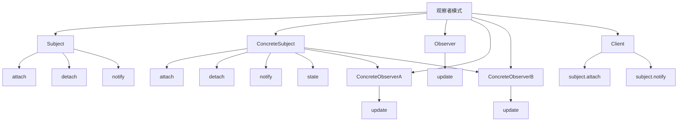

# 👀 观察者模式

[[05-行为型模式/07-备忘录模式]] ← [[05-行为型模式/09-状态模式]]
## 🎯 观察者模式概览

### 📊 模式结构图



## 🏗️ 模式定义与特点

### 📋 **模式定义**
观察者模式定义对象间的一种一对多的依赖关系，当一个对象的状态发生改变时，所有依赖于它的对象都得到通知并被自动更新。

### 📋 **核心特点**
- **一对多**: 一个主题对应多个观察者
- **自动通知**: 状态改变时自动通知观察者
- **松耦合**: 主题和观察者之间松耦合
- **动态订阅**: 可以动态添加和删除观察者

### 📋 **适用场景**
- 需要通知多个对象状态变化
- 需要解耦主题和观察者
- 需要动态添加和删除观察者
- 需要实现事件驱动系统

## 🏗️ 模式实现

### 📋 **基础实现**

#### **观察者接口**
```java
// ✅ 观察者接口
public interface Observer {
    void update(String message);
}

// ✅ 主题接口
public interface Subject {
    void attach(Observer observer);
    void detach(Observer observer);
    void notifyObservers();
}

// ✅ 具体主题
public class ConcreteSubject implements Subject {
    private List<Observer> observers;
    private String state;
    
    public ConcreteSubject() {
        this.observers = new ArrayList<>();
    }
    
    @Override
    public void attach(Observer observer) {
        observers.add(observer);
    }
    
    @Override
    public void detach(Observer observer) {
        observers.remove(observer);
    }
    
    @Override
    public void notifyObservers() {
        for (Observer observer : observers) {
            observer.update(state);
        }
    }
    
    public void setState(String state) {
        this.state = state;
        notifyObservers();
    }
    
    public String getState() {
        return state;
    }
}

// ✅ 具体观察者A
public class ConcreteObserverA implements Observer {
    @Override
    public void update(String message) {
        System.out.println("ObserverA received: " + message);
    }
}

// ✅ 具体观察者B
public class ConcreteObserverB implements Observer {
    @Override
    public void update(String message) {
        System.out.println("ObserverB received: " + message);
    }
}
```

#### **使用示例**
```java
// ✅ 客户端使用
public class Client {
    public static void main(String[] args) {
        ConcreteSubject subject = new ConcreteSubject();
        ConcreteObserverA observerA = new ConcreteObserverA();
        ConcreteObserverB observerB = new ConcreteObserverB();
        
        subject.attach(observerA);
        subject.attach(observerB);
        
        subject.setState("Hello World");
        
        subject.detach(observerA);
        subject.setState("Goodbye");
    }
}
```

## 🏗️ 实际应用案例

### 📋 **新闻发布订阅案例**

#### **新闻发布订阅**
```java
// ✅ 新闻观察者接口
public interface NewsObserver {
    void updateNews(News news);
}

// ✅ 新闻类
public class News {
    private String title;
    private String content;
    private String category;
    private long timestamp;
    
    public News(String title, String content, String category) {
        this.title = title;
        this.content = content;
        this.category = category;
        this.timestamp = System.currentTimeMillis();
    }
    
    public String getTitle() {
        return title;
    }
    
    public String getContent() {
        return content;
    }
    
    public String getCategory() {
        return category;
    }
    
    public long getTimestamp() {
        return timestamp;
    }
    
    @Override
    public String toString() {
        return "News{" +
                "title='" + title + '\'' +
                ", content='" + content + '\'' +
                ", category='" + category + '\'' +
                ", timestamp=" + timestamp +
                '}';
    }
}

// ✅ 新闻发布者接口
public interface NewsPublisher {
    void subscribe(NewsObserver observer);
    void unsubscribe(NewsObserver observer);
    void publishNews(News news);
}

// ✅ 新闻发布者实现
public class NewsPublisherImpl implements NewsPublisher {
    private List<NewsObserver> observers;
    private String publisherName;
    
    public NewsPublisherImpl(String publisherName) {
        this.publisherName = publisherName;
        this.observers = new ArrayList<>();
    }
    
    @Override
    public void subscribe(NewsObserver observer) {
        observers.add(observer);
        System.out.println("Observer subscribed to " + publisherName);
    }
    
    @Override
    public void unsubscribe(NewsObserver observer) {
        observers.remove(observer);
        System.out.println("Observer unsubscribed from " + publisherName);
    }
    
    @Override
    public void publishNews(News news) {
        System.out.println(publisherName + " publishes: " + news.getTitle());
        for (NewsObserver observer : observers) {
            observer.updateNews(news);
        }
    }
    
    public String getPublisherName() {
        return publisherName;
    }
    
    public int getSubscriberCount() {
        return observers.size();
    }
}

// ✅ 新闻订阅者实现
public class NewsSubscriber implements NewsObserver {
    private String subscriberName;
    private List<News> receivedNews;
    private Set<String> subscribedCategories;
    
    public NewsSubscriber(String subscriberName) {
        this.subscriberName = subscriberName;
        this.receivedNews = new ArrayList<>();
        this.subscribedCategories = new HashSet<>();
    }
    
    @Override
    public void updateNews(News news) {
        if (subscribedCategories.isEmpty() || subscribedCategories.contains(news.getCategory())) {
            receivedNews.add(news);
            System.out.println(subscriberName + " received news: " + news.getTitle());
        }
    }
    
    public void subscribeToCategory(String category) {
        subscribedCategories.add(category);
        System.out.println(subscriberName + " subscribed to category: " + category);
    }
    
    public void unsubscribeFromCategory(String category) {
        subscribedCategories.remove(category);
        System.out.println(subscriberName + " unsubscribed from category: " + category);
    }
    
    public void printReceivedNews() {
        System.out.println("=== " + subscriberName + "'s Received News ===");
        for (News news : receivedNews) {
            System.out.println("- " + news.getTitle() + " (" + news.getCategory() + ")");
        }
    }
    
    public String getSubscriberName() {
        return subscriberName;
    }
    
    public List<News> getReceivedNews() {
        return receivedNews;
    }
}
```

#### **使用示例**
```java
// ✅ 使用示例
public class NewsPublisherDemo {
    public static void main(String[] args) {
        // 创建新闻发布者
        NewsPublisher techPublisher = new NewsPublisherImpl("Tech News");
        NewsPublisher sportsPublisher = new NewsPublisherImpl("Sports News");
        
        // 创建订阅者
        NewsSubscriber subscriber1 = new NewsSubscriber("Alice");
        NewsSubscriber subscriber2 = new NewsSubscriber("Bob");
        NewsSubscriber subscriber3 = new NewsSubscriber("Charlie");
        
        // 订阅新闻
        techPublisher.subscribe(subscriber1);
        techPublisher.subscribe(subscriber2);
        sportsPublisher.subscribe(subscriber2);
        sportsPublisher.subscribe(subscriber3);
        
        // 设置订阅类别
        subscriber1.subscribeToCategory("Technology");
        subscriber2.subscribeToCategory("Technology");
        subscriber2.subscribeToCategory("Sports");
        subscriber3.subscribeToCategory("Sports");
        
        System.out.println();
        
        // 发布新闻
        News techNews1 = new News("New AI Breakthrough", "Scientists develop new AI algorithm", "Technology");
        techPublisher.publishNews(techNews1);
        
        News sportsNews1 = new News("World Cup Final", "Team A wins World Cup", "Sports");
        sportsPublisher.publishNews(sportsNews1);
        
        News techNews2 = new News("Quantum Computing", "New quantum computer announced", "Technology");
        techPublisher.publishNews(techNews2);
        
        News sportsNews2 = new News("Olympics Update", "New world record set", "Sports");
        sportsPublisher.publishNews(sportsNews2);
        
        System.out.println();
        
        // 打印订阅者收到的新闻
        subscriber1.printReceivedNews();
        subscriber2.printReceivedNews();
        subscriber3.printReceivedNews();
        
        System.out.println();
        
        // 取消订阅
        techPublisher.unsubscribe(subscriber1);
        sportsPublisher.unsubscribe(subscriber3);
        
        // 发布更多新闻
        News techNews3 = new News("Space Exploration", "New Mars mission launched", "Technology");
        techPublisher.publishNews(techNews3);
        
        News sportsNews3 = new News("Tennis Championship", "New champion crowned", "Sports");
        sportsPublisher.publishNews(sportsNews3);
    }
}
```

### 📋 **股票价格观察者案例**

#### **股票价格观察者**
```java
// ✅ 股票价格观察者接口
public interface StockPriceObserver {
    void updatePrice(String symbol, double price, double change);
}

// ✅ 股票价格类
public class StockPrice {
    private String symbol;
    private double price;
    private double change;
    private long timestamp;
    
    public StockPrice(String symbol, double price, double change) {
        this.symbol = symbol;
        this.price = price;
        this.change = change;
        this.timestamp = System.currentTimeMillis();
    }
    
    public String getSymbol() {
        return symbol;
    }
    
    public double getPrice() {
        return price;
    }
    
    public double getChange() {
        return change;
    }
    
    public long getTimestamp() {
        return timestamp;
    }
    
    @Override
    public String toString() {
        return "StockPrice{" +
                "symbol='" + symbol + '\'' +
                ", price=" + price +
                ", change=" + change +
                ", timestamp=" + timestamp +
                '}';
    }
}

// ✅ 股票价格发布者接口
public interface StockPricePublisher {
    void subscribe(StockPriceObserver observer);
    void unsubscribe(StockPriceObserver observer);
    void updatePrice(String symbol, double price, double change);
}

// ✅ 股票价格发布者实现
public class StockPricePublisherImpl implements StockPricePublisher {
    private List<StockPriceObserver> observers;
    private Map<String, StockPrice> stockPrices;
    
    public StockPricePublisherImpl() {
        this.observers = new ArrayList<>();
        this.stockPrices = new HashMap<>();
    }
    
    @Override
    public void subscribe(StockPriceObserver observer) {
        observers.add(observer);
        System.out.println("Observer subscribed to stock price updates");
    }
    
    @Override
    public void unsubscribe(StockPriceObserver observer) {
        observers.remove(observer);
        System.out.println("Observer unsubscribed from stock price updates");
    }
    
    @Override
    public void updatePrice(String symbol, double price, double change) {
        StockPrice stockPrice = new StockPrice(symbol, price, change);
        stockPrices.put(symbol, stockPrice);
        
        System.out.println("Stock price updated: " + symbol + " = $" + price + " (" + change + ")");
        
        for (StockPriceObserver observer : observers) {
            observer.updatePrice(symbol, price, change);
        }
    }
    
    public StockPrice getStockPrice(String symbol) {
        return stockPrices.get(symbol);
    }
    
    public Map<String, StockPrice> getAllStockPrices() {
        return new HashMap<>(stockPrices);
    }
}

// ✅ 股票价格观察者实现
public class StockPriceObserverImpl implements StockPriceObserver {
    private String observerName;
    private Map<String, Double> portfolio;
    private List<StockPrice> priceHistory;
    
    public StockPriceObserverImpl(String observerName) {
        this.observerName = observerName;
        this.portfolio = new HashMap<>();
        this.priceHistory = new ArrayList<>();
    }
    
    @Override
    public void updatePrice(String symbol, double price, double change) {
        priceHistory.add(new StockPrice(symbol, price, change));
        
        if (portfolio.containsKey(symbol)) {
            double shares = portfolio.get(symbol);
            double value = shares * price;
            System.out.println(observerName + " - " + symbol + ": " + shares + " shares = $" + value + 
                             " (change: " + change + ")");
        } else {
            System.out.println(observerName + " - " + symbol + ": $" + price + " (change: " + change + ")");
        }
    }
    
    public void addToPortfolio(String symbol, double shares) {
        portfolio.put(symbol, shares);
        System.out.println(observerName + " added " + shares + " shares of " + symbol + " to portfolio");
    }
    
    public void removeFromPortfolio(String symbol) {
        portfolio.remove(symbol);
        System.out.println(observerName + " removed " + symbol + " from portfolio");
    }
    
    public void printPortfolio() {
        System.out.println("=== " + observerName + "'s Portfolio ===");
        for (Map.Entry<String, Double> entry : portfolio.entrySet()) {
            System.out.println("- " + entry.getKey() + ": " + entry.getValue() + " shares");
        }
    }
    
    public void printPriceHistory() {
        System.out.println("=== " + observerName + "'s Price History ===");
        for (StockPrice price : priceHistory) {
            System.out.println("- " + price.getSymbol() + ": $" + price.getPrice() + " (" + price.getChange() + ")");
        }
    }
    
    public String getObserverName() {
        return observerName;
    }
    
    public Map<String, Double> getPortfolio() {
        return portfolio;
    }
}
```

#### **使用示例**
```java
// ✅ 使用示例
public class StockPriceDemo {
    public static void main(String[] args) {
        // 创建股票价格发布者
        StockPricePublisher stockPublisher = new StockPricePublisherImpl();
        
        // 创建观察者
        StockPriceObserverImpl investor1 = new StockPriceObserverImpl("Investor1");
        StockPriceObserverImpl investor2 = new StockPriceObserverImpl("Investor2");
        StockPriceObserverImpl investor3 = new StockPriceObserverImpl("Investor3");
        
        // 订阅股票价格更新
        stockPublisher.subscribe(investor1);
        stockPublisher.subscribe(investor2);
        stockPublisher.subscribe(investor3);
        
        // 设置投资组合
        investor1.addToPortfolio("AAPL", 100);
        investor1.addToPortfolio("GOOGL", 50);
        
        investor2.addToPortfolio("AAPL", 200);
        investor2.addToPortfolio("MSFT", 150);
        
        investor3.addToPortfolio("GOOGL", 75);
        investor3.addToPortfolio("TSLA", 25);
        
        System.out.println();
        
        // 更新股票价格
        stockPublisher.updatePrice("AAPL", 150.0, 5.0);
        stockPublisher.updatePrice("GOOGL", 2800.0, -50.0);
        stockPublisher.updatePrice("MSFT", 300.0, 10.0);
        stockPublisher.updatePrice("TSLA", 800.0, 25.0);
        
        System.out.println();
        
        // 打印投资组合
        investor1.printPortfolio();
        investor2.printPortfolio();
        investor3.printPortfolio();
        
        System.out.println();
        
        // 取消订阅
        stockPublisher.unsubscribe(investor2);
        
        // 更新更多价格
        stockPublisher.updatePrice("AAPL", 155.0, 5.0);
        stockPublisher.updatePrice("GOOGL", 2750.0, -50.0);
        
        System.out.println();
        
        // 打印价格历史
        investor1.printPriceHistory();
        investor3.printPriceHistory();
    }
}
```

### 📋 **事件系统观察者案例**

#### **事件系统观察者**
```java
// ✅ 事件接口
public interface Event {
    String getEventType();
    Object getEventData();
    long getTimestamp();
}

// ✅ 具体事件实现
public class UserEvent implements Event {
    private String eventType;
    private Object eventData;
    private long timestamp;
    
    public UserEvent(String eventType, Object eventData) {
        this.eventType = eventType;
        this.eventData = eventData;
        this.timestamp = System.currentTimeMillis();
    }
    
    @Override
    public String getEventType() {
        return eventType;
    }
    
    @Override
    public Object getEventData() {
        return eventData;
    }
    
    @Override
    public long getTimestamp() {
        return timestamp;
    }
    
    @Override
    public String toString() {
        return "UserEvent{" +
                "eventType='" + eventType + '\'' +
                ", eventData=" + eventData +
                ", timestamp=" + timestamp +
                '}';
    }
}

// ✅ 事件观察者接口
public interface EventObserver {
    void handleEvent(Event event);
    String getObserverName();
}

// ✅ 事件发布者接口
public interface EventPublisher {
    void subscribe(String eventType, EventObserver observer);
    void unsubscribe(String eventType, EventObserver observer);
    void publishEvent(Event event);
}

// ✅ 事件发布者实现
public class EventPublisherImpl implements EventPublisher {
    private Map<String, List<EventObserver>> eventObservers;
    
    public EventPublisherImpl() {
        this.eventObservers = new HashMap<>();
    }
    
    @Override
    public void subscribe(String eventType, EventObserver observer) {
        eventObservers.computeIfAbsent(eventType, k -> new ArrayList<>()).add(observer);
        System.out.println("Observer " + observer.getObserverName() + " subscribed to " + eventType);
    }
    
    @Override
    public void unsubscribe(String eventType, EventObserver observer) {
        List<EventObserver> observers = eventObservers.get(eventType);
        if (observers != null) {
            observers.remove(observer);
            System.out.println("Observer " + observer.getObserverName() + " unsubscribed from " + eventType);
        }
    }
    
    @Override
    public void publishEvent(Event event) {
        System.out.println("Publishing event: " + event.getEventType());
        
        List<EventObserver> observers = eventObservers.get(event.getEventType());
        if (observers != null) {
            for (EventObserver observer : observers) {
                observer.handleEvent(event);
            }
        }
    }
    
    public Map<String, List<EventObserver>> getEventObservers() {
        return eventObservers;
    }
}

// ✅ 具体事件观察者实现
public class UserRegistrationObserver implements EventObserver {
    private String observerName;
    
    public UserRegistrationObserver(String observerName) {
        this.observerName = observerName;
    }
    
    @Override
    public void handleEvent(Event event) {
        System.out.println(observerName + " handles user registration: " + event.getEventData());
    }
    
    @Override
    public String getObserverName() {
        return observerName;
    }
}

// ✅ 用户登录观察者
public class UserLoginObserver implements EventObserver {
    private String observerName;
    
    public UserLoginObserver(String observerName) {
        this.observerName = observerName;
    }
    
    @Override
    public void handleEvent(Event event) {
        System.out.println(observerName + " handles user login: " + event.getEventData());
    }
    
    @Override
    public String getObserverName() {
        return observerName;
    }
}

// ✅ 用户注销观察者
public class UserLogoutObserver implements EventObserver {
    private String observerName;
    
    public UserLogoutObserver(String observerName) {
        this.observerName = observerName;
    }
    
    @Override
    public void handleEvent(Event event) {
        System.out.println(observerName + " handles user logout: " + event.getEventData());
    }
    
    @Override
    public String getObserverName() {
        return observerName;
    }
}

// ✅ 用户服务
public class UserService {
    private EventPublisher eventPublisher;
    
    public UserService(EventPublisher eventPublisher) {
        this.eventPublisher = eventPublisher;
    }
    
    public void registerUser(String username, String email) {
        System.out.println("Registering user: " + username);
        
        Map<String, Object> userData = new HashMap<>();
        userData.put("username", username);
        userData.put("email", email);
        
        Event event = new UserEvent("USER_REGISTRATION", userData);
        eventPublisher.publishEvent(event);
    }
    
    public void loginUser(String username) {
        System.out.println("User login: " + username);
        
        Map<String, Object> userData = new HashMap<>();
        userData.put("username", username);
        userData.put("loginTime", System.currentTimeMillis());
        
        Event event = new UserEvent("USER_LOGIN", userData);
        eventPublisher.publishEvent(event);
    }
    
    public void logoutUser(String username) {
        System.out.println("User logout: " + username);
        
        Map<String, Object> userData = new HashMap<>();
        userData.put("username", username);
        userData.put("logoutTime", System.currentTimeMillis());
        
        Event event = new UserEvent("USER_LOGOUT", userData);
        eventPublisher.publishEvent(event);
    }
}
```

#### **使用示例**
```java
// ✅ 使用示例
public class EventSystemDemo {
    public static void main(String[] args) {
        // 创建事件发布者
        EventPublisher eventPublisher = new EventPublisherImpl();
        
        // 创建观察者
        UserRegistrationObserver registrationObserver = new UserRegistrationObserver("RegistrationHandler");
        UserLoginObserver loginObserver = new UserLoginObserver("LoginHandler");
        UserLogoutObserver logoutObserver = new UserLogoutObserver("LogoutHandler");
        
        // 订阅事件
        eventPublisher.subscribe("USER_REGISTRATION", registrationObserver);
        eventPublisher.subscribe("USER_LOGIN", loginObserver);
        eventPublisher.subscribe("USER_LOGOUT", logoutObserver);
        
        // 创建用户服务
        UserService userService = new UserService(eventPublisher);
        
        System.out.println();
        
        // 执行用户操作
        userService.registerUser("john_doe", "john@example.com");
        userService.loginUser("john_doe");
        userService.logoutUser("john_doe");
        
        System.out.println();
        
        // 注册更多用户
        userService.registerUser("jane_smith", "jane@example.com");
        userService.loginUser("jane_smith");
        
        System.out.println();
        
        // 取消订阅
        eventPublisher.unsubscribe("USER_LOGIN", loginObserver);
        
        // 执行更多操作
        userService.loginUser("john_doe");
        userService.logoutUser("jane_smith");
    }
}
```

## 🎯 模式优势与劣势

### 📋 **优势**
- **一对多**: 一个主题对应多个观察者
- **自动通知**: 状态改变时自动通知观察者
- **松耦合**: 主题和观察者之间松耦合
- **动态订阅**: 可以动态添加和删除观察者

### 📋 **劣势**
- **性能问题**: 大量观察者可能影响性能
- **循环依赖**: 可能出现循环依赖问题
- **内存泄漏**: 观察者可能造成内存泄漏

### 📋 **与中介者模式的区别**
| 方面 | 观察者模式 | 中介者模式 |
|------|------------|------------|
| **目的** | 事件通知 | 对象解耦 |
| **关系** | 一对多 | 多对多 |
| **交互** | 单向通知 | 双向交互 |
| **复杂度** | 相对简单 | 相对复杂 |

## 🔗 学习衔接

- **上一文档** ← [[备忘录模式]]
- **下一文档** → [[状态模式]]
- **模式基础** → [[01-基础认知]]

---
**💡 观察者精髓**: 观察者模式就像新闻订阅，当有新的新闻发布时，所有订阅者都会自动收到通知。当我们需要通知多个对象状态变化，或者需要实现事件驱动系统时，观察者模式是最佳选择！