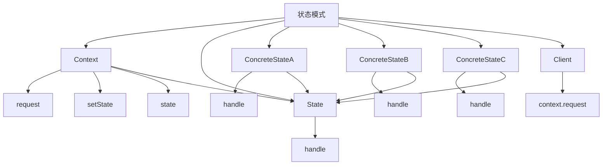

# 🔄 状态模式

[[05-行为型模式/08-观察者模式]] ← [[05-行为型模式/10-策略模式]]
## 🎯 状态模式概览

### 📊 模式结构图



## 🏗️ 模式定义与特点

### 📋 **模式定义**
状态模式允许对象在内部状态改变时改变它的行为，对象看起来好像修改了它的类。

### 📋 **核心特点**
- **状态转换**: 对象在内部状态改变时改变行为
- **行为封装**: 将状态相关的行为封装在状态类中
- **状态管理**: 集中管理对象的状态
- **动态行为**: 根据状态动态改变行为

### 📋 **适用场景**
- 对象的行为依赖于它的状态
- 需要根据状态改变对象的行为
- 需要避免大量的条件判断
- 需要实现状态机

## 🏗️ 模式实现

### 📋 **基础实现**

#### **状态接口**
```java
// ✅ 状态接口
public interface State {
    void handle(Context context);
}

// ✅ 上下文类
public class Context {
    private State state;
    
    public Context(State state) {
        this.state = state;
    }
    
    public void setState(State state) {
        this.state = state;
    }
    
    public void request() {
        state.handle(this);
    }
}

// ✅ 具体状态A
public class ConcreteStateA implements State {
    @Override
    public void handle(Context context) {
        System.out.println("Handling in State A");
        context.setState(new ConcreteStateB());
    }
}

// ✅ 具体状态B
public class ConcreteStateB implements State {
    @Override
    public void handle(Context context) {
        System.out.println("Handling in State B");
        context.setState(new ConcreteStateC());
    }
}

// ✅ 具体状态C
public class ConcreteStateC implements State {
    @Override
    public void handle(Context context) {
        System.out.println("Handling in State C");
        context.setState(new ConcreteStateA());
    }
}
```

#### **使用示例**
```java
// ✅ 客户端使用
public class Client {
    public static void main(String[] args) {
        Context context = new Context(new ConcreteStateA());
        
        context.request();
        context.request();
        context.request();
        context.request();
    }
}
```

## 🏗️ 实际应用案例

### 📋 **电梯状态机案例**

#### **电梯状态机**
```java
// ✅ 电梯状态接口
public interface ElevatorState {
    void openDoor(Elevator elevator);
    void closeDoor(Elevator elevator);
    void moveUp(Elevator elevator);
    void moveDown(Elevator elevator);
    void stop(Elevator elevator);
}

// ✅ 电梯类
public class Elevator {
    private ElevatorState currentState;
    private int currentFloor;
    private int targetFloor;
    private boolean doorOpen;
    
    public Elevator() {
        this.currentState = new StoppedState();
        this.currentFloor = 1;
        this.targetFloor = 1;
        this.doorOpen = false;
    }
    
    public void setState(ElevatorState state) {
        this.currentState = state;
    }
    
    public ElevatorState getCurrentState() {
        return currentState;
    }
    
    public void openDoor() {
        currentState.openDoor(this);
    }
    
    public void closeDoor() {
        currentState.closeDoor(this);
    }
    
    public void moveUp() {
        currentState.moveUp(this);
    }
    
    public void moveDown() {
        currentState.moveDown(this);
    }
    
    public void stop() {
        currentState.stop(this);
    }
    
    public void setCurrentFloor(int floor) {
        this.currentFloor = floor;
    }
    
    public int getCurrentFloor() {
        return currentFloor;
    }
    
    public void setTargetFloor(int floor) {
        this.targetFloor = floor;
    }
    
    public int getTargetFloor() {
        return targetFloor;
    }
    
    public void setDoorOpen(boolean doorOpen) {
        this.doorOpen = doorOpen;
    }
    
    public boolean isDoorOpen() {
        return doorOpen;
    }
    
    @Override
    public String toString() {
        return "Elevator{" +
                "currentState=" + currentState.getClass().getSimpleName() +
                ", currentFloor=" + currentFloor +
                ", targetFloor=" + targetFloor +
                ", doorOpen=" + doorOpen +
                '}';
    }
}

// ✅ 停止状态
public class StoppedState implements ElevatorState {
    @Override
    public void openDoor(Elevator elevator) {
        elevator.setDoorOpen(true);
        System.out.println("Door opened at floor " + elevator.getCurrentFloor());
    }
    
    @Override
    public void closeDoor(Elevator elevator) {
        elevator.setDoorOpen(false);
        System.out.println("Door closed at floor " + elevator.getCurrentFloor());
    }
    
    @Override
    public void moveUp(Elevator elevator) {
        if (!elevator.isDoorOpen()) {
            elevator.setState(new MovingUpState());
            System.out.println("Elevator started moving up from floor " + elevator.getCurrentFloor());
        } else {
            System.out.println("Cannot move up while door is open");
        }
    }
    
    @Override
    public void moveDown(Elevator elevator) {
        if (!elevator.isDoorOpen()) {
            elevator.setState(new MovingDownState());
            System.out.println("Elevator started moving down from floor " + elevator.getCurrentFloor());
        } else {
            System.out.println("Cannot move down while door is open");
        }
    }
    
    @Override
    public void stop(Elevator elevator) {
        System.out.println("Elevator is already stopped at floor " + elevator.getCurrentFloor());
    }
}

// ✅ 上升状态
public class MovingUpState implements ElevatorState {
    @Override
    public void openDoor(Elevator elevator) {
        System.out.println("Cannot open door while moving up");
    }
    
    @Override
    public void closeDoor(Elevator elevator) {
        System.out.println("Door is already closed while moving up");
    }
    
    @Override
    public void moveUp(Elevator elevator) {
        elevator.setCurrentFloor(elevator.getCurrentFloor() + 1);
        System.out.println("Moving up to floor " + elevator.getCurrentFloor());
        
        if (elevator.getCurrentFloor() == elevator.getTargetFloor()) {
            elevator.setState(new StoppedState());
            System.out.println("Reached target floor " + elevator.getCurrentFloor());
        }
    }
    
    @Override
    public void moveDown(Elevator elevator) {
        System.out.println("Cannot change direction while moving up");
    }
    
    @Override
    public void stop(Elevator elevator) {
        elevator.setState(new StoppedState());
        System.out.println("Elevator stopped at floor " + elevator.getCurrentFloor());
    }
}

// ✅ 下降状态
public class MovingDownState implements ElevatorState {
    @Override
    public void openDoor(Elevator elevator) {
        System.out.println("Cannot open door while moving down");
    }
    
    @Override
    public void closeDoor(Elevator elevator) {
        System.out.println("Door is already closed while moving down");
    }
    
    @Override
    public void moveUp(Elevator elevator) {
        System.out.println("Cannot change direction while moving down");
    }
    
    @Override
    public void moveDown(Elevator elevator) {
        elevator.setCurrentFloor(elevator.getCurrentFloor() - 1);
        System.out.println("Moving down to floor " + elevator.getCurrentFloor());
        
        if (elevator.getCurrentFloor() == elevator.getTargetFloor()) {
            elevator.setState(new StoppedState());
            System.out.println("Reached target floor " + elevator.getCurrentFloor());
        }
    }
    
    @Override
    public void stop(Elevator elevator) {
        elevator.setState(new StoppedState());
        System.out.println("Elevator stopped at floor " + elevator.getCurrentFloor());
    }
}

// ✅ 电梯控制器
public class ElevatorController {
    private Elevator elevator;
    
    public ElevatorController() {
        this.elevator = new Elevator();
    }
    
    public void callElevator(int floor) {
        System.out.println("Calling elevator to floor " + floor);
        elevator.setTargetFloor(floor);
        
        if (floor > elevator.getCurrentFloor()) {
            elevator.moveUp();
        } else if (floor < elevator.getCurrentFloor()) {
            elevator.moveDown();
        } else {
            elevator.openDoor();
        }
    }
    
    public void moveToFloor(int floor) {
        System.out.println("Moving to floor " + floor);
        elevator.setTargetFloor(floor);
        
        if (floor > elevator.getCurrentFloor()) {
            elevator.moveUp();
        } else if (floor < elevator.getCurrentFloor()) {
            elevator.moveDown();
        } else {
            elevator.openDoor();
        }
    }
    
    public void openDoor() {
        elevator.openDoor();
    }
    
    public void closeDoor() {
        elevator.closeDoor();
    }
    
    public void stopElevator() {
        elevator.stop();
    }
    
    public void printStatus() {
        System.out.println("Elevator Status: " + elevator);
    }
}
```

#### **使用示例**
```java
// ✅ 使用示例
public class ElevatorDemo {
    public static void main(String[] args) {
        ElevatorController controller = new ElevatorController();
        
        // 初始状态
        controller.printStatus();
        
        // 呼叫电梯到3楼
        controller.callElevator(3);
        controller.printStatus();
        
        // 模拟电梯移动
        controller.moveToFloor(3);
        controller.printStatus();
        
        // 开门
        controller.openDoor();
        controller.printStatus();
        
        // 关门
        controller.closeDoor();
        controller.printStatus();
        
        // 移动到1楼
        controller.moveToFloor(1);
        controller.printStatus();
        
        // 开门
        controller.openDoor();
        controller.printStatus();
        
        // 关门
        controller.closeDoor();
        controller.printStatus();
        
        // 停止电梯
        controller.stopElevator();
        controller.printStatus();
    }
}
```

### 📋 **订单状态机案例**

#### **订单状态机**
```java
// ✅ 订单状态接口
public interface OrderState {
    void processOrder(Order order);
    void cancelOrder(Order order);
    void shipOrder(Order order);
    void deliverOrder(Order order);
    void returnOrder(Order order);
}

// ✅ 订单类
public class Order {
    private OrderState currentState;
    private String orderId;
    private String customerName;
    private List<String> items;
    private double totalAmount;
    private String shippingAddress;
    
    public Order(String orderId, String customerName, List<String> items, double totalAmount, String shippingAddress) {
        this.orderId = orderId;
        this.customerName = customerName;
        this.items = items;
        this.totalAmount = totalAmount;
        this.shippingAddress = shippingAddress;
        this.currentState = new PendingState();
    }
    
    public void setState(OrderState state) {
        this.currentState = state;
    }
    
    public OrderState getCurrentState() {
        return currentState;
    }
    
    public void processOrder() {
        currentState.processOrder(this);
    }
    
    public void cancelOrder() {
        currentState.cancelOrder(this);
    }
    
    public void shipOrder() {
        currentState.shipOrder(this);
    }
    
    public void deliverOrder() {
        currentState.deliverOrder(this);
    }
    
    public void returnOrder() {
        currentState.returnOrder(this);
    }
    
    public String getOrderId() {
        return orderId;
    }
    
    public String getCustomerName() {
        return customerName;
    }
    
    public List<String> getItems() {
        return items;
    }
    
    public double getTotalAmount() {
        return totalAmount;
    }
    
    public String getShippingAddress() {
        return shippingAddress;
    }
    
    @Override
    public String toString() {
        return "Order{" +
                "orderId='" + orderId + '\'' +
                ", customerName='" + customerName + '\'' +
                ", items=" + items +
                ", totalAmount=" + totalAmount +
                ", shippingAddress='" + shippingAddress + '\'' +
                ", currentState=" + currentState.getClass().getSimpleName() +
                '}';
    }
}

// ✅ 待处理状态
public class PendingState implements OrderState {
    @Override
    public void processOrder(Order order) {
        order.setState(new ProcessingState());
        System.out.println("Order " + order.getOrderId() + " is being processed");
    }
    
    @Override
    public void cancelOrder(Order order) {
        order.setState(new CancelledState());
        System.out.println("Order " + order.getOrderId() + " has been cancelled");
    }
    
    @Override
    public void shipOrder(Order order) {
        System.out.println("Cannot ship order " + order.getOrderId() + " - order is still pending");
    }
    
    @Override
    public void deliverOrder(Order order) {
        System.out.println("Cannot deliver order " + order.getOrderId() + " - order is still pending");
    }
    
    @Override
    public void returnOrder(Order order) {
        System.out.println("Cannot return order " + order.getOrderId() + " - order is still pending");
    }
}

// ✅ 处理中状态
public class ProcessingState implements OrderState {
    @Override
    public void processOrder(Order order) {
        System.out.println("Order " + order.getOrderId() + " is already being processed");
    }
    
    @Override
    public void cancelOrder(Order order) {
        order.setState(new CancelledState());
        System.out.println("Order " + order.getOrderId() + " has been cancelled");
    }
    
    @Override
    public void shipOrder(Order order) {
        order.setState(new ShippedState());
        System.out.println("Order " + order.getOrderId() + " has been shipped");
    }
    
    @Override
    public void deliverOrder(Order order) {
        System.out.println("Cannot deliver order " + order.getOrderId() + " - order is still being processed");
    }
    
    @Override
    public void returnOrder(Order order) {
        System.out.println("Cannot return order " + order.getOrderId() + " - order is still being processed");
    }
}

// ✅ 已发货状态
public class ShippedState implements OrderState {
    @Override
    public void processOrder(Order order) {
        System.out.println("Cannot process order " + order.getOrderId() + " - order has already been shipped");
    }
    
    @Override
    public void cancelOrder(Order order) {
        System.out.println("Cannot cancel order " + order.getOrderId() + " - order has already been shipped");
    }
    
    @Override
    public void shipOrder(Order order) {
        System.out.println("Order " + order.getOrderId() + " has already been shipped");
    }
    
    @Override
    public void deliverOrder(Order order) {
        order.setState(new DeliveredState());
        System.out.println("Order " + order.getOrderId() + " has been delivered");
    }
    
    @Override
    public void returnOrder(Order order) {
        order.setState(new ReturnedState());
        System.out.println("Order " + order.getOrderId() + " has been returned");
    }
}

// ✅ 已送达状态
public class DeliveredState implements OrderState {
    @Override
    public void processOrder(Order order) {
        System.out.println("Cannot process order " + order.getOrderId() + " - order has already been delivered");
    }
    
    @Override
    public void cancelOrder(Order order) {
        System.out.println("Cannot cancel order " + order.getOrderId() + " - order has already been delivered");
    }
    
    @Override
    public void shipOrder(Order order) {
        System.out.println("Cannot ship order " + order.getOrderId() + " - order has already been delivered");
    }
    
    @Override
    public void deliverOrder(Order order) {
        System.out.println("Order " + order.getOrderId() + " has already been delivered");
    }
    
    @Override
    public void returnOrder(Order order) {
        order.setState(new ReturnedState());
        System.out.println("Order " + order.getOrderId() + " has been returned");
    }
}

// ✅ 已取消状态
public class CancelledState implements OrderState {
    @Override
    public void processOrder(Order order) {
        System.out.println("Cannot process order " + order.getOrderId() + " - order has been cancelled");
    }
    
    @Override
    public void cancelOrder(Order order) {
        System.out.println("Order " + order.getOrderId() + " has already been cancelled");
    }
    
    @Override
    public void shipOrder(Order order) {
        System.out.println("Cannot ship order " + order.getOrderId() + " - order has been cancelled");
    }
    
    @Override
    public void deliverOrder(Order order) {
        System.out.println("Cannot deliver order " + order.getOrderId() + " - order has been cancelled");
    }
    
    @Override
    public void returnOrder(Order order) {
        System.out.println("Cannot return order " + order.getOrderId() + " - order has been cancelled");
    }
}

// ✅ 已退货状态
public class ReturnedState implements OrderState {
    @Override
    public void processOrder(Order order) {
        System.out.println("Cannot process order " + order.getOrderId() + " - order has been returned");
    }
    
    @Override
    public void cancelOrder(Order order) {
        System.out.println("Cannot cancel order " + order.getOrderId() + " - order has been returned");
    }
    
    @Override
    public void shipOrder(Order order) {
        System.out.println("Cannot ship order " + order.getOrderId() + " - order has been returned");
    }
    
    @Override
    public void deliverOrder(Order order) {
        System.out.println("Cannot deliver order " + order.getOrderId() + " - order has been returned");
    }
    
    @Override
    public void returnOrder(Order order) {
        System.out.println("Order " + order.getOrderId() + " has already been returned");
    }
}

// ✅ 订单管理器
public class OrderManager {
    private List<Order> orders;
    
    public OrderManager() {
        this.orders = new ArrayList<>();
    }
    
    public void createOrder(String orderId, String customerName, List<String> items, double totalAmount, String shippingAddress) {
        Order order = new Order(orderId, customerName, items, totalAmount, shippingAddress);
        orders.add(order);
        System.out.println("Order " + orderId + " created for " + customerName);
    }
    
    public void processOrder(String orderId) {
        Order order = findOrder(orderId);
        if (order != null) {
            order.processOrder();
        } else {
            System.out.println("Order " + orderId + " not found");
        }
    }
    
    public void cancelOrder(String orderId) {
        Order order = findOrder(orderId);
        if (order != null) {
            order.cancelOrder();
        } else {
            System.out.println("Order " + orderId + " not found");
        }
    }
    
    public void shipOrder(String orderId) {
        Order order = findOrder(orderId);
        if (order != null) {
            order.shipOrder();
        } else {
            System.out.println("Order " + orderId + " not found");
        }
    }
    
    public void deliverOrder(String orderId) {
        Order order = findOrder(orderId);
        if (order != null) {
            order.deliverOrder();
        } else {
            System.out.println("Order " + orderId + " not found");
        }
    }
    
    public void returnOrder(String orderId) {
        Order order = findOrder(orderId);
        if (order != null) {
            order.returnOrder();
        } else {
            System.out.println("Order " + orderId + " not found");
        }
    }
    
    private Order findOrder(String orderId) {
        for (Order order : orders) {
            if (order.getOrderId().equals(orderId)) {
                return order;
            }
        }
        return null;
    }
    
    public void printOrderStatus(String orderId) {
        Order order = findOrder(orderId);
        if (order != null) {
            System.out.println("Order Status: " + order);
        } else {
            System.out.println("Order " + orderId + " not found");
        }
    }
    
    public void printAllOrders() {
        System.out.println("=== All Orders ===");
        for (Order order : orders) {
            System.out.println(order);
        }
    }
}
```

#### **使用示例**
```java
// ✅ 使用示例
public class OrderDemo {
    public static void main(String[] args) {
        OrderManager orderManager = new OrderManager();
        
        // 创建订单
        List<String> items1 = Arrays.asList("Laptop", "Mouse", "Keyboard");
        orderManager.createOrder("ORD001", "John Doe", items1, 1299.99, "123 Main St");
        
        List<String> items2 = Arrays.asList("Phone", "Case", "Charger");
        orderManager.createOrder("ORD002", "Jane Smith", items2, 899.99, "456 Oak Ave");
        
        System.out.println();
        
        // 处理订单
        orderManager.processOrder("ORD001");
        orderManager.printOrderStatus("ORD001");
        
        orderManager.processOrder("ORD002");
        orderManager.printOrderStatus("ORD002");
        
        System.out.println();
        
        // 发货
        orderManager.shipOrder("ORD001");
        orderManager.printOrderStatus("ORD001");
        
        orderManager.shipOrder("ORD002");
        orderManager.printOrderStatus("ORD002");
        
        System.out.println();
        
        // 送达
        orderManager.deliverOrder("ORD001");
        orderManager.printOrderStatus("ORD001");
        
        orderManager.deliverOrder("ORD002");
        orderManager.printOrderStatus("ORD002");
        
        System.out.println();
        
        // 退货
        orderManager.returnOrder("ORD001");
        orderManager.printOrderStatus("ORD001");
        
        System.out.println();
        
        // 取消订单
        orderManager.cancelOrder("ORD002");
        orderManager.printOrderStatus("ORD002");
        
        System.out.println();
        
        // 打印所有订单
        orderManager.printAllOrders();
    }
}
```

### 📋 **游戏角色状态机案例**

#### **游戏角色状态机**
```java
// ✅ 游戏角色状态接口
public interface CharacterState {
    void move(Character character);
    void attack(Character character);
    void defend(Character character);
    void rest(Character character);
    void takeDamage(Character character, int damage);
}

// ✅ 游戏角色类
public class Character {
    private CharacterState currentState;
    private String name;
    private int health;
    private int maxHealth;
    private int attackPower;
    private int defensePower;
    private int experience;
    private int level;
    
    public Character(String name, int maxHealth, int attackPower, int defensePower) {
        this.name = name;
        this.maxHealth = maxHealth;
        this.health = maxHealth;
        this.attackPower = attackPower;
        this.defensePower = defensePower;
        this.experience = 0;
        this.level = 1;
        this.currentState = new NormalState();
    }
    
    public void setState(CharacterState state) {
        this.currentState = state;
    }
    
    public CharacterState getCurrentState() {
        return currentState;
    }
    
    public void move() {
        currentState.move(this);
    }
    
    public void attack() {
        currentState.attack(this);
    }
    
    public void defend() {
        currentState.defend(this);
    }
    
    public void rest() {
        currentState.rest(this);
    }
    
    public void takeDamage(int damage) {
        currentState.takeDamage(this, damage);
    }
    
    public void setHealth(int health) {
        this.health = Math.max(0, Math.min(health, maxHealth));
    }
    
    public void addExperience(int exp) {
        this.experience += exp;
        if (this.experience >= 100) {
            levelUp();
        }
    }
    
    private void levelUp() {
        this.level++;
        this.experience -= 100;
        this.maxHealth += 10;
        this.health = maxHealth;
        this.attackPower += 5;
        this.defensePower += 3;
        System.out.println(name + " leveled up to level " + level + "!");
    }
    
    public String getName() {
        return name;
    }
    
    public int getHealth() {
        return health;
    }
    
    public int getMaxHealth() {
        return maxHealth;
    }
    
    public int getAttackPower() {
        return attackPower;
    }
    
    public int getDefensePower() {
        return defensePower;
    }
    
    public int getExperience() {
        return experience;
    }
    
    public int getLevel() {
        return level;
    }
    
    @Override
    public String toString() {
        return "Character{" +
                "name='" + name + '\'' +
                ", health=" + health +
                ", maxHealth=" + maxHealth +
                ", attackPower=" + attackPower +
                ", defensePower=" + defensePower +
                ", experience=" + experience +
                ", level=" + level +
                ", currentState=" + currentState.getClass().getSimpleName() +
                '}';
    }
}

// ✅ 正常状态
public class NormalState implements CharacterState {
    @Override
    public void move(Character character) {
        System.out.println(character.getName() + " moves normally");
    }
    
    @Override
    public void attack(Character character) {
        System.out.println(character.getName() + " attacks with " + character.getAttackPower() + " power");
        character.addExperience(10);
    }
    
    @Override
    public void defend(Character character) {
        System.out.println(character.getName() + " defends with " + character.getDefensePower() + " defense");
    }
    
    @Override
    public void rest(Character character) {
        character.setState(new RestingState());
        System.out.println(character.getName() + " starts resting");
    }
    
    @Override
    public void takeDamage(Character character, int damage) {
        int actualDamage = Math.max(1, damage - character.getDefensePower());
        character.setHealth(character.getHealth() - actualDamage);
        System.out.println(character.getName() + " takes " + actualDamage + " damage");
        
        if (character.getHealth() <= 0) {
            character.setState(new DeadState());
            System.out.println(character.getName() + " has died");
        } else if (character.getHealth() <= character.getMaxHealth() / 4) {
            character.setState(new CriticalState());
            System.out.println(character.getName() + " is in critical condition");
        }
    }
}

// ✅ 休息状态
public class RestingState implements CharacterState {
    @Override
    public void move(Character character) {
        System.out.println(character.getName() + " cannot move while resting");
    }
    
    @Override
    public void attack(Character character) {
        System.out.println(character.getName() + " cannot attack while resting");
    }
    
    @Override
    public void defend(Character character) {
        System.out.println(character.getName() + " cannot defend while resting");
    }
    
    @Override
    public void rest(Character character) {
        character.setHealth(character.getHealth() + 20);
        System.out.println(character.getName() + " rests and recovers 20 health");
        
        if (character.getHealth() >= character.getMaxHealth()) {
            character.setState(new NormalState());
            System.out.println(character.getName() + " is fully rested");
        }
    }
    
    @Override
    public void takeDamage(Character character, int damage) {
        character.setState(new NormalState());
        System.out.println(character.getName() + " is interrupted while resting");
        character.takeDamage(damage);
    }
}

// ✅ 危险状态
public class CriticalState implements CharacterState {
    @Override
    public void move(Character character) {
        System.out.println(character.getName() + " moves slowly due to critical condition");
    }
    
    @Override
    public void attack(Character character) {
        int reducedAttack = character.getAttackPower() / 2;
        System.out.println(character.getName() + " attacks with reduced power: " + reducedAttack);
        character.addExperience(5);
    }
    
    @Override
    public void defend(Character character) {
        int reducedDefense = character.getDefensePower() / 2;
        System.out.println(character.getName() + " defends with reduced defense: " + reducedDefense);
    }
    
    @Override
    public void rest(Character character) {
        character.setState(new RestingState());
        System.out.println(character.getName() + " starts resting to recover");
    }
    
    @Override
    public void takeDamage(Character character, int damage) {
        int actualDamage = Math.max(1, damage - character.getDefensePower() / 2);
        character.setHealth(character.getHealth() - actualDamage);
        System.out.println(character.getName() + " takes " + actualDamage + " damage");
        
        if (character.getHealth() <= 0) {
            character.setState(new DeadState());
            System.out.println(character.getName() + " has died");
        }
    }
}

// ✅ 死亡状态
public class DeadState implements CharacterState {
    @Override
    public void move(Character character) {
        System.out.println(character.getName() + " cannot move - character is dead");
    }
    
    @Override
    public void attack(Character character) {
        System.out.println(character.getName() + " cannot attack - character is dead");
    }
    
    @Override
    public void defend(Character character) {
        System.out.println(character.getName() + " cannot defend - character is dead");
    }
    
    @Override
    public void rest(Character character) {
        System.out.println(character.getName() + " cannot rest - character is dead");
    }
    
    @Override
    public void takeDamage(Character character, int damage) {
        System.out.println(character.getName() + " cannot take damage - character is dead");
    }
}

// ✅ 游戏角色管理器
public class CharacterManager {
    private List<Character> characters;
    
    public CharacterManager() {
        this.characters = new ArrayList<>();
    }
    
    public void createCharacter(String name, int maxHealth, int attackPower, int defensePower) {
        Character character = new Character(name, maxHealth, attackPower, defensePower);
        characters.add(character);
        System.out.println("Character " + name + " created");
    }
    
    public void moveCharacter(String name) {
        Character character = findCharacter(name);
        if (character != null) {
            character.move();
        } else {
            System.out.println("Character " + name + " not found");
        }
    }
    
    public void attackCharacter(String name) {
        Character character = findCharacter(name);
        if (character != null) {
            character.attack();
        } else {
            System.out.println("Character " + name + " not found");
        }
    }
    
    public void defendCharacter(String name) {
        Character character = findCharacter(name);
        if (character != null) {
            character.defend();
        } else {
            System.out.println("Character " + name + " not found");
        }
    }
    
    public void restCharacter(String name) {
        Character character = findCharacter(name);
        if (character != null) {
            character.rest();
        } else {
            System.out.println("Character " + name + " not found");
        }
    }
    
    public void damageCharacter(String name, int damage) {
        Character character = findCharacter(name);
        if (character != null) {
            character.takeDamage(damage);
        } else {
            System.out.println("Character " + name + " not found");
        }
    }
    
    private Character findCharacter(String name) {
        for (Character character : characters) {
            if (character.getName().equals(name)) {
                return character;
            }
        }
        return null;
    }
    
    public void printCharacterStatus(String name) {
        Character character = findCharacter(name);
        if (character != null) {
            System.out.println("Character Status: " + character);
        } else {
            System.out.println("Character " + name + " not found");
        }
    }
    
    public void printAllCharacters() {
        System.out.println("=== All Characters ===");
        for (Character character : characters) {
            System.out.println(character);
        }
    }
}
```

#### **使用示例**
```java
// ✅ 使用示例
public class CharacterDemo {
    public static void main(String[] args) {
        CharacterManager characterManager = new CharacterManager();
        
        // 创建角色
        characterManager.createCharacter("Warrior", 100, 20, 10);
        characterManager.createCharacter("Mage", 80, 25, 5);
        characterManager.createCharacter("Rogue", 90, 18, 8);
        
        System.out.println();
        
        // 角色行动
        characterManager.attackCharacter("Warrior");
        characterManager.attackCharacter("Mage");
        characterManager.attackCharacter("Rogue");
        
        System.out.println();
        
        // 角色受到伤害
        characterManager.damageCharacter("Warrior", 30);
        characterManager.damageCharacter("Mage", 50);
        characterManager.damageCharacter("Rogue", 20);
        
        System.out.println();
        
        // 打印角色状态
        characterManager.printCharacterStatus("Warrior");
        characterManager.printCharacterStatus("Mage");
        characterManager.printCharacterStatus("Rogue");
        
        System.out.println();
        
        // 角色休息
        characterManager.restCharacter("Warrior");
        characterManager.restCharacter("Mage");
        characterManager.restCharacter("Rogue");
        
        System.out.println();
        
        // 角色受到更多伤害
        characterManager.damageCharacter("Warrior", 60);
        characterManager.damageCharacter("Mage", 40);
        characterManager.damageCharacter("Rogue", 70);
        
        System.out.println();
        
        // 打印角色状态
        characterManager.printCharacterStatus("Warrior");
        characterManager.printCharacterStatus("Mage");
        characterManager.printCharacterStatus("Rogue");
        
        System.out.println();
        
        // 角色死亡
        characterManager.damageCharacter("Warrior", 50);
        characterManager.damageCharacter("Mage", 30);
        characterManager.damageCharacter("Rogue", 20);
        
        System.out.println();
        
        // 打印所有角色状态
        characterManager.printAllCharacters();
    }
}
```

## 🎯 模式优势与劣势

### 📋 **优势**
- **状态转换**: 对象在内部状态改变时改变行为
- **行为封装**: 将状态相关的行为封装在状态类中
- **状态管理**: 集中管理对象的状态
- **动态行为**: 根据状态动态改变行为

### 📋 **劣势**
- **复杂度增加**: 增加了系统的复杂度
- **类数量增加**: 需要创建大量的状态类
- **状态转换**: 需要仔细管理状态转换

### 📋 **与策略模式的区别**
| 方面 | 状态模式 | 策略模式 |
|------|----------|----------|
| **目的** | 状态管理 | 算法选择 |
| **转换** | 状态可以转换 | 策略可以切换 |
| **使用场景** | 状态机 | 算法族 |
| **复杂度** | 相对复杂 | 相对简单 |

## 🔗 学习衔接

- **上一文档** ← [[观察者模式]]
- **下一文档** → [[策略模式]]
- **模式基础** → [[01-基础认知]]

---
**💡 状态精髓**: 状态模式就像变色龙，能够根据环境改变自己的颜色和行为。当对象的行为依赖于它的状态，或者需要根据状态改变对象的行为时，状态模式是最佳选择！
