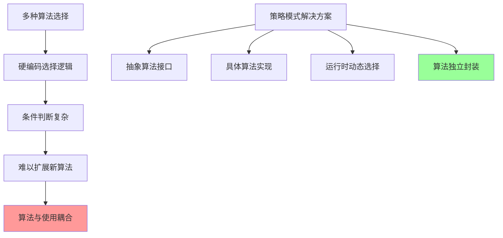
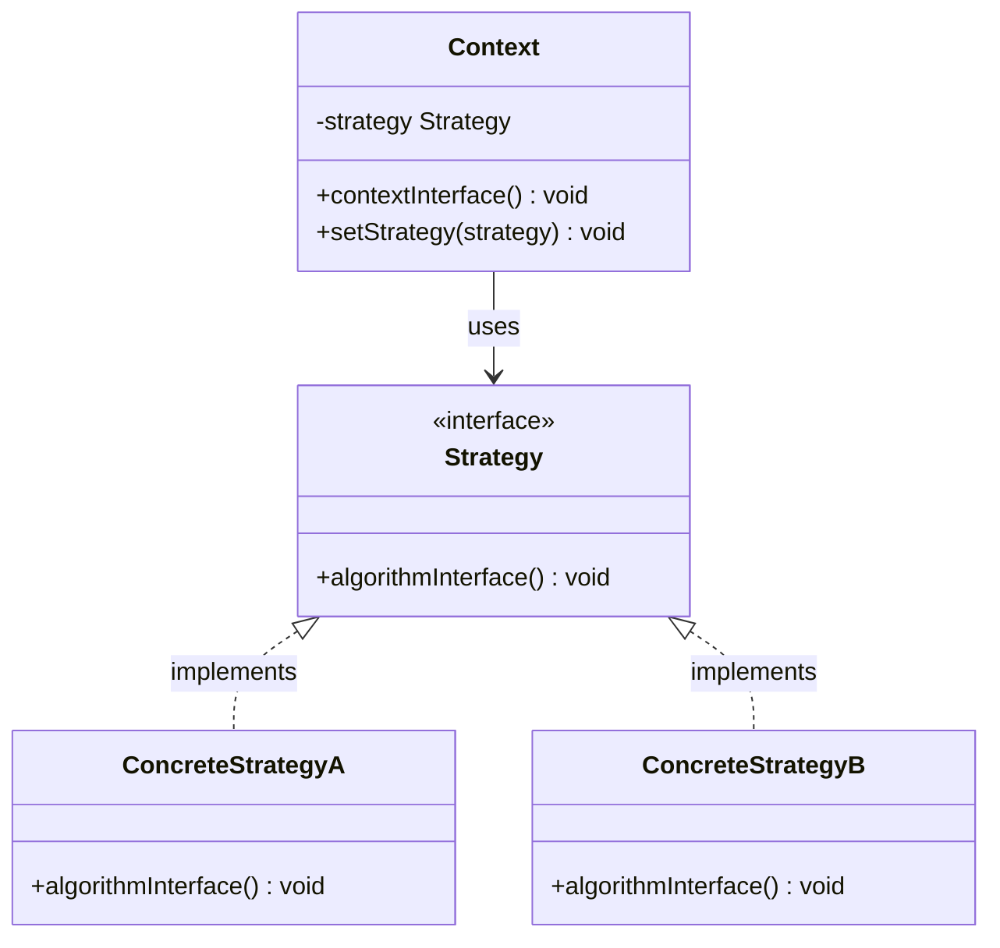
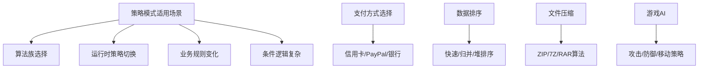

# 策略模式 Strategy Pattern

[[08-观察者模式]] → [[09-状态模式]]
## 🎯 模式定义与意图

### 📖 官方定义
> **定义一系列算法，把它们封装起来，并且使它们可以互相替换。策略模式让算法独立于使用它的客户而变化。**

### 🤔 核心问题


## 🏗️ 结构图与参与者

### 📊 UML类图


### 👥 参与者职责

| 参与者 | 职责描述 | 示例角色 |
|--------|----------|----------|
| **Strategy** | 抽象策略接口 | PaymentStrategy |
| **ConcreteStrategy** | 具体策略实现 | CreditCardStrategy |
| **Context** | 策略使用者 | PaymentProcessor |

## 💡 经典实现示例

### 🎯 支付处理系统

```java
// Strategy: 抽象支付策略
interface PaymentStrategy {
    boolean pay(double amount);
    String getPaymentMethod();
    double calculateFee(double amount);
}

// Concrete Strategy: 信用卡支付
class CreditCardStrategy implements PaymentStrategy {
    private String cardNumber;
    private String cvv;
    private String expiryDate;
    
    public CreditCardStrategy(String cardNumber, String cvv, String expiryDate) {
        this.cardNumber = cardNumber;
        this.cvv = cvv;
        this.expiryDate = expiryDate;
    }
    
    public boolean pay(double amount) {
        System.out.println("Processing credit card payment of $" + amount);
        // 模拟支付处理
        return validateCard() && chargeCard(amount);
    }
    
    public String getPaymentMethod() {
        return "Credit Card ending in " + cardNumber.substring(cardNumber.length() - 4);
    }
    
    public double calculateFee(double amount) {
        return amount * 0.029 + 0.30; // 2.9% + $0.30 per transaction
    }
    
    private boolean validateCard() {
        return true; // 简化实现
    }
    
    private boolean chargeCard(double amount) {
        return true; // 简化实现
    }
}

// Concrete Strategy: PayPal支付
class PayPalStrategy implements PaymentStrategy {
    private String email;
    private String password;
    
    public PayPalStrategy(String email, String password) {
        this.email = email;
        this.password = password;
    }
    
    public boolean pay(double amount) {
        System.out.println("Processing PayPal payment of $" + amount);
        return authenticatePayPal(email, password) && authorizePayment(email, amount);
    }
    
    public String getPaymentMethod() {
        return "PayPal account: " + email;
    }
    
    public double calculateFee(double amount) {
        return amount * 0.034 + 0.35; // PayPal fees
    }
    
    private boolean authenticatePayPal(String email, String password) {
        return true; // 简化实现
    }
    
    private boolean authorizePayment(String email, double amount) {
        return true; // 简化实现
    }
}

// Concrete Strategy: 银行转账
class BankTransferStrategy implements PaymentStrategy {
    private String accountNumber;
    private String routingNumber;
    
    public BankTransferStrategy(String accountNumber, String routingNumber) {
        this.accountNumber = accountNumber;
        this.routingNumber = routingNumber;
    }
    
    public boolean pay(double amount) {
        System.out.println("Processing bank transfer of $" + amount);
        return authorizeBankTransfer(accountNumber, routingNumber, amount);
    }
    
    public String getPaymentMethod() {
        return "Bank Account ending in " + accountNumber.substring(accountNumber.length() - 4);
    }
    
    public double calculateFee(double amount) {
        return amount < 1000 ? 1.50 : 0.0; // Free for large transfers
    }
    
    private boolean authorizeBankTransfer(String account, String routing, double amount) {
        return true; // 简化实现
    }
}

// Context: 支付处理器
class PaymentProcessor {
    private PaymentStrategy paymentStrategy;
    
    public PaymentProcessor() {
        // 默认支付方式
        this.paymentStrategy = new CreditCardStrategy("1234567890123456", "123", "12/25");
    }
    
    public void setPaymentStrategy(PaymentStrategy strategy) {
        this.paymentStrategy = strategy;
    }
    
    public boolean processPayment(double amount) {
        double fee = paymentStrategy.calculateFee(amount);
        double totalAmount = amount + fee;
        
        System.out.println("=== Payment Details ===");
        System.out.println("Payment Method: " + paymentStrategy.getPaymentMethod());
        System.out.println("Amount: $" + String.format("%.2f", amount));
        System.out.println("Fee: $" + String.format("%.2f", fee));
        System.out.println("Total: $" + String.format("%.2f", totalAmount));
        System.out.println("=======================");
        
        return paymentStrategy.pay(totalAmount);
    }
    
    public PaymentStrategy getCurrentStrategy() {
        return paymentStrategy;
    }
}

// 客户端使用
public class StrategyPatternDemo {
    public static void main(String[] args) {
        PaymentProcessor processor = new PaymentProcessor();
        
        // 使用信用卡支付
        System.out.println("--- Credit Card Payment ---");
        processor.processPayment(100.0);
        
        // 切换到PayPal支付
        System.out.println("\n--- PayPal Payment ---");
        processor.setPaymentStrategy(new PayPalStrategy("user@example.com", "password123"));
        processor.processPayment(150.0);
        
        // 切换到银行转账
        System.out.println("\n--- Bank Transfer ---");
        processor.setPaymentStrategy(new BankTransferStrategy("1234567890", "987654321"));
        processor.processPayment(500.0);
        
        // 动态选择最佳支付方式
        PaymentStrategy bestStrategy = selectBestPaymentStrategy(200.0);
        processor.setPaymentStrategy(bestStrategy);
        System.out.println("\n--- Best Strategy Selected ---");
        processor.processPayment(200.0);
    }
    
    private static PaymentStrategy selectBestPaymentStrategy(double amount) {
        // 简单的策略选择逻辑
        if (amount < 100) {
            return new CreditCardStrategy("1234567890123456", "123", "12/25");
        } else if (amount < 1000) {
            return new PayPalStrategy("user@example.com", "password123");
        } else {
            return new BankTransferStrategy("1234567890", "987654321");
        }
    }
}
```

## 🔥 现代实现：排序算法策略

### 🎯 高性能排序系统

```java
// 通用数据排序接口
interface SortStrategy<T extends Comparable<T>> {
    void sort(T[] array);
    String getAlgorithmName();
    long getTimeComplexity();
    long getSpaceComplexity();
}

// 快速排序策略
class QuickSortStrategy<T extends Comparable<T>> implements SortStrategy<T> {
    public void sort(T[] array) {
        quickSort(array, 0, array.length - 1);
    }
    
    private void quickSort(T[] array, int low, int high) {
        if (low < high) {
            int pivotIndex = partition(array, low, high);
            quickSort(array, low, pivotIndex - 1);
            quickSort(array, pivotIndex + 1, high);
        }
    }
    
    private int partition(T[] array, int low, int high) {
        T pivot = array[high];
        int i = low - 1;
        
        for (int j = low; j < high; j++) {
            if (array[j].compareTo(pivot) <= 0) {
                i++;
                swap(array, i, j);
            }
        }
        swap(array, i + 1, high);
        return i + 1;
    }
    
    private void swap(T[] array, int i, int j) {
        T temp = array[i];
        array[i] = array[j];
        array[j] = temp;
    }
    
    public String getAlgorithmName() { return "Quick Sort"; }
    public long getTimeComplexity() { return 0; } // O(n log n)
    public long getSpaceComplexity() { return 0; } // O(log n)
}

// 归并排序策略
class MergeSortStrategy<T extends Comparable<T>> implements SortStrategy<T> {
    public void sort(T[] array) {
        mergeSort(array, array.clone(), 0, array.length - 1);
    }
    
    private void mergeSort(T[] array, T[] temp, int left, int right) {
        if (left < right) {
            int mid = (left + right) / 2;
            mergeSort(array, temp, left, mid);
            mergeSort(array, temp, mid + 1, right);
            merge(array, temp, left, mid, right);
        }
    }
    
    private void merge(T[] array, T[] temp, int left, int mid, int right) {
        System.arraycopy(array, left, temp, left, right - left + 1);
        
        int i = left, j = mid + 1, k = left;
        
        while (i <= mid && j <= right) {
            if (temp[i].compareTo(temp[j]) <= 0) {
                array[k++] = temp[i++];
            } else {
                array[k++] = temp[j++];
            }
        }
        
        while (i <= mid) array[k++] = temp[i++];
        while (j <= right) array[k++] = temp[j++];
    }
    
    public String getAlgorithmName() { return "Merge Sort"; }
    public long getTimeComplexity() { return 0; } // O(n log n)
    public long getSpaceComplexity() { return 0; } // O(n)
}

// 堆排序策略
class HeapSortStrategy<T extends Comparable<T>> implements SortStrategy<T> {
    public void sort(T[] array) {
        int n = array.length;
        
        // 构建堆
        for (int i = n / 2 - 1; i >= 0; i--) {
            heapify(array, n, i);
        }
        
        // 逐个提取元素
        for (int i = n - 1; i > 0; i--) {
            swap(array, 0, i);
            heapify(array, i, 0);
        }
    }
    
    private void heapify(T[] array, int n, int i) {
        int largest = i;
        int left = 2 * i + 1;
        int right = 2 * i + 2;
        
        if (left < n && array[left].compareTo(array[largest]) > 0) {
            largest = left;
        }
        
        if (right < n && array[right].compareTo(array[largest]) > 0) {
            largest = right;
        }
        
        if (largest != i) {
            swap(array, i, largest);
            heapify(array, n, largest);
        }
    }
    
    private void swap(T[] array, int i, int j) {
        T temp = array[i];
        array[i] = array[j];
        array[j] = temp;
    }
    
    public String getAlgorithmName() { return "Heap Sort"; }
    public long getTimeComplexity() { return 0; } // O(n log n)
    public long getSpaceComplexity() { return 0; } // O(1)
}

// Context: 排序管理器
class SortManager<T extends Comparable<T>> {
    private SortStrategy<T> strategy;
    private T[] data;
    
    public SortManager(T[] data) {
        this.data = data;
        // 默认使用快速排序
        this.strategy = new QuickSortStrategy<>();
    }
    
    public void setSortStrategy(SortStrategy<T> strategy) {
        this.strategy = strategy;
    }
    
    public void sort() {
        System.out.println("Before sorting: " + Arrays.toString(data));
        System.out.println("Using " + strategy.getAlgorithmName());
        
        long startTime = System.nanoTime();
        strategy.sort(data);
        long endTime = System.nanoTime();
        
        System.out.println("After sorting: " + Arrays.toString(data));
        System.out.println("Sorting took: " + (endTime - startTime) / 1_000_000.0 + " ms");
        System.out.println("Algorithm: " + strategy.getAlgorithmName());
        System.out.println("Time Complexity: " + strategy.getTimeComplexity());
        System.out.println("Space Complexity: " + strategy.getSpaceComplexity());
        System.out.println();
    }
    
    public SortStrategy<T> getCurrentStrategy() {
        return strategy;
    }
}

// 客户端使用示例
public class AdvancedStrategyDemo {
    public static void main(String[] args) {
        // 创建测试数据
        Integer[] numbers = {64, 34, 25, 12, 22, 11, 90, 5, 77, 30};
        
        SortManager<Integer> sortManager = new SortManager<>(numbers.clone());
        
        // 测试不同的排序算法
        System.out.println("=== Comparison of Sorting Algorithms ===\n");
        
        // 快速排序
        sortManager.setSortStrategy(new QuickSortStrategy());
        sortManager.sort();
        
        // 归并排序
        sortManager.setSortStrategy(new MergeSortStrategy());
        sortManager.sort();
        
        // 堆排序
        sortManager.setSortStrategy(new HeapSortStrategy());
        sortManager.sort();
        
        // 根据数据特性自动选择最佳算法
        SortStrategy<Integer> optimalStrategy = selectOptimalStrategy(numbers);
        System.out.println("=== Auto-selected Optimal Strategy ===");
        sortManager.setSortStrategy(optimalStrategy);
        sortManager.sort();
    }
    
    private static SortStrategy<Integer> selectOptimalStrategy(Integer[] data) {
        int size = data.length;
        
        // 简单的策略选择逻辑
        if (size <= 10) {
            return new QuickSortStrategy(); // 小数据量用快速排序
        } else if (size <= 100) {
            return new MergeSortStrategy(); // 中等数据量用归并排序
        } else {
            return new HeapSortStrategy(); // 大数据量用堆排序
        }
    }
}
```

## 🎯 策略模式变种

### 🔀 1. 策略工厂模式

```java
// 策略工厂
class PaymentStrategyFactory {
    private static final Map<String, Supplier<PaymentStrategy>> strategies = Map.of(
        "credit", () -> new CreditCardStrategy("1234567890123456", "123", "12/25"),
        "paypal", () -> new PayPalStrategy("user@example.com", "password123"),
        "bank", () -> new BankTransferStrategy("1234567890", "987654321")
    );
    
    public static PaymentStrategy createStrategy(String type) {
        Supplier<PaymentStrategy> supplier = strategies.get(type.toLowerCase());
        if (supplier == null) {
            throw new IllegalArgumentException("Unknown payment strategy: " + type);
        }
        return supplier.get();
    }
    
    public static Set<String> getAvailableStrategies() {
        return strategies.keySet();
    }
}
```

### 🔀 2. Lambda策略模式 (Java 8+)

```java
// 函数式接口策略
public class FunctionalStrategyDemo {
    interface DiscountStrategy {
        double calculateDiscount(double amount);
    }
    
    private final Map<String, DiscountStrategy> discountStrategies = Map.of(
        "student", amount -> amount * 0.1,           // 10% discount
        "senior", amount -> amount * 0.15,            // 15% discount  
        "bulk", amount -> amount > 1000 ? amount * 0.2 : amount * 0.05,
        "membership", amount -> amount * 0.12        // 12% discount
    );
    
    public double calculateFinalPrice(double amount, String customerType) {
        DiscountStrategy strategy = discountStrategies.get(customerType);
        double discount = strategy != null ? strategy.calculateDiscount(amount) : 0;
        return amount - discount;
    }
    
    // 客户端使用
    public static void main(String[] args) {
        FunctionalStrategyDemo demo = new FunctionalStrategyDemo();
        
        System.out.println("Price for student: " + demo.calculateFinalPrice(100, "student"));
        System.out.println("Price for senior: " + demo.calculateFinalPrice(100, "senior"));
        System.out.println("Price for bulk order: " + demo.calculateFinalPrice(1500, "bulk"));
    }
}
```

### 🔀 3. 策略模式 + 建造者模式

```java
// 复杂策略构建器
public class PaymentStrategyBuilder {
    private PaymentStrategy strategy;
    
    public PaymentStrategyBuilder withCreditCard(String cardNumber, String cvv, String expiry) {
        strategy = new CreditCardStrategy(cardNumber, cvv, expiry);
        return this;
    }
    
    public PaymentStrategyBuilder withPayPal(String email, String password) {
        strategy = new PayPalStrategy(email, password);
        return this;
    }
    
    public PaymentStrategyBuilder withBankTransfer(String account, String routing) {
        strategy = new BankTransferStrategy(account, routing);
        return this;
    }
    
    public PaymentProcessor buildProcessor() {
        PaymentProcessor processor = new PaymentProcessor();
        if (strategy != null) {
            processor.setPaymentStrategy(strategy);
        }
        return processor;
    }
}

// 使用建造者模式创建策略
PaymentProcessor processor = new PaymentStrategyBuilder()
    .withCreditCard("1234567890123456", "123", "12/25")
    .buildProcessor();
```

## 🎯 应用场景

### ✅ 典型应用场景



#### 🌟 实际应用场景

| 应用领域 | 具体场景 | Strategy接口 | ConcreteStrategy |
|----------|----------|-------------|------------------|
| **电商系统** | 支付方式选择 | PaymentStrategy | CreditCard, PayPal, Bank |
| **数据科学** | 算法选择 | AlgorithmStrategy | Training, Prediction, Validation |
| **游戏开发** | AI行为选择 | AIStrategy | Attack, Defend, Explore, Flee |
| **压缩软件** | 压缩算法 | CompressionStrategy | ZIP, 7Z, RAR |
| **图片处理** | 滤镜选择 | FilterStrategy | Blur, Sharpen, Colorize |

### 🏗️ Spring框架中的应用

```java
// Spring中的策略模式
@Component
public class NotificationService {
    private final Map<NotificationType, NotificationStrategy> strategies;
    
    @Autowired
    public NotificationService(List<NotificationStrategy> strategyList) {
        strategies = strategyList.stream()
            .collect(Collectors.toMap(
                NotificationStrategy::getSupportedType,
                Function.identity()
            ));
    }
    
    public void sendNotification(NotificationType type, String message, String recipient) {
        NotificationStrategy strategy = strategies.get(type);
        if (strategy == null) {
            throw new UnsupportedOperationException("No strategy for type: " + type);
        }
        strategy.send(message, recipient);
    }
}

// 策略接口
public interface NotificationStrategy {
    NotificationType getSupportedType();
    void send(String message, String recipient);
}

// 具体策略实现
@Component
public class EmailNotificationStrategy implements NotificationStrategy {
    @Override
    public NotificationType getSupportedType() {
        return NotificationType.EMAIL;
    }
    
    @Override
    public void send(String message, String recipient) {
        // Email发送逻辑
    }
}

@Component
public class SMSNotificationStrategy implements NotificationStrategy {
    @Override
    public NotificationType getSupportedType() {
        return NotificationType.SMS;
    }
    
    @Override
    public void send(String message, String recipient) {
        // SMS发送逻辑
    }
}
```

### ❌ 不适用场景

| 场景 | 原因 | 替代方案 |
|------|------|----------|
| **只有一种算法** | 过度设计 | 直接实现算法 |
| **算法差异过大** | 接口设计困难 | 独立算法类 |
| **算法与业务紧密耦合** | 难以独立 | 模板方法模式 |
| **性能要求极高** | 增加调用开销 | 直接调用 |

## 💡 策略模式优缺点

### ✅ 优点

| 优点 | 详细说明 |
|------|----------|
| **消除条件语句** | 避免大量的if-else或switch语句 |
| **算法封装** | 每个算法独立封装，易于理解和测试 |
| **开闭原则** | 易于添加新算法，无需修改现有代码 |
| **动态切换** | 运行时可以动态切换策略 |
| **代码复用** | 算法可以在不同context中复用 |

### ❌ 缺点

| 缺点 | 详细说明 | 缓解方案 |
|------|----------|----------|
| **客户端必须了解策略** | 客户端要知道具体策略类 | 使用工厂模式封装 |
| **策略类增多** | 增加系统中类的数量 | 合理评估是否需要策略模式 |
| **内存开销** | 某些情况下策略对象占用内存 | 使用Flyweight或静态策略 |
| **设计复杂度** | 增加了代码的复杂性 | 评估复杂度是否值得 |

## 🔗 与其他模式的关系

### 🤝 模式对比

| 模式 | 与策略模式的关系 | 主要区别 |
|------|----------------|----------|
| **状态模式** | 都用Context类 | 状态改变内部逻辑，策略改变外部行为 |
| **工厂模式** | 都创建对象 | 工厂关注创建，策略关注行为变化 |
| **命令模式** | 都封装操作 | 命令封装请求，策略封装算法 |
| **模板方法模式** | 都设计算法族 | 模板固定算法骨架，策略封装完整算法 |

### 📋 模式协同使用

```java
// 策略模式 + 工厂模式
public class PaymentStrategyFactory {
    public static PaymentStrategy createStrategy(PaymentType type) {
        switch (type) {
            case CREDIT:
                return new CreditCardStrategy(cardInfo);
            case PAYPAL:
                return new PayPalStrategy(paypalInfo);
            case BANK:
                return new BankTransferStrategy(bankInfo);
            default:
                throw new IllegalArgumentException("Unknown payment type");
        }
    }
}

// 策略模式 + 单例模式
public class AlgorithmRegistry {
    private static volatile AlgorithmRegistry instance;
    private final Map<String, AlgorithmStrategy> algorithms = new HashMap<>();
    
    public static AlgorithmRegistry getInstance() {
        if (instance == null) {
            synchronized (AlgorithmRegistry.class) {
                if (instance == null) {
                    instance = new AlgorithmRegistry();
                }
            }
        }
        return instance;
    }
    
    public void registerAlgorithm(String name, AlgorithmStrategy strategy) {
        algorithms.put(name, strategy);
    }
    
    public AlgorithmStrategy getAlgorithm(String name) {
        return algorithms.get(name);
    }
}
```

## 🎯 最佳实践

### 📚 设计指导原则

1. **接口设计简洁**：策略接口应该简洁而专注
2. **策略独立**：每个策略应该是独立的、可测试的单元
3. **上下文轻量**：Context不应该承担太多职责
4. **工厂辅助**：对于复杂策略创建，使用工厂模式辅助

### 🛠️ 实现建议

#### 代码质量检查
- [ ] 策略接口是否过于复杂？
- [ ] 策略之间是否有共同代码可以提取？
- [ ] 上下文类的职责是否单一？
- [ ] 策略切换是否足够简单？

#### 性能优化建议
```java
// 1. 预创建策略实例（单例策略）
public class SingletonStrategyFactory {
    private static final Map<String, PaymentStrategy> INSTANCES = Map.of(
        "credit", new CreditCardStrategy("", "", ""),
        "paypal", new PayPalStrategy("", "")
    );
    
    public static PaymentStrategy getStrategy(String type) {
        return INSTANCES.get(type);
    }
}

// 2. 延迟初始化
public class LazyStrategyFactory {
    private final Map<String, Supplier<PaymentStrategy>> creators;
    
    public PaymentStrategy getStrategy(String type) {
        return creators.get(type).get();
    }
}

// 3. 缓存使用频率高的策略
public class CachedStrategyFactory {
    private final Map<String, PaymentStrategy> cache = new ConcurrentHashMap<>();
    
    public PaymentStrategy getStrategy(String type) {
        return cache.computeIfAbsent(type, this::createStrategy);
    }
}
```

## 🔗 学习衔接

- **前置基础** ← [[08-观察者模式]]
- **深化学习** → [[09-状态模式]]
- **对比总结** → [[13-行为型模式对比表]]

---
**💡 核心认知**：策略模式是消除条件语句的经典模式。关键是理解"算法的意图相同但实现不同"。在实际项目中，策略模式常与工厂模式结合使用，解决算法的动态选择问题。
