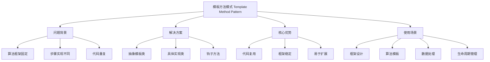
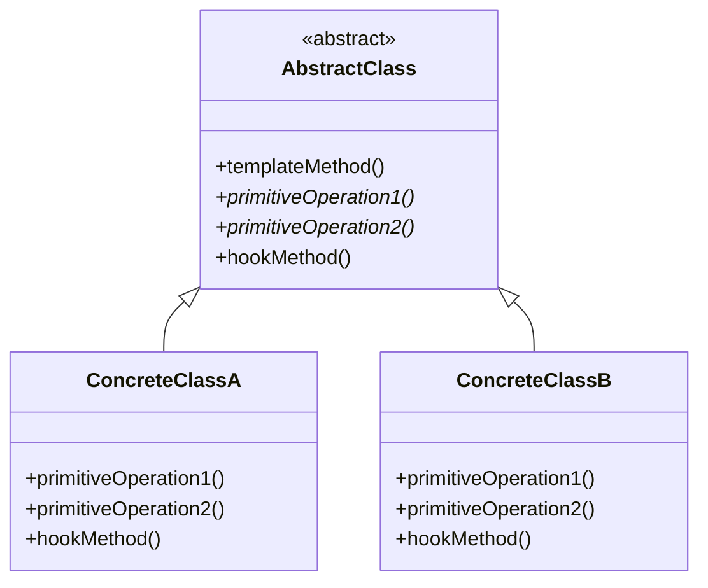

# 📋 模板方法模式详解

[[05-行为型模式/10-策略模式]] ← [[05-行为型模式/12-访问者模式]]
## 🎯 模板方法模式概览

### 📊 模式基本信息



### 🎯 **定义与意图**
模板方法模式定义一个操作中的算法的骨架，而将一些步骤延迟到子类中。模板方法使得子类可以不改变一个算法的结构即可重定义该算法的某些特定步骤。

### 📋 **核心价值**
- **算法框架**: 定义算法的整体结构
- **步骤延迟**: 将具体步骤延迟到子类实现
- **代码复用**: 避免重复的算法框架代码
- **易于扩展**: 可以轻松添加新的实现

## 🏗️ 模板方法模式结构

### 📊 **类图结构**



### 🎯 **角色职责**

#### **AbstractClass (抽象类)**
- 定义抽象的原语操作，具体的子类将重定义它们以实现一个算法的各步骤
- 实现一个模板方法，定义一个算法的骨架

#### **ConcreteClass (具体类)**
- 实现原语操作以完成算法中与特定子类相关的步骤

## 💻 模板方法模式实现

### 🎯 **经典实现：数据处理框架**

```java
// ✅ 抽象数据处理类
public abstract class DataProcessor {
    protected String inputFile;
    protected String outputFile;
    protected List<String> data;
    
    // ✅ 模板方法：定义算法骨架
    public final void processData(String inputFile, String outputFile) {
        System.out.println("开始数据处理流程...");
        
        // 1. 初始化
        initialize(inputFile, outputFile);
        
        // 2. 读取数据
        readData();
        
        // 3. 验证数据
        if (validateData()) {
            // 4. 处理数据
            processDataInternal();
            
            // 5. 后处理
            postProcess();
            
            // 6. 保存结果
            saveResults();
            
            // 7. 清理资源
            cleanup();
        } else {
            System.out.println("数据验证失败，处理终止");
        }
        
        System.out.println("数据处理流程完成");
    }
    
    // ✅ 具体步骤：子类必须实现
    protected abstract void readData();
    protected abstract void processDataInternal();
    protected abstract void saveResults();
    
    // ✅ 钩子方法：子类可以重写
    protected void initialize(String inputFile, String outputFile) {
        this.inputFile = inputFile;
        this.outputFile = outputFile;
        this.data = new ArrayList<>();
        System.out.println("初始化完成");
    }
    
    protected boolean validateData() {
        if (data == null || data.isEmpty()) {
            System.out.println("数据为空，验证失败");
            return false;
        }
        System.out.println("数据验证通过，共 " + data.size() + " 条记录");
        return true;
    }
    
    protected void postProcess() {
        System.out.println("后处理完成");
    }
    
    protected void cleanup() {
        data.clear();
        System.out.println("资源清理完成");
    }
    
    // ✅ 获取处理统计信息
    protected void printStatistics() {
        System.out.println("处理统计 - 输入文件: " + inputFile + ", 输出文件: " + outputFile + 
                          ", 处理记录数: " + (data != null ? data.size() : 0));
    }
}

// ✅ CSV数据处理
public class CSVDataProcessor extends DataProcessor {
    
    @Override
    protected void readData() {
        System.out.println("读取CSV文件: " + inputFile);
        // 模拟读取CSV数据
        data.add("姓名,年龄,城市");
        data.add("张三,25,北京");
        data.add("李四,30,上海");
        data.add("王五,28,广州");
        System.out.println("CSV数据读取完成");
    }
    
    @Override
    protected void processDataInternal() {
        System.out.println("处理CSV数据...");
        // 模拟CSV数据处理
        for (int i = 0; i < data.size(); i++) {
            String line = data.get(i);
            if (i > 0) { // 跳过标题行
                String[] fields = line.split(",");
                if (fields.length >= 3) {
                    String name = fields[0];
                    int age = Integer.parseInt(fields[1]);
                    String city = fields[2];
                    
                    // 处理逻辑：年龄加1
                    age++;
                    data.set(i, name + "," + age + "," + city);
                }
            }
        }
        System.out.println("CSV数据处理完成");
    }
    
    @Override
    protected void saveResults() {
        System.out.println("保存CSV结果到: " + outputFile);
        // 模拟保存CSV文件
        for (String line : data) {
            System.out.println("保存: " + line);
        }
        System.out.println("CSV结果保存完成");
    }
    
    @Override
    protected void postProcess() {
        super.postProcess();
        System.out.println("CSV特定后处理完成");
    }
}

// ✅ JSON数据处理
public class JSONDataProcessor extends DataProcessor {
    
    @Override
    protected void readData() {
        System.out.println("读取JSON文件: " + inputFile);
        // 模拟读取JSON数据
        data.add("{\"name\":\"张三\",\"age\":25,\"city\":\"北京\"}");
        data.add("{\"name\":\"李四\",\"age\":30,\"city\":\"上海\"}");
        data.add("{\"name\":\"王五\",\"age\":28,\"city\":\"广州\"}");
        System.out.println("JSON数据读取完成");
    }
    
    @Override
    protected void processDataInternal() {
        System.out.println("处理JSON数据...");
        // 模拟JSON数据处理
        for (int i = 0; i < data.size(); i++) {
            String json = data.get(i);
            // 简单的JSON处理：年龄加1
            json = json.replaceAll("\"age\":(\\d+)", (match) -> {
                int age = Integer.parseInt(match.group(1));
                return "\"age\":" + (age + 1);
            });
            data.set(i, json);
        }
        System.out.println("JSON数据处理完成");
    }
    
    @Override
    protected void saveResults() {
        System.out.println("保存JSON结果到: " + outputFile);
        // 模拟保存JSON文件
        for (String json : data) {
            System.out.println("保存: " + json);
        }
        System.out.println("JSON结果保存完成");
    }
    
    @Override
    protected boolean validateData() {
        boolean isValid = super.validateData();
        if (isValid) {
            // JSON特定验证
            for (String json : data) {
                if (!json.trim().startsWith("{")) {
                    System.out.println("JSON格式验证失败");
                    return false;
                }
            }
            System.out.println("JSON格式验证通过");
        }
        return isValid;
    }
}

// ✅ XML数据处理
public class XMLDataProcessor extends DataProcessor {
    
    @Override
    protected void readData() {
        System.out.println("读取XML文件: " + inputFile);
        // 模拟读取XML数据
        data.add("<?xml version=\"1.0\" encoding=\"UTF-8\"?>");
        data.add("<root>");
        data.add("  <person name=\"张三\" age=\"25\" city=\"北京\"/>");
        data.add("  <person name=\"李四\" age=\"30\" city=\"上海\"/>");
        data.add("  <person name=\"王五\" age=\"28\" city=\"广州\"/>");
        data.add("</root>");
        System.out.println("XML数据读取完成");
    }
    
    @Override
    protected void processDataInternal() {
        System.out.println("处理XML数据...");
        // 模拟XML数据处理
        for (int i = 0; i < data.size(); i++) {
            String line = data.get(i);
            if (line.contains("age=")) {
                // 年龄加1
                line = line.replaceAll("age=\"(\\d+)\"", (match) -> {
                    int age = Integer.parseInt(match.group(1));
                    return "age=\"" + (age + 1) + "\"";
                });
                data.set(i, line);
            }
        }
        System.out.println("XML数据处理完成");
    }
    
    @Override
    protected void saveResults() {
        System.out.println("保存XML结果到: " + outputFile);
        // 模拟保存XML文件
        for (String line : data) {
            System.out.println("保存: " + line);
        }
        System.out.println("XML结果保存完成");
    }
    
    @Override
    protected void initialize(String inputFile, String outputFile) {
        super.initialize(inputFile, outputFile);
        System.out.println("XML处理器特定初始化");
    }
}

// ✅ 数据处理工厂
public class DataProcessorFactory {
    
    public static DataProcessor createProcessor(String fileType) {
        switch (fileType.toLowerCase()) {
            case "csv":
                return new CSVDataProcessor();
            case "json":
                return new JSONDataProcessor();
            case "xml":
                return new XMLDataProcessor();
            default:
                throw new IllegalArgumentException("不支持的文件类型: " + fileType);
        }
    }
    
    public static List<String> getSupportedTypes() {
        return Arrays.asList("csv", "json", "xml");
    }
}

// ✅ 客户端使用示例
public class TemplateMethodDemo {
    public static void main(String[] args) {
        System.out.println("=== 模板方法模式演示 ===");
        
        // ✅ CSV数据处理
        System.out.println("\n--- CSV数据处理 ---");
        DataProcessor csvProcessor = DataProcessorFactory.createProcessor("csv");
        csvProcessor.processData("input.csv", "output.csv");
        
        // ✅ JSON数据处理
        System.out.println("\n--- JSON数据处理 ---");
        DataProcessor jsonProcessor = DataProcessorFactory.createProcessor("json");
        jsonProcessor.processData("input.json", "output.json");
        
        // ✅ XML数据处理
        System.out.println("\n--- XML数据处理 ---");
        DataProcessor xmlProcessor = DataProcessorFactory.createProcessor("xml");
        xmlProcessor.processData("input.xml", "output.xml");
        
        // ✅ 演示模板方法模式的优势
        System.out.println("\n=== 模板方法模式优势演示 ===");
        
        // 算法框架固定，具体实现可以不同
        System.out.println("所有处理器都遵循相同的处理流程:");
        System.out.println("1. 初始化");
        System.out.println("2. 读取数据");
        System.out.println("3. 验证数据");
        System.out.println("4. 处理数据");
        System.out.println("5. 后处理");
        System.out.println("6. 保存结果");
        System.out.println("7. 清理资源");
        
        // 可以轻松添加新的处理器类型
        System.out.println("\n支持的文件类型: " + DataProcessorFactory.getSupportedTypes());
    }
}
```

### 🚀 **现代企业级实现：Spring框架应用**

```java
// ✅ Spring Boot应用模板
public abstract class SpringBootApplicationTemplate {
    
    // ✅ 模板方法：应用启动流程
    public final void run(String[] args) {
        System.out.println("Spring Boot应用启动...");
        
        // 1. 初始化应用上下文
        initializeApplicationContext();
        
        // 2. 配置应用
        configureApplication();
        
        // 3. 启动应用
        startApplication();
        
        // 4. 后处理
        postStartup();
        
        System.out.println("Spring Boot应用启动完成");
    }
    
    // ✅ 抽象方法：子类必须实现
    protected abstract void configureApplication();
    protected abstract void startApplication();
    
    // ✅ 钩子方法：子类可以重写
    protected void initializeApplicationContext() {
        System.out.println("初始化Spring应用上下文");
    }
    
    protected void postStartup() {
        System.out.println("应用启动后处理完成");
    }
}

// ✅ Web应用实现
public class WebApplication extends SpringBootApplicationTemplate {
    
    @Override
    protected void configureApplication() {
        System.out.println("配置Web应用...");
        System.out.println("- 配置Web服务器");
        System.out.println("- 配置MVC框架");
        System.out.println("- 配置安全框架");
    }
    
    @Override
    protected void startApplication() {
        System.out.println("启动Web应用...");
        System.out.println("- 启动Tomcat服务器");
        System.out.println("- 注册Web端点");
        System.out.println("- 启动Web服务");
    }
    
    @Override
    protected void postStartup() {
        super.postStartup();
        System.out.println("Web应用特定后处理");
    }
}

// ✅ 微服务应用实现
public class MicroserviceApplication extends SpringBootApplicationTemplate {
    
    @Override
    protected void configureApplication() {
        System.out.println("配置微服务应用...");
        System.out.println("- 配置服务发现");
        System.out.println("- 配置配置中心");
        System.out.println("- 配置监控");
    }
    
    @Override
    protected void startApplication() {
        System.out.println("启动微服务应用...");
        System.out.println("- 注册到服务注册中心");
        System.out.println("- 启动健康检查");
        System.out.println("- 启动服务端点");
    }
    
    @Override
    protected void initializeApplicationContext() {
        super.initializeApplicationContext();
        System.out.println("微服务特定初始化");
    }
}
```

## 🔧 模板方法模式高级技巧

### 🎯 **钩子方法设计**

```java
// ✅ 高级模板方法
public abstract class AdvancedTemplate {
    
    public final void execute() {
        beforeExecute();
        
        if (shouldExecute()) {
            doExecute();
        }
        
        afterExecute();
    }
    
    protected abstract void doExecute();
    
    // ✅ 钩子方法：默认实现，子类可以重写
    protected void beforeExecute() {
        System.out.println("执行前准备");
    }
    
    protected void afterExecute() {
        System.out.println("执行后清理");
    }
    
    protected boolean shouldExecute() {
        return true;
    }
}
```

## 🚀 模板方法模式最佳实践

### 📋 **使用指南**

1. **设计原则**:
   - 将不变的部分放在模板方法中
   - 将变化的部分延迟到子类实现
   - 使用钩子方法提供扩展点

2. **实现技巧**:
   - 合理使用final关键字
   - 提供清晰的抽象方法
   - 设计有用的钩子方法

3. **扩展策略**:
   - 通过继承扩展功能
   - 使用组合模式增强灵活性
   - 考虑使用策略模式替代继承

### ⚠️ **注意事项**

1. **继承限制**: 模板方法模式使用继承，可能限制灵活性
2. **方法数量**: 避免过多的抽象方法
3. **复杂度**: 确保模板方法不会过于复杂
4. **测试**: 模板方法模式可能增加测试难度

## 📊 与其他模式的对比

| 对比维度 | 模板方法模式 | 策略模式 | 工厂方法模式 |
|----------|--------------|----------|--------------|
| **目的** | 算法框架 | 算法选择 | 对象创建 |
| **结构** | 继承关系 | 组合关系 | 继承关系 |
| **使用** | 固定流程 | 动态选择 | 对象创建 |
| **扩展** | 子类实现 | 策略实现 | 产品实现 |

## 🔗 学习衔接

- **上一模式** ← [[策略模式]]
- **下一模式** → [[访问者模式]]
- **模式对比** → [[05-行为型模式/13-行为型模式对比表]]
- **框架设计** → [[设计模式最佳实践秘典]]

---
**💡 模板方法模式精髓**: 模板方法模式就像一个标准化的生产流程，它定义了产品的制造步骤，但具体的实现细节可以由不同的生产线（子类）来完成。就像汽车制造，组装流程是固定的，但不同型号的汽车可以使用不同的零件和工艺！
