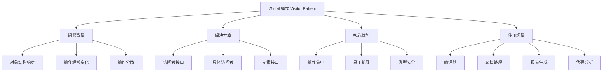
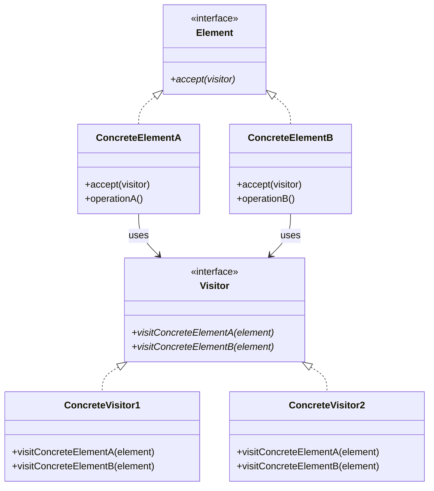

# 👥 访问者模式详解

[[05-行为型模式/11-模板方法模式]] ← [[05-行为型模式/13-行为型模式对比表]]
## 🎯 访问者模式概览

### 📊 模式基本信息



### 🎯 **定义与意图**
访问者模式表示一个作用于某对象结构中的各元素的操作。它使你可以在不改变各元素的类的前提下定义作用于这些元素的新操作。

### 📋 **核心价值**
- **操作集中**: 将相关操作集中在一个访问者中
- **易于扩展**: 可以轻松添加新的操作
- **类型安全**: 编译时类型检查
- **双重分发**: 利用多态实现动态绑定

## 🏗️ 访问者模式结构

### 📊 **类图结构**



### 🎯 **角色职责**

#### **Visitor (访问者接口)**
- 声明访问者可以访问哪些元素
- 为每个具体元素类声明一个访问操作

#### **ConcreteVisitor (具体访问者)**
- 实现每个由Visitor声明的操作
- 每个操作实现算法的一部分

#### **Element (元素接口)**
- 声明一个accept操作，它以一个访问者为参数

#### **ConcreteElement (具体元素)**
- 实现accept操作，通常调用访问者的访问方法

## 💻 访问者模式实现

### 🎯 **经典实现：文档处理系统**

```java
// ✅ 访问者接口
public interface DocumentVisitor {
    void visitTextElement(TextElement element);
    void visitImageElement(ImageElement element);
    void visitTableElement(TableElement element);
    void visitListElement(ListElement element);
}

// ✅ 元素接口
public interface DocumentElement {
    void accept(DocumentVisitor visitor);
    String getContent();
    ElementType getType();
}

// ✅ 元素类型枚举
public enum ElementType {
    TEXT, IMAGE, TABLE, LIST
}

// ✅ 文本元素
public class TextElement implements DocumentElement {
    private final String content;
    private final String style;
    
    public TextElement(String content, String style) {
        this.content = content;
        this.style = style;
    }
    
    @Override
    public void accept(DocumentVisitor visitor) {
        visitor.visitTextElement(this);
    }
    
    @Override
    public String getContent() {
        return content;
    }
    
    @Override
    public ElementType getType() {
        return ElementType.TEXT;
    }
    
    public String getStyle() {
        return style;
    }
    
    public int getWordCount() {
        return content.split("\\s+").length;
    }
    
    public int getCharacterCount() {
        return content.length();
    }
}

// ✅ 图片元素
public class ImageElement implements DocumentElement {
    private final String imagePath;
    private final String altText;
    private final int width;
    private final int height;
    
    public ImageElement(String imagePath, String altText, int width, int height) {
        this.imagePath = imagePath;
        this.altText = altText;
        this.width = width;
        this.height = height;
    }
    
    @Override
    public void accept(DocumentVisitor visitor) {
        visitor.visitImageElement(this);
    }
    
    @Override
    public String getContent() {
        return altText;
    }
    
    @Override
    public ElementType getType() {
        return ElementType.IMAGE;
    }
    
    public String getImagePath() {
        return imagePath;
    }
    
    public String getAltText() {
        return altText;
    }
    
    public int getWidth() {
        return width;
    }
    
    public int getHeight() {
        return height;
    }
    
    public long getFileSize() {
        // 模拟获取文件大小
        return width * height * 3; // 假设RGB格式
    }
}

// ✅ 表格元素
public class TableElement implements DocumentElement {
    private final List<List<String>> data;
    private final String title;
    
    public TableElement(String title, List<List<String>> data) {
        this.title = title;
        this.data = new ArrayList<>(data);
    }
    
    @Override
    public void accept(DocumentVisitor visitor) {
        visitor.visitTableElement(this);
    }
    
    @Override
    public String getContent() {
        return title;
    }
    
    @Override
    public ElementType getType() {
        return ElementType.TABLE;
    }
    
    public String getTitle() {
        return title;
    }
    
    public List<List<String>> getData() {
        return new ArrayList<>(data);
    }
    
    public int getRowCount() {
        return data.size();
    }
    
    public int getColumnCount() {
        return data.isEmpty() ? 0 : data.get(0).size();
    }
    
    public int getCellCount() {
        return data.stream().mapToInt(List::size).sum();
    }
}

// ✅ 列表元素
public class ListElement implements DocumentElement {
    private final List<String> items;
    private final String title;
    private final boolean ordered;
    
    public ListElement(String title, List<String> items, boolean ordered) {
        this.title = title;
        this.items = new ArrayList<>(items);
        this.ordered = ordered;
    }
    
    @Override
    public void accept(DocumentVisitor visitor) {
        visitor.visitListElement(this);
    }
    
    @Override
    public String getContent() {
        return title;
    }
    
    @Override
    public ElementType getType() {
        return ElementType.LIST;
    }
    
    public String getTitle() {
        return title;
    }
    
    public List<String> getItems() {
        return new ArrayList<>(items);
    }
    
    public boolean isOrdered() {
        return ordered;
    }
    
    public int getItemCount() {
        return items.size();
    }
}

// ✅ 文档统计访问者
public class DocumentStatisticsVisitor implements DocumentVisitor {
    private int textElementCount = 0;
    private int imageElementCount = 0;
    private int tableElementCount = 0;
    private int listElementCount = 0;
    private int totalWordCount = 0;
    private int totalCharacterCount = 0;
    private long totalImageSize = 0;
    private int totalTableCells = 0;
    private int totalListItems = 0;
    
    @Override
    public void visitTextElement(TextElement element) {
        textElementCount++;
        totalWordCount += element.getWordCount();
        totalCharacterCount += element.getCharacterCount();
        System.out.println("统计文本元素: " + element.getContent().substring(0, Math.min(20, element.getContent().length())) + "...");
    }
    
    @Override
    public void visitImageElement(ImageElement element) {
        imageElementCount++;
        totalImageSize += element.getFileSize();
        System.out.println("统计图片元素: " + element.getAltText() + " (" + element.getWidth() + "x" + element.getHeight() + ")");
    }
    
    @Override
    public void visitTableElement(TableElement element) {
        tableElementCount++;
        totalTableCells += element.getCellCount();
        System.out.println("统计表格元素: " + element.getTitle() + " (" + element.getRowCount() + "行" + element.getColumnCount() + "列)");
    }
    
    @Override
    public void visitListElement(ListElement element) {
        listElementCount++;
        totalListItems += element.getItemCount();
        System.out.println("统计列表元素: " + element.getTitle() + " (" + element.getItemCount() + "项)");
    }
    
    // ✅ 获取统计结果
    public DocumentStatistics getStatistics() {
        return new DocumentStatistics(
            textElementCount, imageElementCount, tableElementCount, listElementCount,
            totalWordCount, totalCharacterCount, totalImageSize, totalTableCells, totalListItems
        );
    }
    
    // ✅ 重置统计
    public void reset() {
        textElementCount = 0;
        imageElementCount = 0;
        tableElementCount = 0;
        listElementCount = 0;
        totalWordCount = 0;
        totalCharacterCount = 0;
        totalImageSize = 0;
        totalTableCells = 0;
        totalListItems = 0;
    }
}

// ✅ 文档导出访问者
public class DocumentExportVisitor implements DocumentVisitor {
    private final StringBuilder output;
    private final ExportFormat format;
    
    public DocumentExportVisitor(ExportFormat format) {
        this.output = new StringBuilder();
        this.format = format;
    }
    
    @Override
    public void visitTextElement(TextElement element) {
        switch (format) {
            case HTML:
                output.append("<p class=\"").append(element.getStyle()).append("\">")
                      .append(element.getContent()).append("</p>\n");
                break;
            case MARKDOWN:
                output.append(element.getContent()).append("\n\n");
                break;
            case XML:
                output.append("<text style=\"").append(element.getStyle()).append("\">")
                      .append(element.getContent()).append("</text>\n");
                break;
        }
    }
    
    @Override
    public void visitImageElement(ImageElement element) {
        switch (format) {
            case HTML:
                output.append("\n");
                break;
            case MARKDOWN:
                output.append("
                      .append(element.getImagePath()).append(")\n");
                break;
            case XML:
                output.append("<image path=\"").append(element.getImagePath())
                      .append("\" alt=\"").append(element.getAltText())
                      .append("\" width=\"").append(element.getWidth())
                      .append("\" height=\"").append(element.getHeight()).append("\"/>\n");
                break;
        }
    }
    
    @Override
    public void visitTableElement(TableElement element) {
        switch (format) {
            case HTML:
                output.append("<table>\n<caption>").append(element.getTitle()).append("</caption>\n");
                for (List<String> row : element.getData()) {
                    output.append("<tr>");
                    for (String cell : row) {
                        output.append("<td>").append(cell).append("</td>");
                    }
                    output.append("</tr>\n");
                }
                output.append("</table>\n");
                break;
            case MARKDOWN:
                output.append("## ").append(element.getTitle()).append("\n\n");
                if (!element.getData().isEmpty()) {
                    // 表头
                    List<String> header = element.getData().get(0);
                    output.append("| ").append(String.join(" | ", header)).append(" |\n");
                    output.append("| ").append(String.join(" | ", Collections.nCopies(header.size(), "---"))).append(" |\n");
                    
                    // 数据行
                    for (int i = 1; i < element.getData().size(); i++) {
                        output.append("| ").append(String.join(" | ", element.getData().get(i))).append(" |\n");
                    }
                }
                output.append("\n");
                break;
            case XML:
                output.append("<table title=\"").append(element.getTitle()).append("\">\n");
                for (List<String> row : element.getData()) {
                    output.append("<row>");
                    for (String cell : row) {
                        output.append("<cell>").append(cell).append("</cell>");
                    }
                    output.append("</row>\n");
                }
                output.append("</table>\n");
                break;
        }
    }
    
    @Override
    public void visitListElement(ListElement element) {
        switch (format) {
            case HTML:
                String tag = element.isOrdered() ? "ol" : "ul";
                output.append("<").append(tag).append(">\n<li>").append(element.getTitle()).append("</li>\n");
                for (String item : element.getItems()) {
                    output.append("<li>").append(item).append("</li>\n");
                }
                output.append("</").append(tag).append(">\n");
                break;
            case MARKDOWN:
                output.append("## ").append(element.getTitle()).append("\n\n");
                for (int i = 0; i < element.getItems().size(); i++) {
                    String prefix = element.isOrdered() ? (i + 1) + ". " : "- ";
                    output.append(prefix).append(element.getItems().get(i)).append("\n");
                }
                output.append("\n");
                break;
            case XML:
                String listType = element.isOrdered() ? "ordered" : "unordered";
                output.append("<list type=\"").append(listType).append("\" title=\"").append(element.getTitle()).append("\">\n");
                for (String item : element.getItems()) {
                    output.append("<item>").append(item).append("</item>\n");
                }
                output.append("</list>\n");
                break;
        }
    }
    
    public String getOutput() {
        return output.toString();
    }
    
    public void clear() {
        output.setLength(0);
    }
}

// ✅ 导出格式枚举
public enum ExportFormat {
    HTML, MARKDOWN, XML
}

// ✅ 文档统计信息
public class DocumentStatistics {
    private final int textElementCount;
    private final int imageElementCount;
    private final int tableElementCount;
    private final int listElementCount;
    private final int totalWordCount;
    private final int totalCharacterCount;
    private final long totalImageSize;
    private final int totalTableCells;
    private final int totalListItems;
    
    public DocumentStatistics(int textElementCount, int imageElementCount, int tableElementCount, int listElementCount,
                            int totalWordCount, int totalCharacterCount, long totalImageSize, 
                            int totalTableCells, int totalListItems) {
        this.textElementCount = textElementCount;
        this.imageElementCount = imageElementCount;
        this.tableElementCount = tableElementCount;
        this.listElementCount = listElementCount;
        this.totalWordCount = totalWordCount;
        this.totalCharacterCount = totalCharacterCount;
        this.totalImageSize = totalImageSize;
        this.totalTableCells = totalTableCells;
        this.totalListItems = totalListItems;
    }
    
    // Getters
    public int getTextElementCount() { return textElementCount; }
    public int getImageElementCount() { return imageElementCount; }
    public int getTableElementCount() { return tableElementCount; }
    public int getListElementCount() { return listElementCount; }
    public int getTotalWordCount() { return totalWordCount; }
    public int getTotalCharacterCount() { return totalCharacterCount; }
    public long getTotalImageSize() { return totalImageSize; }
    public int getTotalTableCells() { return totalTableCells; }
    public int getTotalListItems() { return totalListItems; }
    
    public int getTotalElementCount() {
        return textElementCount + imageElementCount + tableElementCount + listElementCount;
    }
    
    @Override
    public String toString() {
        return String.format("文档统计 - 总元素: %d, 文本: %d, 图片: %d, 表格: %d, 列表: %d\n" +
                           "单词数: %d, 字符数: %d, 图片大小: %d bytes, 表格单元格: %d, 列表项: %d",
                           getTotalElementCount(), textElementCount, imageElementCount, 
                           tableElementCount, listElementCount, totalWordCount, totalCharacterCount,
                           totalImageSize, totalTableCells, totalListItems);
    }
}

// ✅ 文档类
public class Document {
    private final List<DocumentElement> elements;
    private final String title;
    
    public Document(String title) {
        this.title = title;
        this.elements = new ArrayList<>();
    }
    
    public void addElement(DocumentElement element) {
        elements.add(element);
    }
    
    public void removeElement(DocumentElement element) {
        elements.remove(element);
    }
    
    public List<DocumentElement> getElements() {
        return new ArrayList<>(elements);
    }
    
    public String getTitle() {
        return title;
    }
    
    // ✅ 接受访问者
    public void accept(DocumentVisitor visitor) {
        System.out.println("访问文档: " + title);
        for (DocumentElement element : elements) {
            element.accept(visitor);
        }
    }
    
    // ✅ 获取元素数量
    public int getElementCount() {
        return elements.size();
    }
    
    // ✅ 按类型获取元素
    public List<DocumentElement> getElementsByType(ElementType type) {
        return elements.stream()
            .filter(element -> element.getType() == type)
            .collect(Collectors.toList());
    }
}

// ✅ 客户端使用示例
public class VisitorPatternDemo {
    public static void main(String[] args) {
        // ✅ 创建文档
        Document document = new Document("设计模式文档");
        
        // ✅ 添加元素
        document.addElement(new TextElement("设计模式是软件工程中的重要概念", "normal"));
        document.addElement(new TextElement("它们提供了解决常见问题的标准方案", "bold"));
        
        document.addElement(new ImageElement("pattern-diagram.png", "设计模式图", 800, 600));
        
        List<List<String>> tableData = Arrays.asList(
            Arrays.asList("模式", "类型", "用途"),
            Arrays.asList("单例", "创建型", "确保只有一个实例"),
            Arrays.asList("观察者", "行为型", "对象间通信")
        );
        document.addElement(new TableElement("常用设计模式", tableData));
        
        List<String> listItems = Arrays.asList("创建型模式", "结构型模式", "行为型模式");
        document.addElement(new ListElement("设计模式分类", listItems, true));
        
        // ✅ 使用统计访问者
        System.out.println("=== 文档统计 ===");
        DocumentStatisticsVisitor statsVisitor = new DocumentStatisticsVisitor();
        document.accept(statsVisitor);
        
        DocumentStatistics stats = statsVisitor.getStatistics();
        System.out.println("\n统计结果:");
        System.out.println(stats);
        
        // ✅ 使用导出访问者
        System.out.println("\n=== HTML导出 ===");
        DocumentExportVisitor htmlVisitor = new DocumentExportVisitor(ExportFormat.HTML);
        document.accept(htmlVisitor);
        System.out.println(htmlVisitor.getOutput());
        
        System.out.println("\n=== Markdown导出 ===");
        DocumentExportVisitor markdownVisitor = new DocumentExportVisitor(ExportFormat.MARKDOWN);
        document.accept(markdownVisitor);
        System.out.println(markdownVisitor.getOutput());
        
        System.out.println("\n=== XML导出 ===");
        DocumentExportVisitor xmlVisitor = new DocumentExportVisitor(ExportFormat.XML);
        document.accept(xmlVisitor);
        System.out.println(xmlVisitor.getOutput());
        
        // ✅ 演示访问者模式的优势
        System.out.println("\n=== 访问者模式优势演示 ===");
        
        // 可以轻松添加新的操作（访问者）
        System.out.println("添加新的访问者类型:");
        
        // 验证访问者
        DocumentValidationVisitor validationVisitor = new DocumentValidationVisitor();
        document.accept(validationVisitor);
        
        // 搜索访问者
        DocumentSearchVisitor searchVisitor = new DocumentSearchVisitor("设计");
        document.accept(searchVisitor);
        
        System.out.println("搜索结果: " + searchVisitor.getSearchResults().size() + " 个匹配项");
    }
}

// ✅ 文档验证访问者
class DocumentValidationVisitor implements DocumentVisitor {
    private final List<String> errors;
    
    public DocumentValidationVisitor() {
        this.errors = new ArrayList<>();
    }
    
    @Override
    public void visitTextElement(TextElement element) {
        if (element.getContent().trim().isEmpty()) {
            errors.add("发现空文本元素");
        }
    }
    
    @Override
    public void visitImageElement(ImageElement element) {
        if (element.getWidth() <= 0 || element.getHeight() <= 0) {
            errors.add("图片尺寸无效: " + element.getImagePath());
        }
    }
    
    @Override
    public void visitTableElement(TableElement element) {
        if (element.getData().isEmpty()) {
            errors.add("表格为空: " + element.getTitle());
        }
    }
    
    @Override
    public void visitListElement(ListElement element) {
        if (element.getItems().isEmpty()) {
            errors.add("列表为空: " + element.getTitle());
        }
    }
    
    public List<String> getErrors() {
        return new ArrayList<>(errors);
    }
    
    public boolean isValid() {
        return errors.isEmpty();
    }
}

// ✅ 文档搜索访问者
class DocumentSearchVisitor implements DocumentVisitor {
    private final String searchTerm;
    private final List<DocumentElement> searchResults;
    
    public DocumentSearchVisitor(String searchTerm) {
        this.searchTerm = searchTerm.toLowerCase();
        this.searchResults = new ArrayList<>();
    }
    
    @Override
    public void visitTextElement(TextElement element) {
        if (element.getContent().toLowerCase().contains(searchTerm)) {
            searchResults.add(element);
        }
    }
    
    @Override
    public void visitImageElement(ImageElement element) {
        if (element.getAltText().toLowerCase().contains(searchTerm)) {
            searchResults.add(element);
        }
    }
    
    @Override
    public void visitTableElement(TableElement element) {
        if (element.getTitle().toLowerCase().contains(searchTerm)) {
            searchResults.add(element);
        } else {
            for (List<String> row : element.getData()) {
                for (String cell : row) {
                    if (cell.toLowerCase().contains(searchTerm)) {
                        searchResults.add(element);
                        return;
                    }
                }
            }
        }
    }
    
    @Override
    public void visitListElement(ListElement element) {
        if (element.getTitle().toLowerCase().contains(searchTerm)) {
            searchResults.add(element);
        } else {
            for (String item : element.getItems()) {
                if (item.toLowerCase().contains(searchTerm)) {
                    searchResults.add(element);
                    return;
                }
            }
        }
    }
    
    public List<DocumentElement> getSearchResults() {
        return new ArrayList<>(searchResults);
    }
}
```

## 🔧 访问者模式高级技巧

### 🎯 **双重分发机制**

```java
// ✅ 高级访问者模式
public abstract class AdvancedVisitor {
    // ✅ 双重分发：元素调用访问者的方法
    public abstract void visit(Element element);
    
    // ✅ 具体元素的访问方法
    protected abstract void visitElementA(ElementA element);
    protected abstract void visitElementB(ElementB element);
}

// ✅ 元素基类
public abstract class Element {
    public abstract void accept(Visitor visitor);
}

// ✅ 具体元素A
public class ElementA extends Element {
    @Override
    public void accept(Visitor visitor) {
        visitor.visit(this); // 第一次分发
    }
}

// ✅ 具体访问者
public class ConcreteVisitor extends AdvancedVisitor {
    @Override
    public void visit(Element element) {
        if (element instanceof ElementA) {
            visitElementA((ElementA) element); // 第二次分发
        } else if (element instanceof ElementB) {
            visitElementB((ElementB) element); // 第二次分发
        }
    }
    
    @Override
    protected void visitElementA(ElementA element) {
        // 处理ElementA
    }
    
    @Override
    protected void visitElementB(ElementB element) {
        // 处理ElementB
    }
}
```

## 🚀 访问者模式最佳实践

### 📋 **使用指南**

1. **设计原则**:
   - 对象结构相对稳定
   - 经常需要添加新的操作
   - 操作与对象结构分离

2. **实现技巧**:
   - 使用双重分发机制
   - 提供默认的空实现
   - 考虑访问者的状态管理

3. **扩展策略**:
   - 通过添加新的访问者扩展功能
   - 使用组合模式增强灵活性
   - 考虑访问者的生命周期管理

### ⚠️ **注意事项**

1. **类型安全**: 访问者模式依赖类型检查
2. **扩展性**: 添加新元素类型需要修改所有访问者
3. **复杂度**: 访问者模式可能增加系统复杂度
4. **性能**: 双重分发可能影响性能

## 📊 与其他模式的对比

| 对比维度 | 访问者模式 | 命令模式 | 策略模式 |
|----------|------------|----------|----------|
| **目的** | 操作集中 | 请求封装 | 算法选择 |
| **结构** | 双重分发 | 命令对象 | 策略对象 |
| **使用** | 对象遍历 | 请求处理 | 算法切换 |
| **扩展** | 添加操作 | 添加命令 | 添加策略 |

## 🔗 学习衔接

- **上一模式** ← [[模板方法模式]]
- **下一模式** → [[行为型模式对比表]]
- **模式对比** → [[05-行为型模式/13-行为型模式对比表]]
- **编译器设计** → [[设计模式最佳实践秘典]]

---
**💡 访问者模式精髓**: 访问者模式就像一个专业的检查员，它可以访问工厂里的各种设备（对象），并对每种设备进行专业的检查和操作。设备不需要知道检查员具体要做什么，只需要接受检查员的访问，而检查员可以根据设备类型执行相应的专业操作！
