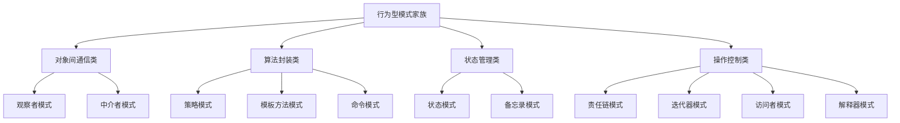
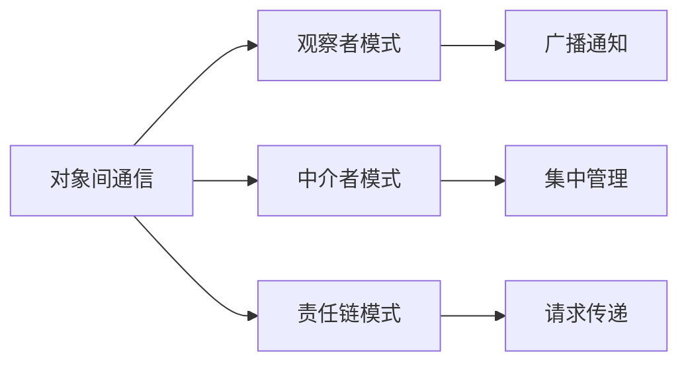
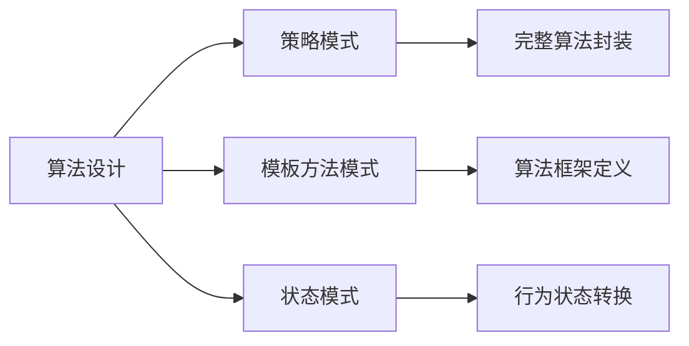
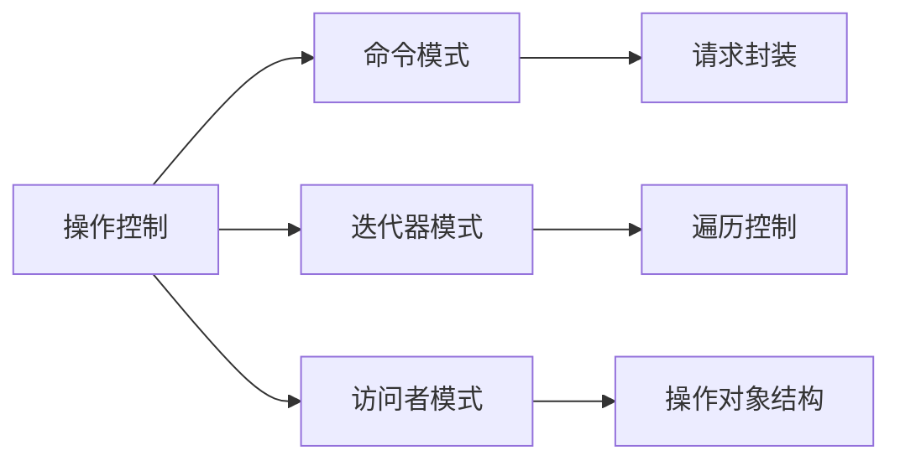
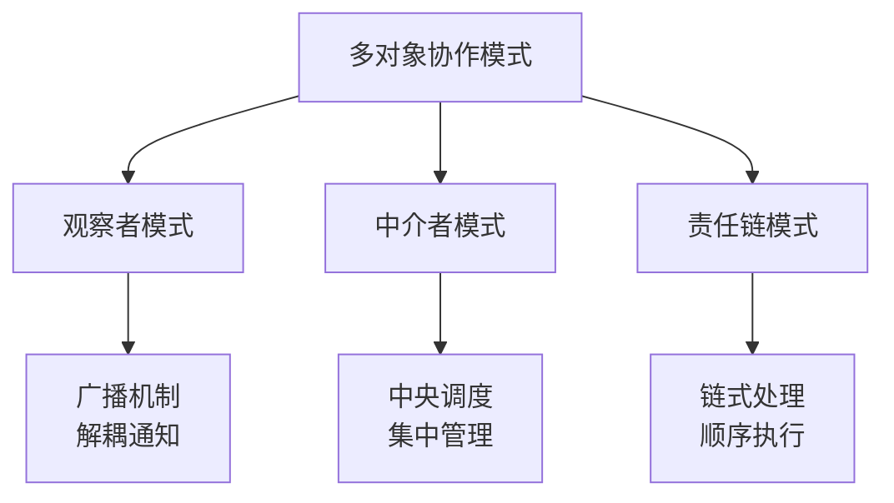
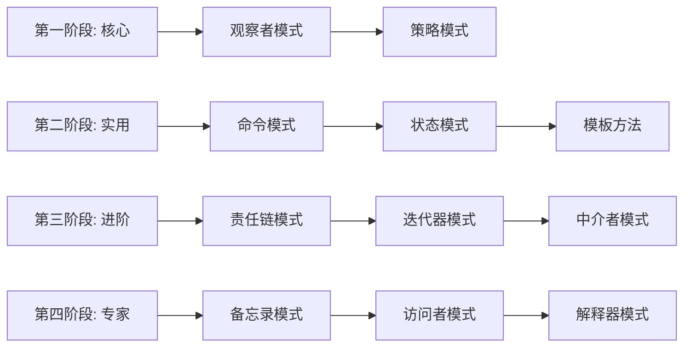

# 行为型模式对比表

[[10-策略模式]] ← → [[04-结构型模式/01-结构型模式概述]]
## 📊 行为型模式全景对比

### 🎯 十一大行为型模式概览

| 模式 | 解决的核心问题 | 关键机制 | 复杂度 | 使用频率 | 学习难度 |
|------|----------------|----------|--------|----------|------------|
| **观察者模式** | 一对多依赖关系 | 通知机制 | ⭐⭐ | ⭐⭐⭐⭐⭐ | ⭐⭐ |
| **策略模式** | 算法族选择 | 封装算法 | ⭐⭐ | ⭐⭐⭐⭐⭐ | ⭐⭐ |
| **命令模式** | 请求封装执行 | 对象封装 | ⭐⭐⭐ | ⭐⭐⭐⭐ | ⭐⭐⭐ |
| **状态模式** | 状态转换 | 状态对象 | ⭐⭐⭐⭐ | ⭐⭐⭐⭐ | ⭐⭐⭐⭐ |
| **责任链模式** | 请求传递 | 链式处理 | ⭐⭐⭐ | ⭐⭐⭐ | ⭐⭐⭐ |
| **迭代器模式** | 统一遍历 | 遍历接口 | ⭐⭐ | ⭐⭐⭐⭐ | ⭐⭐ |
| **模板方法模式** | 算法框架 | 定义骨架 | ⭐⭐⭐ | ⭐⭐⭐ | ⭐⭐⭐ |
| **中介者模式** | 对象通信 | 中心协调 | ⭐⭐⭐⭐ | ⭐⭐ | ⭐⭐⭐⭐ |
| **备忘录模式** | 状态保存恢复 | 快照机制 | ⭐⭐⭐ | ⭐⭐ | ⭐⭐⭐ |
| **解释器模式** | 语言解析 | 语法规则 | ⭐⭐⭐⭐⭐ | ⭐ | ⭐⭐⭐⭐⭐ |
| **访问者模式** | 对象操作 | 双重分派 | ⭐⭐⭐⭐⭐ | ⭐⭐ | ⭐⭐⭐⭐⭐ |

## 🔄 模式关系图谱



### 📈 使用频率统计

| 频率 | 模式 | 主要应用场景 |
|------|------|-------------|
| **⭐⭐⭐⭐⭐** | 观察者、策略 | MVC架构、支付系统、UI事件 |
| **⭐⭐⭐⭐** | 命令、状态、迭代器、模板方法 | 撤销系统、状态机、集合遍历 |
| **⭐⭐⭐** | 责任链、中介者 | 中间件、消息传递 |
| **⭐⭐** | 备忘录、访问者 | 游戏存档、AST遍历 |
| **⭐** | 解释器 | 特定领域语言 |

## 🎯 按问题类型分类对比

### 📱 通信类模式对比



#### 🔍 通信模式详细对比

| 特性 | 观察者模式 | 中介者模式 | 责任链模式 |
|------|------------|------------|------------|
| **耦合度** | 低（解耦） | 中（集中） | 低（独立） |
| **通信方向** | 一对多 | 多对多 | 一对一连串 |
| **灵活性** | 高（动态订阅） | 中（统一管理） | 高（链式处理） |
| **复杂度** | 简单 | 中等 | 中等 |
| **适用场景** | 事件通知 | 组件协调 | 中间件链 |

### 🧮 算法类模式对比



#### 🔍 算法模式详细对比

| 特性 | 策略模式 | 模板方法模式 | 状态模式 |
|------|----------|-------------|----------|
| **抽象层次** | 算法完整封装 | 算法骨架定义 | 行为状态封装 |
| **扩展方式** | 新增策略实现 | 子类重写方法 | 状态转换 |
| **代码复用** | 算法策略复用 | 骨架代码复用 | 状态行为复用 |
| **运行时变化** | 算法切换 | 执行顺序固定 | 状态动态变化 |
| **继承依赖** | 无继承 | 弱依赖继承 | 强状态继承 |

### 🎮 控制类模式对比



#### 🔍 控制模式详细对比

| 特性 | 命令模式 | 迭代器模式 | 访问者模式 |
|------|----------|------------|------------|
| **封装对象** | 请求操作 | 遍历过程 | 对象操作 |
| **支持操作** | 执行、撤销、排队 | 遍历、查询 | 访问、修改 |
| **结构影响** | 不影响原结构 | 不改变原结构 | 扩展操作范围 |
| **设计复杂度** | 中等 | 简单 | 复杂 |
| **使用场景** | UI操作、撤销重做 | 集合遍历 | 编译器、AST |

## 📊 深度对比分析

### 🏆 核心竞品对比：观察者 vs 中介者 vs 责任链



#### 📋 详细选择指南

| 场景特征 | 观察者模式 | 中介者模式 | 责任链模式 |
|----------|------------|------------|------------|
| **需要广播通知** | ✅ 完美匹配 | ❌ 不适合 | ❌ 不适合 |
| **需要中央协调** | ❌ 分散管理 | ✅ 完美匹配 | ❌ 无中心控制 |
| **需要顺序处理** | ❌ 并行通知 | ❌ 同步处理 | ✅ 完美匹配 |
| **需要动态订阅** | ✅ 支持 | ⚠️ 有限支持 | ⚠️ 链式固定 |
| **需要撤销操作** | ✅ 容易实现 | ⚠️ 复杂实现 | ❌ 不支持 |

### 🔄 状态机模式对比：策略 vs 状态

#### 🎯 问题本质差异

| 维度 | 策略模式 | 状态模式 |
|------|----------|----------|
| **触发方式** | 外部选择 | 内部转换 |
| **算法性质** | 完整算法封装 | 状态相关行为 |
| **切换条件** | 业务决策 | 状态转换条件 |
| **设计意图** | 消除if-else | 模拟状态机 |

#### 💡 实战选择指南

```java
// ❌ 错误：用策略模式处理状态转换
class OrderProcessorStrategy {
    public void processOrder(Order order, OrderState state) {
        switch (state) {
            case NEW: // 新订单处理
                return new NewOrderStrategy();
            case PROCESSING: // 处理中
                return new ProcessingOrderStrategy();
            case SHIPPED: // 已发货
                return new ShippedOrderStrategy();
        }
    }
}

// ✅ 正确：用状态模式处理状态转换
class Order {
    private OrderState state = new NewOrderState(this);
    
    public void process() {
        state.process();
    }
    
    public void ship() {
        state.ship();
    }
    
    public void setState(OrderState state) {
        this.state = state;
    }
}

// ✅ 正确：用策略模式处理算法选择
class PaymentProcessor {
    public PaymentResult process(double amount, PaymentMethod method) {
        PaymentStrategy strategy = PaymentStrategyFactory.create(method);
        return strategy.process(amount);
    }
}
```

## 🎨 模式组合使用策略

### 🌟 高频组合模式

#### 1. 观察者 + 策略
```java
// 事件系统中根据事件类型选择不同处理策略
public class EventProcessor {
    private EventNotifier notifier = new EventNotifier();
    
    public void processEvent(Event event) {
        // 策略模式：选择处理算法
        EventHandlingStrategy strategy = EventHandlingStrategFactory.create(event.getType());
        
        // 观察者模式：通知相关监听器
        processingResult result = strategy.handle(event);
        notifier.notifyObservers(new EventProcessedNotification(event, result));
    }
}
```

#### 2. 命令 + 备忘录
```java
// 支持撤销重做的编辑器系统
public class TextEditor {
    private final CommandInvoker invoker = new CommandInvoker();
    private final Caretaker caretaker = new Caretaker();
    
    public void addText(String text) {
        BeforeAddingTextCommand command = new AddTextCommand(text, this);
        invoker.execute(command);
        
        // 备忘录模式：保存编辑状态
        EditorMemento snapshot = createSnapshot();
        caretaker.saveMemento(snapshot);
    }
    
    public void undo() {
        // 命令模式：撤销命令
        invoker.undo();
        
        // 备忘录模式：恢复状态
        EditorMemento snapshot = caretaker.getMemento();
        restoreFromSnapshot(snapshot);
    }
}
```

#### 3. 状态 + 观察者
```java
// 游戏角色状态变化通知系统
public class GameCharacter {
    private CharacterState state = new IdleState(this);
    private List<GameObserver> observers = new ArrayList<>();
    
    public void changeState(CharacterState newState) {
        CharacterState oldState = this.state;
        this.state = newState;
        
        // 观察者模式：通知状态变化
        notifyObservers(new StatusChangeEvent(oldState, newState));
    }
    
    public void update() {
        state.update();
        notifyObservers(new CharacterUpdatedEvent(this));
    }
}
```

### 📋 组合模式选择指南

| 业务场景 | 推荐组合 | 实现效果 |
|----------|----------|----------|
| **交互式系统** | 观察者 + 命令 + 备忘录 | 事件响应 + 操作记录 + 状态回滚 |
| **工作流系统** | 状态 + 责任链 + 模板方法 | 流程状态 + 审批链 + 统一模板 |
| **配置系统** | 策略 + 观察者 + 单例 | 策略切换 + 配置变化通知 + 全局配置 |
| **数据处理** | 迭代器 + 策略 + 命令 | 数据遍历 + 处理算法 + 批量操作 |

## 🎯 模式学习路径优化

### 📚 学习优先级排序



### 🎯 熟练度评估标准

| 熟练度 | 评估标准 | 实践建议 |
|--------|----------|----------|
| **初学者** | 能认出模式，理解基本结构 | 多读现成代码，理解设计意图 |
| **进阶者** | 能独立实现模式，识别使用场景 | 练习重构if-else为适当模式 |
| **熟练者** | 能组合使用模式，解决复杂问题 | 设计自己的模式组合方案 |
| **专家级** | 能创造新模式，指导他人使用 | 参与开源项目，指导团队 |

## 💡 最佳实践总结

### ✅ 模式选择黄金法则

1. **问题导向**：明确要解决的核心问题
2. **简单优先**：能用简单方案就不用复杂模式
3. **组合明智**：模式组合要明确各自职责
4. **演进式设计**：根据需求变化逐步引入模式

### 🚫 常见误区警示

| 误区 | 危害 | 正确做法 |
|------|------|----------|
| **模式强迫症** | 过度设计，复杂度失控 | 按需使用，简单优先 |
| **模式孤立** | 无法处理复杂场景 | 学会模式组合使用 |
| **接口过设计** | 增加维护成本 | 接口专注单一职责 |
| **性能忽视** | 模式影响性能 | 考虑性能开销，适时优化 |

## 🔗 学习衔接

- **前置基础** ← [[05-行为型模式/01-行为型模式概述]]
- **模式识别** → [[06-模式识别与选择]]
- **实战应用** → [[08-实际应用]]

---
**💡 总结心得**：行为型模式是设计模式中最富创造性的部分，每个模式都展现了不同的设计智慧。重要的是理解模式背后的设计思想，而不是死记硬背模式结构。掌握行为型模式的关键是多实践、多思考、多观察。
