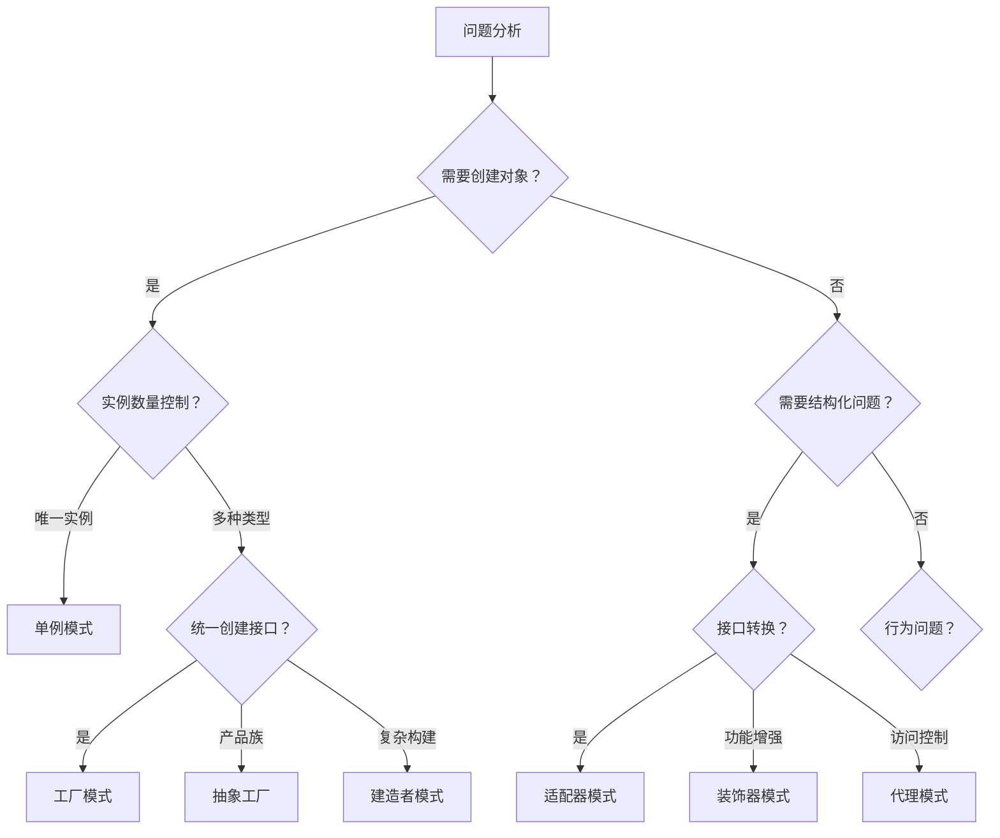
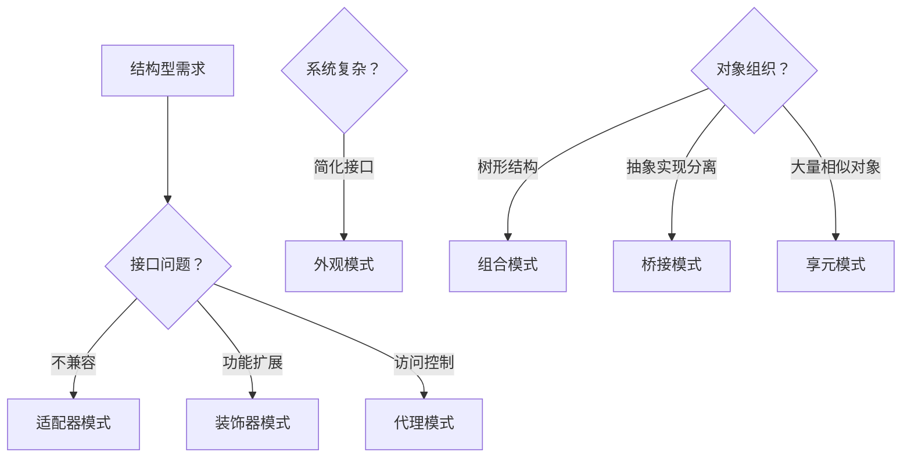
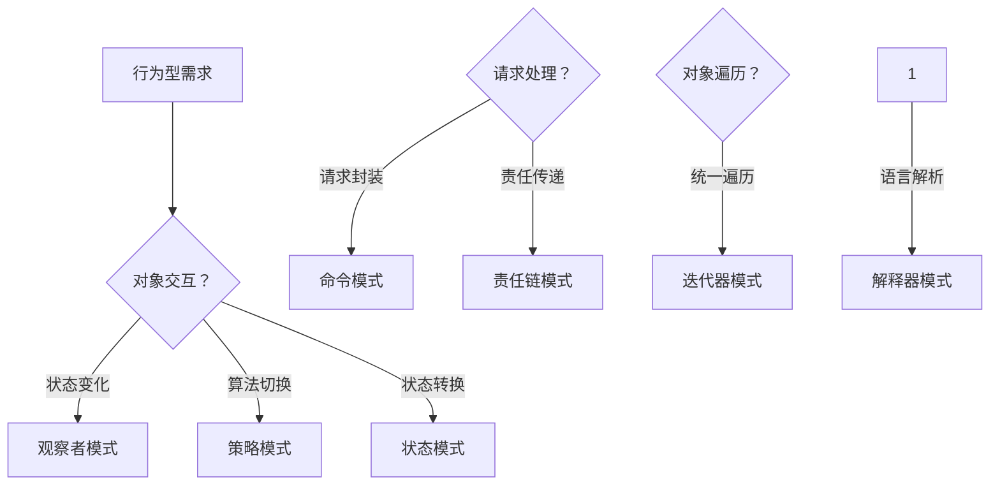

# 何时使用哪种模式 - 决策树

[[02-设计原则/04-设计原则对比表]] → [[02-常见问题场景与模式映射]]
## 🎯 设计模式决策框架

### 🚀 快速决策树


## 🔍 创建型模式决策路径

### 📋 对象创建场景分析

| 判断标准 | 推荐模式 | 使用场景 |
|----------|----------|----------|
| **确保全局唯一** | 单例模式 | 配置管理器、日志系统 |
| **运行时决定类型** | 工厂模式 | UI组件、数据处理器 |
| **创建相关产品族** | 抽象工厂 | 跨平台UI、数据库驱动 |
| **分步构建复杂对象** | 建造者模式 | SQL查询、HTTP请求 |
| **克隆昂贵对象** | 原型模式 | 游戏对象、文档模板 |

### 🎯 决策示例代码

```java
// 场景：需要创建不同类型的通知服务
class NotificationFactory {
    public NotificationService create(NotificationType type) {
        switch (type) {
            case EMAIL: return new EmailNotificationService();
            case SMS: return new SMSNotificationService();
            case PUSH: return new PushNotificationService();
            default: throw new IllegalArgumentException("Unknown type");
        }
    }
}

// 如果未来需要支持多种EMAIL提供商，考虑抽象工厂
interface NotificationFactory {
    EmailService createEmailService();
    SMSService createSMSService();
    PushService createPushService();
}
```

## 🏗️ 结构型模式决策路径

### 🔗 结构问题分析



### 🎯 结构模式对比表

| 问题特征 | 解决方案 | 适用场景 |
|----------|----------|----------|
| **第三方API不兼容** | 适配器模式 | 集成老旧系统 |
| **需要动态添加功能** | 装饰器模式 | 中间件、功能链 |
| **远程对象访问** | 代理模式 | RPC、缓存 |
| **子系统接口复杂** | 外观模式 | API网关 |
| **树形结构统一处理** | 组合模式 | 文件系统、GUI |
| **跨平台抽象** | 桥接模式 | 图形API抽象 |
| **大量相似对象** | 享元模式 | 文字编辑、图标处理 |

## 🎭 行为型模式决策路径

### 🤔 行为问题分析



### 📊 行为模式复杂度评分

| 模式 | 常用程度 | 复杂度 | 学习优先级 |
|------|----------|--------|-----------|
| 观察者模式 | ⭐⭐⭐⭐⭐ | ⭐⭐ | 高 |
| 策略模式 | ⭐⭐⭐⭐⭐ | ⭐⭐⭐ | 高 |
| 命令模式 | ⭐⭐⭐⭐ | ⭐⭐⭐ | 中高 |
| 状态模式 | ⭐⭐⭐⭐ | ⭐⭐⭐⭐ | 中 |
| 责任链模式 | ⭐⭐⭐ | ⭐⭐⭐ | 中 |

## 🚀 实战决策工具

### 📋 决策检查清单

#### 问题识别
- [ ] 是否涉及对象创建？ → 考虑创建型模式
- [ ] 是否涉及对象结构组织？ → 考虑结构型模式  
- [ ] 是否涉及对象行为交互？ → 考虑行为型模式

#### 复杂度权衡
- [ ] 当前解决简单问题？ → 优先简单方案（KISS原则）
- [ ] 未来可能扩展？ → 考虑模式的可扩展性
- [ ] 团队理解程度？ → 选择适合团队的复杂度

#### YAGNI检查
- [ ] 当前确实需要这个设计？ → 立即使用
- [ ] 未来可能用到？ → 预留扩展点
- [ ] 不确定是否需要？ → 暂缓使用

### 🎯 快速决策模板

```java
// 决策模板：当你遇到问题时
public class PatternDecisionTemplate {
    public void solveProblem(Object problem) {
        if (isCreationProblem(problem)) {
            // 考虑创建型模式
            if (needsSingleton(problem)) return useSingleton();
            if (needsFactory(problem)) return useFactory();
            if (needsBuilder(problem)) return useBuilder();
        }
        
        if (isStructuralProblem(problem)) {
            // 考虑结构型模式
            if (needsAdapter(problem)) return useAdapter();
            if (needsDecorator(problem)) return useDecorator();
            if (needsProxy(problem)) return useProxy();
        }
        
        if (isBehavioralProblem(problem)) {
            // 考虑行为型模式
            if (needsObserver(problem)) return useObserver();
            if (needsStrategy(problem)) return useStrategy();
            if (needsCommand(problem)) return useCommand();
        }
    }
}
```

## 🔗 学习衔接

- **理论基础** ← [[设计原则对比表]]
- **场景映射** → [[常见问题场景与模式映射]]
- **实践路径** → [[从问题到模式的思考路径]]

---
**💡 决策智慧**：选择设计模式的关键是理解问题本质，而不是为了使用模式而使用。优先选择最简单的解决方案，只在复杂度确实需要时才引入更高级的模式。
