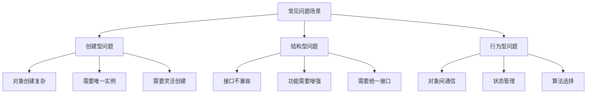

# 🗺️ 常见问题场景与模式映射

[[06-模式识别与选择/01-何时使用哪种模式-决策树]] ← [[06-模式识别与选择/03-从问题到模式的思考路径]]
## 🎯 问题场景与模式映射概览

### 📊 映射关系图



## 🏗️ 创建型问题场景映射

### 📋 **对象创建复杂**

| 问题描述 | 具体场景 | 推荐模式 | 原因 |
|----------|----------|----------|------|
| **需要创建多种类型对象** | 数据库连接、文件处理器 | 工厂方法模式 | 封装创建逻辑 |
| **需要创建对象族** | UI组件、主题系统 | 抽象工厂模式 | 保证产品兼容性 |
| **创建过程复杂** | 配置对象、文档构建 | 建造者模式 | 分步构建复杂对象 |
| **需要对象克隆** | 原型对象、模板复制 | 原型模式 | 避免重复创建 |
| **需要全局唯一实例** | 配置管理器、日志器 | 单例模式 | 确保唯一性 |

### 🎯 **实际应用场景**

#### **工厂方法模式场景**
```java
// ✅ 问题：需要创建不同类型的数据库连接
public class DatabaseConnectionFactory {
    public static Connection createConnection(String type) {
        switch (type) {
            case "mysql":
                return new MySQLConnection();
            case "postgresql":
                return new PostgreSQLConnection();
            case "oracle":
                return new OracleConnection();
            default:
                throw new IllegalArgumentException("不支持的数据库类型");
        }
    }
}
```

#### **抽象工厂模式场景**
```java
// ✅ 问题：需要创建兼容的UI组件族
public interface UIFactory {
    Button createButton();
    TextField createTextField();
    Window createWindow();
}

public class WindowsUIFactory implements UIFactory {
    public Button createButton() { return new WindowsButton(); }
    public TextField createTextField() { return new WindowsTextField(); }
    public Window createWindow() { return new WindowsWindow(); }
}
```

## 🏗️ 结构型问题场景映射

### 📋 **接口适配问题**

| 问题描述 | 具体场景 | 推荐模式 | 原因 |
|----------|----------|----------|------|
| **接口不兼容** | 第三方库集成、遗留系统 | 适配器模式 | 转换接口格式 |
| **功能需要增强** | 日志记录、权限检查 | 装饰器模式 | 动态添加功能 |
| **需要访问控制** | 权限管理、缓存代理 | 代理模式 | 控制对象访问 |
| **需要统一接口** | 子系统集成、API网关 | 外观模式 | 简化复杂接口 |
| **需要对象共享** | 大量相似对象、资源池 | 享元模式 | 减少内存占用 |
| **需要树形结构** | 文件系统、组织架构 | 组合模式 | 统一处理部分整体 |
| **需要抽象与实现分离** | 跨平台开发、数据库驱动 | 桥接模式 | 独立变化 |

### 🎯 **实际应用场景**

#### **适配器模式场景**
```java
// ✅ 问题：第三方支付接口不兼容
public class PaymentAdapter {
    private ThirdPartyPaymentService thirdPartyService;
    
    public PaymentAdapter(ThirdPartyPaymentService service) {
        this.thirdPartyService = service;
    }
    
    public PaymentResult processPayment(PaymentRequest request) {
        // 转换请求格式
        ThirdPartyRequest thirdPartyRequest = convertRequest(request);
        
        // 调用第三方服务
        ThirdPartyResponse response = thirdPartyService.pay(thirdPartyRequest);
        
        // 转换响应格式
        return convertResponse(response);
    }
}
```

#### **装饰器模式场景**
```java
// ✅ 问题：需要为服务添加日志和缓存功能
public class LoggingServiceDecorator implements Service {
    private Service service;
    private Logger logger;
    
    public LoggingServiceDecorator(Service service) {
        this.service = service;
        this.logger = LoggerFactory.getLogger(service.getClass());
    }
    
    public String process(String input) {
        logger.info("开始处理: " + input);
        String result = service.process(input);
        logger.info("处理完成: " + result);
        return result;
    }
}
```

## 🏗️ 行为型问题场景映射

### 📋 **对象交互问题**

| 问题描述 | 具体场景 | 推荐模式 | 原因 |
|----------|----------|----------|------|
| **需要解耦发送者和接收者** | 菜单系统、撤销重做 | 命令模式 | 封装请求为对象 |
| **需要状态转换** | 订单状态、游戏状态 | 状态模式 | 封装状态转换逻辑 |
| **需要处理请求链** | 权限验证、异常处理 | 责任链模式 | 动态处理请求 |
| **需要一对多通知** | 事件系统、MVC架构 | 观察者模式 | 解耦观察者和被观察者 |
| **需要算法选择** | 排序算法、支付方式 | 策略模式 | 封装算法族 |
| **需要定义算法骨架** | 框架设计、模板处理 | 模板方法模式 | 固定算法结构 |
| **需要访问对象结构** | 编译器、报表生成 | 访问者模式 | 集中操作逻辑 |
| **需要中介协调** | 聊天室、工作流 | 中介者模式 | 解耦对象交互 |
| **需要状态保存恢复** | 编辑器、游戏存档 | 备忘录模式 | 保存对象状态 |
| **需要语言解释** | 规则引擎、表达式计算 | 解释器模式 | 定义语言文法 |
| **需要遍历集合** | 集合框架、树遍历 | 迭代器模式 | 统一遍历接口 |

### 🎯 **实际应用场景**

#### **观察者模式场景**
```java
// ✅ 问题：需要通知多个对象状态变化
public class NewsAgency {
    private List<Observer> observers = new ArrayList<>();
    private String news;
    
    public void addObserver(Observer observer) {
        observers.add(observer);
    }
    
    public void setNews(String news) {
        this.news = news;
        notifyObservers();
    }
    
    private void notifyObservers() {
        for (Observer observer : observers) {
            observer.update(news);
        }
    }
}
```

#### **策略模式场景**
```java
// ✅ 问题：需要根据条件选择不同算法
public class PaymentProcessor {
    private PaymentStrategy strategy;
    
    public void setPaymentStrategy(PaymentStrategy strategy) {
        this.strategy = strategy;
    }
    
    public void processPayment(double amount) {
        strategy.pay(amount);
    }
}

public interface PaymentStrategy {
    void pay(double amount);
}

public class CreditCardPayment implements PaymentStrategy {
    public void pay(double amount) {
        System.out.println("使用信用卡支付: " + amount);
    }
}
```

## 🔧 复合问题场景映射

### 📋 **多模式组合场景**

| 复合问题 | 涉及模式 | 应用场景 | 实现方式 |
|----------|----------|----------|----------|
| **MVC架构** | 观察者+策略+工厂 | Web应用框架 | Model通知View，Controller选择策略 |
| **插件系统** | 工厂+策略+装饰器 | 可扩展应用 | 动态加载插件，装饰核心功能 |
| **工作流引擎** | 状态+命令+中介者 | 业务流程管理 | 状态转换，命令执行，中介协调 |
| **缓存系统** | 代理+单例+策略 | 性能优化 | 代理缓存，单例管理，策略选择 |
| **事件系统** | 观察者+命令+责任链 | 事件驱动架构 | 事件通知，命令封装，责任链处理 |

### 🎯 **MVC架构示例**

```java
// ✅ 复合问题：需要构建MVC架构
public class MVCArchitecture {
    // 观察者模式：Model通知View
    public class Model extends Observable {
        private String data;
        
        public void setData(String data) {
            this.data = data;
            setChanged();
            notifyObservers(data);
        }
    }
    
    // 策略模式：Controller选择处理策略
    public class Controller {
        private Map<String, ActionStrategy> strategies;
        
        public void handleRequest(String action, String data) {
            ActionStrategy strategy = strategies.get(action);
            if (strategy != null) {
                strategy.execute(data);
            }
        }
    }
    
    // 工厂模式：创建View组件
    public class ViewFactory {
        public View createView(String type) {
            switch (type) {
                case "form":
                    return new FormView();
                case "table":
                    return new TableView();
                default:
                    return new DefaultView();
            }
        }
    }
}
```

## 📊 问题复杂度与模式选择

### 🎯 **复杂度矩阵**

| 问题复杂度 | 推荐模式 | 适用场景 | 注意事项 |
|------------|----------|----------|----------|
| **简单** | 单例、工厂方法 | 基础功能实现 | 避免过度设计 |
| **中等** | 策略、观察者、装饰器 | 常见业务逻辑 | 平衡复杂度和灵活性 |
| **复杂** | 访问者、解释器、中介者 | 框架设计、系统集成 | 充分理解业务需求 |
| **非常复杂** | 多模式组合 | 大型系统架构 | 需要架构师经验 |

### 🎯 **选择标准**

1. **问题类型匹配**: 确保模式解决的问题与实际问题匹配
2. **复杂度适中**: 不要为了使用模式而增加不必要的复杂度
3. **可维护性**: 考虑团队的技术水平和维护成本
4. **扩展性**: 评估未来需求变化的可能性
5. **性能影响**: 考虑模式对系统性能的影响

## 🔗 学习衔接

- **上一文档** ← [[何时使用哪种模式-决策树]]
- **下一文档** → [[从问题到模式的思考路径]]
- **模式对比** → [[05-行为型模式/13-行为型模式对比表]]
- **实际应用** → [[08-实际应用]]

---
**💡 映射精髓**: 问题场景与模式映射就像医生的诊断手册，不同的症状（问题）对应不同的治疗方案（模式）。关键是要准确识别问题的本质，然后选择最合适的模式来解决！
