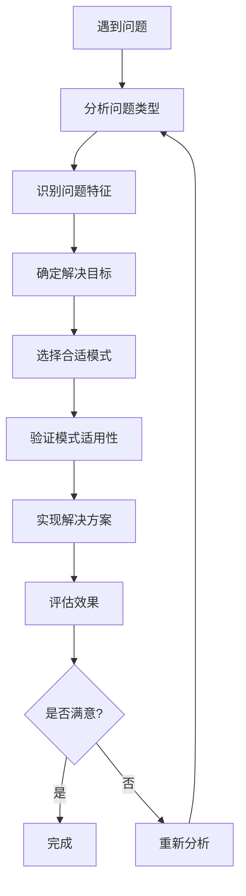

# 🧭 从问题到模式的思考路径

[[06-模式识别与选择/02-常见问题场景与模式映射]] ← [[06-模式识别与选择/04-模式识别技巧与实战]]
## 🎯 思考路径概览

### 📊 思考流程图



## 🔍 第一步：问题分析

### 📋 **问题分类框架**

#### **1. 创建问题**
- **特征**: 需要创建对象，但创建过程复杂
- **关键问题**:
  - 需要创建什么类型的对象？
  - 创建过程是否复杂？
  - 是否需要控制实例数量？
  - 是否需要对象族？

#### **2. 结构问题**
- **特征**: 需要组织或组合对象
- **关键问题**:
  - 接口是否兼容？
  - 是否需要功能增强？
  - 是否需要访问控制？
  - 是否需要统一接口？

#### **3. 行为问题**
- **特征**: 需要管理对象间的交互和通信
- **关键问题**:
  - 对象间如何通信？
  - 需要管理什么状态？
  - 需要处理什么请求？
  - 需要执行什么算法？

### 🎯 **问题分析模板**

```java
// ✅ 问题分析模板
public class ProblemAnalysis {
    // 问题描述
    private String problemDescription;
    
    // 问题类型
    private ProblemType problemType;
    
    // 问题特征
    private List<String> characteristics;
    
    // 约束条件
    private List<String> constraints;
    
    // 期望结果
    private String expectedOutcome;
    
    // 分析问题
    public void analyzeProblem() {
        System.out.println("=== 问题分析 ===");
        System.out.println("问题描述: " + problemDescription);
        System.out.println("问题类型: " + problemType);
        System.out.println("问题特征: " + characteristics);
        System.out.println("约束条件: " + constraints);
        System.out.println("期望结果: " + expectedOutcome);
    }
}

public enum ProblemType {
    CREATIONAL, STRUCTURAL, BEHAVIORAL, COMPOSITE
}
```

## 🎯 第二步：特征识别

### 📋 **特征识别清单**

#### **创建型特征**
- [ ] 需要创建对象
- [ ] 创建过程复杂
- [ ] 需要控制实例数量
- [ ] 需要创建对象族
- [ ] 需要对象克隆
- [ ] 需要延迟创建

#### **结构型特征**
- [ ] 接口不兼容
- [ ] 需要功能增强
- [ ] 需要访问控制
- [ ] 需要统一接口
- [ ] 需要对象共享
- [ ] 需要树形结构
- [ ] 需要抽象与实现分离

#### **行为型特征**
- [ ] 需要解耦发送者和接收者
- [ ] 需要状态转换
- [ ] 需要处理请求链
- [ ] 需要一对多通知
- [ ] 需要算法选择
- [ ] 需要定义算法骨架
- [ ] 需要访问对象结构
- [ ] 需要中介协调
- [ ] 需要状态保存恢复
- [ ] 需要语言解释
- [ ] 需要遍历集合

### 🎯 **特征识别工具**

```java
// ✅ 特征识别工具
public class FeatureIdentifier {
    private Map<String, Boolean> features;
    
    public FeatureIdentifier() {
        this.features = new HashMap<>();
    }
    
    // 识别创建型特征
    public void identifyCreationalFeatures() {
        features.put("需要创建对象", false);
        features.put("创建过程复杂", false);
        features.put("需要控制实例数量", false);
        features.put("需要创建对象族", false);
        features.put("需要对象克隆", false);
        features.put("需要延迟创建", false);
    }
    
    // 识别结构型特征
    public void identifyStructuralFeatures() {
        features.put("接口不兼容", false);
        features.put("需要功能增强", false);
        features.put("需要访问控制", false);
        features.put("需要统一接口", false);
        features.put("需要对象共享", false);
        features.put("需要树形结构", false);
        features.put("需要抽象与实现分离", false);
    }
    
    // 识别行为型特征
    public void identifyBehavioralFeatures() {
        features.put("需要解耦发送者和接收者", false);
        features.put("需要状态转换", false);
        features.put("需要处理请求链", false);
        features.put("需要一对多通知", false);
        features.put("需要算法选择", false);
        features.put("需要定义算法骨架", false);
        features.put("需要访问对象结构", false);
        features.put("需要中介协调", false);
        features.put("需要状态保存恢复", false);
        features.put("需要语言解释", false);
        features.put("需要遍历集合", false);
    }
    
    // 设置特征
    public void setFeature(String feature, boolean value) {
        features.put(feature, value);
    }
    
    // 获取匹配的特征
    public List<String> getMatchingFeatures() {
        return features.entrySet().stream()
            .filter(Map.Entry::getValue)
            .map(Map.Entry::getKey)
            .collect(Collectors.toList());
    }
    
    // 分析特征
    public void analyzeFeatures() {
        List<String> matchingFeatures = getMatchingFeatures();
        System.out.println("匹配的特征: " + matchingFeatures);
        
        // 根据特征推荐模式
        recommendPatterns(matchingFeatures);
    }
    
    private void recommendPatterns(List<String> features) {
        System.out.println("=== 推荐模式 ===");
        
        if (features.contains("需要创建对象") && features.contains("创建过程复杂")) {
            System.out.println("推荐: 工厂方法模式");
        }
        
        if (features.contains("需要控制实例数量") && features.contains("需要唯一实例")) {
            System.out.println("推荐: 单例模式");
        }
        
        if (features.contains("接口不兼容")) {
            System.out.println("推荐: 适配器模式");
        }
        
        if (features.contains("需要功能增强")) {
            System.out.println("推荐: 装饰器模式");
        }
        
        if (features.contains("需要一对多通知")) {
            System.out.println("推荐: 观察者模式");
        }
        
        if (features.contains("需要算法选择")) {
            System.out.println("推荐: 策略模式");
        }
    }
}
```

## 🎯 第三步：目标确定

### 📋 **目标类型**

#### **1. 功能目标**
- 实现特定功能
- 满足业务需求
- 解决技术问题

#### **2. 质量目标**
- 提高代码质量
- 增强可维护性
- 提升可扩展性

#### **3. 性能目标**
- 优化性能
- 减少资源消耗
- 提高响应速度

#### **4. 架构目标**
- 改善系统架构
- 降低耦合度
- 提高内聚性

### 🎯 **目标设定工具**

```java
// ✅ 目标设定工具
public class GoalSetter {
    private List<Goal> goals;
    
    public GoalSetter() {
        this.goals = new ArrayList<>();
    }
    
    // 添加功能目标
    public void addFunctionalGoal(String description, Priority priority) {
        goals.add(new Goal(GoalType.FUNCTIONAL, description, priority));
    }
    
    // 添加质量目标
    public void addQualityGoal(String description, Priority priority) {
        goals.add(new Goal(GoalType.QUALITY, description, priority));
    }
    
    // 添加性能目标
    public void addPerformanceGoal(String description, Priority priority) {
        goals.add(new Goal(GoalType.PERFORMANCE, description, priority));
    }
    
    // 添加架构目标
    public void addArchitecturalGoal(String description, Priority priority) {
        goals.add(new Goal(GoalType.ARCHITECTURAL, description, priority));
    }
    
    // 获取目标列表
    public List<Goal> getGoals() {
        return new ArrayList<>(goals);
    }
    
    // 按优先级排序
    public List<Goal> getGoalsByPriority() {
        return goals.stream()
            .sorted(Comparator.comparing(Goal::getPriority))
            .collect(Collectors.toList());
    }
    
    // 分析目标
    public void analyzeGoals() {
        System.out.println("=== 目标分析 ===");
        for (Goal goal : getGoalsByPriority()) {
            System.out.println(goal.getType() + " - " + goal.getDescription() + " (优先级: " + goal.getPriority() + ")");
        }
    }
}

public class Goal {
    private GoalType type;
    private String description;
    private Priority priority;
    
    public Goal(GoalType type, String description, Priority priority) {
        this.type = type;
        this.description = description;
        this.priority = priority;
    }
    
    // Getters
    public GoalType getType() { return type; }
    public String getDescription() { return description; }
    public Priority getPriority() { return priority; }
}

public enum GoalType {
    FUNCTIONAL, QUALITY, PERFORMANCE, ARCHITECTURAL
}

public enum Priority {
    LOW, MEDIUM, HIGH, CRITICAL
}
```

## 🎯 第四步：模式选择

### 📋 **模式选择矩阵**

| 问题特征 | 推荐模式 | 适用场景 | 实现复杂度 |
|----------|----------|----------|------------|
| 创建过程复杂 | 工厂方法 | 对象创建 | 低 |
| 需要唯一实例 | 单例 | 全局访问 | 低 |
| 接口不兼容 | 适配器 | 系统集成 | 中 |
| 需要功能增强 | 装饰器 | 功能扩展 | 中 |
| 需要访问控制 | 代理 | 权限管理 | 中 |
| 需要统一接口 | 外观 | 子系统集成 | 中 |
| 需要对象共享 | 享元 | 资源优化 | 高 |
| 需要树形结构 | 组合 | 层次结构 | 中 |
| 需要抽象与实现分离 | 桥接 | 跨平台开发 | 高 |
| 需要解耦发送者和接收者 | 命令 | 请求处理 | 中 |
| 需要状态转换 | 状态 | 状态管理 | 中 |
| 需要处理请求链 | 责任链 | 请求处理 | 中 |
| 需要一对多通知 | 观察者 | 事件系统 | 中 |
| 需要算法选择 | 策略 | 算法切换 | 低 |
| 需要定义算法骨架 | 模板方法 | 框架设计 | 中 |
| 需要访问对象结构 | 访问者 | 对象操作 | 高 |
| 需要中介协调 | 中介者 | 对象交互 | 高 |
| 需要状态保存恢复 | 备忘录 | 状态管理 | 中 |
| 需要语言解释 | 解释器 | 语言处理 | 高 |
| 需要遍历集合 | 迭代器 | 集合遍历 | 低 |

### 🎯 **模式选择工具**

```java
// ✅ 模式选择工具
public class PatternSelector {
    private Map<String, List<DesignPattern>> patternMap;
    
    public PatternSelector() {
        this.patternMap = new HashMap<>();
        initializePatternMap();
    }
    
    private void initializePatternMap() {
        // 创建型模式
        patternMap.put("创建过程复杂", Arrays.asList(
            new DesignPattern("工厂方法模式", PatternType.CREATIONAL, Complexity.LOW),
            new DesignPattern("抽象工厂模式", PatternType.CREATIONAL, Complexity.MEDIUM)
        ));
        
        patternMap.put("需要唯一实例", Arrays.asList(
            new DesignPattern("单例模式", PatternType.CREATIONAL, Complexity.LOW)
        ));
        
        // 结构型模式
        patternMap.put("接口不兼容", Arrays.asList(
            new DesignPattern("适配器模式", PatternType.STRUCTURAL, Complexity.MEDIUM)
        ));
        
        patternMap.put("需要功能增强", Arrays.asList(
            new DesignPattern("装饰器模式", PatternType.STRUCTURAL, Complexity.MEDIUM)
        ));
        
        // 行为型模式
        patternMap.put("需要一对多通知", Arrays.asList(
            new DesignPattern("观察者模式", PatternType.BEHAVIORAL, Complexity.MEDIUM)
        ));
        
        patternMap.put("需要算法选择", Arrays.asList(
            new DesignPattern("策略模式", PatternType.BEHAVIORAL, Complexity.LOW)
        ));
    }
    
    // 根据特征选择模式
    public List<DesignPattern> selectPatterns(List<String> features) {
        List<DesignPattern> recommendedPatterns = new ArrayList<>();
        
        for (String feature : features) {
            List<DesignPattern> patterns = patternMap.get(feature);
            if (patterns != null) {
                recommendedPatterns.addAll(patterns);
            }
        }
        
        // 去重并按复杂度排序
        return recommendedPatterns.stream()
            .distinct()
            .sorted(Comparator.comparing(DesignPattern::getComplexity))
            .collect(Collectors.toList());
    }
    
    // 分析模式选择
    public void analyzePatternSelection(List<String> features) {
        List<DesignPattern> patterns = selectPatterns(features);
        
        System.out.println("=== 模式选择分析 ===");
        System.out.println("问题特征: " + features);
        System.out.println("推荐模式:");
        
        for (DesignPattern pattern : patterns) {
            System.out.println("- " + pattern.getName() + " (" + pattern.getType() + ", 复杂度: " + pattern.getComplexity() + ")");
        }
    }
}

public class DesignPattern {
    private String name;
    private PatternType type;
    private Complexity complexity;
    
    public DesignPattern(String name, PatternType type, Complexity complexity) {
        this.name = name;
        this.type = type;
        this.complexity = complexity;
    }
    
    // Getters
    public String getName() { return name; }
    public PatternType getType() { return type; }
    public Complexity getComplexity() { return complexity; }
    
    @Override
    public boolean equals(Object obj) {
        if (this == obj) return true;
        if (obj == null || getClass() != obj.getClass()) return false;
        DesignPattern that = (DesignPattern) obj;
        return Objects.equals(name, that.name);
    }
    
    @Override
    public int hashCode() {
        return Objects.hash(name);
    }
}

public enum PatternType {
    CREATIONAL, STRUCTURAL, BEHAVIORAL
}

public enum Complexity {
    LOW, MEDIUM, HIGH
}
```

## 🎯 第五步：适用性验证

### 📋 **验证清单**

#### **1. 问题匹配度**
- [ ] 模式解决的问题与实际问题匹配
- [ ] 模式的特征与问题特征一致
- [ ] 模式的目标与项目目标一致

#### **2. 实现可行性**
- [ ] 团队有足够的技术能力
- [ ] 项目有足够的时间预算
- [ ] 系统架构支持模式实现

#### **3. 维护性**
- [ ] 模式不会增加过多复杂度
- [ ] 团队成员能够理解和维护
- [ ] 文档和培训资源充足

#### **4. 扩展性**
- [ ] 模式支持未来需求变化
- [ ] 可以与其他模式组合使用
- [ ] 不会限制系统扩展

### 🎯 **适用性验证工具**

```java
// ✅ 适用性验证工具
public class ApplicabilityValidator {
    private Map<String, Boolean> validationCriteria;
    
    public ApplicabilityValidator() {
        this.validationCriteria = new HashMap<>();
    }
    
    // 验证问题匹配度
    public boolean validateProblemMatch(DesignPattern pattern, ProblemAnalysis problem) {
        // 检查模式类型与问题类型是否匹配
        boolean typeMatch = pattern.getType().toString().toLowerCase()
            .contains(problem.getProblemType().toString().toLowerCase());
        
        // 检查模式特征与问题特征是否匹配
        boolean featureMatch = checkFeatureMatch(pattern, problem);
        
        return typeMatch && featureMatch;
    }
    
    // 验证实现可行性
    public boolean validateImplementationFeasibility(DesignPattern pattern, ProjectContext context) {
        // 检查技术能力
        boolean technicalCapability = context.hasTechnicalCapability(pattern.getComplexity());
        
        // 检查时间预算
        boolean timeBudget = context.hasTimeBudget(pattern.getComplexity());
        
        // 检查架构支持
        boolean architectureSupport = context.supportsArchitecture(pattern.getType());
        
        return technicalCapability && timeBudget && architectureSupport;
    }
    
    // 验证维护性
    public boolean validateMaintainability(DesignPattern pattern, TeamContext context) {
        // 检查团队理解能力
        boolean teamUnderstanding = context.canUnderstandPattern(pattern.getComplexity());
        
        // 检查文档资源
        boolean documentationAvailable = context.hasDocumentation(pattern.getName());
        
        // 检查培训资源
        boolean trainingAvailable = context.hasTraining(pattern.getName());
        
        return teamUnderstanding && documentationAvailable && trainingAvailable;
    }
    
    // 验证扩展性
    public boolean validateExtensibility(DesignPattern pattern, SystemContext context) {
        // 检查未来需求支持
        boolean futureRequirementSupport = context.supportsFutureRequirements(pattern.getType());
        
        // 检查模式组合能力
        boolean patternComposition = context.supportsPatternComposition(pattern.getName());
        
        // 检查系统扩展限制
        boolean systemExtensionLimit = !context.limitsSystemExtension(pattern.getName());
        
        return futureRequirementSupport && patternComposition && systemExtensionLimit;
    }
    
    // 综合验证
    public ValidationResult validate(DesignPattern pattern, ProblemAnalysis problem, 
                                   ProjectContext projectContext, TeamContext teamContext, 
                                   SystemContext systemContext) {
        boolean problemMatch = validateProblemMatch(pattern, problem);
        boolean implementationFeasibility = validateImplementationFeasibility(pattern, projectContext);
        boolean maintainability = validateMaintainability(pattern, teamContext);
        boolean extensibility = validateExtensibility(pattern, systemContext);
        
        boolean overallValid = problemMatch && implementationFeasibility && maintainability && extensibility;
        
        return new ValidationResult(pattern, problemMatch, implementationFeasibility, 
                                  maintainability, extensibility, overallValid);
    }
    
    private boolean checkFeatureMatch(DesignPattern pattern, ProblemAnalysis problem) {
        // 实现特征匹配逻辑
        return true; // 简化实现
    }
}

public class ValidationResult {
    private DesignPattern pattern;
    private boolean problemMatch;
    private boolean implementationFeasibility;
    private boolean maintainability;
    private boolean extensibility;
    private boolean overallValid;
    
    public ValidationResult(DesignPattern pattern, boolean problemMatch, boolean implementationFeasibility,
                          boolean maintainability, boolean extensibility, boolean overallValid) {
        this.pattern = pattern;
        this.problemMatch = problemMatch;
        this.implementationFeasibility = implementationFeasibility;
        this.maintainability = maintainability;
        this.extensibility = extensibility;
        this.overallValid = overallValid;
    }
    
    // Getters
    public DesignPattern getPattern() { return pattern; }
    public boolean isProblemMatch() { return problemMatch; }
    public boolean isImplementationFeasible() { return implementationFeasibility; }
    public boolean isMaintainable() { return maintainability; }
    public boolean isExtensible() { return extensibility; }
    public boolean isOverallValid() { return overallValid; }
    
    public void printResult() {
        System.out.println("=== 验证结果 ===");
        System.out.println("模式: " + pattern.getName());
        System.out.println("问题匹配: " + (problemMatch ? "通过" : "失败"));
        System.out.println("实现可行性: " + (implementationFeasibility ? "通过" : "失败"));
        System.out.println("维护性: " + (maintainability ? "通过" : "失败"));
        System.out.println("扩展性: " + (extensibility ? "通过" : "失败"));
        System.out.println("总体评估: " + (overallValid ? "推荐使用" : "不推荐使用"));
    }
}
```

## 🎯 第六步：实现与评估

### 📋 **实现步骤**

1. **设计阶段**
   - 创建类图
   - 定义接口
   - 确定关系

2. **实现阶段**
   - 编写代码
   - 单元测试
   - 集成测试

3. **验证阶段**
   - 功能验证
   - 性能测试
   - 用户验收

### 🎯 **评估标准**

#### **1. 功能评估**
- 是否解决了原始问题？
- 是否满足了所有需求？
- 是否达到了预期目标？

#### **2. 质量评估**
- 代码质量是否提高？
- 可维护性是否增强？
- 可扩展性是否改善？

#### **3. 性能评估**
- 性能是否满足要求？
- 资源消耗是否合理？
- 响应时间是否可接受？

#### **4. 用户体验评估**
- 用户是否满意？
- 操作是否简便？
- 界面是否友好？

## 🔗 学习衔接

- **上一文档** ← [[常见问题场景与模式映射]]
- **下一文档** → [[模式识别技巧与实战]]
- **决策树** → [[何时使用哪种模式-决策树]]
- **实际应用** → [[08-实际应用]]

---
**💡 思考路径精髓**: 从问题到模式的思考路径就像一个GPS导航系统，它引导你从起点（问题）出发，经过多个检查点（分析、识别、选择、验证），最终到达目的地（解决方案）。关键是要在每个检查点都仔细思考，确保方向正确！
