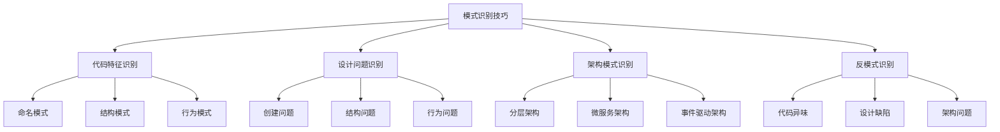

# 🎯 模式识别技巧与实战

[[06-模式识别与选择/03-从问题到模式的思考路径]] ← [[07-模式关系与组合]]
## 🎯 模式识别技巧概览

### 📊 识别技巧框架



## 🔍 代码特征识别技巧

### 📋 **命名模式识别**

#### **创建型模式命名特征**
| 模式 | 命名特征 | 示例 |
|------|----------|------|
| **工厂方法** | Factory, Creator, Builder | UserFactory, ProductCreator |
| **抽象工厂** | AbstractFactory, FactoryFamily | UIFactory, DatabaseFactory |
| **建造者** | Builder, Director | QueryBuilder, ReportDirector |
| **原型** | Prototype, Clone, Copy | DocumentPrototype, ShapeClone |
| **单例** | Singleton, Instance, Manager | ConfigSingleton, LoggerInstance |

#### **结构型模式命名特征**
| 模式 | 命名特征 | 示例 |
|------|----------|------|
| **适配器** | Adapter, Wrapper, Translator | PaymentAdapter, LegacyWrapper |
| **装饰器** | Decorator, Wrapper, Enhancer | LoggingDecorator, CachingWrapper |
| **代理** | Proxy, Surrogate, Placeholder | SecurityProxy, RemoteSurrogate |
| **外观** | Facade, Gateway, Interface | SystemFacade, APIGateway |
| **享元** | Flyweight, Pool, Cache | CharacterFlyweight, ConnectionPool |
| **组合** | Composite, Container, Node | FileComposite, MenuContainer |
| **桥接** | Bridge, Abstraction, Implementor | DrawingBridge, DatabaseAbstraction |

#### **行为型模式命名特征**
| 模式 | 命名特征 | 示例 |
|------|----------|------|
| **观察者** | Observer, Listener, Subscriber | EventObserver, ChangeListener |
| **策略** | Strategy, Policy, Algorithm | PaymentStrategy, SortingPolicy |
| **命令** | Command, Action, Request | SaveCommand, DeleteAction |
| **状态** | State, Context, Machine | OrderState, GameContext |
| **责任链** | Chain, Handler, Pipeline | ValidationChain, ErrorHandler |
| **中介者** | Mediator, Coordinator, Controller | ChatMediator, WorkflowCoordinator |
| **备忘录** | Memento, Snapshot, Backup | GameMemento, DocumentSnapshot |
| **解释器** | Interpreter, Parser, Evaluator | SQLInterpreter, ExpressionParser |
| **迭代器** | Iterator, Enumerator, Traverser | ListIterator, TreeEnumerator |
| **访问者** | Visitor, Processor, Analyzer | DocumentVisitor, CodeProcessor |
| **模板方法** | Template, Abstract, Base | ReportTemplate, AbstractProcessor |

### 🎯 **结构模式识别**

#### **类结构特征**
```java
// ✅ 工厂方法模式结构特征
public abstract class Creator {
    // 抽象工厂方法
    public abstract Product createProduct();
    
    // 模板方法
    public void process() {
        Product product = createProduct();
        product.operate();
    }
}

// ✅ 观察者模式结构特征
public interface Observer {
    void update(String message);
}

public class Subject {
    private List<Observer> observers = new ArrayList<>();
    
    public void addObserver(Observer observer) {
        observers.add(observer);
    }
    
    public void notifyObservers(String message) {
        for (Observer observer : observers) {
            observer.update(message);
        }
    }
}

// ✅ 策略模式结构特征
public interface Strategy {
    void execute();
}

public class Context {
    private Strategy strategy;
    
    public void setStrategy(Strategy strategy) {
        this.strategy = strategy;
    }
    
    public void executeStrategy() {
        strategy.execute();
    }
}
```

#### **接口结构特征**
```java
// ✅ 适配器模式接口特征
public interface Target {
    void request();
}

public class Adaptee {
    public void specificRequest() {
        // 具体实现
    }
}

public class Adapter implements Target {
    private Adaptee adaptee;
    
    public Adapter(Adaptee adaptee) {
        this.adaptee = adaptee;
    }
    
    @Override
    public void request() {
        adaptee.specificRequest();
    }
}
```

## 🎯 设计问题识别技巧

### 📋 **问题症状识别**

#### **创建型问题症状**
| 症状 | 可能的问题 | 推荐模式 |
|------|------------|----------|
| **对象创建代码重复** | 创建逻辑分散 | 工厂方法模式 |
| **需要全局唯一实例** | 多个实例导致问题 | 单例模式 |
| **创建过程复杂** | 参数过多，步骤复杂 | 建造者模式 |
| **需要对象族** | 相关对象需要一起创建 | 抽象工厂模式 |
| **需要对象克隆** | 创建成本高，需要复制 | 原型模式 |

#### **结构型问题症状**
| 症状 | 可能的问题 | 推荐模式 |
|------|------------|----------|
| **接口不兼容** | 第三方库接口不匹配 | 适配器模式 |
| **功能需要增强** | 需要动态添加功能 | 装饰器模式 |
| **需要访问控制** | 需要控制对象访问 | 代理模式 |
| **子系统接口复杂** | 客户端需要简化接口 | 外观模式 |
| **大量相似对象** | 内存占用过大 | 享元模式 |
| **需要树形结构** | 部分-整体关系 | 组合模式 |
| **抽象与实现耦合** | 难以独立变化 | 桥接模式 |

#### **行为型问题症状**
| 症状 | 可能的问题 | 推荐模式 |
|------|------------|----------|
| **对象间紧耦合** | 对象直接依赖 | 观察者模式 |
| **算法需要切换** | 运行时选择算法 | 策略模式 |
| **请求需要封装** | 需要撤销重做 | 命令模式 |
| **状态转换复杂** | 状态逻辑分散 | 状态模式 |
| **请求处理链** | 需要动态处理 | 责任链模式 |
| **对象交互复杂** | 对象间通信复杂 | 中介者模式 |
| **需要状态保存** | 需要恢复历史状态 | 备忘录模式 |
| **需要语言解释** | 需要解析语言 | 解释器模式 |
| **需要遍历集合** | 需要统一遍历 | 迭代器模式 |
| **需要访问对象结构** | 操作分散 | 访问者模式 |
| **算法框架固定** | 步骤固定，实现不同 | 模板方法模式 |

### 🎯 **问题识别工具**

```java
// ✅ 问题识别工具
public class ProblemIdentifier {
    private Map<String, List<String>> problemSymptoms;
    private Map<String, String> recommendedPatterns;
    
    public ProblemIdentifier() {
        initializeProblemSymptoms();
        initializeRecommendedPatterns();
    }
    
    private void initializeProblemSymptoms() {
        // 创建型问题症状
        problemSymptoms.put("对象创建代码重复", Arrays.asList(
            "多个地方有相似的创建代码",
            "创建逻辑分散在不同类中",
            "创建参数硬编码"
        ));
        
        problemSymptoms.put("需要全局唯一实例", Arrays.asList(
            "多个实例导致资源浪费",
            "需要全局访问点",
            "配置信息需要共享"
        ));
        
        // 结构型问题症状
        problemSymptoms.put("接口不兼容", Arrays.asList(
            "第三方库接口不匹配",
            "遗留系统接口过时",
            "不同系统接口差异"
        ));
        
        problemSymptoms.put("功能需要增强", Arrays.asList(
            "需要动态添加功能",
            "功能组合复杂",
            "需要透明增强"
        ));
        
        // 行为型问题症状
        problemSymptoms.put("对象间紧耦合", Arrays.asList(
            "对象直接依赖",
            "修改一个影响多个",
            "难以独立测试"
        ));
        
        problemSymptoms.put("算法需要切换", Arrays.asList(
            "运行时选择算法",
            "算法族需要封装",
            "避免条件判断"
        ));
    }
    
    private void initializeRecommendedPatterns() {
        recommendedPatterns.put("对象创建代码重复", "工厂方法模式");
        recommendedPatterns.put("需要全局唯一实例", "单例模式");
        recommendedPatterns.put("接口不兼容", "适配器模式");
        recommendedPatterns.put("功能需要增强", "装饰器模式");
        recommendedPatterns.put("对象间紧耦合", "观察者模式");
        recommendedPatterns.put("算法需要切换", "策略模式");
    }
    
    // 识别问题
    public List<String> identifyProblems(List<String> symptoms) {
        List<String> identifiedProblems = new ArrayList<>();
        
        for (String symptom : symptoms) {
            for (Map.Entry<String, List<String>> entry : problemSymptoms.entrySet()) {
                if (entry.getValue().contains(symptom)) {
                    identifiedProblems.add(entry.getKey());
                }
            }
        }
        
        return identifiedProblems.stream().distinct().collect(Collectors.toList());
    }
    
    // 获取推荐模式
    public List<String> getRecommendedPatterns(List<String> problems) {
        return problems.stream()
            .map(recommendedPatterns::get)
            .filter(Objects::nonNull)
            .collect(Collectors.toList());
    }
    
    // 分析问题
    public void analyzeProblems(List<String> symptoms) {
        List<String> problems = identifyProblems(symptoms);
        List<String> patterns = getRecommendedPatterns(problems);
        
        System.out.println("=== 问题识别分析 ===");
        System.out.println("输入症状: " + symptoms);
        System.out.println("识别问题: " + problems);
        System.out.println("推荐模式: " + patterns);
    }
}
```

## 🎯 架构模式识别技巧

### 📋 **架构模式特征**

#### **分层架构模式**
```java
// ✅ 分层架构特征
// 表现层
@RestController
public class UserController {
    @Autowired
    private UserService userService;
    
    @GetMapping("/users/{id}")
    public UserDTO getUser(@PathVariable Long id) {
        return userService.getUser(id);
    }
}

// 业务层
@Service
public class UserService {
    @Autowired
    private UserRepository userRepository;
    
    public UserDTO getUser(Long id) {
        User user = userRepository.findById(id);
        return convertToDTO(user);
    }
}

// 数据层
@Repository
public class UserRepository {
    @Autowired
    private JdbcTemplate jdbcTemplate;
    
    public User findById(Long id) {
        // 数据库查询逻辑
        return jdbcTemplate.queryForObject("SELECT * FROM users WHERE id = ?", 
                                          new Object[]{id}, User.class);
    }
}
```

#### **微服务架构模式**
```java
// ✅ 微服务架构特征
// 服务注册
@SpringBootApplication
@EnableEurekaClient
public class UserServiceApplication {
    public static void main(String[] args) {
        SpringApplication.run(UserServiceApplication.class, args);
    }
}

// 服务发现
@Service
public class OrderService {
    @Autowired
    private RestTemplate restTemplate;
    
    @Autowired
    private DiscoveryClient discoveryClient;
    
    public UserDTO getUser(Long userId) {
        String serviceUrl = discoveryClient.getInstances("user-service")
            .stream()
            .findFirst()
            .map(instance -> instance.getUri().toString())
            .orElseThrow(() -> new RuntimeException("User service not found"));
        
        return restTemplate.getForObject(serviceUrl + "/users/" + userId, UserDTO.class);
    }
}

// API网关
@RestController
public class APIGateway {
    @Autowired
    private UserService userService;
    
    @Autowired
    private OrderService orderService;
    
    @GetMapping("/api/users/{id}")
    public UserDTO getUser(@PathVariable Long id) {
        return userService.getUser(id);
    }
    
    @GetMapping("/api/orders/{id}")
    public OrderDTO getOrder(@PathVariable Long id) {
        return orderService.getOrder(id);
    }
}
```

#### **事件驱动架构模式**
```java
// ✅ 事件驱动架构特征
// 事件发布
@Service
public class OrderService {
    @Autowired
    private ApplicationEventPublisher eventPublisher;
    
    public void createOrder(Order order) {
        // 创建订单逻辑
        saveOrder(order);
        
        // 发布事件
        eventPublisher.publishEvent(new OrderCreatedEvent(order));
    }
}

// 事件监听
@Component
public class OrderEventListener {
    @EventListener
    public void handleOrderCreated(OrderCreatedEvent event) {
        Order order = event.getOrder();
        
        // 发送通知
        sendNotification(order);
        
        // 更新库存
        updateInventory(order);
        
        // 记录日志
        logOrderCreation(order);
    }
}

// 事件对象
public class OrderCreatedEvent extends ApplicationEvent {
    private final Order order;
    
    public OrderCreatedEvent(Order order) {
        super(order);
        this.order = order;
    }
    
    public Order getOrder() {
        return order;
    }
}
```

## 🎯 反模式识别技巧

### 📋 **代码异味识别**

#### **常见代码异味**
| 异味类型 | 症状 | 影响 | 解决方案 |
|----------|------|------|----------|
| **长方法** | 方法超过50行 | 难以理解维护 | 提取方法 |
| **大类** | 类超过500行 | 职责不清 | 拆分类 |
| **长参数列表** | 参数超过5个 | 难以使用 | 参数对象 |
| **重复代码** | 相同代码重复 | 维护困难 | 提取公共方法 |
| **死代码** | 未使用的代码 | 增加复杂度 | 删除代码 |
| **注释过多** | 注释比代码多 | 代码不清晰 | 重构代码 |
| **魔法数字** | 硬编码数字 | 难以理解 | 命名常量 |
| **深层嵌套** | 嵌套超过3层 | 难以理解 | 提前返回 |
| **临时字段** | 字段偶尔使用 | 职责不清 | 提取类 |
| **数据类** | 只有数据没有行为 | 封装不足 | 添加行为 |

#### **设计异味识别**
| 异味类型 | 症状 | 影响 | 解决方案 |
|----------|------|------|----------|
| **上帝类** | 类承担过多职责 | 难以维护 | 单一职责原则 |
| **循环依赖** | 类相互依赖 | 耦合度高 | 依赖倒置 |
| **接口污染** | 接口方法过多 | 难以实现 | 接口隔离 |
| **继承滥用** | 过度使用继承 | 耦合度高 | 组合替代继承 |
| **紧耦合** | 类间依赖过强 | 难以测试 | 依赖注入 |
| **低内聚** | 类内元素不相关 | 难以理解 | 提高内聚 |
| **违反开闭** | 修改现有代码 | 不稳定 | 开闭原则 |
| **违反里氏替换** | 子类不能替换父类 | 多态失效 | 里氏替换原则 |

### 🎯 **反模式识别工具**

```java
// ✅ 反模式识别工具
public class AntiPatternIdentifier {
    private Map<String, List<String>> codeSmells;
    private Map<String, List<String>> designSmells;
    
    public AntiPatternIdentifier() {
        initializeCodeSmells();
        initializeDesignSmells();
    }
    
    private void initializeCodeSmells() {
        codeSmells.put("长方法", Arrays.asList(
            "方法行数超过50行",
            "方法逻辑复杂",
            "难以理解方法目的"
        ));
        
        codeSmells.put("大类", Arrays.asList(
            "类行数超过500行",
            "类方法过多",
            "类职责不清晰"
        ));
        
        codeSmells.put("重复代码", Arrays.asList(
            "相同代码重复出现",
            "复制粘贴代码",
            "逻辑重复实现"
        ));
    }
    
    private void initializeDesignSmells() {
        designSmells.put("上帝类", Arrays.asList(
            "类承担过多职责",
            "类方法过多",
            "类与其他类耦合度高"
        ));
        
        designSmells.put("循环依赖", Arrays.asList(
            "类A依赖类B，类B依赖类A",
            "模块间相互依赖",
            "难以确定依赖方向"
        ));
        
        designSmells.put("紧耦合", Arrays.asList(
            "类间依赖过强",
            "修改一个类影响多个类",
            "难以独立测试"
        ));
    }
    
    // 识别代码异味
    public List<String> identifyCodeSmells(List<String> symptoms) {
        return identifySmells(symptoms, codeSmells);
    }
    
    // 识别设计异味
    public List<String> identifyDesignSmells(List<String> symptoms) {
        return identifySmells(symptoms, designSmells);
    }
    
    private List<String> identifySmells(List<String> symptoms, Map<String, List<String>> smellMap) {
        List<String> identifiedSmells = new ArrayList<>();
        
        for (String symptom : symptoms) {
            for (Map.Entry<String, List<String>> entry : smellMap.entrySet()) {
                if (entry.getValue().contains(symptom)) {
                    identifiedSmells.add(entry.getKey());
                }
            }
        }
        
        return identifiedSmells.stream().distinct().collect(Collectors.toList());
    }
    
    // 分析异味
    public void analyzeSmells(List<String> symptoms) {
        List<String> codeSmells = identifyCodeSmells(symptoms);
        List<String> designSmells = identifyDesignSmells(symptoms);
        
        System.out.println("=== 异味识别分析 ===");
        System.out.println("输入症状: " + symptoms);
        System.out.println("代码异味: " + codeSmells);
        System.out.println("设计异味: " + designSmells);
        
        if (!codeSmells.isEmpty() || !designSmells.isEmpty()) {
            System.out.println("建议: 考虑重构代码以消除异味");
        }
    }
}
```

## 🎯 实战案例分析

### 📋 **案例1：电商系统订单处理**

#### **问题描述**
```java
// ❌ 问题代码：订单处理逻辑复杂
public class OrderProcessor {
    public void processOrder(Order order) {
        // 验证订单
        if (order.getItems().isEmpty()) {
            throw new IllegalArgumentException("订单不能为空");
        }
        
        // 计算价格
        double total = 0;
        for (OrderItem item : order.getItems()) {
            total += item.getPrice() * item.getQuantity();
        }
        
        // 应用折扣
        if (order.getCustomer().isVIP()) {
            total *= 0.9; // VIP折扣
        }
        
        // 保存订单
        orderRepository.save(order);
        
        // 发送邮件
        emailService.sendEmail(order.getCustomer().getEmail(), "订单确认");
        
        // 更新库存
        for (OrderItem item : order.getItems()) {
            inventoryService.updateStock(item.getProductId(), -item.getQuantity());
        }
        
        // 记录日志
        logger.info("订单处理完成: " + order.getId());
    }
}
```

#### **问题识别**
1. **长方法**：processOrder方法过长
2. **职责不清**：一个方法承担多个职责
3. **难以测试**：方法逻辑复杂，难以单元测试
4. **难以扩展**：添加新功能需要修改现有代码

#### **解决方案**
```java
// ✅ 使用模板方法模式重构
public abstract class OrderProcessorTemplate {
    public final void processOrder(Order order) {
        validateOrder(order);
        calculatePrice(order);
        applyDiscount(order);
        saveOrder(order);
        notifyCustomer(order);
        updateInventory(order);
        logOrder(order);
    }
    
    protected abstract void validateOrder(Order order);
    protected abstract void calculatePrice(Order order);
    protected abstract void applyDiscount(Order order);
    protected abstract void saveOrder(Order order);
    protected abstract void notifyCustomer(Order order);
    protected abstract void updateInventory(Order order);
    protected abstract void logOrder(Order order);
}

// ✅ 具体实现
public class StandardOrderProcessor extends OrderProcessorTemplate {
    @Override
    protected void validateOrder(Order order) {
        if (order.getItems().isEmpty()) {
            throw new IllegalArgumentException("订单不能为空");
        }
    }
    
    @Override
    protected void calculatePrice(Order order) {
        double total = order.getItems().stream()
            .mapToDouble(item -> item.getPrice() * item.getQuantity())
            .sum();
        order.setTotal(total);
    }
    
    @Override
    protected void applyDiscount(Order order) {
        if (order.getCustomer().isVIP()) {
            order.setTotal(order.getTotal() * 0.9);
        }
    }
    
    @Override
    protected void saveOrder(Order order) {
        orderRepository.save(order);
    }
    
    @Override
    protected void notifyCustomer(Order order) {
        emailService.sendEmail(order.getCustomer().getEmail(), "订单确认");
    }
    
    @Override
    protected void updateInventory(Order order) {
        order.getItems().forEach(item -> 
            inventoryService.updateStock(item.getProductId(), -item.getQuantity()));
    }
    
    @Override
    protected void logOrder(Order order) {
        logger.info("订单处理完成: " + order.getId());
    }
}
```

### 📋 **案例2：用户权限管理系统**

#### **问题描述**
```java
// ❌ 问题代码：权限检查逻辑分散
public class UserService {
    public void updateUser(User user) {
        // 权限检查
        if (!currentUser.hasRole("ADMIN")) {
            throw new SecurityException("无权限");
        }
        
        // 业务逻辑
        userRepository.save(user);
    }
    
    public void deleteUser(Long userId) {
        // 权限检查
        if (!currentUser.hasRole("ADMIN")) {
            throw new SecurityException("无权限");
        }
        
        // 业务逻辑
        userRepository.delete(userId);
    }
    
    public void createUser(User user) {
        // 权限检查
        if (!currentUser.hasRole("ADMIN")) {
            throw new SecurityException("无权限");
        }
        
        // 业务逻辑
        userRepository.save(user);
    }
}
```

#### **问题识别**
1. **重复代码**：权限检查代码重复
2. **职责不清**：业务逻辑和权限检查混合
3. **难以维护**：权限规则分散

#### **解决方案**
```java
// ✅ 使用装饰器模式重构
public interface UserService {
    void updateUser(User user);
    void deleteUser(Long userId);
    void createUser(User user);
}

public class UserServiceImpl implements UserService {
    @Override
    public void updateUser(User user) {
        userRepository.save(user);
    }
    
    @Override
    public void deleteUser(Long userId) {
        userRepository.delete(userId);
    }
    
    @Override
    public void createUser(User user) {
        userRepository.save(user);
    }
}

// ✅ 权限装饰器
public class SecurityUserServiceDecorator implements UserService {
    private UserService userService;
    private SecurityService securityService;
    
    public SecurityUserServiceDecorator(UserService userService, SecurityService securityService) {
        this.userService = userService;
        this.securityService = securityService;
    }
    
    @Override
    public void updateUser(User user) {
        securityService.checkPermission("USER_UPDATE");
        userService.updateUser(user);
    }
    
    @Override
    public void deleteUser(Long userId) {
        securityService.checkPermission("USER_DELETE");
        userService.deleteUser(userId);
    }
    
    @Override
    public void createUser(User user) {
        securityService.checkPermission("USER_CREATE");
        userService.createUser(user);
    }
}

// ✅ 使用示例
public class UserController {
    private UserService userService;
    
    public UserController() {
        UserService baseService = new UserServiceImpl();
        this.userService = new SecurityUserServiceDecorator(baseService, new SecurityService());
    }
    
    public void updateUser(User user) {
        userService.updateUser(user);
    }
}
```

## 🔗 学习衔接

- **上一文档** ← [[从问题到模式的思考路径]]
- **下一文档** → [[模式关系与组合]]
- **决策树** → [[何时使用哪种模式-决策树]]
- **实际应用** → [[08-实际应用]]

---
**💡 识别技巧精髓**: 模式识别技巧就像医生的诊断技能，需要通过症状（代码特征）来识别疾病（设计问题），然后选择最合适的治疗方案（设计模式）。关键是要培养敏锐的观察力和丰富的经验积累！
