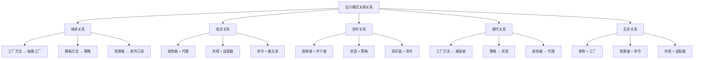

# 🔗 模式之间的关联关系

[[07-模式关系与组合/02-模式组合使用策略]] ← [[07-模式关系与组合/03-模式演化与变种]]
## 🎯 模式关联关系概览

### 📊 关联关系图



## 🏗️ 创建型模式关联关系

### 📋 **工厂方法 → 抽象工厂**

#### **继承关系**
```java
// ✅ 工厂方法是抽象工厂的基础
public abstract class DocumentFactory {
    // 工厂方法
    public abstract Document createDocument();
    
    // 模板方法
    public Document processDocument() {
        Document doc = createDocument();
        doc.initialize();
        doc.process();
        return doc;
    }
}

// ✅ 抽象工厂扩展工厂方法
public abstract class UIFactory extends DocumentFactory {
    // 抽象工厂方法
    public abstract Button createButton();
    public abstract TextField createTextField();
    public abstract Window createWindow();
    
    // 重写工厂方法
    @Override
    public Document createDocument() {
        return new UIDocument(createButton(), createTextField(), createWindow());
    }
}

// ✅ 具体实现
public class WindowsUIFactory extends UIFactory {
    @Override
    public Button createButton() {
        return new WindowsButton();
    }
    
    @Override
    public TextField createTextField() {
        return new WindowsTextField();
    }
    
    @Override
    public Window createWindow() {
        return new WindowsWindow();
    }
}
```

#### **关联特点**
- **继承性**: 抽象工厂继承工厂方法的核心思想
- **扩展性**: 抽象工厂在工厂方法基础上增加了产品族概念
- **层次性**: 工厂方法处理单一产品，抽象工厂处理产品族

### 📋 **建造者 ↔ 工厂方法**

#### **替代关系**
```java
// ✅ 工厂方法：简单对象创建
public class SimpleUserFactory {
    public User createUser(String name, String email) {
        return new User(name, email);
    }
}

// ✅ 建造者：复杂对象创建
public class ComplexUserBuilder {
    private String name;
    private String email;
    private String phone;
    private String address;
    private List<String> roles;
    
    public ComplexUserBuilder setName(String name) {
        this.name = name;
        return this;
    }
    
    public ComplexUserBuilder setEmail(String email) {
        this.email = email;
        return this;
    }
    
    public ComplexUserBuilder setPhone(String phone) {
        this.phone = phone;
        return this;
    }
    
    public ComplexUserBuilder setAddress(String address) {
        this.address = address;
        return this;
    }
    
    public ComplexUserBuilder setRoles(List<String> roles) {
        this.roles = roles;
        return this;
    }
    
    public User build() {
        return new User(name, email, phone, address, roles);
    }
}

// ✅ 使用场景选择
public class UserCreationService {
    public User createSimpleUser(String name, String email) {
        // 简单场景使用工厂方法
        return new SimpleUserFactory().createUser(name, email);
    }
    
    public User createComplexUser(String name, String email, String phone, 
                                 String address, List<String> roles) {
        // 复杂场景使用建造者
        return new ComplexUserBuilder()
            .setName(name)
            .setEmail(email)
            .setPhone(phone)
            .setAddress(address)
            .setRoles(roles)
            .build();
    }
}
```

#### **选择标准**
| 场景 | 推荐模式 | 原因 |
|------|----------|------|
| **简单对象创建** | 工厂方法 | 代码简洁，易于理解 |
| **复杂对象创建** | 建造者 | 参数多，构建过程复杂 |
| **需要分步构建** | 建造者 | 支持链式调用 |
| **需要类型安全** | 工厂方法 | 编译时类型检查 |

## 🏗️ 结构型模式关联关系

### 📋 **装饰器 + 代理**

#### **组合关系**
```java
// ✅ 装饰器和代理组合使用
public interface DataService {
    String getData(String key);
    void setData(String key, String value);
}

// ✅ 基础服务
public class DatabaseService implements DataService {
    @Override
    public String getData(String key) {
        return "Data from database: " + key;
    }
    
    @Override
    public void setData(String key, String value) {
        System.out.println("Saving to database: " + key + " = " + value);
    }
}

// ✅ 代理：访问控制
public class SecurityProxy implements DataService {
    private DataService service;
    private SecurityService securityService;
    
    public SecurityProxy(DataService service, SecurityService securityService) {
        this.service = service;
        this.securityService = securityService;
    }
    
    @Override
    public String getData(String key) {
        if (securityService.hasReadPermission(key)) {
            return service.getData(key);
        }
        throw new SecurityException("No read permission for: " + key);
    }
    
    @Override
    public void setData(String key, String value) {
        if (securityService.hasWritePermission(key)) {
            service.setData(key, value);
        } else {
            throw new SecurityException("No write permission for: " + key);
        }
    }
}

// ✅ 装饰器：功能增强
public class CachingDecorator implements DataService {
    private DataService service;
    private Map<String, String> cache;
    
    public CachingDecorator(DataService service) {
        this.service = service;
        this.cache = new HashMap<>();
    }
    
    @Override
    public String getData(String key) {
        if (cache.containsKey(key)) {
            System.out.println("Cache hit for: " + key);
            return cache.get(key);
        }
        
        String data = service.getData(key);
        cache.put(key, data);
        System.out.println("Cache miss for: " + key);
        return data;
    }
    
    @Override
    public void setData(String key, String value) {
        service.setData(key, value);
        cache.put(key, value);
    }
}

// ✅ 组合使用
public class DataServiceFactory {
    public static DataService createSecureCachedService() {
        DataService baseService = new DatabaseService();
        DataService securedService = new SecurityProxy(baseService, new SecurityService());
        DataService cachedService = new CachingDecorator(securedService);
        return cachedService;
    }
}
```

#### **组合特点**
- **层次性**: 代理在外层控制访问，装饰器在内层增强功能
- **透明性**: 客户端无需知道具体的组合层次
- **灵活性**: 可以动态组合不同的功能

### 📋 **外观 + 适配器**

#### **互补关系**
```java
// ✅ 外观模式：简化复杂子系统
public class OrderFacade {
    private PaymentService paymentService;
    private InventoryService inventoryService;
    private ShippingService shippingService;
    private NotificationService notificationService;
    
    public OrderFacade() {
        this.paymentService = new PaymentService();
        this.inventoryService = new InventoryService();
        this.shippingService = new ShippingService();
        this.notificationService = new NotificationService();
    }
    
    public void processOrder(Order order) {
        // 简化复杂的订单处理流程
        paymentService.processPayment(order.getPayment());
        inventoryService.reserveItems(order.getItems());
        shippingService.scheduleShipping(order);
        notificationService.sendConfirmation(order);
    }
}

// ✅ 适配器模式：集成第三方服务
public class ThirdPartyPaymentAdapter implements PaymentService {
    private ThirdPartyPaymentService thirdPartyService;
    
    public ThirdPartyPaymentAdapter(ThirdPartyPaymentService thirdPartyService) {
        this.thirdPartyService = thirdPartyService;
    }
    
    @Override
    public void processPayment(Payment payment) {
        // 适配第三方支付接口
        ThirdPartyPaymentRequest request = convertPayment(payment);
        ThirdPartyPaymentResponse response = thirdPartyService.pay(request);
        handleResponse(response);
    }
    
    private ThirdPartyPaymentRequest convertPayment(Payment payment) {
        return new ThirdPartyPaymentRequest(
            payment.getAmount(),
            payment.getCurrency(),
            payment.getCardNumber()
        );
    }
    
    private void handleResponse(ThirdPartyPaymentResponse response) {
        if (!response.isSuccess()) {
            throw new PaymentException("Payment failed: " + response.getErrorMessage());
        }
    }
}

// ✅ 组合使用
public class EnhancedOrderFacade extends OrderFacade {
    public EnhancedOrderFacade() {
        super();
        // 使用适配器集成第三方支付
        this.paymentService = new ThirdPartyPaymentAdapter(new ThirdPartyPaymentService());
    }
}
```

## 🏗️ 行为型模式关联关系

### 📋 **观察者 + 中介者**

#### **协作关系**
```java
// ✅ 观察者模式：事件通知
public class EventPublisher {
    private List<EventListener> listeners;
    
    public EventPublisher() {
        this.listeners = new ArrayList<>();
    }
    
    public void addListener(EventListener listener) {
        listeners.add(listener);
    }
    
    public void publishEvent(Event event) {
        for (EventListener listener : listeners) {
            listener.onEvent(event);
        }
    }
}

// ✅ 中介者模式：协调对象交互
public class ChatMediator {
    private List<User> users;
    private EventPublisher eventPublisher;
    
    public ChatMediator() {
        this.users = new ArrayList<>();
        this.eventPublisher = new EventPublisher();
    }
    
    public void addUser(User user) {
        users.add(user);
        eventPublisher.addListener(user);
    }
    
    public void sendMessage(User sender, String message) {
        // 中介者协调消息发送
        ChatEvent event = new ChatEvent(sender, message);
        eventPublisher.publishEvent(event);
    }
}

// ✅ 用户类：既是观察者又是同事
public class User implements EventListener {
    private String name;
    private ChatMediator mediator;
    
    public User(String name, ChatMediator mediator) {
        this.name = name;
        this.mediator = mediator;
    }
    
    @Override
    public void onEvent(Event event) {
        if (event instanceof ChatEvent) {
            ChatEvent chatEvent = (ChatEvent) event;
            if (!chatEvent.getSender().equals(this)) {
                System.out.println(name + " received: " + chatEvent.getMessage());
            }
        }
    }
    
    public void sendMessage(String message) {
        mediator.sendMessage(this, message);
    }
}
```

#### **协作特点**
- **解耦**: 观察者解耦事件发布者和订阅者
- **协调**: 中介者协调对象间的交互
- **扩展**: 可以轻松添加新的事件类型和参与者

### 📋 **状态 + 策略**

#### **替代关系**
```java
// ✅ 状态模式：状态转换
public class OrderStateMachine {
    private OrderState currentState;
    
    public OrderStateMachine() {
        this.currentState = new PendingState();
    }
    
    public void setState(OrderState state) {
        this.currentState = state;
    }
    
    public void processOrder(Order order) {
        currentState.processOrder(order);
    }
    
    public void cancelOrder(Order order) {
        currentState.cancelOrder(order);
    }
}

// ✅ 状态接口
public interface OrderState {
    void processOrder(Order order);
    void cancelOrder(Order order);
}

// ✅ 具体状态
public class PendingState implements OrderState {
    @Override
    public void processOrder(Order order) {
        System.out.println("Processing pending order");
        // 状态转换逻辑
    }
    
    @Override
    public void cancelOrder(Order order) {
        System.out.println("Cancelling pending order");
    }
}

// ✅ 策略模式：算法选择
public class PaymentStrategy {
    private PaymentMethod paymentMethod;
    
    public void setPaymentMethod(PaymentMethod paymentMethod) {
        this.paymentMethod = paymentMethod;
    }
    
    public void processPayment(double amount) {
        paymentMethod.pay(amount);
    }
}

// ✅ 支付方法接口
public interface PaymentMethod {
    void pay(double amount);
}

// ✅ 具体支付方法
public class CreditCardPayment implements PaymentMethod {
    @Override
    public void pay(double amount) {
        System.out.println("Paying " + amount + " with credit card");
    }
}

public class PayPalPayment implements PaymentMethod {
    @Override
    public void pay(double amount) {
        System.out.println("Paying " + amount + " with PayPal");
    }
}
```

#### **选择标准**
| 场景 | 推荐模式 | 原因 |
|------|----------|------|
| **状态转换** | 状态模式 | 状态间有转换关系 |
| **算法选择** | 策略模式 | 算法间无转换关系 |
| **行为变化** | 状态模式 | 行为随状态变化 |
| **功能切换** | 策略模式 | 功能可以独立切换 |

## 🔧 模式关联关系分析

### 📋 **关联强度矩阵**

| 模式A | 模式B | 关联强度 | 关系类型 | 应用场景 |
|-------|-------|----------|----------|----------|
| 工厂方法 | 抽象工厂 | 强 | 继承 | 产品族创建 |
| 装饰器 | 代理 | 强 | 组合 | 功能增强+访问控制 |
| 外观 | 适配器 | 中 | 互补 | 系统集成 |
| 观察者 | 中介者 | 中 | 协作 | 事件驱动系统 |
| 状态 | 策略 | 弱 | 替代 | 行为管理 |
| 命令 | 备忘录 | 中 | 组合 | 撤销重做 |
| 责任链 | 命令 | 中 | 协作 | 请求处理 |
| 模板方法 | 策略 | 弱 | 替代 | 算法框架 |

### 🎯 **关联关系工具**

```java
// ✅ 模式关联关系分析工具
public class PatternRelationshipAnalyzer {
    private Map<String, List<PatternRelationship>> relationships;
    
    public PatternRelationshipAnalyzer() {
        this.relationships = new HashMap<>();
        initializeRelationships();
    }
    
    private void initializeRelationships() {
        // 继承关系
        relationships.put("工厂方法", Arrays.asList(
            new PatternRelationship("抽象工厂", RelationshipType.INHERITANCE, "强", "产品族创建")
        ));
        
        // 组合关系
        relationships.put("装饰器", Arrays.asList(
            new PatternRelationship("代理", RelationshipType.COMPOSITION, "强", "功能增强+访问控制")
        ));
        
        // 协作关系
        relationships.put("观察者", Arrays.asList(
            new PatternRelationship("中介者", RelationshipType.COLLABORATION, "中", "事件驱动系统")
        ));
        
        // 替代关系
        relationships.put("状态", Arrays.asList(
            new PatternRelationship("策略", RelationshipType.SUBSTITUTION, "弱", "行为管理")
        ));
    }
    
    // 分析模式关联关系
    public void analyzeRelationships(String patternName) {
        List<PatternRelationship> patternRelationships = relationships.get(patternName);
        
        if (patternRelationships != null) {
            System.out.println("=== " + patternName + " 关联关系分析 ===");
            for (PatternRelationship relationship : patternRelationships) {
                System.out.println("关联模式: " + relationship.getRelatedPattern());
                System.out.println("关系类型: " + relationship.getType());
                System.out.println("关联强度: " + relationship.getStrength());
                System.out.println("应用场景: " + relationship.getScenario());
                System.out.println("---");
            }
        } else {
            System.out.println("未找到 " + patternName + " 的关联关系");
        }
    }
    
    // 获取所有关联关系
    public Map<String, List<PatternRelationship>> getAllRelationships() {
        return new HashMap<>(relationships);
    }
}

public class PatternRelationship {
    private String relatedPattern;
    private RelationshipType type;
    private String strength;
    private String scenario;
    
    public PatternRelationship(String relatedPattern, RelationshipType type, String strength, String scenario) {
        this.relatedPattern = relatedPattern;
        this.type = type;
        this.strength = strength;
        this.scenario = scenario;
    }
    
    // Getters
    public String getRelatedPattern() { return relatedPattern; }
    public RelationshipType getType() { return type; }
    public String getStrength() { return strength; }
    public String getScenario() { return scenario; }
}

public enum RelationshipType {
    INHERITANCE, COMPOSITION, COLLABORATION, SUBSTITUTION, COMPLEMENTARY
}
```

## 🎯 模式关联关系最佳实践

### 📋 **使用指南**

1. **理解关系类型**:
   - 继承关系：模式间的层次关系
   - 组合关系：模式间的包含关系
   - 协作关系：模式间的配合关系
   - 替代关系：模式间的选择关系

2. **选择合适组合**:
   - 根据问题复杂度选择模式组合
   - 考虑模式间的兼容性
   - 评估组合后的复杂度

3. **避免过度设计**:
   - 不要为了使用模式而使用模式
   - 优先选择简单有效的组合
   - 考虑维护成本

### ⚠️ **注意事项**

1. **复杂度控制**: 模式组合可能增加系统复杂度
2. **性能影响**: 多层模式组合可能影响性能
3. **维护成本**: 复杂的模式关系增加维护难度
4. **团队理解**: 确保团队能够理解和维护

## 🔗 学习衔接

- **下一文档** → [[模式组合使用策略]]
- **模式对比** → [[05-行为型模式/13-行为型模式对比表]]
- **实际应用** → [[08-实际应用]]

---
**💡 关联关系精髓**: 设计模式之间的关联关系就像人际关系，有些是父子关系（继承），有些是朋友关系（协作），有些是竞争关系（替代）。理解这些关系有助于我们更好地选择和组合模式，构建更优雅的软件架构！
