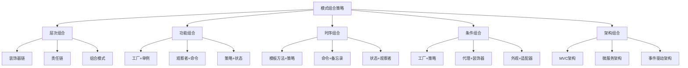

# 🎯 模式组合使用策略

[[07-模式关系与组合/01-模式之间的关联关系]] ← [[07-模式关系与组合/03-模式演化与变种]]
## 🎯 模式组合策略概览

### 📊 组合策略框架



## 🏗️ 层次组合策略

### 📋 **装饰器链组合**

#### **策略描述**
装饰器模式可以链式组合，每个装饰器添加一层功能，形成功能增强链。

#### **实现示例**
```java
// ✅ 基础服务接口
public interface DataService {
    String getData(String key);
    void setData(String key, String value);
}

// ✅ 基础实现
public class DatabaseService implements DataService {
    @Override
    public String getData(String key) {
        return "Data from database: " + key;
    }
    
    @Override
    public void setData(String key, String value) {
        System.out.println("Saving to database: " + key + " = " + value);
    }
}

// ✅ 缓存装饰器
public class CachingDecorator implements DataService {
    private DataService service;
    private Map<String, String> cache;
    
    public CachingDecorator(DataService service) {
        this.service = service;
        this.cache = new HashMap<>();
    }
    
    @Override
    public String getData(String key) {
        if (cache.containsKey(key)) {
            System.out.println("Cache hit for: " + key);
            return cache.get(key);
        }
        
        String data = service.getData(key);
        cache.put(key, data);
        System.out.println("Cache miss for: " + key);
        return data;
    }
    
    @Override
    public void setData(String key, String value) {
        service.setData(key, value);
        cache.put(key, value);
    }
}

// ✅ 日志装饰器
public class LoggingDecorator implements DataService {
    private DataService service;
    private Logger logger;
    
    public LoggingDecorator(DataService service) {
        this.service = service;
        this.logger = LoggerFactory.getLogger(service.getClass());
    }
    
    @Override
    public String getData(String key) {
        logger.info("Getting data for key: " + key);
        String data = service.getData(key);
        logger.info("Retrieved data: " + data);
        return data;
    }
    
    @Override
    public void setData(String key, String value) {
        logger.info("Setting data for key: " + key + ", value: " + value);
        service.setData(key, value);
        logger.info("Data set successfully");
    }
}

// ✅ 压缩装饰器
public class CompressionDecorator implements DataService {
    private DataService service;
    
    public CompressionDecorator(DataService service) {
        this.service = service;
    }
    
    @Override
    public String getData(String key) {
        String compressedData = service.getData(key);
        return decompress(compressedData);
    }
    
    @Override
    public void setData(String key, String value) {
        String compressedValue = compress(value);
        service.setData(key, compressedValue);
    }
    
    private String compress(String data) {
        // 模拟压缩
        return "compressed_" + data;
    }
    
    private String decompress(String data) {
        // 模拟解压缩
        return data.startsWith("compressed_") ? data.substring(11) : data;
    }
}

// ✅ 装饰器链构建器
public class DecoratorChainBuilder {
    private DataService service;
    
    public DecoratorChainBuilder(DataService service) {
        this.service = service;
    }
    
    public DecoratorChainBuilder addCaching() {
        this.service = new CachingDecorator(service);
        return this;
    }
    
    public DecoratorChainBuilder addLogging() {
        this.service = new LoggingDecorator(service);
        return this;
    }
    
    public DecoratorChainBuilder addCompression() {
        this.service = new CompressionDecorator(service);
        return this;
    }
    
    public DataService build() {
        return service;
    }
}

// ✅ 使用示例
public class DecoratorChainDemo {
    public static void main(String[] args) {
        // 构建装饰器链
        DataService service = new DecoratorChainBuilder(new DatabaseService())
            .addCaching()
            .addLogging()
            .addCompression()
            .build();
        
        // 使用服务
        service.setData("user:1", "John Doe");
        String data = service.getData("user:1");
        System.out.println("Retrieved: " + data);
    }
}
```

#### **组合特点**
- **透明性**: 客户端无需知道装饰器链的具体结构
- **灵活性**: 可以动态添加或移除装饰器
- **可扩展性**: 可以轻松添加新的装饰器类型

### 📋 **责任链组合**

#### **策略描述**
责任链模式可以组合多个处理器，形成处理链，每个处理器处理特定类型的请求。

#### **实现示例**
```java
// ✅ 请求对象
public class Request {
    private String type;
    private String content;
    private Map<String, Object> parameters;
    
    public Request(String type, String content) {
        this.type = type;
        this.content = content;
        this.parameters = new HashMap<>();
    }
    
    // Getters and setters
    public String getType() { return type; }
    public String getContent() { return content; }
    public Map<String, Object> getParameters() { return parameters; }
}

// ✅ 处理器接口
public interface RequestHandler {
    void handleRequest(Request request);
    void setNextHandler(RequestHandler nextHandler);
    boolean canHandle(Request request);
}

// ✅ 抽象处理器
public abstract class AbstractRequestHandler implements RequestHandler {
    protected RequestHandler nextHandler;
    
    @Override
    public void setNextHandler(RequestHandler nextHandler) {
        this.nextHandler = nextHandler;
    }
    
    @Override
    public void handleRequest(Request request) {
        if (canHandle(request)) {
            processRequest(request);
        } else if (nextHandler != null) {
            nextHandler.handleRequest(request);
        } else {
            System.out.println("No handler found for request: " + request.getType());
        }
    }
    
    protected abstract void processRequest(Request request);
}

// ✅ 具体处理器
public class AuthenticationHandler extends AbstractRequestHandler {
    @Override
    public boolean canHandle(Request request) {
        return "AUTH".equals(request.getType());
    }
    
    @Override
    protected void processRequest(Request request) {
        System.out.println("Processing authentication request: " + request.getContent());
        // 认证逻辑
        request.getParameters().put("authenticated", true);
    }
}

public class AuthorizationHandler extends AbstractRequestHandler {
    @Override
    public boolean canHandle(Request request) {
        return "AUTHZ".equals(request.getType());
    }
    
    @Override
    protected void processRequest(Request request) {
        System.out.println("Processing authorization request: " + request.getContent());
        // 授权逻辑
        request.getParameters().put("authorized", true);
    }
}

public class ValidationHandler extends AbstractRequestHandler {
    @Override
    public boolean canHandle(Request request) {
        return "VALIDATION".equals(request.getType());
    }
    
    @Override
    protected void processRequest(Request request) {
        System.out.println("Processing validation request: " + request.getContent());
        // 验证逻辑
        request.getParameters().put("validated", true);
    }
}

public class ProcessingHandler extends AbstractRequestHandler {
    @Override
    public boolean canHandle(Request request) {
        return "PROCESSING".equals(request.getType());
    }
    
    @Override
    protected void processRequest(Request request) {
        System.out.println("Processing business request: " + request.getContent());
        // 业务处理逻辑
        request.getParameters().put("processed", true);
    }
}

// ✅ 责任链构建器
public class ChainBuilder {
    private RequestHandler firstHandler;
    private RequestHandler lastHandler;
    
    public ChainBuilder addHandler(RequestHandler handler) {
        if (firstHandler == null) {
            firstHandler = handler;
            lastHandler = handler;
        } else {
            lastHandler.setNextHandler(handler);
            lastHandler = handler;
        }
        return this;
    }
    
    public RequestHandler build() {
        return firstHandler;
    }
}

// ✅ 使用示例
public class ChainDemo {
    public static void main(String[] args) {
        // 构建责任链
        RequestHandler chain = new ChainBuilder()
            .addHandler(new AuthenticationHandler())
            .addHandler(new AuthorizationHandler())
            .addHandler(new ValidationHandler())
            .addHandler(new ProcessingHandler())
            .build();
        
        // 处理请求
        Request request1 = new Request("AUTH", "user:john");
        chain.handleRequest(request1);
        
        Request request2 = new Request("PROCESSING", "order:123");
        chain.handleRequest(request2);
    }
}
```

## 🏗️ 功能组合策略

### 📋 **工厂+单例组合**

#### **策略描述**
工厂模式负责创建对象，单例模式确保某些对象只有一个实例，两者结合可以创建单例对象。

#### **实现示例**
```java
// ✅ 单例工厂
public class SingletonFactory {
    private static final Map<String, Object> instances = new HashMap<>();
    
    @SuppressWarnings("unchecked")
    public static <T> T getInstance(Class<T> clazz) {
        String className = clazz.getName();
        
        if (!instances.containsKey(className)) {
            synchronized (SingletonFactory.class) {
                if (!instances.containsKey(className)) {
                    try {
                        instances.put(className, clazz.newInstance());
                    } catch (InstantiationException | IllegalAccessException e) {
                        throw new RuntimeException("Failed to create instance", e);
                    }
                }
            }
        }
        
        return (T) instances.get(className);
    }
    
    public static <T> T getInstance(Class<T> clazz, Object... args) {
        String className = clazz.getName();
        
        if (!instances.containsKey(className)) {
            synchronized (SingletonFactory.class) {
                if (!instances.containsKey(className)) {
                    try {
                        Class<?>[] paramTypes = new Class[args.length];
                        for (int i = 0; i < args.length; i++) {
                            paramTypes[i] = args[i].getClass();
                        }
                        
                        Constructor<T> constructor = clazz.getConstructor(paramTypes);
                        instances.put(className, constructor.newInstance(args));
                    } catch (Exception e) {
                        throw new RuntimeException("Failed to create instance", e);
                    }
                }
            }
        }
        
        return (T) instances.get(className);
    }
}

// ✅ 配置管理器（单例）
public class ConfigManager {
    private static ConfigManager instance;
    private Map<String, String> config;
    
    private ConfigManager() {
        this.config = new HashMap<>();
        loadConfig();
    }
    
    public static ConfigManager getInstance() {
        if (instance == null) {
            synchronized (ConfigManager.class) {
                if (instance == null) {
                    instance = new ConfigManager();
                }
            }
        }
        return instance;
    }
    
    private void loadConfig() {
        // 加载配置
        config.put("database.url", "jdbc:mysql://localhost:3306/test");
        config.put("database.username", "root");
        config.put("database.password", "password");
    }
    
    public String getConfig(String key) {
        return config.get(key);
    }
    
    public void setConfig(String key, String value) {
        config.put(key, value);
    }
}

// ✅ 数据库连接工厂（单例）
public class DatabaseConnectionFactory {
    private static DatabaseConnectionFactory instance;
    private ConfigManager configManager;
    
    private DatabaseConnectionFactory() {
        this.configManager = ConfigManager.getInstance();
    }
    
    public static DatabaseConnectionFactory getInstance() {
        if (instance == null) {
            synchronized (DatabaseConnectionFactory.class) {
                if (instance == null) {
                    instance = new DatabaseConnectionFactory();
                }
            }
        }
        return instance;
    }
    
    public Connection createConnection() {
        String url = configManager.getConfig("database.url");
        String username = configManager.getConfig("database.username");
        String password = configManager.getConfig("database.password");
        
        try {
            return DriverManager.getConnection(url, username, password);
        } catch (SQLException e) {
            throw new RuntimeException("Failed to create database connection", e);
        }
    }
}

// ✅ 使用示例
public class FactorySingletonDemo {
    public static void main(String[] args) {
        // 使用单例工厂
        ConfigManager config1 = SingletonFactory.getInstance(ConfigManager.class);
        ConfigManager config2 = SingletonFactory.getInstance(ConfigManager.class);
        System.out.println("Same instance: " + (config1 == config2));
        
        // 使用单例工厂创建数据库连接工厂
        DatabaseConnectionFactory factory1 = SingletonFactory.getInstance(DatabaseConnectionFactory.class);
        DatabaseConnectionFactory factory2 = SingletonFactory.getInstance(DatabaseConnectionFactory.class);
        System.out.println("Same factory instance: " + (factory1 == factory2));
        
        // 创建数据库连接
        Connection connection = factory1.createConnection();
        System.out.println("Connection created: " + (connection != null));
    }
}
```

### 📋 **观察者+命令组合**

#### **策略描述**
观察者模式负责通知状态变化，命令模式负责封装操作，两者结合可以实现事件驱动的命令执行。

#### **实现示例**
```java
// ✅ 命令接口
public interface Command {
    void execute();
    void undo();
    String getDescription();
}

// ✅ 具体命令
public class SaveCommand implements Command {
    private Document document;
    private String content;
    private String previousContent;
    
    public SaveCommand(Document document, String content) {
        this.document = document;
        this.content = content;
        this.previousContent = document.getContent();
    }
    
    @Override
    public void execute() {
        document.setContent(content);
        System.out.println("Document saved: " + content);
    }
    
    @Override
    public void undo() {
        document.setContent(previousContent);
        System.out.println("Document restored: " + previousContent);
    }
    
    @Override
    public String getDescription() {
        return "Save document";
    }
}

public class DeleteCommand implements Command {
    private Document document;
    private String deletedContent;
    
    public DeleteCommand(Document document) {
        this.document = document;
        this.deletedContent = document.getContent();
    }
    
    @Override
    public void execute() {
        document.setContent("");
        System.out.println("Document deleted");
    }
    
    @Override
    public void undo() {
        document.setContent(deletedContent);
        System.out.println("Document restored: " + deletedContent);
    }
    
    @Override
    public String getDescription() {
        return "Delete document";
    }
}

// ✅ 文档类（被观察者）
public class Document extends Observable {
    private String content;
    
    public Document(String content) {
        this.content = content;
    }
    
    public String getContent() {
        return content;
    }
    
    public void setContent(String content) {
        String oldContent = this.content;
        this.content = content;
        
        // 通知观察者
        setChanged();
        notifyObservers(new DocumentChangeEvent(oldContent, content));
    }
}

// ✅ 文档变化事件
public class DocumentChangeEvent {
    private String oldContent;
    private String newContent;
    private LocalDateTime timestamp;
    
    public DocumentChangeEvent(String oldContent, String newContent) {
        this.oldContent = oldContent;
        this.newContent = newContent;
        this.timestamp = LocalDateTime.now();
    }
    
    // Getters
    public String getOldContent() { return oldContent; }
    public String getNewContent() { return newContent; }
    public LocalDateTime getTimestamp() { return timestamp; }
}

// ✅ 命令执行器（观察者）
public class CommandExecutor implements Observer {
    private List<Command> commandHistory;
    private int currentIndex;
    
    public CommandExecutor() {
        this.commandHistory = new ArrayList<>();
        this.currentIndex = -1;
    }
    
    public void executeCommand(Command command) {
        command.execute();
        
        // 添加到历史记录
        if (currentIndex < commandHistory.size() - 1) {
            // 如果当前位置不是最后，删除后面的命令
            commandHistory = commandHistory.subList(0, currentIndex + 1);
        }
        
        commandHistory.add(command);
        currentIndex++;
        
        System.out.println("Command executed: " + command.getDescription());
    }
    
    public void undo() {
        if (currentIndex >= 0) {
            Command command = commandHistory.get(currentIndex);
            command.undo();
            currentIndex--;
            System.out.println("Command undone: " + command.getDescription());
        } else {
            System.out.println("No command to undo");
        }
    }
    
    public void redo() {
        if (currentIndex < commandHistory.size() - 1) {
            currentIndex++;
            Command command = commandHistory.get(currentIndex);
            command.execute();
            System.out.println("Command redone: " + command.getDescription());
        } else {
            System.out.println("No command to redo");
        }
    }
    
    @Override
    public void update(Observable o, Object arg) {
        if (arg instanceof DocumentChangeEvent) {
            DocumentChangeEvent event = (DocumentChangeEvent) arg;
            System.out.println("Document changed from '" + event.getOldContent() + 
                             "' to '" + event.getNewContent() + "'");
        }
    }
}

// ✅ 使用示例
public class ObserverCommandDemo {
    public static void main(String[] args) {
        // 创建文档和命令执行器
        Document document = new Document("Initial content");
        CommandExecutor executor = new CommandExecutor();
        
        // 注册观察者
        document.addObserver(executor);
        
        // 执行命令
        executor.executeCommand(new SaveCommand(document, "Updated content"));
        executor.executeCommand(new SaveCommand(document, "Final content"));
        
        // 撤销操作
        executor.undo();
        executor.undo();
        
        // 重做操作
        executor.redo();
        executor.redo();
    }
}
```

## 🏗️ 时序组合策略

### 📋 **模板方法+策略组合**

#### **策略描述**
模板方法模式定义算法框架，策略模式提供具体实现，两者结合可以实现灵活的算法框架。

#### **实现示例**
```java
// ✅ 数据处理模板
public abstract class DataProcessorTemplate {
    // 模板方法
    public final void processData(String input, String output) {
        System.out.println("开始数据处理流程...");
        
        // 1. 初始化
        initialize();
        
        // 2. 读取数据
        String data = readData(input);
        
        // 3. 验证数据
        if (validateData(data)) {
            // 4. 处理数据
            String processedData = processDataInternal(data);
            
            // 5. 后处理
            postProcess(processedData);
            
            // 6. 保存结果
            saveResults(processedData, output);
        } else {
            System.out.println("数据验证失败");
        }
        
        // 7. 清理资源
        cleanup();
        
        System.out.println("数据处理流程完成");
    }
    
    // 抽象方法：子类必须实现
    protected abstract String readData(String input);
    protected abstract String processDataInternal(String data);
    protected abstract void saveResults(String data, String output);
    
    // 钩子方法：子类可以重写
    protected void initialize() {
        System.out.println("初始化处理器");
    }
    
    protected boolean validateData(String data) {
        return data != null && !data.trim().isEmpty();
    }
    
    protected void postProcess(String data) {
        System.out.println("后处理完成");
    }
    
    protected void cleanup() {
        System.out.println("清理资源");
    }
}

// ✅ 策略接口
public interface ProcessingStrategy {
    String process(String data);
    String getStrategyName();
}

// ✅ 具体策略
public class UpperCaseStrategy implements ProcessingStrategy {
    @Override
    public String process(String data) {
        return data.toUpperCase();
    }
    
    @Override
    public String getStrategyName() {
        return "UpperCase";
    }
}

public class LowerCaseStrategy implements ProcessingStrategy {
    @Override
    public String process(String data) {
        return data.toLowerCase();
    }
    
    @Override
    public String getStrategyName() {
        return "LowerCase";
    }
}

public class ReverseStrategy implements ProcessingStrategy {
    @Override
    public String process(String data) {
        return new StringBuilder(data).reverse().toString();
    }
    
    @Override
    public String getStrategyName() {
        return "Reverse";
    }
}

// ✅ 具体处理器
public class TextProcessor extends DataProcessorTemplate {
    private ProcessingStrategy strategy;
    
    public TextProcessor(ProcessingStrategy strategy) {
        this.strategy = strategy;
    }
    
    public void setStrategy(ProcessingStrategy strategy) {
        this.strategy = strategy;
    }
    
    @Override
    protected String readData(String input) {
        System.out.println("读取文本文件: " + input);
        // 模拟读取文件
        return "Hello World";
    }
    
    @Override
    protected String processDataInternal(String data) {
        System.out.println("使用策略处理数据: " + strategy.getStrategyName());
        return strategy.process(data);
    }
    
    @Override
    protected void saveResults(String data, String output) {
        System.out.println("保存结果到文件: " + output);
        System.out.println("处理结果: " + data);
    }
    
    @Override
    protected void initialize() {
        super.initialize();
        System.out.println("初始化文本处理器，使用策略: " + strategy.getStrategyName());
    }
}

// ✅ 使用示例
public class TemplateStrategyDemo {
    public static void main(String[] args) {
        // 使用不同策略处理文本
        TextProcessor processor1 = new TextProcessor(new UpperCaseStrategy());
        processor1.processData("input.txt", "output.txt");
        
        System.out.println("\n--- 切换策略 ---");
        
        TextProcessor processor2 = new TextProcessor(new LowerCaseStrategy());
        processor2.processData("input.txt", "output.txt");
        
        System.out.println("\n--- 动态切换策略 ---");
        
        TextProcessor processor3 = new TextProcessor(new UpperCaseStrategy());
        processor3.processData("input.txt", "output1.txt");
        
        processor3.setStrategy(new ReverseStrategy());
        processor3.processData("input.txt", "output2.txt");
    }
}
```

## 🏗️ 条件组合策略

### 📋 **工厂+策略组合**

#### **策略描述**
工厂模式负责创建策略对象，策略模式提供算法实现，两者结合可以实现动态策略选择。

#### **实现示例**
```java
// ✅ 策略工厂
public class StrategyFactory {
    private static final Map<String, Class<? extends ProcessingStrategy>> strategies;
    
    static {
        strategies = new HashMap<>();
        strategies.put("UPPER", UpperCaseStrategy.class);
        strategies.put("LOWER", LowerCaseStrategy.class);
        strategies.put("REVERSE", ReverseStrategy.class);
        strategies.put("ENCRYPT", EncryptionStrategy.class);
        strategies.put("DECRYPT", DecryptionStrategy.class);
    }
    
    public static ProcessingStrategy createStrategy(String strategyType) {
        Class<? extends ProcessingStrategy> strategyClass = strategies.get(strategyType.toUpperCase());
        
        if (strategyClass == null) {
            throw new IllegalArgumentException("Unknown strategy type: " + strategyType);
        }
        
        try {
            return strategyClass.newInstance();
        } catch (InstantiationException | IllegalAccessException e) {
            throw new RuntimeException("Failed to create strategy", e);
        }
    }
    
    public static List<String> getAvailableStrategies() {
        return new ArrayList<>(strategies.keySet());
    }
}

// ✅ 加密策略
public class EncryptionStrategy implements ProcessingStrategy {
    @Override
    public String process(String data) {
        // 简单的加密算法
        StringBuilder encrypted = new StringBuilder();
        for (char c : data.toCharArray()) {
            encrypted.append((char) (c + 3));
        }
        return encrypted.toString();
    }
    
    @Override
    public String getStrategyName() {
        return "Encryption";
    }
}

// ✅ 解密策略
public class DecryptionStrategy implements ProcessingStrategy {
    @Override
    public String process(String data) {
        // 简单的解密算法
        StringBuilder decrypted = new StringBuilder();
        for (char c : data.toCharArray()) {
            decrypted.append((char) (c - 3));
        }
        return decrypted.toString();
    }
    
    @Override
    public String getStrategyName() {
        return "Decryption";
    }
}

// ✅ 策略选择器
public class StrategySelector {
    private Map<String, ProcessingStrategy> strategyCache;
    
    public StrategySelector() {
        this.strategyCache = new HashMap<>();
    }
    
    public ProcessingStrategy selectStrategy(String strategyType) {
        // 先从缓存中获取
        ProcessingStrategy strategy = strategyCache.get(strategyType);
        
        if (strategy == null) {
            // 使用工厂创建策略
            strategy = StrategyFactory.createStrategy(strategyType);
            strategyCache.put(strategyType, strategy);
        }
        
        return strategy;
    }
    
    public ProcessingStrategy selectStrategyByCondition(String data, String condition) {
        String strategyType;
        
        switch (condition.toLowerCase()) {
            case "encrypt":
                strategyType = "ENCRYPT";
                break;
            case "decrypt":
                strategyType = "DECRYPT";
                break;
            case "uppercase":
                strategyType = "UPPER";
                break;
            case "lowercase":
                strategyType = "LOWER";
                break;
            case "reverse":
                strategyType = "REVERSE";
                break;
            default:
                strategyType = "UPPER"; // 默认策略
        }
        
        return selectStrategy(strategyType);
    }
}

// ✅ 使用示例
public class FactoryStrategyDemo {
    public static void main(String[] args) {
        StrategySelector selector = new StrategySelector();
        
        // 使用工厂创建策略
        ProcessingStrategy strategy1 = StrategyFactory.createStrategy("UPPER");
        System.out.println("策略1结果: " + strategy1.process("hello world"));
        
        ProcessingStrategy strategy2 = StrategyFactory.createStrategy("ENCRYPT");
        String encrypted = strategy2.process("hello world");
        System.out.println("加密结果: " + encrypted);
        
        ProcessingStrategy strategy3 = StrategyFactory.createStrategy("DECRYPT");
        System.out.println("解密结果: " + strategy3.process(encrypted));
        
        // 使用选择器选择策略
        ProcessingStrategy selectedStrategy = selector.selectStrategyByCondition("test", "reverse");
        System.out.println("选择策略结果: " + selectedStrategy.process("test"));
        
        // 显示可用策略
        System.out.println("可用策略: " + StrategyFactory.getAvailableStrategies());
    }
}
```

## 🎯 模式组合最佳实践

### 📋 **组合原则**

1. **单一职责**: 每个模式只负责一个方面
2. **开闭原则**: 对扩展开放，对修改关闭
3. **里氏替换**: 子类可以替换父类
4. **接口隔离**: 接口应该小而专一
5. **依赖倒置**: 依赖抽象而不是具体

### 📋 **组合策略选择**

| 场景 | 推荐组合 | 原因 |
|------|----------|------|
| **功能增强** | 装饰器链 | 透明增强功能 |
| **请求处理** | 责任链 | 动态处理请求 |
| **对象创建** | 工厂+单例 | 控制实例创建 |
| **事件处理** | 观察者+命令 | 事件驱动执行 |
| **算法选择** | 工厂+策略 | 动态选择算法 |
| **流程控制** | 模板方法+策略 | 灵活算法框架 |

### ⚠️ **注意事项**

1. **复杂度控制**: 避免过度组合导致系统复杂
2. **性能考虑**: 多层组合可能影响性能
3. **维护成本**: 确保团队能够理解和维护
4. **测试难度**: 组合模式可能增加测试复杂度

## 🔗 学习衔接

- **上一文档** ← [[模式之间的关联关系]]
- **下一文档** → [[模式演化与变种]]
- **实际应用** → [[08-实际应用]]

---
**💡 组合策略精髓**: 模式组合就像搭积木，每个模式都是一块积木，通过不同的组合方式可以构建出不同的结构。关键是要理解每块积木的特性，选择最合适的组合方式，构建出既美观又实用的建筑！
