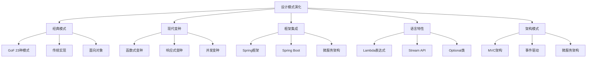

# 🔄 模式演化与变种

[[07-模式关系与组合/02-模式组合使用策略]] ← [[07-模式关系与组合/04-反模式识别与规避]]
## 🎯 模式演化概览

### 📊 演化路径图



## 🏗️ 经典模式演化

### 📋 **单例模式演化**

#### **传统实现**
```java
// ✅ 传统单例模式
public class TraditionalSingleton {
    private static TraditionalSingleton instance;
    
    private TraditionalSingleton() {}
    
    public static synchronized TraditionalSingleton getInstance() {
        if (instance == null) {
            instance = new TraditionalSingleton();
        }
        return instance;
    }
}
```

#### **现代变种**
```java
// ✅ 枚举单例（推荐）
public enum EnumSingleton {
    INSTANCE;
    
    public void doSomething() {
        System.out.println("Enum singleton doing something");
    }
}

// ✅ 双重检查锁定
public class DoubleCheckedSingleton {
    private static volatile DoubleCheckedSingleton instance;
    
    private DoubleCheckedSingleton() {}
    
    public static DoubleCheckedSingleton getInstance() {
        if (instance == null) {
            synchronized (DoubleCheckedSingleton.class) {
                if (instance == null) {
                    instance = new DoubleCheckedSingleton();
                }
            }
        }
        return instance;
    }
}

// ✅ 静态内部类单例
public class StaticInnerClassSingleton {
    private StaticInnerClassSingleton() {}
    
    private static class SingletonHolder {
        private static final StaticInnerClassSingleton INSTANCE = new StaticInnerClassSingleton();
    }
    
    public static StaticInnerClassSingleton getInstance() {
        return SingletonHolder.INSTANCE;
    }
}
```

#### **函数式变种**
```java
// ✅ 函数式单例
public class FunctionalSingleton {
    private static final Supplier<FunctionalSingleton> INSTANCE_SUPPLIER = 
        FunctionalSingleton::new;
    
    private FunctionalSingleton() {}
    
    public static FunctionalSingleton getInstance() {
        return INSTANCE_SUPPLIER.get();
    }
}

// ✅ Lambda单例
public class LambdaSingleton {
    private static final Function<Void, LambdaSingleton> INSTANCE_FUNCTION = 
        v -> new LambdaSingleton();
    
    private LambdaSingleton() {}
    
    public static LambdaSingleton getInstance() {
        return INSTANCE_FUNCTION.apply(null);
    }
}
```

### 📋 **观察者模式演化**

#### **传统实现**
```java
// ✅ 传统观察者模式
public class TraditionalSubject extends Observable {
    private String state;
    
    public void setState(String state) {
        this.state = state;
        setChanged();
        notifyObservers(state);
    }
}

public class TraditionalObserver implements Observer {
    @Override
    public void update(Observable o, Object arg) {
        System.out.println("Observer updated: " + arg);
    }
}
```

#### **现代变种**
```java
// ✅ 事件驱动变种
public class EventPublisher {
    private final List<EventListener> listeners;
    
    public EventPublisher() {
        this.listeners = new ArrayList<>();
    }
    
    public void addListener(EventListener listener) {
        listeners.add(listener);
    }
    
    public void publishEvent(Event event) {
        listeners.forEach(listener -> listener.onEvent(event));
    }
}

public interface EventListener {
    void onEvent(Event event);
}

public class Event {
    private final String type;
    private final Object data;
    private final LocalDateTime timestamp;
    
    public Event(String type, Object data) {
        this.type = type;
        this.data = data;
        this.timestamp = LocalDateTime.now();
    }
    
    // Getters
    public String getType() { return type; }
    public Object getData() { return data; }
    public LocalDateTime getTimestamp() { return timestamp; }
}
```

#### **响应式变种**
```java
// ✅ 响应式观察者
public class ReactiveSubject<T> {
    private final List<Subscriber<T>> subscribers;
    
    public ReactiveSubject() {
        this.subscribers = new ArrayList<>();
    }
    
    public void subscribe(Subscriber<T> subscriber) {
        subscribers.add(subscriber);
    }
    
    public void next(T value) {
        subscribers.forEach(subscriber -> subscriber.onNext(value));
    }
    
    public void error(Throwable error) {
        subscribers.forEach(subscriber -> subscriber.onError(error));
    }
    
    public void complete() {
        subscribers.forEach(Subscriber::onComplete);
    }
}

public interface Subscriber<T> {
    void onNext(T value);
    void onError(Throwable error);
    void onComplete();
}
```

## 🏗️ 框架集成演化

### 📋 **Spring框架集成**

#### **依赖注入变种**
```java
// ✅ Spring依赖注入
@Service
public class UserService {
    @Autowired
    private UserRepository userRepository;
    
    @Autowired
    private EmailService emailService;
    
    public User createUser(User user) {
        User savedUser = userRepository.save(user);
        emailService.sendWelcomeEmail(savedUser);
        return savedUser;
    }
}

// ✅ 配置类
@Configuration
public class AppConfig {
    @Bean
    public UserRepository userRepository() {
        return new JpaUserRepository();
    }
    
    @Bean
    public EmailService emailService() {
        return new SmtpEmailService();
    }
}
```

#### **AOP变种**
```java
// ✅ Spring AOP
@Aspect
@Component
public class LoggingAspect {
    @Around("@annotation(Loggable)")
    public Object logExecutionTime(ProceedingJoinPoint joinPoint) throws Throwable {
        long startTime = System.currentTimeMillis();
        
        Object result = joinPoint.proceed();
        
        long executionTime = System.currentTimeMillis() - startTime;
        System.out.println(joinPoint.getSignature() + " executed in " + executionTime + "ms");
        
        return result;
    }
}

@Loggable
@Service
public class OrderService {
    public Order createOrder(Order order) {
        // 业务逻辑
        return order;
    }
}
```

### 📋 **Spring Boot集成**

#### **自动配置变种**
```java
// ✅ Spring Boot自动配置
@Configuration
@ConditionalOnClass(DataSource.class)
@EnableConfigurationProperties(DatabaseProperties.class)
public class DatabaseAutoConfiguration {
    
    @Bean
    @ConditionalOnMissingBean
    public DataSource dataSource(DatabaseProperties properties) {
        return DataSourceBuilder.create()
            .url(properties.getUrl())
            .username(properties.getUsername())
            .password(properties.getPassword())
            .build();
    }
}

@ConfigurationProperties(prefix = "database")
public class DatabaseProperties {
    private String url;
    private String username;
    private String password;
    
    // Getters and setters
}
```

#### **Web层变种**
```java
// ✅ Spring Boot Web
@RestController
@RequestMapping("/api/users")
public class UserController {
    
    private final UserService userService;
    
    public UserController(UserService userService) {
        this.userService = userService;
    }
    
    @GetMapping("/{id}")
    public ResponseEntity<User> getUser(@PathVariable Long id) {
        return userService.findById(id)
            .map(user -> ResponseEntity.ok(user))
            .orElse(ResponseEntity.notFound().build());
    }
    
    @PostMapping
    public ResponseEntity<User> createUser(@RequestBody User user) {
        User createdUser = userService.createUser(user);
        return ResponseEntity.status(HttpStatus.CREATED).body(createdUser);
    }
}
```

## 🏗️ 语言特性演化

### 📋 **Java 8+特性集成**

#### **Lambda表达式变种**
```java
// ✅ 传统策略模式
public interface PaymentStrategy {
    void pay(double amount);
}

public class CreditCardPayment implements PaymentStrategy {
    @Override
    public void pay(double amount) {
        System.out.println("Paying " + amount + " with credit card");
    }
}

// ✅ Lambda策略模式
public class PaymentProcessor {
    private Map<String, PaymentStrategy> strategies;
    
    public PaymentProcessor() {
        this.strategies = new HashMap<>();
        
        // 使用Lambda表达式
        strategies.put("CREDIT_CARD", amount -> 
            System.out.println("Paying " + amount + " with credit card"));
        
        strategies.put("PAYPAL", amount -> 
            System.out.println("Paying " + amount + " with PayPal"));
        
        strategies.put("BANK_TRANSFER", amount -> 
            System.out.println("Paying " + amount + " with bank transfer"));
    }
    
    public void processPayment(String method, double amount) {
        PaymentStrategy strategy = strategies.get(method);
        if (strategy != null) {
            strategy.pay(amount);
        } else {
            throw new IllegalArgumentException("Unknown payment method: " + method);
        }
    }
}
```

#### **Stream API变种**
```java
// ✅ 传统迭代器模式
public class TraditionalIterator {
    public void processItems(List<String> items) {
        for (String item : items) {
            if (item.startsWith("A")) {
                System.out.println("Processing: " + item);
            }
        }
    }
}

// ✅ Stream API变种
public class StreamProcessor {
    public void processItems(List<String> items) {
        items.stream()
            .filter(item -> item.startsWith("A"))
            .map(item -> "Processing: " + item)
            .forEach(System.out::println);
    }
    
    public List<String> processAndCollect(List<String> items) {
        return items.stream()
            .filter(item -> item.length() > 3)
            .map(String::toUpperCase)
            .collect(Collectors.toList());
    }
}
```

#### **Optional变种**
```java
// ✅ 传统空值处理
public class TraditionalNullHandler {
    public String getUserName(User user) {
        if (user != null) {
            if (user.getProfile() != null) {
                if (user.getProfile().getName() != null) {
                    return user.getProfile().getName();
                }
            }
        }
        return "Unknown";
    }
}

// ✅ Optional变种
public class OptionalHandler {
    public String getUserName(User user) {
        return Optional.ofNullable(user)
            .map(User::getProfile)
            .map(Profile::getName)
            .orElse("Unknown");
    }
    
    public Optional<String> getUserNameOptional(User user) {
        return Optional.ofNullable(user)
            .map(User::getProfile)
            .map(Profile::getName);
    }
}
```

## 🏗️ 架构模式演化

### 📋 **微服务架构变种**

#### **服务发现变种**
```java
// ✅ 服务注册
@SpringBootApplication
@EnableEurekaClient
public class UserServiceApplication {
    public static void main(String[] args) {
        SpringApplication.run(UserServiceApplication.class, args);
    }
}

// ✅ 服务发现
@Service
public class OrderService {
    @Autowired
    private DiscoveryClient discoveryClient;
    
    @Autowired
    private RestTemplate restTemplate;
    
    public UserDTO getUser(Long userId) {
        String serviceUrl = discoveryClient.getInstances("user-service")
            .stream()
            .findFirst()
            .map(instance -> instance.getUri().toString())
            .orElseThrow(() -> new RuntimeException("User service not found"));
        
        return restTemplate.getForObject(serviceUrl + "/users/" + userId, UserDTO.class);
    }
}
```

#### **API网关变种**
```java
// ✅ Spring Cloud Gateway
@RestController
public class ApiGateway {
    
    @Autowired
    private UserServiceClient userServiceClient;
    
    @Autowired
    private OrderServiceClient orderServiceClient;
    
    @GetMapping("/api/users/{id}")
    public ResponseEntity<UserDTO> getUser(@PathVariable Long id) {
        return userServiceClient.getUser(id);
    }
    
    @GetMapping("/api/orders/{id}")
    public ResponseEntity<OrderDTO> getOrder(@PathVariable Long id) {
        return orderServiceClient.getOrder(id);
    }
    
    @GetMapping("/api/users/{userId}/orders")
    public ResponseEntity<List<OrderDTO>> getUserOrders(@PathVariable Long userId) {
        UserDTO user = userServiceClient.getUser(userId).getBody();
        List<OrderDTO> orders = orderServiceClient.getOrdersByUserId(userId).getBody();
        
        return ResponseEntity.ok(orders);
    }
}
```

### 📋 **事件驱动架构变种**

#### **事件溯源变种**
```java
// ✅ 事件溯源
@Entity
public class OrderAggregate {
    @Id
    private String id;
    
    private String status;
    private List<DomainEvent> events;
    
    public void processOrder(ProcessOrderCommand command) {
        if ("PENDING".equals(status)) {
            OrderProcessedEvent event = new OrderProcessedEvent(id, command.getOrderData());
            events.add(event);
            status = "PROCESSED";
        }
    }
    
    public void cancelOrder(CancelOrderCommand command) {
        if ("PROCESSED".equals(status)) {
            OrderCancelledEvent event = new OrderCancelledEvent(id, command.getReason());
            events.add(event);
            status = "CANCELLED";
        }
    }
}

// ✅ 事件存储
@Repository
public class EventStore {
    public void saveEvents(String aggregateId, List<DomainEvent> events) {
        events.forEach(event -> {
            EventEntity eventEntity = new EventEntity(aggregateId, event);
            eventRepository.save(eventEntity);
        });
    }
    
    public List<DomainEvent> getEvents(String aggregateId) {
        return eventRepository.findByAggregateId(aggregateId)
            .stream()
            .map(EventEntity::getEvent)
            .collect(Collectors.toList());
    }
}
```

## 🎯 模式演化趋势

### 📋 **演化方向**

| 演化方向 | 特点 | 代表技术 | 应用场景 |
|----------|------|----------|----------|
| **函数式编程** | 不可变性、纯函数 | Lambda、Stream | 数据处理、并发编程 |
| **响应式编程** | 异步、非阻塞 | RxJava、Reactor | 高并发、实时系统 |
| **微服务架构** | 服务拆分、独立部署 | Spring Cloud | 大型系统、云原生 |
| **事件驱动** | 松耦合、异步通信 | Event Sourcing、CQRS | 复杂业务、分布式系统 |
| **云原生** | 容器化、自动化 | Docker、Kubernetes | 云平台、DevOps |

### 📋 **演化工具**

```java
// ✅ 模式演化分析工具
public class PatternEvolutionAnalyzer {
    private Map<String, List<EvolutionStage>> evolutionHistory;
    
    public PatternEvolutionAnalyzer() {
        this.evolutionHistory = new HashMap<>();
        initializeEvolutionHistory();
    }
    
    private void initializeEvolutionHistory() {
        // 单例模式演化
        evolutionHistory.put("单例模式", Arrays.asList(
            new EvolutionStage("传统实现", "synchronized方法", "线程安全但性能差"),
            new EvolutionStage("双重检查锁定", "volatile + synchronized", "性能优化"),
            new EvolutionStage("静态内部类", "类加载机制", "延迟加载 + 线程安全"),
            new EvolutionStage("枚举单例", "枚举特性", "简洁 + 线程安全 + 防反射")
        ));
        
        // 观察者模式演化
        evolutionHistory.put("观察者模式", Arrays.asList(
            new EvolutionStage("传统实现", "Observable/Observer", "Java内置支持"),
            new EvolutionStage("事件驱动", "EventListener", "更灵活的事件处理"),
            new EvolutionStage("响应式", "Reactive Streams", "异步、非阻塞"),
            new EvolutionStage("函数式", "Lambda + Stream", "声明式编程")
        ));
    }
    
    // 分析模式演化
    public void analyzeEvolution(String patternName) {
        List<EvolutionStage> stages = evolutionHistory.get(patternName);
        
        if (stages != null) {
            System.out.println("=== " + patternName + " 演化分析 ===");
            for (int i = 0; i < stages.size(); i++) {
                EvolutionStage stage = stages.get(i);
                System.out.println((i + 1) + ". " + stage.getName());
                System.out.println("   技术特点: " + stage.getTechnology());
                System.out.println("   优势: " + stage.getAdvantage());
                System.out.println();
            }
        } else {
            System.out.println("未找到 " + patternName + " 的演化历史");
        }
    }
    
    // 获取演化趋势
    public List<String> getEvolutionTrends() {
        return Arrays.asList(
            "函数式编程集成",
            "响应式编程支持",
            "微服务架构适配",
            "云原生技术融合",
            "性能优化持续"
        );
    }
}

public class EvolutionStage {
    private String name;
    private String technology;
    private String advantage;
    
    public EvolutionStage(String name, String technology, String advantage) {
        this.name = name;
        this.technology = technology;
        this.advantage = advantage;
    }
    
    // Getters
    public String getName() { return name; }
    public String getTechnology() { return technology; }
    public String getAdvantage() { return advantage; }
}
```

## 🎯 模式演化最佳实践

### 📋 **演化原则**

1. **向后兼容**: 保持API的向后兼容性
2. **渐进式演化**: 逐步引入新特性
3. **性能优先**: 优先考虑性能优化
4. **简洁性**: 保持代码简洁易读
5. **可维护性**: 确保代码易于维护

### 📋 **演化策略**

| 策略 | 描述 | 适用场景 | 注意事项 |
|------|------|----------|----------|
| **渐进式重构** | 逐步改进现有代码 | 遗留系统 | 保持功能稳定 |
| **新特性集成** | 集成新的语言特性 | 新项目 | 团队技术能力 |
| **框架适配** | 适配主流框架 | 企业应用 | 框架版本兼容 |
| **架构升级** | 升级整体架构 | 大型系统 | 风险评估 |

### ⚠️ **注意事项**

1. **技术债务**: 避免过度追求新技术
2. **团队能力**: 确保团队能够掌握新技术
3. **性能影响**: 评估演化对性能的影响
4. **维护成本**: 考虑长期维护成本

## 🔗 学习衔接

- **上一文档** ← [[模式组合使用策略]]
- **下一文档** → [[反模式识别与规避]]
- **实际应用** → [[08-实际应用]]

---
**💡 演化精髓**: 设计模式的演化就像生物的进化，需要适应环境的变化。从传统的面向对象到现代的函数式编程，从单体架构到微服务架构，模式在不断演化以适应新的技术趋势和业务需求。关键是要保持开放的心态，拥抱变化！
