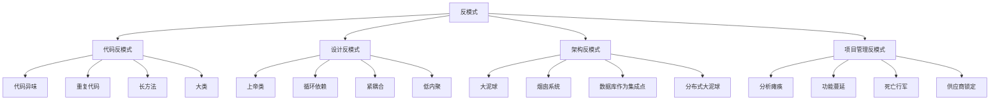

# ⚠️ 反模式识别与规避

[[07-模式关系与组合/03-模式演化与变种]] ← [[07-模式关系与组合/05-现代化设计模式扩展]]
## 🎯 反模式概览

### 📊 反模式分类图



## 🏗️ 代码反模式

### 📋 **代码异味识别**

#### **长方法反模式**
```java
// ❌ 反模式：长方法
public class OrderProcessor {
    public void processOrder(Order order) {
        // 验证订单
        if (order == null) {
            throw new IllegalArgumentException("Order cannot be null");
        }
        if (order.getItems() == null || order.getItems().isEmpty()) {
            throw new IllegalArgumentException("Order must have items");
        }
        if (order.getCustomer() == null) {
            throw new IllegalArgumentException("Order must have a customer");
        }
        if (order.getCustomer().getEmail() == null || order.getCustomer().getEmail().isEmpty()) {
            throw new IllegalArgumentException("Customer must have an email");
        }
        
        // 计算价格
        double total = 0;
        for (OrderItem item : order.getItems()) {
            if (item.getPrice() <= 0) {
                throw new IllegalArgumentException("Item price must be positive");
            }
            if (item.getQuantity() <= 0) {
                throw new IllegalArgumentException("Item quantity must be positive");
            }
            total += item.getPrice() * item.getQuantity();
        }
        
        // 应用折扣
        if (order.getCustomer().isVIP()) {
            total *= 0.9; // VIP折扣
        }
        if (order.getItems().size() > 5) {
            total *= 0.95; // 批量折扣
        }
        
        // 保存订单
        order.setTotal(total);
        order.setStatus("PROCESSED");
        orderRepository.save(order);
        
        // 发送邮件
        String emailContent = "Dear " + order.getCustomer().getName() + 
                             ", your order #" + order.getId() + 
                             " has been processed. Total: $" + total;
        emailService.sendEmail(order.getCustomer().getEmail(), "Order Confirmation", emailContent);
        
        // 更新库存
        for (OrderItem item : order.getItems()) {
            Product product = productRepository.findById(item.getProductId());
            if (product.getStock() < item.getQuantity()) {
                throw new InsufficientStockException("Insufficient stock for product: " + product.getName());
            }
            product.setStock(product.getStock() - item.getQuantity());
            productRepository.save(product);
        }
        
        // 记录日志
        logger.info("Order processed: " + order.getId() + ", Total: " + total);
    }
}
```

#### **重构后的代码**
```java
// ✅ 重构后：职责分离
public class OrderProcessor {
    private final OrderValidator validator;
    private final PriceCalculator calculator;
    private final OrderRepository orderRepository;
    private final EmailService emailService;
    private final InventoryService inventoryService;
    private final Logger logger;
    
    public OrderProcessor(OrderValidator validator, PriceCalculator calculator,
                         OrderRepository orderRepository, EmailService emailService,
                         InventoryService inventoryService, Logger logger) {
        this.validator = validator;
        this.calculator = calculator;
        this.orderRepository = orderRepository;
        this.emailService = emailService;
        this.inventoryService = inventoryService;
        this.logger = logger;
    }
    
    public void processOrder(Order order) {
        validator.validateOrder(order);
        
        double total = calculator.calculateTotal(order);
        order.setTotal(total);
        order.setStatus("PROCESSED");
        
        orderRepository.save(order);
        emailService.sendConfirmationEmail(order);
        inventoryService.updateInventory(order);
        
        logger.info("Order processed: " + order.getId() + ", Total: " + total);
    }
}

// ✅ 订单验证器
public class OrderValidator {
    public void validateOrder(Order order) {
        validateOrderNotNull(order);
        validateOrderItems(order);
        validateCustomer(order);
    }
    
    private void validateOrderNotNull(Order order) {
        if (order == null) {
            throw new IllegalArgumentException("Order cannot be null");
        }
    }
    
    private void validateOrderItems(Order order) {
        if (order.getItems() == null || order.getItems().isEmpty()) {
            throw new IllegalArgumentException("Order must have items");
        }
        
        for (OrderItem item : order.getItems()) {
            if (item.getPrice() <= 0) {
                throw new IllegalArgumentException("Item price must be positive");
            }
            if (item.getQuantity() <= 0) {
                throw new IllegalArgumentException("Item quantity must be positive");
            }
        }
    }
    
    private void validateCustomer(Order order) {
        if (order.getCustomer() == null) {
            throw new IllegalArgumentException("Order must have a customer");
        }
        if (order.getCustomer().getEmail() == null || order.getCustomer().getEmail().isEmpty()) {
            throw new IllegalArgumentException("Customer must have an email");
        }
    }
}

// ✅ 价格计算器
public class PriceCalculator {
    public double calculateTotal(Order order) {
        double total = calculateBaseTotal(order);
        total = applyDiscounts(order, total);
        return total;
    }
    
    private double calculateBaseTotal(Order order) {
        return order.getItems().stream()
            .mapToDouble(item -> item.getPrice() * item.getQuantity())
            .sum();
    }
    
    private double applyDiscounts(Order order, double total) {
        if (order.getCustomer().isVIP()) {
            total *= 0.9; // VIP折扣
        }
        if (order.getItems().size() > 5) {
            total *= 0.95; // 批量折扣
        }
        return total;
    }
}
```

### 📋 **大类反模式**

#### **上帝类反模式**
```java
// ❌ 反模式：上帝类
public class UserManager {
    // 用户管理
    public void createUser(User user) { /* 实现 */ }
    public void updateUser(User user) { /* 实现 */ }
    public void deleteUser(Long userId) { /* 实现 */ }
    public User getUserById(Long userId) { /* 实现 */ }
    public List<User> getAllUsers() { /* 实现 */ }
    
    // 权限管理
    public void assignRole(User user, Role role) { /* 实现 */ }
    public void removeRole(User user, Role role) { /* 实现 */ }
    public boolean hasPermission(User user, String permission) { /* 实现 */ }
    public List<Permission> getUserPermissions(User user) { /* 实现 */ }
    
    // 认证管理
    public boolean authenticate(String username, String password) { /* 实现 */ }
    public void changePassword(User user, String newPassword) { /* 实现 */ }
    public void resetPassword(String email) { /* 实现 */ }
    public boolean isAccountLocked(User user) { /* 实现 */ }
    
    // 邮件管理
    public void sendWelcomeEmail(User user) { /* 实现 */ }
    public void sendPasswordResetEmail(String email) { /* 实现 */ }
    public void sendNotificationEmail(User user, String message) { /* 实现 */ }
    
    // 日志管理
    public void logUserAction(User user, String action) { /* 实现 */ }
    public List<UserAction> getUserActionHistory(User user) { /* 实现 */ }
    public void auditUserChanges(User user) { /* 实现 */ }
    
    // 缓存管理
    public void cacheUser(User user) { /* 实现 */ }
    public User getCachedUser(Long userId) { /* 实现 */ }
    public void invalidateUserCache(Long userId) { /* 实现 */ }
}
```

#### **重构后的代码**
```java
// ✅ 重构后：职责分离
public class UserService {
    private final UserRepository userRepository;
    private final UserValidator validator;
    
    public UserService(UserRepository userRepository, UserValidator validator) {
        this.userRepository = userRepository;
        this.validator = validator;
    }
    
    public User createUser(User user) {
        validator.validateUser(user);
        return userRepository.save(user);
    }
    
    public User updateUser(User user) {
        validator.validateUser(user);
        return userRepository.save(user);
    }
    
    public void deleteUser(Long userId) {
        userRepository.deleteById(userId);
    }
    
    public User getUserById(Long userId) {
        return userRepository.findById(userId)
            .orElseThrow(() -> new UserNotFoundException("User not found: " + userId));
    }
    
    public List<User> getAllUsers() {
        return userRepository.findAll();
    }
}

// ✅ 权限服务
public class PermissionService {
    private final PermissionRepository permissionRepository;
    
    public void assignRole(User user, Role role) {
        user.getRoles().add(role);
    }
    
    public void removeRole(User user, Role role) {
        user.getRoles().remove(role);
    }
    
    public boolean hasPermission(User user, String permission) {
        return user.getRoles().stream()
            .flatMap(role -> role.getPermissions().stream())
            .anyMatch(perm -> perm.getName().equals(permission));
    }
}

// ✅ 认证服务
public class AuthenticationService {
    private final PasswordEncoder passwordEncoder;
    private final UserRepository userRepository;
    
    public boolean authenticate(String username, String password) {
        User user = userRepository.findByUsername(username);
        if (user != null) {
            return passwordEncoder.matches(password, user.getPassword());
        }
        return false;
    }
    
    public void changePassword(User user, String newPassword) {
        user.setPassword(passwordEncoder.encode(newPassword));
    }
}

// ✅ 邮件服务
public class EmailService {
    private final EmailSender emailSender;
    
    public void sendWelcomeEmail(User user) {
        String content = "Welcome " + user.getName() + "!";
        emailSender.sendEmail(user.getEmail(), "Welcome", content);
    }
    
    public void sendPasswordResetEmail(String email) {
        String content = "Click here to reset your password";
        emailSender.sendEmail(email, "Password Reset", content);
    }
}
```

## 🏗️ 设计反模式

### 📋 **循环依赖反模式**

#### **循环依赖示例**
```java
// ❌ 反模式：循环依赖
public class UserService {
    private OrderService orderService;
    
    public void setOrderService(OrderService orderService) {
        this.orderService = orderService;
    }
    
    public User createUser(User user) {
        // 创建用户逻辑
        return user;
    }
    
    public List<Order> getUserOrders(Long userId) {
        return orderService.getOrdersByUserId(userId);
    }
}

public class OrderService {
    private UserService userService;
    
    public void setUserService(UserService userService) {
        this.userService = userService;
    }
    
    public Order createOrder(Order order) {
        // 验证用户存在
        User user = userService.getUserById(order.getUserId());
        // 创建订单逻辑
        return order;
    }
    
    public List<Order> getOrdersByUserId(Long userId) {
        // 获取用户订单逻辑
        return new ArrayList<>();
    }
}
```

#### **重构后的代码**
```java
// ✅ 重构后：依赖倒置
public interface UserRepository {
    User findById(Long userId);
    User save(User user);
}

public interface OrderRepository {
    List<Order> findByUserId(Long userId);
    Order save(Order order);
}

// ✅ 用户服务
public class UserService {
    private final UserRepository userRepository;
    
    public UserService(UserRepository userRepository) {
        this.userRepository = userRepository;
    }
    
    public User createUser(User user) {
        return userRepository.save(user);
    }
    
    public User getUserById(Long userId) {
        return userRepository.findById(userId);
    }
}

// ✅ 订单服务
public class OrderService {
    private final OrderRepository orderRepository;
    private final UserRepository userRepository;
    
    public OrderService(OrderRepository orderRepository, UserRepository userRepository) {
        this.orderRepository = orderRepository;
        this.userRepository = userRepository;
    }
    
    public Order createOrder(Order order) {
        // 验证用户存在
        User user = userRepository.findById(order.getUserId());
        if (user == null) {
            throw new UserNotFoundException("User not found: " + order.getUserId());
        }
        
        return orderRepository.save(order);
    }
    
    public List<Order> getOrdersByUserId(Long userId) {
        return orderRepository.findByUserId(userId);
    }
}
```

### 📋 **紧耦合反模式**

#### **紧耦合示例**
```java
// ❌ 反模式：紧耦合
public class OrderProcessor {
    private DatabaseConnection connection;
    private EmailSender emailSender;
    private FileLogger logger;
    
    public OrderProcessor() {
        this.connection = new MySQLConnection();
        this.emailSender = new SMTPEmailSender();
        this.logger = new FileLogger();
    }
    
    public void processOrder(Order order) {
        // 保存到数据库
        connection.execute("INSERT INTO orders VALUES (...)");
        
        // 发送邮件
        emailSender.send("order@example.com", "Order processed", "Order details");
        
        // 记录日志
        logger.log("Order processed: " + order.getId());
    }
}
```

#### **重构后的代码**
```java
// ✅ 重构后：依赖注入
public interface OrderRepository {
    void save(Order order);
}

public interface NotificationService {
    void sendNotification(String message);
}

public interface Logger {
    void log(String message);
}

// ✅ 订单处理器
public class OrderProcessor {
    private final OrderRepository orderRepository;
    private final NotificationService notificationService;
    private final Logger logger;
    
    public OrderProcessor(OrderRepository orderRepository,
                         NotificationService notificationService,
                         Logger logger) {
        this.orderRepository = orderRepository;
        this.notificationService = notificationService;
        this.logger = logger;
    }
    
    public void processOrder(Order order) {
        orderRepository.save(order);
        notificationService.sendNotification("Order processed: " + order.getId());
        logger.log("Order processed: " + order.getId());
    }
}

// ✅ 具体实现
public class JpaOrderRepository implements OrderRepository {
    @Override
    public void save(Order order) {
        // JPA实现
    }
}

public class EmailNotificationService implements NotificationService {
    @Override
    public void sendNotification(String message) {
        // 邮件通知实现
    }
}

public class ConsoleLogger implements Logger {
    @Override
    public void log(String message) {
        System.out.println(message);
    }
}
```

## 🏗️ 架构反模式

### 📋 **大泥球反模式**

#### **大泥球示例**
```java
// ❌ 反模式：大泥球
public class MonolithicApplication {
    // 用户管理
    public void createUser(String name, String email) {
        // 直接数据库操作
        Connection conn = DriverManager.getConnection("jdbc:mysql://localhost:3306/app");
        PreparedStatement stmt = conn.prepareStatement("INSERT INTO users (name, email) VALUES (?, ?)");
        stmt.setString(1, name);
        stmt.setString(2, email);
        stmt.executeUpdate();
        
        // 直接发送邮件
        Properties props = new Properties();
        props.put("mail.smtp.host", "smtp.gmail.com");
        Session session = Session.getInstance(props);
        Message message = new MimeMessage(session);
        message.setFrom(new InternetAddress("noreply@example.com"));
        message.setRecipients(Message.RecipientType.TO, InternetAddress.parse(email));
        message.setSubject("Welcome");
        message.setText("Welcome " + name + "!");
        Transport.send(message);
        
        // 直接记录日志
        FileWriter writer = new FileWriter("app.log", true);
        writer.write("User created: " + name + " at " + new Date() + "\n");
        writer.close();
    }
    
    // 订单管理
    public void createOrder(String userId, String productId, int quantity) {
        // 直接数据库操作
        Connection conn = DriverManager.getConnection("jdbc:mysql://localhost:3306/app");
        
        // 获取用户信息
        PreparedStatement userStmt = conn.prepareStatement("SELECT * FROM users WHERE id = ?");
        userStmt.setString(1, userId);
        ResultSet userRs = userStmt.executeQuery();
        
        // 获取产品信息
        PreparedStatement productStmt = conn.prepareStatement("SELECT * FROM products WHERE id = ?");
        productStmt.setString(1, productId);
        ResultSet productRs = productStmt.executeQuery();
        
        // 计算价格
        double price = productRs.getDouble("price") * quantity;
        
        // 保存订单
        PreparedStatement orderStmt = conn.prepareStatement("INSERT INTO orders (user_id, product_id, quantity, price) VALUES (?, ?, ?, ?)");
        orderStmt.setString(1, userId);
        orderStmt.setString(2, productId);
        orderStmt.setInt(3, quantity);
        orderStmt.setDouble(4, price);
        orderStmt.executeUpdate();
        
        // 发送确认邮件
        String userEmail = userRs.getString("email");
        Properties props = new Properties();
        props.put("mail.smtp.host", "smtp.gmail.com");
        Session session = Session.getInstance(props);
        Message message = new MimeMessage(session);
        message.setFrom(new InternetAddress("noreply@example.com"));
        message.setRecipients(Message.RecipientType.TO, InternetAddress.parse(userEmail));
        message.setSubject("Order Confirmation");
        message.setText("Your order has been confirmed. Total: $" + price);
        Transport.send(message);
        
        // 记录日志
        FileWriter writer = new FileWriter("app.log", true);
        writer.write("Order created: " + userId + " - " + productId + " at " + new Date() + "\n");
        writer.close();
    }
}
```

#### **重构后的代码**
```java
// ✅ 重构后：分层架构
// 表现层
@RestController
@RequestMapping("/api/users")
public class UserController {
    private final UserService userService;
    
    public UserController(UserService userService) {
        this.userService = userService;
    }
    
    @PostMapping
    public ResponseEntity<User> createUser(@RequestBody CreateUserRequest request) {
        User user = userService.createUser(request);
        return ResponseEntity.ok(user);
    }
}

// 业务层
@Service
public class UserService {
    private final UserRepository userRepository;
    private final NotificationService notificationService;
    private final AuditService auditService;
    
    public UserService(UserRepository userRepository,
                      NotificationService notificationService,
                      AuditService auditService) {
        this.userRepository = userRepository;
        this.notificationService = notificationService;
        this.auditService = auditService;
    }
    
    public User createUser(CreateUserRequest request) {
        User user = new User(request.getName(), request.getEmail());
        User savedUser = userRepository.save(user);
        
        notificationService.sendWelcomeEmail(savedUser);
        auditService.logUserCreation(savedUser);
        
        return savedUser;
    }
}

// 数据层
@Repository
public class JpaUserRepository implements UserRepository {
    @PersistenceContext
    private EntityManager entityManager;
    
    @Override
    public User save(User user) {
        entityManager.persist(user);
        return user;
    }
    
    @Override
    public Optional<User> findById(Long id) {
        return Optional.ofNullable(entityManager.find(User.class, id));
    }
}
```

## 🎯 反模式识别工具

### 📋 **代码质量分析工具**

```java
// ✅ 反模式识别工具
public class AntiPatternDetector {
    private Map<String, List<String>> codeSmells;
    private Map<String, List<String>> designSmells;
    
    public AntiPatternDetector() {
        initializeSmells();
    }
    
    private void initializeSmells() {
        // 代码异味
        codeSmells = new HashMap<>();
        codeSmells.put("长方法", Arrays.asList(
            "方法行数超过50行",
            "方法逻辑复杂",
            "难以理解方法目的"
        ));
        
        codeSmells.put("大类", Arrays.asList(
            "类行数超过500行",
            "类方法过多",
            "类职责不清晰"
        ));
        
        codeSmells.put("重复代码", Arrays.asList(
            "相同代码重复出现",
            "复制粘贴代码",
            "逻辑重复实现"
        ));
        
        // 设计异味
        designSmells = new HashMap<>();
        designSmells.put("上帝类", Arrays.asList(
            "类承担过多职责",
            "类方法过多",
            "类与其他类耦合度高"
        ));
        
        designSmells.put("循环依赖", Arrays.asList(
            "类A依赖类B，类B依赖类A",
            "模块间相互依赖",
            "难以确定依赖方向"
        ));
        
        designSmells.put("紧耦合", Arrays.asList(
            "类间依赖过强",
            "修改一个类影响多个类",
            "难以独立测试"
        ));
    }
    
    // 检测代码异味
    public List<String> detectCodeSmells(String code) {
        List<String> detectedSmells = new ArrayList<>();
        
        // 检测长方法
        if (countLines(code) > 50) {
            detectedSmells.add("长方法");
        }
        
        // 检测重复代码
        if (hasDuplicateCode(code)) {
            detectedSmells.add("重复代码");
        }
        
        return detectedSmells;
    }
    
    // 检测设计异味
    public List<String> detectDesignSmells(List<String> classNames) {
        List<String> detectedSmells = new ArrayList<>();
        
        // 检测循环依赖
        if (hasCircularDependency(classNames)) {
            detectedSmells.add("循环依赖");
        }
        
        // 检测紧耦合
        if (hasTightCoupling(classNames)) {
            detectedSmells.add("紧耦合");
        }
        
        return detectedSmells;
    }
    
    // 生成重构建议
    public List<String> generateRefactoringSuggestions(List<String> smells) {
        List<String> suggestions = new ArrayList<>();
        
        for (String smell : smells) {
            switch (smell) {
                case "长方法":
                    suggestions.add("提取方法：将长方法拆分为多个小方法");
                    suggestions.add("使用策略模式：将复杂逻辑封装为策略");
                    break;
                case "大类":
                    suggestions.add("提取类：将大类拆分为多个小类");
                    suggestions.add("使用组合模式：将相关功能组合");
                    break;
                case "重复代码":
                    suggestions.add("提取公共方法：将重复代码提取为公共方法");
                    suggestions.add("使用模板方法模式：定义算法框架");
                    break;
                case "上帝类":
                    suggestions.add("单一职责原则：每个类只负责一个职责");
                    suggestions.add("使用外观模式：提供统一接口");
                    break;
                case "循环依赖":
                    suggestions.add("依赖倒置原则：依赖抽象而不是具体");
                    suggestions.add("使用中介者模式：通过中介者解耦");
                    break;
                case "紧耦合":
                    suggestions.add("依赖注入：通过构造函数注入依赖");
                    suggestions.add("使用观察者模式：解耦对象间通信");
                    break;
            }
        }
        
        return suggestions;
    }
    
    private int countLines(String code) {
        return code.split("\n").length;
    }
    
    private boolean hasDuplicateCode(String code) {
        // 简化的重复代码检测
        return code.contains("// TODO: 重复代码");
    }
    
    private boolean hasCircularDependency(List<String> classNames) {
        // 简化的循环依赖检测
        return classNames.size() > 1 && classNames.get(0).equals(classNames.get(classNames.size() - 1));
    }
    
    private boolean hasTightCoupling(List<String> classNames) {
        // 简化的紧耦合检测
        return classNames.size() > 5;
    }
}
```

## 🎯 反模式规避策略

### 📋 **预防措施**

1. **代码审查**: 定期进行代码审查
2. **单元测试**: 编写充分的单元测试
3. **重构**: 定期重构代码
4. **设计原则**: 遵循SOLID原则
5. **工具支持**: 使用代码质量工具

### 📋 **重构策略**

| 反模式 | 重构策略 | 设计模式 | 效果 |
|--------|----------|----------|------|
| **长方法** | 提取方法 | 策略模式 | 提高可读性 |
| **大类** | 提取类 | 外观模式 | 降低复杂度 |
| **重复代码** | 提取公共方法 | 模板方法模式 | 减少重复 |
| **上帝类** | 职责分离 | 单一职责原则 | 提高内聚 |
| **循环依赖** | 依赖倒置 | 依赖注入 | 降低耦合 |
| **紧耦合** | 接口抽象 | 观察者模式 | 提高灵活性 |

### ⚠️ **注意事项**

1. **渐进式重构**: 不要一次性重构太多代码
2. **保持功能**: 重构过程中保持功能不变
3. **充分测试**: 重构前确保有充分的测试覆盖
4. **团队协作**: 重构需要团队协作和沟通

## 🔗 学习衔接

- **上一文档** ← [[模式演化与变种]]
- **下一文档** → [[现代化设计模式扩展]]
- **实际应用** → [[08-实际应用]]

---
**💡 反模式精髓**: 反模式就像疾病，预防胜于治疗。通过识别和规避反模式，我们可以避免代码质量的恶化，保持系统的健康和可维护性。关键是要有敏锐的嗅觉，及时发现问题的苗头，并采取相应的措施！
