# 🚀 现代化设计模式扩展

[[07-模式关系与组合/04-反模式识别与规避]] ← [[08-实际应用]]
## 🎯 现代化扩展概览

### 📊 扩展方向图

```mermaid
graph TD
    A[现代化设计模式扩展] --> B[函数式编程]
    A --> C[响应式编程]
    A --> D[并发编程]
    A --> E[云原生]
    A --> F[微服务]
    A --> G[事件驱动]
    
    B --> B1[Lambda表达式]
    B --> B2[Stream API]
    B --> B3[Optional类]
    B --> B4[函数式接口]
    
    C --> C1[Reactive Streams]
    C --> C2[RxJava]
    C --> C3[Project Reactor]
    C --> C4[WebFlux]
    
    D --> D1[CompletableFuture]
    D --> D2[Fork/Join]
    D --> D3[并行流]
    D --> D4[异步编程]
    
    E --> E1[容器化]
    E --> E2[Kubernetes]
    E --> E3[服务网格]
    E --> E4[DevOps]
    
    F --> F1[服务拆分]
    F --> F2[API网关]
    F --> F3[服务发现]
    F --> F4[配置中心]
    
    G --> G1[事件溯源]
    G --> G2[CQRS]
    G --> G3[消息队列]
    G --> G4[事件总线]
```



## 🏗️ 函数式编程扩展

### 📋 **Lambda表达式模式**

#### **策略模式函数式实现**
```java
// ✅ 传统策略模式
public interface PaymentStrategy {
    void pay(double amount);
}

public class CreditCardPayment implements PaymentStrategy {
    @Override
    public void pay(double amount) {
        System.out.println("Paying " + amount + " with credit card");
    }
}

// ✅ 函数式策略模式
public class FunctionalPaymentProcessor {
    private Map<String, Consumer<Double>> paymentStrategies;
    
    public FunctionalPaymentProcessor() {
        this.paymentStrategies = new HashMap<>();
        
        // 使用Lambda表达式定义策略
        paymentStrategies.put("CREDIT_CARD", amount -> 
            System.out.println("Paying " + amount + " with credit card"));
        
        paymentStrategies.put("PAYPAL", amount -> 
            System.out.println("Paying " + amount + " with PayPal"));
        
        paymentStrategies.put("BANK_TRANSFER", amount -> 
            System.out.println("Paying " + amount + " with bank transfer"));
        
        paymentStrategies.put("CRYPTO", amount -> 
            System.out.println("Paying " + amount + " with cryptocurrency"));
    }
    
    public void processPayment(String method, double amount) {
        Consumer<Double> strategy = paymentStrategies.get(method);
        if (strategy != null) {
            strategy.accept(amount);
        } else {
            throw new IllegalArgumentException("Unknown payment method: " + method);
        }
    }
    
    // 动态添加策略
    public void addPaymentStrategy(String method, Consumer<Double> strategy) {
        paymentStrategies.put(method, strategy);
    }
}
```

#### **观察者模式函数式实现**
```java
// ✅ 函数式观察者模式
public class FunctionalEventPublisher {
    private final List<Consumer<Event>> listeners;
    
    public FunctionalEventPublisher() {
        this.listeners = new ArrayList<>();
    }
    
    public void addListener(Consumer<Event> listener) {
        listeners.add(listener);
    }
    
    public void publishEvent(Event event) {
        listeners.forEach(listener -> listener.accept(event));
    }
    
    public void removeListener(Consumer<Event> listener) {
        listeners.remove(listener);
    }
}

// ✅ 使用示例
public class FunctionalObserverDemo {
    public static void main(String[] args) {
        FunctionalEventPublisher publisher = new FunctionalEventPublisher();
        
        // 使用Lambda表达式注册观察者
        publisher.addListener(event -> 
            System.out.println("Listener 1 received: " + event.getType()));
        
        publisher.addListener(event -> 
            System.out.println("Listener 2 received: " + event.getData()));
        
        // 发布事件
        Event event = new Event("USER_CREATED", "User John created");
        publisher.publishEvent(event);
    }
}
```

### 📋 **Stream API模式**

#### **迭代器模式Stream实现**
```java
// ✅ 传统迭代器模式
public class TraditionalIterator {
    public void processItems(List<String> items) {
        Iterator<String> iterator = items.iterator();
        while (iterator.hasNext()) {
            String item = iterator.next();
            if (item.startsWith("A")) {
                System.out.println("Processing: " + item);
            }
        }
    }
}

// ✅ Stream API实现
public class StreamProcessor {
    public void processItems(List<String> items) {
        items.stream()
            .filter(item -> item.startsWith("A"))
            .map(item -> "Processing: " + item)
            .forEach(System.out::println);
    }
    
    public List<String> processAndCollect(List<String> items) {
        return items.stream()
            .filter(item -> item.length() > 3)
            .map(String::toUpperCase)
            .collect(Collectors.toList());
    }
    
    public Map<String, Long> groupAndCount(List<String> items) {
        return items.stream()
            .collect(Collectors.groupingBy(
                item -> item.substring(0, 1),
                Collectors.counting()
            ));
    }
}
```

#### **模板方法模式Stream实现**
```java
// ✅ Stream模板方法
public abstract class StreamDataProcessor<T, R> {
    public final List<R> processData(List<T> data) {
        return data.stream()
            .filter(this::filter)
            .map(this::transform)
            .filter(this::validate)
            .collect(Collectors.toList());
    }
    
    protected abstract boolean filter(T item);
    protected abstract R transform(T item);
    protected abstract boolean validate(R item);
}

// ✅ 具体实现
public class UserProcessor extends StreamDataProcessor<User, UserDTO> {
    @Override
    protected boolean filter(User user) {
        return user.isActive();
    }
    
    @Override
    protected UserDTO transform(User user) {
        return new UserDTO(user.getName(), user.getEmail());
    }
    
    @Override
    protected boolean validate(UserDTO userDTO) {
        return userDTO.getEmail().contains("@");
    }
}
```

## 🏗️ 响应式编程扩展

### 📋 **Reactive Streams模式**

#### **观察者模式响应式实现**
```java
// ✅ 响应式观察者模式
public class ReactiveEventPublisher {
    private final List<Subscriber<Event>> subscribers;
    
    public ReactiveEventPublisher() {
        this.subscribers = new ArrayList<>();
    }
    
    public void subscribe(Subscriber<Event> subscriber) {
        subscribers.add(subscriber);
    }
    
    public void publishEvent(Event event) {
        subscribers.forEach(subscriber -> {
            try {
                subscriber.onNext(event);
            } catch (Exception e) {
                subscriber.onError(e);
            }
        });
    }
    
    public void complete() {
        subscribers.forEach(Subscriber::onComplete);
    }
}

// ✅ 使用Project Reactor
public class ReactorEventPublisher {
    private final Flux<Event> eventFlux;
    private final Sinks.Many<Event> eventSink;
    
    public ReactorEventPublisher() {
        this.eventSink = Sinks.many().multicast().onBackpressureBuffer();
        this.eventFlux = eventSink.asFlux();
    }
    
    public Flux<Event> getEventStream() {
        return eventFlux;
    }
    
    public void publishEvent(Event event) {
        eventSink.tryEmitNext(event);
    }
    
    public void complete() {
        eventSink.tryEmitComplete();
    }
}

// ✅ 使用示例
public class ReactiveObserverDemo {
    public static void main(String[] args) {
        ReactorEventPublisher publisher = new ReactorEventPublisher();
        
        // 订阅事件流
        publisher.getEventStream()
            .filter(event -> "USER_CREATED".equals(event.getType()))
            .map(Event::getData)
            .subscribe(data -> System.out.println("User created: " + data));
        
        // 发布事件
        publisher.publishEvent(new Event("USER_CREATED", "User John"));
        publisher.publishEvent(new Event("USER_UPDATED", "User Jane"));
        publisher.publishEvent(new Event("USER_CREATED", "User Bob"));
    }
}
```

#### **命令模式响应式实现**
```java
// ✅ 响应式命令模式
public class ReactiveCommandProcessor {
    private final Flux<Command> commandFlux;
    private final Sinks.Many<Command> commandSink;
    
    public ReactiveCommandProcessor() {
        this.commandSink = Sinks.many().multicast().onBackpressureBuffer();
        this.commandFlux = commandSink.asFlux();
    }
    
    public Flux<CommandResult> processCommands() {
        return commandFlux
            .flatMap(this::executeCommand)
            .onErrorResume(this::handleError);
    }
    
    private Mono<CommandResult> executeCommand(Command command) {
        return Mono.fromCallable(() -> {
            command.execute();
            return new CommandResult(command.getId(), "SUCCESS");
        })
        .subscribeOn(Schedulers.parallel());
    }
    
    private Mono<CommandResult> handleError(Throwable error) {
        return Mono.just(new CommandResult("ERROR", error.getMessage()));
    }
    
    public void submitCommand(Command command) {
        commandSink.tryEmitNext(command);
    }
}

// ✅ 使用示例
public class ReactiveCommandDemo {
    public static void main(String[] args) {
        ReactiveCommandProcessor processor = new ReactiveCommandProcessor();
        
        // 订阅处理结果
        processor.processCommands()
            .subscribe(result -> System.out.println("Command result: " + result));
        
        // 提交命令
        processor.submitCommand(new SaveCommand("document1", "content"));
        processor.submitCommand(new DeleteCommand("document2"));
        processor.submitCommand(new UpdateCommand("document3", "new content"));
    }
}
```

## 🏗️ 并发编程扩展

### 📋 **CompletableFuture模式**

#### **异步工厂模式**
```java
// ✅ 异步工厂模式
public class AsyncObjectFactory {
    private final ExecutorService executor;
    
    public AsyncObjectFactory() {
        this.executor = Executors.newFixedThreadPool(10);
    }
    
    public CompletableFuture<User> createUserAsync(String name, String email) {
        return CompletableFuture.supplyAsync(() -> {
            // 模拟耗时操作
            try {
                Thread.sleep(1000);
            } catch (InterruptedException e) {
                Thread.currentThread().interrupt();
            }
            
            return new User(name, email);
        }, executor);
    }
    
    public CompletableFuture<List<User>> createUsersAsync(List<UserRequest> requests) {
        List<CompletableFuture<User>> futures = requests.stream()
            .map(request -> createUserAsync(request.getName(), request.getEmail()))
            .collect(Collectors.toList());
        
        return CompletableFuture.allOf(futures.toArray(new CompletableFuture[0]))
            .thenApply(v -> futures.stream()
                .map(CompletableFuture::join)
                .collect(Collectors.toList()));
    }
    
    public void shutdown() {
        executor.shutdown();
    }
}

// ✅ 使用示例
public class AsyncFactoryDemo {
    public static void main(String[] args) {
        AsyncObjectFactory factory = new AsyncObjectFactory();
        
        // 异步创建用户
        CompletableFuture<User> userFuture = factory.createUserAsync("John", "john@example.com");
        
        userFuture.thenAccept(user -> 
            System.out.println("User created: " + user.getName()))
            .exceptionally(throwable -> {
                System.err.println("Error creating user: " + throwable.getMessage());
                return null;
            });
        
        // 等待完成
        userFuture.join();
        
        factory.shutdown();
    }
}
```

#### **异步观察者模式**
```java
// ✅ 异步观察者模式
public class AsyncEventPublisher {
    private final List<AsyncEventListener> listeners;
    private final ExecutorService executor;
    
    public AsyncEventPublisher() {
        this.listeners = new ArrayList<>();
        this.executor = Executors.newFixedThreadPool(5);
    }
    
    public void addListener(AsyncEventListener listener) {
        listeners.add(listener);
    }
    
    public CompletableFuture<Void> publishEventAsync(Event event) {
        List<CompletableFuture<Void>> futures = listeners.stream()
            .map(listener -> CompletableFuture.runAsync(() -> {
                try {
                    listener.onEvent(event);
                } catch (Exception e) {
                    System.err.println("Error in listener: " + e.getMessage());
                }
            }, executor))
            .collect(Collectors.toList());
        
        return CompletableFuture.allOf(futures.toArray(new CompletableFuture[0]));
    }
    
    public void shutdown() {
        executor.shutdown();
    }
}

public interface AsyncEventListener {
    void onEvent(Event event);
}

// ✅ 使用示例
public class AsyncObserverDemo {
    public static void main(String[] args) {
        AsyncEventPublisher publisher = new AsyncEventPublisher();
        
        // 添加异步监听器
        publisher.addListener(event -> {
            System.out.println("Listener 1 processing: " + event.getType());
            try {
                Thread.sleep(1000); // 模拟处理时间
            } catch (InterruptedException e) {
                Thread.currentThread().interrupt();
            }
        });
        
        publisher.addListener(event -> {
            System.out.println("Listener 2 processing: " + event.getData());
        });
        
        // 异步发布事件
        CompletableFuture<Void> future = publisher.publishEventAsync(
            new Event("USER_CREATED", "User John created"));
        
        future.thenRun(() -> System.out.println("All listeners processed"));
        
        future.join();
        publisher.shutdown();
    }
}
```

## 🏗️ 云原生扩展

### 📋 **容器化模式**

#### **微服务单例模式**
```java
// ✅ 云原生单例模式
@Configuration
@EnableConfigurationProperties
public class CloudNativeSingleton {
    
    @Bean
    @ConditionalOnMissingBean
    public DatabaseConnection databaseConnection(
            @Value("${database.url}") String url,
            @Value("${database.username}") String username,
            @Value("${database.password}") String password) {
        
        return DatabaseConnection.builder()
            .url(url)
            .username(username)
            .password(password)
            .build();
    }
    
    @Bean
    @ConditionalOnMissingBean
    public CacheManager cacheManager() {
        return new RedisCacheManager();
    }
    
    @Bean
    @ConditionalOnMissingBean
    public MessageQueue messageQueue() {
        return new RabbitMQMessageQueue();
    }
}

// ✅ 配置属性
@ConfigurationProperties(prefix = "app")
public class AppProperties {
    private String name;
    private String version;
    private String environment;
    
    // Getters and setters
    public String getName() { return name; }
    public void setName(String name) { this.name = name; }
    public String getVersion() { return version; }
    public void setVersion(String version) { this.version = version; }
    public String getEnvironment() { return environment; }
    public void setEnvironment(String environment) { this.environment = environment; }
}
```

#### **服务发现模式**
```java
// ✅ 服务发现模式
@RestController
@RequestMapping("/api")
public class ServiceDiscoveryController {
    
    @Autowired
    private DiscoveryClient discoveryClient;
    
    @Autowired
    private RestTemplate restTemplate;
    
    @GetMapping("/users/{id}")
    public ResponseEntity<User> getUser(@PathVariable Long id) {
        String serviceUrl = getServiceUrl("user-service");
        if (serviceUrl != null) {
            return restTemplate.getForEntity(serviceUrl + "/users/" + id, User.class);
        }
        return ResponseEntity.notFound().build();
    }
    
    @GetMapping("/orders/{id}")
    public ResponseEntity<Order> getOrder(@PathVariable Long id) {
        String serviceUrl = getServiceUrl("order-service");
        if (serviceUrl != null) {
            return restTemplate.getForEntity(serviceUrl + "/orders/" + id, Order.class);
        }
        return ResponseEntity.notFound().build();
    }
    
    private String getServiceUrl(String serviceName) {
        List<ServiceInstance> instances = discoveryClient.getInstances(serviceName);
        if (!instances.isEmpty()) {
            ServiceInstance instance = instances.get(0);
            return instance.getUri().toString();
        }
        return null;
    }
}
```

## 🏗️ 事件驱动扩展

### 📋 **事件溯源模式**

#### **事件存储模式**
```java
// ✅ 事件存储模式
@Entity
public class EventStore {
    @Id
    private String id;
    private String aggregateId;
    private String eventType;
    private String eventData;
    private LocalDateTime timestamp;
    private Long version;
    
    // Constructors, getters, setters
    public EventStore() {}
    
    public EventStore(String aggregateId, String eventType, String eventData, Long version) {
        this.id = UUID.randomUUID().toString();
        this.aggregateId = aggregateId;
        this.eventType = eventType;
        this.eventData = eventData;
        this.timestamp = LocalDateTime.now();
        this.version = version;
    }
}

@Repository
public interface EventStoreRepository extends JpaRepository<EventStore, String> {
    List<EventStore> findByAggregateIdOrderByVersion(String aggregateId);
}

// ✅ 聚合根
public class OrderAggregate {
    private String id;
    private String status;
    private List<DomainEvent> uncommittedEvents;
    
    public OrderAggregate(String id) {
        this.id = id;
        this.status = "CREATED";
        this.uncommittedEvents = new ArrayList<>();
    }
    
    public void processOrder(ProcessOrderCommand command) {
        if ("CREATED".equals(status)) {
            OrderProcessedEvent event = new OrderProcessedEvent(id, command.getOrderData());
            applyEvent(event);
        }
    }
    
    public void cancelOrder(CancelOrderCommand command) {
        if ("PROCESSED".equals(status)) {
            OrderCancelledEvent event = new OrderCancelledEvent(id, command.getReason());
            applyEvent(event);
        }
    }
    
    private void applyEvent(DomainEvent event) {
        uncommittedEvents.add(event);
        // 应用事件到聚合状态
        if (event instanceof OrderProcessedEvent) {
            this.status = "PROCESSED";
        } else if (event instanceof OrderCancelledEvent) {
            this.status = "CANCELLED";
        }
    }
    
    public List<DomainEvent> getUncommittedEvents() {
        return new ArrayList<>(uncommittedEvents);
    }
    
    public void markEventsAsCommitted() {
        uncommittedEvents.clear();
    }
}
```

#### **CQRS模式**
```java
// ✅ 命令端
@RestController
@RequestMapping("/api/commands")
public class OrderCommandController {
    
    @Autowired
    private OrderCommandService commandService;
    
    @PostMapping("/orders")
    public ResponseEntity<String> createOrder(@RequestBody CreateOrderCommand command) {
        String orderId = commandService.createOrder(command);
        return ResponseEntity.ok(orderId);
    }
    
    @PostMapping("/orders/{id}/process")
    public ResponseEntity<Void> processOrder(@PathVariable String id, @RequestBody ProcessOrderCommand command) {
        commandService.processOrder(id, command);
        return ResponseEntity.ok().build();
    }
}

@Service
public class OrderCommandService {
    
    @Autowired
    private EventStoreRepository eventStoreRepository;
    
    public String createOrder(CreateOrderCommand command) {
        String orderId = UUID.randomUUID().toString();
        OrderCreatedEvent event = new OrderCreatedEvent(orderId, command.getOrderData());
        saveEvent(orderId, event);
        return orderId;
    }
    
    public void processOrder(String orderId, ProcessOrderCommand command) {
        OrderAggregate aggregate = loadAggregate(orderId);
        aggregate.processOrder(command);
        saveEvents(orderId, aggregate.getUncommittedEvents());
        aggregate.markEventsAsCommitted();
    }
    
    private void saveEvent(String aggregateId, DomainEvent event) {
        EventStore eventStore = new EventStore(aggregateId, event.getClass().getSimpleName(), 
                                              serializeEvent(event), getNextVersion(aggregateId));
        eventStoreRepository.save(eventStore);
    }
    
    private void saveEvents(String aggregateId, List<DomainEvent> events) {
        Long version = getNextVersion(aggregateId);
        for (DomainEvent event : events) {
            EventStore eventStore = new EventStore(aggregateId, event.getClass().getSimpleName(), 
                                                  serializeEvent(event), version++);
            eventStoreRepository.save(eventStore);
        }
    }
    
    private OrderAggregate loadAggregate(String aggregateId) {
        List<EventStore> events = eventStoreRepository.findByAggregateIdOrderByVersion(aggregateId);
        OrderAggregate aggregate = new OrderAggregate(aggregateId);
        // 重放事件
        for (EventStore eventStore : events) {
            DomainEvent event = deserializeEvent(eventStore.getEventType(), eventStore.getEventData());
            aggregate.applyEvent(event);
        }
        return aggregate;
    }
    
    private Long getNextVersion(String aggregateId) {
        List<EventStore> events = eventStoreRepository.findByAggregateIdOrderByVersion(aggregateId);
        return events.isEmpty() ? 1L : events.get(events.size() - 1).getVersion() + 1;
    }
    
    private String serializeEvent(DomainEvent event) {
        // 实现事件序列化
        return "serialized_event";
    }
    
    private DomainEvent deserializeEvent(String eventType, String eventData) {
        // 实现事件反序列化
        return new OrderCreatedEvent("id", "data");
    }
}

// ✅ 查询端
@RestController
@RequestMapping("/api/queries")
public class OrderQueryController {
    
    @Autowired
    private OrderQueryService queryService;
    
    @GetMapping("/orders/{id}")
    public ResponseEntity<OrderView> getOrder(@PathVariable String id) {
        OrderView order = queryService.getOrder(id);
        return order != null ? ResponseEntity.ok(order) : ResponseEntity.notFound().build();
    }
    
    @GetMapping("/orders")
    public ResponseEntity<List<OrderView>> getOrders(@RequestParam(required = false) String status) {
        List<OrderView> orders = queryService.getOrders(status);
        return ResponseEntity.ok(orders);
    }
}

@Service
public class OrderQueryService {
    
    @Autowired
    private OrderViewRepository orderViewRepository;
    
    public OrderView getOrder(String id) {
        return orderViewRepository.findById(id).orElse(null);
    }
    
    public List<OrderView> getOrders(String status) {
        if (status != null) {
            return orderViewRepository.findByStatus(status);
        }
        return orderViewRepository.findAll();
    }
}
```

## 🎯 现代化扩展最佳实践

### 📋 **选择原则**

1. **技术匹配**: 选择与团队技术栈匹配的扩展
2. **性能考虑**: 评估扩展对性能的影响
3. **维护成本**: 考虑长期维护成本
4. **学习曲线**: 评估团队学习成本
5. **生态系统**: 考虑相关工具和库的支持

### 📋 **实施策略**

| 扩展类型 | 实施策略 | 注意事项 | 适用场景 |
|----------|----------|----------|----------|
| **函数式编程** | 渐进式引入 | 团队培训 | 数据处理、并发编程 |
| **响应式编程** | 新项目试点 | 复杂度管理 | 高并发、实时系统 |
| **并发编程** | 性能测试 | 线程安全 | 性能敏感应用 |
| **云原生** | 容器化迁移 | 基础设施 | 微服务、DevOps |
| **事件驱动** | 架构重构 | 数据一致性 | 复杂业务、分布式系统 |

### ⚠️ **注意事项**

1. **技术债务**: 避免过度追求新技术
2. **团队能力**: 确保团队能够掌握新技术
3. **性能影响**: 评估扩展对性能的影响
4. **维护成本**: 考虑长期维护成本

## 🔗 学习衔接

- **上一文档** ← [[反模式识别与规避]]
- **下一文档** → [[实际应用]]
- **实际应用** → [[08-实际应用]]

---
**💡 现代化扩展精髓**: 现代化设计模式扩展就像给传统工具装上现代化的引擎，让它们能够适应新的技术环境和业务需求。从函数式编程到响应式编程，从并发编程到云原生，这些扩展让设计模式焕发出新的生命力！
