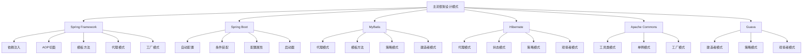

# 🏗️ 框架中的设计模式案例分析

[[08-实际应用/02-业务场景中的模式应用]] ← [[08-实际应用/03-重构与模式应用实践]]
## 🎯 框架模式分析概览

### 📊 主流框架模式分布图



## 🏗️ Spring Framework 模式分析

### 📋 **依赖注入模式**

#### **核心实现分析**
```java
// ✅ Spring依赖注入核心实现
@Configuration
public class AppConfig {
    
    // 工厂方法模式：创建Bean实例
    @Bean
    public UserService userService(UserRepository userRepository) {
        return new UserServiceImpl(userRepository);
    }
    
    // 单例模式：默认Bean作用域
    @Bean
    @Scope("singleton")
    public DatabaseConnection databaseConnection() {
        return new DatabaseConnection();
    }
    
    // 原型模式：每次获取新实例
    @Bean
    @Scope("prototype")
    public TaskProcessor taskProcessor() {
        return new TaskProcessor();
    }
}

// ✅ 服务层实现
@Service
public class UserServiceImpl implements UserService {
    private final UserRepository userRepository;
    private final EmailService emailService;
    
    // 构造函数注入：依赖倒置原则
    public UserServiceImpl(UserRepository userRepository, EmailService emailService) {
        this.userRepository = userRepository;
        this.emailService = emailService;
    }
    
    @Override
    public User createUser(CreateUserRequest request) {
        User user = new User(request.getName(), request.getEmail());
        User savedUser = userRepository.save(user);
        emailService.sendWelcomeEmail(savedUser);
        return savedUser;
    }
}

// ✅ 数据访问层
@Repository
public class JpaUserRepository implements UserRepository {
    @PersistenceContext
    private EntityManager entityManager;
    
    @Override
    public User save(User user) {
        entityManager.persist(user);
        return user;
    }
    
    @Override
    public Optional<User> findById(Long id) {
        return Optional.ofNullable(entityManager.find(User.class, id));
    }
}
```

#### **模式特点分析**
- **工厂方法模式**: `@Bean`注解创建Bean实例
- **单例模式**: 默认Bean作用域为单例
- **依赖倒置原则**: 依赖抽象接口而非具体实现
- **控制反转**: Spring容器管理对象生命周期

### 📋 **AOP切面模式**

#### **代理模式实现**
```java
// ✅ AOP切面实现
@Aspect
@Component
public class LoggingAspect {
    
    // 环绕通知：装饰器模式
    @Around("@annotation(Loggable)")
    public Object logExecutionTime(ProceedingJoinPoint joinPoint) throws Throwable {
        long startTime = System.currentTimeMillis();
        
        try {
            Object result = joinPoint.proceed();
            long executionTime = System.currentTimeMillis() - startTime;
            
            logger.info("Method {} executed in {} ms", 
                       joinPoint.getSignature(), executionTime);
            return result;
        } catch (Exception e) {
            logger.error("Method {} failed with exception: {}", 
                        joinPoint.getSignature(), e.getMessage());
            throw e;
        }
    }
    
    // 前置通知：模板方法模式
    @Before("@annotation(Auditable)")
    public void auditBefore(JoinPoint joinPoint) {
        String methodName = joinPoint.getSignature().getName();
        String className = joinPoint.getTarget().getClass().getSimpleName();
        
        logger.info("Auditing method: {}.{}", className, methodName);
    }
    
    // 后置通知：观察者模式
    @AfterReturning(pointcut = "@annotation(Loggable)", returning = "result")
    public void logAfterReturning(JoinPoint joinPoint, Object result) {
        logger.info("Method {} returned: {}", 
                   joinPoint.getSignature(), result);
    }
}

// ✅ 使用示例
@Service
public class OrderService {
    
    @Loggable
    @Auditable
    public Order createOrder(CreateOrderRequest request) {
        // 业务逻辑
        return new Order(request.getItems());
    }
    
    @Loggable
    public Order updateOrder(Long orderId, UpdateOrderRequest request) {
        // 业务逻辑
        return new Order(request.getItems());
    }
}
```

#### **模式特点分析**
- **代理模式**: 动态代理增强方法功能
- **装饰器模式**: 透明地增强对象功能
- **模板方法模式**: 定义切面执行流程
- **观察者模式**: 方法执行前后通知

### 📋 **模板方法模式**

#### **JdbcTemplate实现分析**
```java
// ✅ Spring JdbcTemplate模板方法模式
public class JdbcTemplate {
    
    // 模板方法：定义算法框架
    public <T> T query(String sql, Object[] args, RowMapper<T> rowMapper) {
        Connection connection = null;
        PreparedStatement statement = null;
        ResultSet resultSet = null;
        
        try {
            // 1. 获取连接
            connection = getConnection();
            
            // 2. 创建语句
            statement = connection.prepareStatement(sql);
            
            // 3. 设置参数
            setParameters(statement, args);
            
            // 4. 执行查询
            resultSet = statement.executeQuery();
            
            // 5. 处理结果
            return processResultSet(resultSet, rowMapper);
            
        } catch (SQLException e) {
            throw new DataAccessException("Query failed", e);
        } finally {
            // 6. 清理资源
            cleanup(connection, statement, resultSet);
        }
    }
    
    // 钩子方法：子类可以重写
    protected Connection getConnection() throws SQLException {
        return dataSource.getConnection();
    }
    
    protected void setParameters(PreparedStatement statement, Object[] args) throws SQLException {
        if (args != null) {
            for (int i = 0; i < args.length; i++) {
                statement.setObject(i + 1, args[i]);
            }
        }
    }
    
    protected <T> T processResultSet(ResultSet resultSet, RowMapper<T> rowMapper) throws SQLException {
        T result = null;
        if (resultSet.next()) {
            result = rowMapper.mapRow(resultSet, 0);
        }
        return result;
    }
    
    protected void cleanup(Connection connection, PreparedStatement statement, ResultSet resultSet) {
        // 清理资源的具体实现
        try {
            if (resultSet != null) resultSet.close();
            if (statement != null) statement.close();
            if (connection != null) connection.close();
        } catch (SQLException e) {
            logger.warn("Error closing resources", e);
        }
    }
}

// ✅ 使用示例
@Repository
public class UserRepository {
    
    @Autowired
    private JdbcTemplate jdbcTemplate;
    
    public User findById(Long id) {
        String sql = "SELECT * FROM users WHERE id = ?";
        return jdbcTemplate.query(sql, new Object[]{id}, new UserRowMapper());
    }
    
    public List<User> findAll() {
        String sql = "SELECT * FROM users";
        return jdbcTemplate.query(sql, new UserRowMapper());
    }
}

// ✅ 行映射器：策略模式
public class UserRowMapper implements RowMapper<User> {
    @Override
    public User mapRow(ResultSet resultSet, int rowNum) throws SQLException {
        return User.builder()
            .id(resultSet.getLong("id"))
            .name(resultSet.getString("name"))
            .email(resultSet.getString("email"))
            .build();
    }
}
```

## 🏗️ Spring Boot 模式分析

### 📋 **自动配置模式**

#### **条件装配实现**
```java
// ✅ Spring Boot自动配置
@Configuration
@ConditionalOnClass(DataSource.class)
@EnableConfigurationProperties(DatabaseProperties.class)
public class DatabaseAutoConfiguration {
    
    @Bean
    @ConditionalOnMissingBean
    public DataSource dataSource(DatabaseProperties properties) {
        return DataSourceBuilder.create()
            .url(properties.getUrl())
            .username(properties.getUsername())
            .password(properties.getPassword())
            .build();
    }
    
    @Bean
    @ConditionalOnBean(DataSource.class)
    @ConditionalOnMissingBean
    public JdbcTemplate jdbcTemplate(DataSource dataSource) {
        return new JdbcTemplate(dataSource);
    }
    
    @Bean
    @ConditionalOnProperty(name = "database.pool.enabled", havingValue = "true")
    public ConnectionPool connectionPool(DataSource dataSource) {
        return new ConnectionPool(dataSource);
    }
}

// ✅ 配置属性：建造者模式
@ConfigurationProperties(prefix = "database")
public class DatabaseProperties {
    private String url;
    private String username;
    private String password;
    private Pool pool = new Pool();
    
    // Getters and setters
    public String getUrl() { return url; }
    public void setUrl(String url) { this.url = url; }
    
    public String getUsername() { return username; }
    public void setUsername(String username) { this.username = username; }
    
    public String getPassword() { return password; }
    public void setPassword(String password) { this.password = password; }
    
    public Pool getPool() { return pool; }
    public void setPool(Pool pool) { this.pool = pool; }
    
    public static class Pool {
        private boolean enabled = false;
        private int maxSize = 10;
        private int minSize = 1;
        
        // Getters and setters
        public boolean isEnabled() { return enabled; }
        public void setEnabled(boolean enabled) { this.enabled = enabled; }
        public int getMaxSize() { return maxSize; }
        public void setMaxSize(int maxSize) { this.maxSize = maxSize; }
        public int getMinSize() { return minSize; }
        public void setMinSize(int minSize) { this.minSize = minSize; }
    }
}
```

#### **启动器模式**
```java
// ✅ Spring Boot启动器
@SpringBootApplication
@EnableAutoConfiguration
@ComponentScan
public class Application {
    
    public static void main(String[] args) {
        SpringApplication.run(Application.class, args);
    }
}

// ✅ 自定义启动器
@Configuration
@ConditionalOnClass(RedisTemplate.class)
@EnableConfigurationProperties(RedisProperties.class)
public class RedisAutoConfiguration {
    
    @Bean
    @ConditionalOnMissingBean
    public RedisConnectionFactory redisConnectionFactory(RedisProperties properties) {
        LettuceConnectionFactory factory = new LettuceConnectionFactory();
        factory.setHostName(properties.getHost());
        factory.setPort(properties.getPort());
        factory.setPassword(properties.getPassword());
        return factory;
    }
    
    @Bean
    @ConditionalOnMissingBean
    public RedisTemplate<String, Object> redisTemplate(RedisConnectionFactory connectionFactory) {
        RedisTemplate<String, Object> template = new RedisTemplate<>();
        template.setConnectionFactory(connectionFactory);
        template.setDefaultSerializer(new GenericJackson2JsonRedisSerializer());
        return template;
    }
}
```

## 🏗️ MyBatis 模式分析

### 📋 **代理模式实现**

#### **Mapper代理分析**
```java
// ✅ MyBatis Mapper代理
public class MapperProxy<T> implements InvocationHandler {
    private final SqlSession sqlSession;
    private final Class<T> mapperInterface;
    
    public MapperProxy(SqlSession sqlSession, Class<T> mapperInterface) {
        this.sqlSession = sqlSession;
        this.mapperInterface = mapperInterface;
    }
    
    @Override
    public Object invoke(Object proxy, Method method, Object[] args) throws Throwable {
        // 1. 获取Mapper方法信息
        MapperMethod mapperMethod = getMapperMethod(method);
        
        // 2. 执行SQL
        return mapperMethod.execute(sqlSession, args);
    }
    
    private MapperMethod getMapperMethod(Method method) {
        // 从缓存或配置中获取Mapper方法信息
        return new MapperMethod(mapperInterface, method);
    }
}

// ✅ Mapper方法执行
public class MapperMethod {
    private final SqlCommand sqlCommand;
    private final MethodSignature methodSignature;
    
    public MapperMethod(Class<?> mapperInterface, Method method) {
        this.sqlCommand = new SqlCommand(mapperInterface, method);
        this.methodSignature = new MethodSignature(mapperInterface, method);
    }
    
    public Object execute(SqlSession sqlSession, Object[] args) {
        Object result;
        
        switch (sqlCommand.getType()) {
            case INSERT:
                result = sqlSession.insert(sqlCommand.getName(), args);
                break;
            case UPDATE:
                result = sqlSession.update(sqlCommand.getName(), args);
                break;
            case DELETE:
                result = sqlSession.delete(sqlCommand.getName(), args);
                break;
            case SELECT:
                result = executeSelect(sqlSession, args);
                break;
            default:
                throw new RuntimeException("Unknown execution type");
        }
        
        return result;
    }
    
    private Object executeSelect(SqlSession sqlSession, Object[] args) {
        if (methodSignature.returnsMany()) {
            return sqlSession.selectList(sqlCommand.getName(), args);
        } else if (methodSignature.returnsMap()) {
            return sqlSession.selectMap(sqlCommand.getName(), args);
        } else {
            return sqlSession.selectOne(sqlCommand.getName(), args);
        }
    }
}

// ✅ 使用示例
@Mapper
public interface UserMapper {
    @Select("SELECT * FROM users WHERE id = #{id}")
    User findById(@Param("id") Long id);
    
    @Select("SELECT * FROM users")
    List<User> findAll();
    
    @Insert("INSERT INTO users (name, email) VALUES (#{name}, #{email})")
    @Options(useGeneratedKeys = true, keyProperty = "id")
    int insert(User user);
    
    @Update("UPDATE users SET name = #{name}, email = #{email} WHERE id = #{id}")
    int update(User user);
    
    @Delete("DELETE FROM users WHERE id = #{id}")
    int deleteById(@Param("id") Long id);
}
```

### 📋 **建造者模式实现**

#### **SqlSessionFactoryBuilder**
```java
// ✅ MyBatis建造者模式
public class SqlSessionFactoryBuilder {
    
    public SqlSessionFactory build(InputStream inputStream) {
        return build(inputStream, null, null);
    }
    
    public SqlSessionFactory build(InputStream inputStream, String environment) {
        return build(inputStream, environment, null);
    }
    
    public SqlSessionFactory build(InputStream inputStream, String environment, Properties properties) {
        try {
            // 1. 解析XML配置
            XMLConfigBuilder parser = new XMLConfigBuilder(inputStream, environment, properties);
            
            // 2. 构建配置
            Configuration config = parser.parse();
            
            // 3. 创建SqlSessionFactory
            return build(config);
            
        } catch (Exception e) {
            throw new RuntimeException("Error building SqlSessionFactory", e);
        }
    }
    
    public SqlSessionFactory build(Configuration config) {
        return new DefaultSqlSessionFactory(config);
    }
}

// ✅ 配置构建器
public class XMLConfigBuilder {
    private final XPathParser parser;
    private final String environment;
    private final Properties variables;
    
    public XMLConfigBuilder(InputStream inputStream, String environment, Properties variables) {
        this.parser = new XPathParser(inputStream);
        this.environment = environment;
        this.variables = variables;
    }
    
    public Configuration parse() {
        Configuration configuration = new Configuration();
        
        // 解析配置
        parseConfiguration(parser.evalNode("/configuration"));
        
        return configuration;
    }
    
    private void parseConfiguration(XNode root) {
        // 解析各个配置节点
        parseProperties(root.evalNode("properties"));
        parseSettings(root.evalNode("settings"));
        parseEnvironments(root.evalNode("environments"));
        parseMappers(root.evalNode("mappers"));
    }
}
```

## 🏗️ Hibernate 模式分析

### 📋 **代理模式实现**

#### **延迟加载代理**
```java
// ✅ Hibernate延迟加载代理
public class UserProxy implements User {
    private User target;
    private boolean initialized = false;
    private Session session;
    
    public UserProxy(Session session) {
        this.session = session;
    }
    
    @Override
    public String getName() {
        initializeIfNeeded();
        return target.getName();
    }
    
    @Override
    public void setName(String name) {
        initializeIfNeeded();
        target.setName(name);
    }
    
    private void initializeIfNeeded() {
        if (!initialized) {
            // 从数据库加载实际对象
            target = session.load(User.class, getId());
            initialized = true;
        }
    }
}

// ✅ 使用示例
@Entity
@Table(name = "users")
public class User {
    @Id
    @GeneratedValue(strategy = GenerationType.IDENTITY)
    private Long id;
    
    @Column(name = "name")
    private String name;
    
    @Column(name = "email")
    private String email;
    
    @OneToMany(mappedBy = "user", fetch = FetchType.LAZY)
    private List<Order> orders;
    
    // Getters and setters
    public Long getId() { return id; }
    public void setId(Long id) { this.id = id; }
    public String getName() { return name; }
    public void setName(String name) { this.name = name; }
    public String getEmail() { return email; }
    public void setEmail(String email) { this.email = email; }
    public List<Order> getOrders() { return orders; }
    public void setOrders(List<Order> orders) { this.orders = orders; }
}
```

### 📋 **状态模式实现**

#### **实体状态管理**
```java
// ✅ Hibernate实体状态
public enum EntityState {
    TRANSIENT,    // 瞬时状态
    PERSISTENT,   // 持久状态
    DETACHED,     // 游离状态
    REMOVED       // 删除状态
}

// ✅ 实体状态管理器
public class EntityStateManager {
    private final Map<Object, EntityState> entityStates;
    private final Session session;
    
    public EntityStateManager(Session session) {
        this.entityStates = new HashMap<>();
        this.session = session;
    }
    
    public void persist(Object entity) {
        entityStates.put(entity, EntityState.TRANSIENT);
    }
    
    public void attach(Object entity) {
        entityStates.put(entity, EntityState.PERSISTENT);
    }
    
    public void detach(Object entity) {
        entityStates.put(entity, EntityState.DETACHED);
    }
    
    public void remove(Object entity) {
        entityStates.put(entity, EntityState.REMOVED);
    }
    
    public EntityState getState(Object entity) {
        return entityStates.getOrDefault(entity, EntityState.TRANSIENT);
    }
}
```

## 🎯 框架模式总结

### 📋 **模式应用统计**

| 框架 | 主要模式 | 应用场景 | 优势 |
|------|----------|----------|------|
| **Spring** | 依赖注入、AOP、模板方法 | 企业应用开发 | 松耦合、可测试 |
| **Spring Boot** | 自动配置、条件装配 | 微服务开发 | 快速开发、约定优于配置 |
| **MyBatis** | 代理模式、建造者模式 | 数据访问层 | 灵活、性能好 |
| **Hibernate** | 代理模式、状态模式 | ORM映射 | 对象关系映射、延迟加载 |

### 📋 **学习要点**

1. **理解模式在框架中的应用**: 每个框架都有其核心设计模式
2. **分析模式的优势**: 为什么选择这种模式
3. **掌握模式的使用**: 如何在项目中应用
4. **避免模式滥用**: 不要为了使用模式而使用模式

## 🔗 学习衔接

- **下一文档** → [[业务场景中的模式应用]]
- **模式基础** → [[01-基础认知]]
- **实际应用** → [[08-实际应用]]

---
**💡 框架模式精髓**: 主流框架都是设计模式的集大成者，它们将各种模式巧妙地组合在一起，形成了强大的功能。学习框架中的设计模式，不仅能帮助我们理解框架的工作原理，更能提升我们的设计能力！
