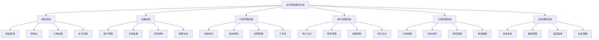

# 💼 业务场景中的模式应用

[[08-实际应用/01-框架中的设计模式案例分析]] ← [[08-实际应用/03-重构与模式应用实践]]
## 🎯 业务场景模式概览

### 📊 业务场景模式分布图



## 🏗️ 电商系统模式应用

### 📋 **商品管理系统**

#### **工厂模式应用**
```java
// ✅ 商品工厂模式
public interface ProductFactory {
    Product createProduct(ProductType type, ProductRequest request);
}

@Component
public class ProductFactoryImpl implements ProductFactory {
    
    @Override
    public Product createProduct(ProductType type, ProductRequest request) {
        switch (type) {
            case PHYSICAL:
                return createPhysicalProduct(request);
            case DIGITAL:
                return createDigitalProduct(request);
            case SERVICE:
                return createServiceProduct(request);
            default:
                throw new IllegalArgumentException("Unsupported product type: " + type);
        }
    }
    
    private PhysicalProduct createPhysicalProduct(ProductRequest request) {
        return PhysicalProduct.builder()
            .name(request.getName())
            .price(request.getPrice())
            .weight(request.getWeight())
            .dimensions(request.getDimensions())
            .build();
    }
    
    private DigitalProduct createDigitalProduct(ProductRequest request) {
        return DigitalProduct.builder()
            .name(request.getName())
            .price(request.getPrice())
            .downloadUrl(request.getDownloadUrl())
            .licenseKey(request.getLicenseKey())
            .build();
    }
    
    private ServiceProduct createServiceProduct(ProductRequest request) {
        return ServiceProduct.builder()
            .name(request.getName())
            .price(request.getPrice())
            .duration(request.getDuration())
            .serviceType(request.getServiceType())
            .build();
    }
}

// ✅ 使用示例
@RestController
@RequestMapping("/api/products")
public class ProductController {
    
    @Autowired
    private ProductFactory productFactory;
    
    @PostMapping
    public ResponseEntity<Product> createProduct(@RequestBody CreateProductRequest request) {
        Product product = productFactory.createProduct(request.getType(), request);
        return ResponseEntity.ok(product);
    }
}
```

#### **策略模式应用**
```java
// ✅ 价格计算策略
public interface PricingStrategy {
    BigDecimal calculatePrice(Product product, int quantity);
}

@Component
public class RegularPricingStrategy implements PricingStrategy {
    @Override
    public BigDecimal calculatePrice(Product product, int quantity) {
        return product.getPrice().multiply(BigDecimal.valueOf(quantity));
    }
}

@Component
public class BulkPricingStrategy implements PricingStrategy {
    @Override
    public BigDecimal calculatePrice(Product product, int quantity) {
        BigDecimal basePrice = product.getPrice().multiply(BigDecimal.valueOf(quantity));
        
        if (quantity >= 100) {
            return basePrice.multiply(BigDecimal.valueOf(0.8)); // 20% 折扣
        } else if (quantity >= 50) {
            return basePrice.multiply(BigDecimal.valueOf(0.9)); // 10% 折扣
        }
        
        return basePrice;
    }
}

@Component
public class VipPricingStrategy implements PricingStrategy {
    @Override
    public BigDecimal calculatePrice(Product product, int quantity) {
        BigDecimal basePrice = product.getPrice().multiply(BigDecimal.valueOf(quantity));
        return basePrice.multiply(BigDecimal.valueOf(0.85)); // 15% 折扣
    }
}

// ✅ 价格计算器
@Service
public class PriceCalculator {
    private final Map<CustomerType, PricingStrategy> strategies;
    
    public PriceCalculator(List<PricingStrategy> strategyList) {
        this.strategies = new HashMap<>();
        this.strategies.put(CustomerType.REGULAR, new RegularPricingStrategy());
        this.strategies.put(CustomerType.BULK, new BulkPricingStrategy());
        this.strategies.put(CustomerType.VIP, new VipPricingStrategy());
    }
    
    public BigDecimal calculatePrice(Product product, int quantity, CustomerType customerType) {
        PricingStrategy strategy = strategies.get(customerType);
        if (strategy == null) {
            strategy = strategies.get(CustomerType.REGULAR);
        }
        
        return strategy.calculatePrice(product, quantity);
    }
}
```

### 📋 **购物车系统**

#### **观察者模式应用**
```java
// ✅ 购物车观察者模式
public class ShoppingCart {
    private final List<CartItem> items;
    private final List<CartObserver> observers;
    
    public ShoppingCart() {
        this.items = new ArrayList<>();
        this.observers = new ArrayList<>();
    }
    
    public void addItem(Product product, int quantity) {
        CartItem item = new CartItem(product, quantity);
        items.add(item);
        notifyObservers(new CartEvent(CartEventType.ITEM_ADDED, item));
    }
    
    public void removeItem(Product product) {
        items.removeIf(item -> item.getProduct().equals(product));
        notifyObservers(new CartEvent(CartEventType.ITEM_REMOVED, product));
    }
    
    public void updateQuantity(Product product, int quantity) {
        items.stream()
            .filter(item -> item.getProduct().equals(product))
            .findFirst()
            .ifPresent(item -> {
                item.setQuantity(quantity);
                notifyObservers(new CartEvent(CartEventType.QUANTITY_UPDATED, item));
            });
    }
    
    public void addObserver(CartObserver observer) {
        observers.add(observer);
    }
    
    public void removeObserver(CartObserver observer) {
        observers.remove(observer);
    }
    
    private void notifyObservers(CartEvent event) {
        observers.forEach(observer -> observer.onCartChanged(event));
    }
}

// ✅ 购物车观察者
public interface CartObserver {
    void onCartChanged(CartEvent event);
}

@Component
public class CartPriceObserver implements CartObserver {
    @Override
    public void onCartChanged(CartEvent event) {
        if (event.getType() == CartEventType.ITEM_ADDED || 
            event.getType() == CartEventType.QUANTITY_UPDATED) {
            recalculateTotal(event.getCart());
        }
    }
    
    private void recalculateTotal(ShoppingCart cart) {
        // 重新计算总价
        BigDecimal total = cart.getItems().stream()
            .map(item -> item.getProduct().getPrice().multiply(BigDecimal.valueOf(item.getQuantity())))
            .reduce(BigDecimal.ZERO, BigDecimal::add);
        
        cart.setTotal(total);
    }
}

@Component
public class CartInventoryObserver implements CartObserver {
    @Override
    public void onCartChanged(CartEvent event) {
        if (event.getType() == CartEventType.ITEM_ADDED) {
            checkInventory(event.getItem().getProduct(), event.getItem().getQuantity());
        }
    }
    
    private void checkInventory(Product product, int quantity) {
        // 检查库存
        if (product.getStock() < quantity) {
            throw new InsufficientStockException("Insufficient stock for product: " + product.getName());
        }
    }
}
```

## 🏗️ 金融系统模式应用

### 📋 **账户管理系统**

#### **状态模式应用**
```java
// ✅ 账户状态模式
public abstract class AccountState {
    protected Account account;
    
    public AccountState(Account account) {
        this.account = account;
    }
    
    public abstract void deposit(BigDecimal amount);
    public abstract void withdraw(BigDecimal amount);
    public abstract void transfer(BigDecimal amount, Account targetAccount);
    public abstract void close();
}

// ✅ 正常状态
public class ActiveState extends AccountState {
    public ActiveState(Account account) {
        super(account);
    }
    
    @Override
    public void deposit(BigDecimal amount) {
        account.setBalance(account.getBalance().add(amount));
        account.addTransaction(new Transaction(TransactionType.DEPOSIT, amount));
    }
    
    @Override
    public void withdraw(BigDecimal amount) {
        if (account.getBalance().compareTo(amount) >= 0) {
            account.setBalance(account.getBalance().subtract(amount));
            account.addTransaction(new Transaction(TransactionType.WITHDRAWAL, amount));
        } else {
            throw new InsufficientFundsException("Insufficient funds");
        }
    }
    
    @Override
    public void transfer(BigDecimal amount, Account targetAccount) {
        withdraw(amount);
        targetAccount.deposit(amount);
        account.addTransaction(new Transaction(TransactionType.TRANSFER, amount));
    }
    
    @Override
    public void close() {
        if (account.getBalance().compareTo(BigDecimal.ZERO) == 0) {
            account.setState(new ClosedState(account));
        } else {
            throw new AccountCloseException("Cannot close account with balance");
        }
    }
}

// ✅ 冻结状态
public class FrozenState extends AccountState {
    public FrozenState(Account account) {
        super(account);
    }
    
    @Override
    public void deposit(BigDecimal amount) {
        account.setBalance(account.getBalance().add(amount));
        account.addTransaction(new Transaction(TransactionType.DEPOSIT, amount));
    }
    
    @Override
    public void withdraw(BigDecimal amount) {
        throw new AccountFrozenException("Account is frozen");
    }
    
    @Override
    public void transfer(BigDecimal amount, Account targetAccount) {
        throw new AccountFrozenException("Account is frozen");
    }
    
    @Override
    public void close() {
        throw new AccountFrozenException("Cannot close frozen account");
    }
}

// ✅ 账户类
public class Account {
    private String accountNumber;
    private BigDecimal balance;
    private AccountState state;
    private List<Transaction> transactions;
    
    public Account(String accountNumber) {
        this.accountNumber = accountNumber;
        this.balance = BigDecimal.ZERO;
        this.state = new ActiveState(this);
        this.transactions = new ArrayList<>();
    }
    
    public void deposit(BigDecimal amount) {
        state.deposit(amount);
    }
    
    public void withdraw(BigDecimal amount) {
        state.withdraw(amount);
    }
    
    public void transfer(BigDecimal amount, Account targetAccount) {
        state.transfer(amount, targetAccount);
    }
    
    public void freeze() {
        this.state = new FrozenState(this);
    }
    
    public void unfreeze() {
        this.state = new ActiveState(this);
    }
    
    public void close() {
        state.close();
    }
    
    // Getters and setters
    public String getAccountNumber() { return accountNumber; }
    public BigDecimal getBalance() { return balance; }
    public void setBalance(BigDecimal balance) { this.balance = balance; }
    public AccountState getState() { return state; }
    public void setState(AccountState state) { this.state = state; }
    public List<Transaction> getTransactions() { return transactions; }
    public void addTransaction(Transaction transaction) { transactions.add(transaction); }
}
```

#### **命令模式应用**
```java
// ✅ 交易命令模式
public interface TransactionCommand {
    void execute();
    void undo();
    String getDescription();
}

// ✅ 存款命令
public class DepositCommand implements TransactionCommand {
    private final Account account;
    private final BigDecimal amount;
    
    public DepositCommand(Account account, BigDecimal amount) {
        this.account = account;
        this.amount = amount;
    }
    
    @Override
    public void execute() {
        account.deposit(amount);
    }
    
    @Override
    public void undo() {
        account.withdraw(amount);
    }
    
    @Override
    public String getDescription() {
        return "Deposit " + amount + " to account " + account.getAccountNumber();
    }
}

// ✅ 取款命令
public class WithdrawCommand implements TransactionCommand {
    private final Account account;
    private final BigDecimal amount;
    
    public WithdrawCommand(Account account, BigDecimal amount) {
        this.account = account;
        this.amount = amount;
    }
    
    @Override
    public void execute() {
        account.withdraw(amount);
    }
    
    @Override
    public void undo() {
        account.deposit(amount);
    }
    
    @Override
    public String getDescription() {
        return "Withdraw " + amount + " from account " + account.getAccountNumber();
    }
}

// ✅ 转账命令
public class TransferCommand implements TransactionCommand {
    private final Account fromAccount;
    private final Account toAccount;
    private final BigDecimal amount;
    
    public TransferCommand(Account fromAccount, Account toAccount, BigDecimal amount) {
        this.fromAccount = fromAccount;
        this.toAccount = toAccount;
        this.amount = amount;
    }
    
    @Override
    public void execute() {
        fromAccount.transfer(amount, toAccount);
    }
    
    @Override
    public void undo() {
        toAccount.transfer(amount, fromAccount);
    }
    
    @Override
    public String getDescription() {
        return "Transfer " + amount + " from " + fromAccount.getAccountNumber() + 
               " to " + toAccount.getAccountNumber();
    }
}

// ✅ 交易处理器
@Service
public class TransactionProcessor {
    private final List<TransactionCommand> commandHistory;
    private int currentIndex;
    
    public TransactionProcessor() {
        this.commandHistory = new ArrayList<>();
        this.currentIndex = -1;
    }
    
    public void executeCommand(TransactionCommand command) {
        command.execute();
        
        // 添加到历史记录
        if (currentIndex < commandHistory.size() - 1) {
            commandHistory = commandHistory.subList(0, currentIndex + 1);
        }
        
        commandHistory.add(command);
        currentIndex++;
    }
    
    public void undo() {
        if (currentIndex >= 0) {
            TransactionCommand command = commandHistory.get(currentIndex);
            command.undo();
            currentIndex--;
        }
    }
    
    public void redo() {
        if (currentIndex < commandHistory.size() - 1) {
            currentIndex++;
            TransactionCommand command = commandHistory.get(currentIndex);
            command.execute();
        }
    }
}
```

## 🏗️ 内容管理系统模式应用

### 📋 **内容发布系统**

#### **模板方法模式应用**
```java
// ✅ 内容发布模板方法
public abstract class ContentPublisher {
    
    // 模板方法：定义发布流程
    public final void publishContent(Content content) {
        // 1. 验证内容
        validateContent(content);
        
        // 2. 预处理内容
        preprocessContent(content);
        
        // 3. 发布内容
        doPublish(content);
        
        // 4. 后处理
        postProcess(content);
        
        // 5. 发送通知
        sendNotification(content);
    }
    
    // 抽象方法：子类必须实现
    protected abstract void doPublish(Content content);
    
    // 钩子方法：子类可以重写
    protected void validateContent(Content content) {
        if (content == null || content.getTitle() == null) {
            throw new IllegalArgumentException("Content validation failed");
        }
    }
    
    protected void preprocessContent(Content content) {
        // 默认预处理：清理HTML标签
        content.setContent(cleanHtml(content.getContent()));
    }
    
    protected void postProcess(Content content) {
        // 默认后处理：更新发布时间
        content.setPublishedAt(LocalDateTime.now());
    }
    
    protected void sendNotification(Content content) {
        // 默认通知：记录日志
        logger.info("Content published: " + content.getTitle());
    }
    
    private String cleanHtml(String content) {
        // 简单的HTML清理
        return content.replaceAll("<[^>]*>", "");
    }
}

// ✅ 文章发布器
public class ArticlePublisher extends ContentPublisher {
    @Override
    protected void doPublish(Content content) {
        // 文章发布逻辑
        content.setStatus(ContentStatus.PUBLISHED);
        contentRepository.save(content);
    }
    
    @Override
    protected void preprocessContent(Content content) {
        super.preprocessContent(content);
        // 文章特殊预处理：添加摘要
        if (content.getSummary() == null) {
            content.setSummary(generateSummary(content.getContent()));
        }
    }
    
    @Override
    protected void sendNotification(Content content) {
        super.sendNotification(content);
        // 文章特殊通知：发送邮件
        emailService.sendArticlePublishedNotification(content);
    }
    
    private String generateSummary(String content) {
        // 生成摘要逻辑
        return content.length() > 200 ? content.substring(0, 200) + "..." : content;
    }
}

// ✅ 视频发布器
public class VideoPublisher extends ContentPublisher {
    @Override
    protected void doPublish(Content content) {
        // 视频发布逻辑
        content.setStatus(ContentStatus.PUBLISHED);
        contentRepository.save(content);
        
        // 视频特殊处理：生成缩略图
        generateThumbnail(content);
    }
    
    @Override
    protected void preprocessContent(Content content) {
        super.preprocessContent(content);
        // 视频特殊预处理：转码
        transcodeVideo(content);
    }
    
    private void generateThumbnail(Content content) {
        // 生成缩略图逻辑
    }
    
    private void transcodeVideo(Content content) {
        // 视频转码逻辑
    }
}
```

## 🏗️ 用户权限系统模式应用

### 📋 **权限控制系统**

#### **责任链模式应用**
```java
// ✅ 权限验证责任链
public abstract class PermissionHandler {
    protected PermissionHandler nextHandler;
    
    public void setNextHandler(PermissionHandler nextHandler) {
        this.nextHandler = nextHandler;
    }
    
    public abstract boolean handlePermission(PermissionRequest request);
    
    protected boolean passToNext(PermissionRequest request) {
        if (nextHandler != null) {
            return nextHandler.handlePermission(request);
        }
        return false;
    }
}

// ✅ 角色权限处理器
public class RolePermissionHandler extends PermissionHandler {
    @Override
    public boolean handlePermission(PermissionRequest request) {
        User user = request.getUser();
        String resource = request.getResource();
        String action = request.getAction();
        
        // 检查用户角色权限
        for (Role role : user.getRoles()) {
            if (role.hasPermission(resource, action)) {
                return true;
            }
        }
        
        return passToNext(request);
    }
}

// ✅ 资源权限处理器
public class ResourcePermissionHandler extends PermissionHandler {
    @Override
    public boolean handlePermission(PermissionRequest request) {
        User user = request.getUser();
        String resource = request.getResource();
        
        // 检查资源所有者权限
        if (isResourceOwner(user, resource)) {
            return true;
        }
        
        return passToNext(request);
    }
    
    private boolean isResourceOwner(User user, String resource) {
        // 检查资源所有者逻辑
        return false;
    }
}

// ✅ 管理员权限处理器
public class AdminPermissionHandler extends PermissionHandler {
    @Override
    public boolean handlePermission(PermissionRequest request) {
        User user = request.getUser();
        
        // 检查管理员权限
        if (user.isAdmin()) {
            return true;
        }
        
        return passToNext(request);
    }
}

// ✅ 权限管理器
@Service
public class PermissionManager {
    private PermissionHandler permissionChain;
    
    @PostConstruct
    public void initPermissionChain() {
        // 构建责任链
        PermissionHandler roleHandler = new RolePermissionHandler();
        PermissionHandler resourceHandler = new ResourcePermissionHandler();
        PermissionHandler adminHandler = new AdminPermissionHandler();
        
        roleHandler.setNextHandler(resourceHandler);
        resourceHandler.setNextHandler(adminHandler);
        
        this.permissionChain = roleHandler;
    }
    
    public boolean hasPermission(User user, String resource, String action) {
        PermissionRequest request = new PermissionRequest(user, resource, action);
        return permissionChain.handlePermission(request);
    }
}
```

## 🎯 业务场景模式总结

### 📋 **模式应用统计**

| 业务场景 | 主要模式 | 应用目的 | 效果 |
|----------|----------|----------|------|
| **电商系统** | 工厂、策略、观察者 | 灵活扩展、解耦 | 易于维护、可扩展 |
| **金融系统** | 状态、命令 | 业务规则、事务管理 | 安全可靠、可撤销 |
| **内容管理** | 模板方法、策略 | 流程标准化 | 代码复用、易维护 |
| **权限系统** | 责任链、代理 | 权限控制 | 灵活配置、安全 |

### 📋 **选择原则**

1. **业务复杂度**: 根据业务复杂度选择合适模式
2. **扩展需求**: 考虑未来扩展需求
3. **团队能力**: 考虑团队对模式的掌握程度
4. **维护成本**: 评估长期维护成本

## 🔗 学习衔接

- **上一文档** ← [[框架中的设计模式案例分析]]
- **下一文档** → [[重构与模式应用实践]]
- **模式基础** → [[01-基础认知]]

---
**💡 业务场景精髓**: 设计模式在业务场景中的应用就像医生开药方，需要根据具体的病情（业务需求）选择合适的药物（设计模式）。关键是要理解业务本质，选择最合适的模式，而不是为了使用模式而使用模式！
