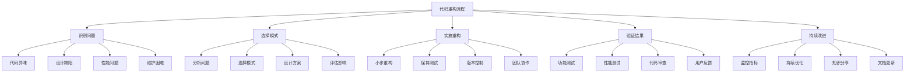

# 🔧 重构与模式应用实践

[[08-实际应用/02-业务场景中的模式应用]] ← [[08-实际应用/04-多语言实现差异对比]]
## 🎯 重构实践概览

### 📊 重构流程图



## 🏗️ 重构案例1：长方法重构

### 📋 **重构前代码**

#### **问题代码**
```java
// ❌ 重构前：长方法
public class OrderProcessor {
    public void processOrder(Order order) {
        // 验证订单
        if (order == null) {
            throw new IllegalArgumentException("Order cannot be null");
        }
        if (order.getItems() == null || order.getItems().isEmpty()) {
            throw new IllegalArgumentException("Order must have items");
        }
        if (order.getCustomer() == null) {
            throw new IllegalArgumentException("Order must have a customer");
        }
        if (order.getCustomer().getEmail() == null || order.getCustomer().getEmail().isEmpty()) {
            throw new IllegalArgumentException("Customer must have an email");
        }
        
        // 计算价格
        double total = 0;
        for (OrderItem item : order.getItems()) {
            if (item.getPrice() <= 0) {
                throw new IllegalArgumentException("Item price must be positive");
            }
            if (item.getQuantity() <= 0) {
                throw new IllegalArgumentException("Item quantity must be positive");
            }
            total += item.getPrice() * item.getQuantity();
        }
        
        // 应用折扣
        if (order.getCustomer().isVIP()) {
            total *= 0.9; // VIP折扣
        }
        if (order.getItems().size() > 5) {
            total *= 0.95; // 批量折扣
        }
        
        // 保存订单
        order.setTotal(total);
        order.setStatus("PROCESSED");
        orderRepository.save(order);
        
        // 发送邮件
        String emailContent = "Dear " + order.getCustomer().getName() + 
                             ", your order #" + order.getId() + 
                             " has been processed. Total: $" + total;
        emailService.sendEmail(order.getCustomer().getEmail(), "Order Confirmation", emailContent);
        
        // 更新库存
        for (OrderItem item : order.getItems()) {
            Product product = productRepository.findById(item.getProductId());
            if (product.getStock() < item.getQuantity()) {
                throw new InsufficientStockException("Insufficient stock for product: " + product.getName());
            }
            product.setStock(product.getStock() - item.getQuantity());
            productRepository.save(product);
        }
        
        // 记录日志
        logger.info("Order processed: " + order.getId() + ", Total: " + total);
    }
}
```

### 📋 **重构后代码**

#### **应用模板方法模式**
```java
// ✅ 重构后：模板方法模式
public abstract class OrderProcessorTemplate {
    
    // 模板方法：定义处理流程
    public final void processOrder(Order order) {
        // 1. 验证订单
        validateOrder(order);
        
        // 2. 计算价格
        double total = calculateTotal(order);
        
        // 3. 应用折扣
        total = applyDiscounts(order, total);
        
        // 4. 保存订单
        saveOrder(order, total);
        
        // 5. 发送通知
        sendNotification(order);
        
        // 6. 更新库存
        updateInventory(order);
        
        // 7. 记录日志
        logOrderProcessing(order, total);
    }
    
    // 抽象方法：子类必须实现
    protected abstract void saveOrder(Order order, double total);
    protected abstract void sendNotification(Order order);
    protected abstract void updateInventory(Order order);
    
    // 具体方法：通用实现
    protected void validateOrder(Order order) {
        OrderValidator validator = new OrderValidator();
        validator.validate(order);
    }
    
    protected double calculateTotal(Order order) {
        PriceCalculator calculator = new PriceCalculator();
        return calculator.calculate(order);
    }
    
    protected double applyDiscounts(Order order, double total) {
        DiscountCalculator calculator = new DiscountCalculator();
        return calculator.calculate(order, total);
    }
    
    protected void logOrderProcessing(Order order, double total) {
        logger.info("Order processed: " + order.getId() + ", Total: " + total);
    }
}

// ✅ 具体实现
@Service
public class StandardOrderProcessor extends OrderProcessorTemplate {
    
    @Autowired
    private OrderRepository orderRepository;
    
    @Autowired
    private EmailService emailService;
    
    @Autowired
    private ProductRepository productRepository;
    
    @Override
    protected void saveOrder(Order order, double total) {
        order.setTotal(total);
        order.setStatus("PROCESSED");
        orderRepository.save(order);
    }
    
    @Override
    protected void sendNotification(Order order) {
        String emailContent = "Dear " + order.getCustomer().getName() + 
                             ", your order #" + order.getId() + 
                             " has been processed. Total: $" + order.getTotal();
        emailService.sendEmail(order.getCustomer().getEmail(), "Order Confirmation", emailContent);
    }
    
    @Override
    protected void updateInventory(Order order) {
        for (OrderItem item : order.getItems()) {
            Product product = productRepository.findById(item.getProductId());
            if (product.getStock() < item.getQuantity()) {
                throw new InsufficientStockException("Insufficient stock for product: " + product.getName());
            }
            product.setStock(product.getStock() - item.getQuantity());
            productRepository.save(product);
        }
    }
}
```

#### **应用策略模式**
```java
// ✅ 价格计算策略
public interface PricingStrategy {
    double calculate(List<OrderItem> items);
}

@Component
public class StandardPricingStrategy implements PricingStrategy {
    @Override
    public double calculate(List<OrderItem> items) {
        return items.stream()
            .mapToDouble(item -> item.getPrice() * item.getQuantity())
            .sum();
    }
}

@Component
public class BulkPricingStrategy implements PricingStrategy {
    @Override
    public double calculate(List<OrderItem> items) {
        double total = items.stream()
            .mapToDouble(item -> item.getPrice() * item.getQuantity())
            .sum();
        
        if (items.size() > 5) {
            total *= 0.95; // 批量折扣
        }
        
        return total;
    }
}

// ✅ 折扣计算策略
public interface DiscountStrategy {
    double calculate(Order order, double total);
}

@Component
public class VipDiscountStrategy implements DiscountStrategy {
    @Override
    public double calculate(Order order, double total) {
        if (order.getCustomer().isVIP()) {
            return total * 0.9; // VIP折扣
        }
        return total;
    }
}

@Component
public class BulkDiscountStrategy implements DiscountStrategy {
    @Override
    public double calculate(Order order, double total) {
        if (order.getItems().size() > 5) {
            return total * 0.95; // 批量折扣
        }
        return total;
    }
}

// ✅ 价格计算器
@Service
public class PriceCalculator {
    private final List<PricingStrategy> pricingStrategies;
    private final List<DiscountStrategy> discountStrategies;
    
    public PriceCalculator(List<PricingStrategy> pricingStrategies, 
                          List<DiscountStrategy> discountStrategies) {
        this.pricingStrategies = pricingStrategies;
        this.discountStrategies = discountStrategies;
    }
    
    public double calculate(Order order) {
        // 计算基础价格
        double total = pricingStrategies.stream()
            .mapToDouble(strategy -> strategy.calculate(order.getItems()))
            .sum();
        
        // 应用折扣
        for (DiscountStrategy strategy : discountStrategies) {
            total = strategy.calculate(order, total);
        }
        
        return total;
    }
}
```

## 🏗️ 重构案例2：大类重构

### 📋 **重构前代码**

#### **问题代码**
```java
// ❌ 重构前：上帝类
public class UserManager {
    // 用户管理
    public void createUser(User user) { /* 实现 */ }
    public void updateUser(User user) { /* 实现 */ }
    public void deleteUser(Long userId) { /* 实现 */ }
    public User getUserById(Long userId) { /* 实现 */ }
    public List<User> getAllUsers() { /* 实现 */ }
    
    // 权限管理
    public void assignRole(User user, Role role) { /* 实现 */ }
    public void removeRole(User user, Role role) { /* 实现 */ }
    public boolean hasPermission(User user, String permission) { /* 实现 */ }
    public List<Permission> getUserPermissions(User user) { /* 实现 */ }
    
    // 认证管理
    public boolean authenticate(String username, String password) { /* 实现 */ }
    public void changePassword(User user, String newPassword) { /* 实现 */ }
    public void resetPassword(String email) { /* 实现 */ }
    public boolean isAccountLocked(User user) { /* 实现 */ }
    
    // 邮件管理
    public void sendWelcomeEmail(User user) { /* 实现 */ }
    public void sendPasswordResetEmail(String email) { /* 实现 */ }
    public void sendNotificationEmail(User user, String message) { /* 实现 */ }
    
    // 日志管理
    public void logUserAction(User user, String action) { /* 实现 */ }
    public List<UserAction> getUserActionHistory(User user) { /* 实现 */ }
    public void auditUserChanges(User user) { /* 实现 */ }
    
    // 缓存管理
    public void cacheUser(User user) { /* 实现 */ }
    public User getCachedUser(Long userId) { /* 实现 */ }
    public void invalidateUserCache(Long userId) { /* 实现 */ }
}
```

### 📋 **重构后代码**

#### **应用外观模式**
```java
// ✅ 重构后：外观模式
@Service
public class UserFacade {
    private final UserService userService;
    private final PermissionService permissionService;
    private final AuthenticationService authenticationService;
    private final EmailService emailService;
    private final AuditService auditService;
    private final CacheService cacheService;
    
    public UserFacade(UserService userService, PermissionService permissionService,
                     AuthenticationService authenticationService, EmailService emailService,
                     AuditService auditService, CacheService cacheService) {
        this.userService = userService;
        this.permissionService = permissionService;
        this.authenticationService = authenticationService;
        this.emailService = emailService;
        this.auditService = auditService;
        this.cacheService = cacheService;
    }
    
    // 用户管理
    public User createUser(CreateUserRequest request) {
        User user = userService.createUser(request);
        emailService.sendWelcomeEmail(user);
        auditService.logUserCreation(user);
        return user;
    }
    
    public User updateUser(UpdateUserRequest request) {
        User user = userService.updateUser(request);
        auditService.logUserUpdate(user);
        cacheService.invalidateUserCache(user.getId());
        return user;
    }
    
    public void deleteUser(Long userId) {
        userService.deleteUser(userId);
        auditService.logUserDeletion(userId);
        cacheService.invalidateUserCache(userId);
    }
    
    public User getUserById(Long userId) {
        User cachedUser = cacheService.getCachedUser(userId);
        if (cachedUser != null) {
            return cachedUser;
        }
        
        User user = userService.getUserById(userId);
        cacheService.cacheUser(user);
        return user;
    }
    
    // 权限管理
    public void assignRole(Long userId, String roleName) {
        User user = userService.getUserById(userId);
        Role role = permissionService.getRoleByName(roleName);
        permissionService.assignRole(user, role);
        auditService.logRoleAssignment(user, role);
    }
    
    public boolean hasPermission(Long userId, String permission) {
        User user = userService.getUserById(userId);
        return permissionService.hasPermission(user, permission);
    }
    
    // 认证管理
    public boolean authenticate(String username, String password) {
        boolean result = authenticationService.authenticate(username, password);
        if (result) {
            User user = userService.getUserByUsername(username);
            auditService.logUserLogin(user);
        }
        return result;
    }
    
    public void changePassword(Long userId, String newPassword) {
        User user = userService.getUserById(userId);
        authenticationService.changePassword(user, newPassword);
        auditService.logPasswordChange(user);
    }
}
```

#### **应用单一职责原则**
```java
// ✅ 用户服务：只负责用户CRUD
@Service
public class UserService {
    private final UserRepository userRepository;
    private final UserValidator validator;
    
    public UserService(UserRepository userRepository, UserValidator validator) {
        this.userRepository = userRepository;
        this.validator = validator;
    }
    
    public User createUser(CreateUserRequest request) {
        validator.validateCreateRequest(request);
        User user = new User(request.getName(), request.getEmail());
        return userRepository.save(user);
    }
    
    public User updateUser(UpdateUserRequest request) {
        validator.validateUpdateRequest(request);
        User user = userRepository.findById(request.getId())
            .orElseThrow(() -> new UserNotFoundException("User not found"));
        
        user.setName(request.getName());
        user.setEmail(request.getEmail());
        return userRepository.save(user);
    }
    
    public void deleteUser(Long userId) {
        userRepository.deleteById(userId);
    }
    
    public User getUserById(Long userId) {
        return userRepository.findById(userId)
            .orElseThrow(() -> new UserNotFoundException("User not found"));
    }
    
    public User getUserByUsername(String username) {
        return userRepository.findByUsername(username)
            .orElseThrow(() -> new UserNotFoundException("User not found"));
    }
    
    public List<User> getAllUsers() {
        return userRepository.findAll();
    }
}

// ✅ 权限服务：只负责权限管理
@Service
public class PermissionService {
    private final PermissionRepository permissionRepository;
    private final RoleRepository roleRepository;
    
    public PermissionService(PermissionRepository permissionRepository, RoleRepository roleRepository) {
        this.permissionRepository = permissionRepository;
        this.roleRepository = roleRepository;
    }
    
    public void assignRole(User user, Role role) {
        user.getRoles().add(role);
    }
    
    public void removeRole(User user, Role role) {
        user.getRoles().remove(role);
    }
    
    public boolean hasPermission(User user, String permission) {
        return user.getRoles().stream()
            .flatMap(role -> role.getPermissions().stream())
            .anyMatch(perm -> perm.getName().equals(permission));
    }
    
    public List<Permission> getUserPermissions(User user) {
        return user.getRoles().stream()
            .flatMap(role -> role.getPermissions().stream())
            .distinct()
            .collect(Collectors.toList());
    }
    
    public Role getRoleByName(String roleName) {
        return roleRepository.findByName(roleName)
            .orElseThrow(() -> new RoleNotFoundException("Role not found"));
    }
}

// ✅ 认证服务：只负责认证
@Service
public class AuthenticationService {
    private final PasswordEncoder passwordEncoder;
    private final UserRepository userRepository;
    
    public AuthenticationService(PasswordEncoder passwordEncoder, UserRepository userRepository) {
        this.passwordEncoder = passwordEncoder;
        this.userRepository = userRepository;
    }
    
    public boolean authenticate(String username, String password) {
        User user = userRepository.findByUsername(username);
        if (user != null) {
            return passwordEncoder.matches(password, user.getPassword());
        }
        return false;
    }
    
    public void changePassword(User user, String newPassword) {
        user.setPassword(passwordEncoder.encode(newPassword));
    }
    
    public void resetPassword(String email) {
        User user = userRepository.findByEmail(email);
        if (user != null) {
            String newPassword = generateRandomPassword();
            user.setPassword(passwordEncoder.encode(newPassword));
            userRepository.save(user);
            // 发送新密码邮件
        }
    }
    
    public boolean isAccountLocked(User user) {
        return user.isLocked();
    }
    
    private String generateRandomPassword() {
        // 生成随机密码逻辑
        return "randomPassword";
    }
}
```

## 🏗️ 重构案例3：循环依赖重构

### 📋 **重构前代码**

#### **问题代码**
```java
// ❌ 重构前：循环依赖
public class UserService {
    private OrderService orderService;
    
    public void setOrderService(OrderService orderService) {
        this.orderService = orderService;
    }
    
    public User createUser(User user) {
        // 创建用户逻辑
        return user;
    }
    
    public List<Order> getUserOrders(Long userId) {
        return orderService.getOrdersByUserId(userId);
    }
}

public class OrderService {
    private UserService userService;
    
    public void setUserService(UserService userService) {
        this.userService = userService;
    }
    
    public Order createOrder(Order order) {
        // 验证用户存在
        User user = userService.getUserById(order.getUserId());
        // 创建订单逻辑
        return order;
    }
    
    public List<Order> getOrdersByUserId(Long userId) {
        // 获取用户订单逻辑
        return new ArrayList<>();
    }
}
```

### 📋 **重构后代码**

#### **应用依赖倒置原则**
```java
// ✅ 重构后：依赖倒置
public interface UserRepository {
    User findById(Long userId);
    User save(User user);
}

public interface OrderRepository {
    List<Order> findByUserId(Long userId);
    Order save(Order order);
}

// ✅ 用户服务：依赖抽象
@Service
public class UserService {
    private final UserRepository userRepository;
    
    public UserService(UserRepository userRepository) {
        this.userRepository = userRepository;
    }
    
    public User createUser(User user) {
        return userRepository.save(user);
    }
    
    public User getUserById(Long userId) {
        return userRepository.findById(userId);
    }
}

// ✅ 订单服务：依赖抽象
@Service
public class OrderService {
    private final OrderRepository orderRepository;
    private final UserRepository userRepository;
    
    public OrderService(OrderRepository orderRepository, UserRepository userRepository) {
        this.orderRepository = orderRepository;
        this.userRepository = userRepository;
    }
    
    public Order createOrder(Order order) {
        // 验证用户存在
        User user = userRepository.findById(order.getUserId());
        if (user == null) {
            throw new UserNotFoundException("User not found: " + order.getUserId());
        }
        
        return orderRepository.save(order);
    }
    
    public List<Order> getOrdersByUserId(Long userId) {
        return orderRepository.findByUserId(userId);
    }
}

// ✅ 具体实现
@Repository
public class JpaUserRepository implements UserRepository {
    @PersistenceContext
    private EntityManager entityManager;
    
    @Override
    public User findById(Long userId) {
        return entityManager.find(User.class, userId);
    }
    
    @Override
    public User save(User user) {
        entityManager.persist(user);
        return user;
    }
}

@Repository
public class JpaOrderRepository implements OrderRepository {
    @PersistenceContext
    private EntityManager entityManager;
    
    @Override
    public List<Order> findByUserId(Long userId) {
        return entityManager.createQuery(
            "SELECT o FROM Order o WHERE o.userId = :userId", Order.class)
            .setParameter("userId", userId)
            .getResultList();
    }
    
    @Override
    public Order save(Order order) {
        entityManager.persist(order);
        return order;
    }
}
```

## 🎯 重构最佳实践

### 📋 **重构原则**

1. **小步重构**: 每次重构一小部分代码
2. **保持测试**: 重构过程中保持测试通过
3. **版本控制**: 使用Git管理重构过程
4. **团队协作**: 重构需要团队协作和沟通

### 📋 **重构步骤**

| 步骤 | 描述 | 注意事项 |
|------|------|----------|
| **识别问题** | 发现代码异味和设计缺陷 | 不要急于重构 |
| **分析问题** | 理解问题的根本原因 | 找到问题的本质 |
| **选择模式** | 选择合适的设计模式 | 不要过度设计 |
| **设计方案** | 设计重构方案 | 考虑影响范围 |
| **实施重构** | 逐步实施重构 | 保持功能不变 |
| **验证结果** | 验证重构效果 | 确保功能正确 |
| **持续改进** | 持续优化代码 | 建立重构文化 |

### 📋 **重构工具**

```java
// ✅ 重构工具类
public class RefactoringTools {
    
    // 提取方法
    public static void extractMethod(String methodName, String code) {
        System.out.println("Extracting method: " + methodName);
        // 提取方法逻辑
    }
    
    // 提取类
    public static void extractClass(String className, String code) {
        System.out.println("Extracting class: " + className);
        // 提取类逻辑
    }
    
    // 移动方法
    public static void moveMethod(String methodName, String fromClass, String toClass) {
        System.out.println("Moving method " + methodName + " from " + fromClass + " to " + toClass);
        // 移动方法逻辑
    }
    
    // 重命名
    public static void rename(String oldName, String newName) {
        System.out.println("Renaming " + oldName + " to " + newName);
        // 重命名逻辑
    }
}
```

### ⚠️ **注意事项**

1. **不要过度重构**: 重构要有明确的目的
2. **保持功能不变**: 重构过程中不能改变功能
3. **充分测试**: 重构前确保有充分的测试覆盖
4. **团队沟通**: 重构需要团队协作和沟通

## 🔗 学习衔接

- **上一文档** ← [[业务场景中的模式应用]]
- **下一文档** → [[多语言实现差异对比]]
- **模式基础** → [[01-基础认知]]

---
**💡 重构精髓**: 重构就像给房子装修，需要有计划、有步骤地进行。通过应用设计模式，我们可以将混乱的代码重构为清晰、可维护的代码。关键是要有耐心，一步一步地改进，不要急于求成！
