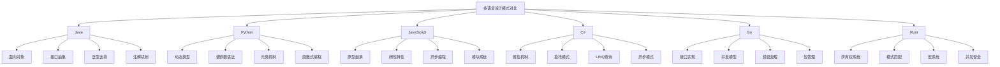

# 🌍 多语言实现差异对比

[[08-实际应用/03-重构与模式应用实践]] ← [[09-记忆强化]]
## 🎯 多语言模式对比概览

### 📊 语言特性对比图



## 🏗️ Java 模式实现

### 📋 **单例模式实现**

#### **传统实现**
```java
// ✅ Java传统单例模式
public class Singleton {
    private static Singleton instance;
    
    private Singleton() {}
    
    public static synchronized Singleton getInstance() {
        if (instance == null) {
            instance = new Singleton();
        }
        return instance;
    }
}

// ✅ Java枚举单例（推荐）
public enum EnumSingleton {
    INSTANCE;
    
    public void doSomething() {
        System.out.println("Enum singleton doing something");
    }
}

// ✅ Java双重检查锁定
public class DoubleCheckedSingleton {
    private static volatile DoubleCheckedSingleton instance;
    
    private DoubleCheckedSingleton() {}
    
    public static DoubleCheckedSingleton getInstance() {
        if (instance == null) {
            synchronized (DoubleCheckedSingleton.class) {
                if (instance == null) {
                    instance = new DoubleCheckedSingleton();
                }
            }
        }
        return instance;
    }
}
```

#### **现代Java实现**
```java
// ✅ Java 8+函数式单例
public class FunctionalSingleton {
    private static final Supplier<FunctionalSingleton> INSTANCE_SUPPLIER = 
        FunctionalSingleton::new;
    
    private FunctionalSingleton() {}
    
    public static FunctionalSingleton getInstance() {
        return INSTANCE_SUPPLIER.get();
    }
}

// ✅ Spring单例Bean
@Component
@Scope("singleton")
public class SpringSingleton {
    public void doSomething() {
        System.out.println("Spring singleton doing something");
    }
}
```

### 📋 **工厂模式实现**

#### **传统工厂模式**
```java
// ✅ Java工厂模式
public interface Product {
    void doSomething();
}

public class ConcreteProductA implements Product {
    @Override
    public void doSomething() {
        System.out.println("Product A doing something");
    }
}

public class ConcreteProductB implements Product {
    @Override
    public void doSomething() {
        System.out.println("Product B doing something");
    }
}

public class ProductFactory {
    public Product createProduct(String type) {
        switch (type) {
            case "A":
                return new ConcreteProductA();
            case "B":
                return new ConcreteProductB();
            default:
                throw new IllegalArgumentException("Unknown product type: " + type);
        }
    }
}
```

#### **现代Java实现**
```java
// ✅ Java 8+函数式工厂
public class FunctionalProductFactory {
    private final Map<String, Supplier<Product>> productSuppliers;
    
    public FunctionalProductFactory() {
        this.productSuppliers = new HashMap<>();
        productSuppliers.put("A", ConcreteProductA::new);
        productSuppliers.put("B", ConcreteProductB::new);
    }
    
    public Product createProduct(String type) {
        Supplier<Product> supplier = productSuppliers.get(type);
        if (supplier != null) {
            return supplier.get();
        }
        throw new IllegalArgumentException("Unknown product type: " + type);
    }
}

// ✅ Spring工厂Bean
@Configuration
public class ProductFactoryConfig {
    
    @Bean
    @ConditionalOnProperty(name = "product.type", havingValue = "A")
    public Product productA() {
        return new ConcreteProductA();
    }
    
    @Bean
    @ConditionalOnProperty(name = "product.type", havingValue = "B")
    public Product productB() {
        return new ConcreteProductB();
    }
}
```

## 🏗️ Python 模式实现

### 📋 **单例模式实现**

#### **装饰器实现**
```python
# ✅ Python装饰器单例
def singleton(cls):
    instances = {}
    def get_instance(*args, **kwargs):
        if cls not in instances:
            instances[cls] = cls(*args, **kwargs)
        return instances[cls]
    return get_instance

@singleton
class Singleton:
    def __init__(self):
        self.value = None
    
    def do_something(self):
        print("Singleton doing something")

# ✅ Python元类单例
class SingletonMeta(type):
    _instances = {}
    
    def __call__(cls, *args, **kwargs):
        if cls not in cls._instances:
            cls._instances[cls] = super().__call__(*args, **kwargs)
        return cls._instances[cls]

class Singleton(metaclass=SingletonMeta):
    def __init__(self):
        self.value = None
    
    def do_something(self):
        print("Singleton doing something")
```

### 📋 **工厂模式实现**

#### **传统工厂模式**
```python
# ✅ Python工厂模式
from abc import ABC, abstractmethod

class Product(ABC):
    @abstractmethod
    def do_something(self):
        pass

class ConcreteProductA(Product):
    def do_something(self):
        print("Product A doing something")

class ConcreteProductB(Product):
    def do_something(self):
        print("Product B doing something")

class ProductFactory:
    @staticmethod
    def create_product(product_type):
        if product_type == "A":
            return ConcreteProductA()
        elif product_type == "B":
            return ConcreteProductB()
        else:
            raise ValueError(f"Unknown product type: {product_type}")
```

#### **现代Python实现**
```python
# ✅ Python函数式工厂
class FunctionalProductFactory:
    def __init__(self):
        self.product_creators = {
            "A": ConcreteProductA,
            "B": ConcreteProductB
        }
    
    def create_product(self, product_type):
        creator = self.product_creators.get(product_type)
        if creator:
            return creator()
        raise ValueError(f"Unknown product type: {product_type}")

# ✅ Python装饰器工厂
def product_factory(product_type):
    def decorator(cls):
        ProductFactory.register_product(product_type, cls)
        return cls
    return decorator

class ProductFactory:
    _products = {}
    
    @classmethod
    def register_product(cls, product_type, product_class):
        cls._products[product_type] = product_class
    
    @classmethod
    def create_product(cls, product_type):
        product_class = cls._products.get(product_type)
        if product_class:
            return product_class()
        raise ValueError(f"Unknown product type: {product_type}")

@product_factory("A")
class ConcreteProductA(Product):
    def do_something(self):
        print("Product A doing something")
```

## 🏗️ JavaScript 模式实现

### 📋 **单例模式实现**

#### **传统实现**
```javascript
// ✅ JavaScript传统单例
const Singleton = (function() {
    let instance;
    
    function createInstance() {
        return {
            doSomething: function() {
                console.log("Singleton doing something");
            }
        };
    }
    
    return {
        getInstance: function() {
            if (!instance) {
                instance = createInstance();
            }
            return instance;
        }
    };
})();

// ✅ JavaScript ES6单例
class Singleton {
    constructor() {
        if (Singleton.instance) {
            return Singleton.instance;
        }
        Singleton.instance = this;
    }
    
    doSomething() {
        console.log("Singleton doing something");
    }
}
```

### 📋 **工厂模式实现**

#### **传统工厂模式**
```javascript
// ✅ JavaScript工厂模式
class Product {
    doSomething() {
        throw new Error("Method must be implemented");
    }
}

class ConcreteProductA extends Product {
    doSomething() {
        console.log("Product A doing something");
    }
}

class ConcreteProductB extends Product {
    doSomething() {
        console.log("Product B doing something");
    }
}

class ProductFactory {
    static createProduct(type) {
        switch (type) {
            case "A":
                return new ConcreteProductA();
            case "B":
                return new ConcreteProductB();
            default:
                throw new Error(`Unknown product type: ${type}`);
        }
    }
}
```

#### **现代JavaScript实现**
```javascript
// ✅ JavaScript函数式工厂
class FunctionalProductFactory {
    constructor() {
        this.productCreators = {
            A: () => new ConcreteProductA(),
            B: () => new ConcreteProductB()
        };
    }
    
    createProduct(type) {
        const creator = this.productCreators[type];
        if (creator) {
            return creator();
        }
        throw new Error(`Unknown product type: ${type}`);
    }
}

// ✅ JavaScript模块工厂
const ProductFactory = (() => {
    const products = {};
    
    const registerProduct = (type, creator) => {
        products[type] = creator;
    };
    
    const createProduct = (type) => {
        const creator = products[type];
        if (creator) {
            return creator();
        }
        throw new Error(`Unknown product type: ${type}`);
    };
    
    return {
        registerProduct,
        createProduct
    };
})();
```

## 🏗️ C# 模式实现

### 📋 **单例模式实现**

#### **传统实现**
```csharp
// ✅ C#传统单例
public class Singleton
{
    private static Singleton instance;
    private static readonly object lockObject = new object();
    
    private Singleton() { }
    
    public static Singleton Instance
    {
        get
        {
            if (instance == null)
            {
                lock (lockObject)
                {
                    if (instance == null)
                    {
                        instance = new Singleton();
                    }
                }
            }
            return instance;
        }
    }
    
    public void DoSomething()
    {
        Console.WriteLine("Singleton doing something");
    }
}

// ✅ C#现代单例
public class ModernSingleton
{
    private static readonly Lazy<ModernSingleton> lazy = 
        new Lazy<ModernSingleton>(() => new ModernSingleton());
    
    public static ModernSingleton Instance => lazy.Value;
    
    private ModernSingleton() { }
    
    public void DoSomething()
    {
        Console.WriteLine("Modern singleton doing something");
    }
}
```

### 📋 **工厂模式实现**

#### **传统工厂模式**
```csharp
// ✅ C#工厂模式
public interface IProduct
{
    void DoSomething();
}

public class ConcreteProductA : IProduct
{
    public void DoSomething()
    {
        Console.WriteLine("Product A doing something");
    }
}

public class ConcreteProductB : IProduct
{
    public void DoSomething()
    {
        Console.WriteLine("Product B doing something");
    }
}

public class ProductFactory
{
    public IProduct CreateProduct(string type)
    {
        return type switch
        {
            "A" => new ConcreteProductA(),
            "B" => new ConcreteProductB(),
            _ => throw new ArgumentException($"Unknown product type: {type}")
        };
    }
}
```

#### **现代C#实现**
```csharp
// ✅ C#泛型工厂
public class GenericProductFactory<T> where T : IProduct, new()
{
    public T CreateProduct()
    {
        return new T();
    }
}

// ✅ C#依赖注入工厂
public interface IProductFactory
{
    IProduct CreateProduct(string type);
}

public class ProductFactory : IProductFactory
{
    private readonly IServiceProvider serviceProvider;
    
    public ProductFactory(IServiceProvider serviceProvider)
    {
        this.serviceProvider = serviceProvider;
    }
    
    public IProduct CreateProduct(string type)
    {
        return type switch
        {
            "A" => serviceProvider.GetService<ConcreteProductA>(),
            "B" => serviceProvider.GetService<ConcreteProductB>(),
            _ => throw new ArgumentException($"Unknown product type: {type}")
        };
    }
}
```

## 🏗️ Go 模式实现

### 📋 **单例模式实现**

#### **传统实现**
```go
// ✅ Go单例模式
package main

import (
    "fmt"
    "sync"
)

type Singleton struct {
    value string
}

var (
    instance *Singleton
    once     sync.Once
)

func GetInstance() *Singleton {
    once.Do(func() {
        instance = &Singleton{value: "singleton instance"}
    })
    return instance
}

func (s *Singleton) DoSomething() {
    fmt.Println("Singleton doing something")
}
```

### 📋 **工厂模式实现**

#### **传统工厂模式**
```go
// ✅ Go工厂模式
package main

import "fmt"

type Product interface {
    DoSomething()
}

type ConcreteProductA struct{}

func (p *ConcreteProductA) DoSomething() {
    fmt.Println("Product A doing something")
}

type ConcreteProductB struct{}

func (p *ConcreteProductB) DoSomething() {
    fmt.Println("Product B doing something")
}

type ProductFactory struct{}

func (f *ProductFactory) CreateProduct(productType string) (Product, error) {
    switch productType {
    case "A":
        return &ConcreteProductA{}, nil
    case "B":
        return &ConcreteProductB{}, nil
    default:
        return nil, fmt.Errorf("unknown product type: %s", productType)
    }
}
```

#### **现代Go实现**
```go
// ✅ Go函数式工厂
package main

import "fmt"

type ProductCreator func() Product

type FunctionalProductFactory struct {
    creators map[string]ProductCreator
}

func NewFunctionalProductFactory() *FunctionalProductFactory {
    return &FunctionalProductFactory{
        creators: map[string]ProductCreator{
            "A": func() Product { return &ConcreteProductA{} },
            "B": func() Product { return &ConcreteProductB{} },
        },
    }
}

func (f *FunctionalProductFactory) CreateProduct(productType string) (Product, error) {
    creator, exists := f.creators[productType]
    if !exists {
        return nil, fmt.Errorf("unknown product type: %s", productType)
    }
    return creator(), nil
}
```

## 🏗️ Rust 模式实现

### 📋 **单例模式实现**

#### **传统实现**
```rust
// ✅ Rust单例模式
use std::sync::{Mutex, Once};
use std::sync::OnceLock;

struct Singleton {
    value: String,
}

static INSTANCE: OnceLock<Mutex<Singleton>> = OnceLock::new();

impl Singleton {
    fn get_instance() -> &'static Mutex<Singleton> {
        INSTANCE.get_or_init(|| {
            Mutex::new(Singleton {
                value: "singleton instance".to_string(),
            })
        })
    }
    
    fn do_something(&self) {
        println!("Singleton doing something");
    }
}

// ✅ Rust现代单例
use std::sync::OnceLock;

struct ModernSingleton {
    value: String,
}

static INSTANCE: OnceLock<ModernSingleton> = OnceLock::new();

impl ModernSingleton {
    fn get_instance() -> &'static ModernSingleton {
        INSTANCE.get_or_init(|| ModernSingleton {
            value: "modern singleton".to_string(),
        })
    }
    
    fn do_something(&self) {
        println!("Modern singleton doing something");
    }
}
```

### 📋 **工厂模式实现**

#### **传统工厂模式**
```rust
// ✅ Rust工厂模式
trait Product {
    fn do_something(&self);
}

struct ConcreteProductA;

impl Product for ConcreteProductA {
    fn do_something(&self) {
        println!("Product A doing something");
    }
}

struct ConcreteProductB;

impl Product for ConcreteProductB {
    fn do_something(&self) {
        println!("Product B doing something");
    }
}

struct ProductFactory;

impl ProductFactory {
    fn create_product(product_type: &str) -> Result<Box<dyn Product>, String> {
        match product_type {
            "A" => Ok(Box::new(ConcreteProductA)),
            "B" => Ok(Box::new(ConcreteProductB)),
            _ => Err(format!("Unknown product type: {}", product_type)),
        }
    }
}
```

#### **现代Rust实现**
```rust
// ✅ Rust函数式工厂
use std::collections::HashMap;

struct FunctionalProductFactory {
    creators: HashMap<String, Box<dyn Fn() -> Box<dyn Product>>>,
}

impl FunctionalProductFactory {
    fn new() -> Self {
        let mut creators = HashMap::new();
        creators.insert("A".to_string(), Box::new(|| Box::new(ConcreteProductA)));
        creators.insert("B".to_string(), Box::new(|| Box::new(ConcreteProductB)));
        
        FunctionalProductFactory { creators }
    }
    
    fn create_product(&self, product_type: &str) -> Result<Box<dyn Product>, String> {
        if let Some(creator) = self.creators.get(product_type) {
            Ok(creator())
        } else {
            Err(format!("Unknown product type: {}", product_type))
        }
    }
}
```

## 🎯 语言特性对比总结

### 📋 **模式实现对比表**

| 语言 | 单例模式 | 工厂模式 | 优势 | 劣势 |
|------|----------|----------|------|------|
| **Java** | 枚举、双重检查锁定 | 接口、泛型 | 类型安全、IDE支持 | 语法冗长 |
| **Python** | 装饰器、元类 | 动态类型、装饰器 | 语法简洁、灵活 | 性能较低 |
| **JavaScript** | 闭包、ES6类 | 原型、函数式 | 灵活、异步支持 | 类型不安全 |
| **C#** | Lazy<T>、属性 | 泛型、LINQ | 性能好、工具支持 | 平台限制 |
| **Go** | sync.Once | 接口、函数 | 并发安全、简洁 | 泛型支持有限 |
| **Rust** | OnceLock | 特征、模式匹配 | 内存安全、性能 | 学习曲线陡峭 |

### 📋 **选择建议**

1. **Java**: 企业级应用、大型系统
2. **Python**: 快速原型、数据科学
3. **JavaScript**: 前端开发、全栈应用
4. **C#**: Windows应用、企业级开发
5. **Go**: 微服务、并发密集型应用
6. **Rust**: 系统编程、性能关键应用

### ⚠️ **注意事项**

1. **语言特性**: 充分利用语言特性实现模式
2. **性能考虑**: 考虑不同语言的性能特点
3. **团队技能**: 选择团队熟悉的语言
4. **项目需求**: 根据项目需求选择语言

## 🔗 学习衔接

- **上一文档** ← [[重构与模式应用实践]]
- **下一文档** → [[记忆强化]]
- **模式基础** → [[01-基础认知]]

---
**💡 多语言精髓**: 设计模式是语言无关的，但不同语言有不同的实现方式。理解各种语言的特性，选择最适合的实现方式，可以让我们的代码更加优雅和高效！
