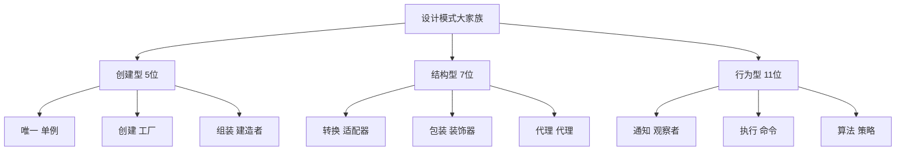

# 模式速记口诀

[[09-学习评测]] ← → 其他模式文档
## 🎯 23种设计模式速记法

### 🔥 分类口诀记忆

#### 创建型模式 (5种)
```
单工建抽原
单例工厂建造抽象原型
```

#### 结构型模式 (7种)  
```
适组装享代
适配组合装饰享元代理
```

#### 行为型模式 (11种)
```
责命解迭调，观状策模访
责任命令解释迭代中介，观察状态策略模板访问
```

## 📸 各模式核心记忆点

### 🏗️ 创建型模式记忆要点

| 模式 | 核心记忆词 | 记忆口诀 |
|------|------------|----------|
|<b>单例模式</b>|唯一<br>控制实例化|"单枪匹马走天下"<br>"保证全局唯一个体"|
|<b>工厂模式</b>|统一创建接口<br>运行时决定|"生产车间统一造"<br>"造什么由客户定"|
|<b>建造者</b>|分步构建<br>复杂对象|"盖房子一步一步来"<br>"建造过程可灵活变"|
|<b>抽象工厂</b>|产品族创建<br>多工厂|"成套定制品总装"<br>"一家人整整齐齐"|
|<b>原型模式</b>|克隆复制<br>成本高|"复制粘贴新个体"<br>"克隆技术显身手"|

### 🔗 结构型模式记忆要点

| 模式 | 核心记忆词 | 记忆口诀 |
|------|------------|----------|
|<b>适配器</b>|接口转换<br>包装|"转换插头兼容用"<br>"包装盒变新接口"|
|<b>装饰器</b>|动态功能增强<br>透明包装|"圣诞树挂装饰球"<br>"包装透明添功能"|
|<b>代理</b>|代理中介<br>访问控制|"经纪人代你办事"<br>"门卫卡你进大楼"|
|<b>外观模式</b>|简化复杂接口<br>门面|"银行大厅一个窗口"<br>"把复杂隐藏后面"|
|<b>组合模式</b>|树形结构<br>递归|"文件夹里装文档"<br>"递归树状组织法"|

### 🎭 行为型模式记忆要点 (按重要性)

| 模式 | 核心记忆词 | 记忆口诀 |
|------|------------|----------|
|<b>观察者</b>|状态变化通知<br>一对多|"消息通知全公司"<br>"电台发布消息"|
|<b>状态模式</b>|行为随状态变<br>状态转换|"不同年龄不同行为"<br>"行为跟随状态走"|
|<b>命令模式</b>|请求封装成对象<br>撤销重做|"遥控器按下按钮"<br>"指令打包送执行"|
|<b>责任链</b>|依次传递处理<br>请求传递|"流程依次审批"<br>"责任推下去"|
|<b>解释器模式</b>|语法解析<br>上下文相关|"翻译官解你语言"<br>"语言翻译机"|
|<b>迭代器</b>|遍历集合<br>统一接口|"导游带领参观"<br>"按门票顺序看"|
|<b>中介者</b>|对象间通信<br>集中管理|"开会作中间人"<br>"对象不用直接聊和"|
|<b>备忘录<br>模式</b>|保存恢复状态<br>快照|"游戏存档读档"<br>"快照还原历史"|
|<b>访问者模式</b>|操作对象结构<br>双重分派|"参观者来访学"<br>"访问遍历对象树"|

## 🧠 联想记忆法

### 📚 场景联想记忆

| 分类 | 记忆场景 | 联想画面 |
|------|----------|----------|
| 创建型模式 | 工厂生产车间 | "工厂里生产各种产品"<br>- 单例是唯一机器<br>- 工厂按订单生产<br>- 建造者组装复杂产品<br>- 抽象工厂生产成套<br>- 原型复制模板 |
| 结构型模式 | 建筑设计施工 | "装修房子改造房间"<br>- 适配器转换接口<br>- 装饰器美化装修<br>- 代理把门安全<br>- 外观简化外观<br>- 组合是家具组合 |
| 行为型模式 | 组织管理团队 | "公司团队协作沟通"<br>- 观察者发通知📢<br>- 状态模式状态管理<br>- 命令就是指令书<br>- 责任链是审批链<br>- 解释器翻译沟通 |

### 🎵 押韵记忆口诀

```
设计模式二十三，创建结构加行为；
五位创建造对象，单工建抽原可记；
七位结构组织好，适组装享代要学；
十一位行为最复杂，观察命令策略多；
设计软件重实践，模式使用见真章！
```

## 🔗 模式关联记忆图



## 🚀 快速复习检查

### ✅ 每日练习建议

| 练习方式 | 具体内容 | 时间要求 |
|----------|----------|----------|
| **晨间回想** | 背诵23种模式名称 | 5分钟 |
| **场景练习** | 给定问题想到对应模式 | 10分钟 |
| **代码复盘** | 回顾昨日代码看是否有模式可应用 | 15分钟 |
| **周末整理** | 整理一周遇到的模式应用案例 | 30分钟 |

### 📝 记忆检验表

- [ ] 23种模式名称能否脱口而出？
- [ ] 5种创建型模式及其用途是否清楚？
- [ ] 7种结构型模式及其关系是否理解？
- [ ] 11种行为型模式的核心思想是否掌握？
- [ ] 能否根据问题快速联想到对应模式？

## 🎯 深入学习建议

### 📈 记忆进阶路径

1. **基础记忆阶段（1周）**
   - 记住23种模式名称和分类
   - 理解每个模式的基本用途

2. **理解深化阶段（2-3周）**
   - 掌握每种模式的结构和实现
   - 理解模式之间的关系

3. **应用实践阶段（1-2个月）**
   - 在实际项目中应用模式
   - 形成模式选择的直觉

4. **融会贯通阶段（持续）**
   - 模式组合使用
   - 创造性的模式应用

## 🔗 学习衔接

- **学习评测** → [[学习评测]]
- **对比总结** → [[模式对比表]]
- **实战应用** → [[实战案例]]

---
**💡 记忆秘诀**：重复是记忆之母，实践是理解之本。通过口诀记住名称，通过应用掌握内涵，通过反思形成直觉。
