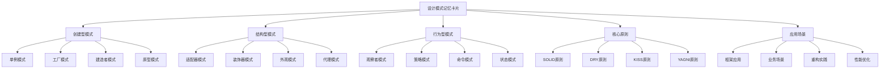

# 🎴 重点模式记忆卡片

[[09-记忆强化/01-设计模式记忆技巧]] ← [[09-记忆强化/03-模式关联记忆图]]
## 🎯 记忆卡片概览

### 📊 卡片分类图



## 🏗️ 创建型模式记忆卡片

### 📋 **单例模式记忆卡片**

#### **🎴 核心概念卡**
```
┌─────────────────────────────────────┐
│           单例模式 (Singleton)        │
├─────────────────────────────────────┤
│ 🎯 目的: 确保一个类只有一个实例        │
│ 🔧 实现: 私有构造函数 + 静态实例        │
│ ⚡ 特点: 全局访问点、延迟初始化         │
│ 🚨 注意: 线程安全、序列化问题          │
│ 💡 记忆: "独一无二"                  │
└─────────────────────────────────────┘
```

#### **🎴 实现方式卡**
```
┌─────────────────────────────────────┐
│         单例模式实现方式              │
├─────────────────────────────────────┤
│ 1️⃣ 懒汉式 (Lazy Loading)            │
│    - 双重检查锁定                    │
│    - 静态内部类                      │
│ 2️⃣ 饿汉式 (Eager Loading)           │
│    - 静态变量初始化                  │
│ 3️⃣ 枚举式 (Enum) ⭐推荐              │
│    - 简洁、线程安全、防反射           │
│ 4️⃣ 函数式 (Java 8+)                 │
│    - Supplier + Lambda              │
└─────────────────────────────────────┘
```

#### **🎴 应用场景卡**
```
┌─────────────────────────────────────┐
│         单例模式应用场景              │
├─────────────────────────────────────┤
│ ✅ 数据库连接池                      │
│ ✅ 配置管理器                        │
│ ✅ 日志记录器                        │
│ ✅ 缓存管理器                        │
│ ✅ 线程池管理器                      │
│ ❌ 避免过度使用                      │
│ ❌ 测试困难                          │
│ ❌ 违反单一职责原则                  │
└─────────────────────────────────────┘
```

### 📋 **工厂模式记忆卡片**

#### **🎴 核心概念卡**
```
┌─────────────────────────────────────┐
│           工厂模式 (Factory)          │
├─────────────────────────────────────┤
│ 🎯 目的: 创建对象而不暴露创建逻辑      │
│ 🔧 实现: 工厂类 + 产品接口            │
│ ⚡ 特点: 解耦、扩展性好               │
│ 🚨 注意: 避免过度设计                │
│ 💡 记忆: "生产车间"                  │
└─────────────────────────────────────┘
```

#### **🎴 类型对比卡**
```
┌─────────────────────────────────────┐
│         工厂模式类型对比              │
├─────────────────────────────────────┤
│ 简单工厂: 一个工厂类创建所有产品        │
│ 工厂方法: 每个产品对应一个工厂         │
│ 抽象工厂: 创建产品族                  │
│ 静态工厂: 静态方法创建对象             │
│ 函数式工厂: Lambda + Map              │
└─────────────────────────────────────┘
```

#### **🎴 代码模板卡**
```java
// ✅ 工厂模式代码模板
public interface Product {
    void doSomething();
}

public class ConcreteProduct implements Product {
    @Override
    public void doSomething() {
        System.out.println("Product doing something");
    }
}

public class ProductFactory {
    public Product createProduct(String type) {
        switch (type) {
            case "A": return new ConcreteProductA();
            case "B": return new ConcreteProductB();
            default: throw new IllegalArgumentException("Unknown type");
        }
    }
}
```

### 📋 **建造者模式记忆卡片**

#### **🎴 核心概念卡**
```
┌─────────────────────────────────────┐
│         建造者模式 (Builder)          │
├─────────────────────────────────────┤
│ 🎯 目的: 分步构建复杂对象              │
│ 🔧 实现: Builder类 + 链式调用         │
│ ⚡ 特点: 灵活、可读性好               │
│ 🚨 注意: 代码量增加                  │
│ 💡 记忆: "搭积木"                    │
└─────────────────────────────────────┘
```

#### **🎴 适用场景卡**
```
┌─────────────────────────────────────┐
│         建造者模式适用场景            │
├─────────────────────────────────────┤
│ ✅ 参数很多的对象                     │
│ ✅ 需要分步构建                      │
│ ✅ 构建过程复杂                      │
│ ✅ 需要链式调用                      │
│ ❌ 简单对象不需要                    │
│ ❌ 参数固定不需要                    │
└─────────────────────────────────────┘
```

## 🏗️ 结构型模式记忆卡片

### 📋 **适配器模式记忆卡片**

#### **🎴 核心概念卡**
```
┌─────────────────────────────────────┐
│         适配器模式 (Adapter)          │
├─────────────────────────────────────┤
│ 🎯 目的: 让不兼容的接口协同工作        │
│ 🔧 实现: 适配器类 + 目标接口          │
│ ⚡ 特点: 解耦、复用现有代码           │
│ 🚨 注意: 不要过度使用                │
│ 💡 记忆: "转接头"                    │
└─────────────────────────────────────┘
```

#### **🎴 类型对比卡**
```
┌─────────────────────────────────────┐
│         适配器模式类型                │
├─────────────────────────────────────┤
│ 类适配器: 继承 + 实现                 │
│ 对象适配器: 组合 + 实现 ⭐推荐        │
│ 接口适配器: 空实现 + 选择性重写        │
└─────────────────────────────────────┘
```

### 📋 **装饰器模式记忆卡片**

#### **🎴 核心概念卡**
```
┌─────────────────────────────────────┐
│         装饰器模式 (Decorator)        │
├─────────────────────────────────────┤
│ 🎯 目的: 动态添加功能而不改变结构      │
│ 🔧 实现: 装饰器类 + 被装饰对象         │
│ ⚡ 特点: 灵活、透明、可组合           │
│ 🚨 注意: 装饰器链过长                │
│ 💡 记忆: "包装纸"                    │
└─────────────────────────────────────┘
```

#### **🎴 与代理模式对比卡**
```
┌─────────────────────────────────────┐
│       装饰器 vs 代理模式              │
├─────────────────────────────────────┤
│ 装饰器: 增强功能、透明装饰            │
│ 代理: 控制访问、非透明代理            │
│ 装饰器: 可以多层装饰                  │
│ 代理: 通常单层代理                    │
│ 装饰器: 运行时决定                    │
│ 代理: 编译时决定                      │
└─────────────────────────────────────┘
```

### 📋 **外观模式记忆卡片**

#### **🎴 核心概念卡**
```
┌─────────────────────────────────────┐
│           外观模式 (Facade)           │
├─────────────────────────────────────┤
│ 🎯 目的: 为复杂子系统提供简单接口      │
│ 🔧 实现: 外观类 + 子系统              │
│ ⚡ 特点: 简化接口、降低耦合           │
│ 🚨 注意: 不要成为上帝类              │
│ 💡 记忆: "门面"                      │
└─────────────────────────────────────┘
```

## 🏗️ 行为型模式记忆卡片

### 📋 **观察者模式记忆卡片**

#### **🎴 核心概念卡**
```
┌─────────────────────────────────────┐
│         观察者模式 (Observer)         │
├─────────────────────────────────────┤
│ 🎯 目的: 定义对象间一对多依赖关系      │
│ 🔧 实现: 主题 + 观察者接口            │
│ ⚡ 特点: 解耦、支持广播通信           │
│ 🚨 注意: 内存泄漏、循环依赖          │
│ 💡 记忆: "订阅通知"                  │
└─────────────────────────────────────┘
```

#### **🎴 现代变种卡**
```
┌─────────────────────────────────────┐
│         观察者模式现代变种            │
├─────────────────────────────────────┤
│ 事件驱动: Event + Listener            │
│ 响应式: Reactive Streams             │
│ 发布订阅: Publisher + Subscriber      │
│ 消息队列: Message Queue              │
└─────────────────────────────────────┘
```

### 📋 **策略模式记忆卡片**

#### **🎴 核心概念卡**
```
┌─────────────────────────────────────┐
│           策略模式 (Strategy)         │
├─────────────────────────────────────┤
│ 🎯 目的: 定义算法族并使其可互换        │
│ 🔧 实现: 策略接口 + 具体策略          │
│ ⚡ 特点: 算法独立、易于扩展           │
│ 🚨 注意: 策略类数量增加              │
│ 💡 记忆: "算法选择器"                │
└─────────────────────────────────────┘
```

#### **🎴 与状态模式对比卡**
```
┌─────────────────────────────────────┐
│       策略 vs 状态模式                │
├─────────────────────────────────────┤
│ 策略: 算法选择、无状态转换            │
│ 状态: 状态转换、有状态变化            │
│ 策略: 客户端选择策略                  │
│ 状态: 状态自动转换                   │
│ 策略: 算法可独立使用                  │
│ 状态: 状态间有依赖关系                │
└─────────────────────────────────────┘
```

### 📋 **命令模式记忆卡片**

#### **🎴 核心概念卡**
```
┌─────────────────────────────────────┐
│           命令模式 (Command)          │
├─────────────────────────────────────┤
│ 🎯 目的: 将请求封装为对象             │
│ 🔧 实现: 命令接口 + 具体命令          │
│ ⚡ 特点: 支持撤销、宏命令             │
│ 🚨 注意: 命令类数量增加              │
│ 💡 记忆: "遥控器"                    │
└─────────────────────────────────────┘
```

#### **🎴 应用场景卡**
```
┌─────────────────────────────────────┐
│         命令模式应用场景              │
├─────────────────────────────────────┤
│ ✅ 撤销/重做功能                     │
│ ✅ 宏命令                           │
│ ✅ 队列请求                         │
│ ✅ 日志记录                         │
│ ✅ 事务处理                         │
└─────────────────────────────────────┘
```

## 🏗️ 核心原则记忆卡片

### 📋 **SOLID原则记忆卡片**

#### **🎴 SOLID原则总览卡**
```
┌─────────────────────────────────────┐
│            SOLID原则                 │
├─────────────────────────────────────┤
│ S - 单一职责原则 (SRP)                │
│ O - 开闭原则 (OCP)                   │
│ L - 里氏替换原则 (LSP)               │
│ I - 接口隔离原则 (ISP)                │
│ D - 依赖倒置原则 (DIP)                │
└─────────────────────────────────────┘
```

#### **🎴 单一职责原则卡**
```
┌─────────────────────────────────────┐
│         单一职责原则 (SRP)            │
├─────────────────────────────────────┤
│ 🎯 定义: 一个类只有一个变化原因        │
│ 🔧 实现: 职责分离、类拆分            │
│ ⚡ 好处: 高内聚、低耦合               │
│ 🚨 注意: 不要过度拆分                │
│ 💡 记忆: "专一"                      │
└─────────────────────────────────────┘
```

#### **🎴 开闭原则卡**
```
┌─────────────────────────────────────┐
│           开闭原则 (OCP)              │
├─────────────────────────────────────┤
│ 🎯 定义: 对扩展开放，对修改关闭        │
│ 🔧 实现: 抽象、多态、继承            │
│ ⚡ 好处: 易于扩展、稳定               │
│ 🚨 注意: 不要过度抽象                │
│ 💡 记忆: "开放封闭"                  │
└─────────────────────────────────────┘
```

## 🏗️ 应用场景记忆卡片

### 📋 **框架应用记忆卡片**

#### **🎴 Spring框架模式卡**
```
┌─────────────────────────────────────┐
│          Spring框架模式              │
├─────────────────────────────────────┤
│ 依赖注入: 控制反转 (IoC)              │
│ AOP: 代理模式 + 装饰器模式            │
│ JdbcTemplate: 模板方法模式           │
│ BeanFactory: 工厂模式               │
│ ApplicationContext: 外观模式        │
└─────────────────────────────────────┘
```

#### **🎴 MyBatis框架模式卡**
```
┌─────────────────────────────────────┐
│          MyBatis框架模式             │
├─────────────────────────────────────┤
│ Mapper代理: 代理模式                 │
│ SqlSessionFactory: 建造者模式        │
│ ResultSetHandler: 策略模式           │
│ TypeHandler: 策略模式                │
└─────────────────────────────────────┘
```

### 📋 **业务场景记忆卡片**

#### **🎴 电商系统模式卡**
```
┌─────────────────────────────────────┐
│           电商系统模式                │
├─────────────────────────────────────┤
│ 商品管理: 工厂模式                   │
│ 价格计算: 策略模式                   │
│ 购物车: 观察者模式                   │
│ 订单处理: 状态模式                   │
│ 支付流程: 命令模式                   │
└─────────────────────────────────────┘
```

#### **🎴 金融系统模式卡**
```
┌─────────────────────────────────────┐
│           金融系统模式                │
├─────────────────────────────────────┤
│ 账户管理: 状态模式                   │
│ 交易处理: 命令模式                   │
│ 风险控制: 责任链模式                 │
│ 报表生成: 模板方法模式               │
└─────────────────────────────────────┘
```

## 🎯 记忆技巧总结

### 📋 **记忆方法**

1. **形象记忆**: 用生活中的例子理解模式
2. **对比记忆**: 对比相似模式的区别
3. **场景记忆**: 结合实际应用场景
4. **代码记忆**: 通过代码模板加深印象
5. **原则记忆**: 理解设计原则的核心理念

### 📋 **复习建议**

1. **每日一卡**: 每天复习一张记忆卡片
2. **分类复习**: 按模式类型分类复习
3. **场景联想**: 结合实际项目场景
4. **代码实践**: 动手实现模式代码
5. **定期回顾**: 定期回顾和总结

## 🔗 学习衔接

- **上一文档** ← [[设计模式记忆技巧]]
- **下一文档** → [[模式关联记忆图]]
- **模式基础** → [[01-基础认知]]

---
**💡 记忆卡片精髓**: 记忆卡片就像知识的地图，帮助我们快速定位和理解设计模式的核心概念。通过反复复习这些卡片，我们可以将设计模式的知识深深印在脑海中，在实际应用中能够快速准确地选择合适的模式！
