# 🧠 模式关联记忆图

[[09-记忆强化/02-重点模式记忆卡片]] ← [[09-记忆强化/04-快速复习检查清单]]
## 🎯 关联记忆概览

### 📊 模式关联网络图

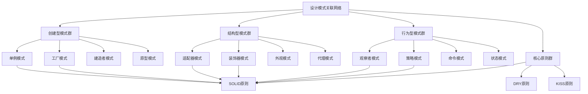

## 🏗️ 创建型模式关联图

### 📋 **单例模式关联网络**

#### **🔗 直接关联**
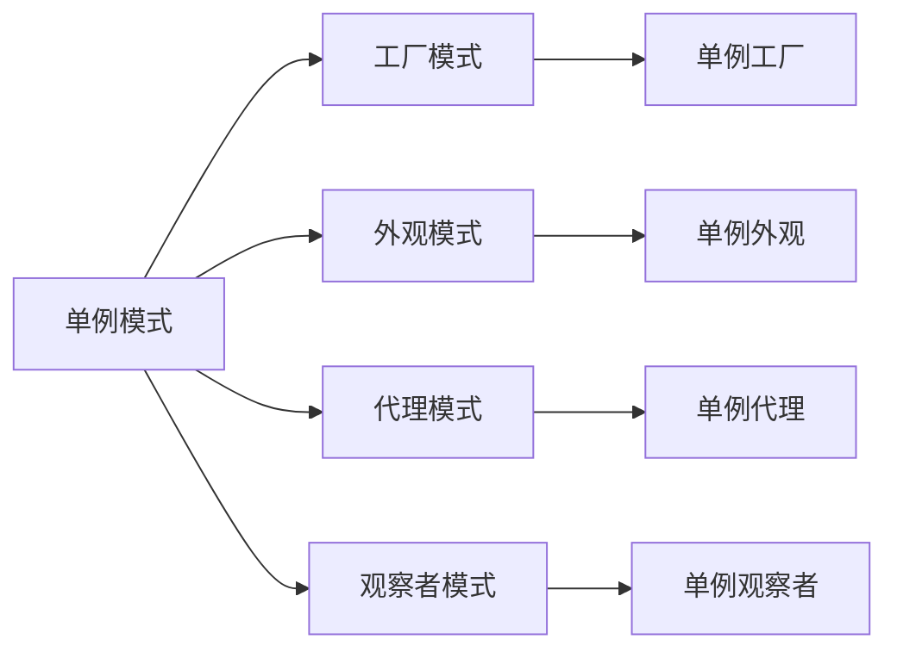

#### **🎯 关联场景**
- **单例 + 工厂**: 单例工厂确保全局唯一的工厂实例
- **单例 + 外观**: 单例外观为复杂子系统提供统一入口
- **单例 + 代理**: 单例代理控制对单例对象的访问
- **单例 + 观察者**: 单例观察者管理全局事件通知

#### **💡 记忆口诀**
```
单例工厂造万物，外观代理控全局
观察者模式通知，单例确保唯一性
```

### 📋 **工厂模式关联网络**

#### **🔗 直接关联**
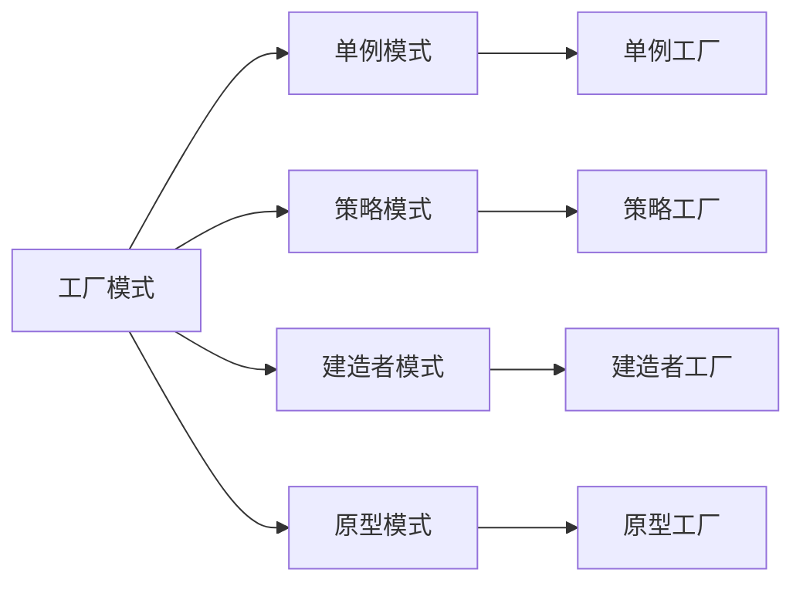

#### **🎯 关联场景**
- **工厂 + 单例**: 单例工厂管理全局工厂实例
- **工厂 + 策略**: 工厂根据策略创建不同产品
- **工厂 + 建造者**: 工厂使用建造者构建复杂对象
- **工厂 + 原型**: 工厂使用原型克隆对象

#### **💡 记忆口诀**
```
工厂模式造产品，单例策略来配合
建造原型齐上阵，对象创建更灵活
```

## 🏗️ 结构型模式关联图

### 📋 **适配器模式关联网络**

#### **🔗 直接关联**
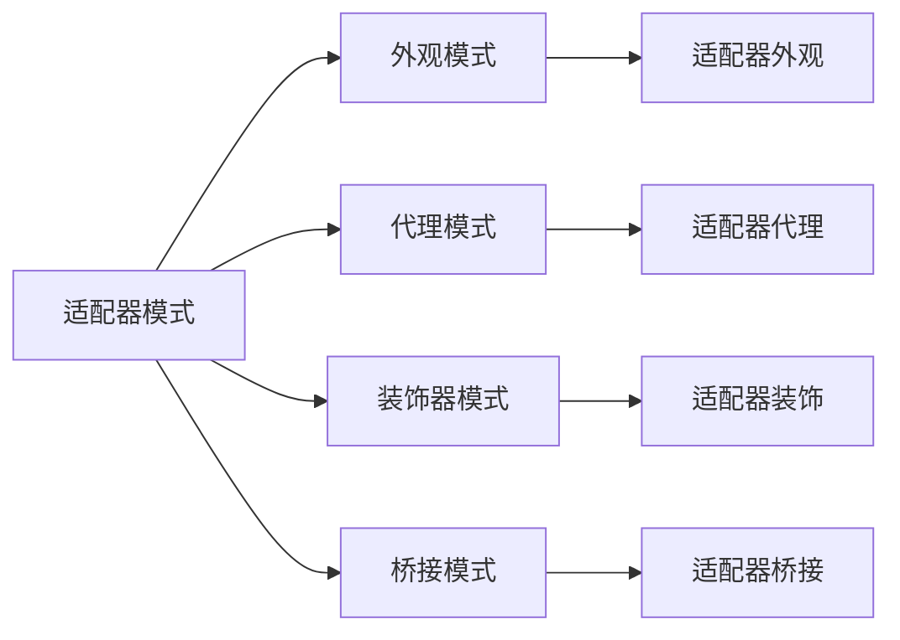

#### **🎯 关联场景**
- **适配器 + 外观**: 适配器适配接口，外观简化调用
- **适配器 + 代理**: 适配器转换接口，代理控制访问
- **适配器 + 装饰器**: 适配器适配接口，装饰器增强功能
- **适配器 + 桥接**: 适配器适配接口，桥接分离抽象和实现

#### **💡 记忆口诀**
```
适配器模式转接口，外观代理来配合
装饰桥接齐上阵，接口转换更灵活
```

### 📋 **装饰器模式关联网络**

#### **🔗 直接关联**
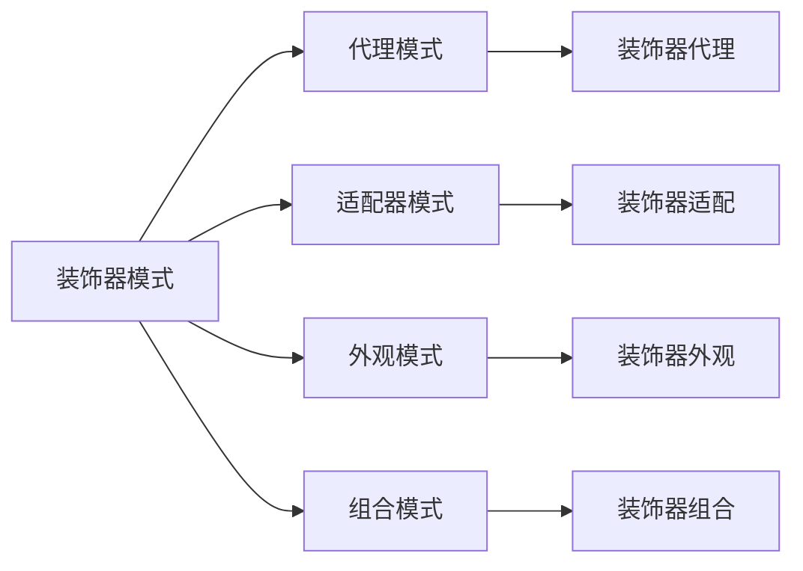

#### **🎯 关联场景**
- **装饰器 + 代理**: 装饰器增强功能，代理控制访问
- **装饰器 + 适配器**: 装饰器增强功能，适配器转换接口
- **装饰器 + 外观**: 装饰器增强功能，外观简化接口
- **装饰器 + 组合**: 装饰器增强功能，组合构建树形结构

#### **💡 记忆口诀**
```
装饰器模式增功能，代理适配来配合
外观组合齐上阵，功能增强更灵活
```

## 🏗️ 行为型模式关联图

### 📋 **观察者模式关联网络**

#### **🔗 直接关联**
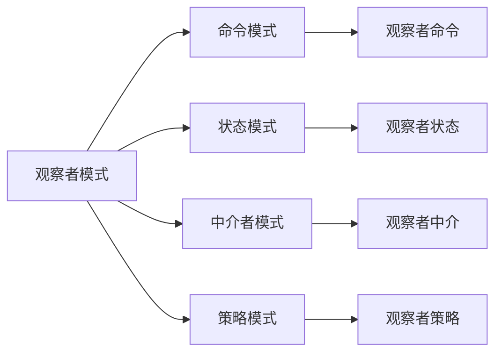

#### **🎯 关联场景**
- **观察者 + 命令**: 观察者监听事件，命令执行操作
- **观察者 + 状态**: 观察者监听状态变化，状态模式管理状态
- **观察者 + 中介者**: 观察者监听事件，中介者协调对象
- **观察者 + 策略**: 观察者监听事件，策略模式选择算法

#### **💡 记忆口诀**
```
观察者模式监听，命令状态来配合
中介策略齐上阵，事件驱动更灵活
```

### 📋 **策略模式关联网络**

#### **🔗 直接关联**
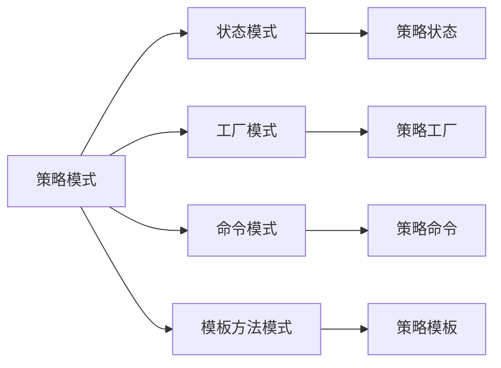

#### **🎯 关联场景**
- **策略 + 状态**: 策略选择算法，状态管理状态转换
- **策略 + 工厂**: 策略选择算法，工厂创建对象
- **策略 + 命令**: 策略选择算法，命令封装操作
- **策略 + 模板方法**: 策略选择算法，模板方法定义框架

#### **💡 记忆口诀**
```
策略模式选算法，状态工厂来配合
命令模板齐上阵，算法选择更灵活
```

## 🏗️ 跨类型模式关联图

### 📋 **核心模式关联网络**

#### **🔗 核心关联**
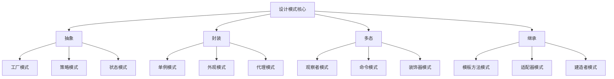

#### **🎯 关联原理**
- **抽象**: 工厂、策略、状态模式都依赖抽象
- **封装**: 单例、外观、代理模式都强调封装
- **多态**: 观察者、命令、装饰器模式都利用多态
- **继承**: 模板方法、适配器、建造者模式都使用继承

### 📋 **SOLID原则关联网络**

#### **🔗 原则关联**
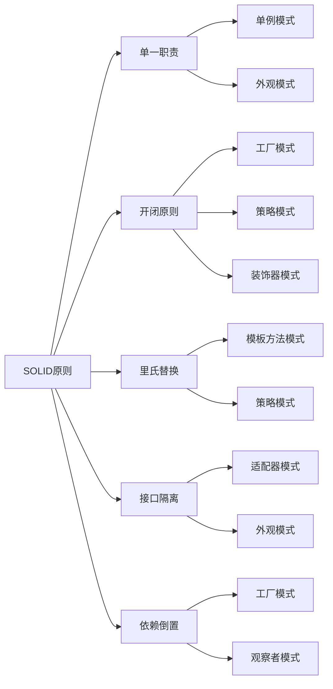

#### **🎯 原则应用**
- **SRP**: 单例、外观模式遵循单一职责
- **OCP**: 工厂、策略、装饰器模式支持扩展
- **LSP**: 模板方法、策略模式支持替换
- **ISP**: 适配器、外观模式隔离接口
- **DIP**: 工厂、观察者模式依赖抽象

## 🏗️ 实际应用关联图

### 📋 **框架应用关联网络**

#### **🔗 框架模式关联**
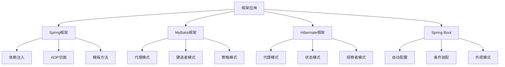

#### **🎯 框架特点**
- **Spring**: 依赖注入、AOP、模板方法
- **MyBatis**: 代理模式、建造者模式、策略模式
- **Hibernate**: 代理模式、状态模式、观察者模式
- **Spring Boot**: 自动配置、条件装配、外观模式

### 📋 **业务场景关联网络**

#### **🔗 业务模式关联**
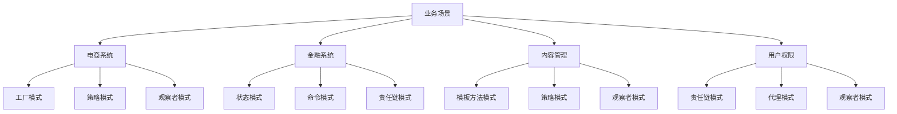

#### **🎯 业务特点**
- **电商系统**: 工厂、策略、观察者模式
- **金融系统**: 状态、命令、责任链模式
- **内容管理**: 模板方法、策略、观察者模式
- **用户权限**: 责任链、代理、观察者模式

## 🎯 关联记忆技巧

### 📋 **记忆方法**

1. **网络记忆**: 将模式看作网络节点，理解关联关系
2. **场景记忆**: 结合实际应用场景理解关联
3. **对比记忆**: 对比相似模式的区别和联系
4. **原则记忆**: 从设计原则角度理解模式关联
5. **实践记忆**: 通过实际项目加深关联理解

### 📋 **复习策略**

1. **分类复习**: 按模式类型分类复习关联
2. **场景复习**: 按应用场景复习关联
3. **原则复习**: 按设计原则复习关联
4. **对比复习**: 对比相似模式的关联
5. **实践复习**: 通过实际项目复习关联

### 📋 **记忆口诀**

```
创建型模式造对象，结构型模式搭框架
行为型模式管流程，SOLID原则是基础
框架应用显威力，业务场景见真章
模式关联要理解，实际应用更灵活
```

## 🔗 学习衔接

- **上一文档** ← [[重点模式记忆卡片]]
- **下一文档** → [[快速复习检查清单]]
- **模式基础** → [[01-基础认知]]

---
**💡 关联记忆精髓**: 设计模式不是孤立存在的，它们之间有着密切的关联关系。理解这些关联关系，就像掌握了知识的地图，能够帮助我们更好地选择和应用设计模式，构建出更加优雅和灵活的软件架构！
