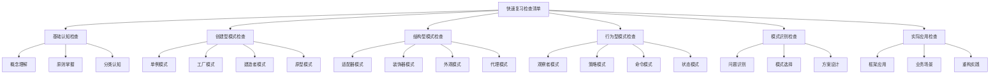

# ✅ 快速复习检查清单

[[09-记忆强化/03-模式关联记忆图]] ← [[10-学习评测]]
## 🎯 复习检查概览

### 📊 检查清单结构图

## 🏗️ 基础认知检查清单

### 📋 **概念理解检查**

#### **✅ 设计模式基础概念**
- [ ] 能够准确定义什么是设计模式
- [ ] 理解设计模式的三大分类（创建型、结构型、行为型）
- [ ] 知道设计模式的核心价值（可复用、可维护、可扩展）
- [ ] 理解设计模式与设计原则的关系
- [ ] 能够区分设计模式与反模式

#### **✅ 设计原则掌握**
- [ ] 能够完整说出SOLID原则的五个原则
- [ ] 理解单一职责原则（SRP）的核心思想
- [ ] 理解开闭原则（OCP）的扩展开放、修改关闭
- [ ] 理解里氏替换原则（LSP）的子类替换父类
- [ ] 理解接口隔离原则（ISP）的接口最小化
- [ ] 理解依赖倒置原则（DIP）的依赖抽象
- [ ] 知道DRY、KISS、YAGNI等辅助原则

#### **✅ 模式分类认知**
- [ ] 能够准确分类23种GoF设计模式
- [ ] 理解创建型模式解决对象创建问题
- [ ] 理解结构型模式解决对象组合问题
- [ ] 理解行为型模式解决对象交互问题
- [ ] 知道每种模式的基本结构和实现方式

### 📋 **记忆技巧检查**

#### **✅ 模式记忆方法**
- [ ] 能够用生活例子解释每种模式
- [ ] 知道每种模式的核心记忆点
- [ ] 能够快速回忆模式的适用场景
- [ ] 知道模式之间的关联关系
- [ ] 能够区分相似模式的区别

## 🏗️ 创建型模式检查清单

### 📋 **单例模式检查**

#### **✅ 核心概念**
- [ ] 能够准确定义单例模式的目的
- [ ] 理解单例模式确保一个类只有一个实例
- [ ] 知道单例模式提供全局访问点
- [ ] 理解单例模式的延迟初始化特性

#### **✅ 实现方式**
- [ ] 知道懒汉式单例的实现方式
- [ ] 知道饿汉式单例的实现方式
- [ ] 理解双重检查锁定单例的实现
- [ ] 知道静态内部类单例的实现
- [ ] 理解枚举单例的优势（推荐方式）
- [ ] 知道Java 8+函数式单例的实现

#### **✅ 应用场景**
- [ ] 知道数据库连接池使用单例模式
- [ ] 知道配置管理器使用单例模式
- [ ] 知道日志记录器使用单例模式
- [ ] 知道缓存管理器使用单例模式
- [ ] 知道线程池管理器使用单例模式

#### **✅ 注意事项**
- [ ] 知道单例模式的线程安全问题
- [ ] 理解单例模式的序列化问题
- [ ] 知道单例模式违反单一职责原则
- [ ] 理解单例模式使测试变得困难
- [ ] 知道避免过度使用单例模式

### 📋 **工厂模式检查**

#### **✅ 核心概念**
- [ ] 能够准确定义工厂模式的目的
- [ ] 理解工厂模式创建对象而不暴露创建逻辑
- [ ] 知道工厂模式解耦对象创建和使用
- [ ] 理解工厂模式支持扩展新产品

#### **✅ 类型区分**
- [ ] 能够区分简单工厂、工厂方法、抽象工厂
- [ ] 理解简单工厂的优缺点
- [ ] 理解工厂方法的扩展性
- [ ] 理解抽象工厂的产品族概念
- [ ] 知道静态工厂和函数式工厂的实现

#### **✅ 应用场景**
- [ ] 知道框架中大量使用工厂模式
- [ ] 理解Spring的BeanFactory是工厂模式
- [ ] 知道MyBatis的SqlSessionFactory是工厂模式
- [ ] 理解业务系统中产品创建使用工厂模式

#### **✅ 代码实现**
- [ ] 能够手写简单工厂模式代码
- [ ] 能够手写工厂方法模式代码
- [ ] 能够手写抽象工厂模式代码
- [ ] 知道工厂模式的代码模板

### 📋 **建造者模式检查**

#### **✅ 核心概念**
- [ ] 能够准确定义建造者模式的目的
- [ ] 理解建造者模式分步构建复杂对象
- [ ] 知道建造者模式支持链式调用
- [ ] 理解建造者模式的可读性优势

#### **✅ 实现方式**
- [ ] 知道建造者模式的基本结构
- [ ] 理解建造者模式的链式调用实现
- [ ] 知道建造者模式的静态内部类实现
- [ ] 理解建造者模式的代码模板

#### **✅ 应用场景**
- [ ] 知道参数很多的对象使用建造者模式
- [ ] 知道需要分步构建的对象使用建造者模式
- [ ] 知道构建过程复杂的对象使用建造者模式
- [ ] 理解建造者模式与工厂模式的区别

#### **✅ 注意事项**
- [ ] 知道建造者模式会增加代码量
- [ ] 理解简单对象不需要建造者模式
- [ ] 知道参数固定的对象不需要建造者模式

### 📋 **原型模式检查**

#### **✅ 核心概念**
- [ ] 能够准确定义原型模式的目的
- [ ] 理解原型模式通过克隆创建对象
- [ ] 知道原型模式支持深拷贝和浅拷贝
- [ ] 理解原型模式的性能优势

#### **✅ 实现方式**
- [ ] 知道Java的Cloneable接口实现
- [ ] 理解深拷贝和浅拷贝的区别
- [ ] 知道原型模式的代码模板
- [ ] 理解原型模式的注意事项

#### **✅ 应用场景**
- [ ] 知道创建对象成本高时使用原型模式
- [ ] 知道需要大量相似对象时使用原型模式
- [ ] 理解原型模式与工厂模式的区别

## 🏗️ 结构型模式检查清单

### 📋 **适配器模式检查**

#### **✅ 核心概念**
- [ ] 能够准确定义适配器模式的目的
- [ ] 理解适配器模式让不兼容的接口协同工作
- [ ] 知道适配器模式解耦现有代码
- [ ] 理解适配器模式的复用性

#### **✅ 实现方式**
- [ ] 知道类适配器的实现方式
- [ ] 知道对象适配器的实现方式（推荐）
- [ ] 知道接口适配器的实现方式
- [ ] 理解适配器模式的代码模板

#### **✅ 应用场景**
- [ ] 知道集成第三方库时使用适配器模式
- [ ] 知道系统升级时使用适配器模式
- [ ] 知道接口不兼容时使用适配器模式
- [ ] 理解适配器模式与装饰器模式的区别

#### **✅ 注意事项**
- [ ] 知道不要过度使用适配器模式
- [ ] 理解适配器模式会增加系统复杂度
- [ ] 知道适配器模式不是长期解决方案

### 📋 **装饰器模式检查**

#### **✅ 核心概念**
- [ ] 能够准确定义装饰器模式的目的
- [ ] 理解装饰器模式动态添加功能而不改变结构
- [ ] 知道装饰器模式支持透明装饰
- [ ] 理解装饰器模式的可组合性

#### **✅ 实现方式**
- [ ] 知道装饰器模式的基本结构
- [ ] 理解装饰器模式的链式调用
- [ ] 知道装饰器模式的代码模板
- [ ] 理解装饰器模式的透明性

#### **✅ 应用场景**
- [ ] 知道需要动态添加功能时使用装饰器模式
- [ ] 知道需要透明装饰时使用装饰器模式
- [ ] 知道需要组合功能时使用装饰器模式
- [ ] 理解装饰器模式与代理模式的区别

#### **✅ 注意事项**
- [ ] 知道装饰器链过长会增加复杂度
- [ ] 理解装饰器模式会增加对象数量
- [ ] 知道装饰器模式与继承的区别

### 📋 **外观模式检查**

#### **✅ 核心概念**
- [ ] 能够准确定义外观模式的目的
- [ ] 理解外观模式为复杂子系统提供简单接口
- [ ] 知道外观模式简化客户端调用
- [ ] 理解外观模式的封装性

#### **✅ 实现方式**
- [ ] 知道外观模式的基本结构
- [ ] 理解外观模式的代码模板
- [ ] 知道外观模式的实现要点
- [ ] 理解外观模式的封装原则

#### **✅ 应用场景**
- [ ] 知道复杂子系统需要简化接口时使用外观模式
- [ ] 知道需要降低系统耦合时使用外观模式
- [ ] 知道需要统一接口时使用外观模式
- [ ] 理解外观模式与适配器模式的区别

#### **✅ 注意事项**
- [ ] 知道不要将外观模式变成上帝类
- [ ] 理解外观模式会增加系统层次
- [ ] 知道外观模式与代理模式的区别

### 📋 **代理模式检查**

#### **✅ 核心概念**
- [ ] 能够准确定义代理模式的目的
- [ ] 理解代理模式为其他对象提供代理以控制访问
- [ ] 知道代理模式支持延迟加载
- [ ] 理解代理模式的访问控制

#### **✅ 实现方式**
- [ ] 知道静态代理的实现方式
- [ ] 知道动态代理的实现方式
- [ ] 知道代理模式的代码模板
- [ ] 理解代理模式的透明性

#### **✅ 应用场景**
- [ ] 知道需要控制访问时使用代理模式
- [ ] 知道需要延迟加载时使用代理模式
- [ ] 知道需要增强功能时使用代理模式
- [ ] 理解代理模式与装饰器模式的区别

#### **✅ 注意事项**
- [ ] 知道代理模式会增加系统复杂度
- [ ] 理解代理模式与装饰器模式的区别
- [ ] 知道代理模式与外观模式的区别

## 🏗️ 行为型模式检查清单

### 📋 **观察者模式检查**

#### **✅ 核心概念**
- [ ] 能够准确定义观察者模式的目的
- [ ] 理解观察者模式定义对象间一对多依赖关系
- [ ] 知道观察者模式支持广播通信
- [ ] 理解观察者模式的解耦性

#### **✅ 实现方式**
- [ ] 知道观察者模式的基本结构
- [ ] 理解观察者模式的代码模板
- [ ] 知道观察者模式的实现要点
- [ ] 理解观察者模式的现代变种

#### **✅ 应用场景**
- [ ] 知道需要事件通知时使用观察者模式
- [ ] 知道需要解耦对象时使用观察者模式
- [ ] 知道需要广播通信时使用观察者模式
- [ ] 理解观察者模式与发布订阅模式的关系

#### **✅ 注意事项**
- [ ] 知道观察者模式可能导致内存泄漏
- [ ] 理解观察者模式可能导致循环依赖
- [ ] 知道观察者模式与中介者模式的区别

### 📋 **策略模式检查**

#### **✅ 核心概念**
- [ ] 能够准确定义策略模式的目的
- [ ] 理解策略模式定义算法族并使其可互换
- [ ] 知道策略模式支持算法独立
- [ ] 理解策略模式的扩展性

#### **✅ 实现方式**
- [ ] 知道策略模式的基本结构
- [ ] 理解策略模式的代码模板
- [ ] 知道策略模式的实现要点
- [ ] 理解策略模式的现代实现

#### **✅ 应用场景**
- [ ] 知道需要算法选择时使用策略模式
- [ ] 知道需要算法扩展时使用策略模式
- [ ] 知道需要算法独立时使用策略模式
- [ ] 理解策略模式与状态模式的区别

#### **✅ 注意事项**
- [ ] 知道策略模式会增加策略类数量
- [ ] 理解策略模式与状态模式的区别
- [ ] 知道策略模式与工厂模式的区别

### 📋 **命令模式检查**

#### **✅ 核心概念**
- [ ] 能够准确定义命令模式的目的
- [ ] 理解命令模式将请求封装为对象
- [ ] 知道命令模式支持撤销操作
- [ ] 理解命令模式的宏命令特性

#### **✅ 实现方式**
- [ ] 知道命令模式的基本结构
- [ ] 理解命令模式的代码模板
- [ ] 知道命令模式的实现要点
- [ ] 理解命令模式的撤销实现

#### **✅ 应用场景**
- [ ] 知道需要撤销重做时使用命令模式
- [ ] 知道需要宏命令时使用命令模式
- [ ] 知道需要队列请求时使用命令模式
- [ ] 知道需要日志记录时使用命令模式

#### **✅ 注意事项**
- [ ] 知道命令模式会增加命令类数量
- [ ] 理解命令模式与策略模式的区别
- [ ] 知道命令模式与观察者模式的区别

### 📋 **状态模式检查**

#### **✅ 核心概念**
- [ ] 能够准确定义状态模式的目的
- [ ] 理解状态模式允许对象在内部状态改变时改变行为
- [ ] 知道状态模式支持状态转换
- [ ] 理解状态模式的状态管理

#### **✅ 实现方式**
- [ ] 知道状态模式的基本结构
- [ ] 理解状态模式的代码模板
- [ ] 知道状态模式的实现要点
- [ ] 理解状态模式的状态转换

#### **✅ 应用场景**
- [ ] 知道需要状态管理时使用状态模式
- [ ] 知道需要状态转换时使用状态模式
- [ ] 知道需要行为变化时使用状态模式
- [ ] 理解状态模式与策略模式的区别

#### **✅ 注意事项**
- [ ] 知道状态模式会增加状态类数量
- [ ] 理解状态模式与策略模式的区别
- [ ] 知道状态模式的状态转换复杂性

## 🏗️ 模式识别检查清单

### 📋 **问题识别检查**

#### **✅ 代码异味识别**
- [ ] 能够识别长方法问题
- [ ] 能够识别大类问题
- [ ] 能够识别重复代码问题
- [ ] 能够识别紧耦合问题
- [ ] 能够识别低内聚问题

#### **✅ 设计缺陷识别**
- [ ] 能够识别循环依赖问题
- [ ] 能够识别上帝类问题
- [ ] 能够识别接口污染问题
- [ ] 能够识别过度设计问题
- [ ] 能够识别违反SOLID原则问题

#### **✅ 性能问题识别**
- [ ] 能够识别性能瓶颈
- [ ] 能够识别内存泄漏
- [ ] 能够识别资源浪费
- [ ] 能够识别并发问题
- [ ] 能够识别扩展性问题

### 📋 **模式选择检查**

#### **✅ 创建型模式选择**
- [ ] 知道何时选择单例模式
- [ ] 知道何时选择工厂模式
- [ ] 知道何时选择建造者模式
- [ ] 知道何时选择原型模式
- [ ] 理解创建型模式的选择原则

#### **✅ 结构型模式选择**
- [ ] 知道何时选择适配器模式
- [ ] 知道何时选择装饰器模式
- [ ] 知道何时选择外观模式
- [ ] 知道何时选择代理模式
- [ ] 理解结构型模式的选择原则

#### **✅ 行为型模式选择**
- [ ] 知道何时选择观察者模式
- [ ] 知道何时选择策略模式
- [ ] 知道何时选择命令模式
- [ ] 知道何时选择状态模式
- [ ] 理解行为型模式的选择原则

### 📋 **方案设计检查**

#### **✅ 架构设计**
- [ ] 能够设计合理的架构
- [ ] 能够选择合适的模式组合
- [ ] 能够考虑系统的扩展性
- [ ] 能够考虑系统的维护性
- [ ] 能够考虑系统的性能

#### **✅ 代码实现**
- [ ] 能够实现模式代码
- [ ] 能够遵循编码规范
- [ ] 能够考虑代码的可读性
- [ ] 能够考虑代码的可测试性
- [ ] 能够考虑代码的可维护性

## 🏗️ 实际应用检查清单

### 📋 **框架应用检查**

#### **✅ Spring框架应用**
- [ ] 理解Spring的依赖注入模式
- [ ] 理解Spring的AOP切面模式
- [ ] 理解Spring的模板方法模式
- [ ] 理解Spring的工厂模式
- [ ] 理解Spring的代理模式

#### **✅ MyBatis框架应用**
- [ ] 理解MyBatis的代理模式
- [ ] 理解MyBatis的建造者模式
- [ ] 理解MyBatis的策略模式
- [ ] 理解MyBatis的模板方法模式
- [ ] 理解MyBatis的适配器模式

#### **✅ Hibernate框架应用**
- [ ] 理解Hibernate的代理模式
- [ ] 理解Hibernate的状态模式
- [ ] 理解Hibernate的策略模式
- [ ] 理解Hibernate的观察者模式
- [ ] 理解Hibernate的工厂模式

### 📋 **业务场景检查**

#### **✅ 电商系统应用**
- [ ] 理解电商系统的工厂模式应用
- [ ] 理解电商系统的策略模式应用
- [ ] 理解电商系统的观察者模式应用
- [ ] 理解电商系统的状态模式应用
- [ ] 理解电商系统的命令模式应用

#### **✅ 金融系统应用**
- [ ] 理解金融系统的状态模式应用
- [ ] 理解金融系统的命令模式应用
- [ ] 理解金融系统的责任链模式应用
- [ ] 理解金融系统的模板方法模式应用
- [ ] 理解金融系统的代理模式应用

#### **✅ 内容管理系统应用**
- [ ] 理解内容管理系统的模板方法模式应用
- [ ] 理解内容管理系统的策略模式应用
- [ ] 理解内容管理系统的观察者模式应用
- [ ] 理解内容管理系统的状态模式应用
- [ ] 理解内容管理系统的命令模式应用

### 📋 **重构实践检查**

#### **✅ 重构技能**
- [ ] 能够识别需要重构的代码
- [ ] 能够选择合适的重构策略
- [ ] 能够应用设计模式进行重构
- [ ] 能够保证重构的安全性
- [ ] 能够验证重构的效果

#### **✅ 重构案例**
- [ ] 能够重构长方法问题
- [ ] 能够重构大类问题
- [ ] 能够重构循环依赖问题
- [ ] 能够重构紧耦合问题
- [ ] 能够重构低内聚问题

## 🎯 复习效果评估

### 📋 **自我评估标准**

#### **✅ 掌握程度评估**
- [ ] 能够准确说出所有模式的定义
- [ ] 能够准确说出所有模式的实现方式
- [ ] 能够准确说出所有模式的应用场景
- [ ] 能够准确说出所有模式的注意事项
- [ ] 能够准确说出模式之间的区别

#### **✅ 应用能力评估**
- [ ] 能够识别问题并选择合适的模式
- [ ] 能够设计模式解决方案
- [ ] 能够实现模式代码
- [ ] 能够解释模式的应用效果
- [ ] 能够评估模式的应用价值

#### **✅ 综合能力评估**
- [ ] 能够结合框架理解模式应用
- [ ] 能够结合业务场景理解模式应用
- [ ] 能够结合重构实践理解模式应用
- [ ] 能够结合设计原则理解模式应用
- [ ] 能够结合性能优化理解模式应用

### 📋 **复习建议**

#### **✅ 复习策略**
- [ ] 制定合理的复习计划
- [ ] 采用多种复习方法
- [ ] 注重理论与实践结合
- [ ] 定期进行自我评估
- [ ] 持续改进学习方法

#### **✅ 复习重点**
- [ ] 重点复习核心模式
- [ ] 重点复习模式关联
- [ ] 重点复习实际应用
- [ ] 重点复习设计原则
- [ ] 重点复习最佳实践

## 🔗 学习衔接

- **上一文档** ← [[模式关联记忆图]]
- **下一文档** → [[学习评测]]
- **模式基础** → [[01-基础认知]]

---
**💡 检查清单精髓**: 这个检查清单就像学习的GPS，帮助我们定位自己的学习进度和掌握程度。通过逐项检查，我们可以发现自己的薄弱环节，有针对性地进行复习和强化，确保设计模式知识的全面掌握！
