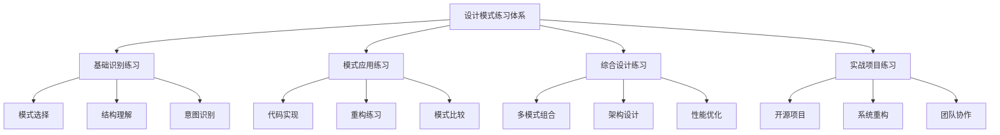
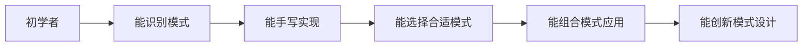

# 设计模式综合练习

[[09-记忆强化/01-模式速记口诀]] → [[02-面试重点模式总结]]
## 🎯 练习体系概述

### 📊 练习层次设计



## 🔥 基础识别练习

### 📝 练习1：模式意图识别

#### 题目：识别以下场景推荐的设计模式

**场景A**：电商系统中，需要有多种支付方式（信用卡、PayPal、比特币），用户可以在运行时选择不同的支付方式。

**问题**：
1. 这个场景需要什么设计模式？
2. 如何设计接口和具体实现？
3. 如何实现动态切换支付方式？

<details>
<summary>参考答案</summary>

**设计模式**：策略模式 (Strategy Pattern)

**解决方案**：
```java
// 抽象策略
interface PaymentStrategy {
    boolean processPayment(double amount);
    String getPaymentMethod();
}

// 具体策略
class CreditCardStrategy implements PaymentStrategy {
    private String cardNumber;
    private String cvv;
    
    public CreditCardStrategy(String cardNumber, String cvv) {
        this.cardNumber = cardNumber;
        this.cvv = cvv;
    }
    
    public boolean processPayment(double amount) {
        System.out.println("Processing credit card payment of $" + amount);
        return validateCard() && chargeCard(amount);
    }
    
    public String getPaymentMethod() {
        return "Credit Card ending in " + cardNumber.substring(cardNumber.length() - 4);
    }
    
    private boolean validateCard() { return true; }
    private boolean chargeCard(double amount) { return true; }
}

class PayPalStrategy implements PaymentStrategy {
    private String email;
    
    public PayPalStrategy(String email) {
        this.email = email;
    }
    
    public boolean processPayment(double amount) {
        System.out.println("Processing PayPal payment of $" + amount);
        return true;
    }
    
    public String getPaymentMethod() {
        return "PayPal account: " + email;
    }
}

// Context类
class PaymentProcessor {
    private PaymentStrategy strategy;
    
    public void setPaymentStrategy(PaymentStrategy strategy) {
        this.strategy = strategy;
    }
    
    public boolean processPayment(double amount) {
        if (strategy == null) {
            throw new IllegalStateException(",Payment strategy not set");
        }
        return strategy.processPayment(amount);
    }
}

// 客户端使用
public class PaymentDemo {
    public static void main(String[] args) {
        PaymentProcessor processor = new PaymentProcessor();
        
        // 运行时选择支付策略
        String userPreference = "paypal";
        if ("credit".equals(userPreference)) {
            processor.setPaymentStrategy(new CreditCardStrategy("1234567890123456", "123"));
        } else if ("paypal".equals(userPreference)) {
            processor.setPaymentStrategy(new PayPalStrategy("user@example.com"));
        }
        
        boolean success = processor.processPayment(100.0);
        System.out.println("Payment successful: " + success);
    }
}
```

</details>

---

**场景B**：在一个图形编辑器中，用户可以为图形对象（圆形、矩形、三角形）添加多种装饰效果（边框、阴影、渐变），并且可以组合多种效果。

**问题**：
1. 这个场景需要什么设计模式？
2. 如何设计装饰器层次？
3. 如何实现效果的可组合性？

<details>
<summary>参考答案</summary>

**设计模式**：装饰器模式 + 组合模式

**解决方案**：
```java
// 基础组件接口
interface Drawable {
    void draw();
    String getDescription();
}

// 具体绘制对象
class Circle implements Drawable {
    private int radius;
    
    public Circle(int radius) {
        this.radius = radius;
    }
    
    public void draw() {
        System.out.println("Drawing circle with radius: " + radius);
    }
    
    public String getDescription() {
        return "Simple Circle";
    }
}

class Rectangle implements Drawable {
    private int width;
    private int height;
    
    public Rectangle(int width, int height) {
        this.width = width;
        this.height = height;
    }
    
    public void draw() {
        System.out.println("Drawing rectangle: " + width + "x" + height);
    }
    
    public String getDescription() {
        return "Simple Rectangle";
    }
}

// 装饰器抽象类
abstract class DrawableDecorator implements Drawable {
    protected Drawable drawable;
    
    public DrawableDecorator(Drawable drawable) {
        this.drawable = drawable;
    }
    
    public void draw() {
        drawable.draw();
    }
}

// 具体装饰器
class BorderDecorator extends DrawableDecorator {
    private String borderColor;
    private int borderWidth;
    
    public BorderDecorator(Drawable drawable, String color, int width) {
        super(drawable);
        this.borderColor = color;
        this.borderWidth = width;
    }
    
    public void draw() {
        super.draw();
        System.out.println("Adding border: " + borderWidth + "px " + borderColor);
    }
    
    public String getDescription() {
        return drawable.getDescription() + " with border";
    }
}

class ShadowDecorator extends DrawableDecorator {
    private int offsetX;
    private int offsetY;
    
    public ShadowDecorator(Drawable drawable, int offsetX, int offsetY) {
        super(drawable);
        this.offsetX = offsetX;
        this.offsetY = offsetY;
    }
    
    public void draw() {
        super.draw();
        System.out.println("Adding shadow: offset(" + offsetX + ", " + offsetY + ")");
    }
    
    public String getDescription() {
        return drawable.getDescription() + " with shadow";
    }
}

class GradientDecorator extends DrawableDecorator {
    private String startColor;
    private String endColor;
    
    public GradientDecorator(Drawable drawable, String startColor, String endColor) {
        super(drawable);
        this.startColor = startColor;
        this.endColor = endColor;
    }
    
    public void draw() {
        super.draw();
        System.out.println("Applying gradient: " + startColor + " to " + endColor);
    }
    
    public String getDescription() {
        return drawable.getDescription() + " with gradient";
    }
}

// 使用示例
public class GraphicsEditorDemo {
    public static void main(String[] args) {
        // 创建一个带多层装饰的圆形
        Drawable decoratedCircle = new GradientDecorator(
            new ShadowDecorator(
                new BorderDecorator(
                    new Circle(50), "red", 3
                ), 5, 5
            ), "blue", "green"
        );
        
        System.out.println(,decoratedCircle.getDescription());
        decoratedCircle.draw();
        
        // 创建一个带装饰的矩形
        Drawable decoratedRectangle = new ShadowDecorator(
            new GradientDecorator(
                new Rectangle(100, 60), "yellow", "orange"
            ), 2, 2
        );
        
        System.out.println(decoratedRectangle.getDescription());
        decoratedRectangle.draw();
    }
}
```

</details>

---

## 🛠️ 模式应用练习

### 📝 练习2：系统重构练习

#### 题目：重构支付系统中的条件复杂逻辑

**原始代码**：
```java
public class PaymentService {
    public boolean processPayment(String method, double amount, String currency, Map<String, Object> paymentData) {
        if ("credit_card".equals(method)) {
            // 信用卡支付逻辑
            String cardNumber = (String) paymentData.get("cardNumber");
            String expiryDate = (String) paymentData.get("expiryDate");
            String cvv = (String) paymentData.get("cvv");
            
            if (cardNumber == null || cardNumber.isEmpty()) {
                throw new IllegalArgumentException("Card number is required");
            }
            if (expiryDate == null || expiryDate.isEmpty()) {
                throw new IllegalArgumentException("Expiry date is required");
            }
            if (cvv == null || cvv.isEmpty()) {
                throw new IllegalArgumentException("CVV is required");
            }
            
            // 验证卡片
            if (!isValidCardNumber(cardNumber)) {
                return false;
            }
            
            // 检查过期
            if (isCardExpired(expiryDate)) {
                return false;
            }
            
            // 处理支付
            return processCreditCardPayment(cardNumber, expiryDate, cvv, amount, currency);
            
        } else if ("paypal".equals(method)) {
            // PayPal支付逻辑
            String email = (String) paymentData.get("email");
            String password = (String) paymentData.get("password");
            
            if (email == null || email.isEmpty()) {
                throw new IllegalArgumentException("Email is required");
            }
            if (password == null || password.isEmpty()) {
                throw new IllegalArgumentException("Password is required");
            }
            
            // 验证PayPal账户
            if (!isValidPayPalAccount(email, password)) {
                return false;
            }
            
            // 处理支付
            return processPayPalPayment(email, amount, currency);
            
        } else if ("bank_transfer".equals(method)) {
            // 银行转账逻辑
            String accountNumber = (String) paymentData.get("accountNumber");
            String routingNumber = (String) paymentData.get("routingNumber");
            
            if (accountNumber == null || accountNumber.isEmpty()) {
                throw new IllegalArgumentException("Account number is required");
            }
            if (routingNumber == null || routingNumber.isEmpty()) {
                throw new IllegalArgumentException("Routing number is required");
            }
            
            // 验证银行账户
            if (!isValidBankAccount(accountNumber, routingNumber)) {
                return false;
            }
            
            // 处理支付
            return processBankTransfer(accountNumber, routingNumber, amount, currency);
            
        } else {
            throw new IllegalArgumentException("Unsupported payment method: " + method);
        }
    }
    
    // 各种辅助方法...
}
```

**练习任务**：
1. 识别当前代码的问题（违反了什么设计原则）
2. 应用适当的设计模式进行重构
3. 提供完整的重构后代码
4. 解释重构的收益

<details>
<summary>重构指导</summary>

**问题分析**：
1. **违反SRP**：支付服务承担了多种支付方式的处理
2. **违反OCP**：新增支付方式需要修改现有代码
3. **违反DIP**：依赖具体实现而非抽象

**重构方案**：使用策略模式 + 工厂模式

```java
// 支付策略接口
interface PaymentStrategy {
    PaymentResult processPayment(PaymentRequest request);
    void validatePaymentData(PaymentRequest request);
}

// 支付请求数据类
class PaymentRequest {
    private final double amount;
    private final String currency;
    private final Map<String, Object> paymentData;
    
    public PaymentRequest(double amount, String currency, Map<String, Object> paymentData) {
        this.amount = amount;
        this.currency = currency;
        this.paymentData = paymentData;
    }
    
    // getters...
}

// 支付结果类
class PaymentResult {
    private final boolean success;
    private final String transactionId;
    private final String errorMessage;
    
    public PaymentResult(boolean success, String transactionId, String errorMessage) {
        this.success = success;
        this.transactionId = transactionId;
        this.errorMessage = errorMessage;
    }
    
    // getters...
}

// 具体支付策略
class CreditCardStrategy implements PaymentStrategy {
    @Override
    public void validatePaymentData(PaymentRequest request) {
        Map<String, Object> data = request.getPaymentData();
        
        String cardNumber = (String) data.get("cardNumber");
        String expiryDate = (String) data.get("expiryDate");
        String cvv = (String) data.get("cvv");
        
        if (cardNumber == null || cardNumber.isEmpty()) {
            throw new IllegalArgumentException("Card number is required");
        }
        if (expiryDate == null || expiryDate.isEmpty()) {
            throw new IllegalArgumentException("Expiry date is required");
        }
        if (cvv == null || cvv.isEmpty()) {
            throw new IllegalArgumentException("CVV is required");
        }
    }
    
    @Override
    public PaymentResult processPayment(PaymentRequest request) {
        validatePaymentData(request);
        
        String cardNumber = (String) request.getPaymentData().get("cardNumber");
        String expiryDate = (String) request.getPaymentData().get("expiryDate");
        String cvv = (String) request.getPaymentData().get("cvv");
        
        // 验证卡片
        if (!isValidCardNumber(cardNumber)) {
            return new PaymentResult(false, null, "Invalid card number");
        }
        
        if (isCardExpired(expiryDate)) {
            return new PaymentResult(false, null, "Card expired");
        }
        
        // 处理支付
        boolean success = processCreditCardPayment(cardNumber, expiryDate, cvv, 
            request.getAmount(), request.getCurrency());
        
        if (success) {
            return new PaymentResult(true, generateTransactionId(), null);
        } else {
            return new PaymentResult(false, null, "Payment processing failed");
        }
    }
    
    private boolean isValidCardNumber(String cardNumber) { return true; }
    private boolean isCardExpired(String expiryDate) { return false; }
    private boolean procesCreditCardPayment(String card, String expiry, String cvv, double amount, String currency) { return true; }
    private String generateTransactionId() { return "TXN_" + System.currentTimeMillis(); }
}

class PayPalStrategy implements PaymentStrategy {
    @Override
    public void validatePaymentData(PaymentRequest request) {
        Map<String, Object> data = request.getPaymentData();
        String email = (String) data.get("email");
        String password = (String) data.get("password");
        
        if (email == null || email.isEmpty()) {
            throw new IllegalArgumentException("Email is required");
        }
        if (password == null || password.isEmpty()) {
            throw new IllegalArgumentException("Password is required");
        }
    }
    
    @Override
    public PaymentResult processPayment(PaymentRequest request) {
        validatePaymentData(request);
        
        String email = (String) request.getPaymentData().get("email");
        String password = (String) request.getPaymentData().get("password");
        
        if (!isValidPayPalAccount(email, password)) {
            return new PaymentResult(false, null, "Invalid PayPal credentials");
        }
        
        boolean success = processPayPalPayment(email, request.getAmount(), request.getCurrency());
        
        return success 
            ? new PaymentResult(true, generateTransactionId(), null)
            : new PaymentResult(false, null, "PayPal payment failed");
    }
    
    // 辅助方法...
}

// 支付工厂
class PaymentStrategyFactory {
    private static final Map<String, PaymentStrategy> strategies = Map.of(
        "credit_card", new CreditCardStrategy(),
        "paypal", new PayPalStrategy(),
        "bank_transfer", new BankTransferStrategy()
    );
    
    public static PaymentStrategy getStrategy(String method) {
        PaymentStrategy strategy = strategies.get(method);
        if (strategy == null) {
            throw new IllegalArgumentException("Unsupported payment method: " + method);
        }
        return strategy;
    }
}

// 重构后的支付服务
class PaymentService {
    public PaymentResult processPayment(String method, double amount, String currency, Map<String, Object> paymentData) {
        try {
            PaymentStrategy strategy = PaymentStrategyFactory.getStrategy(method);
            PaymentRequest request = new PaymentRequest(amount, currency, paymentData);
            return strategy.processPayment(request);
        } catch (Exception e) {
            return new PaymentResult(false, null, e.getMessage());
        }
    }
}

**重构收益**：
1. **可扩展性**：新增支付方式无需修改现有代码
2. **可测试性**：每个策略可以独立测试
3. **可维护性**：职责单一，代码更清晰
4. **可复用性**：策略可以在不同场景中复用
```

</details>

---

## 🏗️ 综合设计练习

### 📝 练习3：订单管理系统设计

#### 设计需求
设计一个订单管理系统，要求支持以下功能：
1. 订单的创建、取消、完成
2. 不同的订单状态（待支付、已支付、已发货、已完成、已取消）
3. 订单状态变化时的通知机制
4. 订单处理流程的可扩展性
5. 不同订单类型的特殊处理

#### 设计任务
1. 选择合适的设计模式
2. 设计整体架构
3. 提供核心代码实现
4. 说明设计思路

<details>
<summary>设计指导</summary>

**推荐模式组合**：
- 状态模式（订单状态管理）
- 观察者模式（状态变化通知）
- 策略模式（不同订单类型处理）
- 工厂模式（订单创建）

```java
// 订单状态枚举
enum OrderStatus {
    PENDING_PAYMENT, PAID, SHIPPED, DELIVERED, CANCELLED
}

// 订单状态接口
interface OrderState {
    void paymentReceived(Order order);
    void ship(Order order);
    void deliver(Order order);
    void cancel(Order order);
    OrderStatus getStatus();
}

// 待支付状态
class PendingPaymentState implements OrderState {
    public void paymentReceived(Order order) {
        order.setState(new PaidState());
        order.notifyObservers(new OrderStateChangedEvent(order, OrderStatus.PENDING_PAYMENT, OrderStatus.PAID));
    }
    
    public void ship(Order order) {
        System.out.println("Cannot ship pending payment order");
    }
    
    public void deliver(Order order) {
        System.out.println("Cannot deliver pending payment order");
    }
    
    public void cancel(Order order) {
        order.setState(new CancelledState());
        order.notifyObservers(new OrderStateChangedEvent(order, OrderStatus.PENDING_PAYMENT, OrderStatus.CANCELLED));
    }
    
    public OrderStatus getStatus() {
        return OrderStatus.PENDING_PAYMENT;
    }
}

// 订单产品接口
interface OrderItem {
    String getItemId();
    double getPrice();
    int getQuantity();
    String getItemType();
}

// 订单类
class Order {
    private String orderId;
    private List<OrderItem> items;
    private OrderState currentState;
    private List<OrderObserver> observers = new ArrayList<>();
    private PurchaseStrategy purchaseStrategy;
    
    public Order(String orderId, List<OrderItem> items) {
        this.orderId = orderId;
        this.items = items;
        this.currentState = new PendingPaymentState();
        this.purchaseStrategy = determinePurchaseStrategy();
    }
    
    public void addObserver(OrderObserver observer) {
        observers.add(observer);
    }
    
    public void removeObserver(OrderObserver observer) {
        observers.remove(observer);
    }
    
    private void notifyObservers(OrderEvent event) {
        observers.forEach(observer -> observer.notify(event));
    }
    
    public void paymentReceived() {
        currentState.paymentReceived(this);
        purchaseStrategy.afterPayment(this);
    }
    
    public void ship() {
        currentState.ship(this);
        purchaseStrategy.afterShipment(this);
    }
    
    public void deliver() {
        currentState.deliver(this);
        purchaseStrategy.afterDelivery(this);
    }
    
    public void cancel() {
        currentState.cancel(this);
        purchaseStrategy.afterCancellation(this);
    }
    
    public void setState(OrderState state) {
        this.currentState = state;
    }
    
    private PurchaseStrategy determinePurchaseStrategy() {
        // 根据订单类型选择策略
        boolean hasElectronics = items.stream().anyMatch(item -> "ELECTRONIC".equals(item.getItemType()));
        boolean hasBooks = items.stream().anyMatch(item -> "BOOK".equals(item.getItemType()));
        
        if (hasElectronics && hasBooks) {
            return new MixedOrderStrategy();
        } else if (hasElectronics) {
            return new ElectronicStrategy();
        } else if (hasBooks) {
            return new BookStrategy();
        } else {
            return new GeneralStrategy();
        }
    }
    
    // Getters
    public String getOrderId() { return orderId; }
    public List<OrderItem> getItems() { return items; }
    public OrderStatus getCurrentStatus() { return currentState.getStatus(); }
}

// 策略模式：购买策略
interface PurchaseStrategy {
    void afterPayment(Order order);
    void afterShipment(Order order);
    void afterDelivery(Order order);
    void afterCancellation(Order order);
}

class ElectronicStrategy implements PurchaseStrategy {
    public void afterPayment(Order order) {
        System.out.println("电子订单支付后：发送电子发票和保修信息");
        // 发送电子发票
        // 发送保修信息
    }
    
    public void послеShipping(Order order) {
        System.out.println("电子产品发货后：发送安装指导邮件");
        // 发送安装指导
    }
    
    public void afterDelivery(Order order) {
        System.out.println("电子产品送达后：提醒用户激活保修");
        // 发送保修激活提醒
    }
    
    public void afterCancellation(Order order) {
        System.out.println("电子产品取消：处理退款和退货");
        // 处理退款流程
    }
}

// 观察者模式：订单通知
interface OrderObserver {
    void notify(OrderEvent event);
}

class InventoryManager implements OrderObserver {
    public void notify(OrderEvent event) {
        if (event instanceof OrderStateChangedEvent) {
            OrderStateChangedEvent stateEvent = (OrderStateChangedEvent) event;
            Order order = stateEvent.getOrder();
            
            switch (stateEvent.getNewStatus()) {
                case PAID:
                    adjustInventory(order.getItems(), -1); // 减少库存
                    break;
                case CANCELLED:
                    adjustInventory(order.getItems(), 1); // 恢复库存
                    break;
            }
        }
    }
    
    private void adjustInventory(List<OrderItem> items, int adjustment) {
        items.forEach(item -> {
            System.out.println("Adjusting inventory for " + item.getItemId() + " by " + adjustment);
        });
    }
}

// 事件类
interface OrderEvent {
    Order getOrder();
}

class OrderStateChangedEvent implements OrderEvent {
    private final Order order;
    private final OrderStatus oldStatus;
    private final OrderStatus newStatus;
    
    public OrderStateChangedEvent(Order order, OrderStatus oldStatus, OrderStatus newStatus) {
        this.order = order;
        this.oldStatus = oldStatus;
        this.newStatus = newStatus;
    }
    
    public Order getOrder() { return order; }
    public OrderStatus getOldStatus() { return oldStatus; }
    public OrderStatus getNewStatus() { return newStatus; }
}

// 工厂模式：订单创建
class OrderFactory {
    public static Order createOrder(String orderType, List<OrderItem> items) {
        String orderId = generateOrderId(orderType);
        return new Order(orderId, items);
    }
    
    private static String generateOrderId(String type) {
        return type.toUpperCase() + "_" + System.currentTimeMillis();
    }
}

// 客户端使用示例
public class OrderManagementSystem {
    public static void main(String[] args) {
        // 创建订单项目
        List<OrderItem> items = List.of(
            new ElectronicItem("LAPTOP001", 999.99, 1),
            new BookItem("BOOK001", 89.99, 2)
        );
        
        // 使用工厂创建订单
        Order order = OrderFactory.createOrder("ELECTRONIC", items);
        
        // 添加观察者
        order.addObserver(new InventoryManager());
        order.addObserver(new EmailNotificationService());
        
        // 模拟订单流程
        System.out.println("Created order: " + order.getOrderId());
        System.out.println("Initial status: " + order.getCurrentStatus());
        
        order.paymentReceived();
        System.out.println("After payment: " + order.getCurrentStatus());
        
        order.ship();
        System.out.println("After shipping: " + order.getCurrentStatus());
        
        order.deliver();
        System.out.println("After delivery: " + order.getCurrentStatus());
    }
}
```

**设计思路说明**：
1. **状态模式**：管理订单的状态转换，确保状态变化的一致性
2. **观察者模式**：解耦订单状态变化与业务处理逻辑
3. **策略模式**：根据订单类型执行不同的业务逻辑
4. **工厂模式**：统一订单创建过程

</details>

---

## 🎯 进阶挑战练习

### 📝 练习4：性能优化挑战
**任务**：优化一个使用观察者模式的事件系统，要求：
1. 支持异步事件处理
2. 实现事件优先级机制  
3. 避免内存泄漏
4. 提供性能监控

### 📝 练习5：模式创新应用
**任务**：设计一个智能客服机器人系统，要求：
1. 支持多种客服策略（FAQ、人工、AI）
2. 实现会话状态管理
3. 支持对话上下文记忆
4. 提供会话质量评估

## 📊 练习评分标准

### 🎯 评分维度

| 维度 | 权重 | 评分标准 |
|------|------|----------|
| **设计合理性** | 30% | 模式选择是否恰当，设计是否清晰 |
| **代码质量** | 25% | 可读性、可维护性、代码规范 |
| **模式运用** | 25% | 接口设计、实现质量、模式理解 |
| **创新性** | 10% | 模式组合创新、解决方案优雅性 |
| **文档说明** | 10% | 设计思路、使用说明是否清晰 |

### 📈 进阶路径



## 🔗 学习衔接

- **模式记忆** ← [[09-记忆强化/01-模式速记口诀]]
- **面试准备** → [[02-面试重点模式总结]]
- **实战演练** → [[03-最佳实践检查清单]]

---
**💡 练习建议**：设计模式的掌握需要大量练习。建议按照"理论理解 → 识别练习 → 实现练习 → 重构练习 → 创新设计"的路径逐步提升。每次练习后都要反思模式选择的合理性。
