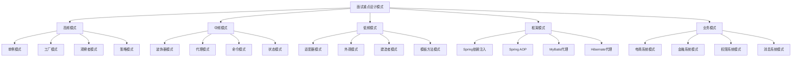

# 🎯 面试重点模式总结

[[10-学习评测/01-设计模式学习总结]] ← [[10-学习评测/03-最佳实践检查清单]]
## 🎯 面试模式概览

### 📊 面试重点模式分布图



## 🏗️ 高频面试模式

### 📋 **单例模式面试重点**

#### **🎯 核心问题**
1. **什么是单例模式？**
   - 确保一个类只有一个实例
   - 提供全局访问点
   - 延迟初始化

2. **单例模式的实现方式有哪些？**
   - 懒汉式（双重检查锁定）
   - 饿汉式（静态变量初始化）
   - 静态内部类
   - 枚举式（推荐）

3. **为什么推荐使用枚举单例？**
   - 简洁、线程安全
   - 防止反射攻击
   - 防止序列化问题
   - 代码可读性好

#### **💡 面试答案模板**
```java
// ✅ 枚举单例（推荐）
public enum Singleton {
    INSTANCE;
    
    public void doSomething() {
        System.out.println("Singleton doing something");
    }
}

// ✅ 双重检查锁定
public class DoubleCheckedSingleton {
    private static volatile DoubleCheckedSingleton instance;
    
    private DoubleCheckedSingleton() {}
    
    public static DoubleCheckedSingleton getInstance() {
        if (instance == null) {
            synchronized (DoubleCheckedSingleton.class) {
                if (instance == null) {
                    instance = new DoubleCheckedSingleton();
                }
            }
        }
        return instance;
    }
}
```

#### **🚨 常见陷阱**
- 线程安全问题
- 序列化问题
- 反射攻击
- 过度使用

### 📋 **工厂模式面试重点**

#### **🎯 核心问题**
1. **什么是工厂模式？**
   - 创建对象而不暴露创建逻辑
   - 解耦对象创建和使用
   - 支持扩展新产品

2. **工厂模式的类型有哪些？**
   - 简单工厂
   - 工厂方法
   - 抽象工厂

3. **Spring中的工厂模式应用？**
   - BeanFactory是工厂模式
   - ApplicationContext是工厂模式
   - @Bean注解创建Bean

#### **💡 面试答案模板**
```java
// ✅ 工厂方法模式
public interface Product {
    void doSomething();
}

public class ConcreteProduct implements Product {
    @Override
    public void doSomething() {
        System.out.println("Product doing something");
    }
}

public interface ProductFactory {
    Product createProduct();
}

public class ConcreteProductFactory implements ProductFactory {
    @Override
    public Product createProduct() {
        return new ConcreteProduct();
    }
}
```

#### **🚨 常见陷阱**
- 过度设计
- 简单对象不需要工厂
- 工厂类过多

### 📋 **观察者模式面试重点**

#### **🎯 核心问题**
1. **什么是观察者模式？**
   - 定义对象间一对多依赖关系
   - 支持广播通信
   - 解耦对象间通信

2. **观察者模式的应用场景？**
   - 事件通知
   - 模型-视图分离
   - 发布订阅

3. **观察者模式的现代实现？**
   - 事件驱动
   - 响应式编程
   - 消息队列

#### **💡 面试答案模板**
```java
// ✅ 观察者模式
public interface Observer {
    void update(String message);
}

public class ConcreteObserver implements Observer {
    private String name;
    
    public ConcreteObserver(String name) {
        this.name = name;
    }
    
    @Override
    public void update(String message) {
        System.out.println(name + " received: " + message);
    }
}

public class Subject {
    private List<Observer> observers = new ArrayList<>();
    
    public void addObserver(Observer observer) {
        observers.add(observer);
    }
    
    public void notifyObservers(String message) {
        observers.forEach(observer -> observer.update(message));
    }
}
```

#### **🚨 常见陷阱**
- 内存泄漏
- 循环依赖
- 通知顺序

### 📋 **策略模式面试重点**

#### **🎯 核心问题**
1. **什么是策略模式？**
   - 定义算法族并使其可互换
   - 算法独立
   - 易于扩展

2. **策略模式与状态模式的区别？**
   - 策略：算法选择，无状态转换
   - 状态：状态转换，有状态变化

3. **策略模式的应用场景？**
   - 算法选择
   - 业务规则
   - 支付方式

#### **💡 面试答案模板**
```java
// ✅ 策略模式
public interface PaymentStrategy {
    void pay(double amount);
}

public class CreditCardPayment implements PaymentStrategy {
    @Override
    public void pay(double amount) {
        System.out.println("Paying " + amount + " with credit card");
    }
}

public class PayPalPayment implements PaymentStrategy {
    @Override
    public void pay(double amount) {
        System.out.println("Paying " + amount + " with PayPal");
    }
}

public class PaymentContext {
    private PaymentStrategy strategy;
    
    public void setStrategy(PaymentStrategy strategy) {
        this.strategy = strategy;
    }
    
    public void executePayment(double amount) {
        strategy.pay(amount);
    }
}
```

#### **🚨 常见陷阱**
- 策略类过多
- 与状态模式混淆
- 过度设计

## 🏗️ 中频面试模式

### 📋 **装饰器模式面试重点**

#### **🎯 核心问题**
1. **什么是装饰器模式？**
   - 动态添加功能而不改变结构
   - 透明装饰
   - 可组合

2. **装饰器模式与代理模式的区别？**
   - 装饰器：增强功能，透明装饰
   - 代理：控制访问，非透明代理

3. **装饰器模式的应用场景？**
   - 功能增强
   - 透明装饰
   - 可组合功能

#### **💡 面试答案模板**
```java
// ✅ 装饰器模式
public interface Coffee {
    double getCost();
    String getDescription();
}

public class SimpleCoffee implements Coffee {
    @Override
    public double getCost() {
        return 10;
    }
    
    @Override
    public String getDescription() {
        return "Simple coffee";
    }
}

public abstract class CoffeeDecorator implements Coffee {
    protected Coffee coffee;
    
    public CoffeeDecorator(Coffee coffee) {
        this.coffee = coffee;
    }
    
    @Override
    public double getCost() {
        return coffee.getCost();
    }
    
    @Override
    public String getDescription() {
        return coffee.getDescription();
    }
}

public class MilkDecorator extends CoffeeDecorator {
    public MilkDecorator(Coffee coffee) {
        super(coffee);
    }
    
    @Override
    public double getCost() {
        return coffee.getCost() + 2;
    }
    
    @Override
    public String getDescription() {
        return coffee.getDescription() + ", milk";
    }
}
```

### 📋 **代理模式面试重点**

#### **🎯 核心问题**
1. **什么是代理模式？**
   - 为其他对象提供代理以控制访问
   - 延迟加载
   - 访问控制

2. **代理模式的类型？**
   - 静态代理
   - 动态代理
   - 虚拟代理
   - 保护代理

3. **Spring AOP中的代理模式？**
   - JDK动态代理
   - CGLIB代理
   - 切面编程

#### **💡 面试答案模板**
```java
// ✅ 动态代理
public interface UserService {
    void saveUser(User user);
}

public class UserServiceImpl implements UserService {
    @Override
    public void saveUser(User user) {
        System.out.println("Saving user: " + user.getName());
    }
}

public class UserServiceProxy implements InvocationHandler {
    private Object target;
    
    public UserServiceProxy(Object target) {
        this.target = target;
    }
    
    @Override
    public Object invoke(Object proxy, Method method, Object[] args) throws Throwable {
        System.out.println("Before method: " + method.getName());
        Object result = method.invoke(target, args);
        System.out.println("After method: " + method.getName());
        return result;
    }
}
```

## 🏗️ 框架模式面试重点

### 📋 **Spring框架模式**

#### **🎯 核心问题**
1. **Spring中的设计模式应用？**
   - 依赖注入：控制反转
   - AOP：代理模式
   - 模板方法：JdbcTemplate
   - 工厂模式：BeanFactory

2. **Spring AOP的实现原理？**
   - JDK动态代理
   - CGLIB代理
   - 切面编程

3. **Spring Bean的生命周期？**
   - 实例化
   - 属性注入
   - 初始化
   - 销毁

#### **💡 面试答案模板**
```java
// ✅ Spring依赖注入
@Service
public class UserService {
    @Autowired
    private UserRepository userRepository;
    
    public User createUser(User user) {
        return userRepository.save(user);
    }
}

// ✅ Spring AOP
@Aspect
@Component
public class LoggingAspect {
    @Around("@annotation(Loggable)")
    public Object logExecutionTime(ProceedingJoinPoint joinPoint) throws Throwable {
        long startTime = System.currentTimeMillis();
        Object result = joinPoint.proceed();
        long executionTime = System.currentTimeMillis() - startTime;
        System.out.println("Method executed in " + executionTime + "ms");
        return result;
    }
}
```

### 📋 **MyBatis框架模式**

#### **🎯 核心问题**
1. **MyBatis中的设计模式应用？**
   - 代理模式：Mapper代理
   - 建造者模式：SqlSessionFactoryBuilder
   - 策略模式：ResultSetHandler

2. **MyBatis Mapper代理的实现原理？**
   - 动态代理
   - 接口代理
   - 方法映射

#### **💡 面试答案模板**
```java
// ✅ MyBatis Mapper代理
@Mapper
public interface UserMapper {
    @Select("SELECT * FROM users WHERE id = #{id}")
    User findById(@Param("id") Long id);
    
    @Insert("INSERT INTO users (name, email) VALUES (#{name}, #{email})")
    int insert(User user);
}
```

## 🏗️ 业务场景面试重点

### 📋 **电商系统模式**

#### **🎯 核心问题**
1. **电商系统中使用了哪些设计模式？**
   - 工厂模式：商品创建
   - 策略模式：价格计算
   - 观察者模式：订单通知
   - 状态模式：订单状态

2. **如何设计一个购物车系统？**
   - 观察者模式：价格更新
   - 策略模式：折扣计算
   - 命令模式：操作撤销

#### **💡 面试答案模板**
```java
// ✅ 电商系统模式应用
@Service
public class OrderService {
    @Autowired
    private ProductFactory productFactory;
    
    @Autowired
    private PricingStrategy pricingStrategy;
    
    @Autowired
    private OrderObserver orderObserver;
    
    public Order createOrder(OrderRequest request) {
        // 工厂模式创建商品
        Product product = productFactory.createProduct(request.getProductType());
        
        // 策略模式计算价格
        double price = pricingStrategy.calculatePrice(product, request.getQuantity());
        
        // 创建订单
        Order order = new Order(product, request.getQuantity(), price);
        
        // 观察者模式通知
        orderObserver.notifyOrderCreated(order);
        
        return order;
    }
}
```

### 📋 **金融系统模式**

#### **🎯 核心问题**
1. **金融系统中使用了哪些设计模式？**
   - 状态模式：账户状态
   - 命令模式：交易处理
   - 责任链模式：风险控制
   - 模板方法模式：报表生成

2. **如何设计一个账户管理系统？**
   - 状态模式：账户状态管理
   - 命令模式：交易命令
   - 观察者模式：状态变化通知

#### **💡 面试答案模板**
```java
// ✅ 金融系统模式应用
public class Account {
    private AccountState state;
    private String accountNumber;
    private BigDecimal balance;
    
    public Account(String accountNumber) {
        this.accountNumber = accountNumber;
        this.balance = BigDecimal.ZERO;
        this.state = new ActiveState(this);
    }
    
    public void deposit(BigDecimal amount) {
        state.deposit(amount);
    }
    
    public void withdraw(BigDecimal amount) {
        state.withdraw(amount);
    }
    
    public void freeze() {
        this.state = new FrozenState(this);
    }
}
```

## 🎯 面试技巧总结

### 📋 **回答技巧**

1. **结构化回答**：
   - 定义模式
   - 实现方式
   - 应用场景
   - 优缺点

2. **代码示例**：
   - 提供完整代码
   - 解释关键点
   - 说明应用场景

3. **实际应用**：
   - 结合框架应用
   - 结合业务场景
   - 结合项目经验

### 📋 **常见问题**

1. **模式选择**：
   - 如何选择合适的模式
   - 模式之间的区别
   - 模式的组合使用

2. **实现细节**：
   - 线程安全问题
   - 性能考虑
   - 扩展性设计

3. **最佳实践**：
   - 避免过度设计
   - 遵循设计原则
   - 考虑维护成本

### 📋 **面试准备**

1. **理论知识**：
   - 掌握所有模式的定义
   - 理解模式的实现方式
   - 知道模式的应用场景

2. **实践能力**：
   - 能够手写模式代码
   - 能够识别模式应用
   - 能够设计模式方案

3. **项目经验**：
   - 准备相关项目经验
   - 能够解释模式应用
   - 能够分析模式效果

## 🔗 学习衔接

- **上一文档** ← [[设计模式学习总结]]
- **下一文档** → [[最佳实践检查清单]]
- **模式基础** → [[01-基础认知]]

---
**💡 面试精髓**: 面试中的设计模式问题不仅考察理论知识，更考察实际应用能力。通过系统性的准备，结合项目经验，我们能够在面试中展现出对设计模式的深入理解和实际应用能力！
