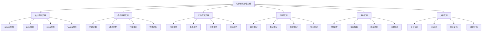

# ✅ 最佳实践检查清单

[[10-学习评测/02-面试重点模式总结]] ← [[10-学习评测/04-学习进度跟踪表]]
## 🎯 最佳实践概览

### 📊 实践检查结构图

## 🏗️ 设计原则实践检查

### 📋 **SOLID原则实践检查**

#### **✅ 单一职责原则 (SRP)**
- [ ] 每个类只有一个变化原因
- [ ] 类的职责清晰明确
- [ ] 避免上帝类
- [ ] 方法功能单一
- [ ] 模块职责分离

#### **✅ 开闭原则 (OCP)**
- [ ] 对扩展开放
- [ ] 对修改关闭
- [ ] 使用抽象和接口
- [ ] 支持多态
- [ ] 避免修改现有代码

#### **✅ 里氏替换原则 (LSP)**
- [ ] 子类可以替换父类
- [ ] 不改变父类行为
- [ ] 不抛出新的异常
- [ ] 不改变前置条件
- [ ] 不改变后置条件

#### **✅ 接口隔离原则 (ISP)**
- [ ] 接口职责单一
- [ ] 避免胖接口
- [ ] 客户端不依赖不需要的接口
- [ ] 接口最小化
- [ ] 接口内聚性高

#### **✅ 依赖倒置原则 (DIP)**
- [ ] 依赖抽象而不是具体
- [ ] 高层模块不依赖低层模块
- [ ] 抽象不依赖细节
- [ ] 细节依赖抽象
- [ ] 使用依赖注入

### 📋 **辅助原则实践检查**

#### **✅ DRY原则 (Don't Repeat Yourself)**
- [ ] 避免重复代码
- [ ] 提取公共方法
- [ ] 使用继承和组合
- [ ] 配置统一管理
- [ ] 工具类复用

#### **✅ KISS原则 (Keep It Simple, Stupid)**
- [ ] 保持简单
- [ ] 避免过度设计
- [ ] 选择简单方案
- [ ] 代码易读易懂
- [ ] 避免复杂逻辑

#### **✅ YAGNI原则 (You Aren't Gonna Need It)**
- [ ] 不实现不需要的功能
- [ ] 避免过度设计
- [ ] 按需实现
- [ ] 避免预测性编程
- [ ] 保持代码简洁

## 🏗️ 模式选择实践检查

### 📋 **问题识别检查**

#### **✅ 代码异味识别**
- [ ] 识别长方法
- [ ] 识别大类
- [ ] 识别重复代码
- [ ] 识别紧耦合
- [ ] 识别低内聚

#### **✅ 设计缺陷识别**
- [ ] 识别循环依赖
- [ ] 识别上帝类
- [ ] 识别接口污染
- [ ] 识别过度设计
- [ ] 识别违反SOLID原则

#### **✅ 性能问题识别**
- [ ] 识别性能瓶颈
- [ ] 识别内存泄漏
- [ ] 识别资源浪费
- [ ] 识别并发问题
- [ ] 识别扩展性问题

### 📋 **模式匹配检查**

#### **✅ 创建型模式选择**
- [ ] 单例模式：需要唯一实例
- [ ] 工厂模式：需要创建对象
- [ ] 建造者模式：需要构建复杂对象
- [ ] 原型模式：需要克隆对象

#### **✅ 结构型模式选择**
- [ ] 适配器模式：需要接口转换
- [ ] 装饰器模式：需要功能增强
- [ ] 外观模式：需要简化接口
- [ ] 代理模式：需要访问控制

#### **✅ 行为型模式选择**
- [ ] 观察者模式：需要事件通知
- [ ] 策略模式：需要算法选择
- [ ] 命令模式：需要操作封装
- [ ] 状态模式：需要状态管理

### 📋 **方案设计检查**

#### **✅ 架构设计**
- [ ] 设计合理的架构
- [ ] 选择合适的模式组合
- [ ] 考虑系统的扩展性
- [ ] 考虑系统的维护性
- [ ] 考虑系统的性能

#### **✅ 接口设计**
- [ ] 设计清晰的接口
- [ ] 遵循接口隔离原则
- [ ] 考虑接口的扩展性
- [ ] 考虑接口的兼容性
- [ ] 考虑接口的易用性

#### **✅ 类设计**
- [ ] 设计职责单一的类
- [ ] 遵循单一职责原则
- [ ] 考虑类的内聚性
- [ ] 考虑类的耦合度
- [ ] 考虑类的可测试性

## 🏗️ 代码实现实践检查

### 📋 **代码规范检查**

#### **✅ 命名规范**
- [ ] 类名使用大驼峰命名
- [ ] 方法名使用小驼峰命名
- [ ] 变量名使用小驼峰命名
- [ ] 常量名使用全大写
- [ ] 包名使用小写

#### **✅ 注释规范**
- [ ] 类注释说明类的职责
- [ ] 方法注释说明方法的功能
- [ ] 参数注释说明参数的含义
- [ ] 返回值注释说明返回值的含义
- [ ] 异常注释说明可能抛出的异常

#### **✅ 结构规范**
- [ ] 代码结构清晰
- [ ] 方法长度适中
- [ ] 类长度适中
- [ ] 嵌套层次合理
- [ ] 代码格式统一

### 📋 **代码质量检查**

#### **✅ 可读性检查**
- [ ] 代码易读易懂
- [ ] 逻辑清晰
- [ ] 变量名有意义
- [ ] 方法名有意义
- [ ] 注释充分

#### **✅ 可维护性检查**
- [ ] 代码易于修改
- [ ] 代码易于扩展
- [ ] 代码易于理解
- [ ] 代码易于测试
- [ ] 代码易于调试

#### **✅ 可测试性检查**
- [ ] 代码易于测试
- [ ] 依赖关系清晰
- [ ] 方法职责单一
- [ ] 副作用最小
- [ ] 可模拟依赖

### 📋 **性能优化检查**

#### **✅ 性能考虑**
- [ ] 避免不必要的对象创建
- [ ] 使用对象池
- [ ] 优化循环
- [ ] 优化算法
- [ ] 优化数据结构

#### **✅ 内存管理**
- [ ] 避免内存泄漏
- [ ] 及时释放资源
- [ ] 使用弱引用
- [ ] 避免循环引用
- [ ] 监控内存使用

#### **✅ 并发安全**
- [ ] 考虑线程安全
- [ ] 使用同步机制
- [ ] 避免死锁
- [ ] 使用并发工具
- [ ] 测试并发场景

## 🏗️ 测试实践检查

### 📋 **单元测试检查**

#### **✅ 测试覆盖**
- [ ] 测试覆盖率达标
- [ ] 测试所有公共方法
- [ ] 测试边界条件
- [ ] 测试异常情况
- [ ] 测试正常流程

#### **✅ 测试质量**
- [ ] 测试用例独立
- [ ] 测试用例可重复
- [ ] 测试用例快速
- [ ] 测试用例清晰
- [ ] 测试用例完整

#### **✅ 测试工具**
- [ ] 使用合适的测试框架
- [ ] 使用Mock工具
- [ ] 使用断言工具
- [ ] 使用测试数据工具
- [ ] 使用性能测试工具

### 📋 **集成测试检查**

#### **✅ 接口测试**
- [ ] 测试接口功能
- [ ] 测试接口性能
- [ ] 测试接口兼容性
- [ ] 测试接口安全性
- [ ] 测试接口稳定性

#### **✅ 系统测试**
- [ ] 测试系统功能
- [ ] 测试系统性能
- [ ] 测试系统稳定性
- [ ] 测试系统安全性
- [ ] 测试系统兼容性

### 📋 **性能测试检查**

#### **✅ 性能指标**
- [ ] 响应时间
- [ ] 吞吐量
- [ ] 并发数
- [ ] 资源使用率
- [ ] 错误率

#### **✅ 性能优化**
- [ ] 识别性能瓶颈
- [ ] 优化关键路径
- [ ] 优化算法
- [ ] 优化数据结构
- [ ] 优化系统配置

## 🏗️ 重构实践检查

### 📋 **代码审查检查**

#### **✅ 审查流程**
- [ ] 建立代码审查流程
- [ ] 制定审查标准
- [ ] 培训审查人员
- [ ] 记录审查结果
- [ ] 跟踪改进措施

#### **✅ 审查内容**
- [ ] 代码规范
- [ ] 设计模式应用
- [ ] 性能考虑
- [ ] 安全性
- [ ] 可维护性

### 📋 **重构策略检查**

#### **✅ 重构计划**
- [ ] 制定重构计划
- [ ] 评估重构风险
- [ ] 准备重构环境
- [ ] 备份现有代码
- [ ] 准备回滚方案

#### **✅ 重构执行**
- [ ] 小步重构
- [ ] 保持测试通过
- [ ] 版本控制
- [ ] 团队协作
- [ ] 持续集成

### 📋 **版本控制检查**

#### **✅ 分支管理**
- [ ] 使用分支管理
- [ ] 分支命名规范
- [ ] 分支合并策略
- [ ] 冲突解决
- [ ] 代码同步

#### **✅ 提交规范**
- [ ] 提交信息规范
- [ ] 提交频率合理
- [ ] 提交内容完整
- [ ] 提交前测试
- [ ] 提交后验证

## 🏗️ 文档实践检查

### 📋 **设计文档检查**

#### **✅ 架构文档**
- [ ] 系统架构图
- [ ] 模块关系图
- [ ] 数据流图
- [ ] 接口定义
- [ ] 设计决策

#### **✅ 模式文档**
- [ ] 模式应用说明
- [ ] 模式选择理由
- [ ] 模式实现细节
- [ ] 模式效果评估
- [ ] 模式改进建议

### 📋 **API文档检查**

#### **✅ 接口文档**
- [ ] 接口说明
- [ ] 参数说明
- [ ] 返回值说明
- [ ] 异常说明
- [ ] 使用示例

#### **✅ 代码文档**
- [ ] 类注释
- [ ] 方法注释
- [ ] 参数注释
- [ ] 返回值注释
- [ ] 异常注释

### 📋 **用户文档检查**

#### **✅ 使用指南**
- [ ] 安装指南
- [ ] 配置指南
- [ ] 使用指南
- [ ] 故障排除
- [ ] 常见问题

#### **✅ 维护文档**
- [ ] 维护指南
- [ ] 升级指南
- [ ] 备份恢复
- [ ] 监控告警
- [ ] 性能调优

## 🎯 实践效果评估

### 📋 **质量指标**

#### **✅ 代码质量**
- [ ] 代码规范遵循度
- [ ] 代码重复率
- [ ] 代码复杂度
- [ ] 代码覆盖率
- [ ] 代码可维护性

#### **✅ 系统质量**
- [ ] 系统稳定性
- [ ] 系统性能
- [ ] 系统安全性
- [ ] 系统可扩展性
- [ ] 系统可维护性

### 📋 **团队能力**

#### **✅ 技术能力**
- [ ] 设计模式掌握程度
- [ ] 代码实现能力
- [ ] 问题解决能力
- [ ] 学习能力
- [ ] 创新能力

#### **✅ 协作能力**
- [ ] 代码审查能力
- [ ] 沟通协调能力
- [ ] 团队合作能力
- [ ] 知识分享能力
- [ ] 领导能力

### 📋 **持续改进**

#### **✅ 改进机制**
- [ ] 建立改进机制
- [ ] 定期评估
- [ ] 收集反馈
- [ ] 制定改进计划
- [ ] 跟踪改进效果

#### **✅ 学习成长**
- [ ] 持续学习
- [ ] 技术分享
- [ ] 经验总结
- [ ] 最佳实践
- [ ] 知识传承

## 🔗 学习衔接

- **上一文档** ← [[面试重点模式总结]]
- **下一文档** → [[学习进度跟踪表]]
- **模式基础** → [[01-基础认知]]

---
**💡 最佳实践精髓**: 最佳实践不是一成不变的规则，而是经过实践验证的经验总结。通过系统性的检查清单，我们可以确保设计模式的应用符合最佳实践，提高代码质量和系统性能！
