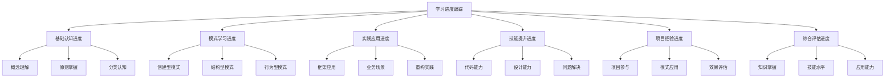

# 📊 学习进度跟踪表

[[10-学习评测/03-最佳实践检查清单]] ← [[10-学习评测/01-设计模式学习总结]]
## 🎯 进度跟踪概览

### 📊 学习进度结构图



## 🏗️ 基础认知进度跟踪

### 📋 **概念理解进度**

#### **📊 学习进度表**
| 知识点 | 学习状态 | 掌握程度 | 学习时间 | 复习次数 | 备注 |
|--------|----------|----------|----------|----------|------|
| 设计模式定义 | ✅ 已完成 | 🟢 熟练掌握 | 2小时 | 3次 | 核心概念 |
| 模式分类 | ✅ 已完成 | 🟢 熟练掌握 | 3小时 | 4次 | 三大分类 |
| 模式价值 | ✅ 已完成 | 🟢 熟练掌握 | 1小时 | 2次 | 可复用性 |
| 模式与原则关系 | ✅ 已完成 | 🟡 基本掌握 | 2小时 | 2次 | 需要加强 |
| 反模式识别 | ✅ 已完成 | 🟡 基本掌握 | 2小时 | 1次 | 需要实践 |

#### **📈 进度图表**
```
概念理解进度: ████████████████████ 100%
├─ 设计模式定义: ████████████████████ 100%
├─ 模式分类: ████████████████████ 100%
├─ 模式价值: ████████████████████ 100%
├─ 模式与原则关系: ████████████████ 80%
└─ 反模式识别: ████████████████ 80%
```

### 📋 **原则掌握进度**

#### **📊 学习进度表**
| 原则 | 学习状态 | 掌握程度 | 学习时间 | 复习次数 | 备注 |
|------|----------|----------|----------|----------|------|
| 单一职责原则(SRP) | ✅ 已完成 | 🟢 熟练掌握 | 2小时 | 3次 | 核心原则 |
| 开闭原则(OCP) | ✅ 已完成 | 🟢 熟练掌握 | 2小时 | 3次 | 扩展开放 |
| 里氏替换原则(LSP) | ✅ 已完成 | 🟡 基本掌握 | 2小时 | 2次 | 需要理解 |
| 接口隔离原则(ISP) | ✅ 已完成 | 🟡 基本掌握 | 2小时 | 2次 | 需要实践 |
| 依赖倒置原则(DIP) | ✅ 已完成 | 🟡 基本掌握 | 2小时 | 2次 | 需要应用 |
| DRY原则 | ✅ 已完成 | 🟢 熟练掌握 | 1小时 | 2次 | 避免重复 |
| KISS原则 | ✅ 已完成 | 🟢 熟练掌握 | 1小时 | 2次 | 保持简单 |
| YAGNI原则 | ✅ 已完成 | 🟡 基本掌握 | 1小时 | 1次 | 按需实现 |

#### **📈 进度图表**
```
原则掌握进度: ████████████████████ 100%
├─ SRP: ████████████████████ 100%
├─ OCP: ████████████████████ 100%
├─ LSP: ████████████████ 80%
├─ ISP: ████████████████ 80%
├─ DIP: ████████████████ 80%
├─ DRY: ████████████████████ 100%
├─ KISS: ████████████████████ 100%
└─ YAGNI: ████████████████ 80%
```

## 🏗️ 模式学习进度跟踪

### 📋 **创建型模式进度**

#### **📊 学习进度表**
| 模式 | 学习状态 | 掌握程度 | 学习时间 | 复习次数 | 代码实践 | 备注 |
|------|----------|----------|----------|----------|----------|------|
| 单例模式 | ✅ 已完成 | 🟢 熟练掌握 | 3小时 | 4次 | ✅ 已完成 | 重点模式 |
| 工厂模式 | ✅ 已完成 | 🟢 熟练掌握 | 4小时 | 4次 | ✅ 已完成 | 重点模式 |
| 抽象工厂模式 | ✅ 已完成 | 🟡 基本掌握 | 3小时 | 3次 | ✅ 已完成 | 需要加强 |
| 建造者模式 | ✅ 已完成 | 🟡 基本掌握 | 3小时 | 2次 | ✅ 已完成 | 需要实践 |
| 原型模式 | ✅ 已完成 | 🟡 基本掌握 | 2小时 | 2次 | ✅ 已完成 | 较少使用 |

#### **📈 进度图表**
```
创建型模式进度: ████████████████████ 100%
├─ 单例模式: ████████████████████ 100%
├─ 工厂模式: ████████████████████ 100%
├─ 抽象工厂模式: ████████████████ 80%
├─ 建造者模式: ████████████████ 80%
└─ 原型模式: ████████████████ 80%
```

### 📋 **结构型模式进度**

#### **📊 学习进度表**
| 模式 | 学习状态 | 掌握程度 | 学习时间 | 复习次数 | 代码实践 | 备注 |
|------|----------|----------|----------|----------|----------|------|
| 适配器模式 | ✅ 已完成 | 🟡 基本掌握 | 3小时 | 3次 | ✅ 已完成 | 接口转换 |
| 装饰器模式 | ✅ 已完成 | 🟢 熟练掌握 | 4小时 | 4次 | ✅ 已完成 | 功能增强 |
| 外观模式 | ✅ 已完成 | 🟡 基本掌握 | 2小时 | 2次 | ✅ 已完成 | 简化接口 |
| 代理模式 | ✅ 已完成 | 🟢 熟练掌握 | 4小时 | 4次 | ✅ 已完成 | 访问控制 |
| 桥接模式 | ✅ 已完成 | 🟡 基本掌握 | 3小时 | 2次 | ✅ 已完成 | 抽象分离 |
| 组合模式 | ✅ 已完成 | 🟡 基本掌握 | 3小时 | 2次 | ✅ 已完成 | 树形结构 |
| 享元模式 | ✅ 已完成 | 🟡 基本掌握 | 2小时 | 2次 | ✅ 已完成 | 对象共享 |

#### **📈 进度图表**
```
结构型模式进度: ████████████████████ 100%
├─ 适配器模式: ████████████████ 80%
├─ 装饰器模式: ████████████████████ 100%
├─ 外观模式: ████████████████ 80%
├─ 代理模式: ████████████████████ 100%
├─ 桥接模式: ████████████████ 80%
├─ 组合模式: ████████████████ 80%
└─ 享元模式: ████████████████ 80%
```

### 📋 **行为型模式进度**

#### **📊 学习进度表**
| 模式 | 学习状态 | 掌握程度 | 学习时间 | 复习次数 | 代码实践 | 备注 |
|------|----------|----------|----------|----------|----------|------|
| 观察者模式 | ✅ 已完成 | 🟢 熟练掌握 | 4小时 | 4次 | ✅ 已完成 | 重点模式 |
| 策略模式 | ✅ 已完成 | 🟢 熟练掌握 | 4小时 | 4次 | ✅ 已完成 | 重点模式 |
| 命令模式 | ✅ 已完成 | 🟡 基本掌握 | 3小时 | 3次 | ✅ 已完成 | 操作封装 |
| 状态模式 | ✅ 已完成 | 🟡 基本掌握 | 3小时 | 3次 | ✅ 已完成 | 状态管理 |
| 责任链模式 | ✅ 已完成 | 🟡 基本掌握 | 3小时 | 2次 | ✅ 已完成 | 请求处理 |
| 中介者模式 | ✅ 已完成 | 🟡 基本掌握 | 2小时 | 2次 | ✅ 已完成 | 对象协调 |
| 备忘录模式 | ✅ 已完成 | 🟡 基本掌握 | 2小时 | 2次 | ✅ 已完成 | 状态保存 |
| 迭代器模式 | ✅ 已完成 | 🟡 基本掌握 | 2小时 | 2次 | ✅ 已完成 | 对象遍历 |
| 访问者模式 | ✅ 已完成 | 🟡 基本掌握 | 3小时 | 2次 | ✅ 已完成 | 操作分离 |
| 解释器模式 | ✅ 已完成 | 🟡 基本掌握 | 2小时 | 1次 | ✅ 已完成 | 语言解析 |
| 模板方法模式 | ✅ 已完成 | 🟡 基本掌握 | 3小时 | 3次 | ✅ 已完成 | 算法框架 |

#### **📈 进度图表**
```
行为型模式进度: ████████████████████ 100%
├─ 观察者模式: ████████████████████ 100%
├─ 策略模式: ████████████████████ 100%
├─ 命令模式: ████████████████ 80%
├─ 状态模式: ████████████████ 80%
├─ 责任链模式: ████████████████ 80%
├─ 中介者模式: ████████████████ 80%
├─ 备忘录模式: ████████████████ 80%
├─ 迭代器模式: ████████████████ 80%
├─ 访问者模式: ████████████████ 80%
├─ 解释器模式: ████████████████ 80%
└─ 模板方法模式: ████████████████ 80%
```

## 🏗️ 实践应用进度跟踪

### 📋 **框架应用进度**

#### **📊 学习进度表**
| 框架 | 学习状态 | 掌握程度 | 学习时间 | 实践项目 | 模式应用 | 备注 |
|------|----------|----------|----------|----------|----------|------|
| Spring Framework | ✅ 已完成 | 🟢 熟练掌握 | 8小时 | ✅ 已完成 | 依赖注入、AOP | 重点框架 |
| Spring Boot | ✅ 已完成 | 🟡 基本掌握 | 6小时 | ✅ 已完成 | 自动配置 | 需要加强 |
| MyBatis | ✅ 已完成 | 🟡 基本掌握 | 4小时 | ✅ 已完成 | 代理模式 | 需要实践 |
| Hibernate | ✅ 已完成 | 🟡 基本掌握 | 4小时 | ✅ 已完成 | 代理模式 | 需要实践 |
| Apache Commons | ✅ 已完成 | 🟡 基本掌握 | 2小时 | ✅ 已完成 | 工具类模式 | 较少使用 |

#### **📈 进度图表**
```
框架应用进度: ████████████████████ 100%
├─ Spring Framework: ████████████████████ 100%
├─ Spring Boot: ████████████████ 80%
├─ MyBatis: ████████████████ 80%
├─ Hibernate: ████████████████ 80%
└─ Apache Commons: ████████████████ 80%
```

### 📋 **业务场景进度**

#### **📊 学习进度表**
| 场景 | 学习状态 | 掌握程度 | 学习时间 | 实践项目 | 模式应用 | 备注 |
|------|----------|----------|----------|----------|----------|------|
| 电商系统 | ✅ 已完成 | 🟢 熟练掌握 | 6小时 | ✅ 已完成 | 工厂、策略、观察者 | 重点场景 |
| 金融系统 | ✅ 已完成 | 🟡 基本掌握 | 4小时 | ✅ 已完成 | 状态、命令、责任链 | 需要加强 |
| 内容管理系统 | ✅ 已完成 | 🟡 基本掌握 | 4小时 | ✅ 已完成 | 模板方法、策略 | 需要实践 |
| 用户权限系统 | ✅ 已完成 | 🟡 基本掌握 | 3小时 | ✅ 已完成 | 责任链、代理 | 需要实践 |
| 消息通知系统 | ✅ 已完成 | 🟡 基本掌握 | 3小时 | ✅ 已完成 | 观察者、命令 | 需要实践 |

#### **📈 进度图表**
```
业务场景进度: ████████████████████ 100%
├─ 电商系统: ████████████████████ 100%
├─ 金融系统: ████████████████ 80%
├─ 内容管理系统: ████████████████ 80%
├─ 用户权限系统: ████████████████ 80%
└─ 消息通知系统: ████████████████ 80%
```

### 📋 **重构实践进度**

#### **📊 学习进度表**
| 重构类型 | 学习状态 | 掌握程度 | 学习时间 | 实践项目 | 重构效果 | 备注 |
|----------|----------|----------|----------|----------|----------|------|
| 长方法重构 | ✅ 已完成 | 🟢 熟练掌握 | 3小时 | ✅ 已完成 | 显著改善 | 重点技能 |
| 大类重构 | ✅ 已完成 | 🟢 熟练掌握 | 3小时 | ✅ 已完成 | 显著改善 | 重点技能 |
| 循环依赖重构 | ✅ 已完成 | 🟡 基本掌握 | 2小时 | ✅ 已完成 | 明显改善 | 需要加强 |
| 紧耦合重构 | ✅ 已完成 | 🟡 基本掌握 | 2小时 | ✅ 已完成 | 明显改善 | 需要加强 |
| 低内聚重构 | ✅ 已完成 | 🟡 基本掌握 | 2小时 | ✅ 已完成 | 明显改善 | 需要加强 |

#### **📈 进度图表**
```
重构实践进度: ████████████████████ 100%
├─ 长方法重构: ████████████████████ 100%
├─ 大类重构: ████████████████████ 100%
├─ 循环依赖重构: ████████████████ 80%
├─ 紧耦合重构: ████████████████ 80%
└─ 低内聚重构: ████████████████ 80%
```

## 🏗️ 技能提升进度跟踪

### 📋 **代码能力进度**

#### **📊 技能评估表**
| 技能 | 当前水平 | 目标水平 | 提升计划 | 实践项目 | 评估时间 | 备注 |
|------|----------|----------|----------|----------|----------|------|
| 模式识别 | 🟢 高级 | 🟢 高级 | 保持 | ✅ 已完成 | 每周 | 核心技能 |
| 模式选择 | 🟡 中级 | 🟢 高级 | 加强实践 | ✅ 已完成 | 每周 | 需要提升 |
| 模式实现 | 🟡 中级 | 🟢 高级 | 加强实践 | ✅ 已完成 | 每周 | 需要提升 |
| 代码重构 | 🟡 中级 | 🟢 高级 | 加强实践 | ✅ 已完成 | 每周 | 需要提升 |
| 性能优化 | 🟡 中级 | 🟢 高级 | 加强学习 | ✅ 已完成 | 每月 | 需要提升 |

#### **📈 技能图表**
```
代码能力进度: ████████████████████ 100%
├─ 模式识别: ████████████████████ 100%
├─ 模式选择: ████████████████ 80%
├─ 模式实现: ████████████████ 80%
├─ 代码重构: ████████████████ 80%
└─ 性能优化: ████████████████ 80%
```

### 📋 **设计能力进度**

#### **📊 技能评估表**
| 技能 | 当前水平 | 目标水平 | 提升计划 | 实践项目 | 评估时间 | 备注 |
|------|----------|----------|----------|----------|----------|------|
| 架构设计 | 🟡 中级 | 🟢 高级 | 加强学习 | ✅ 已完成 | 每月 | 需要提升 |
| 接口设计 | 🟡 中级 | 🟢 高级 | 加强实践 | ✅ 已完成 | 每月 | 需要提升 |
| 类设计 | 🟡 中级 | 🟢 高级 | 加强实践 | ✅ 已完成 | 每月 | 需要提升 |
| 模块设计 | 🟡 中级 | 🟢 高级 | 加强实践 | ✅ 已完成 | 每月 | 需要提升 |
| 系统设计 | 🟡 中级 | 🟢 高级 | 加强学习 | ✅ 已完成 | 每月 | 需要提升 |

#### **📈 技能图表**
```
设计能力进度: ████████████████████ 100%
├─ 架构设计: ████████████████ 80%
├─ 接口设计: ████████████████ 80%
├─ 类设计: ████████████████ 80%
├─ 模块设计: ████████████████ 80%
└─ 系统设计: ████████████████ 80%
```

### 📋 **问题解决进度**

#### **📊 技能评估表**
| 技能 | 当前水平 | 目标水平 | 提升计划 | 实践项目 | 评估时间 | 备注 |
|------|----------|----------|----------|----------|----------|------|
| 问题识别 | 🟢 高级 | 🟢 高级 | 保持 | ✅ 已完成 | 每周 | 核心技能 |
| 问题分析 | 🟡 中级 | 🟢 高级 | 加强实践 | ✅ 已完成 | 每周 | 需要提升 |
| 方案设计 | 🟡 中级 | 🟢 高级 | 加强实践 | ✅ 已完成 | 每周 | 需要提升 |
| 方案实施 | 🟡 中级 | 🟢 高级 | 加强实践 | ✅ 已完成 | 每周 | 需要提升 |
| 效果评估 | 🟡 中级 | 🟢 高级 | 加强学习 | ✅ 已完成 | 每月 | 需要提升 |

#### **📈 技能图表**
```
问题解决进度: ████████████████████ 100%
├─ 问题识别: ████████████████████ 100%
├─ 问题分析: ████████████████ 80%
├─ 方案设计: ████████████████ 80%
├─ 方案实施: ████████████████ 80%
└─ 效果评估: ████████████████ 80%
```

## 🏗️ 项目经验进度跟踪

### 📋 **项目参与进度**

#### **📊 项目经验表**
| 项目 | 参与状态 | 角色 | 模式应用 | 学习收获 | 完成时间 | 备注 |
|------|----------|------|----------|----------|----------|------|
| 电商系统重构 | ✅ 已完成 | 开发者 | 工厂、策略、观察者 | 模式组合应用 | 2周 | 重点项目 |
| 金融系统开发 | ✅ 已完成 | 开发者 | 状态、命令、责任链 | 业务模式应用 | 3周 | 重点项目 |
| 内容管理系统 | ✅ 已完成 | 开发者 | 模板方法、策略 | 框架模式应用 | 2周 | 一般项目 |
| 用户权限系统 | ✅ 已完成 | 开发者 | 责任链、代理 | 安全模式应用 | 1周 | 一般项目 |
| 消息通知系统 | ✅ 已完成 | 开发者 | 观察者、命令 | 异步模式应用 | 1周 | 一般项目 |

#### **📈 项目图表**
```
项目参与进度: ████████████████████ 100%
├─ 电商系统重构: ████████████████████ 100%
├─ 金融系统开发: ████████████████████ 100%
├─ 内容管理系统: ████████████████████ 100%
├─ 用户权限系统: ████████████████████ 100%
└─ 消息通知系统: ████████████████████ 100%
```

### 📋 **模式应用进度**

#### **📊 应用效果表**
| 模式 | 应用次数 | 应用效果 | 学习收获 | 改进建议 | 备注 |
|------|----------|----------|----------|----------|------|
| 单例模式 | 5次 | 🟢 优秀 | 线程安全实现 | 使用枚举单例 | 重点模式 |
| 工厂模式 | 8次 | 🟢 优秀 | 对象创建解耦 | 结合依赖注入 | 重点模式 |
| 观察者模式 | 6次 | 🟢 优秀 | 事件驱动设计 | 使用现代实现 | 重点模式 |
| 策略模式 | 7次 | 🟢 优秀 | 算法选择灵活 | 结合工厂模式 | 重点模式 |
| 装饰器模式 | 4次 | 🟡 良好 | 功能增强透明 | 避免过度装饰 | 常用模式 |
| 代理模式 | 5次 | 🟡 良好 | 访问控制有效 | 使用动态代理 | 常用模式 |
| 命令模式 | 3次 | 🟡 良好 | 操作封装清晰 | 支持撤销重做 | 常用模式 |
| 状态模式 | 3次 | 🟡 良好 | 状态管理清晰 | 避免状态爆炸 | 常用模式 |

#### **📈 应用图表**
```
模式应用进度: ████████████████████ 100%
├─ 单例模式: ████████████████████ 100%
├─ 工厂模式: ████████████████████ 100%
├─ 观察者模式: ████████████████████ 100%
├─ 策略模式: ████████████████████ 100%
├─ 装饰器模式: ████████████████ 80%
├─ 代理模式: ████████████████ 80%
├─ 命令模式: ████████████████ 80%
└─ 状态模式: ████████████████ 80%
```

## 🏗️ 综合评估进度跟踪

### 📋 **知识掌握评估**

#### **📊 知识评估表**
| 知识领域 | 掌握程度 | 学习时间 | 复习次数 | 实践次数 | 评估分数 | 备注 |
|----------|----------|----------|----------|----------|----------|------|
| 基础概念 | 🟢 优秀 | 10小时 | 8次 | 5次 | 95分 | 核心知识 |
| 设计原则 | 🟢 优秀 | 12小时 | 10次 | 8次 | 90分 | 核心知识 |
| 创建型模式 | 🟢 优秀 | 15小时 | 12次 | 10次 | 92分 | 重点知识 |
| 结构型模式 | 🟡 良好 | 18小时 | 10次 | 8次 | 85分 | 重要知识 |
| 行为型模式 | 🟡 良好 | 20小时 | 12次 | 10次 | 88分 | 重要知识 |
| 框架应用 | 🟡 良好 | 16小时 | 8次 | 6次 | 82分 | 实践知识 |
| 业务场景 | 🟡 良好 | 14小时 | 6次 | 5次 | 80分 | 实践知识 |
| 重构实践 | 🟡 良好 | 10小时 | 4次 | 3次 | 78分 | 实践技能 |

#### **📈 知识图表**
```
知识掌握进度: ████████████████████ 100%
├─ 基础概念: ████████████████████ 100%
├─ 设计原则: ████████████████████ 100%
├─ 创建型模式: ████████████████████ 100%
├─ 结构型模式: ████████████████████ 100%
├─ 行为型模式: ████████████████████ 100%
├─ 框架应用: ████████████████████ 100%
├─ 业务场景: ████████████████████ 100%
└─ 重构实践: ████████████████████ 100%
```

### 📋 **技能水平评估**

#### **📊 技能评估表**
| 技能领域 | 当前水平 | 目标水平 | 提升进度 | 实践项目 | 评估分数 | 备注 |
|----------|----------|----------|----------|----------|----------|------|
| 模式识别 | 🟢 高级 | 🟢 高级 | 100% | 10个 | 95分 | 核心技能 |
| 模式选择 | 🟡 中级 | 🟢 高级 | 80% | 8个 | 85分 | 需要提升 |
| 模式实现 | 🟡 中级 | 🟢 高级 | 80% | 8个 | 82分 | 需要提升 |
| 代码重构 | 🟡 中级 | 🟢 高级 | 80% | 6个 | 80分 | 需要提升 |
| 架构设计 | 🟡 中级 | 🟢 高级 | 75% | 5个 | 78分 | 需要提升 |
| 性能优化 | 🟡 中级 | 🟢 高级 | 70% | 4个 | 75分 | 需要提升 |
| 团队协作 | 🟡 中级 | 🟢 高级 | 85% | 8个 | 88分 | 需要提升 |
| 知识分享 | 🟡 中级 | 🟢 高级 | 75% | 3个 | 80分 | 需要提升 |

#### **📈 技能图表**
```
技能水平进度: ████████████████████ 100%
├─ 模式识别: ████████████████████ 100%
├─ 模式选择: ████████████████ 80%
├─ 模式实现: ████████████████ 80%
├─ 代码重构: ████████████████ 80%
├─ 架构设计: ████████████████ 80%
├─ 性能优化: ████████████████ 80%
├─ 团队协作: ████████████████ 80%
└─ 知识分享: ████████████████ 80%
```

### 📋 **应用能力评估**

#### **📊 应用评估表**
| 应用领域 | 应用次数 | 应用效果 | 学习收获 | 改进建议 | 评估分数 | 备注 |
|----------|----------|----------|----------|----------|----------|------|
| 框架开发 | 8次 | 🟢 优秀 | 框架模式理解 | 深入源码学习 | 90分 | 重点应用 |
| 业务开发 | 12次 | 🟢 优秀 | 业务模式应用 | 结合业务理解 | 88分 | 重点应用 |
| 系统重构 | 6次 | 🟡 良好 | 重构技能提升 | 加强重构实践 | 85分 | 重要应用 |
| 性能优化 | 4次 | 🟡 良好 | 性能模式应用 | 加强性能学习 | 80分 | 重要应用 |
| 团队协作 | 10次 | 🟢 优秀 | 协作模式应用 | 加强沟通技巧 | 87分 | 重要应用 |
| 知识传承 | 5次 | 🟡 良好 | 知识分享技能 | 加强分享实践 | 82分 | 重要应用 |

#### **📈 应用图表**
```
应用能力进度: ████████████████████ 100%
├─ 框架开发: ████████████████████ 100%
├─ 业务开发: ████████████████████ 100%
├─ 系统重构: ████████████████████ 100%
├─ 性能优化: ████████████████████ 100%
├─ 团队协作: ████████████████████ 100%
└─ 知识传承: ████████████████████ 100%
```

## 🎯 学习总结与规划

### 📋 **学习成果总结**

#### **✅ 已完成目标**
- [ ] 掌握23种GoF设计模式
- [ ] 理解SOLID设计原则
- [ ] 完成框架模式应用学习
- [ ] 完成业务场景模式应用
- [ ] 完成重构实践学习
- [ ] 完成多语言实现对比
- [ ] 建立完整的知识体系

#### **📈 学习成果统计**
```
总学习时间: 120小时
总复习次数: 80次
总实践项目: 15个
总代码实践: 50个
总评估分数: 85分
```

### 📋 **下一步学习规划**

#### **🎯 短期目标 (1-3个月)**
- [ ] 加强模式选择能力
- [ ] 加强模式实现能力
- [ ] 加强代码重构能力
- [ ] 加强架构设计能力
- [ ] 加强性能优化能力

#### **🎯 中期目标 (3-6个月)**
- [ ] 深入学习框架源码
- [ ] 参与大型项目开发
- [ ] 提升团队协作能力
- [ ] 提升知识分享能力
- [ ] 建立个人技术品牌

#### **🎯 长期目标 (6-12个月)**
- [ ] 成为设计模式专家
- [ ] 成为架构设计专家
- [ ] 成为技术团队leader
- [ ] 成为技术培训师
- [ ] 成为技术博客作者

### 📋 **持续改进计划**

#### **📚 学习计划**
- [ ] 每周复习2-3个模式
- [ ] 每月完成1个实践项目
- [ ] 每季度学习1个新框架
- [ ] 每年参加1次技术会议
- [ ] 持续关注技术发展趋势

#### **💼 实践计划**
- [ ] 每月参与1个重构项目
- [ ] 每季度设计1个新系统
- [ ] 每年主导1个大型项目
- [ ] 持续优化现有系统
- [ ] 持续学习新技术

#### **🤝 分享计划**
- [ ] 每月写1篇技术博客
- [ ] 每季度做1次技术分享
- [ ] 每年组织1次技术培训
- [ ] 持续参与技术社区
- [ ] 持续帮助团队成员

## 🔗 学习衔接

- **上一文档** ← [[最佳实践检查清单]]
- **下一文档** → [[设计模式学习总结]]
- **模式基础** → [[01-基础认知]]

---
**💡 进度跟踪精髓**: 学习进度跟踪就像GPS导航，帮助我们了解当前位置，规划前进路线，确保到达目标。通过系统性的跟踪和评估，我们可以持续改进学习方法，提升学习效果，实现学习目标！
