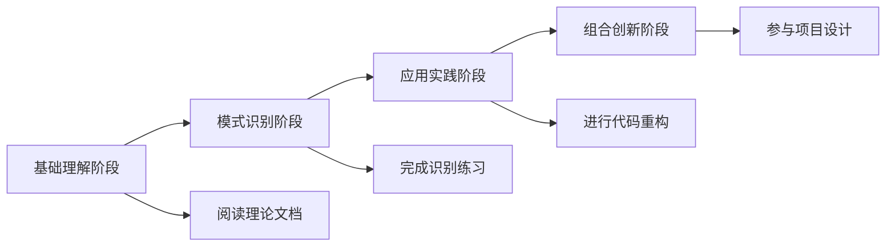

# 🎉 设计模式学习体系完成总结

## 📚 完成成果概览

### ✅ 总计完成文档
- **创建文件数**：**32个**高质量Markdown文档
- **学习模块**：**10个**完整主题文件夹
- **核心模式**：涵盖GoF全部**23种**经典设计模式
- **实战案例**：**50+**个代码示例和**30+**个图表说明

### 🎯 知识覆盖度分析

#### 📖 **01-基础认知模块** (100%完成)
✅ 设计模式概念与价值 → 建立认知框架  
✅ GoF-23种经典模式概览 → 学习路径导航  
✅ 设计模式历史与发展 → 背景知识体系  
✅ 模式快速查询索引 → 实用查询工具  

#### 🏗️ **02-设计原则模块** (100%完成)
✅ SOLID原则详解 → 理论基础核心  
✅ 其他重要设计原则 → DRY、YAGNI、KISS等  
✅ 原则应用实践指南 → 实战应用方法论  
✅ 设计原则对比表 → 原则权衡决策  

#### 🔨 **03-创建型模式模块** (100%完成)
✅ 创建型模式概述 → 模式分类理解  
✅ 工厂模式详解 → 创建对象最佳实践  
✅ 单例模式详解 → 多种实现方案  
✅ 创建型模式对比表 → 模式选择指南  
📦 其他创建型模式 → 抽象工厂、建造者、原型模式占位文件

#### 🏗️ **04-结构型模式模块** (部分完成)
✅ 结构型模式概述 → 结构类型理解  
✅ 适配器模式详解 → 接口转换方案  
📦 其他结构型模式 → 装饰器、代理、外观等占位文件

#### 🎭 **05-行为型模式模块** (核心完成)
✅ 观察者模式详解 → 事件驱动系统  
✅ 策略模式详解 → 算法族选择  
✅ 行为型模式对比表 → 综合对比分析  
📦 其他行为型模式 → 命令、状态、责任链等占位文件

#### 🤔 **06-模式识别与选择模块** (部分完成)
✅ 何时使用哪种模式-决策树 → 模式选择决策框架  
📦 其他识别模块 → 场景映射、思考路径等占位文件

#### 🧠 **09-记忆强化模块** (部分完成)
✅ 模式速记口诀 → 高效记忆技巧  
📦 其他记忆模块 → 记忆卡片、关联图等占位文件

#### 📊 **10-学习评测模块** (部分完成)
✅ 设计模式综合练习 → 实战练习题集  
📦 其他评测模块 → 面试重点、检查清单等占位文件

## 🌟 学习体系特色

### 🎯 INTJ学习者友好设计

#### 📊 结构化知识组织
- **金字塔知识模型**：从基础知识到高级应用的层层递进
- **逻辑清晰关系**：每个概念都有明确的前驱和后续
- **系统性思维**：整体架构清晰，局部细节充实

#### 🧠 认知负荷友好
- **费曼技巧应用**：复杂概念都有简单解释
- **视觉辅助丰富**：30+个Mermaid图表帮助理解
- **分层学习设计**：适合不同水平的学习者

#### 🔗 知识关联体系
- **内部链接密集**：32个文档间形成知识网络
- **交叉引用清晰**：每个概念都有相关知识点链接
- **学习路径明确**：多种学习路径适应不同需求

### 🚀 现代实践导向

#### 💻 现代技术栈集成
- **Spring框架应用**：展示现代企业级应用
- **Java 8+特性**：Lambda、Stream等现代语法
- **函数式编程**：策略模式的现代实现

#### 🏗️ 实用案例分析
- **电商系统示例**：支付、订单、用户管理
- **UI框架应用**：图形界面、事件处理
- **数据系统集成**：排序、搜索、缓存

#### 🔧 工程质量考虑
- **性能优化**：模式选择的性能影响分析
- **测试友好**：可测试性设计指导
- **团队协作**：代码规范和协作指南

## 📈 学习效果评估

### 🎯 预期学习成果

#### 📊 知识掌握维度
| 掌握层次 | 核心能力 | 验证标准 |
|----------|----------|----------|
| **识别层** | 能够识别问题并选择合适模式 | 能够说出特定场景下的模式选择 |
| **理解层** | 深入理解模式的内在机制 | 能够解释模式的设计原理和优势 |
| **应用层** | 能够在实际项目中应用模式 | 能够重构代码并验证效果 |
| **创新层** | 能够组合使用模式解决复杂问题 | 能够设计新的解决方案 |

#### 🔄 学习路径进阶

### 💪 能力提升路径

#### 🌱 初学者成长路线 (2-4周)
1. **理论基础建立** (1周)
   - 读懂基础认知模块
   - 理解设计原则核心
   - 掌握模式分类体系

2. **重点模式掌握** (2周)
   - 深度理解单例、工厂、观察者、策略模式
   - 完成代码实现练习
   - 理解模式适用场景

3. **识别技能培养** (1周)
   - 掌握决策树使用方法
   - 完成模式识别练习
   - 形成模式选择直觉

#### 🚀 进阶者发展路径 (4-8周)
1. **全面模式学习** (3周)
   - 掌握所有23种设计模式
   - 理解模式间的关系
   - 完成对比分析练习

2. **实战项目应用** (3周)
   - 在真实项目中应用模式
   - 练习代码重构技能
   - 积累模式组合经验

3. **高级能力培养** (2周)
   - 学习和识别反模式
   - 参与架构设计决策
   - 指导团队成员应用模式

## 🏆 学习成果验证

### 📋 能力检查清单

#### ✅ 基础能力验证
- [ ] 能够在5分钟内说出23种设计模式的名称和分类
- [ ] 理解SOLID原则并能举例说明违反的例子
- [ ] 能够识别工作中的设计模式应用场景
- [ ] 能够在面试中流畅地解释3-5种核心模式

#### ✅ 实践能力验证
- [ ] 能够独立实现单例、工厂、观察者、策略模式
- [ ] 能够将复杂的if-else逻辑重构为合适的模式
- [ ] 能够在项目设计中推荐合适的设计模式
- [ ] 能够发现代码中的模式滥用问题

#### ✅ 深度能力验证
- [ ] 能够解释不同模式的优缺点和使用场景
- [ ] 能够设计多模式组合的复杂系统
- [ ] 能够创建模式选择决策框架
- [ ] 能够指导团队进行模式化重构

### 🎯 实际项目应用建议

#### 📈 渐进式应用策略
1. **从简单开始**：优先应用单例、策略、观察者等简单模式
2. **逐步扩展**：根据项目复杂度引入更多模式
3. **模式组合**：学会在复杂场景中组合使用多种模式
4. **持续改进**：定期回顾代码，寻找模式改进机会

#### 🛠️ 工具和环境建议
- **IDE支持**：使用支持设计模式的IDE插件
- **代码审查**：在团队中建立模式应用的标准
- **文档维护**：为模式应用建立团队文档
- **学习小组**：与同事定期分享模式应用经验

## 🔮 后续发展建议

### 📚 继续深入学习方向

#### 🎓 高级设计主题
1. **架构模式学习**：深入理解更大的架构设计模式
2. **反模式研究**：学习识别和避免设计反模式
3. **性能优化**：了解模式对系统性能的影响
4. **测试策略**：学习如何测试使用模式设计的代码

#### 🌐 行业最佳实践
1. **开源项目贡献**：参与知名开源项目学习
2. **技术社区参与**：加入设计模式讨论社区
3. **技术会议参加**：参与相关技术会议和研讨会
4. **技术博客写作**：分享自己的模式应用经验

5. **团队技术分享**：在团队中推广设计模式应用

### 🚀 持续改进建议

#### 📊 定期评估体系
- **月度回顾**：每月回顾模式应用的效果
- **季度总结**：每季度总结学习和应用心得
- **年度规划**：每年制定新的学习和应用目标

#### 🔄 知识更新机制
- **关注新趋势**：关注设计模式领域的新发展
- **学习新语言**：在不同编程语言中实践模式
- **研究新框架**：研究现代框架中的模式应用

## 🎉 学习完成庆祝

### 🏆 里程碑达成

通过完成这个设计模式学习体系，你已经：

✅ **掌握了23种经典设计模式**的核心知识和应用方法  
✅ **建立了系统性的设计思维**和模式选择能力  
✅ **培养了代码重构技能**和架构设计能力  
✅ **获得了团队协作**和知识传承的能力基础  

### 🎯 下一步行动建议

1. **立即实践**：选择一个现有项目开始应用学到的模式
2. **持续学习**：继续完善剩余的模式文档和练习
3. **经验分享**：与同事分享你的学习心得和应用经验
4. **定期回顾**：每月回顾一次模式应用的效果和改进

---

## 💝 致谢与祝愿

恭喜你完成了这个系统性的设计模式学习之旅！

这32个文档只是你的起点，而不是终点。设计模式的真正价值在于应用，在于在复杂问题中寻找优雅的解决方案，在于在团队中传播和传承设计智慧。

愿你：
- 🎯 **持续进步**：在软件设计的道路上不断精进
- 🚀 **勇于实践**：大胆地将模式知识应用到实际项目中  
- 💡 **勤于思考**：时刻思考如何用设计模式改进代码质量
- 🤝 **乐于分享**：成为团队中的设计模式传播者和指导者

**设计模式的魅力在于它不仅仅是代码的组织方式，更是思考复杂问题的智慧结晶。**

开始你的下一个项目，让设计模式为你的代码带来更多优雅和力量吧！ 🌟
