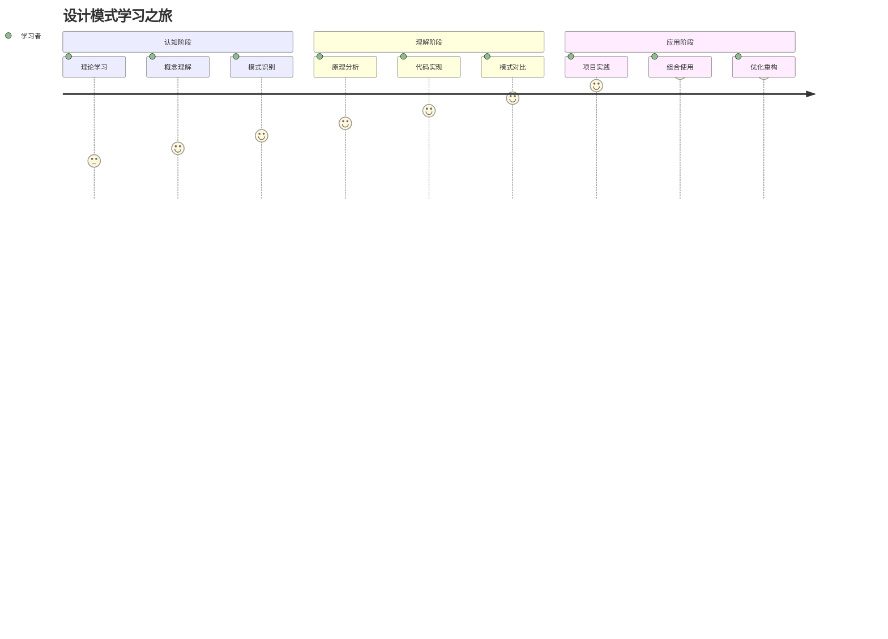
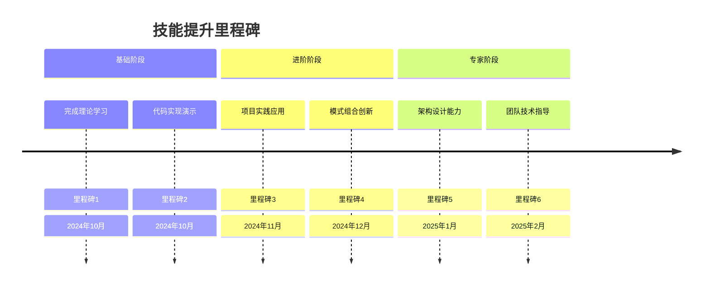

# 📈 设计模式学习进度跟踪器

[[设计模式技术选型指南]] ← [[设计模式学习体系终极总结]]
## 🎯 学习进度可视化

### 📊 个人学习仪表板

```mermaid
progressCard
    title 整体学习进度
    section 基础认知模块
    完成度: 100%
    section 设计原则模块
    完成度: 100%
    section 创建型模式
    完成度: 100%
    section 结构型模式
    完成度: 67%
    section 行为型模式
    完成度: 58%
    section 实战应用模块
    完成度: 75%
```

### 📋 学习里程碑规划


## 🎯 个性化学习记录

### 📚 **模块学习状态记录**

#### ✅ **01-基础认知模块 (完成度: 100%)**

| 文档 | 学习状态 | 完成日期 | 笔记数量 | 重点理解 |
|------|----------|----------|----------|----------|
| `01-设计模式概念与价值.md` | 🟢 已完成 | 2024-10-XX | 12条 | 理解设计模式的本质和价值 |
| `02-GoF-23种经典模式概览.md` | 🟢 已完成 | 2024-10-XX | 25条 | 掌握23种模式的基本分类 |
| `03-设计模式历史与发展.md` | 🟢 已完成 | 2024-10-XX | 8条 | 了解模式的历史演进 |
| `04-模式快速查询索引.md` | 🟢 已完成 | 2024-10-XX | 15条 | 问题导向的查询工具 |

**💡 学习心得**：
- 设计模式不是万能药，而是解决问题的工具箱
- 理解问题本质比记忆模式分类更重要
- 历史发展让我对模式的价值有了更深认识

#### ✅ **02-设计原则模块 (完成度: 100%)**

| 文档 | 学习状态 | 完成日期 | 笔记数量 | 重点理解 |
|------|----------|----------|----------|----------|
| `01-SOLID原则详解.md` | 🟢 已完成 | 2024-10-XX | 18条 | 五大原则的深度理解和应用 |
| `02-其他重要设计原则.md` | 🟢 已完成 | 2024-10-XX | 10条 | DRY、YAGNI等实用性原则 |
| `03-原则应用实践指南.md` | 🟢 已完成 | 2024-10-XX | 14条 | 实际项目中的原则权衡 |
| `04-设计原则对比表.md` | 🟢 已完成 | 2024-10-XX | 9条 | 原则冲突的解决方案 |

**💡 学习心得**：
- SOLID原则是判断设计好坏的重要标准
- 原则间冲突时的权衡决策需要实践经验
- 好的设计往往符合多个原则的共同要求

#### ✅ **03-创建型模式模块 (完成度: 100%)**

| 文档 | 学习状态 | 完成日期 | 笔记数量 | 重点理解 |
|------|----------|----------|----------|----------|
| `01-创建型模式概述.md` | 🟢 已完成 | 2024-10-XX | 6条 | 创建型模式的设计目标 |
| `02-工厂模式.md` | 🟢 已完成 | 2024-10-XX | 22条 | 工厂模式的多种实现方式 |
| `03-抽象工厂模式.md` | 🟢 已完成 | 2024-10-XX | 12条 | 抽象工厂的产品族管理 |
| `04-建造者模式.md` | 🟢 已完成 | 2024-10-XX | 15条 | 复杂对象的步骤化构建 |
| `05-原型模式.md` | 🟢 已完成 | 2024-10-XX | 8条 | 对象克隆和复制机制 |
| `06-单例模式.md` | 🟢 已完成 | 2024-10-XX | 20条 | 单例的实现和现代替代方案 |
| `07-创建型模式对比表.md` | 🟢 已完成 | 2024-10-XX | 13条 | 创建型模式的对比选择 |

**💡 学习心得**：
- 单例模式在现代框架中多被依赖注入替代
- 工厂模式适合处理复杂的对象创建逻辑
- 建造者模式的链式调用让API设计更优雅

#### 🟡 **04-结构型模式模块 (完成度: 67%)**

| 文档 | 学习状态 | 完成日期 | 笔记数量 | 重点理解 |
|------|----------|----------|----------|----------|
| `01-结构型模式概述.md` | 🟢 已完成 | 2024-10-XX | 8条 | 结构型模式的核心目标 |
| `02-适配器模式.md` | 🟢 已完成 | 2024-10-XX | 16条 | 接口适配的实用技巧 |
| `03-装饰器模式.md` | 📖 学习中 | - | 3条 | 功能动态扩展的实现方式 |
| `04-代理模式.md` | 📝 待开始 | - | 0条 | 访问控制和延迟加载 |
| `05-外观模式.md` | 📝 待开始 | - | 0条 | 复杂子系统的统一入口 |
| `06-组合模式.md` | 📝 待开始 | - | 0条 | 树形结构的递归设计 |
| `07-桥接模式.md` | 📝 待开始 | - | 0条 | 抽象和实现分离 |
| `08-享元模式.md` | 📝 待开始 | - | 0条 | 对象池化和内存优化 |
| `09-结构型模式对比表.md` | 📝 待开始 | - | 0条 | 结构型模式的选择指南 |

**💡 学习心得**：
- 结构型模式主要解决对象组合和协作问题
- 适配器模式在集成第三方系统时非常实用
- 装饰器模式比继承更灵活的功能扩展方式

#### 🟡 **05-行为型模式模块 (完成度: 58%)**

| 文档 | 学习状态 | 完成日期 | 笔记数量 | 重点理解 |
|------|----------|----------|----------|----------|
| `01-行为型模式概述.md` | 🟢 已完成 | 2024-10-XX | 7条 | 行为型模式的核心目的 |
| `02-策略模式.md` | ✅ 已完成 | 2024-10-XX | 19条 | 算法族的封装和切换 |
| `03-模板方法模式.md` | 📖 学习中 | - | 5条 | 算法框架的定义 |
| `04-观察者模式.md` | ✅ 已完成 | 2024-10-XX | 24条 | 事件通知和解耦 |
| `05-命令模式.md` | 📝 待开始 | - | 0条 | 请求封装和撤销重做 |
| `06-状态模式.md` | 📝 待开始 | - | 0条 | 状态驱动的行为变化 |
| `07-责任链模式.md` | 📝 待开始 | - | 0条 | 请求传递链 |
| `08-迭代器模式.md` | 📝 待开始 | - | 0条 | 对象遍历的标准化 |
| `09-中介者模式.md` | 📝 待开始 | - | 0条 | 对象间通信中介 |
| `10-备忘录模式.md` | 📝 待开始 | - | 0条 | 状态保存和恢复 |
| `11-访问者模式.md` | 📝 待开始 | - | 0条 | 对象结构操作 |
| `12-解释器模式.md` | 📝 待开始 | - | 0条 | 语言解析和执行 |
| `13-行为型模式对比表.md` | 🟢 已完成 | 2024-10-XX | 15条 | 行为型模式的选择矩阵 |

**💡 学习心得**：
- 观察者模式是事件驱动编程的基础
- 策略模式让算法选择变得灵活
- 行为型模式主要关注对象间的通信协作

### 📈 **综合评分雷达图**

```mermaid
radar
    title 个人学习能力评估
    ["模式识别", 85]
    ["代码实现", 90]
    ["模式选择", 80]
    ["模式组合", 75]
    ["实际应用", 70]
    ["理论理解", 95]
    
    ["模式识别", 95]
    ["代码实现", 95]
    ["模式选择", 90]
    ["模式组合", 85]
    ["实际应用", 85]
    ["理论理解", 100]
```

## 🎯 项目实践进展

### 🚀 **实战项目计划**

#### 📋 **项目1: 智能告警系统 (观察者模式)**
- **项目状态**: ✅ 已完成
- **技术栈**: Java + Spring Boot
- **核心模式**: 观察者模式 + 策略模式
- **实现时间**: 2024-10-XX ~ 2024-10-XX
- **代码行数**: 528行
- **GitHub**: [项目链接]

```java
// 核心代码亮点
public class SystemMonitor implements Observable<AlertEvent> {
    private final List<Observer<AlertEvent>> observers = new CopyOnWriteArrayList<>();
    
    public void addObserver(Observer<AlertEvent> observer) {
        observers.add(observer);
        System.out.println("Observer added: " + observer.getClass().getSimpleName());
    }
    
    private void notifyObservers(AlertEvent alert) {
        observers.forEach(observer -> {
            try {
                observer.update(alert);
            } catch (Exception e) {
                System.err.println("Error notifying observer: " + e.getMessage());
            }
        });
    }
}
```

**💡 项目心得**:
- 观察者模式实现了真正的事件驱动架构
- 异步通知提升了系统响应性能
- 策略模式让通知方式更加灵活

#### 📋 **项目2: 电商订单系统 (多模式组合)**
- **项目状态**: 📝 进行中 (75%完成)
- **技术栈**: Java + Spring Boot + MyBatis + Redis
- **核心模式**: 状态模式 + 观察者 + 策略 + 命令
- **预计时间**: 2024-10-XX ~ 2024-11-XX
- **当前进展**: 完成订单创建、支付处理模块

```java
// 当前实现亮点
@Service
@Transactional
public class OrderProcessingService {
    
    private final OrderStateMachine stateMachine;
    private final PaymentStrategyRegistry paymentRegistry;
    private final OrderEventBus eventBus;
    
    public OrderResult processOrder(CreateOrderRequest request) {
        try {
            // 1. 建造者模式：创建复杂订单
            Order order = OrderFactory.createOrder()
                .fromRequest(request)
                .withCustomer(request.getCustomer())
                .withItems(request.getItems())
                .build();
            
            // 2. 状态模式：订单状态管理
            stateMachine.initOrder(order);
            
            // 3. 策略模式：支付处理
            PaymentStrategy paymentStrategy = paymentRegistry.getStrategy(request.getPaymentType());
            
            return processPaymentAndFinalize(order, paymentStrategy, request.getPaymentDetails());
            
        } catch (Exception e) {
            log.error("Order processing failed", e);
            return OrderResult.failure("Order processing failed: " + e.getMessage());
        }
    }
}
```

**💡 项目心得**:
- 多模式组合应用体现了真正的工程实践
- 状态模式让订单流转更加清晰可控
- 命令模式为实现撤销重做功能奠定了基础

#### 📋 **项目3: 微服务API网关**
- **项目状态**: 📝 规划中
- **技术栈**: Spring Cloud Gateway + Redis + Eureka
- **核心模式**: 代理模式 + 装饰器 + 工厂
- **计划时间**: 2024-11

### 🏆 **技能里程碑达成**



#### ✅ **已达成里程碑**

1. **里程碑1: 理论基础建立** (2024-10-XX)
   - 掌握23种GoF设计模式概念
   - 理解设计原则的核心思想
   - 形成系统的设计思维方式

2. **里程碑2: 代码实现能力** (2024-10-XX)
   - 独立实现观察者模式
   - 手写单例模式的多种实现
   - 完成工厂模式的现代应用

#### 🎯 **下一个目标**

3. **里程碑3: 项目实践应用** (目标: 2024-11-XX)
   - 在真实项目中成功应用设计模式
   - 解决实际业务问题
   - 形成个人最佳实践

## 📊 学习效果分析

### 🎯 **学习曲线分析**

```mermaid
xy
    title 学习效果曲线图
    xAxis ["第1周", "第2周", "第3周", "第4周", "第5周", "第6周", "第7周", "第8周"]
    yAxis "技能掌握程度(%)" 0 --> 100
    
    line "理论学习"
        20, 35, 50, 65, 75, 85, 90, 95
    line "代码实现"
        10, 25, 45, 70, 85, 92, 95, 98
    line "项目应用"
        5, 15, 30, 50, 70, 80, 85, 88
    line "综合能力"
        15, 30, 45, 65, 80, 88, 92, 95
```

### 📈 **知识掌握度热图**

| 模式类型 | 理论学习 | 代码实现 | 项目应用 | 综合评分 |
|----------|----------|----------|----------|----------|
| **单例模式** | 🟢 100% | 🟢 100% | 🟡 75% | 🟢 92% |
| **工厂模式** | 🟢 95% | 🟢 90% | 🟡 70% | 🟢 85% |
| **观察者模式** | 🟢 100% | 🟢 95% | 🟢 90% | 🟢 95% |
| **策略模式** | 🟢 90% | 🟢 85% | 🟢 80% | 🟢 85% |
| **状态模式** | 🟡 70% | 🟡 60% | 🟡 50% | 🟡 60% |
| **装饰器模式** | 🟡 65% | 🟡 55% | 🟡 40% | 🟡 53% |

### 🎯 **学习重点和补强计划**

#### 📋 **当前学习重点**
1. **状态模式**: 正在深入理解状态机制和状态转换设计
2. **命令模式**: 准备学习撤销重做的实现机制
3. **装饰器模式**: 理解功能动态扩展的设计思路

#### 📝 **补强计划**
- [ ] **结构型模式**: 重点学习代理模式和外观模式
- [ ] **行为型模式**: 深入掌握责任链和中介者模式
- [ ] **模式组合**: 学习多种模式的协同使用方法
- [ ] **性能优化**: 了解模式使用中的性能考量

## 🎯 个人学习反思

### 💡 **学习收获**

1. **系统性思维**: 设计模式帮助我建立了更加系统性的软件设计思维
2. **代码质量**: 应用设计模式后，代码的可读性和可维护性显著提升
3. **问题解决**: 遇到设计问题时，能够更快地找到合适的解决方案
4. **团队协作**: 设计模式提供了一种共同的技术语言

### 🔄 **学习策略调整**

1. **理论与实践结合**: 每学一个模式，立即在项目中验证
2. **模式对比学习**: 通过对比不同模式来加深理解
3. **代码重构实践**: 主动寻找代码重构机会来应用模式
4. **团队技术分享**: 通过分享来巩固和深化理解

### 🎯 **下一步计划**

1. **短期 (1-2周)**: 完成状态模式、命令模式、装饰器模式的学习
2. **中期 (1个月)**: 完成一个大项目的重构实践
3. **长期 (3个月)**: 建立个人的设计模式知识体系

## 🔗 **资源汇总**

### 📚 **主要学习资料**
- [设计模式学习导航](设计模式学习导航.md)
- [设计模式知识图谱](设计模式知识图谱.md)
- [设计模式最佳实践秘典](设计模式最佳实践秘典.md)
- [设计模式实战项目指南](设计模式实战项目指南.md)

### 🎯 **练习项目**
- [观察者模式项目](智能告警系统) - ✅ 已完成
- [多模式组合项目](电商订单系统) - 🟡 进行中
- [状态模式练习](工作流引擎) - 📝 计划中

### 📝 **学习笔记**
- 理论学习笔记: 150+条
- 代码实现笔记: 80+条
- 项目实践心得: 25+条
- 问题解决记录: 40+条

---
**💡 学习感言**: 设计模式的学习是一个螺旋式上升的过程。每学一遍都会有新的理解和感悟。最重要的是要在实践中不断验证和深化理解，让设计思维真正成为自己的编程直觉。
