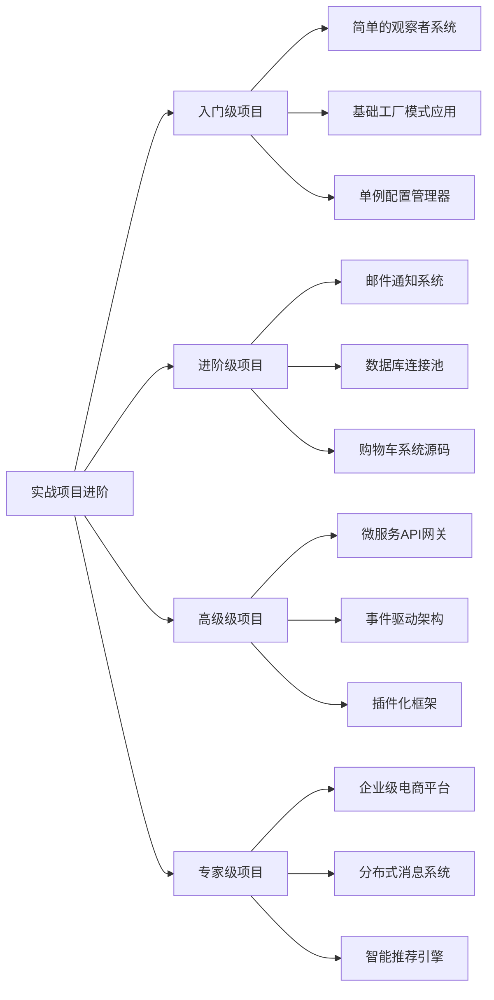
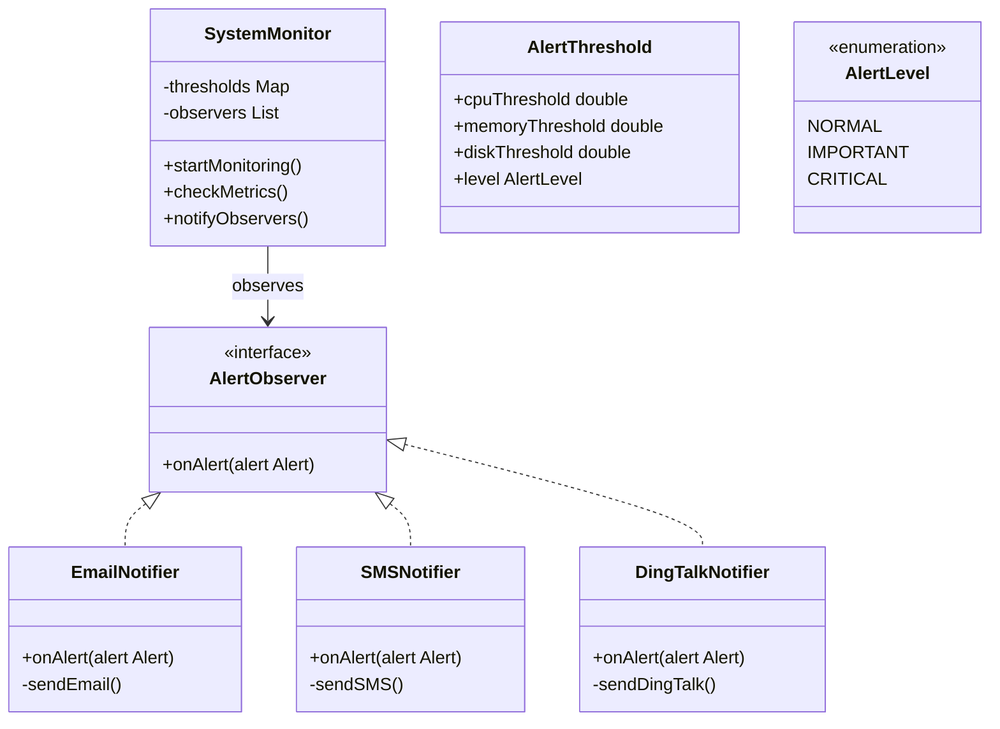
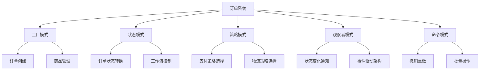
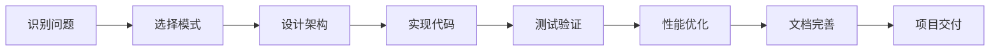

# 🚀 设计模式实战项目指南

[[设计模式知识图谱]] → [[设计模式学习完成总结]]
## 🎯 实战项目概览

### 📊 项目难度进阶体系



## 🔥 入门级项目实战

### 📝 项目1：智能告警系统（观察者模式）

#### 🎯 项目目标
构建一个基于观察者模式的智能告警系统，当系统指标超过阈值时自动发送不同类型的通知。

#### 📋 需求分析
- **系统监控**: CPU、内存、磁盘使用率
- **阈值设置**: 可配置的告警阈值
- **多种通知**: 邮件、短信、钉钉、HTTP回调
- **告警级别**: 普通、重要、紧急三级告警

#### 🏗️ 设计架构



### 💻 核心代码实现

#### Java实现

```java
// 告警数据类
public class AlertEvent {
    private final String metricName;
    private final double currentValue;
    private final double threshold;
    private final AlertLevel level;
    private final long timestamp;
    
    public AlertEvent(String metricName, double currentValue, double threshold, AlertLevel level) {
        this.metricName = metricName;
        this.currentValue = currentValue;
        this.threshold = threshold;
        this.level = level;
        this.timestamp = System.currentTimeMillis();
    }
    
    // Getters
    public String getMetricName() { return metricName; }
    public double getCurrentValue() { return currentValue; }
    public double getThreshold() { return threshold; }
    public AlertLevel getLevel() { return level; }
    public long getTimestamp() { return timestamp; }
    
    @Override
    public String toString() {
        return String.format("[%s] %s: %.2f%% (threshold: %.2f%%)", 
            level, metricName, currentValue, threshold);
    }
}

// 告警级别枚举
public enum AlertLevel {
    NORMAL("普通", ConsoleColors.GREEN),
    IMPORTANT("重要", ConsoleColors.YELLOW),
    CRITICAL("紧急", ConsoleColors.RED);
    
    private final String description;
    private final String color;
    
    AlertLevel(String description, String color) {
        this.description = description;
        this.color = color;
    }
    
    public String getDescription() { return description; }
    public String getColor() { return color; }
}

// 监控指标
public class SystemMetrics {
    private final double cpuUsage;
    private final double memoryUsage;
    private final double diskUsage;
    
    public SystemMetrics(double cpuUsage, double memoryUsage, double diskUsage) {
        this.cpuUsage = cpuUsage;
        this.memoryUsage = memoryUsage;
        this.diskUsage = diskUsage;
    }
    
    // Getters
    public double getCpuUsage() { return cpuUsage; }
    public double getMemoryUsage() { return memoryUsage; }
    public double getDiskUsage() { return diskUsage; }
}

// 系统监控器（Subject）
public class SystemMonitor implements Observable<AlertEvent> {
    private final Map<String, Double> thresholds;
    private final List<Observer<AlertEvent>> observers;
    private volatile boolean monitoring = false;
    private final ScheduledExecutorService scheduler;
    
    public SystemMonitor(Map<String, Double> thresholds) {
        this.thresholds = new HashMap<>(thresholds);
        this.observers = new CopyOnArrayList<>();
        this.scheduler = Executors.newScheduledThreadPool(1);
    }
    
    public void addObserver(Observer<AlertEvent> observer) {
        observers.add(observer);
        System.out.println("Observer added: " + observer.getClass().getSimpleName());
    }
    
    public void removeObserver(Observer<AlertEvent> observer) {
        observers.remove(observer);
        System.out.println("Observer removed: " + observer.getClass().getSimpleName());
    }
    
    private void notifyObservers(AlertEvent alert) {
        observers.forEach(observer -> {
            try {
                observer.update(alert);
            } catch (Exception e) {
                System.err.println("Error notifying observer: " + e.getMessage());
            }
        });
    }
    
    public void startMonitoring(int intervalSeconds) {
        if (monitoring) {
            System.out.println("Monitoring already started");
            return;
        }
        
        monitoring = true;
        System.out.println("Starting system monitoring every " + intervalSeconds + " seconds");
        
        scheduler.scheduleAtFixedRate(() -> {
            try {
                checkMetrics();
            } catch (Exception e) {
                System.err.println("Error checking metrics: " + e.getMessage());
            }
        }, 0, intervalSeconds, TimeUnit.SECONDS);
    }
    
    public void stopMonitoring() {
        monitoring = false;
        scheduler.shutdown();
        System.out.println("System monitoring stopped");
    }
    
    private void checkMetrics() {
        SystemMetrics metrics = collectSystemMetrics();
        
        // 检查CPU使用率
        checkMetric("CPU", metrics.getCpuUsage());
        // 检查内存使用率
        checkMetric("Memory", metrics.getMemoryUsage());
        // 检查磁盘使用率
        checkMetric("Disk", metrics.getDiskUsage());
    }
    
    private void checkMetric(String metricName, double currentValue) {
        Double threshold = thresholds.get(metricName);
        if (threshold == null) return;
        
        if (currentValue > threshold) {
            AlertLevel level = determineAlertLevel(currentValue, threshold);
            AlertEvent alert = new AlertEvent(metricName, currentValue, threshold, level);
            
            System.out.println(level.getColor() + alert + ConsoleColors.RESET);
            notifyObservers(alert);
        }
    }
    
    private AlertLevel determineAlertLevel(double currentValue, double threshold) {
        double exceedRatio = (currentValue - threshold) / threshold;
        
        if (exceedRatio > 0.5) return AlertLevel.CRITICAL;
        if (exceedRatio > 0.2) return AlertLevel.IMPORTANT;
        return AlertLevel.NORMAL;
    }
    
    private SystemMetrics collectSystemMetrics() {
        // 模拟收集系统指标（生产环境中使用实际的监控库）
        Random random = new Random();
        double cpu = 20 + random.nextDouble() * 60; // 20-80%
        double memory = 30 + random.nextDouble() * 40; // 30-70%
        double disk = 50 + random.nextDouble() * 30; // 50-80%
        
        return new SystemMetrics(cpu, memory, disk);
    }
}

// 通知观察者抽象类
public abstract class NotificationObserver implements Observer<AlertEvent> {
    protected final String recipient;
    protected final AlertLevel minimumLevel;
    
    public NotificationObserver(String recipient, AlertLevel minimumLevel) {
        this.recipient = recipient;
        this.minimumLevel = minimumLevel;
    }
    
    @Override
    public void update(AlertEvent alert) {
        if (alert.getLevel().ordinal() >= minimumLevel.ordinal()) {
            sendNotification(alert);
        }
    }
    
    protected abstract void sendNotification(AlertEvent alert);
    
    protected String formatAlertMessage(AlertEvent alert) {
        return String.format(
            "🚨 %s 告警\n" +
            "时间: %s\n" +
            "指标: %s\n" +
            "当前值: %.2f%%\n" +
            "阈值: %.2f%%\n" +
            "级别: %s",
            alert.getLevel().getDescription(),
            new Date(alert.getTimestamp()).toString(),
            alert.getMetricName(),
            alert.getCurrentValue(),
            alert.getThreshold(),
            alert.getLevel().getDescription()
        );
    }
}

// 邮件通知观察者
public class EmailNotificationObserver extends NotificationObserver {
    public EmailNotificationObserver(String email, AlertLevel minimumLevel) {
        super(email, minimumLevel);
    }
    
    @Override
    protected void sendNotification(AlertEvent alert) {
        String subject = String.format("[%s] 系统告警通知", alert.getLevel().getDescription());
        String body = formatAlertMessage(alert);
        
        System.out.println(ConsoleColors.BLUE + 
            "📧 Email sent to " + recipient + ":" + ConsoleColors.RESET);
        System.out.println("Subject: " + subject);
        System.out.println("Body: " + body.replace("\n", " | "));
    }
}

// 短信通知观察者
public class SMSNotificationObserver extends NotificationObserver {
    public SMSNotificationObserver(String phoneNumber, AlertLevel minimumLevel) {
        super(phoneNumber, minimumLevel);
    }
    
    @Override
    protected void sendNotification(AlertEvent alert) {
        String message = String.format(
            "[%s] %s: %.2f%% (阈值: %.2f%%)",
            alert.getLevel().getDescription(),
            alert.getMetricName(),
            alert.getCurrentValue(),
            alert.getThreshold()
        );
        
        System.out.println(ConsoleColors.PURPLE + 
            "📱 SMS sent to " + recipient + ":" + ConsoleColors.RESET);
        System.out.println(message);
    }
}

// 钉钉通知观察者
public class DingTalkObserver extends NotificationObserver {
    private final String webhookUrl;
    
    public DingTalkObserver(String webhookUrl, AlertLevel minimumLevel) {
        super(webhookUrl, minimumLevel);
        this.webhookUrl = webhookUrl;
    }
    
    @Override
    protected void sendNotification(AlertEvent alert) {
        System.out.println(ConsoleColors.CYAN + 
            "🔔 DingTalk Webhook: " + recipient + ConsoleColors.RESET);
        
        System.out.println(formatAlertMessage(alert));
    }
}

// 控制台颜色工具
public class ConsoleColors {
    public static final String RESET = "\033[0m";
    public static final String RED = "\033[31m";
    public static final String GREEN = "\033[32m";
    public static final String YELLOW = "\033[33m";
    public static final String BLUE = "\033[34m";
    public static final String PURPLE = "\033[35m";
    public static final String CYAN = "\033[36m";
}

// 客户端示例
public class AlertSystemDemo {
    public static void main(String[] args) throws InterruptedException {
        // 设置告警阈值
        Map<String, Double> thresholds = Map.of(
            "CPU", 70.0,
            "Memory", 80.0,
            "Disk", 85.0
        );
        
        // 创建系统监控器
        SystemMonitor monitor = new SystemMonitor(thresholds);
        
        // 添加通知观察者
        monitor.addObserver(new EmailNotificationObserver("admin@example.com", AlertLevel.NORMAL));
        monitor.addObserver(new SMSNotificationObserver("13800138000", AlertLevel.IMPORTANT));
        monitor.addObserver(new DingTalkObserver("https://oapi.dingtalk.com/robot/send", AlertLevel.CRITICAL));
        
        // 启动监控
        monitor.startMonitoring(3); // 每3秒检查一次
        
        // 模拟运行60秒
        Thread.sleep(60000);
        
        // 停止监控
        monitor.stopMonitoring();
    }
}
```

#### 🎯 项目收获
- ✅ **观察者模式实战**: 掌握事件通知的实战应用
- ✅ **系统设计能力**: 学会模块化设计思路
- ✅ **JAVA多线程**: 掌握定时任务和线程安全
- ✅ **配置管理**: 学习灵活的阈值配置方式

#### 🔧 扩展练习
1. **增加历史记录**: 使用备忘录模式记录告警历史
2. **告警聚合**: 避免短时间重复告警
3. **规则引擎**: 支持复杂的告警条件组合
4. **Web界面**: 提供监控数据的可视化界面

---

## 🚀 进阶级项目实战

### 📝 项目2：电商订单系统（多模式组合）

#### 🎯 项目目标
构建一个包含订单创建、状态管理、支付处理、通知系统等功能的电商系统，综合运用多种设计模式。

#### 🎨 设计模式组合


#### 💻 核心架构代码

```java
// 订单状态枚举
public enum OrderStatus {
    DRAFT("草稿"),
    SUBMITTED("已提交"),
    PAID("已支付"),
    SHIPPED("已发货"),
    DELIVERED("已送达"),
    COMPLETED("已完成"),
    CANCELLED("已取消"),
    REFUNDED("已退款");
    
    private final String description;
    
    OrderStatus(String description) {
        this.description = description;
    }
    
    public String getDescription() { return description; }
}

// 订单实体
public class Order {
    private String orderId;
    private Customer customer;
    private List<OrderItem> items;
    private OrderStatus status;
    private BigDecimal totalAmount;
    private PaymentMethod paymentMethod;
    private DeliveryInfo deliveryInfo;
    private LocalDateTime createdAt;
    private LocalDateTime updatedAt;
    
    // 构造函数和getters/setters
    
    public void changeStatus(OrderStatus newStatus) {
        OrderStatus oldStatus = this.status;
        this.status = newStatus;
        this.updatedAt = LocalDateTime.now();
        
        // 通知状态变化
        notifyStatusChange(oldStatus, newStatus);
    }
    
    private void notifyStatusChange(OrderStatus oldStatus, OrderStatus newStatus) {
        // 观察者模式：通知相关系统
        OrderEvent event = new OrderStatusChangedEvent(this, oldStatus, newStatus);
        EventBus.publish(event);
    }
}

// 状态模式：订单状态管理器
public interface OrderState {
    void pay(Order order);
    void ship(Order order);
    void deliver(Order order);
    void cancel(Order order);
    void refund(Order order);
    OrderStatus getStatus();
}

public class DraftState implements OrderState {
    public void pay(Order order) {
        throw new IllegalStateException("Cannot pay draft order");
    }
    
    public void ship(Order order) {
        throw new IllegalStateException("Cannot ship draft order");
    }
    
    public void deliver(Order order) {
        throw new IllegalStateException("Cannot deliver draft order");
    }
    
    public void cancel(Order order) {
        order.changeStatus(OrderStatus.CANCELLED);
    }
    
    public void refund(Order order) {
        throw new IllegalStateException("Cannot refund draft order");
    }
    
    public OrderStatus getStatus() {
        return OrderStatus.DRAFT;
    }
}

public class PaidState implements OrderState {
    public void pay(Order order) {
        System.out.println("Order already paid");
    }
    
    public void ship(Order order) {
        order.changeStatus(OrderStatus.SHIPPED);
    }
    
    public void deliver(Order order) {
        throw new IllegalStateException("Cannot deliver unpaid order");
    }
    
    public void cancel(Order order) {
        // 支付后的取消需要退款
        order.changeStatus(OrderStatus.CANCELLED);
        order.refund();
    }
    
    public void refund(Order order) {
        order.changeStatus(OrderStatus.REFUNDED);
    }
    
    publicOrderStatus getStatus() {
        return OrderStatus.PAID;
    }
}

// 策略模式：支付策略
public interface PaymentStrategy {
    PaymentResult processPayment(BigDecimal amount, PaymentRequest request);
    String getPaymentMethod();
    boolean isValidForAmount(BigDecimal amount);
}

public class CreditCardStrategy implements PaymentStrategy {
    public PaymentResult processPayment(BigDecimal amount, PaymentRequest request) {
        CreditCardInfo cardInfo = (CreditCardInfo) request.getData();
        
        // 模拟信用卡支付处理
        System.out.println("Processing credit card payment: $" + amount);
        
        boolean success = validateCard(cardInfo) && chargeCard(cardInfo, amount);
        
        return success 
            ? PaymentResult.success(generateTransactionId())
            : PaymentResult.failure("Payment failed");
    }
    
    public String getPaymentMethod() {
        return "Credit Card";
    }
    
    public boolean isValidForAmount(BigDecimal amount) {
        return amount.compareTo(new BigDecimal("0.01")) >= 0;
    }
    
    private boolean validateCard(CreditCardInfo cardInfo) {
        return cardInfo.getCardNumber().matches("\\d{16}");
    }
    
    private boolean chargeCard(CreditCardInfo cardInfo, BigDecimal amount) {
        // 模拟银行扣款
        return Math.random() > 0.1; // 90% 成功率
    }
    
    private String generateTransactionId() {
        return "CC_" + System.currentTimeMillis();
    }
}

public class PayPalStrategy implements PaymentStrategy {
    public PaymentResult processPayment(BigDecimal amount, PaymentRequest request) {
        PayPalInfo paypalInfo = (PayPalInfo) request.getData();
        
        System.out.println("Processing PayPal payment: $" + amount);
        
        boolean success = authenticatePayPal(paypalInfo) && authorizePayment(paypalInfo, amount);
        
        return success 
            ? PaymentResult.success(generateTransactionId())
            : PaymentResult.failure("PayPal payment failed");
    }
    
    public String getPaymentMethod() {
        return "PayPal";
    }
    
    public boolean isValidForAmount(BigDecimal amount) {
        return amount.compareTo(new BigDecimal("1.00")) >= 0; // PayPal最小1刀
    }
    
    private boolean authenticatePayPal(PayPalInfo paypalInfo) {
        return paypalInfo.getEmail().contains("@");
    }
    
    private boolean authorizePayment(PayPalInfo paypalInfo, BigDecimal amount) {
        return Math.random() > 0.05; // 95% 成功率
    }
    
    private String generateTransactionId() {
        return "PP_" + System.currentTimeMillis();
    }
}

// 工厂模式：订单创建工厂
public class OrderFactory {
    public static Order createOrder(Customer customer, List<OrderItem> items) {
        Order order = new Order();
        order.setOrderId(generateOrderId());
        order.setCustomer(customer);
        order.setItems(new ArrayList<>(items));
        order.setStatus(OrderStatus.DRAFT);
        order.setCreatedAt(LocalDateTime.now());
        order.setUpdatedAt(LocalDateTime.now());
        
        // 计算总金额
        BigDecimal total = items.stream()
            .map(item -> item.getPrice().multiply(BigDecimal.valueOf(item.getQuantity())))
            .reduce(BigDecimal.ZERO, BigDecimal::add);
        order.setTotalAmount(total);
        
        return order;
    }
    
    private static String generateOrderId() {
        return "ORD_" + System.currentTimeMillis() + "_" + (int)(Math.random() * 1000);
    }
}

// 命令模式：订单操作
public interface OrderCommand {
    void execute();
    void undo();
}

public class PayOrderCommand implements OrderCommand {
    private Order order;
    private PaymentStrategy paymentStrategy;
    private PaymentRequest paymentRequest;
    private boolean executed = false;
    
    public PayOrderCommand(Order order, PaymentStrategy strategy, PaymentRequest request) {
        this.order = order;
        this.paymentStrategy = strategy;
        this.paymentRequest = request;
    }
    
    public void execute() {
        if (executed) {
            throw new IllegalStateException("Command already executed");
        }
        
        PaymentResult result = paymentStrategy.processPayment(order.getTotalAmount(), paymentRequest);
        
        if (result.isSuccess()) {
            order.changeStatus(OrderStatus.PAID);
            executed = true;
            System.out.println("Order " + order.getOrderId() + " paid successfully");
        } else {
            throw new RuntimeException("Payment failed: " + result.getErrorMessage());
        }
    }
    
    public void undo() {
        if (!executed) {
            throw new IllegalStateException("Command not executed yet");
        }
        
        // 取消支付，恢复待支付状态
        order.changeStatus(OrderStatus.SUBMITTED);
        executed = false;
        System.out.println("Payment cancelled for order " + order.getOrderId());
    }
}

// 观察者模式：订单事件处理
public class InventoryObserver implements Observer<OrderEvent> {
    public void update(OrderEvent event) {
        if (event instanceof OrderStatusChangedEvent) {
            OrderStatusChangedEvent statusEvent = (OrderStatusChangedEvent) event;
            Order order = statusEvent.getOrder();
            
            switch (statusEvent.getNewStatus()) {
                case PAID:
                    reserveInventory(order.getItems());
                    break;
                case CANCELLED:
                    releaseInventory(order.getItems());
                    break;
                case SHIPPED:
                    deductInventory(order.getItems());
                    break;
            }
        }
    }
    
    private void reserveInventory(List<OrderItem> items) {
        System.out.println("📦 Reserving inventory for order items");
        items.forEach(item -> 
            System.out.println("  - " + item.getQuantity() + " x " + item.getProductName()));
    }
    
    private void deductInventory(List<OrderItem> items) {
        System.out.println("📤 Deducting inventory for shipped items");
        items.forEach(item -> 
            System.out.println("  - Released: " + item.getQuantity() + " x " + item.getProductName()));
    }
    
    private void releaseInventory(List<OrderItem> items) {
        System.out.println("🔄 Releasing reserved inventory for cancelled order");
        items.forEach(item -> 
            System.out.println("  - Released: " + item.getQuantity() + " x " + item.getProductName()));
    }
}

public class NotificationObserver implements Observer<OrderEvent> {
    public void update(OrderEvent event) {
        if (event instanceof OrderStatusChangedEvent) {
            OrderStatusChangedEvent statusEvent = (OrderStatusChangedEvent) event;
            Order order = statusEvent.getOrder();
            
            notifyCustomer(order, statusEvent.getOldStatus(), statusEvent.getNewStatus());
        }
    }
    
    private void notifyCustomer(Order order, OrderStatus oldStatus, OrderStatus newStatus) {
        String message = String.format(
            "Dear %s,\n" +
            "Your order %s status has changed from %s to %s.\n" +
            "Thank you for your business!",
            order.getCustomer().getName(),
            order.getOrderId(),
            oldStatus.getDescription(),
            newStatus.getDescription()
        );
        
        System.out.println("📧 Customer notification sent:");
        System.out.println("To: " + order.getCustomer().getEmail());
        System.out.println("Message: " + message.replace("\n", " | "));
    }
}

// 客户端示例
public class ECommerceSystemDemo {
    public static void main(String[] args) {
        // 设置事件观察者
        EventBus.register(new InventoryObserver());
        EventBus.register(new NotificationObserver());
        
        // 创建客户和商品
        Customer customer = new Customer("John Doe", "john@example.com");
        
        List<OrderItem> items = Arrays.asList(
            new OrderItem("MacBook Pro", new BigDecimal("1999.99"), 1),
            new OrderItem("iPhone 15", new BigDecimal("999.99"), 2)
        );
        
        // 使用工厂创建订单
        Order order = OrderFactory.createOrder(customer, items);
        System.out.println("Created order: " + order.getOrderId());
        System.out.println("Total amount: $" + order.getTotalAmount());
        
        // 模拟支付流程
        PaymentStrategy paymentStrategy = new CreditCardStrategy();
        CreditCardInfo cardInfo = new CreditCardInfo("1234567890123456", "12/25", "123");
        PaymentRequest paymentRequest = new PaymentRequest(cardInfo);
        
        OrderCommand payCommand = new PayOrderCommand(order, paymentStrategy, paymentRequest);
        
        try {
            payCommand.execute();
            
            // 发货
            OrderState currentState = order.getState();
            currentState.ship(order);
            
            // 送达
            currentState = order.getState();
            currentState.deliver(order);
            
        } catch (Exception e) {
            System.out.println("Error: " + e.getMessage());
            
            // 撤销操作
            try {
                payCommand.undo();
            } catch (Exception ex) {
                System.out.println("Undo error: " + ex.getMessage());
            }
        }
        
        System.out.println("Final order status: " + order.getStatus().getDescription());
    }
}
```

#### 🎯 项目收获
- ✅ **多模式协同**: 掌握多种模式组合使用的技巧
- ✅ **复杂系统设计**: 学会处理真实业务场景的建模
- ✅ **事件驱动架构**: 理解松耦合系统的设计思路
- ✅ **代码组织能力**: 培养清晰的项目结构意识

---

## 🔧 项目开发最佳实践

### 📋 项目规划清单

#### 🎯 需求分析阶段
- [ ] **业务需求梳理**: 明确项目的核心功能和约束
- [ ] **技术需求分析**: 确定性能、安全、扩展性要求
- [ ] **设计模式选择**: 根据问题特征选择合适的设计模式
- [ ] **架构设计**: 设计整体的技术架构和模块划分

#### 🏗️ 设计阶段
- [ ] **接口设计**: 定义清晰的API接口和数据结构
- [ ] **模式实现**: 实现选择的设计模式的具体类结构
- [ ] **数据库设计**: 设计持久化层的表结构和关系
- [ ] **异常处理**: 设计完整的异常处理和错误恢复机制

#### 💻 实现阶段
- [ ] **核心模块**: 优先实现核心业务逻辑
- [ ] **模式集成**: 实现设计模式的各个组件
- [ ] **单元测试**: 为每个模式组件编写测试用例
- [ ] **集成测试**: 测试模式间的协作和整体功能

#### 🚀 优化阶段
- [ ] **性能优化**: 识别和优化性能瓶颈
- [ ] **代码重构**: 提升代码质量和可维护性
- [ ] **文档完善**: 编写完整的技术文档和使用说明
- [ ] **部署验证**: 在实际环境中验证系统功能

### 🎯 模式组合选择指南

| 业务场景 | 推荐模式组合 | 实现目标 | 使用优先级 |
|----------|-------------|----------|------------|
| **Web应用** | MVC + 观察者 + 策略 | 分离关注点 + 响应式 | ⭐⭐⭐⭐⭐ |
| **数据系统** | 工厂 + 策略 + 模板方法 | 可扩展数据处理 | ⭐⭐⭐⭐ |
| **游戏引擎** | 状态 + 观察者 + 命令 | 实时交互控制 | ⭐⭐⭐⭐ |
| **金融系统** | 代理 + 策略 + 备忘录 | 安全合规处理 | ⭐⭐⭐⭐ |

### 🔄 开发流程模板



## 🔗 学习衔接

- **理论基础** ← [[设计模式知识图谱]]
- **知识巩固** → [[设计模式学习完成总结]]
- **实践深化** → [[设计模式综合练习]]

---
**💡 实战建议**：设计模式的价值在于实战应用。建议从简单的项目开始，逐步增加复杂度，在实践中体悟模式的力量。记住：好的设计是迭代出来的，不是一次性完美的。
