# 🧠 设计模式思维导图大全

[[设计模式知识图谱]] ← → [[设计模式学习体系终极总结]]
## 🎯 思维导图导航中心

### 📊 导图分类体系

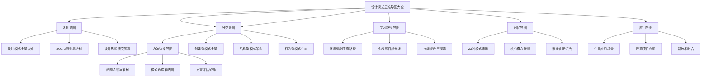

## 🧭 一、认知导图系列

### 🎯 设计模式全景认知导图

```mermaid
mindmap
  root)(设计模式全景)
    核心问题
      软件复杂性问题
      可维护性问题
      可扩展性问题
      团队协作问题
    解决方案
      经验抽象化
      设计标准化
      复用框架化
      沟通规范化
    应用价值
      开发效率提升
      代码质量改善
      维护成本降低
      团队生产率增强
    发展演进
      1995年GoF奠定
      2000年后企业应用
      2010年云计算影响
      2020年AI新挑战
```

### 🏗️ SOLID原则思维树

```mermaid
mindmap
  root)(SOLID原则体系)
    单一职责SRP
      定义
        一个类只有一个原因变化
      目标
        降低类复杂度
        提高内聚性
        便于维护测试
      应用场景
        上帝类拆分
        职责边界定义
        功能模块化
    开闭原则OCP
      定义
        对扩展开放对修改关闭
      目标
        系统稳定性
        功能可扩展
        向后兼容
      实现方式
        抽象接口设计
        策略模式应用
        插件架构支持
    里氏替换LSP
      定义
        子类可以替换父类
      目标
        多态正确性
        代码可信任
        继承体系统一
      核心约束
        行为一致性
        异常约定统一
        前置后置条件
    接口隔离ISP
      定义
        客户不应依赖不需要的接口
      目标
        接口精简
        耦合降低
        重用性提升
      应用领域
        胖接口拆分
        API设计优化
        服务粒度控制
    依赖倒置DIP
      定义
        依赖抽象而非具体实现
      目标
        松耦合架构
        接口稳定性
        单元测试友好
      技术实现
        依赖注入容器
        抽象工厂模式
        IoC框架应用
```

### 🌟 设计思想演变历程图

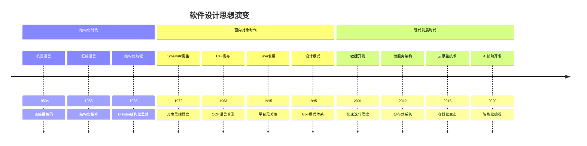

## 🏗️ 二、分类导图系列

### 📦 创建型模式全景

```mermaid
mindmap
  root)(创建型模式5种)
    单例模式 Singleton
      核心问题
        全局唯一实例
        资源控制管理
        访问方式统一
      解决方案
        构造函数私有
        静态实例创建
        线程安全保障
      实现变种
        懒汉式加载
        饿汉式初始化
        双重校验锁
        枚举单例
        内部类单例
      现代替代
        依赖注入容器
        Spring单例Bean
        Guice单例Scope
      应用场景
        配置管理器
        数据库连接池
        日志记录器
        缓存管理器
      最佳实践
        谨慎使用场景
        避免过度设计
        线程安全考虑
        内存泄漏防范
    工厂模式 Factory
      核心问题
        对象创建复杂
        类型不同处理
        运行时决定
      解决方案
        抽象创建接口
        具体工厂实现
        类型参数化
      实现形式
        简单工厂
        工厂方法
        抽象工厂
        注册式工厂
      现代化实现
        Lambda表达式
        Supplier工厂
        函数式设计
        策略选择
      应用场景
        UI组件创建
        数据访问对象
        算法选择器
        服务定位器
      演进路径
        静态工厂优先
        配置驱动
        插件化扩展
    抽象工厂 Abstract Factory
      核心问题
        产品族创建
        相关对象组
        平台兼容性
      解决方案
        多工厂管理
        接口族定义
        对象族创建
      实现策略
        多重继承
        组合工厂
        注册机制
        配置驱动
      现代应用
        跨平台UI
        数据访问层
        消息中间件
        服务适配
      设计考量
        扩展性设计
        复杂度控制
        权衡利弊
    建造者模式 Builder
      核心问题
        复杂对象构建
        构造参数过多
        构建步骤复杂
      解决方案
        分步构建
        链式调用
        对象组装
      实现技巧
        Fluent接口
        内部类Builder
        参数封装
        验证机制
      现代创新
        类型安全Builder
        空对象模式
        函数式Builder
        注解驱动
      应用扩展
        SQL查询构建
        HTTP请求构建
        配置文件解析
        数据转换
      性能优化
        对象池复用
        缓存策略
        延迟构建
    原型模式 Prototype
      核心问题
        对象创建昂贵
        类似对象复制
        运行时类型创建
      解决方案
        克隆接口
        深拷贝实现
        原型注册
      实现技术
        浅拷贝问题
        深拷贝策略
        Java Cloneable
        C# MemberwiseClone
      应用场景
        游戏对象
        文档模板
        配置复制
        测试数据
      注意事项
        循环引用
        序列化安全
        性能开销
        设计复杂度
```

### 🔗 结构型模式架构

```mermaid
mindmap
  root)(结构型模式7种)
    适配器模式 Adapter
      核心问题
        接口不兼容
        第三方集成
        遗留系统改造
      解决方案
        接口转换
        包装器设计
        透明适配
      实现形式
        对象适配器
        类适配器
        接口适配器
      现代应用
        数据格式转换
        第三方API
        微服务适配
        版本兼容
      设计原则
        单一职责
        接口隔离
        依赖倒置
        适配最小化
      性能考虑
        转换开销
        缓存策略
        批量处理
        异步适配
    装饰器模式 Decorator
      核心问题
        功能动态添加
        避免继承膨胀
        运行时行为修改
      解决方案
        组合优于继承
        透明包装
        链式装饰
      实现特点
        相同的接口
        透明的代理
        功能叠加
        顺序敏感
      现代应用
        JavaIO流
        JavaEE Filter
        中间件设计
        AOP实现
      扩展变种
        管道模式
        过滤器模式
        责任链模式
        Interceptor链
      性能优化
        装饰缓存
        懒加载
        方法代理
        字节码增强
    代理模式 Proxy
      核心问题
        访问控制
        延迟加载
        远程调用
      解决方案
        代理对象中介
        透明访问
        功能增强
      代理类型
        静态代理
        动态代理
        JDK代理
        CGLib代理
        AspectJ代理
      应用场景
        远程方法调用
        延迟加载
        访问控制
        性能监控
        缓存代理
      现代演进
        Spring AOP
        分布式代理
        Kubernetes代理
        智能代理
      设计考量
        性能开销
        调试复杂度
        接口一致性
        异常处理
    外观模式 Facade
      核心问题
        系统复杂性
        接口数量过多
        使用门槛高
      解决方案
        统一入口
        接口简化
        内聚外松
      设计原则
        单一职责外观
        接口精简
        稳定性维护
      现代应用
        API Gateway
        服务编排
        用户界面
        企业集成
      演进方向
        智能路由
        服务聚合
        流量控制
        故障隔离
      性能优化
        缓存集成
        异步处理
        批量操作
        连接池
    组合模式 Composite
      核心问题
        树形结构
        递归操作
        部分整体统一
      解决方案
        叶子节点和组合节点
        统一接口
        递归结构
      设计挑战
        透明性设计
        安全性设计
        性能优化
        遍历效率
      现代应用
        GUI组件树
        文件系统
        XML解析
        JSON处理
      扩展创新
        访问者模式结合
        迭代器实现
        状态管理
        事件传播
      最佳实践
        接口设计
        异常处理
        内存管理
        并发安全
    桥接模式 Bridge
      核心问题
        抽象实现分离
        多个变化维度
        平台无关性
      解决方案
        抽象层分离
        桥接联系
        组合替代继承
      现代应用
        GUI编程
        ORM框架
        设备驱动
        插件系统
      设计优势
        可扩展性强
        平台独立
        易测试
        松耦合
      注意事项
        设计复杂度
        理解成本
        过度抽象
        维护难度
    享元模式 Flyweight
      核心问题
        大量相似对象
        内存开销大
        性能瓶颈
      解决方案
        对象共享
        状态分离
        工厂管理
      实现策略
        内部状态
        外部状态
        管理工厂
        池化技术
      现代应用
        文本编辑器
        游戏引擎
        大数据序列化
        缓存系统
      性能优化
        内存池
        弱引用
        分代管理
        压缩存储
      权衡考量
        复杂度增加
        调试困难
        状态管理
        并发安全
```

### 🎭 行为型模式生态

```mermaid
mindmap
  root)(行为型模式11种)
    观察者模式 Observer
      核心问题
        一对多依赖
        状态变化通知
        对象耦合解耦
      解决方案
        Subject-Observer
        通知机制
        订阅发布
      现代实现
        Java Observer
        事件总线
        响应式流
        ReactiveX
      应用场景
        GUI事件
        模型视图
        发布订阅
        事件日志
      扩展创新
        消息队列
        流处理
        复杂事件
        Apache Kafka
      性能优化
        异步通知
        批量处理
        消息过滤
        背压控制
      设计挑战
        内存泄漏
        通知顺序
        异常处理
        循环依赖
    策略模式 Strategy
      核心问题
        算法族选择
        运行时切换
        条件复杂性
      解决方案
        算法封装
        策略接口
        上下文选择
      现代化
        函数接口
        Lambda策略
        注册策略
        配置驱动
      应用场景
        支付处理
        数据压缩
        排序算法
        游戏AI
      设计权衡
        算法切换
        性能开销
        环境复杂度
        学习成本
      最佳实践
        策略工厂
        默认策略
        配置策略
        动态策略
    命令模式 Command
      核心问题
        请求封装
        撤销重做
        队列操作
      解决方案
        对象封装
        参数化请求
        操作抽象
      现代应用
        GUI操作
        撤销重做
        宏命令
        批处理
      扩展创新
        命令队列
        命令日志
        分布式命令
        事件溯源
      复合命令
        宏命令
        命令队列
        命令撤销链
        优先级命令
      设计挑战
        性能开销
        命令膨胀
        序列化安全
        复杂撤销
    状态模式 State
      核心问题
        状态驱动行为
        状态转换
        复杂条件判断
      解决方案
        状态对象
        转换管理
        状态封装
      现代应用
        工作流引擎
        游戏状态机
        用户会话
        业务规则
      状态机类型
        有限状态机
        层次状态机
        状态表驱动
        事件驱动状态机
      设计考量
        状态膨胀
        转换安全
        并发处理
        状态持久化
```mermaid
      责任链模式 Chain of Responsibility
        核心问题
          请求传递
          处理者解耦
          处理链构建
        解决方案
          处理者链
          后继者模式
          传递机制
        现代化实现
          中间件框架
          拦截器链
          Spring Filter
          请求处理链
        应用场景
          Web框架
          权限验证
          异常处理
          日志记录
        性能优化
          短路评估
          缓存处理
          异步处理
          批量处理
        设计挑战
          链的顺序
          处理性能
          调试困难
          内存泄露
      迭代器模式 Iterator
        核心问题
          遍历算法
          集合封装
          多态遍历
        解决方案
          遍历接口
          迭代器实现
          顺序控制
        现代实现
          Java Iterator
          Stream API
          函数式迭代
          并发迭代
        内部外部迭代
          内部：简单易用
          外部：灵活控制
          混合：两全其美
          函数式：声明式
        性能优化
          懒加载
          索引优化
          分片迭代
          并行处理
        安全并发
          并发修改检测
          线程安全
          快照迭代器
          读写分离
      模板方法模式 Template Method
        核心问题
          算法骨架固定
          步骤变化
          代码复用
        解决方案
          抽象模板
          步骤抽象
          钩子方法
          继承结构
        现代演进
          函数式模板
          Lambda钩子
          策略组合
          组合优于继承
        应用场景
          框架设计
          数据处理
          生命周期
          ORM批量操作
        设计权衡
          继承限制
          超类膨胀
          耦合问题
          扩展困难
        优化策略
          组合替代继承
          策略模式结合
          钩子最小化
          接口分离
      中介者模式 Mediator
        核心问题
          对象间通信
          耦合关系
          关联复杂度
        解决方案
          中央中介
          对象解耦
          间接通信
          关系管理
        实现策略
          事件驱动
          命令模式
          观察者
          服务总线
        现代应用
          MVC框架
          微服务总线
          事件总线
          工作流引擎
        性能考虑
          中介瓶颈
          单点故障
          扩展性
          异步处理
        设计挑战
          中介复杂
          调试困难
          性能开销
          故障影响
      备忘录模式 Memento
        核心问题
          状态保存恢复
          撤销机制
          状态外部化
        解决方案
          状态快照
          封装保存
          恢复机制
          来源隐藏
        现代实现
          版本控制
          快照技术
          增量保存
          压缩存储
        应用场景
          编辑器撤销
          游戏状态
          系统恢复
          数据备份
        性能优化
          压缩算法
          增量备份
          异步恢复
          快照分层
        设计考量
          存储开销
          安全性
          并发问题
          备份策略
      访问者模式 Visitor
        核心问题
          对象结构稳定
          新增操作频繁
          双重分派需求
        解决方案
          访问者接口
          双重分派
          操作外部化
          open/close原则
        实现技术
          反射机制
          函数重载
          类型检查
          Lambda表达式
        应用场景
          编译器AST
          XML解析
          代码生成
          数据分析
        现代创新
          函数式访问
          Stream处理
          并行访问
          类型安全
        设计权衡
          复杂度高
          性能开销
          类型检查
          调试难度
      解释器模式 Interpreter
        核心问题
          语法解析
          表达式求值
          领域特定语言
        解决方案
          解释器树
          语法规则
          递归解释
          结构模式
        现代实现
          DSL框架
          表达式树
          规则引擎
          查询语言
        应用场景
          SQL解释
          正则表达式
          命令行解析
          配置文件
        性能优化
          解析缓存
          预编译
          字节码
          JIT编译
        设计挑战
          复杂文法
          性能瓶颈
          错误处理
          扩展复杂
```

## 🎯 三、选择导图系列

### 📋 问题诊断决策树

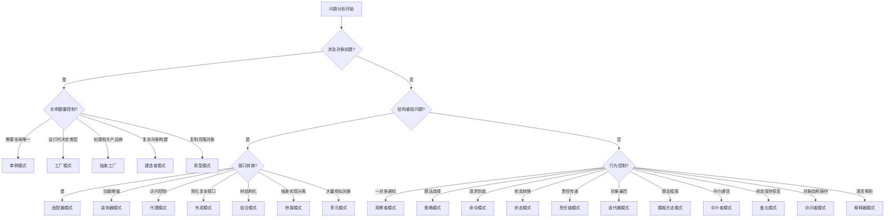

### 🎯 模式选择策略图

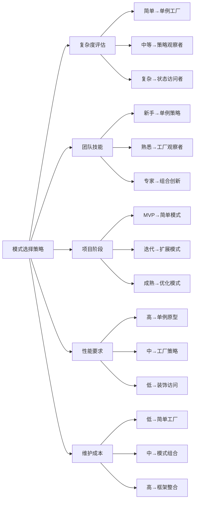

### ⚖️ 方案评估矩阵

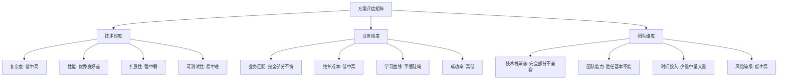

## 🛤️ 四、学习路径导图

### 🎓 零基础到专家路径

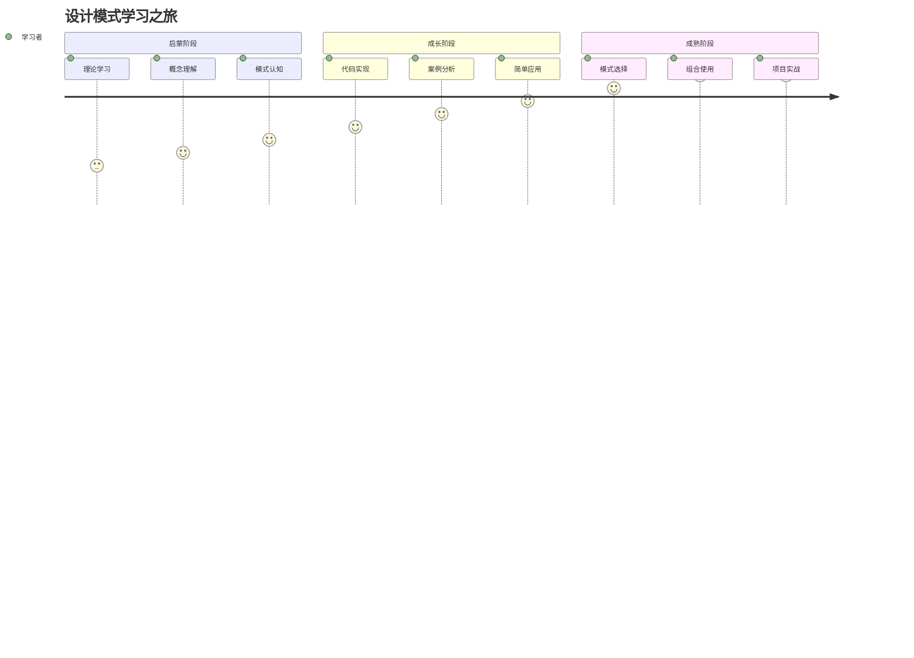

### 🏗️ 实战项目成长线

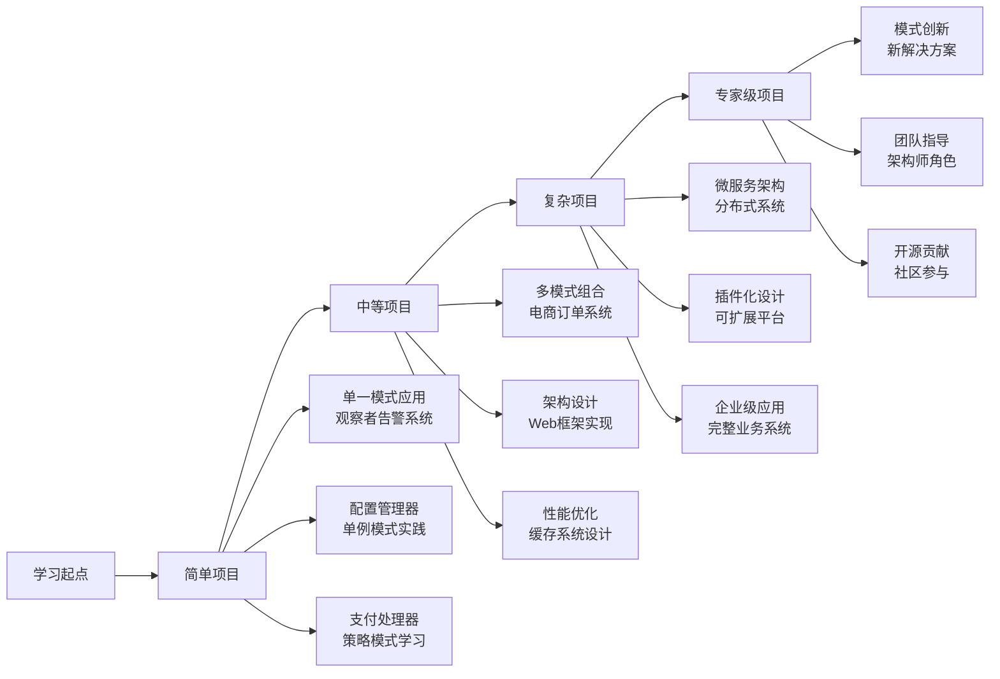

### 🎯 技能提升里程碑

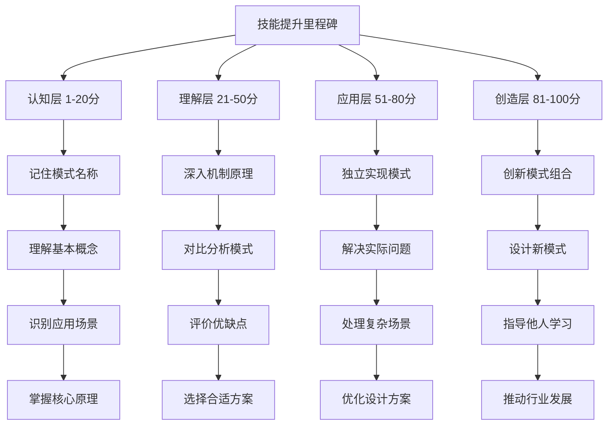

## 🧠 五、记忆导图系列

### 🔤 23种模式速记法

```mermaid
mindmap
  root)(设计模式记忆)
    创造法记忆
      “单工厂建抽原”
      单例模式
      工厂模式  
      建造者模式
      抽象工厂模式
      原型模式
    构建立记忆
      “适组装享代外观”
      适配器模式
      组合模式
      装饰器模式
      享元模式
      代理模式
      外观模式
      桥接模式
    行为记忆法
      “责命解迭调”
      责任链模式
      命令模式
      解释器模式
      迭代器模式
      中介者模式
      “观状策模访”
      观察者模式
      状态模式
      策略模式
      模板方法模式
      访问者模式
      备忘录模式
```

### 🎯 核心概念联想图

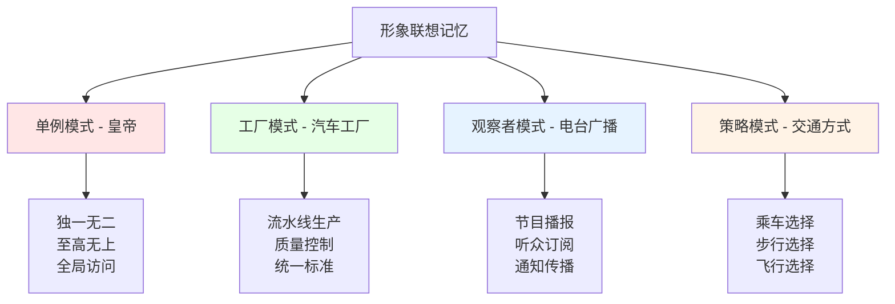

### 🎨 形象化记忆图谱

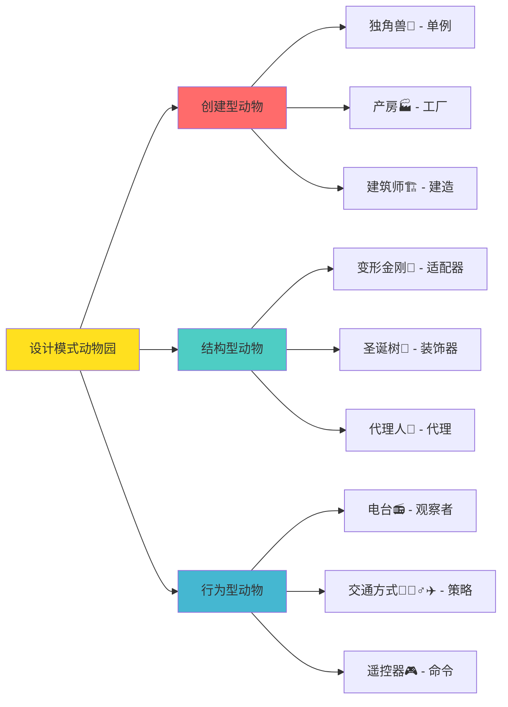

## 🌐 六、应用导图系列

### 🏢 企业应用场景图

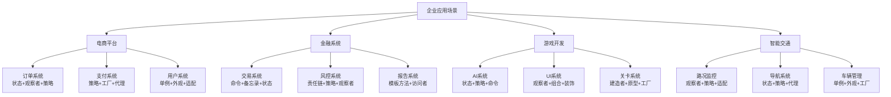

### 🚀 新技术融合图谱

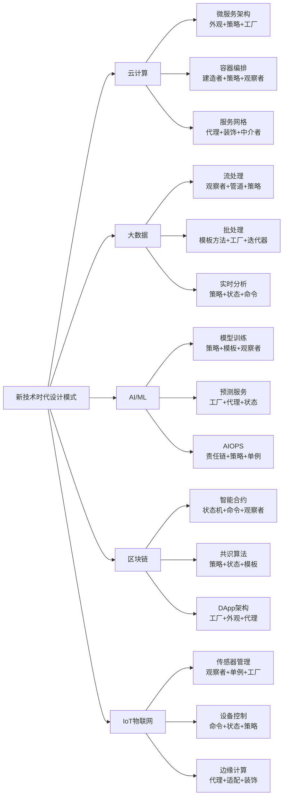

## 🔗 导图使用指南

### 📋 导图查看顺序

1. **新手入门**: 认知导图 → 分类导图 → 学习路径导图
2. **问题解决**: 问题诊断决策树 → 模式选择策略图 → 应用场景导图
3. **知识巩固**: 记忆导图 → 分类导图 → 应用导图
4. **进阶提升**: 新技术融合图谱 → 企业应用场景 → 创新思维导图

### 🎯 最佳实践建议

- **循序渐进**: 不要急于查看所有导图，按个人进度逐步深入
- **结合实际**: 在学习时对照自己熟悉的项目场景理解导图
- **反复回顾**: 定期重温导图，建立清晰的知识结构
- **主动思考**: 尝试为自己的项目设计类似的导图

## 🔮 导图更新维护

### 📈 版本迭代计划

- **v1.0 基础版**: 完成23种经典模式的思维导图
- **v2.0 进阶版**: 增加现代技术融合和应用案例
- **v3.0 智能版**: 集成AI辅助的个性化导图生成
- **v4.0 社区版**, 开放导图编辑和分享平台

### 🤝 社区贡献指南

欢迎设计模式爱好者和专家参与导图的优化和扩展：

- 提供更形象的记忆方法
- 贡献实际项目应用案例
- 发现导图中的问题和改进点
- 分享独特的学习心得

## 🔗 学习衔接

- **知识导航** → [[设计模式知识图谱]]
- **项目实战** → [[设计模式实战项目指南]]
- **体系总结** → [[设计模式学习体系终极总结]]

---
**💡 使用提示**: 思维导图是学习设计模式的有力工具。建议将经常使用的导图打印出来，或者在电脑桌面保存，便于随时查阅和复习。记住：好的导图不仅能帮助理解，更能激发创新思维！
