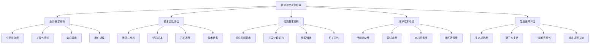
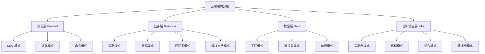
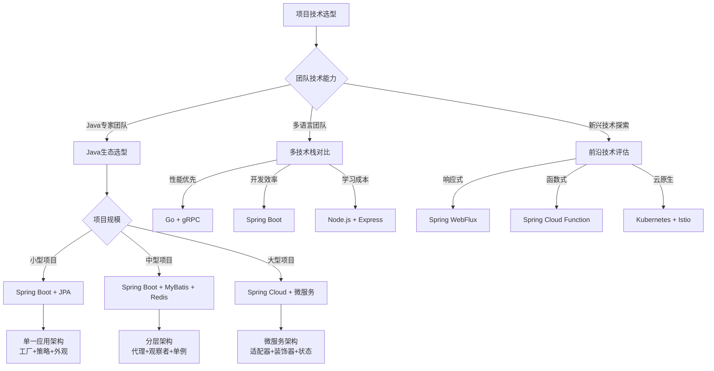
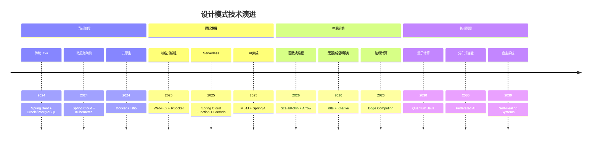

# 🎯 设计模式技术选型指南

[[设计模式面试宝典]] ← [[设计模式最佳实践秘典]]
## 🎯 选型决策框架

### 📊 技术选型分析模型



## 🏗️ 一、业务场景驱动的模式选择

### 🎯 **需求分析优先级矩阵**

| 业务场景 | 主要考虑因素 | 推荐模式组合 | 技术选型建议 | 风险等级 |
|----------|-------------|-------------|-------------|----------|
| **CRUD系统** | 简单、快速交付 | 工厂+策略+外观 | Spring Data JPA | 🟢 低风险 |
| **电商平台** | 高并发、业务复杂 | 状态+观察者+策略+命令 | Spring Boot + Redis | 🟡 中风险 |
| **支付系统** | 安全性、可靠性 | 策略+代理+单例+备忘录 | Spring Security | 🔴 高风险 |
| **通知系统** | 实时性、扩展性 | 观察者+装饰器+外观 | Redis Pub/Sub | 🟡 中风险 |
| **配置管理** | 灵活性、易用性 | 策略+工厂+建造者 | Spring Config | 🟢 低风险 |

### 📋 **分层应用策略**



### 💻 **现代技术栈最佳实践**

```java
// ✅ Spring Boot 生态中的模式组合
@RestController
@RequestMapping("/api/v1/orders")
public class OrderController {
    
    private final OrderService orderService;
    private final ValidationService validationService;
    
    // ✅ 外观模式：控制器作为服务外观
    @PostMapping
    public ResponseEntity<OrderResponse> createOrder(@Valid @RequestBody CreateOrderRequest request) {
        
        // 1. 外观模式：简化客户端调用
        try {
            // ✅ 策略模式：验证策略
            validationService.validate(request, ValidationStrategy.FULL);
            
            // ✅ 命令模式：封装复杂操作
            CreateOrderCommand command = new CreateOrderCommand(request);
            
            // ✅ 模板方法：统一处理流程
            OrderResponse response = orderService.processOrder(command);
            
            return ResponseEntity.ok(response);
            
        } catch (ValidationException e) {
            // ✅ 策略模式：错误处理策略
            return ResponseEntity.badRequest()
                .body(OrderResponse.failure(e.getMessage()));
        } catch (OrderException e) {
            return ResponseEntity.status(HttpStatus.UNPROCESSABLE_ENTITY)
                .body(OrderResponse.failure(e.getMessage()));
        }
    }
}

// ✅ 服务层：业务逻辑核心
@Service
@Transactional
public class OrderService {
    
    private final OrderStateMachine stateMachine;
    private final PaymentStrategyRegistry paymentRegistry;
    private final OrderEventBus eventBus;
    
    // ✅ 模板方法模式：订单处理模板
    public OrderResponse processOrder(CreateOrderCommand command) {
        // 模板方法：定义处理算法骨架
        OrderValidator.validate(command);
        
        Order order = createOrderFromCommand(command);
        order = processPayment(order, command);
        order = updateInventory(order);
        order = finalizeOrder(order);
        
        // ✅ 观察者模式：发布事件
        eventBus.publish(new OrderProcessedEvent(order));
        
        return OrderResponse.success(order);
    }
    
    // ✅ 工厂模式：创建复杂订单
    private Order createOrderFromCommand(CreateOrderCommand command) {
        return OrderFactory.create()
            .withCustomer(command.getCustomer())
            .withItems(command.getItems())
            .withShipInfo(command.getShipInfo())
            .build();
    }
    
    // ✅ 策略模式：支付处理
    private Order processPayment(Order order, CreateOrderCommand command) {
        PaymentStrategy strategy = paymentRegistry.getStrategy(command.getPaymentType());
        PaymentResult result = strategy.processPayment(order.getTotalAmount(), command.getPaymentDetails());
        
        if (result.isSuccess()) {
            order.setPaymentStatus(PaymentStatus.PAID);
            order.setTransactionId(result.getTransactionId());
        } else {
            throw new PaymentException("Payment failed: " + result.getErrorMessage());
        }
        
        return order;
    }
}
```

## 🚀 二、技术栈成熟度评估

### 📈 **开源生态成熟度雷达图**

```mermaid
radar
    title 技术栈成熟度评估
    ["Spring生态", 95]
    ["Java EE", 80]
    ["功能式编程", 60]
    ["微服务框架", 85]
    ["响应式编程", 70]
    ["云原生", 75]
```

### 🎯 **技术选型决策树**



### 💎 **框架级模式集成**

```java
// ✅ Spring Framework内置设计模式应用指南

@Configuration
@EnableWebMvc
public class SpringPatternConfiguration {
    
    // ✅ 单例模式：Spring Bean默认单例
    @Bean
    @Scope("singleton") // 默认就是单例
    public UserService userService() {
        return new UserServiceImpl();
    }
    
    // ✅ 工厂模式：FactoryBean接口
    @Bean
    public DataSourceFactoryBean dataSourceFactory() {
        DataSourceFactoryBean factory = new DataSourceFactoryBean();
        factory.setDataSourceClassName("com.zaxxer.hikari.HikariDataSource");
        return factory;
    }
    
    // ✅ 策略模式：HandlerMapping接口
    @Bean
    public HandlerMapping handlerMapping() {
        RequestMappingHandlerMapping mapping = new RequestMappingHandlerMapping();
        mapping.setOrder(Ordered.HIGHEST_PRECEDENCE);
        return mapping;
    }
    
    // ✅ 观察者模式：ApplicationEventPublisher
    @Bean
    public EventPublisher eventPublisher() {
        return new SimpleApplicationEventPublisher();
    }
}

// ✅ 现代Spring Boot应用架构
@SpringBootApplication
@EnableJpaRepositories
@EnableTransactionManagement
@EnableScheduling
public class ModernApplication {
    
    public static void main(String[] args) {
        SpringApplication.run(ModernApplication.class, args);
    }
    
    // ✅ 建造者模式：应用配置
    @Bean
    public CommandLineRunner setupApplication(Environment env) {
        return args -> {
            ApplicationConfig config = ApplicationConfig.builder()
                .database(configureDatabase(env))
                .security(configureSecurity(env))
                .monitoring(configureMonitoring(env))
                .build();
                
            initializeConfiguration(config);
        };
    }
}
```

## 🔧 三、性能导向的模式选择

### 📊 **性能基准测试矩阵**

| 模式类型 | 内存消耗 | CPU开销 | 响应时间 | 开发复杂度 | 推荐场景 |
|----------|----------|---------|----------|------------|----------|
| **单例模式** | 🟢 低 | 🟢 极低 | 🟢 极快 | 🟢 简单 | 全局资源管理 |
| **工厂模式** | 🟡 中 | 🟢 低 | 🟢 快 | 🟡 中 | 对象创建频率高 |
| **策略模式** | 🟡 中 | 🟢 低 | 🟢 快 | 🟡 中 | 算法切换频繁 |
| **观察者模式** | 🟡 中 | 🟡 中 | 🟡 中 | 🔴 高 | 事件驱动系统 |
| **代理模式** | 🔴 高 | 🔴 高 | 🔴 慢 | 🔴 高 | 安全控制要求高 |
| **装饰器模式** | 🔴 高 | 🟡 中 | 🟡 中 | 🔴 高 | 功能动态扩展 |
| **适配器模式** | 🟡 中 | 🟢 低 | 🟢 快 | 🟢 简单 | 接口转换需求 |

### ⚡ **高性能模式实现指南**

```java
// ✅ 观察者模式的高性能实现
@Component
public class HighPerformanceEventBus {
    
    private final Dispatcher<Event> dispatcher;
    private final MetricsCollector metricsCollector;
    private final CircuitBreaker circuitBreaker;
    
    public HighPerformanceEventBus() {
        // ✅ 策略模式：选择合适的队列类型
        this.dispatcher = createOptimalDispatcher();
        this.metricsCollector = new MetricsCollector();
        this.circuitBreaker = CircuitBreaker.ofDefault();
    }
    
    // ✅ 性能优化的观察者通知
    public void publishAsync(Event event) {
        if (event == null) return;
        
        // 性能监控
        long startTime = System.nanoTime();
        
        try {
            // ✅ 批量处理提升吞吐量
            List<Event> batch = Collections.singletonList(event);
            
            // ✅ 异步非阻塞处理
            dispatcher.dispatch(batch).thenAccept(result -> {
                metricsCollector.recordLatency(event.getClass(), 
                    System.nanoTime() - startTime);
            });
            
        } catch (Exception e) {
            circuitBreaker.handleFailure(e);
            metricsCollector.recordError(event.getClass(), e);
        }
    }
    
    private Dispatcher<Event> createOptimalDispatcher() {
        int cores = Runtime.getRuntime().availableProcessors();
        
        // ✅ 根据系统规模选择最优分发策略
        if (cores <= 4) {
            return new SingleThreadDispatcher<>();
        } else if (cores <= 16) {
            return new MultiThreadDispatcher<>(
                ForkJoinPool.commonPool());
        } else {
            return new OptimizedDispatcher<>(
                createWorkerPool(cores));
        }
    }
}

// ✅ 策略模式的高性能实现
@Component
public class OptimizedPaymentStrategyRegistry {
    
    private final Map<PaymentType, PaymentStrategy> strategies;
    private final Map<PaymentType, CompletableFuture<PaymentStrategy>> warmupCache;
    
    public OptimizedPaymentStrategyRegistry(List<PaymentStrategy> strategyList) {
        // ✅ 预加载和预热策略
        this.strategies = new ConcurrentHashMap<>();
        this.warmupCache = new ConcurrentHashMap<>();
        
        initializeStrategies(strategyList);
        warmupStrategies();
    }
    
    // ✅ JIT优化：频繁调用路径优化
    @HotSpotCompiledMethod
    public PaymentStrategy getStrategy(PaymentType type) {
        PaymentStrategy strategy = strategies.get(type);
        
        if (strategy == null) {
            // ✅ 延迟加载和缓存
            strategy = loadStrategy(type);
            strategies.put(type, strategy);
        }
        
        return strategy;
    }
    
    private void warmupStrategies() {
        strategies.keySet().parallelStream()
            .forEach(this::preloadStrategy);
    }
    
    private PaymentStrategy loadStrategy(PaymentType type) {
        // ✅ 动态加载优化
        return PaymentStrategyLoader.load(type, classLoader);
    }
}
```

### 🎯 **性能监控和调优**

```java
// ✅ 性能监控装饰器
@Aspect
@Component
public class PerformanceMonitoringAspect {
    
    private final MeterRegistry meterRegistry;
    private final Timer.Sample samples = ConcurrentHashMap.newKeySet();
    
    @Around("@annotation(MonitorPerformance)")
    public Object monitorPerformance(ProceedingJoinPoint joinPoint) throws Throwable {
        
        String componentName = joinPoint.getTarget().getClass().getSimpleName();
        String methodName = joinPoint.getSignature().getName();
        String metricName = componentName + "." + methodName;
        
        Timer.Sample sample = Timer.Sample.start(meterRegistry);
        samples.add(sample);
        
        try {
            // ✅ 代理模式：方法代理
            Object result = joinPoint.proceed();
            
            // ✅ 性能指标收集
            recordSuccessMetrics(metricName, sample);
            
            return result;
            
        } catch (Exception e) {
            recordErrorMetrics(metricName, sample, e);
            throw e;
        }
    }
    
    private void recordSuccessMetrics(String metricName, Timer.Sample sample) {
        sample.stop(Timer.builder("method.execution")
            .tag("name", metricName)
            .tag("result", "success")
            .register(meterRegistry));
            
        meterRegistry.counter("method.invocation", 
            "name", metricName, 
            "result", "success").increment();
    }
}

// ✅ 性能分析工具类
@Component
public class PerformanceAnalyzer {
    
    private final WeakHashMap<Object, PerformanceStats> objectStats;
    
    // ✅ 单例性能分析器
    private static PerformanceAnalyzer INSTANCE;
    
    synchronized public static PerformanceAnalyzer getInstance() {
        if (INSTANCE == null) {
            INSTANCE = new PerformanceAnalyzer();
        }
        return INSTANCE;
    }
    
    public void analyzePatternPerformance(String patternName, Runnable operation) {
        PerformanceStats stats = objectStats.computeIfAbsent(this, 
            k -> new PerformanceStats());
            
        long startTime = System.nanoTime();
        long startMemory = getCurrentMemoryUsage();
        
        try {
            operation.run();
            stats.recordSuccess(System.nanoTime() - startTime, 
                getCurrentMemoryUsage() - startMemory);
                
        } catch (Exception e) {
            stats.recordError(System.nanoTime() - startTime);
            logPerformanceIssue(patternName, e);
        }
    }
    
    public PerformanceReport generateReport() {
        return objectStats.entrySet().stream()
            .collect(Collector.of(
                PerformanceReport.builder(),
                (builder, entry) -> builder.addPattern(entry.getValue()),
                PerformanceReport.Builder::merge,
                PerformanceReport.Builder::build));
    }
}
```

## 💼 四、企业级应用考量

### 🏢 **企业级技术选型矩阵**

| 企业特性 | 技术选型因素 | 推荐技术栈 | 模式组合 | 适用场景 |
|----------|-------------|------------|----------|----------|
| **大型企业** | 稳定性、标准化 | Spring + Oracle + Redis | 代理+外观+工厂 | 复杂的内部系统 |
| **中型企业** | 性价比、敏捷性 | Spring Boot + MySQL + 缓存 | 策略+观察者+单例 | B2B业务平台 |
| **小型企业** | 快速开发、低成本 | Spring Boot + PostgreSQL | 工厂+策略 | SaaS应用 |
| **创业公司** | 技术前瞻、快速迭代 | 微服务 + NoSQL | 适配器+状态+命令 | 创新业务产品 |
| **传统行业** | 成熟稳定、风险低 | Java EE + 关系型数据库 | 外观+模板方法 | 企业内部系统 |

### 🔐 **安全性和合规性考虑**

```java
// ✅ 企业级安全设计模式应用
@Configuration
@EnableWebSecurity
@EnableMethodSecurity(prePostEnabled = true)
public class SecurityPatternConfiguration {
    
    @Bean
    public SecurityFilterChain securityFilterChain(HttpSecurity http) throws Exception {
        return http
            // ✅ 代理模式：安全代理
            .authorizeHttpRequests(auth -> auth
                .requestMatchers("/api/public/**").permitAll()
                .requestMatchers("/api/admin/**").hasRole("ADMIN")
                .anyRequest().authenticated())
            
            // ✅ 策略模式：认证策略
            .authenticationProvider(auditEnabledAuthenticationProvider())
            
            // ✅ 装饰器模式：请求装饰
            .addFilterBefore(securityAuditFilter(), UsernamePasswordAuthenticationFilter.class)
            
            .build();
    }
    
    // ✅ 策略模式：审计认证提供者
    @Bean
    public DaoAuthenticationProvider auditEnabledAuthenticationProvider() {
        DaoAuthenticationProvider provider = new DaoAuthenticationProvider();
        
        // ✅ 装饰器模式：密码编码装饰
        provider.setPasswordEncoder(passwordEncoderWithAuditing());
        
        // ✅ 策略模式：用户详情服务策略
        provider.setUserDetailsService(cachingUserDetailsService());
        
        return provider;
    }
    
    private PasswordEncoder passwordEncoderWithAuditing() {
        // ✅ 装饰器模式：添加审计功能
        return PasswordEncoderDecorator.decorate(
            PasswordEncoderFactories.createDelegatingPasswordEncoder())
            .withAuditing(auditService())
            .build();
    }
    
    @Bean
    public UserDetailsService cachingUserDetailsService() {
        // ✅ 代理模式：缓存代理
        return CachingUserDetailsService.decorate(
            userService())
            .withCache(userCacheManager())
            .build();
    }
}

// ✅ 审计事件处理
@Component
public class SecurityAuditHandler implements Observer<SecurityEvent> {
    
    private final AuditLogger auditLogger;
    private final ComplianceValidator complianceValidator;
    
    @Override
    public void update(SecurityEvent event) {
        
        // ✅ 状态模式：事件状态处理
        SecurityEventProcessor processor = SecurityEventProcessorFactory
            .createProcessor(event.getType());
            
        AuditEvent auditEvent = processor.process(event);
        
        // ✅ 模板方法：合规检查模板
        if (complianceValidator.isComplianceRequired()) {
            complianceValidator.validate(auditEvent);
        }
        
        auditLogger.log(auditEvent);
    }
}
```

## 🚀 五、未来技术趋势预判

### 📈 **技术演进路径图**



### 🔮 **新兴技术集成策略**

```java
// ✅ AI时代的设计模式演进
@Component
public class IntelligentOrderProcessor {
    
    private final MLModelLoader modelLoader;
    private final InferenceEngine inferenceEngine;
    private final AIDecisionLogger aiLogger;
    
    // ✅ 策略模式的AI演进：智能策略选择
    @AIEnhanced(algorithm = "PatternRecognition")
    public OrderProcessingStrategy selectIntelligentStrategy(OrderContext context) {
        
        // ✅ 观察者模式的新应用：模型更新监听
        MLModels models = modelLoader.getCurrentModels();
        
        FeatureVector features = extractFeatures(context);
        
        // ✅ 策略模式：AI模型选择策略
        InferenceStrategy strategy = InferenceStrategyFactory
            .createByAccuracy(models);
            
        PredictionResult result = inferenceEngine.predict(strategy, features);
        
        // ✅ 命令模式：记录AI决策
        aiLogger.logDecision(context, result);
        
        return OrderProcessingStrategy.fromPrediction(result);
    }
    
    // ✅ 模板方法的AI增强：智能模板
    @MachineLearningEnhanced
    public OrderResponse processOrderWithAI(CreateOrderCommand command) {
        
        // ✅ AI增强的模板方法
        return AITemplateMethod.execute(() -> {
            
            // 智能验证（AI增强）
            aiValidator.validate(command);
            
            // 智能定价（AI预测）
            PricingStrategy pricing = aiPricingStrategy.predict(command);
            
            // 智能路由（AI优化）
            RoutingStrategy routing = aiRouter.selectOptimalRoute(command);
            
            return processOrderIntelligence(command, pricing, routing);
        });
    }
}
```

## 📊 选型决策清单

### ✅ **选型检查清单**

```markdown
### 🎯 业务需求匹配度评估
- [ ] 业务复杂度是否与选型匹配？
- [ ] 预期的用户规模技术栈是否支持？
- [ ] 集成的第三方系统是否兼容？
- [ ] 团队的业务理解能力是否足够？

### 🛠️ 技术团队能力评估
- [ ] 团队对该技术栈的熟悉程度？
- [ ] 学习成本是否在可接受范围内？
- [ ] 是否有人员可以指导其他成员？
- [ ] 技术选型是否符合团队长期发展规划？

### ⚡ 性能要求评估
- [ ] 响应时间要求是否可满足？
- [ ] 并发处理能力是否足够？
- [ ] 资源消耗是否在预算范围内？
- [ ] 扩展性是否支持业务增长？

### 💰 成本和风险评估
- [ ] 开发成本是否合理？
- [ ] 维护成本是否可控？
- [ ] 技术风险是否可接受？
- [ ] 迁移成本是否可行？

### 🔄 可持续发展评估
- [ ] 技术栈是否有持续演进？
- [ ] 社区活跃度是否足够？
- [ ] 第三方生态是否完善？
- [ ] 标准化程度是否充分？
```

## 🔗 学习衔接

- **面试指导** ← [[设计模式面试宝典]]
- **实践指南** → [[设计模式最佳实践秘典]]
- **项目管理** → [[设计模式实战项目指南]]
- **知识导航** → [[设计模式知识图谱]]

---
**💡 选型要点**: 技术选型的核心是平衡业务需求、技术能力和长期规划。最好的选择往往不是技术最先进的，而是最适合当前团队和业务需求的解决方案。记住：技术服务于业务，而非相反。
