# 🏆 设计模式最佳实践秘典

[[设计模式思维导图大全]] ← [[设计模式学习体系终极总结]]
## 🎯 最佳实践总览

### 📚 实践智慧精华

```mermaid
graph TD
    A[设计模式最佳实践秘典] --> B[设计原则实践]
    A --> C[模式应用策略]
    A --> D[代码质量保证]
    A --> E[团队协作实践]
    A --> F[性能优化策略]
    A --> G[现代技术融合]
    A --> H[反模式规避]

    B --> B1[SOLID原则深度应用]
    B --> B2[YAGNI原则实践]
    B --> B3[KISS原则简化]
    B --> B4[DRY原则抽象]
    
    C --> C1[模式选择指南]
    C --> C2[模式组合使用]
    C --> C3[模式演化路径]
    C --> C4[模式重构技巧]
    
    D --> D1[代码规范制定]
    D --> D2[单元测试策略]
    D --> D3[代码审查清单]
    D --> D4[性能监控体系]
    
    E --> E1[代码沟通规范]
    E --> E2[设计文档模板]
    E --> E3[知识传承机制]
    E --> E4[团队约定制定]
    
    F --> F1[性能瓶颈识别]
    F --> F2[架构优化策略]
    F --> F3[资源使用监控]
    F --> F4[响应时间优化]
    
    G --> G1[微服务模式应用]
    G --> G2[云原生设计思路]
    G --> G3[AI辅助开发]
    G --> G4[大数据模式实践]
    
    H --> H1[代码异味识别]
    H --> H2[架构腐化预防]
    H --> H3[过度设计规避]
    H --> H4[模式滥用纠正]
```



## 🏗️ 一、设计原则深度实践

### 💎 SOLID原则实战指南

#### ✅ **单一职责原则(SRP)实战**

```java
// ❌ 坏设计：违反SRP的User类
public class BadUserService {
    public void createUser(String name, String email) {
        // 用户创建逻辑
        validateEmail(email);
        saveToDatabase(new User(name, email));
        sendWelcomeEmail(email); // 违反SRP
        logActivity("User created: " + name); // 违反SRP
        updateUserCache(new User(name, email)); // 违反SRP
    }
    
    private void validateEmail(String email) { /* ... */ }
    private void saveToDatabase(User user) { /* ... */ }
    private void sendWelcomeEmail(String email) { /* ... */ }
    private void logActivity(String message) { /* ... */ }
    private void updateUserCache(User user) { /* ... */ }
}

// ✅ 好设计：符合SRP的模块化设计
public class UserService {
    private final UserRepository userRepository;
    private final EmailService emailService;
    private final AuditService auditService;
    private final CacheService cacheService;
    
    public UserService(UserRepository userRepository, EmailService emailService,
                      AuditService auditService, CacheService cacheService) {
        this.userRepository = userRepository;
        this.emailService = emailService;
        this.auditService = auditService;
        this.cacheService = cacheService;
    }
    
    public User createUser(CreateUserRequest request) {
        UserFactory.validate(request);
        User user = UserFactory.create(request);
        
        // 委托给专业的服务
        User savedUser = userRepository.save(user);
        emailService.sendWelcomeEmail(savedUser.getEmail());
        auditService.logUserCreation(savedUser.getId());
        cacheService.updateUserCache(savedUser);
        
        return savedUser;
    }
}

// ✅ 专门的用户工厂（建造者模式应用）
public class UserFactory {
    public static void validate(CreateUserRequest request) {
        if (StringUtils.isEmpty(request.getName())) {
            throw new ValidationException("User name cannot be empty");
        }
        if (!EmailValidator.isValid(request.getEmail())) {
            throw new ValidationException("Invalid email format");
        }
    }
    
    public static User create(CreateUserRequest request) {
        return User.builder()
            .id(UUID.randomUUID())
            .name(request.getName())
            .email(request.getEmail())
            .createdAt(Instant.now())
            .status(UserStatus.ACTIVE)
            .build();
    }
}
```

#### 🔧 **开闭原则(OCP)现代化实现**

```java
// ✅ 现代Java开闭原则实现
public interface PaymentProcessor {
    PaymentResult processPayment(BigDecimal amount, PaymentContext context);
    boolean supports(PaymentType type);
    PaymentType getPaymentType();
}

// 策略模式 + 工厂模式的现代实现
@Component
public class PaymentProcessorRegistry {
    private final Map<PaymentType, PaymentProcessor> processors;
    
    public PaymentProcessorRegistry(List<PaymentProcessor> processorList) {
        this.processors = processorList.stream()
            .collect(Collectors.toMap(
                PaymentProcessor::getPaymentType,
                Function.identity()
            ));
    }
    
    public PaymentProcessor getProcessor(PaymentType type) {
        PaymentProcessor processor = processors.get(type);
        if (processor == null) {
            throw new UnsupportedPaymentTypeException("Payment type not supported: " + model);
        }
        return processor;
    }
}

// ✅ 具体实现：信用卡支付
@Component
public class CreditCardProcessor implements PaymentProcessor {
    
    @Override
    public PaymentResult processPayment(BigDecimal amount, PaymentContext context) {
        CreditCardDetails cardDetails = context.getCreditCardDetails();
        
        // 现代支付网关集成
        PaymentGatewayRequest request = PaymentGatewayRequest.builder()
            .amount(amount)
            .currency(context.getCurrency())
            .cardNumber(cardDetails.getMaskedNumber())
            .expiryDate(cardDetails.getExpiryDate())
            .cvv(cardDetails.getCvv())
            .merchantId(context.getMerchantId())
            .build();
            
        try {
            PaymentGatewayResponse response = paymentGateway.charge(request);
            return PaymentResult.success(response.getTransactionId(), response.getReceiptUrl());
        } catch (PaymentException e) {
            return PaymentResult.failure(e.getMessage(), e.getErrorCode());
        }
    }
    
    @Override
    public boolean supports(PaymentType type) {
        return type == PaymentType.CREDIT_CARD;
    }
    
    @Override
    public PaymentType getPaymentType() {
        return PaymentType.CREDIT_CARD;
    }
}

// ✅ 具体实现：PayPal支付 - 新增无需修改现有代码
@Component
public class PayPalProcessor implements PaymentProcessor {
    
    @Override
    public PaymentResult processPayment(BigDecimal amount, PaymentContext context) {
        PayPalCredentials credentials = context.getPayPalCredentials();
        
        try {
            PayPalPaymentResult result = payPalClient.createPayment(
                PayPalPaymentRequest.builder()
                    .amount(amount)
                    .currency(context.getCurrency())
                    .payerEmail(credentials.getEmail())
                    .description(context.getPaymentDescription())
                    .build()
            );
            
            boolean approved = payPalClient.executePayment(result.getPaymentId(), credentials);
            if (approved) {
                return PaymentResult.success(result.getPaymentId(), result.getApprovalUrl());
            } else {
                return PaymentResult.failure("PayPal payment not approved");
            }
        } catch (PayPalException e) {
            return PaymentResult.failure("PayPal payment failed: " + e.getMessage());
        }
    }
    
    @Override
    public boolean supports(PaymentType type) {
        return type == PaymentType.PAYPAL;
    }
    
    @Override
    public PaymentType getPaymentType() {
        return PaymentType.PAYPAL;
    }
}
```

### 🎯 **DRY原则抽象艺术**

```java
// ✅ DRY原则的高级应用：通用CRUD操作抽象
public interface Repository<T, ID> {
    Optional<T> findById(id);
    List<T> findAll();
    List<T> findAll(Specification<T> spec);
    Page<T> findAll(Specification<T> spec, Pageable pageable);
    T save(T entity);
    T saveAndFlush(T entity);
    void deleteById(ID id);
    boolean existsById(ID id);
    long count();
}

// ✅ 服务层抽象基类
@Transactional
public abstract class BaseService<T, ID> {
    
    protected abstract Repository<T, ID> getRepository();
    protected abstract void validateBeforeSave(T entity);
    protected abstract void validateBeforeUpdate(T entity);
    
    // 通用保存逻辑
    public T save(T entity) {
        validateBeforeSave(entity);
        beforeSave(entity);
        
        T savedEntity = getRepository().save(entity);
        
        afterSave(savedEntity);
        return savedEntity;
    }
    
    // 通用更新逻辑
    public T update(ID id, TUpdateRequest request) {
        T entity = getRepository().findById(id)
            .orElseThrow(() -> new EntityNotFoundException("Entity not found: " + id));
            
        validateBeforeUpdate(entity);
        
        // 应用更新
        applyUpdate(entity, request);
        beforeSave(entity); // 复用保存前的钩子
        
        T updatedEntity = getRepository().save(entity);
        afterUpdate(updatedEntity);
        
        return updatedEntity;
    }
    
    // 钩子方法，子类可以重写
    protected void beforeSave(T entity) {}
    protected void afterSave(T entity) {}
    protected void afterUpdate(T entity) {}
    
    protected abstract void applyUpdate(T entity, TUpdateRequest request);
}

// ✅ 具体服务实现
@Service
public class UserService extends BaseService(User, UUID> {
    
    @Autowired
    private UserRepository userRepository;
    
    @Override
    protected Repository<User, UUID> getRepository() {
        return userRepository;
    }
    
    @Override
    protected void validateBeforeSave(User user) {
        if (StringUtils.isEmpty(user.getName())) {
            throw new ValidationException("User name cannot be empty");
        }
        // 业务特定的验证逻辑
    }
    
    @Override
    protected void validateBeforeUpdate(User user) {
        validateBeforeSave(user); // 复用基础验证
        // 更新特定的验证逻辑
    }
    
    @Override
    protected void applyUpdate(User entity, UserUpdateRequest request) {
        // 使用建造者模式安全更新
        UserBuilder builder = entity.toBuilder()
            .name(request.getName() != null ? request.getName() : entity.getName())
            .email(request.getEmail() != null ? request.getEmail() : entity.getEmail())
            .updatedAt(Instant.now());
            
        // 将更新应用到原始对象
        entity.updateFrom(builder.build());
    }
    
    @Override
    protected void beforeSave(User entity) {
        // 密码加密等特殊逻辑
        if (entity.getPassword() != null) {
            entity.setPassword(passwordEncoder.encode(entity.getPassword()));
        }
    }
    
    @Override
    protected void afterSave(User entity) {
        // 发送创建确认邮件等
        eventPublisher.publishEvent(new UserCreatedEvent(entity));
    }
}
```

## 🔧 二、模式应用策略

### 🎯 **模式选择的最佳时机**

#### 📋 **问题驱动的模式选择矩阵**

| 问题特征 | 推荐模式 | 应用场景 | 实施复杂度 | 收益评估 |
|----------|----------|----------|------------|----------|
| **对象创建复杂** | 建造者模式 | API请求构建、配置管理 | 中 | ⭐⭐⭐⭐ |
| **运行时类型选择** | 策略模式 | 支付处理、算法切换 | 低 | ⭐⭐⭐⭐⭐ |
| **状态驱动行为** | 状态模式 | 工作流、订单状态 | 中 | 半⭐⭐⭐ |
| **一对一多通知** | 观察者模式 | 事件处理、UI更新 | 中 | ⭐⭐⭐⭐ |
| **算法框架稳定** | 模板方法模式 | 数据处理、业务框架 | 低 | ⭐⭐⭐ |
| **接口不一致适配** | 适配器模式 | 第三方集成、API转换 | 低 | ⭐⭐⭐⭐ |
| **复杂子系统访问** | 外观模式 | 微服务网关、API聚合 | 低 | ⭐⭐⭐⭐⭐ |

### 🚀 **模式组合的最佳实践**

#### 💻 **现代企业应用中的模式组合**

```java
// ✅ 生产级的设计模式组合应用
@Component
public class OrderProcessingService {
    
    private final OrderFactory orderFactory;
    private final PaymentStrategyRegistry paymentRegistry;
    private final OrderStateMachine stateMachine;
    private final OrderEventBus eventBus;
    private final NotificationObserverService notificationService;
    
    public OrderProcessingService(OrderFactory orderFactory,
                                PaymentStrategyRegistry paymentRegistry,
                                OrderStateMachine stateMachine,
                                OrderEventBus eventBus,
                                NotificationObserverService notificationService) {
        this.orderFactory = orderFactory;
        this.paymentRegistry = paymentRegistry;
        this.stateMachine = stateMachine;
        this.eventBus = eventBus;
        this.notificationService = notificationService;
    }
    
    @Transactional
    public OrderResult processOrder(CreateOrderRequest request) {
        try {
            // 1. 建造者模式：创建复杂订单
            Order order = orderFactory.createOrder()
                .fromRequest(request)
                .withCustomer(request.getCustomer())
                .withItems(request.getItems())
                .withShippingAddress(request.getShippingAddress())
                .build();
            
            // 2. 状态模式：订单状态管理
            stateMachine.initOrder(order);
            
            // 3. 观察者模式：订阅状态变化通知
            registerOrderObservers(order);
            
            // 4. 策略模式：支付处理
            PaymentStrategy paymentStrategy = paymentRegistry.getStrategy(request.getPaymentType());
            PaymentResult paymentResult = paymentStrategy.processPayment(
                order.getTotalAmount(), 
                buildPaymentContext(order, request.getPaymentDetails())
            );
            
            if (paymentResult.isSuccess()) {
                // 5. 命令模式：记录操作历史
                OrderCommand command = new ProcessPaymentCommand(order, paymentStrategy, paymentResult);
                command.execute();
                
                // 状态转换
                stateMachine.transitionToPaid(order.getId());
                
                return OrderResult.success(order, paymentResult.getTransactionId());
            } else {
                stateMachine.transitionToFailed(order.getId(), paymentResult.getError());
                return OrderResult.failure(paymentResult.getError());
            }
            
        } catch (Exception e) {
            log.error("Order processing failed", e);
            return OrderResult.failure("Order processing failed: " + e.getMessage());
        }
    }
    
    private void registerOrderObservers(Order order) {
        // 观察者模式：注册多种通知方式
        OrderObserver emailObserver = new EmailNotificationObserver(
            order.getCustomer().getEmail(),
            notificationService
        );
        
        OrderObserver smsObserver = new SmsNotificationObserver(
            order.getCustomer().getPhoneNumber(),
            notificationService
        );
        
        OrderObserver pushObserver = new PushNotificationObserver(
            order.getCustomer().getId(),
            notificationService
        );
        
        // 注册到事件总线
        eventBus.subscribe(order.getId(), emailObserver);
        eventBus.subscribe(order.getId(), smsObserver);
        eventBus.subscribe(order.getId(), pushObserver);
    }
}

// ✅ 现代仓库模式的实现
@Repository
public class ModernOrderRepository {
    
    private final JpaRepository<Order, UUID> jpaRepository;
    private final OrderCacheManager cacheManager;
    private final OrderSearchEngine searchEngine;
    
    public ModernOrderRepository(JpaRepository<Order, UUID> jpaRepository,
                               OrderCacheManager cacheManager,
                               OrderSearchEngine searchEngine) {
        this.jpaRepository = jpaRepository;
        this.cacheManager = cacheManager;
        this.searchEngine = searchEngine;
    }
    
    @Transactional(readOnly = true)
    public Optional<Order> findById(UUID orderId) {
        // 代理模式：缓存代理
        return cacheManager.get(orderId)
            .or(() -> {
                Optional<Order> order = jpaRepository.findById(orderId);
                order.ifPresent(cacheManager::put);
                return order;
            });
    }
    
    public Page<Order> searchOrders(OrderSearchRequest request) {
        // 策略模式：搜索策略
        SearchStrategy strategy = SearchStrategyFactory.create(request.getSearchType());
        return strategy.search(request);
    }
    
    @Transactional
    public Order saveWithAudit(Order order) {
        // 装饰器模式：审计装饰
        AuditOrder decorator = new AuditOrder(order, getCurrentUser(), Instant.now());
        Order savedOrder = jpaRepository.save(decorator.getOrder());
        
        // 保存审计信息
        auditRepository.save(decorator.getAudit());
        
        return savedOrder;
    }
}
```

## 🔍 三、代码质量保证

### 📋 **设计和代码审查清单**

#### ✅ **设计审查检查点**

```markdown
### 🎯 设计原则合规性检查

#### 单一职责原则 (SRP)
- [ ] 每个类是否只有一个变化的理由？
- [ ] 方法是否专注于单一功能？
- [ ] 是否可以在不引入新职责的情况下向类添加新功能？

#### 开闭原则 (OCP)
- [ ] 系统对扩展是否开放？
- [ ] 对修改是否封闭？
- [ ] 新增功能是否需要修改现有代码？

#### 里氏替换原则 (LSP)
- [ ] 子类实例是否可以替换父类实例？
- [ ] 继承关系是否符合is-a关系？
- [ ] 子类是否遵守父类的前置和后置条件？

#### 接口隔离原则 (ISP)
- [ ] 客户端是否依赖不需要的接口？
- [ ] 接口是否小巧且专注？
- [ ] 是否避免了"胖接口"问题？

#### 依赖倒置原则 (DIP)
- [ ] 是否依赖抽象而非具体实现？
- [ ] 高层模块是否不依赖低层模块？
- [ ] 是否使用了依赖注入？
```

#### 🧪 **单元测试最佳实践**

```java
// ✅ 设计模式单元测试的最佳实践
@ExtendWith(MockitoExtension.class)
class PaymentProcessorTest {
    
    @Mock
    private PaymentGateway paymentGateway;
    
    @InjectMocks
    private CreditCardProcessor paymentProcessor;
    
    @Mock
    private PaymentContext paymentContext;
    
    @Mock
    private CreditCardDetails cardDetails;
    
    @Test
    @DisplayName("信用卡支付成功场景")
    void shouldProcessPaymentSuccessfully_WhenValidCardDetails() {
        // 建造者模式构建测试数据
        PaymentGatewayRequest request = PaymentGatewayRequest.builder()
            .amount(new BigDecimal("100.00"))
            .currency("USD")
            .cardNumber("4111111111111111")
            .expiryDate("12/25")
            .cvv("123")
            .merchantId("MERCHANT_123")
            .build();
            
        PaymentGatewayResponse response = PaymentGatewayResponse.builder()
            .transactionId("TXN_123456")
            .status("SUCCESS")
            .receiptUrl("https://receipt.xyz/123456")
            .build();
            
        // Mock设置
        when(paymentContext.getCreditCardDetails()).thenReturn(cardDetails);
        when(cardDetails.getMaskedNumber()).thenReturn("****1111");
        when(cardDetails.getExpiryDate()).thenReturn("12/25");
        when(cardDetails.getCvv()).thenReturn("123");
        when(paymentGateway.charge(any(PaymentGatewayRequest.class))).thenReturn(response);
        
        // 执行测试
        PaymentResult result = paymentProcessor.processPayment(
            new BigDecimal("100.00"), 
            paymentContext
        );
        
        // 结果验证
        assertThat(result.isSuccess()).isTrue();
        assertThat(result.getTransactionId()).isEqualTo("TXN_123456");
        assertThat(result.getReceiptUrl()).isEqualTo("https://receipt.xyz/123456");
        
        // 交互验证
        verify(paymentGateway).charge(argThat(req -> 
            req.getAmount().equals(new BigDecimal("100.00")) &&
            req.getCurrency().equals("USD")
        ));
    }
    
    @Test
    @DisplayName("支付失败场景")
    void shouldReturnFailure_WhenPaymentGatewayThrowsException() {
        // Mock设置：网关抛异常
        when(paymentContext.getCreditCardDetails()).thenReturn(cardDetails);
        when(cardDetails.getMaskedNumber()).thenReturn("****5555");
        when(cardDetails.getExpiryDate()).thenReturn("12/25");
        when(cardDetails.getCvv()).thenReturn("123");
        when(paymentGateway.charge(any())).thenThrow(new PaymentException("Card declined"));
        
        // 执行测试
        PaymentResult result = paymentProcessor.processPayment(
            new BigDecimal("50.00"), 
            paymentContext
        );
        
        // 结果验证
        assertThat(result.isSuccess()).isFalse();
        assertThat(result.getErrorMessage()).isEqualTo("Card declined");
    }
    
    @Test
    @DisplayName("支持性检查")
    void shouldSupportCreditCardPaymentType() {
        // 使用参数化测试
        assertThat(paymentProcessor.supports(PaymentType.CREDIT_CARD)).isTrue();
    }
    
    @Test
    // 工厂方法模式的测试方法
    @DisplayName("创建策略工厂")
    void shouldCreateStrategyByPaymentType() {
        // 工厂模式测试
        PaymentStrategyFactory factory = new PaymentStrategyFactory(
            Map.of(
                PaymentType.CREDIT_CARD, paymentProcessor,
                PaymentType.PAYPAL, Mockito.mock(PayPalProcessor.class)
            )
        );
        
        PaymentStrategy strategy = factory.createStrategy(PaymentType.CREDIT_CARD);
        
        assertThat(strategy).isInstanceOf(CreditCardProcessor.class);
        assertThat(strategy.supports(PaymentType.CREDIT_CARD)).isTrue();
    }
}

// ✅ 状态模式的复杂测试
@ExtendWith(SpringExtension.class)
class OrderStateMachineTest {
    
    @Autowired
    private OrderStateMachine orderStateMachine;
    
    @Test
    @DisplayName("订单状态流转完整测试")
    void shouldTransitionThroughValidStates() {
        // 测试状态流转路径
        Order order = Order.builder().id(UUID.randomUUID()).build();
        
        // 初始状态
        assertThat(orderStateMachine.getCurrentState(order.getId()))
            .isEqualTo(OrderStatus.DRAFT);
        
        // 提交订单
        orderStateMachine.submit(order.getId());
        assertThat(orderStateMachine.getCurrentState(order.getId()))
            .isEqualTo(OrderStatus.SUBMITTED);
        
        // 支付
        orderStateMachine.pay(order.getId(), createPaymentDetails());
        assertThat(orderStateMachine.getCurrentState(order.getId()))
            .isEqualTo(OrderStatus.PAID);
        
        // 发货
        orderStateMachine.ship(order.getId());
        assertThat(orderStateMachine.getCurrentState(order.getId()))
            .isEqualTo(OrderStatus.SHIPPED);
        
        // 送达
        orderStateMachine.deliver(order.getId());
        assertThat(orderStateMachine.getCurrentState(order.getId()))
            .isEqualTo(OrderStatus.DELIVERED);
        
        // 完成
        orderStateMachine.complete(order.getId());
        assertThat(orderStateMachine.getCurrentState(order.getId()))
            .isEqualTo(OrderStatus.COMPLETED);
    }
    
    @Test
    @DisplayName("无效状态转换抛异常")
    void shouldThrowExceptionForInvalidTransition() {
        Order order = Order.builder().id(UUID.randomUUID()).build();
        
        // 从草稿状态直接发货应该是无效的
        assertThatThrownBy(() -> orderStateMachine.ship(order.getId()))
            .isInstanceOf(InvalidStateTransitionException.class)
            .hasMessageContaining("Cannot transition from DRAFT to SHIPPED");
    }
}
```

## 🚀 四、性能优化策略

### ⚡ **性能瓶颈识别和解决**

#### 🔍 **常见性能问题模式**

```java
// ❌ 性能陷阱：过度使用观察者模式
public class PerformanceAntiPatternExample {
    private final List<Observer> observers = new CopyOnWriteArrayList<>();
    
    // 问题：同步通知导致阻塞
    public void notifyObservers(Object data) {
        for (Observer observer : observers) { // 潜在瓶颈
            observer.update(data); // 阻塞式调用
        }
    }
    
    // 问题：频繁的添加删除操作
    public void addObserver(Observer observer) {
        observers.add(observer); // CopyOnWriteArrayList成本高
    }
}

// ✅ 性能优化：异步通知模式
@Component
@Component
public class OptimizedEventBus {
    
    private final AsyncTaskExecutor taskExecutor;
    private final Map<Class<?>, List<Observer>> observersByType;
    private final MetricsCollector metricsCollector;
    
    public OptimizedEventBus(AsyncTaskExecutor taskExecutor,
                           MetricsCollector metricsCollector) {
        this.taskExecutor = taskExecutor;
        this.metricsCollectant = metricsCollector;
        this.observersByType = new ConcurrentHashMap<>();
    }
    
    // ✅ 异步通知，避免阻塞
    public void publishAsync(Object event) {
        Class<?> eventType = event.getClass();
        List<Observer> observers = observersByType.get(eventType);
        
        if (observers != null && !observers.isEmpty()) {
            // 异步执行，避免阻塞
            taskExecutor.execute(() -> {
                long startTime = System.currentTimeMillis();
                try {
                    notifyObserversInternal(event, observers);
                    metricsCollector.recordSuccess(eventType, observers.size());
                } catch (Exception e) {
                    log.error("Error publishing event: {}", eventType.getSimpleName(), e);
                    metricsCollector.recordError(eventType, e);
                } finally {
                    metricsCollector.recordDuration(eventType, System.currentTimeMillis() - startTime);
                }
            });
        }
    }
    
    // ✅ 批量通知优化
    public void notifyAll(Object... events) {
        if (events.length == 0) return;
        
        // 按事件类型分组批处理
        Map<Class<?>, List<Object>> eventsByType = Arrays.stream(events)
            .collect(Collectors.groupingBy(Object::getClass));
            
        eventsByType.forEach((eventType, eventList) -> {
            List<Observer> observers = observersByType.get(eventType);
            if (observers != null) {
                // 批量通知，减少重复查找
                invokeObserversBatch(eventList, observers);
            }
        });
    }
    
    private void notifyObserversInternal(Object event, List<Observer> observers) {
        observers.forEach(observer -> {
            try {
                observer.update(event);
            } catch (Exception e) {
                log.error("Observer notification failed", e);
                // 单个观察者失败不影响其他观察者
            }
        });
    }
    
    public void subscribe(Class<?> eventType, Observer observer) {
        observersByType.computeIfAbsent(eventType, k -> new CopyOnWriteArrayList<>())
            .add(observer);
    }
}

// ✅ 缓存优化：单例模式的懒加载优化
public class LazySingletonOptimized implements Serializable {
    
    private volatile static LazySingletonOptimized INSTANCE;
    
    // ✅ 双重检查锁定优化
    public static LazySingletonOptimized getInstance() {
        if (INSTANCE == null) {
            synchronized (LazySingletonOptimized.class) {
                if (INSTANCE == null) {
                    // ✅ 使用Holder模式避免指令重排序
                    INSTANCE = new LazySingletonOptimized();
                }
            }
        }
        return INSTANCE;
    }
    
    // ✅ 单例模式的替代方案：枚举单例
    public enum SingletonEnum {
        INSTANCE;
        
        private final SingletonData singletonData;
        
        SingletonEnum() {
            // 延迟初始化单例数据
            this.singletonData = initializeSingletonData();
        }
        
        private SingletonData initializeSingletonData() {
            // 复杂的数据初始化逻辑
            return new SingletonData() // SingletonData initialization
        }
        
        public SingletonData getSingletonData() {
            return singletonData;
        }
    }
}
```

### 📊 **性能监控和分析**

```java
// ✅ 性能监控装饰器
@Component
public class PerformanceMonitoringDecorator {
    
    private final MeterRegistry meterRegistry;
    private final Tracing tracing;
    
    public PerformanceMonitoringDecorator(MeterRegistry meterRegistry, Tracing tracing) {
        this.meterRegistry = meterRegistry;
        this.tracing = tracing;
    }
    
    // ✅ 装饰器模式：性能监控装饰
    public <T> T decorateWithMonitoring(String operationName, Supplier<T> operation) {
        
        Timer.Sample sample = Timer.Sample.start(meterRegistry);
        Span span = tracing.tracer().nextSpan().name(operationName);
        
        try (Tracer.SpanInScope ws = tracing.tracer().withSpanInScope(span).start()) {
            span.tag("operation", operationName);
            
            T result = operation.get();
            
            span.tag("success", "true");
            return result;
            
        } catch (Exception e) {
            span.tag("error", e.getClass().getSimpleName());
            throw e;
        } finally {
            sample.stop(Timer.builder("operation.duration")
                .tag("operation", operationName)
                .register(meterRegistry));
        }
    }
    
    // ✅ 观察者模式的性能监控
    @EventListener
    public void monitorObserverPerformance(OrderStatusChangedEvent event) {
        
        meterRegistry.counter("order.status.changed", 
            "old_status", event.getOldStatus().name(),
            "new_status", event.getNewStatus().name(),
            "order_id", event.getOrder().getId().toString())
            .increment();
            
        // 记录状态转换延时
        Duration transitionDuration = Duration.between(
            event.getOrder().getUpdatedAt().toInstant(),
            Instant.now()
        );
        
        meterRegistry.timer("order.status.transition.duration",
            "from", event.getOldStatus().name(),
            "to", event.getNewStatus().name())
            .record(transitionDuration);
    }
}
```

## 🔧 五、现代技术融合

### 🚀 **微服务架构中的设计模式**

```java
// ✅ 微服务中的外观模式实现
@Component
public class MicroserviceFacade {
    
    private final UserServiceClient userServiceClient;
    private final OrderServiceClient orderServiceClient;
    private final PaymentServiceClient paymentServiceClient;
    private final InventoryServiceClient inventoryServiceClient;
    private final CircuitBreakerRegistry circuitBreakerRegistry;
    
    // ✅ 外观模式：简化微服务调用
    public OrderCreationResponse createOrderWithValidation(CreateOrderRequest request) {
        
        CircuitBreaker circuitBreaker = circuitBreakerRegistry.circuitBreaker("order-creation");
        
        return circuitBreaker.executeSupplier(() -> {
            // 并行验证用户信息
            CompletableFuture<Boolean> userValidation = validateUserAsync(request.getUserId());
            
            // 并行检查库存
            CompletableFuture<InventoryCheckResult> inventoryCheck = 
                checkInventoryAsync(request.getItems());
            
            // 并行计算订单金额
            CompletableFuture<OrderCalculation> calculation = 
                calculateOrderAsync(request.getItems());
            
            // ✅ 组合模式和策略模式：复杂的订单处理
            try {
                CompletableFuture.allOf(userValidation, inventoryCheck, calculation).join();
                
                boolean userValid = userValidation.get();
                InventoryCheckResult inventory = inventoryCheck.get();
                OrderCalculation orderCalc = calculation.get();
                
                if (!userValid) {
                    throw new ValidationException("User validation failed");
                }
                
                if (!inventory.isAvailable()) {
                    throw new InventoryException("Insufficient inventory");
                }
                
                // 创建订单
                return processOrderCreation(request, orderCalc);
                
            } catch (InterruptedException | ExecutionException e) {
                Thread.currentThread().interrupt();
                throw new OrderCreationException("Order creation failed", e);
            }
        });
    }
    
    // ✅ 观察者模式：分布式事件处理
    @EventListener
    public void handleOrderCreatedEvent(OrderCreatedEvent event) {
        // 异步处理后续操作
        CompletableFuture.runAsync(() -> {
            try {
                // 1. 扣减库存
                inventoryServiceClient.reserveInventory(event.getOrderItems());
                
                // 2. 发送支付通知
                paymentServiceClient.initiatePayment(event.getPaymentDetails());
                
                // 3. 发送确认邮件
                userServiceClient.sendOrderConfirmation(event.getUserId(), event.getOrder());
                
                // ✅ 命令模式：记录操作历史
                auditService.recordOrderCreation(event);
                
            } catch (Exception e) {
                log.error("Post-order creation processing failed", e);
                // 补偿性操作
                compensateOrderCreation(event, e);
            }
        });
    }
}

// ✅ 云原生设计模式
@Component
@ConditionalOnProperty(name = "cloud.deployment.enabled", havingValue = "true")
public class CloudNativeOrderProcessor {
    
    private final KubernetesClient kubernetesClient;
    private final ServiceDiscovery serviceRegistry;
    
    // ✅ 代理模式：服务网格实现
    public Optional<ServiceEndpoint> findHealthyServiceEndpoint(String serviceName) {
        return serviceRegistry.getHealthyInstances(serviceName)
            .stream()
            .map(instance -> new ServiceEndpoint(
                instance.getHost(),
                instance.getPort(),
                instance.getTags()
            ))
            .findFirst();
    }
    
    // ✅ 策略模式：多环境配置策略
    public ApplicationConfig getEnvironmentConfig() {
        String environment = System.getenv("SPRING_PROFILES_ACTIVE");
        
        switch (environment) {
            case "development":
                return DevelopmentConfig.create();
            case "staging":
                return StagingConfig.create();
            case "production":
                return ProductionConfig.create();
            default:
                return DefaultConfig.create();
        }
    }
}
```

## ⚠️ 六、反模式规避指南

### 🚫 **常见反模式识别和避免**

```java
// ❌ 反模式1：God Object (上帝对象)
public class GodUserProcessor {
    public void processUser(User user) {
        // 用户验证逻辑
        validateUser(user);
        // 数据库操作
        saveUser(user);
        // 邮件发送
        sendEmail(user.getEmail());
        // 日志记录
        logUserActivity(user);
        // 缓存更新
        updateCache(user);
        // 安全审计
        auditUserOperation(user);
        // 通知发送
        sendNotification(user);
        // 报表生成
        generateReport(user);
        // 备份操作
        backupUserData(user);
        // 其他数十种操作...
    }
}

// ✅ 正确设计：单一职责和依赖注入
@Component
public class UserProcessor {
    
    private final UserValidator userValidator;
    private final UserRepository userRepository;
    private final EmailService emailService;
    private final AuditService auditService;
    private final CacheService cacheService;
    private final NotificationService notificationService;
    
    public UserProcessor(UserValidator userValidator,
                        UserRepository userRepository,
                        EmailService emailService,
                        AuditService auditService,
                        CacheService cacheService,
                        NotificationService notificationService) {
        this.userValidator = userValidator;
        this.userRepository = userRepository;
        this.emailService = emailService;
        this.auditService = auditService;
        this.cacheService = cacheService;
        this.notificationService = notificationService;
    }
    
    // ✅ 使用代理模式处理后续操作
    public void processUser(User user) {
        userValidator.validate(user);
        
        User savedUser = userRepository.save(user);
        
        // 使用事件观察者处理后续操作
        eventPublisher.publishEvent(new UserProcessedEvent(savedUser));
    }
}

// ❌ 反模式2：Singleton Abuse (单例滥用)
public class DatabaseConfig {
    private static DatabaseConfig instance = new DatabaseConfig();
    
    // ❌ 全局访问所有配置
    public static DatabaseConfig getInstance() {
        return instance;
    }
    
    // ❌ 隐藏的全局依赖
    public Connection getConnection()` {
        return DriverManager.getConnection("jdbc:mysql://localhost...");
    }
}

// ✅ 正确设计：依赖注入 + 配置外部化
@ConfigurationProperties(prefix = "database")
@Component
public class DatabaseProperties {
    
    private String url;
    private String username;
    private String password;
    private int poolSize = 10;
    
    // Getters and setters
}

@Component
public class DatabaseConfig {
    
    private final DatabaseProperties properties;
    private final DataSource dataSource;
    
    public DatabaseConfig(DatabaseProperties properties) {
        this.properties = properties;
        this.dataSource = createDataSource();
    }
    
    private DataSource createDataSource() {
        return DataSourceBuilder.create()
            .url(properties.getUrl())
            .username(properties.getUsername())
            .password (properties.getPassword())
)       .type(HikariDataSource.class)
            .build();
    }
    
    public DataSource getDataSource() {
        return dataSource;
    }
}
```

## 🔗 学习衔接

- **知识导航** ← [[设计模式知识图谱]]
- **深度理解** → [[设计模式最佳实践秘典]]
- **可视化学习** → [[设计模式思维导图大全]]
- **体系总结** → [[设计模式学习体系终极总结]]

---
**💡 实践要点**: 设计模式的价值在于指导设计思维，而非教条式应用。记住：最好的模式是让其他开发者一眼就能理解代码的意图，任何增加复杂度的模式都需要谨慎评估其必要性。
