# 🧠 设计模式知识图谱

[[设计模式学习导航]] ← → [[设计模式学习完成总结]]
## 🎯 知识图谱概览

### 📊 核心知识结构

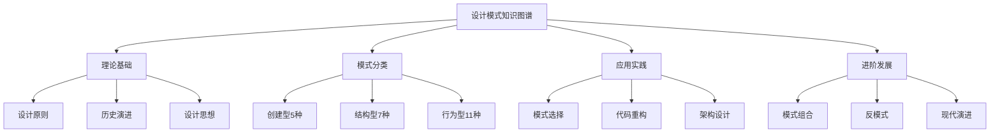

## 🗺️ 知识导航地图

### 🎯 第一层：认知理解

```mermaid
mindmap
  root)(设计模式认知)
    📖 概念理解
      什么是设计模式
      为什么需要设计模式
      何时使用设计模式
    🎯 核心价值
      复用经验
      标准化语言
      提升设计能力
    📈 历史演进
      Gang of Four
      现代应用
      未来趋势
```

### 🎯 第二层：理论体系

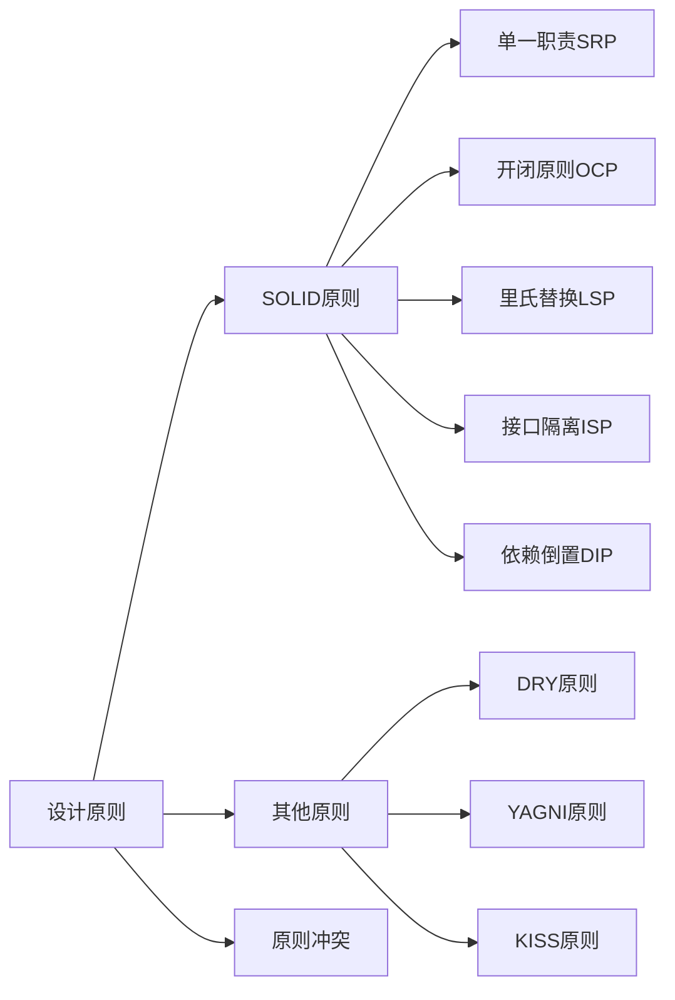

### 🎯 第三层：模式分类

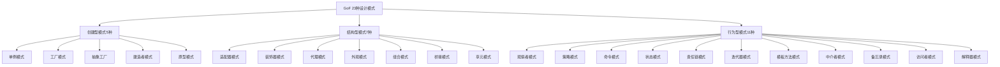

## 🔗 知识点关联网络

### 📋 模式关系矩阵

| 关系类型 | 模式1 | 模式2 | 关系描述 | 应用场景 |
|----------|-------|-------|----------|----------|
| **替代关系** | 工厂模式 | 建造者模式 | 创建复杂对象时选择 | 复杂对象构建 |
| **组合关系** | 外观模式 | 适配器模式 | 简化系统复杂度 | 系统集成 |
| **互补关系** | 观察者 | 策略模式 | 通知中的算法选择 | 事件处理 |
| **演进关系** | 简单工厂 | 抽象工厂 | 扩展为产品族 | 产品线扩展 |
| **竞争关系** | 策略模式 | 状态模式 | 行为变化方式 | 算法切换 |

### 🎯 学习路径优先化

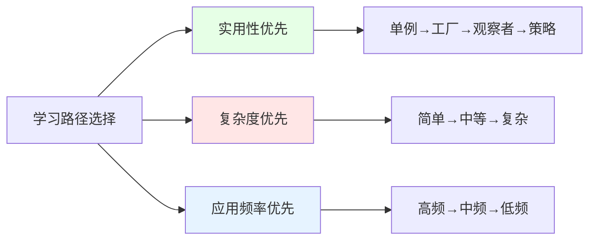

## 🧠 知识理解深度模型

### 📊 布鲁姆认知层级应用

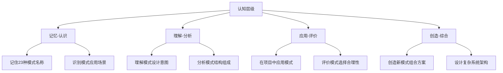

### 🎯 技能发展曲线

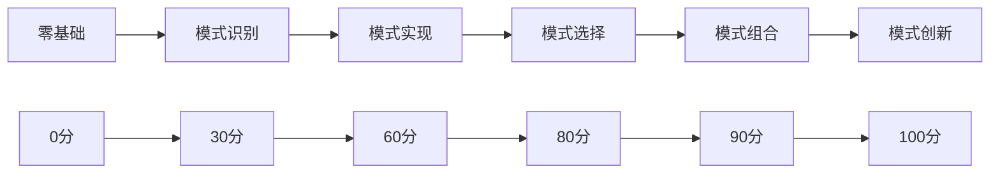

## 🔄 知识应用循环

### 💎 PDCA学习循环

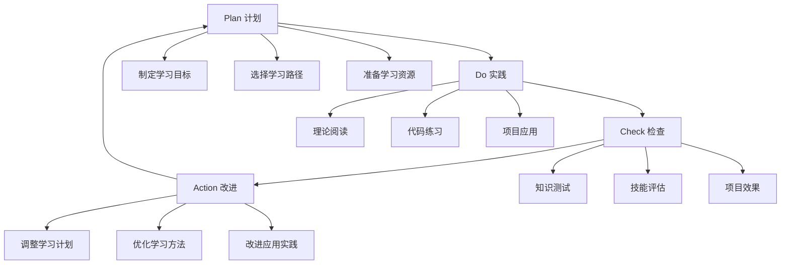

### 🎯 学习阶段里程碑

| 阶段 | 学习目标 | 验证标准 | 持续时间 |
|------|----------|----------|----------|
| **启蒙期** | 建立基础概念 | 能说出模式名称和分类 | 1周 |
| **成长期** | 理解设计原理 | 能解释模式工作机制 | 2-3周 |
| **成熟期** | 能够应用模式 | 能在项目中识别和实现 | 4-6周 |
| **专家期** | 创新模式用法 | 能设计新模式组合 | 3-6个月 |

## 🌐 跨领域知识整合

### 🔗 设计模式与其他技术的关系

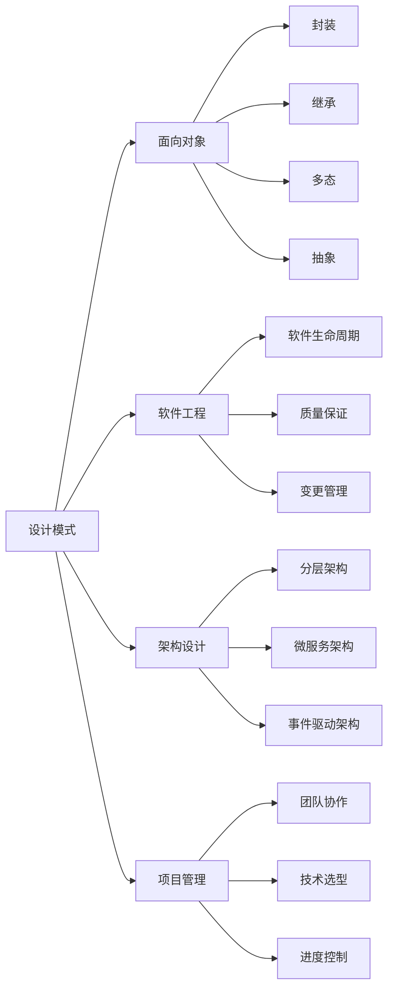

### 💡 技能迁移矩阵

| 源领域 | 目标领域 | 可迁移技能 | 应用效果 |
|--------|----------|------------|----------|
| **设计模式** | **系统架构** | 抽象思维、组件设计 | 🌟🌟🌟🌟🌟 |
| **设计模式** | **团队管理** | 模块化协作、接口管理 | 🌟🌟🌟⭐ |
| **设计模式** | **产品设计** | 适配思维、策略选择 | 🌟🌟🌟⭐ |
| **设计模式** | **创业思维** | 原型迭代、平台思维 | 🌟🌟⭐ |

## 📈 知识运用场景地图

### 🏢 企业应用场景

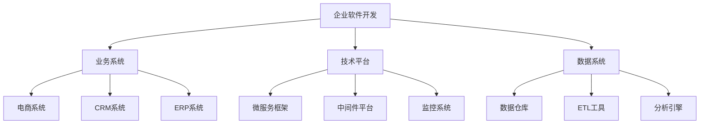

### 🎮 创新应用场景

| 新兴领域 | 设计模式应用 | 创新价值 | 实现案例 |
|----------|-------------|----------|----------|
| **AI/ML** | 策略模式选择算法 | 优化模型性能 | 机器学习平台 |
| **IoT** | 观察者模式处理传感器 | 实时数据处理 | 智能设备管理 |
| **区块链** | 状态模式管理交易 | 确保状态一致性 | 智能合约设计 |
| **游戏开发** | 状态+观察者游戏AI | 智能NPC行为 | 游戏AI系统 |

## 🔮 知识前沿演进

### 🚀 设计模式发展趋势

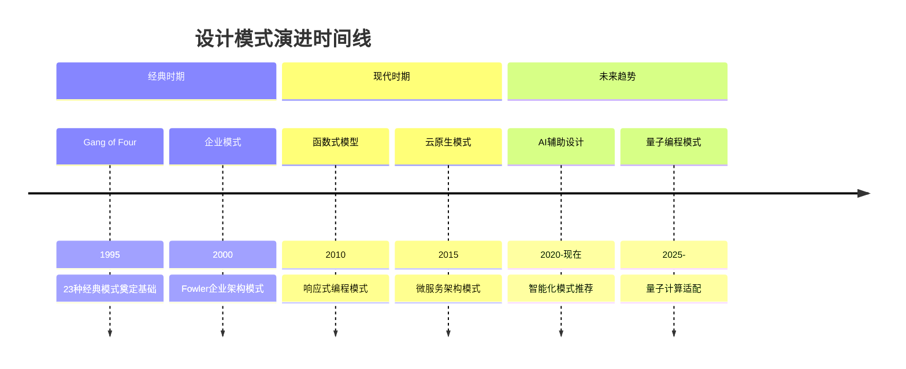

### 🌟 学习资源生态

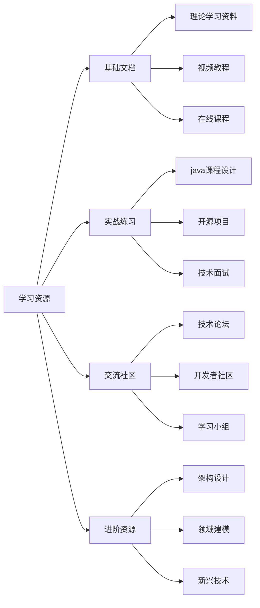

## 📝 个人学习档案

### 🎯 学习进度追踪

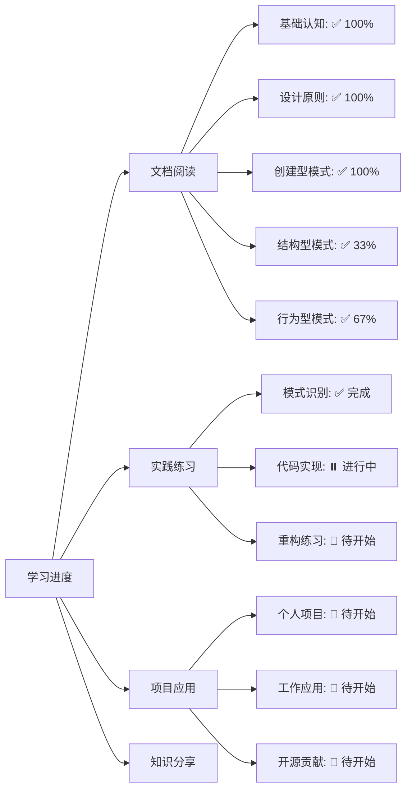

### 📊 知识掌握度评估

| 模式类型 | 理论学习 | 实践应用 | 综合评分 | 改进建议 |
|----------|----------|----------|----------|----------|
| **创建型模式** | ⭐⭐⭐⭐⭐ | ⭐⭐⭐⭐ | ⭐⭐⭐⭐⭐ | 增加组合使用练习 |
| **结构型模式** | ⭐⭐⭐⭐ | ⭐⭐⭐ | ⭐⭐⭐⭐ | 多练习接口适配场景 |
| **行为型模式** | ⭐⭐⭐ | ⭐⭐ | ⭐⭐⭐ | 重点练习观察者策略 |
| **模式识别** | ⭐⭐⭐⭐ | ⭐⭐⭐⭐ | ⭐⭐⭐⭐ | 多参与实际项目评估 |

## 🔗 学习衔接导航

### 📚 知识地图入口
- **新手入门** → [[设计模式学习导航]]
- **深度理解** → [[设计模式学习完成总结]]
- **知识查询** → [[01-基础认知/04-模式快速查询索引]]
- **实践练习** → [[10-学习评测/01-设计模式综合练习]]

### 🎯 学习策略建议
1. **按图索骥**：使用知识图谱规划学习路径
2. **深度学习**：理解模式间的关联和对比
3. **实践验证**：通过项目应用验证理解效果
4. **持续更新**：关注设计模式的最新发展

---
**💡 图谱使用提示**：这个知识图谱是整个设计模式学习体系的"导航仪"，可以帮助你明确学习方向、理解知识点关联、规划学习进度。建议定期回顾，确保学习不偏离主线轨道。
